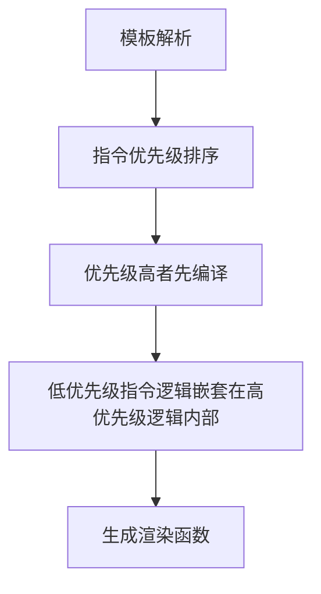

## 一句话概括

**Vue 2 中 `v-for` 优先级高于 `v-if`，二者同时使用时每次渲染都会先遍历全部列表再逐项判断条件，造成不必要的性能浪费；Vue 3 调整为 `v-if` 优先级高于 `v-for`，从根本上杜绝了这种模式，并建议开发者改用 `computed` 过滤或 `<template>` 包裹等更清晰的替代方案。**

## 背景与意义

Vue 作为目前全球最流行的前端框架之一，其模板指令的优先级设计直接影响着成千上万个项目的性能与代码可读性。`v-if` 和 `v-for` 是 Vue 开发者最常用的两个指令——一个负责条件渲染，一个负责列表渲染——当它们出现在同一个元素上时，执行先后顺序就成为一个关键问题。

这个问题之所以重要，不仅仅因为它在实际开发中频繁出现，更因为 Vue 2 到 Vue 3 的迁移过程中，这一优先级规则发生了**颠覆性的反转**。Vue 3 在 2020 年 9 月正式发布后，所有使用 `v-for` + `v-if` 同节点写法的项目都需要重新审查代码逻辑，否则可能因为优先级变化而产生意料之外的渲染结果。

从更宏观的角度看，这一变更折射出 Vue 框架设计哲学的演进：

| 维度 | Vue 2 的设计取舍 | Vue 3 的设计取舍 |
|------|------------------|------------------|
| 性能观 | 倾向灵活使用 | 倾向性能优先 |
| 指令语义 | 指令间无严格顺序约束 | 明确声明优先级层级 |
| 开发者约束 | 宽松，依赖经验优化 | 严格，通过编译器引导最佳实践 |
| 编译优化 | 静态模板优化有限 | Tree-shaking + 静态提升 + 优先级收敛 |

理解这一变化，不仅能帮你写出更高效的 Vue 代码，更能深入理解编译器设计、虚拟 DOM diff 策略以及框架演进背后的权衡逻辑。

## 概念与定义

### `v-for`

`v-for` 是 Vue 中用于列表渲染的指令，基于源数据多次渲染元素或模板块。其基本语法为 `item in items`，支持可选的索引参数 `(item, index) in items`，也支持遍历对象 `(value, key, index) in object`。


```html
<!-- 基本用法 -->
<li v-for="item in items">{{ item.name }}</li>

<!-- 带索引 -->
<li v-for="(item, index) in items" :key="index">{{ index }}: {{ item.name }}</li>

<!-- 遍历对象 -->
<div v-for="(value, key) in object">{{ key }}: {{ value }}</div>
```


`v-for` 在 Vue 3 中推荐始终提供 `:key` 属性，这能帮助虚拟 DOM diff 算法更准确地识别节点复用关系，减少不必要的 DOM 操作。

### `v-if`

`v-if` 是 Vue 中用于条件渲染的指令，根据表达式的真值有条件的渲染元素。当条件为 `false` 时，元素及其子元素不会被渲染到 DOM 中（与 `v-show` 不同，后者只是切换 `display` CSS 属性）。

```html
<!-- 基本用法 -->
<div v-if="isVisible">看到我了</div>

<!-- v-else-if / v-else 链 -->
<div v-if="type === 'A'">类型 A</div>
<div v-else-if="type === 'B'">类型 B</div>
<div v-else>其他类型</div>
```

`v-if` 具有"惰性"特性：初始条件为 `false` 时什么都不做，直到条件第一次变为 `true` 才开始渲染。

### 指令优先级

在 Vue 模板编译器中，指令是按照**严格优先级顺序**依次处理的。编译器在解析模板、生成渲染函数时，会按照预定义的优先级对指令进行排序，优先级低的指令在生成渲染函数时会包裹在优先级高的指令生成的逻辑内部。



在 Vue 2 中，优先级排序（部分）为：
```
v-for > v-if > v-show > v-on > v-bind ...
```

在 Vue 3 中，优先级排序（部分）为：
```
v-if / v-else-if / v-else > v-for > v-show > v-on > v-bind ...
```

## 最小示例

### Vue 2 行为

假设我们有一个待办事项列表，只想渲染未完成的项目：


```html
<div id="app">
  <li v-for="item in items" v-if="!item.done">
    {{ item.text }}
  </li>
</div>
```


```javascript
new Vue({
  el: '#app',
  data: {
    items: [
      { text: '学习 Vue 2', done: false },
      { text: '学习 Vue 3', done: true },
      { text: '迁移项目', done: false },
    ]
  }
})
```

在 Vue 2 中，最终渲染结果（实际只会渲染前两个 li 节点，但中间有一个被 v-if 跳过的注释节点）：

```html
<div id="app">
  <!--  v-if="!item.done"  -->
  <li>学习 Vue 2</li>
  <!--  v-if="!item.done"  -->
  <!--
  <li>学习 Vue 3</li>   ← 这个被 v-if 跳过了，但 v-for 还是遍历到了
  -->
  <!--  v-if="!item.done"  -->
  <li>迁移项目</li>
</div>
```

**关键问题**：即使 `items` 只有 3 项，Vue 2 也会先执行 `v-for` 遍历整个数组，在每次循环中再执行 `v-if` 判断。如果 `items` 有 10000 项但只显示 1 项，那 9999 次遍历都是浪费的。

### Vue 3 行为

完全相同的模板在 Vue 3 中结果截然不同：


```html
<div id="app">
  <li v-for="item in items" v-if="!item.done">
    {{ item.text }}
  </li>
</div>
```


在 Vue 3 中会**直接报错**，因为 `v-if` 优先级高于 `v-for`，编译器先处理 `v-if` 时发现 `item` 变量尚未定义（`v-for` 还没有机会声明 `item`），因此抛出编译警告：

> `Property "item" was accessed during render but is not defined on instance.`

这迫使开发者使用正确的方式——要么用 `<template>` 包裹 `v-if`，要么用 `computed` 预过滤数据。

这一设计转变的本质：**Vue 3 通过编译器层面的约束，强制开发者采用性能更优的代码模式**。

## 核心知识点拆解

### 一、同一个元素上的优先级机制

Vue 模板编译器在处理元素上的多个指令时，会经历三个阶段：

**阶段 1：AST 构建**
编译器将模板字符串解析为抽象语法树（AST），包含元素、属性和指令信息。在这个阶段，所有指令都作为元素的属性被收集。

**阶段 2：指令优先级排序**
在生成渲染函数前，编译器会对 AST 节点的指令列表按优先级排序。

**阶段 3：渲染函数生成**
根据排序后的指令列表，嵌套生成渲染函数代码。优先级高的指令生成外层代码。

### 二、为什么 Vue 3 改变了优先级

Vue 核心团队在 RFC 中对这一变更给出了明确的理由：

**1. 性能优先的框架哲学**

Vue 3 的设计目标之一就是"性能"。在 Vue 2 中，`v-for` + `v-if` 同节点的模式会强制每次渲染都完整遍历一次列表，这种性能开销在大型列表中非常显著。通过将 `v-if` 优先级提升至 `v-for` 之上，Vue 3 从编译器层面销毁了这种低效模式的温床，迫使开发者使用更优的替代方案。

**2. 更符合直觉的声明式语义**

从声明式的角度思考，`v-if` 应该是最外层的条件守卫——"如果条件不满足，就什么都不要遍历"。Vue 2 的 `v-for` 优先意味着条件是嵌套在每次遍历之中的，语义上不够直观。

**3. 消除隐式性能陷阱**

Vue 2 中 `v-for` + `v-if` 的模式看起来无比自然——"我只想显示未完成的项目"——但它隐藏了严重的性能问题。很多新手开发者甚至资深开发者都会不经意地掉入这个陷阱。Vue 3 通过编译器级别的错误提示，迫使开发者意识到这个问题，并主动采用 `computed` 过滤等更好的方案。

此外，这一变更还带来了一个重要的**逻辑正确性收益**：在 Vue 2 中，`v-for` 优先意味着 `v-if` 中可以使用 `v-for` 声明的变量（如 `item`），但这实际上创建了一个隐式的作用域依赖。Vue 3 将 `v-if` 提升到 `v-for` 之上，使变量的作用域关系更清晰——`v-if` 不再能访问未声明的外层变量，这符合 JavaScript 的直觉。

### 三、Vue 3 在什么情况下可以同时使用？

虽然 Vue 3 不允许 `v-if` 和 `v-for` 在**同一个元素**上直接同时使用，但在一种场景下可以间接共存：**在 `<template>` 上使用 `v-for`，在内部元素上使用 `v-if`**。


```html
<!-- ✅ Vue 3 推荐的做法 -->
<template v-for="item in items" :key="item.id">
  <li v-if="item.visible">{{ item.text }}</li>
</template>
```


注意，这里 `v-for` 是在 `<template>` 上（这是 Vue 3 支持的），内部的 `li` 使用 `v-if`。由于 `v-for` 在宏观层面控制遍历，`v-if` 在每次遍历中判断是否渲染，两者的语义和性能都清晰合理——遍历是外层的，条件是内层的，没有指令优先级冲突。

这与 `v-if` + `v-for` 在同一个元素上完全不同，因为这里并没有同节点的优先级冲突。

### 四、替代方案列举

#### 方案 1：使用 computed 预过滤数据（⭐ 推荐）

将条件判断提前到数据层，模板只做遍历。

```javascript
// ✅ 最佳方案
const items = ref([
  { id: 1, text: '任务 A', done: false },
  { id: 2, text: '任务 B', done: true },
  { id: 3, text: '任务 C', done: false },
])

const undoneItems = computed(() => items.value.filter(item => !item.done))
```


```html
<li v-for="item in undoneItems" :key="item.id">
  {{ item.text }}
</li>
```


**优势**：
- 性能最佳：计算属性具有缓存特性，只有当依赖的 `items` 发生变化时才重新计算
- 职责分离：模板只负责渲染，过滤逻辑移到 JavaScript 层
- 可测试性强：`computed` 可以单独单元测试
- 可读性好：变量名（如 `undoneItems`）本身就表达了过滤意图

#### 方案 2：使用 `<template>` 包裹（次选）


```html
<template v-for="item in items" :key="item.id">
  <li v-if="!item.done">{{ item.text }}</li>
</template>
```


**优势**：
- 语义清晰：`v-for` 在外层控制遍历，`v-if` 在内层控制渲染
- 零额外计算开销
- 适合逻辑简单、过滤条件依赖运行时状态的场景

**劣势**：
- `v-if` 每次都执行判断（虽然比 `v-for` 优先的遍历开销小得多）
- 模板层逻辑稍多

#### 方案 3：使用 v-show 替代（特殊场景）

当元素的渲染/隐藏切换非常频繁时，可以考虑用 `v-show` 代替 `v-if`：


```html
<li v-for="item in items" :key="item.id" v-show="!item.done">
  {{ item.text }}
</li>
```


**注意**：`v-show` 只是切换 CSS 的 `display` 属性，元素始终在 DOM 中。这适用于切换频率极高的场景（如用户快速筛选列表），但会额外保留 DOM 节点，不适合大列表或初始隐藏项很多的场景。此外，`v-show` 在 Vue 3 中优先级也低于 `v-for`，但这里的区别在于 `v-show` 可以用在同一个元素上，因为它的作用是"显示/隐藏"而非"渲染/不渲染"，不会与 `v-for` 产生变量作用域的冲突。

## 实战案例

### 案例 1：权限过滤的列表渲染

某管理后台需要根据用户角色显示可操作的功能列表。假设有 200 个功能项，每个用户只能看到有权限的部分。


```javascript
// ❌ Vue 2 时代的写法（低效）
// 每次渲染都遍历全部 200 项
<div v-for="feature in allFeatures" v-if="hasPermission(feature)" :key="feature.id">
  {{ feature.name }}
</div>

// ✅ Vue 3 推荐的写法（高效）
const permittedFeatures = computed(() =>
  allFeatures.filter(feature => hasPermission(feature))
)
<div v-for="feature in permittedFeatures" :key="feature.id">
  {{ feature.name }}
</div>
```


当 `hasPermission` 是计算量较大的逻辑时（比如涉及到角色继承链的判断），使用 `computed` 的缓存优势更加明显。Vue 3 的 `computed` 也在响应式系统（基于 Proxy）上进行了重写，跟踪粒度更细，缓存失效的检查更精确。

### 案例 2：分页器 + 条件过滤

考虑一个带搜索和分页的用户列表：


```javascript
// ❌ 低效写法（Vue 2 兼容但不推荐）
// 每次渲染遍历全部 10000 个用户，再逐项判断
<tr v-for="user in users" v-if="user.name.includes(searchQuery)" :key="user.id">
  <td>{{ user.name }}</td>
  <td>{{ user.email }}</td>
</tr>

// ✅ 高效写法
const filteredUsers = computed(() =>
  users.value.filter(user => user.name.includes(searchQuery.value))
)

const paginatedUsers = computed(() =>
  filteredUsers.value.slice(
    (currentPage.value - 1) * pageSize.value,
    currentPage.value * pageSize.value
  )
)
```



```html
<tr v-for="user in paginatedUsers" :key="user.id">
  <td>{{ user.name }}</td>
  <td>{{ user.email }}</td>
</tr>
```


这种链式 computed 的写法将数据处理分为多个可组合的步骤，每一步都独立缓存。当 `pageSize` 变化时，只有 `paginatedUsers` 重新计算，`filteredUsers` 的缓存仍然有效。这种"关注点分离"的数据处理模式也是 Vue 3 Composition API 所鼓励的。

### 案例 3：双层嵌套场景

有时我们需要在嵌套列表中使用条件判断，这种场景下优先级问题更加复杂：

```javascript
// 分组数据
const groups = ref([
  { id: 1, name: '前端组', members: [
    { id: 1, name: '张三', active: true },
    { id: 2, name: '李四', active: false },
  ]},
  { id: 2, name: '后端组', members: [
    { id: 3, name: '王五', active: true },
  ]},
])
```


```html
<!-- 正确的 Vue 3 写法 -->
<div v-for="group in groups" :key="group.id">
  <h2>{{ group.name }}</h2>
  <div v-for="member in activeMembers(group)" :key="member.id">
    {{ member.name }}
  </div>
</div>
```


这里 `activeMembers` 可以是一个方法或 computed factory：

```javascript
// 方法方式
const activeMembers = (group) => group.members.filter(m => m.active)

// 或者 computed 方式（需要更复杂的设计）
const activeMembersByGroup = computed(() =>
  groups.value.map(group => ({
    ...group,
    activeMembers: group.members.filter(m => m.active)
  }))
)
```

注意：在 Vue 3 中，绝对不要在嵌套循环中将 `v-for` 和 `v-if` 写在同一个元素上，即使是在内层。

## 底层原理

### Vue 2 源码中的优先级定义

打开 Vue 2 源码（`src/compiler/codegen/index.ts`），核心逻辑在 `genElement` 函数中：

```typescript
// Vue 2 源码简化示意
function genElement (el: ASTElement, state: CodegenState): string {
  // 1. 先处理 v-for
  if (el.for && !el.forProcessed) {
    return genFor(el, state)
  }
  // 2. 再处理 v-if
  if (el.if && !el.ifProcessed) {
    return genIf(el, state)
  }
  // 3. 再处理 v-once / v-show 等
  // ...
}
```

`genFor` 返回的渲染函数代码结构大致为：

```javascript
// Vue 2 编译后生成的渲染函数（伪代码）
function render() {
  return _l((items), function(item) {   // _l = renderList，即 v-for
    return (condition)                    // v-if 嵌套在 v-for 内部
      ? _c('li', [_v(_s(item.text))])
      : _e()                              // 空注释节点
  })
}
```

注意这里的核心结构：`_l`（v-for）包裹了 `if` 条件判断。这意味着**无论条件是否满足，都会先调用 `_l` 遍历整个数组**，每次遍历中都执行 `if` 判断。这种结构在算法上等价于 `items.map(item => condition ? render(item) : emptyVNode)`——数组的每个元素都参与了一次函数调用和条件判断。

如果仔细分析 `genFor` 函数的实现，可以看到它生成的渲染函数代码中，`v-for` 的 `_l` 调用返回的是 VNode 数组，而 `v-if` 的 `_e()` 返回的是空注释 VNode。这导致了一个细微但重要的问题：即使某些项的 `v-if` 条件为 `false`，这些项仍然在 VNode 数组中占据位置（以空节点形式存在），这会影响 track-by-key 时的 diff 算法效率。

### Vue 3 源码中的优先级定义

Vue 3 的编译器架构与 Vue 2 完全不同。它采用分阶段编译：

**阶段 1：解析（Parser）**→ 模板 → AST
**阶段 2：转换（Transform）**→ AST → 增强 AST（含指令处理）
**阶段 3：代码生成（Codegen）**→ 增强 AST → 渲染函数

优先级在 `transform` 阶段体现。打开 `packages/compiler-core/src/ast.ts` 可以看到常量和 `transformElement` 中的处理逻辑：

```typescript
// Vue 3 中指令优先级常量定义（简化）
export const enum ConstantTypes {
  // ...
}

// 在 transformElement 中，v-if 和 v-for 的节点处理顺序不同
// 当同一个元素同时有 v-if 和 v-for 时：
// 1. v-if 节点被创建为条件节点（createIfBranch）
// 2. v-for 节点被嵌套在条件分支内部
```

在 Vue 3 的测试用例（`packages/compiler-core/__tests__/compile.spec.ts`）中有明确说明：

```typescript
// Vue 3 测试用例中的注释
// v-if should have higher priority than v-for in Vue 3
// This is the opposite of Vue 2 behavior
```

编译结果大致为：

```javascript
// Vue 3 编译后生成的渲染函数（伪代码）
function render() {
  return condition  // v-if 优先，先判断条件
    ? _l(items, function(item) {  // 条件成立后才遍历
        return _c('li', [_v(_s(item.text))])
      })
    : undefined
}
```

注意核心差异：**`v-if` 在外层，`v-for` 在内层**。只有当 `condition` 为 `true` 时才进入遍历，如果条件为 `false`，整个 `_l`（即整个 `v-for` 的遍历逻辑）都不会执行，数组不会被遍历。

Vue 3 的编译器在处理这种冲突时，甚至会在开发模式下输出编译警告，提示开发者修改代码模式：

```
[vue/compiler-core] v-if should be placed before v-for in Vue 3
```

需要注意的是，Vue 3 的编译器在处理 `v-if` + `v-for` 在同一元素上时，并不是简单地将条件提取到外层，而是将 `v-if` 提升为父级条件节点，`v-for` 仍然是条件分支的子节点。这是一个 AST 层面的重构，意味着编译后的 VNode tree 结构与 Vue 2 有本质区别。

### 优先级反转的深层影响

优先级反转不仅仅是一个"谁先执行"的问题，它对整个渲染系统产生了链式影响：

**1. 响应式追踪的差异**

在 Vue 2 中，由于 `v-for` 优先，即使 `v-if` 跳过了渲染，`v-for` 仍然会访问数组中的每个元素，触发对这些元素的 getter 追踪。这意味着**被 `v-if` 跳过的元素仍然会被响应式系统追踪**，增加了依赖追踪的负担。

在 Vue 3 中，Proxy 响应式系统本身更高效，但更重要的是，`v-if` 优先意味着当条件为 `false` 时，整个 `v-for` 不会执行，被跳过的列表项不会被依赖追踪。

**2. 虚拟 DOM Patch 算法的差异**

Vue 2 的 virtual DOM diff 算法在处理 `v-for` 返回的数组时，需要通过 key 来对比新旧 VNode 树。当有大量被 `v-if` 跳过的空节点时，比对算法的效率会下降。

Vue 3 的 diff 算法基于 block tree 优化，可以跳过静态内容，更精确地定位动态节点。但更重要的是，`v-if` 优先条件下，条件分支外部没有不必要的 VNode，patch 范围被精确控制。

**3. 静态提升（Static Hoisting）的影响**

Vue 3 的编译器对 `v-if` 分支内部的静态内容进行了优化，将其提升到渲染函数外部。但在 `v-for` 循环内部的静态提升受到更多限制（因为每次循环都需要创建新实例）。`v-if` 优先的设计减少了不必要的 `v-for` 执行，间接为静态提升创造了更多机会。

### 对比总结

| 维度 | Vue 2（v-for 优先） | Vue 3（v-if 优先） |
|------|---------------------|---------------------|
| 编译结果结构 | `_l(items, fn(item => if(cond) ...))` | `if(cond) _l(items, ...)` |
| 变量作用域 | v-if 可访问 item | v-if 不可访问 item（导致警告） |
| 性能特性 | 始终遍历全部数组 | 条件假时跳过遍历 |
| 语义清晰度 | 隐晦，容易产生性能陷阱 | 强制开发者采用更好的模式 |
| 编译器行为 | 默认编译，不提供警告 | 开发模式下报警告提示 |
| 对 SSR 的影响 | 完整遍历后筛选 | 条件不满足时跳过，SSR 流更高效 |
| 与 Composition API 的契合度 | 低 | 高（配合 computed + 响应式工具链） |
| 迁移适配成本 | — | 需要改写相关代码 |

## 高频面试题解析

### Q1：Vue 2 和 Vue 3 中 v-if 和 v-for 的优先级有什么不同？

**回答要点**：
- Vue 2：`v-for` 优先级高于 `v-if`。编译器先处理 `v-for`，生成的渲染函数中 `_l` 包裹 `v-if`。每次渲染都会先遍历全部列表，再逐项判断条件。
- Vue 3：`v-if` 优先级高于 `v-for`。编译器先处理 `v-if`，条件不满足时不会遍历数组。当变量依赖于 `v-for`（如 `item`）时，会在开发模式下报警告。
- 需要注意，Vue 3 的编译器和运行时均与原项目不兼容，直接切换版本会导致渲染结果变化甚至报错。

### Q2：如果项目中使用了 Vue 2 的 v-if + v-for 同一节点的写法，如何迁移到 Vue 3？

**回答要点**：
分两种场景迁移：

1. **利用 v-for 的变量进行条件过滤**（最常见的场景）：
   将过滤逻辑提取到 `computed` 属性中：
   ```javascript
   // 迁移方案
   const visibleItems = computed(() =>
     items.value.filter(item => item.visible)
   )
   ```
   模板改为 `v-for="item in visibleItems"`。

2. **不依赖 v-for 变量，只依赖组件外部状态**：
   将 `v-if` 提到父级或使用 `<template>` 包裹。

3. 如果项目规模较大，建议使用 `@vue/eslint-config-standard` 或 `eslint-plugin-vue` 配合 `vue/valid-v-for` 规则，在代码层面扫描并修复所有违规用法。

### Q3：v-if 和 v-show 的区别是什么？什么时候用哪个？

**回答要点**：
| | v-if | v-show |
|------|------|--------|
| DOM 渲染 | 条件假时不渲染 | 始终渲染，切换 display |
| 初始渲染开销 | 条件假时无开销 | 始终有开销 |
| 切换开销 | 高（销毁/重建 DOM + 组件） | 低（仅切换 CSS） |
| 支持 v-else | 是 | 否 |
| 与 v-for 优先级 | Vue 3 中高于 v-for | 低于 v-for |

**选择原则**：
- 切换频繁的场景（如 tab 切换、折叠面板）→ `v-show`
- 切换不频繁、条件在运行时早期就确定的场景 → `v-if`
- 需要配合 `v-else` 链 → `v-if`

### Q4：Vue 3 中除了用 computed 过滤，还有哪些替代方案？

**回答要点**：
1. **`computed` 预过滤**（⭐⭐⭐⭐⭐ 推荐）
2. **`<template>` 包裹**（⭐⭐⭐⭐ 结构清晰，适合逻辑简单的场景）
   
```html
   <template v-for="item in items" :key="item.id">
     <li v-if="condition">{{ item.name }}</li>
   </template>
   ```

3. **`v-show` 替代**（⭐⭐⭐ 适用于切换频繁的简单场景，注意大列表的 DOM 开销）
4. **封装为子组件**（⭐⭐⭐ 适合复杂条件逻辑）
   ```html
   <!-- 父组件 -->
   <item-list :items="items" :filter-key="searchQuery" />
   ```
   在子组件内部处理过滤和遍历逻辑，职责更清晰。
5. **使用 `render` 函数或 JSX**（⭐⭐ 适合极特殊场景，一般不建议为了过滤而换）

### Q5：为什么 Vue 团队不在编译器中自动优化 v-for + v-if 的模式？

**回答要点**：
这是框架设计的哲学问题。Vue 团队认为：

1. **编译器不应猜测开发者意图**：`v-for` + `v-if` 同时使用的模式可能有两种意图——"只遍历满足条件的项"或"遍历所有项但条件性渲染"。编译器无法准确区分。

2. **保持编译器的可预测性**：如果编译器自动优化了 `v-for` + `v-if`，会导致行为与模板语义不一致，增加理解和调试难度。

3. **引导最佳实践**：通过报错和警告，鼓励开发者学习和使用性能更优的模式，这是"教化"功能而非"保姆"功能。

4. **与 Composition API 的协同**：Vue 3 的 Composition API 提供了 `computed`、`watch` 等更强大的数据处理工具，将过滤逻辑放在这些工具中比放在模板中更符合 Composition API 的设计理念。

此外，还有一个工程层面的考量：如果 Vue 3 的编译器尝试"智能"地处理 `v-for` + `v-if`，它需要额外的复杂性来判断是否可以安全地将 `v-if` 提取到 `v-for` 外层（比如 `v-if` 是否依赖了 `item`）。这种"魔法"式的编译器优化会带来不可预测的边界情况，对框架的长期维护不利。

## 总结与扩展

### 核心要点回顾

1. **Vue 2**：`v-for` > `v-if`，同节点使用时先遍历全部再逐项判断，存在性能陷阱
2. **Vue 3**：`v-if` > `v-for`，同节点使用时条件不满足则跳过遍历，并通过编译器警告引导开发者的代码实践
3. **替代方案**：`computed` 预过滤（首选）、`<template>` 包裹（次选）、`v-show`（特殊场景）
4. **迁移注意**：Vue 2 → Vue 3 时需要全面审查 `v-for` + `v-if` 的使用模式，警惕语义变化

### 扩展思考：这只是 Vue 框架演进的一个缩影

`v-if` 和 `v-for` 优先级的变化看似只是一个技术细节，但它折射出 Vue 从 2 到 3 的整体设计哲学转变：

- **从"灵活但容易犯错"到"严格但安全"**：Vue 2 的设计理念是"让开发者自由发挥"，但这种自由有时会带来隐式陷阱（比如 `v-for` + `v-if`、未指定 `:key` 导致的渲染 bug）。Vue 3 在保持易用性的同时，加大了编译器的"把关"力度。

- **从"编译时魔法"到"明确的编译时约束"**：Vue 2 的编译器做了很多隐式的"魔法"（如自动将 `v-for` 提到 `v-if` 之前），这些魔法在提升便利性的同时也增加了理解和调试的难度。Vue 3 的编译器更倾向于"在关键节点报错，让开发者明确控制"。

- **从"零散优化"到"系统性优化"**：Vue 3 的编译优化不仅仅是调整优先级，而是围绕 block tree、静态提升、patch flag 等一整套优化体系构建的。优先级调整只是系统性优化中的一个环节。

这种设计转向也影响了整个 Vue 生态：ESLint 规则更加严格、TypeScript 支持更加完善、DevTools 提供了更细粒度的性能分析工具——整个生态都在向"可预测、可度量、可优化"的方向演进。

### 学习建议

如果你想深入理解这一机制，建议：

1. 在 Vue 2 和 Vue 3 的 **Playground** 中分别尝试 `v-for` + `v-if` 的编译示例，观察渲染函数输出的不同
2. 阅读 Vue 3 源码中 `packages/compiler-core/src/transforms/` 目录下的 `vFor.ts` 和 `vIf.ts`，理解指令转换的具体实现
3. 使用 Vue 3 的 `@vue/compiler-sfc` 编译 .vue 文件，通过 `compileTemplate` 的输出来观察编译结果

---

> **最后更新**：2026 年 6 月 | **适用版本**：Vue 2.x / Vue 3.x | **作者**：大前端技术团队
