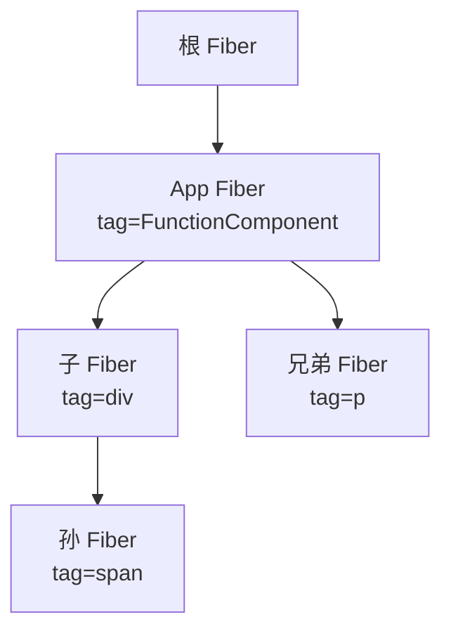

## 一句话概括

React Hooks 的底层并非魔法，而是一条挂载在 `fiber.memoizedState` 上的单向链表——每个 Hook 节点通过 `next` 指针串联，渲染时严格依靠**调用顺序**遍历链表来完成状态读写；一旦条件执行破坏顺序，链表索引错位，状态便全面崩溃。

---

## 背景与意义

2018 年 React 16.8 正式引入 Hooks，函数组件从此拥有了 class 组件的全部能力——状态管理、副作用、上下文、ref 等。然而，Hooks 的设计一经推出，开发者社群就出现了一个高频困扰：

> **为什么 Hooks 不能写在 `if`、`for` 或普通函数里？**

官方文档的答案是：**"Hooks 依赖于稳定的调用顺序"**。但这个"顺序"到底是什么？为什么 Hooks 必须规规矩矩地排好队，一次都不能乱？

答案隐藏在 React 的 Fiber 架构深处：**fiber 节点上的 `memoizedState` 字段是一条单向链表**，Hooks 的所有状态都挂在这条链表上。每次渲染时，React 通过**调用顺序**（而不是名称或 key）来定位每一个 Hook。顺序一旦错乱，链表遍历就会读到错误的状态节点，引发幽灵 Bug。

理解这条链表，不仅能回答上述"为什么"，还能帮你：

- 绕过 `useState` / `useEffect` 的各种隐性陷阱；
- 读懂 ESLint 插件 `eslint-plugin-react-hooks` 的规则原理；
- 编写高质量的自定义 Hooks，避免条件/循环/嵌套错误；
- 深入理解 React DevTools 如何展示 Hooks 状态。

---

## 概念与定义

### Fiber 节点（fiber node）

Fiber 是 React 16+ 引入的全新协调（reconciliation）引擎。每个组件（无论是函数组件还是 class 组件）在内存中都对应一个 **fiber 节点**，它保存了组件的类型、props、state、DOM 信息，以及指向子 fiber、兄弟 fiber、父 fiber 的指针。



### memoizedState

`fiber.memoizedState` 是 fiber 节点上的核心属性之一：

- **class 组件**：`memoizedState` 指向组件的整个 `this.state` 对象（合并后的状态）。
- **函数组件**：`memoizedState` **不指向状态值，而是指向一个 Hook 链表**——一个由各 Hook 节点串联而成的**单向链表**。

### Hook 节点（Hook Node）

每个 Hook（`useState`、`useEffect`、`useRef` 等）在首次挂载（mount）时都会在 fiber 上创建一个对应的 Hook 节点，结构如下（来自 React 源码）：

```typescript
export type Hook = {
  memoizedState: any;      // Hook 当前的状态值
  baseState: any;          // 基础状态（用于 bailout）
  baseQueue: Update<any, any> | null; // 待处理的更新队列
  queue: UpdateQueue<any, any> | null; // 更新队列对象
  next: Hook | null;       // ⭐ 指向链表中的下一个 Hook
};
```

关键点在于 `next`：它将属于同一个组件的所有 Hook 串联成一个**单向链表**。

---

## 最小示例

来看一个最简单的 Hook 使用场景：

```jsx
function Counter() {
  const [count, setCount] = useState(0);      // Hook #1
  const [name, setName] = useState('Alice');   // Hook #2

  useEffect(() => {                            // Hook #3
    document.title = `${name} clicked ${count} times`;
  });

  return (
    <div>
      <p>{name} clicked {count} times</p>
      <button onClick={() => setCount(c => c + 1)}>+1</button>
    </div>
  );
}
```

当 `Counter` 组件首次渲染时，React 在 fiber 上构建如下链表：

```
fiber.memoizedState
    │
    ▼
┌──────────────────┐    ┌──────────────────┐    ┌──────────────────┐
│ Hook #1 (useState)│──►│ Hook #2 (useState)│──►│ Hook #3 (useEffect)│──► null
│ memoizedState: 0  │    │ memoizedState:    │    │ memoizedState:    │
│ queue: ...        │    │   'Alice'         │    │   effect tag,     │
│ next: ───────────►│    │ queue: ...        │    │   destroy fn ...  │
└──────────────────┘    │ next: ───────────►│    │ next: null        │
                        └──────────────────┘    └──────────────────┘
```

第二次挂载（update）时，`Counter` 再次调用 `useState(0)`。此时 React 发现这不是首次渲染，于是走 `updateState` 路径——它**按照调用顺序遍历链表**：

1. 第一次调用 `useState` → 读取链表中第 1 个 Hook 节点的 `memoizedState` → 返回 `0`。
2. 第二次调用 `useState` → 读取链表中第 2 个 Hook 节点的 `memoizedState` → 返回 `'Alice'`。
3. 第三次调用 `useEffect` → 读取第 3 个 Hook 节点 → 执行副作用比对。

每一次渲染，React 都会**从头遍历一次链表**，当前遍历到的节点就是当前 Hook 对应的节点。这个"当前工作指针"由 fiber 上的 `_currentHook`（React 17+ 中为 `currentlyRenderingFiber.memoizedState` 配合一个索引游标实现）维护。

---

## 核心知识点拆解

### 1. mountState 与 updateState：两套分发路径

React 内部通过 `ReactCurrentDispatcher` 来实现 mount 和 update 两套逻辑的分发：

```typescript
// mount 时分发器
const HooksDispatcherOnMount = {
  useState: mountState,
  useEffect: mountEffect,
  useRef: mountRef,
  // ...
};

// update 时分发器
const HooksDispatcherOnUpdate = {
  useState: updateState,
  useEffect: updateEffect,
  useRef: updateRef,
  // ...
};
```

**mount 阶段**（首次渲染）：

- `mountState` 在 `fiber.memoizedState` 链表尾部**创建新节点**。
- 初始化 `memoizedState`、`queue`、`baseState` 等字段。
- 通过 `next` 将新节点链接到链表中。

```typescript
function mountState<S>(initialState: (() => S) | S): [S, Dispatch<BasicStateAction<S>>] {
  const hook = mountWorkInProgressHook();  // ← 在链表尾部创建一个新 Hook 节点
  hook.memoizedState = hook.baseState = typeof initialState === 'function'
    ? initialState()
    : initialState;
  const queue = hook.queue = { ... };
  const dispatch = queue.dispatch = dispatchSetState.bind(null, currentlyRenderingFiber, queue);
  return [hook.memoizedState, dispatch];
}
```

**update 阶段**（后续渲染）：

- `updateState` **按顺序从链表中取出下一个节点**，复用已有节点。
- 处理积压的 `queue` 中的更新（批量更新、优先级调度等）。
- 返回最新的 `memoizedState`。

```typescript
function updateState<S>(initialState: (() => S) | S): [S, Dispatch<BasicStateAction<S>>] {
  const hook = updateWorkInProgressHook();  // ← 移动链表游标到下一个节点（复用）
  const queue = hook.queue;
  // 处理 queue 中的待执行更新，计算新的 memoizedState
  // 返回 [newState, dispatch]
}
```

**关键**：`mountWorkInProgressHook` 在链表尾部**追加**节点；`updateWorkInProgressHook` **顺序取出**下一个节点。两套路径都由"当前已处理的 Hook 索引"驱动。

### 2. 为什么 Hooks 不能条件调用？——链表顺序依赖的致命伤

考虑以下错误代码：

```jsx
function BadComponent({ flag }) {
  const [count, setCount] = useState(0);    // Hook A

  if (flag) {
    const [name, setName] = useState('Bob'); // Hook B — ❌ 条件调用
  }

  useEffect(() => {                         // Hook C
    document.title = `${count}`;
  });
}
```

首次渲染时 `flag = true`，链表构建如下：

```
memoizedState → [Hook A] → [Hook B] → [Hook C] → null
```

第二次渲染时 `flag = false`：

```
首次渲染链：  [Hook A] → [Hook B] → [Hook C] → null
第二次遍历：   取 A         取 B         取 C
               ↓            ↓            ↓
实际调用：   useState(0)  (跳过)      useEffect(...)
               ↓            ↓            ↓
链表匹配：   A✅匹配A     B❌匹配到C   C❌—没有节点了！
```

逻辑解读：

1. 第一次调用 `useState(0)` → 游标指向链表第一个节点，拿到 Hook A 的状态 ✅
2. `if` 条件为 false，跳过了 `useState('Bob')` → 游标不动，它**以为自己拿到了 Hook B**
3. 第三次调用 `useEffect(...)` → 游标指望下一个节点是 Hook C，但实际上它拿到了 Hook B 的节点
4. `useEffect` 被塞进了 `useState` 的节点——状态和副作用全都错位了！

React 会在开发模式报错：

> `React has detected a change in the order of Hooks called by BadComponent.`

**根本原因**：链表遍历依赖的是**调用次数**和**调用顺序**，而不是 Hook 的名称、标识符或 key。每一次 `useXxx()` 调用都对应链表中固定位置的一个节点——React 不看你叫它什么，只看它是第几次被调用的。

### 3. 为什么不能在循环和嵌套函数中调用 Hooks

同理：

```jsx
function LoopComponent({ items }) {
  // ❌ 以下代码会报错：React Hook "useState" is called conditionally
  items.forEach(item => {
    const [state, setState] = useState(item);
  });
}
```

每次渲染时 `items` 的长度可能不同，导致 `useState` 的调用次数不同，链表遍历到对应位置时要么读到错的节点，要么越界。

React 官方提出的"三不"规则（Rules of Hooks）正是基于这一链表实现：

1. **不要在条件语句中调用 Hooks**
2. **不要在循环中调用 Hooks**
3. **不要在普通函数（非 React 函数组件或自定义 Hook）中调用 Hooks**

本质上只有一条：**保证每次渲染中 Hooks 的调用次数和顺序完全一致**。

### 4. 为什么自定义 Hook 也遵守同样的规则

自定义 Hook（例如 `useWindowSize`）最终也是在函数组件内部被调用。它的内部调用的 `useState`、`useEffect` 等 Hook，会**直接成为调用方组件链表的一部分**。链表是扁平的，并不因为自定义 Hook 而插入中间层级。

```jsx
function useWindowSize() {              // 自定义 Hook
  const [size, setSize] = useState({}); // 这个节点直接挂在调用方组件的链表上
  useEffect(() => {                     // 同上
    // ...
  }, []);
  return size;
}

function App() {
  const [count, setCount] = useState(0); // Hook #1
  const size = useWindowSize();          // 内部调用了 useState + useEffect → Hook #2, #3
  const [name, setName] = useState('');  // Hook #4
}
```

App 组件 fiber 上的链表：

```
App.memoizedState →
  Hook#1 (useState: count) → Hook#2 (useState: size) → Hook#3 (useEffect: listener) → Hook#4 (useState: name) → null
```

自定义 Hook 只是逻辑上的抽象，链表层面是**完全透明**的。这也是为什么自定义 Hook 也必须遵循相同的调用顺序规则——它们并没有豁免权。

### 5. 多个同样的 Hook（比如三个 useState）

很多人以为 React 用某种名称或 ID 来区分多个 `useState`。事实上，React 只靠**位置**区分。三个 `useState` 只是链表上三个相邻的节点。状态完全由它们在链表中的次序决定。

```jsx
function ThreeStates() {
  const [a] = useState('first');
  const [b] = useState('second');
  const [c] = useState('third');
}
```

链表：`[useState-a] → [useState-b] → [useState-c] → null`

交换任何一行的位置都会导致全部错位。

---

## 实战案例

### 案例 1：条件调用 Hooks 的真实 Bug

```jsx
function SearchResults({ query, hasFilters }) {
  const [results, setResults] = useState([]);
  const [loading, setLoading] = useState(false);

  // ❌ 条件调用——filter 仅在 hasFilters 时才有
  const [filter, setFilter] = useState(null);
  if (hasFilters) {
    // 注意：即使这里能用，也会破坏顺序
    // 实际上会触发 Hooks 规则警告
  }

  useEffect(() => {
    setLoading(true);
    fetch(`/api/search?q=${query}`).then(res => {
      setResults(res.data);
      setLoading(false);
    });
  }, [query]); // 第二个 useEffect

  // 如果有 filters，需要第二个 effect
  if (hasFilters) {
    useEffect(() => {
      // 这个 effect 会被当作第 3 个 Hook
      // 但条件渲染导致它可能不存在
    }, [filter]);
  }
}
```

**修复方案**：将无条件调用的 Hooks 放在顶部，通过逻辑内部处理条件：

```jsx
function SearchResults({ query, hasFilters }) {
  const [results, setResults] = useState([]);
  const [loading, setLoading] = useState(false);
  const [filter, setFilter] = useState(null); // ✅ 始终存在

  useEffect(() => {
    setLoading(true);
    fetch(`/api/search?q=${query}`).then(res => {
      setResults(res.data);
      setLoading(false);
    });
  }, [query]);

  // ✅ effect 始终存在，内部判断
  useEffect(() => {
    if (!hasFilters) return;
    // 处理 filter 相关的副作用
  }, [hasFilters, filter]);
}
```

### 案例 2：动态表单字段

假设有一个动态表单，根据后端返回的字段配置渲染不同的表单输入：

```jsx
function DynamicForm({ fields }) {
  // ❌ 意图：每个字段一个 useState
  const states = {};
  fields.forEach(field => {
    // ❌ Hook 调用在循环中，违反链表顺序
    // 实际上这段代码会在编译时被 ESLint 拦截
    const [value, setValue] = useState(field.defaultValue);
    states[field.name] = { value, setValue };
  });
}
```

正确的做法是用**一个 `useState` 存一个字典**：

```jsx
function DynamicForm({ fields }) {
  // ✅ 单个 useState，数据结构管理
  const [values, setValues] = useState(() => {
    const initial = {};
    fields.forEach(f => { initial[f.name] = f.defaultValue; });
    return initial;
  });

  const setFieldValue = (name, value) => {
    setValues(prev => ({ ...prev, [name]: value }));
  };
}
```

### 案例 3：测试中验证 Hook 顺序

```jsx
import { renderHook } from '@testing-library/react-hooks';

function useMultipleStates() {
  const [a] = useState('A');
  const [b] = useState('B');
  const [c] = useState('C');
  return { a, b, c };
}

test('状态按顺序对应', () => {
  const { result } = renderHook(() => useMultipleStates());
  expect(result.current.a).toBe('A');
  expect(result.current.b).toBe('B');
  expect(result.current.c).toBe('C');
});
```

在测试框架内部，`renderHook` 也会创建 fiber 和 Hook 链表，其行为与真实渲染完全一致。

---

## 底层原理（结合 React 源码分析）

### React 源码中的 Hook 链表核心代码

以下分析基于 React 18 (tag: v18.2.0)。

#### `mountWorkInProgressHook`——挂载时创建节点

```typescript
// react-reconciler/src/ReactFiberHooks.old.js
function mountWorkInProgressHook(): Hook {
  const hook: Hook = {
    memoizedState: null,
    baseState: null,
    baseQueue: null,
    queue: null,
    next: null,
  };

  // 如果这是组件中的第一个 Hook
  if (workInProgressHook === null) {
    // 将当前 workInProgress fiber 的 memoizedState 指向新 hook
    currentlyRenderingFiber.memoizedState = workInProgressHook = hook;
  } else {
    // 否则将 hook 追加到链表尾部
    workInProgressHook = workInProgressHook.next = hook;
  }
  return workInProgressHook;
}
```

关键逻辑：`workInProgressHook` 是一个全局游标，指向链表尾部。`workInProgressHook.next = hook` 先将下一个指针指向新节点，然后 `workInProgressHook = hook` 把游标移动到新节点——这正是单向链表尾部追加的标准操作。

#### `updateWorkInProgressHook`——更新时遍历节点

```typescript
function updateWorkInProgressHook(): Hook {
  let nextCurrentHook: Hook | null;

  // 如果当前是渲染的第一个 Hook
  if (currentHook === null) {
    const current = currentlyRenderingFiber.alternate;
    if (current !== null) {
      nextCurrentHook = current.memoizedState;
    } else {
      nextCurrentHook = null;
    }
  } else {
    // 继续沿着链表往后走
    nextCurrentHook = currentHook.next;
  }

  // --- 关键断言：如果 nextCurrentHook 为 null，说明链表节点不够用了 ---
  if (nextCurrentHook === null) {
    throw new Error(
      'Rendered more hooks than during the previous render.',
    );
  }

  currentHook = nextCurrentHook;

  // 创建新的 workInProgress Hook（从 current 复制）
  const newHook: Hook = {
    memoizedState: currentHook.memoizedState,
    baseState: currentHook.baseState,
    baseQueue: currentHook.baseQueue,
    queue: currentHook.queue,
    next: null,
  };

  // 将 newHook 追加到 workInProgress fiber 的链表上
  if (workInProgressHook === null) {
    currentlyRenderingFiber.memoizedState = workInProgressHook = newHook;
  } else {
    workInProgressHook = workInProgressHook.next = newHook;
  }
  return workInProgressHook;
}
```

核心体会：

- `nextCurrentHook = currentHook.next` — 每一步都从链表取下一个节点。
- 如果 `nextCurrentHook === null` 但组件还在调 Hook，说明**当前渲染的 Hook 数量多于上次**，React 直接抛错。
- 反过来，如果链表还有剩余节点但组件提前结束遍历，这些节点会在完成阶段被丢弃吗？不会，它们会被保留在 `current` fiber 上，但 `workInProgress` fiber 的链表更短，**React 通过 `workInProgress.memoizedState` 的截断来处理**——还记得链表是 `next` 串联的吗？如果新的链表只有 2 个节点，第 3 个节点就不在 workInProgress 的链表中了（但还在 current 上）。一致性通过 commit 阶段的「双缓冲切换」来保证。

### 双缓冲（double buffering）机制

React Fiber 使用双缓冲架构：每个组件有两种 fiber：

- **current fiber**：当前屏幕上渲染的 fiber（代表已提交的树）
- **workInProgress fiber**：正在构造中的 fiber（代表下一次要渲染的树）

两者通过 `fiber.alternate` 相互引用。

当函数组件进入 render 阶段：

1. React 从 `currentlyRenderingFiber.alternate` 拿到 current fiber。
2. 遍历 current fiber 上的 Hook 链表（`current.memoizedState`），逐个克隆到 workInProgress fiber 上。
3. 如果组件调用了新的 Hook（mount），则在 workInProgress 链表中追加节点。
4. 渲染完成后，current 和 workInProgress 交换角色：`current = workInProgress`。

这意味着 Hook 链表是**跨渲染持久化**的：每个 Hook 节点在 fiber 的生命周期内一直存在，复用而非重建，只在挂载时创建。

### 调度与队列（UpdateQueue）

每个 `useState` 或 `useReducer` 的 Hook 节点上还有一个 `queue` 字段，它持有：

```typescript
type UpdateQueue<S, A> = {
  pending: Update<S, A> | null;     // 环状链表，指向最后一个更新
  dispatch: (A) => mixed;           // setState / dispatch 函数
  lastRenderedReducer: ((S, A) => S) | null;
  lastRenderedState: S | null;
};
```

当调用 `setCount(c => c + 1)` 时，这个更新被包装成一个 `Update` 对象，追加到 `queue.pending`（环状链表）中。下一次渲染时，`updateState` 遍历这个环状链表计算最新状态。

到此我们可以完整描述一条 `useState` 的完整闭环：

```
首次渲染 ──► mountState ──► mountWorkInProgressHook ──► 创建 Hook 节点，追加到链表尾部
                                     │
                                     ▼
                            queue 持有 dispatch(setState)
                                     │
                                     ▼
用户交互 ──► setState(value) ──► dispatchAction ──► 将 Update 入队 queue.pending
                                     │
                                     ▼
                            调度更新（scheduleUpdateOnFiber）
                                     │
                                     ▼
下次渲染 ──► updateState ──► updateWorkInProgressHook ──► 遍历链表找到对应节点
                                     │
                                     ▼
                           从 queue 中取出所有 Update 计算新状态
                                     │
                                     ▼
                           执行 render，返回新状态给组件
```

### 为什么这样设计？

单链表 + 顺序索引的方案，是 React 团队在 Fiber 重构时的深思熟虑：

1. **极致性能**：遍历链表没有哈希查找的开销，只有指针位移。O(n) 的时间复杂度对于通常 < 20 个 Hook 的组件几乎是零成本。
2. **内存紧凑**：每个 Hook 节点只存必须的字段，没有 key、name 等冗余信息。大量组件实例共享 fiber 树结构时，内存节省显著。
3. **与 Fiber 双缓冲天然匹配**：链表拷贝只需 `O(n)` 遍历，无需复杂 diff 或增量更新。
4. **用设计规范规避风险**：强制顺序依赖等于把错误检查推到了静态分析阶段（ESLint 插件），而不是运行时爆炸。

Dan Abramov 在 2018 年的 React Conf 演讲中指出：**"我们考虑过用 key 来标识 Hook，但它会让 Hooks 的 API 变得冗长不已，而且大多数开发者根本用不到那种灵活性；强制顺序规则虽然严格，但它足够简单，容易记忆，并且能被工具自动检查。"**

---

## 高频面试题解析

### Q1：为什么不能在条件语句中使用 Hooks？

**回答思路**：

React 的 Hooks 实现依赖**fiber 上的单向链表**来存储状态。每次渲染时，React 通过函数组件的 Hook 调用顺序来遍历链表，读取或写入对应节点的状态。如果在条件语句中使用 Hook，当条件在不同渲染中发生变化时，Hook 的调用次数和顺序会不一致，导致链表遍历错位——某个 Hook 可能读取到另一个 Hook 的节点数据，从而引发不可预测的 Bug。

**深度加分**：指出 React 18 源码中的 `updateWorkInProgressHook` 函数在 `nextCurrentHook === null` 时会直接抛错。这意味着**调用过多的 Hook** 或**调用过少的 Hook** 都会被运行时捕获，但条件调用导致的"错位"（数量没变但顺序变了）React 无法自动发现——因为它确实拿到了一个节点，但拿错了。

### Q2：useState 返回的 setState 函数是怎么绑定的？为什么每次渲染拿到的 dispatch 是同一个引用？

**回答思路**：

`mountState` 中将 `dispatch` 函数存储在 Hook 节点的 `queue.dispatch` 中。`queue` 对象是在 mount 时创建的，并在整个组件生命周期中保持不变。`updateState` 返回时直接读取这个同一个 `queue.dispatch`。由于 Hook 节点存在 fiber 的链表中跨渲染持久化，所以 `queue.dispatch` 引用始终不变，从而实现了 `setState` 的**引用稳定性**。

**深度加分**：这就是为什么 `useState` 的 dispatch 不需要出现在 `useEffect` 的依赖数组中——它是稳定的 `===` 引用。

### Q3：多个 useEffect 的执行顺序是怎样的？

**回答思路**：

`useEffect` 同样挂载在 Hook 链表中。多个 `useEffect` 按照它们在组件中出现的顺序排列。React 在 commit 阶段遍历链表，**按照链表顺序依次调度副作用**，所以也是按声明顺序执行。

但注意：`useEffect` 的清理函数（cleanup）的执行顺序是**从后往前**（类似于 `componentWillUnmount` 的顺序反向），这与 `useLayoutEffect` 同步执行的顺序不同。

### Q4：useRef 和 useState 在链表层面有什么异同？

**回答思路**：

- **相同点**：两者都创建 Hook 节点，挂在 `fiber.memoizedState` 链表上。
- **不同点**：`useRef` 的 `memoizedState` 直接存储 `{ current: initialValue }` 对象，且**不涉及更新队列**——`ref.current = xxx` 是直接修改，不经过 React 的调度系统。`useState` 的 `memoizedState` 存储实际的状态值，且需要通过 `queue` 中的更新队列来驱动重新渲染。

### Q5：eslint-plugin-react-hooks 的原理是什么？

**回答思路**：

`eslint-plugin-react-hooks` 的核心规则 `rules-of-hooks` 是一个**静态 AST 分析**工具：

1. 它遍历函数的 AST（抽象语法树），识别所有形如 `useXxx` 的调用。
2. 使用"调用图"（call graph）分析：确保每个 Hook 调用都直接位于函数组件或自定义 Hook 的函数体的**顶层**（top-level）。
3. 检测条件包裹（`if`/`switch`/条件表达式）、循环（`for`/`while`/`do-while`）、提前 return 之后的 Hook 调用、嵌套函数中的 Hook 调用等模式。
4. 对自定义 Hook 递归分析：如果函数名以 `use` 开头且内部包含 Hook 调用，检查其内部是否也遵守顶层规则。

**源码层面**：该插件用 ESLint 的 `createRule` 创建规则，核心逻辑在 `getHookCallsFromFunction` 函数中——它收集 AST 中的所有 `CallExpression`，检查其 callee 名是否匹配 Hook 命名模式，然后验证它们的父级节点是否在函数的直接作用域下。

**深度加分**：该插件的 `exhaustive-deps` 规则则是另一个维度——它检查 `useEffect`/`useMemo`/`useCallback` 的依赖数组是否完整。其原理是通过 `@babel/eslint-parser` 解析出 AST，然后对回调函数体中的**所有自由变量**进行闭包引用分析，再与声明的依赖数组做比对。

### Q6：React DevTools 中 Hooks 的展示原理是什么？

**回答思路**：

React DevTools（简称 React DevTools）通过 React 内部的 **DevTools 钩子（`__REACT_DEVTOOLS_GLOBAL_HOOK__`）** 来注入自己的代理逻辑。对于 Hooks 展示：

1. **Fiber 遍历**：DevTools 从根 fiber 开始，递归遍历整棵 fiber 树。
2. **读取 memoizedState**：当遇到 `tag === FunctionComponent` 的 fiber 节点时，DevTools 读取 `fiber.memoizedState` 获取 Hook 链表头。
3. **链表遍历**：DevTools 依次沿着 `.next` 遍历每个 Hook 节点。
4. **节点类型识别**：通过 Hook 节点的结构特征（比如是否有 `queue`、`queue.lastRenderedReducer` 是否是 `basicStateReducer` 等）来判断是 `useState`、`useEffect`、`useRef` 还是自定义 Hook。
5. **展示信息**：
   - `useState`/`useReducer`：展示 `memoizedState` 的值和 dispatch。
   - `useEffect`/`useLayoutEffect`：展示依赖数组（从 effect 节点的 `deps` 读取）和清理函数状态。
   - `useRef`：展示 `current` 值。
   - `useMemo`/`useCallback`：展示计算结果和依赖数组。
   - `useContext`：展示当前 context 值。
6. **自定义 Hook 展开**：DevTools 通过 Hook 的名称推断是否为自定义 Hook（递归读取其子 Hooks）。

**源码位置**：React DevTools 的 `backend/renderer.js` 中的 `getHookData` 函数负责这整个流程。

---

## 总结与扩展

### 本文核心要点

1. **React Hooks 的底层实现依赖 fiber 上的单向链表**（`fiber.memoizedState`），每个 Hook 调用对应链表中的一个节点，通过 `next` 指针串联。

2. **挂载（mount）和更新（update）走不同的分发器**：mount 时在链表尾部创建节点，update 时按调用顺序遍历链表取出节点。状态的正确性完全依赖于两次渲染间 Hooks 的**调用顺序和次数完全一致**。

3. **"Hooks 不能条件调用"不是武断的规则，而是链表实现的必然约束**。条件调用会导致链表遍历错位，状态和副作用全部混乱。

4. **eslint-plugin-react-hooks 使用静态 AST 分析**来保证 Hooks 只在顶层调用，自动拦截条件、循环和嵌套函数中的 Hooks。

5. **React DevTools 通过遍历 fiber 上的 Hook 链表来展示 Hooks 状态**，依靠 Hook 节点的结构特征来做类型推断。

### 为什么理解链表对进阶 React 如此重要？

很多开发者在使用 Hooks 多年后仍然只靠"约定"来编写，一旦遇到内存泄漏、无限重渲染、setState 不更新等诡异问题时，往往无从下手。深入理解 Hook 链表，本质上就是**理解 React 的状态管理模型本身**。它让你：

- 从"死记规则"升级到"理解为什么"；
- 能够预判 Hooks 执行行为的边界情况；
- 在调试复杂自定义 Hooks 时能准确判断问题方向；
- 阅读 React 源码或参与社区讨论时有底层的知识支撑。

### 进一步探索

如果你对这个方向感兴趣，建议继续阅读：

- **React 源码 `ReactFiberHooks.js`**：包含所有 Hook 相关的挂载/更新逻辑，是理解 Hooks 实现的一手资料。
- **React 18 中的并发特性对 Hooks 的影响**：`startTransition`、`useDeferredValue`、`useInsertionEffect` 等新 Hook 的实现分析。
- **React Forget（React 编译器）**：React 团队正在开发的"自动记忆化编译器"，它试图在编译阶段自动插入 `useMemo`/`useCallback`，这背后需要对 Hook 链表和依赖分析有极深的理解。
- **Million.js 和其他编译期优化框架**：这些框架如何在编译阶段消除 Hook 运行时开销？它们的实现原理与 React Hooks 链表的关系是什么？

### 参考文献与资源

1. [React RFC: Hooks (github.com/reactjs/rfcs)](https://github.com/reactjs/rfcs/pull/68)
2. [React Fiber Architecture (react.gg)](https://react.gg/visualized/fiber)
3. [React 源码分析——ReactFiberHooks](https://github.com/facebook/react/blob/main/packages/react-reconciler/src/ReactFiberHooks.js)
4. [eslint-plugin-react-hooks 源码](https://github.com/facebook/react/tree/main/packages/eslint-plugin-react-hooks)
5. [React DevTools 源码](https://github.com/facebook/react/tree/main/packages/react-devtools-shared)
6. [Dan Abramov：React Conf 2018 — "React Today and Tomorrow"](https://www.youtube.com/watch?v=dpw9EHDh2bM)
