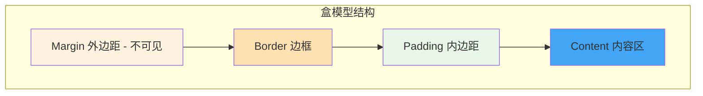

## 一句话概括

CSS 盒模型是布局的基石——每个 HTML 元素都是一个矩形盒子，由 content、padding、border、margin 四个区域组成，理解盒模型精确的尺寸计算方式和 `box-sizing` 的行为差异，是写出可控布局的前提。

## 背景与意义

几乎所有前端工程师在职业生涯中都遇到过一个"幽灵"——一个明明设置了 `width: 200px` 的元素，在页面上却占了 250px 的宽度，右边莫名其妙多出一截。这就是盒模型认知不足的典型症状。

CSS 盒模型听起来是最基础的知识点，但据不完全统计，80% 的 CSS 布局 Bug 最终都归因于盒模型理解偏差。尤其是面对复杂布局时，`padding`、`border`、`margin` 的组合效应会让布局"自己动"。

**这个问题为什么在前端项目里这么重要？**

现代组件化开发中，每个组件都是一个盒子。布局框架（Flex、Grid）虽然解决了排列问题，但盒模型依然是每个盒子内部的控制中心。如果你不知道一个 100px 宽的元素加上 20px 的 padding 后实际占多少空间，你永远无法精确控制布局。

## 概念与定义

### 盒模型的四个区域



每个 HTML 元素的盒子由内向外分为四层：

1. **Content area（内容区）**：显示内容的区域，由 `width` 和 `height` 直接控制
2. **Padding area（内边距区）**：内容区与边框之间的空间，由 `padding` 控制
3. **Border area（边框区）**：边距框的外边界，由 `border` 控制
4. **Margin area（外边距区）**：边框外的透明空间，用于元素间的间距，由 `margin` 控制

### 标准盒模型 vs IE 盒模型

这是盒模型最核心的分歧点：

```
标准盒模型（content-box）：
    元素实际宽度 = width + padding-left + padding-right + border-left + border-right
    元素实际高度 = height + padding-top + padding-bottom + border-top + border-bottom

IE 盒模型（border-box）：
    元素实际宽度 = width  （width 已包含 padding 和 border）
    元素实际高度 = height （height 已包含 padding 和 border）
```

**关键区别：** `width` 属性定义的范围不同。

### box-sizing 属性

```css
/* 默认值：标准盒模型 */
box-sizing: content-box;

/* 折中方案：IE 盒模型（推荐） */
box-sizing: border-box;
```

## 核心知识点拆解

### 1. 标准盒模型（content-box）深度验证

这是一个经典的"意想不到"的布局：

```html
<!-- 示例1：标准盒模型的真实尺寸 -->
<div class="box-content">
  <h3>标准盒模型 (content-box)</h3>
  <p>width: 200px; padding: 20px; border: 5px;</p>
  <p>实际占用宽度 = 200 + 20×2 + 5×2 = <strong>250px</strong></p>
</div>

<style>
.box-content {
  width: 200px;
  height: 100px;
  padding: 20px;
  border: 5px solid #e74c3c;
  margin: 20px;
  background: #f8d7da;
}
</style>
```

实际渲染结果：
- 内容区宽度: 200px
- padding 使内容区内缩: 左右各 20px
- border 再外扩: 左右各 5px
- **元素占用的实际宽度: 200 + 20×2 + 5×2 = 250px**

这就是很多新手直接写 `width: 100%` 后再加 `padding` 导致溢出父容器的根本原因。

### 2. border-box 是如何修复布局的？

```html
<!-- 示例2：border-box 修复溢出的对比 -->
<div class="container">
  <h3>border-box vs content-box 对比</h3>
  <div class="row">
    <div class="box bad">
      <p>content-box</p>
      <p>width: 100%</p>
      <p>padding: 20px</p>
      <p class="note">→ 溢出父容器！</p>
    </div>
    <div class="box good">
      <p>border-box</p>
      <p>width: 100%</p>
      <p>padding: 20px</p>
      <p class="note">→ 完美适配</p>
    </div>
  </div>
</div>

<style>
.container {
  width: 400px;
  border: 2px solid #333;
  padding: 10px;
  font-family: sans-serif;
}
.row {
  display: flex;
  gap: 10px;
}
.box {
  flex: 1;
  width: 100%;       /* 在 flex 项目中实际受 flex 影响 */
  padding: 20px;
  border: 3px solid #3498db;
  background: #d6eaf8;
}

/* 左边的盒子使用默认 content-box */
.box.bad {
  box-sizing: content-box;
}

/* 右边的盒子使用 border-box */
.box.good {
  box-sizing: border-box;
}

.note {
  color: red;
  font-weight: bold;
}
</style>
```

**经验法则：** 在任何生产项目中，第一行 CSS 就应该设置：

```css
/* 全局切换为 border-box，让 width 包含 padding 和 border */
*, *::before, *::after {
  box-sizing: border-box;
}
```

截至 2026 年，几乎所有现代前端框架（Bootstrap、Tailwind CSS、Ant Design）都在其重置样式中默认使用 `border-box`。

### 3. 外边距合并（Margin Collapse）

外边距合并是最容易引发"诡异行为"的 CSS 特性之一。

```html
<!-- 示例3：外边距合并现象 -->
<div class="demo">
  <h3>外边距合并演示</h3>
  
  <div class="merge-container">
    <div class="block block1">第一个块<br>margin-bottom: 30px</div>
    <div class="block block2">第二个块<br>margin-top: 20px</div>
    <p class="result">实际间距：<strong>30px</strong>（不是 50px，取较大值）</p>
  </div>
  
  <div class="merge-container">
    <p class="parent-hint">父容器 margin-top: 20px</p>
    <div class="child-hint">第一个子元素 margin-top: 30px</div>
    <p class="result">父容器折叠到子元素的较大值：<strong>30px</strong></p>
  </div>
</div>

<style>
.demo {
  font-family: sans-serif;
}
.merge-container {
  background: #f0f0f0;
  padding: 10px;
  margin-bottom: 20px;
}
.block {
  width: 200px;
  padding: 10px;
  color: white;
  text-align: center;
}
.block1 {
  background: #e74c3c;
  margin-bottom: 30px;
}
.block2 {
  background: #3498db;
  margin-top: 20px;
}
.result {
  background: #ffeaa7;
  padding: 8px;
  text-align: center;
}

/* 父子外边距合并的演示 */
.parent-hint {
  background: #9b59b6;
  color: white;
  padding: 10px;
  margin-top: 20px;  /* 这个 margin 会与父容器的 margin 合并 */
}
.child-hint {
  background: #1abc9c;
  color: white;
  padding: 10px;
  margin-top: 30px;  /* 取较大值 30px */
}
</style>
```

**外边距合并的三大规则（必须记住）：**

1. **相邻兄弟元素**：两个块级元素的上外边距和下外边距会合并
2. **父子元素**：父元素没有 padding/border/inline-content 时，子元素的外边距会"溢出"到父元素外
3. **空块元素**：没有内容、padding、border 的空块，上下外边距会合并

**如何阻止外边距合并？**

```css
/* 解决方案 */
.parent {
  /* 方法1：加 padding（哪怕 1px） */
  padding: 1px;
  
  /* 方法2：加 border */
  border: 1px solid transparent;
  
  /* 方法3：加 overflow: hidden —— 触发 BFC */
  overflow: hidden;
  
  /* 方法4：用 display: flow-root —— 现代方法 */
  display: flow-root;
  
  /* 方法5：改用 flex/grid 容器（flex/grid 项目不存在外边距合并） */
  display: flex;
  flex-direction: column;
}
```

### 4. 精确的盒模型计算

下面是一个完整的盒模型可视化计算器：

```html
<!-- 示例4：盒模型计算器 -->
<div class="calculator">
  <h3>盒模型计算器</h3>
  
  <div class="controls">
    <label>width: <input type="range" id="width" min="100" max="400" value="250"> <span id="widthVal">250</span>px</label>
    <label>padding: <input type="range" id="padding" min="0" max="50" value="20"> <span id="padVal">20</span>px</label>
    <label>border: <input type="range" id="border" min="0" max="20" value="5"> <span id="borderVal">5</span>px</label>
    <label>margin: <input type="range" id="margin" min="0" max="50" value="15"> <span id="marginVal">15</span>px</label>
  </div>
  
  <div class="model-switch">
    <label><input type="radio" name="box" value="content-box" checked> content-box</label>
    <label><input type="radio" name="box" value="border-box"> border-box</label>
  </div>
  
  <div class="preview-box" id="previewBox">
    内容区
  </div>
  
  <div class="breakdown" id="breakdown">
    <p>内容区宽度: <span id="contentW">250</span>px</p>
    <p>padding: 左 <span id="padL">20</span>px + 右 <span id="padR">20</span>px</p>
    <p>border: 左 <span id="borL">5</span>px + 右 <span id="borR">5</span>px</p>
    <p>margin: 左 <span id="marL">15</span>px + 右 <span id="marR">15</span>px</p>
    <p><strong>实际占用总宽度: <span id="totalW">320</span>px</strong></p>
    <p><strong>元素框宽度: <span id="elemW">300</span>px</strong>（不含 margin）</p>
  </div>
</div>

<style>
.calculator {
  max-width: 600px;
  font-family: sans-serif;
  background: #f8f9fa;
  border-radius: 8px;
  padding: 20px;
}
.controls label {
  display: flex;
  align-items: center;
  gap: 10px;
  margin: 8px 0;
}
.controls input[type="range"] {
  flex: 1;
}
.model-switch {
  margin: 15px 0;
}
.model-switch label {
  margin-right: 20px;
}
.preview-box {
  background: #3498db;
  color: white;
  text-align: center;
  padding: 10px;
  margin: 15px;
  border: 5px solid #2c3e50;
  width: 250px;
  box-sizing: content-box;
}
.breakdown {
  background: white;
  border: 1px solid #ddd;
  border-radius: 4px;
  padding: 15px;
  margin-top: 15px;
}
.breakdown p {
  margin: 5px 0;
}
</style>

<script>
const widthSlider = document.getElementById('width');
const padSlider = document.getElementById('padding');
const borderSlider = document.getElementById('border');
const marginSlider = document.getElementById('margin');
const box = document.getElementById('previewBox');
const radios = document.querySelectorAll('input[name="box"]');

function update() {
  const w = +widthSlider.value;
  const p = +padSlider.value;
  const b = +borderSlider.value;
  const m = +marginSlider.value;
  const boxSizing = document.querySelector('input[name="box"]:checked').value;
  
  document.getElementById('widthVal').textContent = w;
  document.getElementById('padVal').textContent = p;
  document.getElementById('borderVal').textContent = b;
  document.getElementById('marginVal').textContent = m;
  
  box.style.width = w + 'px';
  box.style.padding = p + 'px';
  box.style.borderWidth = b + 'px';
  box.style.margin = m + 'px';
  box.style.boxSizing = boxSizing;
  
  if (boxSizing === 'content-box') {
    const elemW = w + p*2 + b*2;
    const totalW = elemW + m*2;
    document.getElementById('contentW').textContent = w;
    document.getElementById('elemW').textContent = elemW;
    document.getElementById('totalW').textContent = totalW;
  } else {
    const contentW = w - p*2 - b*2;
    const elemW = w;
    const totalW = elemW + m*2;
    document.getElementById('contentW').textContent = Math.max(contentW, 0);
    document.getElementById('elemW').textContent = elemW;
    document.getElementById('totalW').textContent = totalW;
  }
  
  document.getElementById('padL').textContent = p;
  document.getElementById('padR').textContent = p;
  document.getElementById('borL').textContent = b;
  document.getElementById('borR').textContent = b;
  document.getElementById('marL').textContent = m;
  document.getElementById('marR').textContent = m;
}

[widthSlider, padSlider, borderSlider, marginSlider].forEach(s => 
  s.addEventListener('input', update)
);
radios.forEach(r => r.addEventListener('change', update));
update();
</script>
```

### 5. Padding 和 Margin 的百分比计算陷阱

一个极其容易被忽视的知识点：**`padding` 和 `margin` 的百分比值是相对于父元素的宽度（width）计算的，而不是高度！**

```css
/* 示例5：padding 百分比陷阱 — 实现固定比例的容器 */
.container {
  width: 50%;
  background: #eee;
}

/* 想实现一个宽高比 16:9 的容器 */
.aspect-box {
  /* padding 百分比基于父容器宽度 */
  padding-top: 56.25%;           /* 9/16 = 56.25%，保持 16:9 比例 */
  height: 0;                      /* 高度由 padding 撑开 */
  position: relative;             /* 让内部元素绝对定位 */
  background: #2ecc71;
}

.aspect-box .content {
  position: absolute;
  top: 0;
  left: 0;
  right: 0;
  bottom: 0;
  display: flex;
  align-items: center;
  justify-content: center;
  color: white;
}
```

这个技巧在响应式视频容器、固定比例图片容器中非常常用。

## 实战案例

### 场景：构建一个响应式卡片组件

让我们把盒模型知识应用到一个真实卡片组件中，展示 content-box 和 border-box 在响应式布局中的差异。

```html
<!-- 实战案例：响应式卡片组 + 盒模型对比 -->
<div class="card-demo">
  <h3>📋 卡片组件 — 使用 border-box</h3>
  <div class="card-grid">
    <div class="card">
      
      <div class="card-body">
        <h4>卡片标题</h4>
        <p>这是一张使用 border-box 的卡片。padding 和 border 都包含在 width 内，三列布局精确等宽。</p>
        <div class="card-footer">
          <span class="tag">CSS</span>
          <span class="tag">布局</span>
        </div>
      </div>
    </div>
    <div class="card">
      
      <div class="card-body">
        <h4>卡片标题</h4>
        <p>所有卡片高度保持对齐，无论内容多少，因为使用了统一的布局结构。</p>
        <div class="card-footer">
          <span class="tag">HTML</span>
          <span class="tag">CSS</span>
        </div>
      </div>
    </div>
    <div class="card">
      
      <div class="card-body">
        <h4>卡片标题</h4>
        <p>使用 flex 布局，卡片之间的间距由 gap 控制，不受 margin 影响。</p>
        <div class="card-footer">
          <span class="tag">响应式</span>
        </div>
      </div>
    </div>
  </div>
</div>

<style>
.card-demo {
  max-width: 1000px;
  margin: 0 auto;
  font-family: sans-serif;
}

/* 全局重置 — 推荐所有项目这样做 */
.card-demo *,
.card-demo *::before,
.card-demo *::after {
  box-sizing: border-box;
}

.card-grid {
  display: flex;
  gap: 20px;
  flex-wrap: wrap;
}

.card {
  flex: 1 1 300px;              /* 弹性伸缩，最小 300px */
  border: 1px solid #e0e0e0;
  border-radius: 12px;
  overflow: hidden;
  background: white;
  box-shadow: 0 2px 8px rgba(0,0,0,0.08);
  transition: transform 0.2s;
}

.card:hover {
  transform: translateY(-4px);
  box-shadow: 0 4px 16px rgba(0,0,0,0.12);
}

.card-img {
  width: 100%;
  height: 200px;
  object-fit: cover;
  display: block;
}

/* 因为用了 border-box，这里的 width: 100% 包含了 padding */
.card-body {
  padding: 20px;
  width: 100%;
}

.card-body h4 {
  margin: 0 0 10px 0;
  font-size: 18px;
  color: #2c3e50;
}

.card-body p {
  margin: 0 0 15px 0;
  color: #666;
  line-height: 1.6;
}

.card-footer {
  display: flex;
  gap: 8px;
  flex-wrap: wrap;
}

.tag {
  display: inline-block;
  padding: 4px 12px;
  background: #e8f4f8;
  color: #2980b9;
  border-radius: 20px;
  font-size: 12px;
  font-weight: 500;
}

/* 响应式断点 */
@media (max-width: 768px) {
  .card {
    flex: 1 1 100%;   /* 手机端全宽 */
  }
}
</style>
```

这个例子展示了 `border-box` 为什么是现代 CSS 布局的标准——三张卡片的宽度通过 `flex: 1 1 300px` 计算，在添加 `padding: 20px` 后，每张卡片仍然精确对齐，没有溢出。

## 底层原理

### 浏览器渲染流程中的盒模型

浏览器的渲染流水线中，盒模型计算发生在 **Layout（布局）** 阶段：

```
HTML → DOM Tree → Style → Layout → Paint → Composite
                            ↑
                       盒模型计算就在这里
```

在 Layout 阶段，浏览器引擎需要做以下几件事：

1. **生成布局树（Layout Tree）**：为每个可见元素生成一个矩形框
2. **计算包含块**：确定每个元素参考的父容器
3. **应用盒模型公式**：根据 `box-sizing` 确定 `width`/`height` 的分配
4. **处理外边距合并**：计算相邻块的 margin 合并结果
5. **确定最终位置和尺寸**：输出每个元素的精确坐标和大小

### Blink/WebKit 内核中的盒模型计算

以 Chrome 的 Blink 引擎为例，盒模型计算的核心逻辑在 `LayoutBox::computeLogicalWidth` 中：

```
伪代码逻辑：
if (boxSizing == BORDER_BOX) {
    contentWidth = specifiedWidth - paddingLeft - paddingRight - borderLeft - borderRight
} else {
    contentWidth = specifiedWidth  // CONTENT_BOX
}

if (contentWidth < minContentWidth) {
    contentWidth = minContentWidth  // 由内容最小宽度决定
}

// 最终占用宽度
totalWidth = contentWidth + padding + border + margin
```

这解释了为什么当内容过长时，即使设置了 `width`，元素也不会小于内容的 `min-content` 宽度。

## 高频面试题解析

### Q1: `box-sizing: border-box` 为什么推荐全局使用？

这是现代 CSS 开发的事实标准。原因有三：
1. **更符合直觉**：设置 `width: 100%` 就是父容器的 100%，不会被 padding 和 border 撑大
2. **简化计算**：不需要在心里做加法 `width + padding + border`
3. **框架兼容**：Bootstrap 4/5、Tailwind CSS、Ant Design 均已全局使用

配置方式：
```css
/* 最佳实践 */
html {
  box-sizing: border-box;
}
*, *::before, *::after {
  box-sizing: inherit;
}
```

### Q2: 外边距合并的三种场景和解决方案？

**三种场景：**
1. 相邻兄弟块元素的上下 margin 合并（取较大值）
2. 父子块元素的上边缘 margin 合并（取较大值）
3. 空块元素的上下 margin 合并

**解决方案：**
- 触发 BFC（`overflow: hidden`、`display: flow-root`、`position: absolute` 等）
- 使用 `padding` 或 `border` 隔开
- 使用 Flexbox / Grid 布局（Flex 和 Grid 项目不会发生外边距合并）

### Q3: `padding` 和 `margin` 的百分比是如何计算的？

**重要知识点：** 百分比值**始终**相对于父元素的**宽度**（`width`）计算，而不是高度。

```css
.element {
  /* 以下所有百分比都基于父容器宽度 */
  padding-top: 50%;     /* = 父宽度的 50% */
  padding-bottom: 50%;  /* = 父宽度的 50% */
  margin-left: 10%;     /* = 父宽度的 10% */
}
```

这个特性的一个实用场景是创建固定比例容器（如 16:9 视频容器）。

### Q4: CSS 的 `width: auto` 和 `width: 100%` 有什么区别？

- `width: auto`：块级元素默认行为，填满包含块的可用空间，不会加上 margin/padding/border
- `width: 100%`：明确等于父容器的 content width，**然后**再加上 padding、border 和 margin

```css
.child-auto {
  width: auto;         /* 自动填满，但不会溢出 */
  padding: 20px;       /* 安全：内容自动收缩 */
  border: 5px solid;
}

.child-100 {
  width: 100%;         /* 等于父容器宽度 */
  padding: 20px;       /* 危险：100% + 40px > 父容器，溢出！*/
  border: 5px solid;  
}
```

### Q5: `min-width`、`max-width` 和 `width` 的优先级关系是什么？

```
最终宽度规则：
1. 取 width、min-width、max-width 的交集
2. 如果 min-width > width，取 min-width
3. 如果 max-width < width，取 max-width
4. 三者没有冲突时，width 生效

简化公式：
finalWidth = max(min-width, min(max-width, width))
```

## 总结与扩展

盒模型是 CSS 最基础但最容易出问题的知识点。掌握它，你就能：

1. **根治布局溢出**——理解为什么元素会超出父容器
2. **精确控制尺寸**——知道 width 到底包含了什么
3. **理解外边距合并**——不再被诡异间距困扰

**进阶知识点：**
- `min-content` / `max-content` / `fit-content`（CSS Intrinsic & Extrinsic Sizing）
- `contain` 属性（CSS Containment，优化渲染性能）
- 盒模型的 CSS Houdini 底层 API

**一句话总结：** 在任何项目中，第一行 CSS 设置 `*, *::before, *::after { box-sizing: border-box; }` 可以帮你避免 80% 的布局 Bug。
