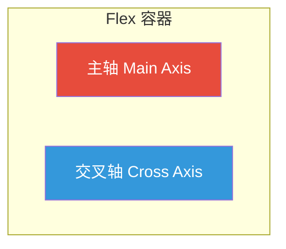

## 一句话概括

Flexbox 是一维布局模型，通过 `flex-direction` 定义主轴方向，让容器内的子元素沿水平或垂直方向灵活排列、自动伸缩、精准对齐——它是现代 CSS 布局中最核心的"万能排班师"。

## 背景与意义

在 Flexbox 出现之前，CSS 布局主要靠什么？`float` 排左浮右，`inline-block` 调垂直对齐，`table` 模拟栅格，`position: absolute` 绝对定位——每一种都是"偷工减料"的布局方式。要做一个最简单的"左侧固定、右侧自适应"两栏布局，你需要写一大堆 hack：

```css
/* 2010 年的两栏布局（惨不忍睹） */
.left {
  float: left;
  width: 200px;
}
.right {
  margin-left: 200px;
  /* 还要考虑 BFC 触发 */
  overflow: hidden;
}
```

Flexbox 在 2009 年由 W3C 提出草案，历经多个版本迭代，到 2015 年获得了所有主流浏览器的稳定支持。它的出现彻底改变了 CSS 布局的游戏规则——**从"把元素推来推去"变成了"告诉容器怎么排"**。

对于前端工程师来说，Flexbox 是日常开发中使用频率最高的布局方案。它解决了：

1. **垂直居中**——CSS 历史上最难的问题之一
2. **等分布局**——不需要计算百分比
3. **弹性伸缩**——容器尺寸变化时自动适应
4. **排列顺序**——不修改 HTML 结构改变元素顺序
5. **等高列**——不同内容高度的列自动对齐

## 概念与定义

### Flex 的两根轴



**主轴（Main Axis）：** 由 `flex-direction` 决定，元素沿这个方向排列
- `row`（默认）：主轴为水平方向，从左到右
- `row-reverse`：主轴水平，从右到左
- `column`：主轴为垂直方向，从上到下
- `column-reverse`：主轴垂直，从下到上

**交叉轴（Cross Axis）：** 垂直于主轴的方向

**相关属性：**

| 作用于容器 | 作用于项目 |
|-----------|-----------|
| `flex-direction` | `order` |
| `flex-wrap` | `flex-grow` |
| `justify-content`（主轴对齐） | `flex-shrink` |
| `align-items`（交叉轴对齐） | `flex-basis` |
| `align-content`（多行对齐） | `align-self` |
| `gap`（间距） | `flex`（简写） |

## 核心知识点拆解

### 1. flex-direction — 方向决定一切

```html
<!-- 示例1：flex-direction 四种排列对比 -->
<div class="flex-demo">
  <h3>flex-direction 对比</h3>
  
  <div class="demo-group">
    <p><strong>row（默认）</strong>：从左到右</p>
    <div class="flex-container row" style="display:flex; flex-direction:row; gap:10px; margin-bottom:20px;">
      <div class="item">1</div>
      <div class="item">2</div>
      <div class="item">3</div>
    </div>
  </div>
  
  <div class="demo-group">
    <p><strong>row-reverse</strong>：从右到左</p>
    <div class="flex-container" style="display:flex; flex-direction:row-reverse; gap:10px; margin-bottom:20px;">
      <div class="item">1</div>
      <div class="item">2</div>
      <div class="item">3</div>
    </div>
  </div>
  
  <div class="demo-group">
    <p><strong>column</strong>：从上到下</p>
    <div class="flex-container col" style="display:flex; flex-direction:column; gap:10px; height:180px; margin-bottom:20px;">
      <div class="item">1</div>
      <div class="item">2</div>
      <div class="item">3</div>
    </div>
  </div>
  
  <div class="demo-group">
    <p><strong>column-reverse</strong>：从下到上</p>
    <div class="flex-container col" style="display:flex; flex-direction:column-reverse; gap:10px; height:180px;">
      <div class="item">1</div>
      <div class="item">2</div>
      <div class="item">3</div>
    </div>
  </div>
</div>

<style>
.flex-demo .item {
  background: #3498db;
  color: white;
  width: 60px;
  height: 50px;
  display: flex;
  align-items: center;
  justify-content: center;
  border-radius: 6px;
  font-size: 18px;
  font-weight: bold;
}
.flex-container.col .item {
  width: 100%;
}
.flex-demo {
  font-family: sans-serif;
}
.flex-demo .demo-group {
  background: #f8f9fa;
  padding: 10px 15px;
  border-radius: 8px;
  margin-bottom: 15px;
}
.flex-demo .demo-group p {
  margin: 0 0 8px 0;
  font-size: 14px;
}
</style>
```

**关键洞察：** 改变 `flex-direction` 会**交换主轴和交叉轴**。这意味着 `justify-content` 和 `align-items` 的行为会对调——当 `flex-direction: column` 时，`justify-content` 控制垂直排列，`align-items` 控制水平对齐。

### 2. justify-content 与 align-items

```html
<!-- 示例2：主轴与交叉轴对齐方式 -->
<div class="align-demo">
  <h3>justify-content + align-items 组合</h3>
  
  <div class="demo-grid">
    <div class="align-card">
      <p>justify-content: flex-start</p>
      <div class="box" style="display:flex; justify-content:flex-start; align-items:center;">
        <div class="dot"></div><div class="dot"></div><div class="dot"></div>
      </div>
    </div>
    
    <div class="align-card">
      <p>justify-content: center</p>
      <div class="box" style="display:flex; justify-content:center; align-items:center;">
        <div class="dot"></div><div class="dot"></div><div class="dot"></div>
      </div>
    </div>
    
    <div class="align-card">
      <p>justify-content: space-between</p>
      <div class="box" style="display:flex; justify-content:space-between; align-items:center;">
        <div class="dot"></div><div class="dot"></div><div class="dot"></div>
      </div>
    </div>
    
    <div class="align-card">
      <p>justify-content: space-around</p>
      <div class="box" style="display:flex; justify-content:space-around; align-items:center;">
        <div class="dot"></div><div class="dot"></div><div class="dot"></div>
      </div>
    </div>
    
    <div class="align-card">
      <p>justify-content: space-evenly</p>
      <div class="box" style="display:flex; justify-content:space-evenly; align-items:center;">
        <div class="dot"></div><div class="dot"></div><div class="dot"></div>
      </div>
    </div>
    
    <div class="align-card">
      <p>align-items: stretch（默认）</p>
      <div class="box tall" style="display:flex; align-items:stretch;">
        <div class="dot tall-item" style="height:auto;">短</div>
        <div class="dot tall-item" style="height:auto;">中</div>
        <div class="dot tall-item" style="height:auto;">长内容</div>
      </div>
    </div>
    
    <div class="align-card">
      <p>align-items: center</p>
      <div class="box tall" style="display:flex; align-items:center;">
        <div class="dot" style="height:30px;"></div>
        <div class="dot" style="height:50px;"></div>
        <div class="dot" style="height:40px;"></div>
      </div>
    </div>
    
    <div class="align-card">
      <p>align-items: flex-end</p>
      <div class="box tall" style="display:flex; align-items:flex-end;">
        <div class="dot" style="height:30px;"></div>
        <div class="dot" style="height:50px;"></div>
        <div class="dot" style="height:40px;"></div>
      </div>
    </div>
  </div>
</div>

<style>
.align-demo {
  font-family: sans-serif;
}
.align-demo .demo-grid {
  display: flex;
  flex-wrap: wrap;
  gap: 15px;
}
.align-demo .align-card {
  flex: 1 1 220px;
  background: #f8f9fa;
  border-radius: 8px;
  padding: 12px;
}
.align-demo .align-card p {
  margin: 0 0 10px 0;
  font-size: 13px;
  color: #555;
  font-weight: 500;
}
.align-demo .box {
  height: 80px;
  background: white;
  border: 2px dashed #ddd;
  border-radius: 4px;
}
.align-demo .box.tall {
  height: 100px;
}
.align-demo .dot {
  background: #e74c3c;
  width: 40px;
  height: 35px;
  border-radius: 4px;
  margin: 2px;
  display: flex;
  align-items: center;
  justify-content: center;
  color: white;
  font-size: 12px;
}
.align-demo .tall-item {
  background: #9b59b6;
  color: white;
  padding: 4px;
  text-align: center;
  font-size: 12px;
}
</style>
```

**align-content 和 align-items 的区别（容易混淆）：**
- `align-items`：单行交叉轴对齐
- `align-content`：多行（`flex-wrap: wrap` 时）整个容器范围内行与行之间的对齐，仅对多行有效

### 3. flex-grow / flex-shrink / flex-basis

这是 Flexbox 最强大但最让人困惑的部分。理解这三个属性是掌握弹性布局的关键。

```html
<!-- 示例3：flex-grow 弹性增长对比 -->
<div class="grow-demo">
  <h3>flex-grow 弹性增长</h3>
  
  <div class="grow-section">
    <p><strong>容器宽度 600px，三个项目，flex-basis 均为 100px</strong></p>
    <p>剩余空间 = 600 - 100×3 = <strong>300px</strong></p>
  </div>
  
  <div class="grow-case">
    <p>flex-grow: 0（不增长）</p>
    <div class="grow-container" style="display:flex;">
      <div class="grow-item" style="flex: 0 0 100px;">100px</div>
      <div class="grow-item" style="flex: 0 0 100px;">100px</div>
      <div class="grow-item" style="flex: 0 0 100px;">100px</div>
    </div>
  </div>
  
  <div class="grow-case">
    <p>flex-grow: 1（三等分剩余空间，每个加 100px）</p>
    <div class="grow-container" style="display:flex;">
      <div class="grow-item" style="flex: 1 0 100px;">200px</div>
      <div class="grow-item" style="flex: 1 0 100px;">200px</div>
      <div class="grow-item" style="flex: 1 0 100px;">200px</div>
    </div>
  </div>
  
  <div class="grow-case">
    <p>flex-grow: 1:2:3（按比例分配 300px → 50:100:150）</p>
    <div class="grow-container" style="display:flex;">
      <div class="grow-item" style="flex: 1 0 100px; background:#3498db;">150px</div>
      <div class="grow-item" style="flex: 2 0 100px; background:#2ecc71;">200px</div>
      <div class="grow-item" style="flex: 3 0 100px; background:#e74c3c;">250px</div>
    </div>
  </div>
</div>

<style>
.grow-demo {
  font-family: sans-serif;
}
.grow-section {
  background: #f0f7ff;
  padding: 10px 15px;
  border-radius: 8px;
  margin-bottom: 15px;
}
.grow-section p {
  margin: 5px 0;
  font-size: 14px;
}
.grow-case {
  margin-bottom: 15px;
}
.grow-case p {
  margin: 0 0 5px 0;
  font-size: 13px;
  font-weight: 500;
  color: #555;
}
.grow-container {
  width: 600px;
  background: #f0f0f0;
  border-radius: 4px;
  padding: 5px;
}
.grow-item {
  height: 40px;
  display: flex;
  align-items: center;
  justify-content: center;
  color: white;
  font-size: 13px;
  font-weight: bold;
  background: #e74c3c;
  border-radius: 4px;
  margin: 2px;
}
</style>
```

**核心公式：**

```
最终宽度 = flex-basis + (剩余空间 × flex-grow / 总 flex-grow)
         - (溢出空间 × flex-shrink / 总 flex-shrink)
```

**flex 简写：**

```css
/* 常用组合 */
flex: 1;             /* flex: 1 1 0%  → 等分剩余空间 */
flex: auto;          /* flex: 1 1 auto → 以内容大小为基准 */
flex: initial;       /* flex: 0 1 auto → 默认值，不增长但可收缩 */
flex: none;          /* flex: 0 0 auto → 固定大小 */

/* 等价写法 */
flex: 1 1 200px;     /* 基准 200px，可伸缩 */
flex: 0 1 300px;     /* 基准 300px，可缩小不可增大 */
```

### 4. 垂直居中 — Flex 的最强应用

垂直居中是 CSS 历史上最难解决的问题之一。Flexbox 让它变得极其简单：

```html
<!-- 示例4：Flex 垂直居中 -->
<div class="center-demo">
  <h3>Flex 垂直居中</h3>
  
  <div class="center-compare">
    <div class="center-method">
      <p>水平居中</p>
      <div class="center-box horz">
        <span class="center-content">justify-content: center</span>
      </div>
    </div>
    
    <div class="center-method">
      <p>垂直居中</p>
      <div class="center-box vert">
        <span class="center-content">align-items: center</span>
      </div>
    </div>
    
    <div class="center-method">
      <p>完全居中（垂 + 水）</p>
      <div class="center-box both">
        <span class="center-content">❤️ 最简单的方法 ❤️</span>
      </div>
    </div>
  </div>
  
  <div class="known-tip">
    <h4>💡 现代居中方案对比</h4>
    <table>
      <tr><th>方案</th><th>代码量</th><th>适用场景</th></tr>
      <tr><td>Flexbox</td><td>3行</td><td>所有现代浏览器</td></tr>
      <tr><td>Grid</td><td>3行</td><td>二维布局中的居中</td></tr>
      <tr><td>position + transform</td><td>5行</td><td>需要兼容旧浏览器</td></tr>
      <tr><td>margin: auto</td><td>1行</td><td>块级元素的水平居中</td></tr>
    </table>
  </div>
</div>

<style>
.center-demo {
  font-family: sans-serif;
}
.center-demo .center-compare {
  display: flex;
  gap: 20px;
  flex-wrap: wrap;
}
.center-demo .center-method {
  flex: 1 1 200px;
  background: #f8f9fa;
  border-radius: 8px;
  padding: 15px;
}
.center-demo .center-method p {
  margin: 0 0 10px 0;
  font-weight: 500;
  font-size: 14px;
}
.center-demo .center-box {
  height: 150px;
  background: #e3f2fd;
  border: 2px solid #90caf9;
  border-radius: 6px;
}
.center-demo .center-box.horz {
  display: flex;
  justify-content: center;
}
.center-demo .center-box.vert {
  display: flex;
  align-items: center;
}
.center-demo .center-box.both {
  display: flex;
  justify-content: center;
  align-items: center;
}
.center-demo .center-content {
  background: #1976d2;
  color: white;
  padding: 10px 20px;
  border-radius: 6px;
  font-size: 13px;
}
.center-demo .known-tip {
  margin-top: 20px;
  background: #f0f7ff;
  padding: 15px;
  border-radius: 8px;
}
.center-demo .known-tip h4 {
  margin: 0 0 10px 0;
}
.center-demo table {
  width: 100%;
  border-collapse: collapse;
  font-size: 13px;
}
.center-demo th, .center-demo td {
  border: 1px solid #ddd;
  padding: 8px;
  text-align: left;
}
.center-demo th {
  background: #e3f2fd;
}
</style>
```

### 5. flex-wrap 与响应式布局

```html
<!-- 示例5：flex-wrap 响应式案例 — 翻牌效果 -->
<div class="wrap-demo">
  <h3>flex-wrap 响应式网格</h3>
  
  <div class="wrap-info">
    <p><strong>flex-wrap: wrap</strong> — 容器宽度不够时自动换行</p>
  </div>
  
  <div class="responsive-grid" style="display:flex; flex-wrap:wrap; gap:15px;">
    <div class="grid-card">
      <div class="card-icon">🎨</div>
      <h4>设计系统</h4>
      <p>统一的设计语言和组件规范</p>
    </div>
    <div class="grid-card">
      <div class="card-icon">⚡</div>
      <h4>性能优化</h4>
      <p>加载性能与运行时性能全面提升</p>
    </div>
    <div class="grid-card">
      <div class="card-icon">🔒</div>
      <h4>安全加固</h4>
      <p>XSS、CSRF 等安全防护</p>
    </div>
    <div class="grid-card">
      <div class="card-icon">🌐</div>
      <h4>国际化</h4>
      <p>多语言多区域支持</p>
    </div>
    <div class="grid-card">
      <div class="card-icon">📱</div>
      <h4>响应式</h4>
      <p>全终端适配方案</p>
    </div>
    <div class="grid-card">
      <div class="card-icon">🚀</div>
      <h4>CI/CD</h4>
      <p>自动化构建与部署</p>
    </div>
  </div>
  
  <div class="code-block">
    <pre><code>
/* 核心代码：一行实现响应式网格 */
.responsive-grid {
  display: flex;
  flex-wrap: wrap;
  gap: 15px;
}

.grid-card {
  flex: 1 1 200px;   /* 最小宽度 200px，可伸缩 */
  /* 容器宽度 < 430px 时自动变成单列 */
}
    </code></pre>
  </div>
</div>

<style>
.wrap-demo {
  font-family: sans-serif;
}
.wrap-demo .wrap-info {
  background: #f0f7ff;
  padding: 10px 15px;
  border-radius: 8px;
  margin-bottom: 15px;
}
.wrap-demo .responsive-grid {
  display: flex;
  flex-wrap: wrap;
  gap: 15px;
  margin-bottom: 20px;
}
.wrap-demo .grid-card {
  flex: 1 1 200px;
  background: white;
  border: 1px solid #e0e0e0;
  border-radius: 12px;
  padding: 20px;
  text-align: center;
  transition: transform 0.2s, box-shadow 0.2s;
}
.wrap-demo .grid-card:hover {
  transform: translateY(-3px);
  box-shadow: 0 4px 12px rgba(0,0,0,0.1);
}
.wrap-demo .card-icon {
  font-size: 40px;
  margin-bottom: 10px;
}
.wrap-demo .grid-card h4 {
  margin: 0 0 8px 0;
  color: #2c3e50;
}
.wrap-demo .grid-card p {
  margin: 0;
  font-size: 13px;
  color: #666;
}
.wrap-demo .code-block {
  background: #2d2d2d;
  border-radius: 8px;
  padding: 5px;
  overflow-x: auto;
}
.wrap-demo .code-block pre {
  margin: 0;
}
.wrap-demo .code-block code {
  color: #f8f8f2;
  font-size: 13px;
  line-height: 1.6;
}
</style>
```

## 实战案例

### 场景：构建一个完整的导航栏 + 主内容区 + 底部布局

```html
<!-- 实战案例：Flex 实现完整页面布局 -->
<div class="page-layout">
  <h3>📐 Flex 页面布局实战</h3>

  <!-- 导航栏 -->
  <nav class="navbar">
    <div class="logo">MyApp</div>
    <ul class="nav-links">
      <li><a href="#">首页</a></li>
      <li><a href="#">产品</a></li>
      <li><a href="#">文档</a></li>
      <li><a href="#">价格</a></li>
    </ul>
    <div class="nav-actions">
      <button class="btn-outline">登录</button>
      <button class="btn-primary">注册</button>
    </div>
  </nav>

  <!-- 内容区 -->
  <div class="content-area">
    <!-- 侧边栏 -->
    <aside class="sidebar">
      <h4>导航</h4>
      <ul>
        <li>📁 项目 A</li>
        <li>📁 项目 B</li>
        <li>📁 项目 C</li>
        <li>📁 项目 D</li>
      </ul>
      <div class="sidebar-footer">
        <p>存储使用量</p>
        <div class="progress-bar">
          <div class="progress-fill" style="width:65%"></div>
        </div>
        <span>65%</span>
      </div>
    </aside>
    
    <!-- 主内容 -->
    <main class="main-content">
      <h2>Flex 布局实战案例</h2>
      <div class="card-list">
        <div class="demo-card">
          <h4>弹性导航</h4>
          <p class="card-desc">justify-content: space-between 让 logo、菜单、操作按钮自动分布在两端</p>
          <span class="tag">justify-content</span>
        </div>
        <div class="demo-card">
          <h4>内容区域</h4>
          <p class="card-desc">flex: 1 让主内容区填满剩余空间，侧边栏固定宽度</p>
          <span class="tag">flex-grow</span>
        </div>
        <div class="demo-card">
          <h4>操作栏</h4>
          <p class="card-desc">align-items: center 让不同高度的元素垂直居中</p>
          <span class="tag">align-items</span>
        </div>
        <div class="demo-card">
          <h4>响应式卡片</h4>
          <p class="card-desc">flex-wrap + flex: 1 1 250px 实现自动换行的卡片网格</p>
          <span class="tag">flex-wrap</span>
        </div>
      </div>
    </main>
  </div>

  <!-- 底部 -->
  <footer class="footer">
    <p>© 2026 MyApp. Flexbox 让布局如此简单。</p>
  </footer>
</div>

<style>
/* ====== 全局 ====== */
.page-layout {
  font-family: sans-serif;
  border: 2px solid #e0e0e0;
  border-radius: 12px;
  overflow: hidden;
}
.page-layout > h3 {
  padding: 15px;
  margin: 0;
  background: #f8f9fa;
  border-bottom: 1px solid #e0e0e0;
}

/* ====== 导航栏 ====== */
.navbar {
  display: flex;
  align-items: center;
  justify-content: space-between;
  padding: 12px 20px;
  background: #fff;
  border-bottom: 1px solid #eee;
}
.logo {
  font-size: 20px;
  font-weight: bold;
  color: #3498db;
}
.nav-links {
  display: flex;
  list-style: none;
  gap: 25px;
  margin: 0;
  padding: 0;
}
.nav-links a {
  text-decoration: none;
  color: #555;
  font-size: 14px;
}
.nav-links a:hover {
  color: #3498db;
}
.nav-actions {
  display: flex;
  gap: 10px;
}
.nav-actions button {
  padding: 8px 16px;
  border-radius: 6px;
  border: 1px solid #3498db;
  font-size: 13px;
  cursor: pointer;
}
.btn-outline {
  background: transparent;
  color: #3498db;
}
.btn-primary {
  background: #3498db;
  color: white;
}

/* ====== 内容区域 ====== */
.content-area {
  display: flex;
  min-height: 400px;
}

/* ====== 侧边栏 ====== */
.sidebar {
  width: 220px;
  background: #f8f9fa;
  padding: 20px;
  display: flex;
  flex-direction: column;
  border-right: 1px solid #e0e0e0;
}
.sidebar h4 {
  margin: 0 0 15px 0;
  font-size: 14px;
  color: #333;
}
.sidebar ul {
  list-style: none;
  padding: 0;
  margin: 0;
}
.sidebar ul li {
  padding: 8px 12px;
  border-radius: 6px;
  font-size: 13px;
  color: #555;
  cursor: pointer;
}
.sidebar ul li:hover {
  background: #e8f4f8;
  color: #2980b9;
}
.sidebar-footer {
  margin-top: auto;
  padding-top: 20px;
  border-top: 1px solid #e0e0e0;
}
.sidebar-footer p {
  margin: 0 0 8px 0;
  font-size: 12px;
  color: #888;
}
.progress-bar {
  height: 6px;
  background: #e0e0e0;
  border-radius: 3px;
  overflow: hidden;
  margin-bottom: 5px;
}
.progress-fill {
  height: 100%;
  background: #3498db;
  border-radius: 3px;
}
.sidebar-footer span {
  font-size: 11px;
  color: #888;
}

/* ====== 主内容 ====== */
.main-content {
  flex: 1;
  padding: 20px;
}
.main-content h2 {
  margin: 0 0 20px 0;
  font-size: 22px;
  color: #2c3e50;
}
.card-list {
  display: flex;
  flex-wrap: wrap;
  gap: 15px;
}
.demo-card {
  flex: 1 1 250px;
  background: white;
  border: 1px solid #e8e8e8;
  border-radius: 10px;
  padding: 18px;
}
.demo-card h4 {
  margin: 0 0 10px 0;
  font-size: 16px;
  color: #2c3e50;
}
.demo-card .card-desc {
  margin: 0 0 12px 0;
  font-size: 13px;
  color: #666;
  line-height: 1.5;
}
.demo-card .tag {
  display: inline-block;
  padding: 3px 10px;
  background: #e8f4f8;
  color: #2980b9;
  border-radius: 12px;
  font-size: 11px;
  font-weight: 500;
}

/* ====== 底部 ====== */
.footer {
  padding: 15px 20px;
  background: #2c3e50;
  color: white;
  text-align: center;
}
.footer p {
  margin: 0;
  font-size: 13px;
}
</style>
```

## 底层原理

### Flex 布局的计算流程

浏览器的 Flex 布局计算分为三个步骤：

**Step 1：确定可用空间**
```
1. 确定 flex 容器的主轴方向（flex-direction）
2. 确定主轴上的可用空间 = 容器尺寸 - padding - gap
3. 确定交叉轴上的可用空间
```

**Step 2：弹性计算**
```
1. 将所有 flex 项目的 flex-basis 值相加
2. 如果总和 < 容器空间 → 正剩余空间 → 按 flex-grow 比例分配
3. 如果总和 > 容器空间 → 负剩余空间 → 按 flex-shrink × flex-basis 比例缩减
4. min-content 和 max-content 约束
```

**Step 3：对齐排列**
```
1. 根据 justify-content 在主轴方向排列项目
2. 根据 align-items / align-self 在交叉轴方向对齐
3. 如果是多行，根据 align-content 处理行间对齐
```

### Flex 的最小内容约束

一个常见的问题：为什么设置了 `flex: 1` 的元素宽度仍然不是 0？

```html
<div class="container" style="display:flex;">
  <div class="item" style="flex:1;">
    <span style="white-space:nowrap;">这段文本不换行，会撑大 flex 项目</span>
  </div>
  <div class="item" style="flex:1;">短</div>
</div>
```

这是因为 Flex 项目有最小内容宽度约束（`min-width: auto`），内容不换行时，项目宽度不会小于内容宽度。解决方案：

```css
.item {
  min-width: 0;      /* 允许缩小到 0 */
  overflow: hidden;  /* 或 visible 外的其他值 */
}
```

## 高频面试题解析

### Q1: `flex: 1`、`flex: auto`、`flex: none`、`flex: initial` 的区别？

```css
flex: 1;        /* flex-grow: 1, flex-shrink: 1, flex-basis: 0% → 等分剩余空间 */
flex: auto;     /* flex-grow: 1, flex-shrink: 1, flex-basis: auto → 以内容大小为基准 */
flex: none;     /* flex-grow: 0, flex-shrink: 0, flex-basis: auto → 固定大小 */
flex: initial;  /* flex-grow: 0, flex-shrink: 1, flex-basis: auto → 默认值 */
```

最容易混淆的是 `flex: 1` 和 `flex: auto`：
- `flex: 1`：所有项目先归零（`flex-basis: 0%`），再等分剩余空间 → 严格等宽
- `flex: auto`：先按内容大小分配（`flex-basis: auto`），再等分剩余空间 → 内容多的更宽

### Q2: `justify-content: space-between`、`space-around`、`space-evenly` 有什么区别？

```
space-between: 项目两端对齐，项目之间的间隔相等，首个项目在起点，末尾项目在终点
space-around:  每个项目两侧间隔相等，因此最左和最右的间隔是中间间隔的一半
space-evenly:  所有间隔完全相等（包括两端）

图示（3个项目）：
|●    ●    ●|   space-between  （两端无间隔）
|  ●  ●  ●  |   space-around   （两端有半个间隔）
|  ●  ●  ●  |   space-evenly   （所有间隔相等）
```

### Q3: `align-items` 和 `align-content` 有什么区别？

- `align-items`：单行项目在交叉轴上的对齐方式（作用于每一行内部）
- `align-content`：多行情况下，行与行之间的对齐方式（作用于整个容器）
- 仅当 `flex-wrap: wrap` 且内容换行产生多行时，`align-content` 才生效
- 如果只有一行，`align-content` 不生效

### Q4: Flex 项目中设置 `width` 和 `flex-basis` 哪个优先？

如果同时设置了 `width` 和 `flex-basis`：
- `flex-basis` 优先级更高（`flex-basis` 覆盖 `width`）
- 但如果有 `min-width` 或 `max-width`，它们的优先级高于 `flex-basis`

```css
.item {
  width: 200px;       /* 被 flex-basis 覆盖 */
  flex-basis: 300px;  /* 生效 */
}
```

### Q5: 如何让 Flex 项目内容过长时不撑大项目？

```css
.flex-item {
  min-width: 0;        /* 允许项目缩小到 0 */
  overflow: hidden;     /* 隐藏溢出内容 */
  text-overflow: ellipsis; /* 文字溢出显示省略号 */
  white-space: nowrap;  /* 不换行（可选）*/
}
```

核心在于 `min-width: 0`。Flex 项目的 `min-width` 默认是 `auto`（不能小于内容最小宽度），手动设置为 `0` 后就允许它收缩到内容宽度以下。

## 总结与扩展

Flexbox 是 CSS 布局历史上的分水岭——它之前是 hack 时代，它之后是"声明式布局"时代。

**掌握 Flexbox 的关键心法：**
1. 永远先确定主轴方向（`flex-direction`）
2. 主轴用 `justify-content`，交叉轴用 `align-items`
3. `flex-wrap` 决定换行行为
4. `flex-grow/shrink/basis` 决定弹性伸缩
5. 遇到撑大问题先检查 `min-width: 0`

**进阶学习：**
- CSS Grid（二维布局，与 Flexbox 互补）
- `gap` 在 Flexbox 中的浏览器兼容性
- `aspect-ratio` 属性与 Flex 的结合使用
- `contain: layout style paint size` 优化 Flex 渲染性能
