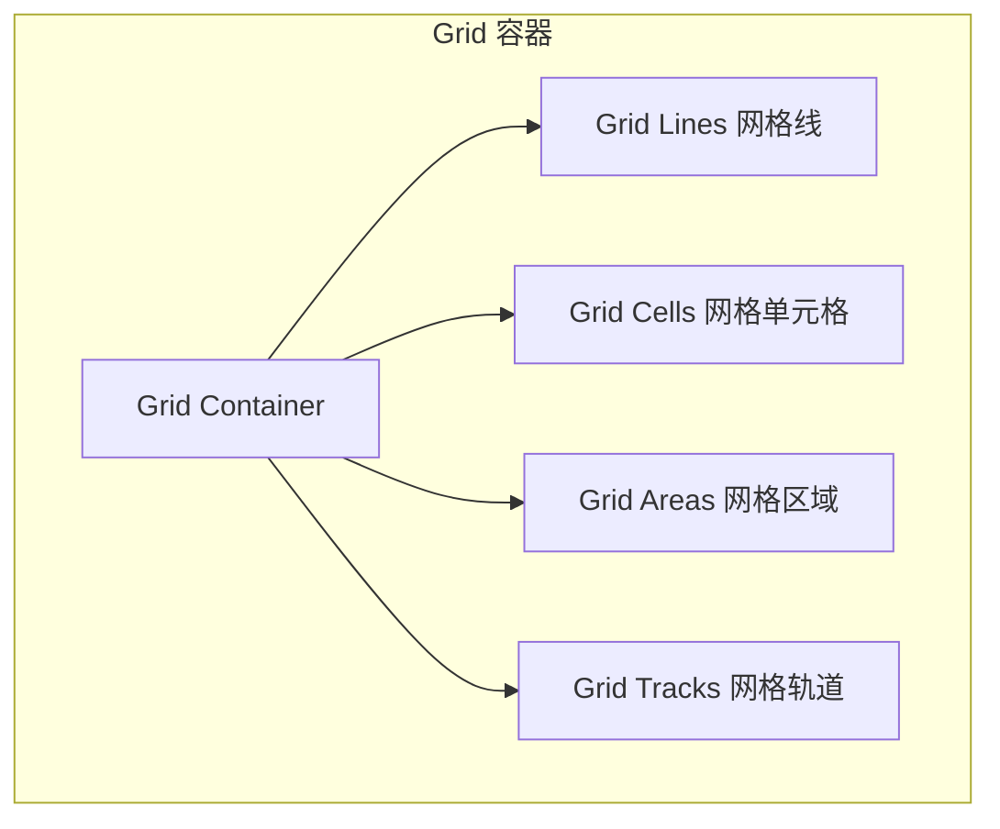

## 一句话概括

CSS Grid 是二维布局系统，通过将页面划分为行和列的网格，让开发者同时控制水平和垂直方向的排列，它是 CSS 诞生以来最强大的布局工具——让复杂的页面结构变得像"搭积木"一样直观。

## 背景与意义

Flexbox 解决了一维布局的痛点——无论是横排还是竖排，它都处理得非常优雅。但当我们面对真正的二维布局（如：一个完整的页面结构、复杂的仪表盘、照片墙）时，Flexbox 就显得力不从心了。你不得不在父容器里嵌套子容器，子容器再嵌套孙容器，最终形成可怕的"div 地狱"。

```html
<!-- 用 Flexbox 实现二维布局 → 需要嵌套 -->
<div class="page">
  <header class="flex">Header</header>
  <div class="main flex">
    <aside class="sidebar flex">Sidebar</aside>
    <div class="content flex">
      <article>Main</article>
      <section>Extra</section>
    </div>
  </div>
  <footer>Footer</footer>
</div>
```

CSS Grid 在 2017 年获得主流浏览器支持，它的核心理念是：**在容器级别定义行和列，然后子元素自由放置到网格的任意位置**。不需要多层嵌套，一个容器搞定整个页面布局。

```html
<!-- 用 Grid 实现相同布局 → 扁平化结构 -->
<div class="page-grid">
  <header>Header</header>
  <aside>Sidebar</aside>
  <article>Main</article>
  <section>Extra</section>
  <footer>Footer</footer>
</div>
```

**Grid vs Flexbox 的选择原则：**
- **Flexbox**：一维排列（行或列），内容驱动（元素尺寸决定布局）
- **Grid**：二维排列（行列同时），布局驱动（先画好格子，再放内容）

两者不是对立关系——事实上，**Grid 用于页面级框架布局，Flexbox 用于组件级内容排列** 是最佳实践组合。

## 概念与定义

### Grid 的关键概念



**Grid Container（网格容器）：** 设置 `display: grid` 的元素。

**Grid Line（网格线）：** 划分网格的线（行线和列线），从 1 开始编号。

**Grid Track（网格轨道）：** 两条相邻网格线之间的区域（即行或列）。

**Grid Cell（网格单元）：** 一个行轨道和一个列轨道的交叉区域。

**Grid Area（网格区域）：** 任意数量网格单元组成的矩形区域。

## 核心知识点拆解

### 1. grid-template-columns / rows — 定义网格结构

```html
<!-- 示例1：定义网格的列与行 -->
<div class="grid-demo">
  <h3>grid-template-columns 定义列</h3>
  
  <div class="method-section">
    <p><strong>固定宽度列：</strong> grid-template-columns: 100px 200px 1fr</p>
    <div style="display:grid; grid-template-columns: 100px 200px 1fr; gap:10px; background:#f0f0f0; padding:10px; border-radius:8px;">
      <div class="g-item">100px</div>
      <div class="g-item">200px</div>
      <div class="g-item">1fr（剩余空间）</div>
    </div>
  </div>
  
  <div class="method-section">
    <p><strong>重复函数 repeat()：</strong> grid-template-columns: repeat(3, 1fr)</p>
    <div style="display:grid; grid-template-columns: repeat(3, 1fr); gap:10px; background:#f0f0f0; padding:10px; border-radius:8px;">
      <div class="g-item">1/3</div>
      <div class="g-item">1/3</div>
      <div class="g-item">1/3</div>
    </div>
  </div>
  
  <div class="method-section">
    <p><strong>自动填充 auto-fill：</strong> grid-template-columns: repeat(auto-fill, minmax(150px, 1fr))</p>
    <div style="display:grid; grid-template-columns:repeat(auto-fill, minmax(150px, 1fr)); gap:10px; background:#f0f0f0; padding:10px; border-radius:8px;">
      <div class="g-item">自动</div>
      <div class="g-item">适应</div>
      <div class="g-item">宽度</div>
      <div class="g-item">变化</div>
      <div class="g-item">自动</div>
    </div>
  </div>
  
  <div class="method-section">
    <p><strong>混合单位：</strong> grid-template-columns: 2fr 1fr 20% 200px</p>
    <div style="display:grid; grid-template-columns: 2fr 1fr 20% 200px; gap:10px; background:#f0f0f0; padding:10px; border-radius:8px;">
      <div class="g-item">2fr</div>
      <div class="g-item">1fr</div>
      <div class="g-item">20%</div>
      <div class="g-item">200px</div>
    </div>
  </div>
</div>

<style>
.grid-demo {
  font-family: sans-serif;
}
.grid-demo .method-section {
  margin-bottom: 20px;
}
.grid-demo .method-section p {
  margin: 0 0 8px 0;
  font-size: 14px;
  font-weight: 500;
  color: #333;
}
.grid-demo .g-item {
  background: #3498db;
  color: white;
  padding: 20px 10px;
  text-align: center;
  border-radius: 6px;
  font-size: 14px;
}
</style>
```

**fr 单位**是 Grid 独有的弹性单位，代表剩余空间（fraction）的分数。`1fr` 等于"一份"。与 `flex: 1` 类似但不同——`fr` 是在 Grid 计算完所有固定尺寸列之后才分配剩余空间。

**`minmax()` 函数**定义尺寸的上下限：`minmax(100px, 1fr)` 表示最小 100px，最多占满可用空间。

**`auto-fill` vs `auto-fit`**：
- `auto-fill`：尽可能多地创建轨道（即使为空）
- `auto-fit`：创建轨道，但如果项目不够多则折叠空轨道

### 2. gap — 网格间距

```html
<!-- 示例2：gap 的不同设置方式 -->
<div class="gap-demo">
  <h3>gap 间距</h3>
  
  <div class="gap-compare">
    <div>
      <p>gap: 10px（行与列都 10px）</p>
      <div style="display:grid; grid-template-columns: repeat(3, 1fr); gap:10px; background:#f0f0f0; padding:10px;">
        <div class="gap-item">1</div><div class="gap-item">2</div><div class="gap-item">3</div>
        <div class="gap-item">4</div><div class="gap-item">5</div><div class="gap-item">6</div>
      </div>
    </div>
    
    <div>
      <p>row-gap: 20px; column-gap: 5px</p>
      <div style="display:grid; grid-template-columns: repeat(3, 1fr); row-gap:20px; column-gap:5px; background:#f0f0f0; padding:10px;">
        <div class="gap-item">1</div><div class="gap-item">2</div><div class="gap-item">3</div>
        <div class="gap-item">4</div><div class="gap-item">5</div><div class="gap-item">6</div>
      </div>
    </div>
  </div>
  
  <div class="gap-note">
    <p>💡 <code>gap</code> 在 Grid 和 Flexbox 中均可使用，浏览器支持度很好（从 2021 年起全面支持）。</p>
  </div>
</div>

<style>
.gap-demo {
  font-family: sans-serif;
}
.gap-demo .gap-compare {
  display: flex;
  gap: 20px;
  flex-wrap: wrap;
}
.gap-demo .gap-compare > div {
  flex: 1 1 300px;
}
.gap-demo .gap-compare p {
  font-size: 14px;
  font-weight: 500;
  margin: 0 0 8px 0;
}
.gap-demo .gap-item {
  background: #9b59b6;
  color: white;
  padding: 15px;
  text-align: center;
  border-radius: 4px;
}
.gap-demo .gap-note {
  margin-top: 15px;
  background: #f0f7ff;
  padding: 10px 15px;
  border-radius: 8px;
}
.gap-demo .gap-note p {
  margin: 0;
  font-size: 13px;
}
</style>
```

### 3. grid-area 与模板布局

这是 Grid 最强大的能力——直接在 CSS 中通过"画地图"的方式定义布局。

```html
<!-- 示例3：grid-template-areas 模板布局 -->
<div class="area-demo">
  <h3>grid-template-areas 模板布局</h3>
  
  <div class="area-grid">
    <header class="area-header">Header</header>
    <nav class="area-nav">Nav</nav>
    <main class="area-main">Main Content</main>
    <aside class="area-aside">Aside</aside>
    <footer class="area-footer">Footer</footer>
  </div>
  
  <div class="area-code">
    <pre><code>
.parent {
  display: grid;
  grid-template-columns: 200px 1fr 200px;
  grid-template-rows: 80px 1fr 60px;
  grid-template-areas:
    "header  header  header"
    "nav     main    aside"
    "footer  footer  footer";
}

header { grid-area: header; }
nav    { grid-area: nav; }
main   { grid-area: main; }
aside  { grid-area: aside; }
footer { grid-area: footer; }
    </code></pre>
  </div>
  
  <div class="area-breakdown">
    <p><strong>🎯 模板布局的优势：</strong></p>
    <ul>
      <li>布局结构在 CSS 中一目了然，不用在 HTML 中加额外的容器 div</li>
      <li>响应式布局只需换一套模板：<br>
        <code>grid-template-areas: "nav" "header" "main" "aside" "footer";</code>
      </li>
      <li>HTML 结构完全独立于视觉布局——可以随意重新排列</li>
    </ul>
  </div>
</div>

<style>
.area-demo {
  font-family: sans-serif;
}
.area-grid {
  display: grid;
  grid-template-columns: 200px 1fr 200px;
  grid-template-rows: 80px 1fr 60px;
  grid-template-areas:
    "header  header  header"
    "nav     main    aside"
    "footer  footer  footer";
  gap: 10px;
  height: 400px;
  background: #f8f9fa;
  padding: 10px;
  border-radius: 8px;
  margin-bottom: 20px;
}
.area-header { 
  grid-area: header; 
  background: #e74c3c; 
  display:flex; align-items:center; justify-content:center; 
  color:white; border-radius:6px; 
  font-size:18px; font-weight:bold;
}
.area-nav { 
  grid-area: nav; 
  background: #3498db; 
  display:flex; align-items:center; justify-content:center; 
  color:white; border-radius:6px;
}
.area-main { 
  grid-area: main; 
  background: #2ecc71; 
  display:flex; align-items:center; justify-content:center; 
  color:white; border-radius:6px; 
  font-size:18px; font-weight:bold;
}
.area-aside { 
  grid-area: aside; 
  background: #f39c12; 
  display:flex; align-items:center; justify-content:center; 
  color:white; border-radius:6px;
}
.area-footer { 
  grid-area: footer; 
  background: #9b59b6; 
  display:flex; align-items:center; justify-content:center; 
  color:white; border-radius:6px;
}
.area-code {
  background: #2d2d2d;
  border-radius: 8px;
  padding: 5px;
  overflow-x: auto;
  margin-bottom: 15px;
}
.area-code pre { margin: 0; }
.area-code code { color: #f8f8f2; font-size: 13px; line-height: 1.6; }
.area-breakdown {
  background: #f0f7ff;
  padding: 15px;
  border-radius: 8px;
}
.area-breakdown ul { margin: 8px 0 0 0; padding-left: 20px; }
.area-breakdown li { margin: 8px 0; font-size: 14px; line-height: 1.6; }
.area-breakdown code {
  background: #e8e8e8;
  padding: 2px 6px;
  border-radius: 3px;
  font-size: 13px;
}
</style>
```

### 4. 网格线放置与跨越

不依赖模板名称，直接用网格线编号精确放置元素。

```html
<!-- 示例4：基于网格线编号放置元素 -->
<div class="line-demo">
  <h3>基于网格线的精确定位</h3>
  
  <div class="line-grid">
    <div class="line-hero">Hero（col: 1/5, row: 1/3）</div>
    <div class="line-feature1">Feature 1</div>
    <div class="line-feature2">Feature 2</div>
    <div class="line-feature3">Feature 3</div>
    <div class="line-cta">CTA（col: 1/5, row: 3/4）</div>
  </div>
  
  <div class="line-explanation">
    <p><strong>网格线编号规则：</strong></p>
    <p>Grid 的网格线从 1 开始编号。如果有 N 列，则有 N+1 条列线。</p>
    <p>使用 <code>grid-column: 1 / 5</code> 表示从列线 1 到列线 5（占据 4 列）</p>
    <p>使用 <code>grid-row: 1 / 3</code> 表示从行线 1 到行线 3（占据 2 行）</p>
  </div>
</div>

<style>
.line-demo {
  font-family: sans-serif;
}
.line-grid {
  display: grid;
  grid-template-columns: repeat(4, 1fr);
  grid-auto-rows: 80px;
  gap: 10px;
  background: #f8f9fa;
  padding: 10px;
  border-radius: 8px;
  margin-bottom: 15px;
}
.line-grid > div {
  display: flex;
  align-items: center;
  justify-content: center;
  color: white;
  border-radius: 6px;
  font-size: 14px;
  font-weight: 500;
  text-align: center;
  padding: 10px;
}
.line-hero {
  grid-column: 1 / 5;
  grid-row: 1 / 3;
  background: linear-gradient(135deg, #667eea, #764ba2);
  font-size: 18px;
}
.line-feature1 {
  grid-column: 1 / 2;
  grid-row: 3 / 4;
  background: #3498db;
}
.line-feature2 {
  grid-column: 2 / 3;
  grid-row: 3 / 4;
  background: #2ecc71;
}
.line-feature3 {
  grid-column: 3 / 4;
  grid-row: 3 / 4;
  background: #f39c12;
}
.line-cta {
  grid-column: 4 / 5;
  grid-row: 3 / 4;
  background: #e74c3c;
}
.line-explanation {
  background: #f0f7ff;
  padding: 15px;
  border-radius: 8px;
}
.line-explanation p {
  margin: 5px 0;
  font-size: 14px;
}
.line-explanation code {
  background: #e8e8e8;
  padding: 2px 6px;
  border-radius: 3px;
}
</style>
```

**网格线的负值引用：**
```css
.item {
  grid-column: 1 / -1;  /* 从第一列线到最后一列线，占据所有列 */
  grid-row: 1 / -1;     /* 同理，占据所有行 */
}
```

**使用 `span` 关键字：**
```css
.item {
  grid-column: 2 / span 3;  /* 从列线 2 开始，跨越 3 列 */
  grid-row: span 2;         /* 默认从当前行开始，跨越 2 行 */
}
```

### 5. 隐式网格与自动布局

当项目数量超过显式定义的网格轨道时，Grid 会自动创建隐式轨道。

```html
<!-- 示例5：隐式网格与 grid-auto-rows/columns -->
<div class="implicit-demo">
  <h3>隐式网格</h3>
  
  <div class="implicit-grid">
    <div class="imp-item" style="background:#e74c3c;">1</div>
    <div class="imp-item" style="background:#e67e22;">2</div>
    <div class="imp-item" style="background:#f1c40f;">3</div>
    <div class="imp-item" style="background:#2ecc71;">4</div>
    <div class="imp-item" style="background:#3498db;">5</div>
    <div class="imp-item" style="background:#9b59b6;">6</div>
    <div class="imp-item" style="background:#1abc9c;">7</div>
    <div class="imp-item" style="background:#e84393;">8</div>
  </div>
  
  <div class="implicit-info">
    <p><strong>grid-template-columns: repeat(3, 1fr)</strong> — 显式定义了 3 列</p>
    <p><strong>grid-auto-rows: 80px</strong> — 隐式创建的行高 80px（第 3 行自动生成）</p>
  </div>
</div>

<style>
.implicit-demo {
  font-family: sans-serif;
}
.implicit-grid {
  display: grid;
  grid-template-columns: repeat(3, 1fr);
  grid-auto-rows: 80px;    /* 隐式行高 */
  gap: 10px;
  background: #f8f9fa;
  padding: 10px;
  border-radius: 8px;
  margin-bottom: 15px;
}
.imp-item {
  display: flex;
  align-items: center;
  justify-content: center;
  color: white;
  font-size: 24px;
  font-weight: bold;
  border-radius: 6px;
}
.implicit-info {
  background: #f0f7ff;
  padding: 15px;
  border-radius: 8px;
}
.implicit-info p {
  margin: 5px 0;
  font-size: 14px;
}
</style>
```

## 实战案例

### 场景：构建一个完整的仪表盘（Dashboard）布局

```html
<!-- 实战案例：Grid 实现的完整仪表盘 -->
<div class="dashboard">
  <h3>📊 Grid 仪表盘实战</h3>

  <div class="dashboard-grid">
    <!-- 侧边栏 -->
    <aside class="d-sidebar">
      <div class="d-logo">📈 Dash</div>
      <nav class="d-nav">
        <a href="#" class="active">🏠 概览</a>
        <a href="#">📊 分析</a>
        <a href="#">📋 订单</a>
        <a href="#">👥 用户</a>
        <a href="#">⚙️ 设置</a>
      </nav>
      <div class="d-user">
        <div class="d-avatar">HT</div>
        <span>胡涛</span>
      </div>
    </aside>

    <!-- 顶部栏 -->
    <header class="d-topbar">
      <div class="d-search">
        <span>🔍</span>
        <input type="text" placeholder="搜索...">
      </div>
      <div class="d-actions">
        <span class="d-bell">🔔</span>
        <span class="d-badge">3</span>
      </div>
    </header>

    <!-- 统计卡片 -->
    <div class="d-stats">
      <div class="stat-card revenue">
        <div class="stat-icon">💰</div>
        <div class="stat-info">
          <p class="stat-label">总收入</p>
          <p class="stat-value">¥128,500</p>
          <p class="stat-change up">↑ 12.5%</p>
        </div>
      </div>
      <div class="stat-card orders">
        <div class="stat-icon">📦</div>
        <div class="stat-info">
          <p class="stat-label">订单数</p>
          <p class="stat-value">1,284</p>
          <p class="stat-change up">↑ 8.3%</p>
        </div>
      </div>
      <div class="stat-card users">
        <div class="stat-icon">👥</div>
        <div class="stat-info">
          <p class="stat-label">活跃用户</p>
          <p class="stat-value">3,847</p>
          <p class="stat-change up">↑ 3.2%</p>
        </div>
      </div>
      <div class="stat-card conversion">
        <div class="stat-icon">📈</div>
        <div class="stat-info">
          <p class="stat-label">转化率</p>
          <p class="stat-value">3.24%</p>
          <p class="stat-change down">↓ 0.5%</p>
        </div>
      </div>
    </div>

    <!-- 图表区域 -->
    <div class="d-chart">
      <h4>📉 收入趋势</h4>
      <div class="chart-placeholder">
        <div class="bar" style="height:60%"></div>
        <div class="bar" style="height:80%"></div>
        <div class="bar" style="height:45%"></div>
        <div class="bar" style="height:90%"></div>
        <div class="bar" style="height:70%"></div>
        <div class="bar" style="height:95%"></div>
        <div class="bar" style="height:55%"></div>
      </div>
    </div>

    <!-- 近期订单 -->
    <div class="d-orders">
      <h4>📋 近期订单</h4>
      <table>
        <tr><th>订单号</th><th>金额</th><th>状态</th></tr>
        <tr><td>#2024-001</td><td>¥299</td><td><span class="status done">已完成</span></td></tr>
        <tr><td>#2024-002</td><td>¥599</td><td><span class="status pend">处理中</span></td></tr>
        <tr><td>#2024-003</td><td>¥199</td><td><span class="status done">已完成</span></td></tr>
        <tr><td>#2024-004</td><td>¥899</td><td><span class="status pend">处理中</span></td></tr>
      </table>
    </div>

    <!-- 活动推送 -->
    <div class="d-activity">
      <h4>🔔 最近活动</h4>
      <div class="activity-item"><span class="dot"></span> 用户「张三」完成了注册</div>
      <div class="activity-item"><span class="dot"></span> 订单 #2024-002 已支付</div>
      <div class="activity-item"><span class="dot"></span> 系统备份完成</div>
      <div class="activity-item"><span class="dot"></span> 新版本 v2.4.0 已部署</div>
    </div>
  </div>
</div>

<style>
/* ====== Dashboard Grid 布局 ====== */
.dashboard {
  font-family: -apple-system, BlinkMacSystemFont, sans-serif;
  border: 2px solid #e0e0e0;
  border-radius: 12px;
  overflow: hidden;
}
.dashboard > h3 {
  padding: 15px;
  margin: 0;
  background: #f8f9fa;
  border-bottom: 1px solid #e0e0e0;
}

/* 📐 核心 Grid 布局 */
.dashboard-grid {
  display: grid;
  grid-template-columns: 220px 1fr 1fr 1fr;
  grid-template-rows: 60px auto auto;
  grid-template-areas:
    "sidebar  topbar   topbar   topbar"
    "sidebar  stats    stats    stats"
    "sidebar  chart    orders   activity";
  gap: 15px;
  padding: 15px;
  background: #f5f7fa;
  min-height: 600px;
}

/* 侧边栏 */
.d-sidebar {
  grid-area: sidebar;
  background: #2c3e50;
  border-radius: 10px;
  padding: 20px;
  display: flex;
  flex-direction: column;
  color: white;
}
.d-logo {
  font-size: 20px;
  font-weight: bold;
  margin-bottom: 30px;
}
.d-nav {
  display: flex;
  flex-direction: column;
  gap: 5px;
  flex: 1;
}
.d-nav a {
  padding: 10px 12px;
  border-radius: 8px;
  color: #bdc3c7;
  text-decoration: none;
  font-size: 14px;
  transition: all 0.2s;
}
.d-nav a:hover, .d-nav a.active {
  background: rgba(255,255,255,0.1);
  color: white;
}
.d-user {
  display: flex;
  align-items: center;
  gap: 10px;
  padding-top: 15px;
  border-top: 1px solid rgba(255,255,255,0.1);
  margin-top: auto;
}
.d-avatar {
  width: 35px;
  height: 35px;
  background: #3498db;
  border-radius: 50%;
  display: flex;
  align-items: center;
  justify-content: center;
  font-size: 12px;
  font-weight: bold;
}

/* 顶栏 */
.d-topbar {
  grid-area: topbar;
  background: white;
  border-radius: 10px;
  padding: 0 20px;
  display: flex;
  align-items: center;
  justify-content: space-between;
  box-shadow: 0 1px 3px rgba(0,0,0,0.05);
}
.d-search {
  display: flex;
  align-items: center;
  gap: 10px;
}
.d-search input {
  border: none;
  outline: none;
  font-size: 14px;
  color: #333;
  background: #f5f7fa;
  padding: 8px 15px;
  border-radius: 20px;
  width: 250px;
}
.d-actions {
  position: relative;
}
.d-bell {
  font-size: 20px;
  cursor: pointer;
}
.d-badge {
  position: absolute;
  top: -5px;
  right: -8px;
  background: #e74c3c;
  color: white;
  font-size: 11px;
  width: 18px;
  height: 18px;
  border-radius: 50%;
  display: flex;
  align-items: center;
  justify-content: center;
}

/* 统计卡片 */
.d-stats {
  grid-area: stats;
  display: grid;
  grid-template-columns: repeat(4, 1fr);
  gap: 15px;
}
.stat-card {
  background: white;
  border-radius: 10px;
  padding: 20px;
  display: flex;
  align-items: center;
  gap: 15px;
  box-shadow: 0 1px 3px rgba(0,0,0,0.05);
}
.stat-icon {
  font-size: 35px;
}
.stat-label {
  margin: 0;
  font-size: 13px;
  color: #888;
}
.stat-value {
  margin: 5px 0;
  font-size: 22px;
  font-weight: bold;
  color: #2c3e50;
}
.stat-change {
  margin: 0;
  font-size: 12px;
  font-weight: 500;
}
.stat-change.up { color: #27ae60; }
.stat-change.down { color: #e74c3c; }

/* 图表区域 */
.d-chart {
  grid-area: chart;
  background: white;
  border-radius: 10px;
  padding: 20px;
  box-shadow: 0 1px 3px rgba(0,0,0,0.05);
}
.d-chart h4, .d-orders h4, .d-activity h4 {
  margin: 0 0 15px 0;
  font-size: 15px;
  color: #2c3e50;
}
.chart-placeholder {
  display: flex;
  align-items: flex-end;
  gap: 8px;
  height: 150px;
}
.bar {
  flex: 1;
  background: linear-gradient(to top, #3498db, #2ecc71);
  border-radius: 4px 4px 0 0;
  min-height: 20px;
}

/* 订单表 */
.d-orders {
  grid-area: orders;
  background: white;
  border-radius: 10px;
  padding: 20px;
  box-shadow: 0 1px 3px rgba(0,0,0,0.05);
}
.d-orders table {
  width: 100%;
  border-collapse: collapse;
  font-size: 13px;
}
.d-orders th, .d-orders td {
  padding: 8px 5px;
  text-align: left;
  border-bottom: 1px solid #f0f0f0;
}
.d-orders th {
  color: #888;
  font-weight: 500;
}
.status {
  padding: 2px 8px;
  border-radius: 10px;
  font-size: 11px;
}
.status.done { background: #d5f5e3; color: #27ae60; }
.status.pend { background: #fef9e7; color: #f39c12; }

/* 活动推送 */
.d-activity {
  grid-area: activity;
  background: white;
  border-radius: 10px;
  padding: 20px;
  box-shadow: 0 1px 3px rgba(0,0,0,0.05);
}
.activity-item {
  padding: 10px 0;
  border-bottom: 1px solid #f0f0f0;
  font-size: 13px;
  color: #555;
  display: flex;
  align-items: center;
  gap: 8px;
}
.activity-item:last-child { border-bottom: none; }
.dot {
  width: 8px;
  height: 8px;
  background: #3498db;
  border-radius: 50%;
  display: inline-block;
}

/* ====== 响应式 ====== */
@media (max-width: 900px) {
  .dashboard-grid {
    grid-template-columns: 1fr 1fr;
    grid-template-areas:
      "topbar   topbar"
      "stats    stats"
      "chart    orders"
      "activity activity";
  }
  .d-sidebar {
    display: none;
  }
}

@media (max-width: 600px) {
  .dashboard-grid {
    grid-template-columns: 1fr;
    grid-template-areas:
      "topbar"
      "stats"
      "chart"
      "orders"
      "activity";
  }
  .d-stats {
    grid-template-columns: 1fr 1fr;
  }
}
</style>
```

## 底层原理

### Grid 布局的算法流程

1. **定义网格轨道**：根据 `grid-template-columns` 和 `grid-template-rows` 计算出显式网格
2. **放置自动项目**：按顺序将子元素放入网格（如果没有显式指定放置位置）
3. **定位显式项目**：根据 `grid-column`、`grid-row`、`grid-area` 将指定项目放入对应位置
4. **创建隐式轨道**：当项目被放置在显式网格之外时，自动创建隐式网格轨道
5. **分配剩余空间**：`fr` 单位按比例分配剩余空间
6. **对齐**：`justify-items`、`align-items`、`justify-content`、`align-content` 对齐

### Grid 的自动填充算法

`auto-fill` 和 `auto-fit` 的核心区别在于空轨道是否被折叠：

```css
/* auto-fill：保留空轨道 */
.container {
  grid-template-columns: repeat(auto-fill, minmax(200px, 1fr));
  /* 当容器宽 700px 时：创建 3 列（200px × 3 = 600px），剩余 100px 作为空轨道 */
}

/* auto-fit：折叠空轨道 */
.container {
  grid-template-columns: repeat(auto-fit, minmax(200px, 1fr));
  /* 当容器宽 700px 时：如果有 2 个项目，创建 2 列（350px × 2），空轨道被折叠 */
}
```

## 高频面试题解析

### Q1: Grid 和 Flexbox 如何选择？

| 场景 | 推荐方案 | 原因 |
|------|---------|------|
| 页面级布局（header/sidebar/main/footer） | Grid | 二维布局，行列同时控制 |
| 导航栏（logo + 链接 + 按钮） | Flexbox | 一维排列，内容自适应 |
| 卡片网格 | Grid | 行列规整，自动对齐 |
| 单行标签 | Flexbox | 简单横向排列 |
| 复杂表格/仪表盘 | Grid | 需要精确的行列控制 |

**最佳实践组合：** Grid 做页面框架，Flexbox 做组件内部排列。

### Q2: `grid-template-areas` 中的 `.` 表示什么？

`.`（句点）表示该网格单元格为**空**（不被任何命名区域占用）。这在不规则的页面布局中非常有用：

```css
.page {
  grid-template-areas:
    "header  header  header"
    "nav     .       main"
    "footer  footer  footer";
  /* 中间行的第二个单元格是空的 */
}
```

### Q3: `grid-column: 1 / -1` 是什么意思？

`-1` 代表最后一条网格线。所以 `grid-column: 1 / -1` 表示从第一条列线到最后一条列线，即跨越所有列。同理 `grid-row: 1 / -1` 跨越所有行。

### Q4: `justify-items`、`align-items`、`justify-content`、`align-content` 的区别？

- `justify-items`（水平）/ `align-items`（垂直）：项目在单元格内的对齐方式
- `justify-content`（水平）/ `align-content`（垂直）：网格（整个网格）在容器内的对齐方式

```css
.grid {
  justify-items: center;  /* 每个项目在它的单元格中水平居中 */
  align-items: center;     /* 每个项目在它的单元格中垂直居中 */
  justify-content: center; /* 整个网格在容器中水平居中 */
  align-content: center;   /* 整个网格在容器中垂直居中 */
}
```

### Q5: 如何用 Grid 实现一个 Masonry（瀑布流）布局？

Grid 原生不支持真正的瀑布流（项目垂直排列到最短列），需要 JavaScript 辅助或 CSS columns。但 Grid 可以做一个近似的效果：

```css
.masonry {
  display: grid;
  grid-template-columns: repeat(3, 1fr);
  grid-auto-rows: minmax(100px, auto);
}

/* 手动设置不同高度的项目跨越不同行数 */
.item-tall {
  grid-row: span 2;  /* 跨两行 */
}
.item-short {
  grid-row: span 1;  /* 默认一行 */
}
```

如果要实现真正的瀑布流（项目按最短列自动填充），推荐使用 `columns` 属性或 Masonry.js 库。

## 总结与扩展

CSS Grid 是 CSS 布局的终极形态——它让以前需要嵌套多层 div、JavaScript 计算、复杂的 hack 才能实现的布局，变得像画表格一样简单。

**掌握 Grid 的三个关键心理模型：**
1. **"画格子"思维**：先定义行和列，再把内容放进去
2. **"模板地图"思维**：用 `grid-template-areas` 在 CSS 中画布局地图
3. **"响应式"思维**：用 `auto-fill` + `minmax()` 一行代码实现自适应

**进阶方向：**
- Subgrid（子网格继承父网格轨道）
- `grid-auto-flow: dense`（密集填充模式）
- Masonry 布局的 CSS 原生方案（Grid Level 3）
- Container Queries + Grid 实现容器级响应式

**总结一句话：** Flexbox 是"排队的排列"，Grid 是"占位的布局"——两者分工明确，相辅相成。
