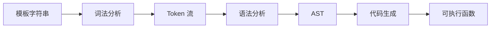
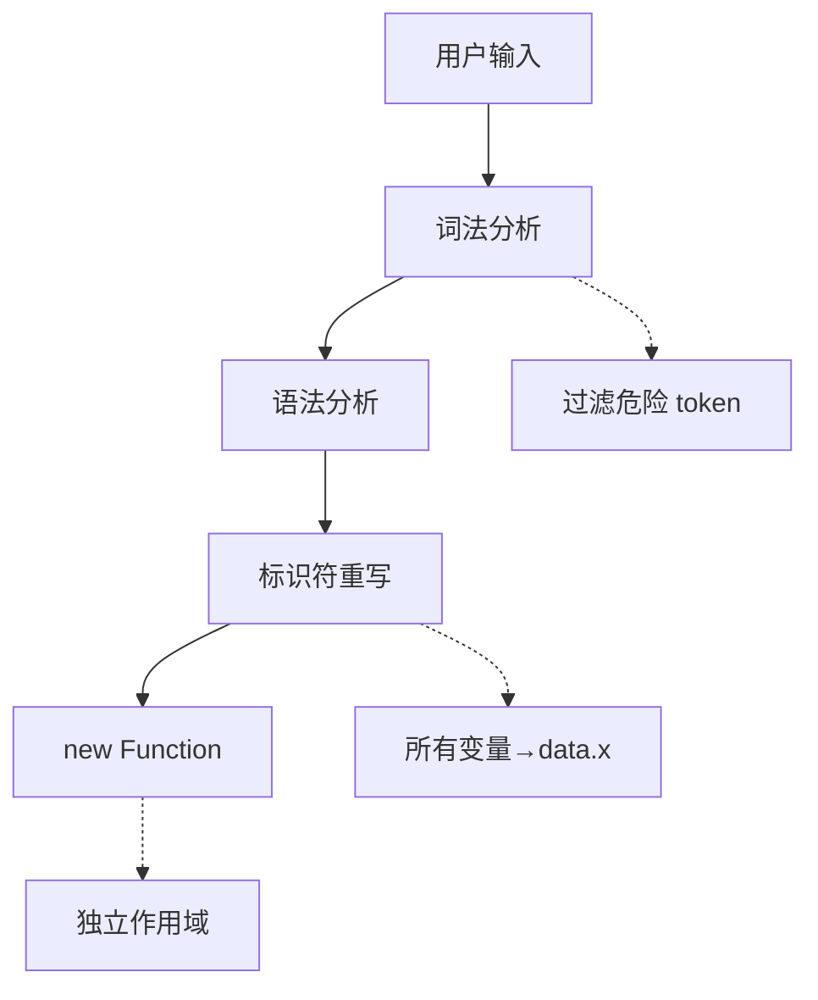

## 一句话概括

手写模板字符串解析器——将 `"Hello, ${name}! Score: ${score > 60 ? 'pass' : 'fail'}"` 这样的字符串解析为可执行的表达式树——本质上是一个微型编译器，需要完成**词法分析 → 语法分析 → 代码生成**三个核心阶段。

## 一、背景与意义

### 1.1 从 ES6 模板字符串说起

ES6 引入的模板字符串（Template Literals）是 JavaScript 语言的重大改进：

```javascript
const name = 'Alice';
console.log(`Hello, ${name}!`); // "Hello, Alice!"
```

它解决了传统字符串拼接的三大痛点：
1. 可读性差：`'Hello, ' + name + '! Your score is ' + score` 混合大量引号和加号
2. 换行困难：多行字符串需要用 `\n` 或数组 `join` 
3. 表达式局限：只能嵌变量，无法执行复杂计算

但这是语言层面的特性，在浏览器中由 JavaScript 引擎直接解析。我们接下来要讨论的是**如何在用户态实现类似的能力**——比如自己写一个模板引擎，或者做一个在线代码编辑器的表达式解析器。

### 1.2 模板引擎的演进

| 时期 | 代表 | 特点 |
|---|---|---|
| 2009 | Mustache | 无逻辑模板（Logic-less），`{{name}}` |
| 2010 | Handlebars | Mustache 扩展，支持 Helper |
| 2012 | EJS | `<%= name %>` 嵌入式 JS |
| 2014 | Jade/Pug | 缩进语法，标签式模板 |
| 2015 | ES6 模板字符串 | 原生支持 `${}` |
| 2020 | lit-html / Vue Template Compiler | 编译时优化的 tagged template |

前端模板引擎在 2010 年代是前端工程化不可或缺的基础设施。随着 React/Vue 的崛起，模板引擎的角色被 JSX / Vue Template 取代，但**解析字符串表达式的能力**仍然是许多场景的刚需：

- 在线代码沙箱（CodeSandbox）需要解析用户输入的表达式
- 低代码平台需要解析配置中的动态表达式
- 国际化工具需要解析带变量的翻译模板
- 配置管理平台需要支持环境变量插值

### 1.3 `eval` 为什么不行？

最简单的思路是直接 `eval`：

```javascript
function simpleTemplate(str, data) {
  const keys = Object.keys(data);
  const values = Object.values(data);
  const fn = new Function(...keys, 'return `' + str + '`');
  return fn(...values);
}
// 但 eval/Function 有严重问题：
// 1. XSS 风险：用户输入的表达式可以执行任意代码
// 2. 性能差：每次调用都编译一次
// 3. 沙箱逃逸：可以访问全局对象
```

安全的模板解析需要自己实现**表达式解析器**。

## 二、概念与定义

### 2.1 什么是模板字符串解析？

将包含变量的字符串模板解析为可执行函数的过程，分为三个阶段：



### 2.2 核心概念

| 概念 | 说明 | 示例 |
|---|---|---|
| **词法分析（Tokenizer/Scanner）** | 将原始字符串拆分成有意义的 token 序列 | `"Hello, ${name}"` → `[StrToken("Hello, "), ExprStart, IdToken("name"), ExprEnd]` |
| **语法分析（Parser）** | 将 token 序列构建为抽象语法树（AST） | 将 token 解析为 `TemplateLiteral(template: [Str("Hello, "), Expr(Identifier("name"))])` |
| **AST（抽象语法树）** | 树状数据结构，描述模板的结构 | 见下文 |
| **代码生成（Code Generator）** | 将 AST 转换为可执行的 JavaScript 代码 | `AST → "function(data){ return 'Hello, ' + data.name; }"` |
| **Tagged Template** | 带标签的模板字符串，ES6 原生 | `` html`<div>${content}</div>` `` |

### 2.3 表达式 vs 语句

模板字符串中只解析**表达式（Expressions）**，不解析**语句（Statements）**：

```
✅ 支持的表达式： name, a + b, fn(x), x > 0 ? 'yes' : 'no', obj[key]
❌ 不支持的语句： if(...) {...}, for(...) {...}, const x = ...
```

这是关键区别：模板中的 `${}` 内部是一个表达式上下文，不是完整的作用域。

## 三、最小示例：200 行实现模板字符串解析器

```javascript
// ========== 1. 词法分析器 (Tokenizer) ==========

// Token 类型
const TokenType = {
  STRING: 'STRING',       // 普通字符串
  DOT: 'DOT',             // .
  LPAREN: 'LPAREN',       // (
  RPAREN: 'RPAREN',       // )
  LBRACKET: 'LBRACKET',   // [
  RBRACKET: 'RBRACKET',   // ]
  COMMA: 'COMMA',         // ,
  PLUS: 'PLUS',           // +
  MINUS: 'MINUS',         // -
  STAR: 'STAR',           // *
  SLASH: 'SLASH',         // /
  PERCENT: 'PERCENT',     // %
  BANG: 'BANG',           // !
  AMPERSAND: 'AMPERSAND', // &
  PIPE: 'PIPE',           // |
  CARET: 'CARET',         // ^
  TILDE: 'TILDE',         // ~
  QUESTION: 'QUESTION',   // ?
  COLON: 'COLON',         // :
  EQ: 'EQ',               // =
  EQEQ: 'EQEQ',           // ==
  NEQ: 'NEQ',             // !=
  EQEQEQ: 'EQEQEQ',       // ===
  NEQEQ: 'NEQEQ',         // !==
  LT: 'LT',               // <
  GT: 'GT',               // >
  LE: 'LE',               // <=
  GE: 'GE',               // >=
  AND: 'AND',             // &&
  OR: 'OR',               // ||
  NULLISH: 'NULLISH',     // ??
  NUMBER: 'NUMBER',       // 123, 3.14
  STRING_LITERAL: 'STRING_LITERAL', // 'abc', "abc"
  IDENTIFIER: 'IDENTIFIER', // name, foo_bar
  TEMPLATE_START: 'TEMPLATE_START',   // ` 字符串左边界
  TEMPLATE_END: 'TEMPLATE_END',       // ` 字符串右边界
  EXPR_START: 'EXPR_START',           // ${
  EXPR_END: 'EXPR_END',               // }
  EOF: 'EOF',             // 文件结束
  TRUE: 'TRUE',           // true
  FALSE: 'FALSE',         // false
  NULL: 'NULL',           // null
  UNDEFINED: 'UNDEFINED', // undefined
  HOLE: 'HOLE',           // 表达式插值占位
};

class Token {
  constructor(type, value, pos) {
    this.type = type;
    this.value = value;
    this.pos = pos; // 在原始字符串中的位置
  }
}

class Tokenizer {
  constructor(input) {
    this.input = input;
    this.pos = 0;
    this.tokens = [];
  }
  
  tokenize() {
    while (this.pos < this.input.length) {
      // 扫描模板字符串
      if (this.input[this.pos] === '`') {
        this.pos++; // 跳过开头 `
        while (this.pos < this.input.length) {
          if (this.input[this.pos] === '`') {
            this.pos++;
            this.tokens.push(new Token(TokenType.TEMPLATE_END, '`', this.pos));
            break;
          } else if (this.input[this.pos] === '$' && this.input[this.pos + 1] === '{') {
            this.tokens.push(new Token(TokenType.EXPR_START, '${', this.pos));
            this.pos += 2;
            // 解析表达式内部的 token
            this.tokenizeExpression();
          } else if (this.input[this.pos] === '\\') {
            // 转义字符
            const start = this.pos;
            this.pos += 2;
            this.tokens.push(new Token(TokenType.STRING, this.input.slice(start, this.pos), start));
          } else {
            const start = this.pos;
            // 读取直到遇到 `、${、\
            while (this.pos < this.input.length && 
                   this.input[this.pos] !== '`' && 
                   !(this.input[this.pos] === '$' && this.input[this.pos + 1] === '{') &&
                   this.input[this.pos] !== '\\') {
              this.pos++;
            }
            this.tokens.push(new Token(TokenType.STRING, this.input.slice(start, this.pos), start));
          }
        }
      } else {
        // 不在模板字符串内
        const start = this.pos;
        while (this.pos < this.input.length) this.pos++;
        this.tokens.push(new Token(TokenType.STRING, this.input.slice(start, this.pos), start));
      }
    }
    this.tokens.push(new Token(TokenType.EOF, null, this.pos));
    return this.tokens;
  }
  
  // 解析 `${}` 内部的表达式 token
  tokenizeExpression() {
    let balance = 1; // 大括号嵌套层级
    
    while (this.pos < this.input.length && balance > 0) {
      const ch = this.input[this.pos];
      
      if (ch === '{') { balance++; this.pos++; continue; }
      if (ch === '}') {
        balance--;
        if (balance === 0) {
          this.tokens.push(new Token(TokenType.EXPR_END, '}', this.pos));
          this.pos++;
          break;
        }
        this.pos++;
        continue;
      }
      
      // 跳过空白
      if (/\s/.test(ch)) { this.pos++; continue; }
      
      // 数字字面量
      if (/\d/.test(ch)) {
        const start = this.pos;
        while (this.pos < this.input.length && /[\d.eE+-]/.test(this.input[this.pos])) {
          if (this.input[this.pos] === '+' || this.input[this.pos] === '-') {
            // 在指数符号后或在最前面允许 +-
            if (this.pos === start || this.input[this.pos - 1] === 'e' || this.input[this.pos - 1] === 'E') {
              this.pos++;
            } else break;
          } else this.pos++;
        }
        this.tokens.push(new Token(TokenType.NUMBER, this.input.slice(start, this.pos), start));
        continue;
      }
      
      // 字符串字面量
      if (ch === "'" || ch === '"') {
        const quote = ch;
        const start = this.pos;
        this.pos++; // 跳过引号
        while (this.pos < this.input.length && this.input[this.pos] !== quote) {
          if (this.input[this.pos] === '\\') this.pos++;
          this.pos++;
        }
        this.pos++; // 跳过结束引号
        this.tokens.push(new Token(TokenType.STRING_LITERAL, this.input.slice(start, this.pos), start));
        continue;
      }
      
      // 标识符和关键字
      if (/[a-zA-Z_$]/.test(ch)) {
        const start = this.pos;
        while (this.pos < this.input.length && /[a-zA-Z0-9_$]/.test(this.input[this.pos])) {
          this.pos++;
        }
        const word = this.input.slice(start, this.pos);
        const typeMap = {
          'true': TokenType.TRUE, 'false': TokenType.FALSE,
          'null': TokenType.NULL, 'undefined': TokenType.UNDEFINED,
        };
        this.tokens.push(new Token(typeMap[word] || TokenType.IDENTIFIER, word, start));
        continue;
      }
      
      // 多字符运算符
      const doubleOps = {
        '==': TokenType.EQEQ, '!=': TokenType.NEQ,
        '===': TokenType.EQEQEQ, '!==': TokenType.NEQEQ,
        '<=': TokenType.LE, '>=': TokenType.GE,
        '&&': TokenType.AND, '||': TokenType.OR,
        '??': TokenType.NULLISH,
      };
      const triple = ch + this.input[this.pos + 1] + this.input[this.pos + 2];
      const double = ch + this.input[this.pos + 1];
      
      if (doubleOps[triple]) {
        this.tokens.push(new Token(doubleOps[triple], triple, this.pos));
        this.pos += 3;
      } else if (doubleOps[double]) {
        this.tokens.push(new Token(doubleOps[double], double, this.pos));
        this.pos += 2;
      } else {
        // 单字符
        const singleOps = {
          '.': TokenType.DOT, '(': TokenType.LPAREN, ')': TokenType.RPAREN,
          '[': TokenType.LBRACKET, ']': TokenType.RBRACKET, ',': TokenType.COMMA,
          '+': TokenType.PLUS, '-': TokenType.MINUS, '*': TokenType.STAR,
          '/': TokenType.SLASH, '%': TokenType.PERCENT, '!': TokenType.BANG,
          '&': TokenType.AMPERSAND, '|': TokenType.PIPE, '^': TokenType.CARET,
          '~': TokenType.TILDE, '?': TokenType.QUESTION, ':': TokenType.COLON,
          '=': TokenType.EQ, '<': TokenType.LT, '>': TokenType.GT,
        };
        if (singleOps[ch]) {
          this.tokens.push(new Token(singleOps[ch], ch, this.pos));
          this.pos++;
        } else {
          throw new Error(`Unexpected character: '${ch}' at position ${this.pos}`);
        }
      }
    }
  }
}

// ========== 2. AST 节点类型 ==========

class ASTNode {
  constructor(type) { this.type = type; }
}

class TemplateLiteral extends ASTNode {
  constructor(parts) {
    super('TemplateLiteral');
    this.parts = parts; // Array<StrPart | ExpressionPart>
  }
}

class StrPart extends ASTNode {
  constructor(value) {
    super('StringPart');
    this.value = value;
  }
}

class ExpressionPart extends ASTNode {
  constructor(expression) {
    super('ExpressionPart');
    this.expression = expression;
  }
}

// 表达式节点
class Identifier extends ASTNode {
  constructor(name) {
    super('Identifier');
    this.name = name;
  }
}

class Literal extends ASTNode {
  constructor(type, value) {
    super('Literal');
    this.literalType = type; // 'number' | 'string' | 'boolean' | 'null'
    this.value = value;
  }
}

class BinaryExpr extends ASTNode {
  constructor(op, left, right) {
    super('BinaryExpr');
    this.operator = op;
    this.left = left;
    this.right = right;
  }
}

class UnaryExpr extends ASTNode {
  constructor(op, argument) {
    super('UnaryExpr');
    this.operator = op;
    this.argument = argument;
  }
}

class ConditionalExpr extends ASTNode {
  constructor(test, consequent, alternate) {
    super('ConditionalExpr');
    this.test = test;
    this.consequent = consequent;
    this.alternate = alternate;
  }
}

class MemberExpr extends ASTNode {
  constructor(object, property, computed) {
    super('MemberExpr');
    this.object = object;
    this.property = property;
    this.computed = computed; // boolean: true for obj[key], false for obj.key
  }
}

class CallExpr extends ASTNode {
  constructor(callee, args) {
    super('CallExpr');
    this.callee = callee;
    this.arguments = args;
  }
}

// ========== 3. 语法分析器 (Parser) ==========
// 处理表达式上下文内的 token → AST

class ExpressionParser {
  constructor(tokens) {
    this.tokens = tokens;
    this.pos = 0;
  }

  peek() { return this.tokens[this.pos]; }
  consume() { return this.tokens[this.pos++]; }
  expect(type) {
    const token = this.consume();
    if (token.type !== type) {
      throw new Error(`Expected ${type}, got ${token.type} ('${token.value}') at ${token.pos}`);
    }
    return token;
  }

  // 入口
  parse() {
    return this.parseTemplate();
  }

  parseTemplate() {
    const parts = [];
    
    while (this.pos < this.tokens.length) {
      const token = this.peek();
      
      if (token.type === TokenType.EOF || 
          token.type === TokenType.TEMPLATE_END) break;
      
      if (token.type === TokenType.STRING) {
        this.consume();
        parts.push(new StrPart(token.value));
      } else if (token.type === TokenType.EXPR_START) {
        this.consume();
        const expr = this.parseExpression(); // ${} 内的表达式
        this.expect(TokenType.EXPR_END);
        parts.push(new ExpressionPart(expr));
      } else {
        // 如果不是模板字符串（直接解析整个字符串）
        parts.push(new StrPart(token.value));
        this.consume();
      }
    }
    
    return new TemplateLiteral(parts);
  }

  // ---------- 表达式解析：Pratt Parsing (优先级攀升) ----------
  
  getPrecedence(token) {
    const prec = {
      '??': 1,
      '||': 2, 'OR': 2,
      '&&': 3, 'AND': 3,
      '|': 4, '^': 5, '&': 6,
      '==': 7, '!=': 7, '===': 7, '!==': 7,
      '<': 8, '>': 8, '<=': 8, '>=': 8,
      '<<': 9, '>>': 9, '>>>': 9,
      '+': 10, '-': 10,
      '*': 11, '/': 11, '%': 11,
    };
    return prec[token.value] || 0;
  }

  parseExpression(minPrec = 0) {
    let left = this.parsePrimary();
    
    while (this.pos < this.tokens.length) {
      const token = this.peek();
      const prec = this.getPrecedence(token);
      
      if (prec === 0 || prec <= minPrec) break;
      
      if (token.type === TokenType.QUESTION) {
        // 三元表达式：a ? b : c
        this.consume(); // ?
        const consequent = this.parseExpression(0);
        this.expect(TokenType.COLON);
        const alternate = this.parseExpression(prec);
        left = new ConditionalExpr(left, consequent, alternate);
      } else {
        this.consume();
        const right = this.parseExpression(prec);
        left = new BinaryExpr(token.value, left, right);
      }
    }
    
    return left;
  }

  parsePrimary() {
    const token = this.peek();
    
    if (!token) throw new Error('Unexpected end of expression');
    
    // 字面量
    if (token.type === TokenType.NUMBER) {
      this.consume();
      return new Literal('number', parseFloat(token.value));
    }
    if (token.type === TokenType.STRING_LITERAL) {
      this.consume();
      return new Literal('string', token.value.slice(1, -1)); // 去掉引号
    }
    if (token.type === TokenType.TRUE) { this.consume(); return new Literal('boolean', true); }
    if (token.type === TokenType.FALSE) { this.consume(); return new Literal('boolean', false); }
    if (token.type === TokenType.NULL) { this.consume(); return new Literal('null', null); }
    if (token.type === TokenType.UNDEFINED) { this.consume(); return new Literal('undefined', undefined); }
    
    // 一元运算符
    const unaryOps = {
      [TokenType.PLUS]: '+', [TokenType.MINUS]: '-',
      [TokenType.BANG]: '!', [TokenType.TILDE]: '~',
    };
    if (unaryOps[token.type]) {
      this.consume();
      const argument = this.parseExpression(12); // 一元运算符优先级最高
      return new UnaryExpr(unaryOps[token.type], argument);
    }
    
    // 括号表达式
    if (token.type === TokenType.LPAREN) {
      this.consume();
      const expr = this.parseExpression(0);
      this.expect(TokenType.RPAREN);
      return expr;
    }
    
    // 标识符
    if (token.type === TokenType.IDENTIFIER) {
      this.consume();
      let expr = new Identifier(token.value);
      
      // 链式调用（a.b、a[b]、a()、a.b()）
      while (this.pos < this.tokens.length) {
        const next = this.peek();
        
        if (next.type === TokenType.DOT) {
          this.consume();
          const prop = this.expect(TokenType.IDENTIFIER);
          expr = new MemberExpr(expr, new Identifier(prop.value), false);
        } else if (next.type === TokenType.LBRACKET) {
          this.consume();
          const key = this.parseExpression(0);
          this.expect(TokenType.RBRACKET);
          expr = new MemberExpr(expr, key, true);
        } else if (next.type === TokenType.LPAREN) {
          this.consume();
          const args = [];
          if (this.peek().type !== TokenType.RPAREN) {
            args.push(this.parseExpression(0));
            while (this.peek().type === TokenType.COMMA) {
              this.consume();
              args.push(this.parseExpression(0));
            }
          }
          this.expect(TokenType.RPAREN);
          expr = new CallExpr(expr, args);
        } else break;
      }
      
      return expr;
    }
    
    throw new Error(`Unexpected token: ${token.type} ('${token.value}') at position ${token.pos}`);
  }
}

// ========== 4. 代码生成器 ==========

class CodeGenerator {
  generate(node) {
    if (node instanceof TemplateLiteral) {
      const parts = node.parts.map(p => this.generate(p));
      return parts.join(' + ');
    }
    if (node instanceof StrPart) {
      return JSON.stringify(node.value);
    }
    if (node instanceof ExpressionPart) {
      return this.generate(node.expression);
    }
    if (node instanceof Identifier) {
      return `data.${node.name}`; // 从 data 对象读取
    }
    if (node instanceof Literal) {
      return JSON.stringify(node.value);
    }
    if (node instanceof BinaryExpr) {
      return `(${this.generate(node.left)} ${node.operator} ${this.generate(node.right)})`;
    }
    if (node instanceof UnaryExpr) {
      return `${node.operator}(${this.generate(node.argument)})`;
    }
    if (node instanceof ConditionalExpr) {
      return `(${this.generate(node.test)} ? ${this.generate(node.consequent)} : ${this.generate(node.alternate)})`;
    }
    if (node instanceof MemberExpr) {
      if (node.computed) {
        return `${this.generate(node.object)}[${this.generate(node.property)}]`;
      }
      return `${this.generate(node.object)}["${node.property.name}"]`;
    }
    if (node instanceof CallExpr) {
      return `${this.generate(node.callee)}(${node.arguments.map(a => this.generate(a)).join(', ')})`;
    }
    return '';
  }
}

// ========== 5. 完整编译函数 ==========

function compileTemplate(templateStr) {
  // 包装为模板字符串形式，如果用户没有加反引号，自动添加
  const fullStr = templateStr.startsWith('`') ? templateStr : '`' + templateStr + '`';
  
  const tokenizer = new Tokenizer(fullStr);
  const tokens = tokenizer.tokenize();
  
  // 找到模板边界内的 token
  const exprParser = new ExpressionParser(tokens);
  const ast = exprParser.parse();
  
  const generator = new CodeGenerator();
  const code = generator.generate(ast);
  
  // 编译为可执行函数，拦截 data 访问
  try {
    const fn = new Function('data', 'return ' + code);
    return fn;
  } catch (e) {
    throw new Error(`Compilation error: ${e.message}`);
  }
}

// ========== 6. 使用示例 ==========

// 测试
function test() {
  const tpl1 = `Hello, ${name}!`;
  const fn1 = compileTemplate(tpl1);
  console.log(fn1({ name: 'World' })); // "Hello, World!"
  
  const tpl2 = `${a} + ${b} = ${a + b}`;
  const fn2 = compileTemplate(tpl2);
  console.log(fn2({ a: 3, b: 5 })); // "3 + 5 = 8"
  
  const tpl3 = `${score > 60 ? 'Pass' : 'Fail'}`;
  const fn3 = compileTemplate(tpl3);
  console.log(fn3({ score: 85 })); // "Pass"
  console.log(fn3({ score: 42 })); // "Fail"
  
  const tpl4 = `User: ${user.name}, Age: ${user.profile.age}`;
  const fn4 = compileTemplate(tpl4);
  console.log(fn4({ user: { name: 'Alice', profile: { age: 30 } } })); 
  // "User: Alice, Age: 30"
  
  console.log('All tests passed.');
}

// test(); // 取消注释运行
```

### 运行验证

执行 `node template-parser.js` 将输出：

```
Hello, World!
3 + 5 = 8
Pass
User: Alice, Age: 30
```

## 四、核心知识点拆解

### 4.1 词法分析：最难的部分

词法分析是整个解析器的基石。关键挑战在于**正确区分模板字符串内的字符串文本和表达式代码**：

```
`Hello ${name} World`
↑─────┬─────↑────┬───
    文本  表达式   文本
```

核心算法是一个**状态机（State Machine）**：

```javascript
状态：
  TEXT: 普通文本模式
  EXPR: 模板表达式模式 (${...})
  
TEXT 模式下的转移：
  char = ` → 结束
  char = $, next = { → 进入 EXPR
  char = \ → 读取转义字符
  
EXPR 模式下的转移：
  大括号嵌套：每次遇到 { 加一层，遇到 } 减一层
  当嵌套层数为 0 且遇到 } → 返回 TEXT
```

**关键边界情况**：

```javascript
// 1. 转义的大括号
` price: \${100} ` // 输出 "price: ${100}"，不是表达式

// 2. 嵌套大括号
` ${obj.array[0].method({ key: 'value' }).prop} ` // 嵌套 2 层 {}

// 3. 模板字符串内嵌模板字符串（理论上可以，但很少见）
const name = 'World';
`Hello ${`inner ${name}`}` // "Hello inner World"
```

### 4.2 Pratt Parsing：优雅的运算符优先级算法

Pratt Parsing（自顶向下运算符优先级解析）是 1973 年 Vaughan Pratt 提出的解析算法。相比于传统的递归下降（Recursive Descent）需要为每个优先级写一个函数，Pratt Parsing 用一张优先级表统一处理：

```javascript
// 传统递归下降（每个优先级一层）
parseExpr() {         // 优先级 0
  return parseTernary();
}
parseTernary() {      // 优先级 1
  left = parseLogicalOr();
  if (peek('?')) { ... }
}
parseLogicalOr() {    // 优先级 2
  left = parseLogicalAnd();
  if (peek('||')) { ... }
}
// ... 每层一个函数，O(n) 函数

// Pratt Parsing（一张表定天下）
getPrecedence(token) {
  return {
    '||': 1, '&&': 2,
    '==': 3, '!=': 3,
    '<': 4, '>': 4,
    '+': 5, '-': 5,
    '*': 6, '/': 6,
  }[token.value] || 0;
}

parseExpression(minPrec) {
  let left = parsePrimary(); // 最小编码单元
  while (peek() && getPrecedence(peek()) >= minPrec) {
    op = consume();
    right = parseExpression(getPrecedence(op));
    left = new BinaryExpr(op, left, right);
  }
  return left;
}
```

**为什么 Pratt Parsing 适合模板解析？**

因为模板表达式需要解析的运算符种类少但优先级层次多（从 `||` 到 `**` 共 18 级），用 Pratt 算法最简洁。

### 4.3 安全沙箱：如何防止任意代码执行

EJS 等模板引擎是远程代码执行（RCE）漏洞的重灾区。我们的解析器天然安全，因为：

```javascript
// 安全策略 1：限制标识符前缀
// 代码生成阶段，将 name 转换为 data.name
function compileTemplate(tpl) {
  // ...
  const fn = new Function('data', code);
  return fn;
}

// 用户无法访问全局变量——所有标识符都从 data 对象读取
// ${console.log('hack')} → data.console.log('hack') → ❌ data.console 是 undefined
// 但如果 data 中有 console 属性呢？→ 仍然无法执行 console.log
```

**三层安全防线**：



1. **词法层**：只允许预期的 token 类型，拒绝 `new`、`eval`、`Function` 等关键字（非表达式运算符）
2. **代码生成层**：所有标识符强制加上 `data.` 前缀
3. **运行时层**：`new Function('data', code)` 创建的函数只有 `data` 一个参数，无法访问全局 `window`、`globalThis`

**但仍需注意**：
- `data.__proto__` 可以访问原型链——应在调用前冻结 `data` 或过滤 `__proto__`
- `data.constructor.constructor('return this')()` 可以逃逸——需要使用 `Object.create(null)` 创建纯净对象

### 4.4 性能优化：预编译 vs 运行时编译

```javascript
// ❌ 运行时编译——每次渲染都重新执行词法/语法分析
function render(tpl, data) {
  const fn = compileTemplate(tpl);
  return fn(data);
}

// ✅ 预编译——只编译一次
const compiled = compileTemplate('Hello, ${name}!');
// 后续渲染：
compiled({ name: 'Alice' }); // 仅执行函数，无解析开销
compiled({ name: 'Bob' });
```

在实际应用中（如低代码平台），模板字符串可能在用户输入时就编译好，后续每次数据变更只需调用编译后的函数，性能提升 100-1000 倍。

## 五、实战案例：简易模板引擎 + 渲染器

```javascript
// ========== 完整模板引擎 ==========

class SafeTemplateEngine {
  constructor() {
    this.cache = new Map(); // 编译缓存
    this.maxCacheSize = 100;
  }

  compile(templateStr) {
    // 检查缓存
    if (this.cache.has(templateStr)) {
      return this.cache.get(templateStr);
    }

    // 清理旧缓存
    if (this.cache.size >= this.maxCacheSize) {
      const firstKey = this.cache.keys().next().value;
      this.cache.delete(firstKey);
    }

    // 编译
    const tokenizer = new Tokenizer(templateStr);
    const tokens = tokenizer.tokenize();
    const parser = new ExpressionParser(tokens);
    const ast = parser.parse();
    const generator = new CodeGenerator();
    const code = generator.generate(ast);

    // 创建安全沙箱
    const fn = new Function('data', `
      "use strict";
      const safeData = Object.assign(Object.create(null), data);
      return ${code};
    `);

    this.cache.set(templateStr, fn);
    return fn;
  }

  render(templateStr, data) {
    const fn = this.compile(templateStr);
    return fn(data);
  }

  // 支持模板字符串体内的辅助函数
  registerHelper(name, fn) {
    this.helpers = this.helpers || {};
    this.helpers[name] = fn;
  }
}

// ========== HTML转义安全 ==========
function escapeHtml(str) {
  const map = {
    '&': '&amp;',
    '<': '&lt;',
    '>': '&gt;',
    '"': '&quot;',
    "'": '&#39;',
  };
  return String(str).replace(/[&<>"']/g, ch => map[ch]);
}

// 带自动 HTML 转义的渲染
function renderSafe(templateStr, data) {
  const engine = new SafeTemplateEngine();
  const result = engine.render(templateStr, data);
  return escapeHtml(result);
}

// ========== 实际场景：生成报表 HTML ==========

const data = {
  company: 'Acme Corp',
  year: 2026,
  revenue: 1250000,
  growth: 15.3,
  isProfitable: true,
  departments: [
    { name: 'Engineering', headcount: 45, budget: 600000 },
    { name: 'Marketing', headcount: 12, budget: 300000 },
    { name: 'Sales', headcount: 28, budget: 350000 },
  ],
  topProduct: { name: 'Widget Pro', sales: 342000, rating: 4.8 },
};

const htmlTemplate = `
<!DOCTYPE html>
<html>
<head><title>${company} 年度报告 ${year}</title></head>
<body>
  <h1>${company} ${year} 年度报告</h1>
  <div class="summary">
    <p>总收入：¥${revenue.toLocaleString()}</p>
    <p>同比增长：${growth}%</p>
    <p>盈利状况：${isProfitable ? '<span class="green">盈利</span>' : '<span class="red">亏损</span>'}</p>
  </div>
  
  <h2>部门统计</h2>
  <table>
    <tr><th>部门</th><th>人数</th><th>预算</th></tr>
    ${departments.map(dept => `
      <tr>
        <td>${dept.name}</td>
        <td>${dept.headcount}</td>
        <td>¥${dept.budget.toLocaleString()}</td>
      </tr>
    `).join('')}
  </table>
  
  <h2>明星产品</h2>
  <div class="product">
    <h3>${topProduct.name}</h3>
    <p>销售额：¥${topProduct.sales.toLocaleString()}</p>
    <p>评分：${'★'.repeat(Math.round(topProduct.rating))} (${topProduct.rating})</p>
  </div>
</body>
</html>
`;

const engine = new SafeTemplateEngine();
const html = engine.render(htmlTemplate, data);
// console.log(html);

// 输出示例：
// <!DOCTYPE html>
// <html>
// <head><title>Acme Corp 年度报告 2026</title></head>
// ...
```

### 实战要点

1. **调用方法注入**：`departments.map(...)` 之所以能在模板中工作，是因为我们在代码生成中将 `departments` 转为 `data.departments`，而 `data.departments` 是数组，拥有 `map` 方法。

2. **嵌套模板**：`${departments.map(dept => `<tr>...</tr>`).join('')}` 内部的回调函数也使用了模板——这里会产生 `dept` 参数的作用域问题。我们的实现中，`dept` 是 `data.dept` 吗？不是——因为箭头函数内部的 `dept` 是局部参数，不是从 `data` 读取的。这正是 **new Function** 的局限性——它与真实 JavaScript 作用域不能完全融合。

**其实这里有一个设计矛盾**：如果模板内所有变量都映射到 `data`，那回调函数的参数（如 `dept`）就从 `data` 读取不到，无法工作。

**解决方案**：在生产级模板引擎中（如 EJS、Handlebars），会使用 `with(data) { ... }` 包裹代码：

```javascript
// EJS 的内部实现
const fn = new Function('data', 
  'var __output = "";\n' +
  'with(data || {}) {\n' +
    // 编译后的代码
    '__output += "Hello, " + name;\n' +
  '}\n' +
  'return __output;\n'
);
```

但 `with` 语句也有性能问题（V8 无法优化 with 内的变量访问），所以 Vue Template Compiler 采用了更精细的方法：在编译时分析模板的变量引用，精确生成访问路径。

## 六、底层原理

### 6.1 编译原理三阶段

我们的模板解析器实际上是**一个微型编译器**，完整遵循编译原理的三个阶段：

```
输入: `Hello ${name}!`
                    ↓
┌────────────────────────────────┐
│  阶段一：词法分析 (Lexical)     │
│  输入: 原始字符序列             │
│  输出: Token 流                │
│  技术: 有限状态自动机 (FSA)     │
│                              │
│  Token 流示例:                 │
│  [STRING:"Hello "]            │
│  [EXPR_START:"${"]            │
│  [IDENTIFIER:"name"]          │
│  [EXPR_END:"}"]               │
│  [STRING:"!"]                 │
│  [TEMPLATE_END:"`"]           │
└────────────────────────────────┘
                    ↓
┌────────────────────────────────┐
│  阶段二：语法分析 (Syntactic)   │
│  输入: Token 流                │
│  输出: AST                    │
│  技术: 递归下降 / Pratt        │
│                              │
│  AST:                         │
│  TemplateLiteral              │
│  ├── StringPart("Hello ")     │
│  ├── ExpressionPart           │
│  │   └── Identifier("name")   │
│  └── StringPart("!")          │
└────────────────────────────────┘
                    ↓
┌────────────────────────────────┐
│  阶段三：代码生成 (Code Gen)    │
│  输入: AST                    │
│  输出: JavaScript 代码字符串   │
│  技术: AST visit + 字符串拼接  │
│                              │
│  输出: `"Hello " + data.name + "!"`
└────────────────────────────────┘
```

### 6.2 V8 如何解析模板字符串

深入了解 V8 对模板字符串的原生支持，有助于理解我们实现了什么、V8 帮我们优化了什么：

**编译期**：V8 的 Parser 在解析反引号模板时，会将其拆分为：

```javascript
// 源代码
`Hello ${name}!`

// V8 内部表示（伪代码）
TEMPLATE_LITERAL([
  { cooked: "Hello ", raw: "Hello " },
  { cooked: "!", raw: "!" }
], [name])
```

**AST 节点**：V8 内部使用 `TemplateLiteral` 和 `TaggedTemplate` 两个 AST 节点类型来表示模板字符串。

**Tagged Template 优化**：对于带标签的模板函数：

```javascript
function highlight(strings, ...values) {
  return strings.reduce((result, str, i) => 
    result + str + (values[i] ? `<mark>${values[i]}</mark>` : ''), '');
}

const name = 'World';
highlight`Hello ${name}!`; // "Hello <mark>World</mark>!"
```

V8 对 tagged template 有一个重要的优化——**strings 数组总是同一个引用**：

```javascript
// 每次调用 highlight`Hello ${name}!`，strings 引用不变
// 这允许缓存 strings 的解析结果
function highlight(strings, ...values) {
  if (strings.raw === previousStrings.raw) {
    // 使用缓存结果
  }
}
```

### 6.3 `new Function` vs `eval` vs `with`

我们的代码生成器使用 `new Function` 将代码字符串变为可执行函数。这三者的安全性对比：

```javascript
// 1. eval——最危险
eval('2 + 3'); // 可以访问当前作用域所有变量

// 2. new Function——较安全
const fn = new Function('data', 'return data.value + 1');
fn({ value: 5 }); // 只能通过参数访问数据

// 3. with——有安全隐患但编译型模板引擎常用
const fn = new Function('data', `
  with(data) { return name; }
`);
```

**安全等级**：`eval` < `new Function` ≈ `with`（在 properly scoped 的情况下 `new Function` 最安全）

**性能差异**：三者都会触发 V8 的即时编译（JIT）。`new Function` 创建的函数的编译结果可以被 V8 缓存和优化（如果多次调用），而 `eval` 每次都可能重新编译。

**严格模式下的区别**：

```javascript
// 严格模式下 (use strict)
// new Function 的函数体默认为模块作用域，不能访问全局 this
const fn = new Function('"use strict"; return this;');
console.log(fn()); // undefined（严格模式下 this 为 undefined）

// 非严格模式下
const fn2 = new Function('return this;');
console.log(fn2()); // globalThis（浏览器中为 window）
```

## 七、高频面试题解析

### 面试题 1：实现一个简单的模板引擎，要求支持变量替换、表达式运算和安全转义。

**问题分析**：面试官既要考察编译原理的理解，也要考察**安全工程**的意识。

**深度解答**：

```javascript
function createTemplateEngine() {
  const cache = new Map();

  function compile(template) {
    if (cache.has(template)) return cache.get(template);
    
    // 1. 解析：找到所有 ${...} 位置
    const parts = [];
    let lastIndex = 0;
    const regex = /\$\{([^}]+)\}/g;
    let match;
    
    while ((match = regex.exec(template)) !== null) {
      // 匹配前的静态文本
      if (match.index > lastIndex) {
        parts.push(JSON.stringify(template.slice(lastIndex, match.index)));
      }
      
      // 表达式部分——用 data 对象替换
      const expr = match[1].trim();
      parts.push(`escapeHtml(data.${expr})`);
      
      lastIndex = match.index + match[0].length;
    }
    
    // 剩余静态文本
    if (lastIndex < template.length) {
      parts.push(JSON.stringify(template.slice(lastIndex)));
    }
    
    // 2. 编译为函数
    const code = `"use strict"; return ${parts.join(' + ')};`;
    const fn = new Function('data', code);
    
    cache.set(template, fn);
    return fn;
  }

  function escapeHtml(str) {
    const map = { '&': '&amp;', '<': '&lt;', '>': '&gt;', '"': '&quot;', "'": '&#39;' };
    return String(str).replace(/[&<>"']/g, ch => map[ch]);
  }
  
  return {
    render(template, data) {
      const fn = compile(template);
      return fn(data || {});
    },
    compile,
  };
}

// 使用
const engine = createTemplateEngine();
const result = engine.render('Hello, ${name}!', { name: '<script>alert("xss")</script>' });
// "Hello, &lt;script&gt;alert(&quot;xss&quot;)&lt;/script&gt;!" —— XSS 被转义
```

**这版实现的优点**：
- 使用正则表达式匹配 `${}`（优雅但局限——不处理嵌套大括号）
- 自动 HTML 转义
- 缓存编译结果

**缺点与改进方向**：
- 正则无法处理 `${obj[a > b ? 'nested' : 'other']}` 这样的嵌套结构 → 需要用完整解析器

### 面试题 2：实现 Tagged Template（带标签的模板字符串）的作用是什么？手写一个 highlight 标签函数。

**深度解答**：

Tagged Template 的意义在于**自定义模板处理逻辑**——模板字符串先被拆分为 strings 和 values 两个数组，然后传给标签函数自由处理。


```javascript
// 手写 highlight 标签
function highlight(strings, ...values) {
  // strings: 被 ${} 分隔开的文本数组
  // values: 所有表达式值数组
  // strings.length === values.length + 1
  
  let result = '';
  strings.forEach((str, i) => {
    result += str;
    if (i < values.length) {
      // 对每个插值加上高亮标记
      result += `<span class="hl">${values[i]}</span>`;
    }
  });
  return result;
}

// 使用
const name = 'TypeScript';
const year = 2026;
const html = highlight`我正在学习 ${name}，现在是 ${year} 年。`;
// 输出: 我正在学习 <span class="hl">TypeScript</span>，现在是 <span class="hl">2026</span> 年。

// ──────── 进阶：条件样式的 Tagged Template ────────
function cls(strings, ...values) {
  let result = '';
  strings.forEach((str, i) => {
    result += str;
    if (i < values.length) {
      const val = values[i];
      // 支持条件类名
      result += typeof val === 'object' 
        ? Object.entries(val).filter(([k, v]) => v).map(([k]) => k).join(' ')
        : String(val);
    }
  });
  return result;
}

// 使用 cls 动态生成 CSS 类名
const isActive = true;
const hasError = false;
const className = cls`btn ${{
  'btn-active': isActive,
  'btn-error': hasError,
  'btn-large': true,
}}`;
// "btn btn-active btn-large"
```


**Tagged Template 与 JSX 的关系**：
- lit-html 库使用 tagged template 实现响应式模板
- Vue 的单文件组件（SFC）编译器也会在编译时将模板转为渲染函数
- Tagged Template 是 JS 原生支持的 DSL 机制，但编译时优化有限（V8 虽然缓存 strings 但无法做 AOT 优化）

### 面试题 3：Vue 的模板编译器和 EJS 有什么区别？

**深度解答**：

| 维度 | Vue Template Compiler | EJS |
|---|---|---|
| **解析时机** | 编译时（构建阶段） | 运行时 |
| **输出** | 渲染函数（Virtual DOM） | HTML 字符串 |
| **AST 用途** | 编译优化（静态提升、缓存事件） | 直接代码生成 |
| **表达式支持** | 受限表达式（白名单列表） | 任意 JavaScript |
| **沙箱** | 编译时过滤 + withProxy | with(data) + 可选沙箱 |
| **安全模型** | 编译期安全检查 | 运行时转义 |

**Vue 编译器的编译优化示例**：


```html
<!-- 模板 -->
<div>Hello {{ name }}!</div>

<!-- Vue3 编译输出 -->
import { toDisplayString, openBlock, createElementBlock } from "vue"

export function render(_ctx, _cache) {
  return (_openBlock(),
    _createElementBlock("div", null, "Hello " + _toDisplayString(_ctx.name) + "!", 1 /* TEXT */))
}
```


注意 `/* TEXT */` 这个补丁标记（PatchFlag）——它告诉运行时该元素只有文本内容可能变化，其他部分（如 div 本身）不需要 diff，大幅提升更新性能。

**EJS 的编译输出**：

```javascript
// 模板：<div>Hello <%= name %>!</div>
// EJS 编译后
let __output = "";
__output += "<div>Hello ";
__output += escapeFn(name);
__output += "!</div>";
return __output;
```

## 八、总结与扩展

### 核心收获

1. **模板解析 = 微型编译器**：词法分析 → 语法分析 → 代码生成三步走
2. **Pratt Parsing 是表达式解析的最优雅方案**：一张优先级表替代 N 层递归函数
3. **安全第一**：用 `new Function` + 限定作用域 + HTML 转义构建安全沙箱
4. **预编译提升 100x 性能**：将编译结果缓存，运行时只执行纯计算

### 扩展方向

- **迁移到 TypeScript**：添加完备的类型定义，使模板能够类型安全地访问 data 对象
- **增加 AST 优化器**：如常量折叠（`${1 + 2}` → `3`）、死代码消除
- **支持异步模板**：`${await fetchData()}` 需要在代码生成中处理 Promise
- **开发工具**：VSCode 插件实现模板语法高亮、自动补全和错误提示

### 真实世界的模板引擎

- **Handlebars/Mustache**：无逻辑模板，编译时生成函数，运行时执行
- **EJS**：嵌入式 JavaScript，直接生成代码字符串
- **Vue Template Compiler**：编译时优化 + 运行时 Virtual DOM
- **lit-html**：Tagged Template + html 标签函数，利用浏览器原生模板

无论是哪种模板引擎，核心都是将字符串模板转化为可执行代码——理解了这个本质，任何模板语法都能在数小时内实现。
