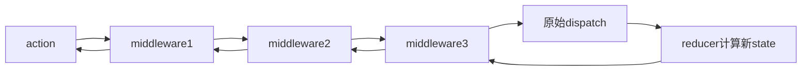

## 一句话概括

手写 Redux（80 行）和 Pinia（100 行）的核心逻辑，本质上是实现一个**具备订阅-通知机制的全局状态容器**，Redux 强调纯函数和不可变数据，Pinia 则借助 Vue3 响应式系统实现更直观的 API。

## 一、背景与意义

### 1.1 状态管理解决了什么问题

在组件化架构中，当多个组件需要共享某个状态时，**状态提升**（Lifting State Up）是第一反应——把状态移到最近的共同祖先组件。但随着应用规模增长，这种方案会遇到几个痛点：

- **Props Drilling**：状态需要穿过 5-6 层无关组件才能到达目标组件
- **跨页面/跨路由状态**：两个没有父子关系的组件需要共享数据
- **Side Effect 管理**：异步操作（API 调用）散落在各个组件中，难以追溯和测试

### 1.2 主流方案的演进

```
Flux (2014) → Redux (2015) → MobX (2015) → Recoil (2020) → Zustand (2021) → Jotai (2022)
                       ↓
                   Pinia (Vue3)
                  Vuex → Pinia
```

状态管理的核心理念也在不断进化：从单向数据流（Redux），到响应式自动追踪（MobX），到原子化状态（Recoil/Jotai），再到极简 Hook 式（Zustand）。

## 二、概念与定义

### 2.1 核心概念对比

| 概念 | Redux | Pinia |
|---|---|---|
| **State** | 一个全局 store 对象 | 多个 store，每个即一个响应式对象 |
| **Action** | 返回 action 对象的函数 `{ type, payload }` | 直接修改 state 的方法 |
| **Reducer** | 纯函数 `(state, action) → newState` | 无（直接在 action 中修改） |
| **Mutation** | 无（Redux Toolkit 有） | 无（Pinia 鼓励直接修改） |
| **Getter** | `useSelector` + 选择器函数 | `getters: { ... }` 计算属性 |
| **Middleware** | 中间件链（compose） | 插件系统 |

### 2.2 设计哲学差异

**Redux 哲学**："Predictable state container"
- 状态是只读的，必须通过 action 和 reducer 更新
- 使用纯函数保证可预测性和可测试性
- 时间旅行调试（DevTools）是核心卖点

**Pinia 哲学**："Intuitive, type-safe store"
- 利用 Vue3 响应式系统，修改状态就像修改普通对象
- TypeScript 一等支持，天然类型推断
- Module 化设计，一个 store 就是一个独立模块

## 三、最小示例

### 3.1 手写 Redux（80 行）

```javascript
// ========== 迷你 Redux ==========

/**
 * createStore - Redux 核心
 * reducer: (state, action) => newState
 * initialState: 初始状态
 */
function createStore(reducer, initialState) {
  let state = initialState;
  const listeners = new Set();
  let isDispatching = false;

  const getState = () => state;

  const dispatch = (action) => {
    // 防止 reducer 内重复 dispatch
    if (isDispatching) {
      throw new Error('Reducers may not dispatch actions.');
    }

    try {
      isDispatching = true;
      state = reducer(state, action);
    } finally {
      isDispatching = false;
    }

    // 通知所有订阅者
    listeners.forEach(listener => {
      try {
        listener();
      } catch (e) {
        // 一个 listener 的异常不应影响其他 listener
        console.error('Store listener error:', e);
      }
    });

    return action;
  };

  const subscribe = (listener) => {
    listeners.add(listener);
    // 返回退订函数
    return () => {
      listeners.delete(listener);
    };
  };

  // 初始化 state——用一个虚拟 action 触发 reducer
  dispatch({ type: '@@redux/INIT' });

  return { getState, dispatch, subscribe };
}

/**
 * combineReducers - 合并多个 reducer
 */
function combineReducers(reducers) {
  return (state = {}, action) => {
    const nextState = {};
    let hasChanged = false;

    for (const key of Object.keys(reducers)) {
      const reducer = reducers[key];
      const previousStateForKey = state[key];
      const nextStateForKey = reducer(previousStateForKey, action);
      
      nextState[key] = nextStateForKey;
      hasChanged = hasChanged || nextStateForKey !== previousStateForKey;
    }

    return hasChanged ? nextState : state;
  };
}

/**
 * applyMiddleware - 中间件系统
 * 通过重写 dispatch 实现中间件链
 */
function applyMiddleware(...middlewares) {
  return (createStore) => (reducer, initialState) => {
    const store = createStore(reducer, initialState);
    let dispatch = store.dispatch;

    // 中间件 API
    const middlewareAPI = {
      getState: store.getState,
      dispatch: (action) => dispatch(action),
    };

    // 将 middleware 链接起来
    const chain = middlewares.map(middleware => middleware(middlewareAPI));
    dispatch = compose(...chain)(store.dispatch);

    return { ...store, dispatch };
  };
}

// compose 工具函数：f(g(h(x))) → compose(f, g, h)(x)
function compose(...funcs) {
  if (funcs.length === 0) return (arg) => arg;
  if (funcs.length === 1) return funcs[0];
  return funcs.reduce((a, b) => (...args) => a(b(...args)));
}

// ========== 使用示例 ==========
// 定义 reducer
const initialState = { count: 0, todos: [] };

function counterReducer(state = 0, action) {
  switch (action.type) {
    case 'INCREMENT': return state + 1;
    case 'DECREMENT': return state - 1;
    case 'ADD': return state + action.payload;
    default: return state;
  }
}

function todosReducer(state = [], action) {
  switch (action.type) {
    case 'ADD_TODO':
      return [...state, { id: Date.now(), text: action.payload, done: false }];
    case 'TOGGLE_TODO':
      return state.map(todo =>
        todo.id === action.payload ? { ...todo, done: !todo.done } : todo
      );
    case 'REMOVE_TODO':
      return state.filter(todo => todo.id !== action.payload);
    default:
      return state;
  }
}

// 组合 reducer
const rootReducer = combineReducers({
  count: counterReducer,
  todos: todosReducer,
});

// 创建 store
const store = createStore(rootReducer);

// 订阅
const unsubscribe = store.subscribe(() => {
  console.log('State updated:', store.getState());
});

// 分发 action
store.dispatch({ type: 'INCREMENT' }); // State updated: { count: 1, todos: [] }
store.dispatch({ type: 'ADD_TODO', payload: '学习 Redux' }); // State updated: { count: 1, todos: [{id: ..., text: '学习 Redux', done: false}] }
store.dispatch({ type: 'TOGGLE_TODO', payload: store.getState().todos[0].id });

// 退订
unsubscribe();
store.dispatch({ type: 'DECREMENT' }); // 不再输出
```

### 3.2 手写 Pinia（100 行）

```javascript
// ========== 模拟 Vue3 响应式系统（极简版）==========
const targetMap = new WeakMap();
let activeEffect = null;

function track(target, key) {
  if (!activeEffect) return;
  let depsMap = targetMap.get(target);
  if (!depsMap) targetMap.set(target, depsMap = new Map());
  let deps = depsMap.get(key);
  if (!deps) depsMap.set(key, deps = new Set());
  deps.add(activeEffect);
}

function trigger(target, key) {
  const depsMap = targetMap.get(target);
  if (!depsMap) return;
  depsMap.get(key)?.forEach(fn => {
    if (fn !== activeEffect) fn();
  });
}

function reactive(obj) {
  return new Proxy(obj, {
    get(target, key, receiver) {
      track(target, key);
      return Reflect.get(target, key, receiver);
    },
    set(target, key, value, receiver) {
      const old = Reflect.get(target, key);
      const result = Reflect.set(target, key, value, receiver);
      if (old !== value) trigger(target, key);
      return result;
    }
  });
}

function ref(value) {
  const r = {
    get value() { track(r, 'value'); return value; },
    set value(newVal) {
      if (newVal !== value) {
        value = newVal;
        trigger(r, 'value');
      }
    }
  };
  return r;
}

function computed(getter) {
  let cached, dirty = true;
  const c = {
    get value() {
      track(c, 'value');
      if (dirty) { cached = getter(); dirty = false; }
      return cached;
    }
  };
  // 用 effect 监听依赖变化
  const runner = () => { if (!dirty) { dirty = true; trigger(c, 'value'); } };
  activeEffect = runner;
  getter(); // 收集依赖
  activeEffect = null;
  return c;
}

// ========== Pinia 核心 ==========
let _piniaInstance = null;

function createPinia() {
  const state = reactive({});
  const _stores = new Map();
  const _installing = new Set();

  _piniaInstance = {
    state,
    _stores,
    install(app) {
      app.config.globalProperties.$pinia = this;
    },
  };

  return _piniaInstance;
}

function defineStore(id, storeSetup) {
  // 确保 Pinia 已创建
  if (!_piniaInstance) {
    throw new Error('createPinia() must be called before defineStore()');
  }

  // 如果 store 已存在，返回缓存的实例
  if (_piniaInstance._stores.has(id)) {
    return _piniaInstance._stores.get(id);
  }

  // 执行 store 工厂函数获取状态和方法
  const store = storeSetup();

  // 将 store 中的 ref 和 reactive 状态关联到 Pinia 的全局 state
  const $state = {};
  for (const key of Object.keys(store)) {
    const val = store[key];
    if (val && typeof val === 'object' && 'value' in val && '_isRef' in (val.__proto__ || {})) {
      // 是 ref，自动解包到 state
      $state[key] = val.value;
    }
  }

  // 包装 store 为 Proxy —— 自动解包 ref
  const wrappedStore = new Proxy(store, {
    get(target, key) {
      const val = Reflect.get(target, key);
      // 自动解包 ref
      if (val && typeof val === 'object' && 'value' in val) {
        return val.value;
      }
      return val;
    },
    set(target, key, newValue) {
      const oldVal = Reflect.get(target, key);
      if (oldVal && typeof oldVal === 'object' && 'value' in oldVal) {
        oldVal.value = newValue; // 通过 ref 的 setter 触发响应
        return true;
      }
      return Reflect.set(target, key, newValue);
    }
  });

  // 缓存 store 实例
  _piniaInstance._stores.set(id, wrappedStore);

  // 重置 action 内的 this
  for (const key of Object.keys(store)) {
    if (typeof store[key] === 'function') {
      store[key] = store[key].bind(wrappedStore);
    }
  }

  return wrappedStore;
}

// 使用 ref 辅助函数
function useStore(id) {
  const store = _piniaInstance?._stores.get(id);
  if (!store) throw new Error(`Store "${id}" has not been defined.`);
  return store;
}

// ========== 使用示例 ==========
const pinia = createPinia();

// 定义一个 todo store
const useTodoStore = defineStore('todos', () => {
  const todos = ref([
    { id: 1, text: '学习 Pinia', done: false },
    { id: 2, text: '手写状态管理', done: true },
  ]);
  const filter = ref('all');

  const filteredTodos = computed(() => {
    if (filter.value === 'all') return todos.value;
    return todos.value.filter(t => 
      filter.value === 'done' ? t.done : !t.done
    );
  });

  const activeCount = computed(() => 
    todos.value.filter(t => !t.done).length
  );

  function addTodo(text) {
    todos.value = [...todos.value, {
      id: Date.now(),
      text,
      done: false
    }];
  }

  function toggleTodo(id) {
    todos.value = todos.value.map(t =>
      t.id === id ? { ...t, done: !t.done } : t
    );
  }

  function removeTodo(id) {
    todos.value = todos.value.filter(t => t.id !== id);
  }

  return {
    todos, filter, filteredTodos, activeCount,
    addTodo, toggleTodo, removeTodo,
  };
});

// 使用 store
const store = useStore('todos');
console.log(store.filter); // 'all'（自动解包 ref）
store.addTodo('深入源码');
console.log(store.todos.length); // 3
```

## 四、核心知识点拆解

### 4.1 发布-订阅模式

Redux 的 `subscribe` / `dispatch` 本质上就是发布-订阅模式：

```mermaid
graph LR
    A[组件: dispatch(action)] --> B[Store: reducer 计算新状态]
    B --> C[Store: 遍历 listeners]
    C --> D[Listener A]
    C --> E[Listener B]
    C --> F[Listener C]
```

**关键设计考量**：
- `listeners` 为什么用 `Set` 而不是数组？——避免重复订阅，且删除元素 O(1)
- 为什么在 `dispatch` 后通知？——保证了通知时 state 已经更新完毕
- 为什么 `subscribe` 返回退订函数？——方便 React useEffect 清理

### 4.2 Redux 的不可变数据更新

Redux 要求 reducer 是纯函数，这意味着**不能修改原 state，必须返回新的对象**：

```javascript
// ❌ 错误：直接修改 state
function todosReducer(state, action) {
  if (action.type === 'TOGGLE') {
    state[action.index].done = !state[action.index].done; // 直接修改！
    return state;
  }
  return state;
}

// ✅ 正确：返回新对象
function todosReducer(state, action) {
  if (action.type === 'TOGGLE') {
    return state.map((todo, i) =>
      i === action.index ? { ...todo, done: !todo.done } : todo
    );
  }
  return state;
}
```

**为什么不可变更新如此重要？**

1. **引用相等比较**：React 通过 `===` 比较新旧 props 来决定是否重渲染。如果直接修改对象，引用不变，组件不会更新。
2. **时间旅行调试**：Redux DevTools 记录 action 链，可以回溯到任意历史状态。如果状态被直接修改，历史状态也会被污染。
3. **更简单的数据流推理**：纯函数保证给定相同输入，总是产生相同输出，没有副作用。

### 4.3 Redux 中间件机制

中间件（Middleware）是 Redux 中最优雅的设计之一。它通过**函数组合**（composition）增强 dispatch：

```javascript
// 中间件的签名
const middleware = (store) => (next) => (action) => {
  // 处理前
  const result = next(action);
  // 处理后
  return result;
};

// 以 redux-thunk 为例
function thunkMiddleware({ dispatch, getState }) {
  return (next) => (action) => {
    // 如果 action 是函数（thunk），调用它
    if (typeof action === 'function') {
      return action(dispatch, getState);
    }
    // 否则正常传递
    return next(action);
  };
}
```

**中间件的洋葱模型**：

```
applyMiddleware(m1, m2, m3)(store.dispatch)
   ↓
m1(storeAPI)(next=m2(storeAPI)(next=m3(storeAPI)(store.dispatch)))
```

每个中间件都在 dispatch 链中包裹一层，形成"洋葱圈"结构：



### 4.4 Pinia 的 setup 语法与 Options API

Pinia 提供两种定义 Store 的方式：

**Options API 风格**——直观，适合简单场景：
```javascript
const useCounterStore = defineStore('counter', {
  state: () => ({ count: 0 }),
  getters: {
    double: (state) => state.count * 2,
  },
  actions: {
    increment() {
      this.count++;
    },
  },
});
```

**Setup 语法**——灵活，适合复杂场景（也是手写实现的基础）：
```javascript
const useCounterStore = defineStore('counter', () => {
  const count = ref(0);
  const double = computed(() => count.value * 2);
  function increment() { count.value++; }
  return { count, double, increment };
});
```

**两者等价**：Pinia 在内部将 Options API 转换为 Setup 语法。

### 4.5 Pinia 的命名空间 vs Vuex 的 Module

```javascript
// Vuex 的 module（有嵌套、有命名空间）
const store = new Vuex.Store({
  modules: {
    cart: {
      namespaced: true,
      state: { items: [] },
      getters: { totalItems: state => state.items.length },
      actions: { addToCart({ commit }, item) { ... } },
    },
    user: {
      namespaced: true,
      state: { profile: null },
      actions: { login({ commit }, credentials) { ... } },
    },
  },
});
// 使用：store.dispatch('cart/addToCart', item)

// Pinia 的独立 store（扁平化）
const useCartStore = defineStore('cart', () => { ... });
const useUserStore = defineStore('user', () => { ... });
// 使用：cartStore.addToCart(item)
```

**Pinia 的扁平化设计优势**：
- 无嵌套模块，类型推断更直接
- 一个 store 就是一个独立的 `useXxx` Hook
- 不需要 `namespaced` 配置，store id 就是天然命名空间

## 五、实战案例：同构状态管理示例

### 案例：购物车 + 用户认证

构建一个同时使用 Redux 风格和 Pinia 风格的状态管理示例——一个电商页面的购物车和个人中心。

```javascript
// ========== 场景：电商购物车 + 用户认证 ==========

// ──────── Redux 风格：购物车模块 ────────
// 适用场景：需要清晰的操作记录、可撤销、中间件（如埋点日志）

// Action Types
const CART_ACTIONS = {
  ADD_ITEM: 'cart/ADD_ITEM',
  REMOVE_ITEM: 'cart/REMOVE_ITEM',
  UPDATE_QUANTITY: 'cart/UPDATE_QUANTITY',
  CLEAR_CART: 'cart/CLEAR_CART',
  APPLY_COUPON: 'cart/APPLY_COUPON',
};

// Reducer
const initialState = {
  items: [],
  coupon: null,
  lastAction: null,
};

function cartReducer(state = initialState, action) {
  switch (action.type) {
    case CART_ACTIONS.ADD_ITEM: {
      const existingIndex = state.items.findIndex(
        item => item.productId === action.payload.productId
      );
      
      if (existingIndex >= 0) {
        // 已存在：增加数量
        const newItems = state.items.map((item, index) =>
          index === existingIndex
            ? { ...item, quantity: item.quantity + action.payload.quantity }
            : item
        );
        return { ...state, items: newItems, lastAction: 'add_quantity' };
      }
      
      return {
        ...state,
        items: [...state.items, {
          productId: action.payload.productId,
          name: action.payload.name,
          price: action.payload.price,
          quantity: action.payload.quantity,
          image: action.payload.image,
        }],
        lastAction: 'add_new',
      };
    }

    case CART_ACTIONS.REMOVE_ITEM:
      return {
        ...state,
        items: state.items.filter(item => item.productId !== action.payload),
        lastAction: 'remove',
      };

    case CART_ACTIONS.UPDATE_QUANTITY:
      return {
        ...state,
        items: state.items.map(item =>
          item.productId === action.payload.productId
            ? { ...item, quantity: action.payload.quantity }
            : item
        ),
        lastAction: 'update_quantity',
      };

    case CART_ACTIONS.APPLY_COUPON:
      return { ...state, coupon: action.payload };

    case CART_ACTIONS.CLEAR_CART:
      return { ...initialState, lastAction: 'clear' };

    default:
      return state;
  }
}

// Action Creators
const addToCart = (product) => ({
  type: CART_ACTIONS.ADD_ITEM,
  payload: product,
});

const removeFromCart = (productId) => ({
  type: CART_ACTIONS.REMOVE_ITEM,
  payload: productId,
});

// Selectors (类似 Redux 的 getter)
function getCartTotal(state) {
  return state.items.reduce(
    (total, item) => total + item.price * item.quantity, 0
  );
}

function getItemCount(state) {
  return state.items.reduce((count, item) => count + item.quantity, 0);
}

function getCartWithDiscount(state) {
  const subtotal = getCartTotal(state);
  if (state.coupon) {
    const discount = state.coupon.type === 'percentage'
      ? subtotal * (state.coupon.value / 100)
      : state.coupon.value;
    return subtotal - Math.min(discount, subtotal);
  }
  return subtotal;
}

// 日志中间件
const loggerMiddleware = (store) => (next) => (action) => {
  console.log(`[Redux] Dispatching: ${action.type}`, action.payload);
  const result = next(action);
  console.log(`[Redux] New state:`, store.getState());
  return result;
};

// 异步中间件（thunk）
const thunkMiddleware = (store) => (next) => (action) => {
  if (typeof action === 'function') {
    return action(store.dispatch, store.getState);
  }
  return next(action);
};

// 创建购物车 store
const cartStore = createStore(
  cartReducer,
  applyMiddleware(loggerMiddleware, thunkMiddleware)
);

// ──────── Pinia 风格：用户认证模块 ────────
// 适用场景：频繁读写、需要计算属性、与 Vue 组件深度绑定的状态

const useAuthStore = defineStore('auth', () => {
  // State
  const user = ref(null);
  const token = ref(localStorage.getItem('auth_token'));
  const isAuthenticated = computed(() => !!token.value && !!user.value);
  
  // 加载状态
  const loading = ref(false);
  const error = ref(null);

  // Computed
  const displayName = computed(() => {
    if (!user.value) return '';
    return user.value.nickname || user.value.username || user.value.email;
  });

  const permissions = computed(() => {
    return user.value?.roles?.flatMap(role => role.permissions) || [];
  });

  const hasPermission = (perm) => permissions.value.includes(perm);

  // Actions
  async function login(credentials) {
    loading.value = true;
    error.value = null;
    
    try {
      // 模拟 API 调用
      const response = await mockLoginAPI(credentials);
      token.value = response.token;
      user.value = response.user;
      localStorage.setItem('auth_token', response.token);
      return true;
    } catch (e) {
      error.value = e.message;
      return false;
    } finally {
      loading.value = false;
    }
  }

  async function logout() {
    token.value = null;
    user.value = null;
    localStorage.removeItem('auth_token');
  }

  async function fetchProfile() {
    if (!token.value) return;
    loading.value = true;
    try {
      const response = await mockFetchProfileAPI(token.value);
      user.value = response;
    } catch (e) {
      // token 过期
      if (e.status === 401) {
        await logout();
      }
      error.value = e.message;
    } finally {
      loading.value = false;
    }
  }

  async function updateProfile(updates) {
    loading.value = true;
    try {
      const response = await mockUpdateProfileAPI(updates);
      user.value = { ...user.value, ...response };
      return true;
    } catch (e) {
      error.value = e.message;
      return false;
    } finally {
      loading.value = false;
    }
  }

  return {
    user, token, isAuthenticated, displayName, permissions,
    loading, error,
    hasPermission, login, logout, fetchProfile, updateProfile,
  };
});

// Mock API（示例用）
function mockLoginAPI(credentials) {
  return new Promise((resolve, reject) => {
    setTimeout(() => {
      if (credentials.password === 'error') {
        reject(new Error('密码错误'));
      } else {
        resolve({
          token: `jwt_${Date.now()}`,
          user: {
            id: 1,
            username: credentials.username || 'demo',
            nickname: 'Demo 用户',
            email: 'demo@example.com',
            avatar: 'https://api.dicebear.com/7.x/avataaars/svg?seed=demo',
            roles: [
              { name: 'user', permissions: ['read:products', 'write:cart'] },
            ],
          },
        });
      }
    }, 800);
  });
}

// ========== React 组件中使用（模拟）==========
// 注意：实际 React 中需要使用 react-redux 的 Provider/connect 或 useSelector/useDispatch
// 这里展示的是逻辑层面的使用模式

function ShoppingCart() {
  // 订阅 Redux store
  const forceUpdate = () => {}; // 实际 React 中通过 useSelector 完成

  // 在 React 中等价于 useEffect(() => subscribe(forceUpdate), [])
  const unsubscribe = cartStore.subscribe(() => {
    console.log('Cart updated, triggering React re-render...');
    // 实际 React 中，Redux 的 useSelector 已经处理了订阅和选择逻辑
  });

  // 获取状态
  const state = cartStore.getState();

  // 使用 Action Creator
  function handleAddItem(product) {
    cartStore.dispatch(addToCart(product));
  }

  function handleRemoveItem(productId) {
    cartStore.dispatch(removeFromCart(productId));
  }

  // 读选择器
  const total = getCartTotal(state);

  // 在组件 unmount 时退订
  return () => unsubscribe();
}

// 在 React 组件中使用 Pinia
function UserProfile() {
  const authStore = useStore('auth');

  // 直接读取（自动解包 ref）
  const { user, loading, isAuthenticated, login, logout } = authStore;

  // 直接调用 actions
  async function handleLogin() {
    await login({ username: 'demo', password: '123456' });
    console.log('登录成功:', authStore.user);
  }

  // 在模板中可以直接使用：
  // {isAuthenticated && <div>欢迎, {displayName}</div>}
  // 数据变化时组件自动更新
}
```

## 六、底层原理

### 6.1 Redux 的依赖追踪 vs Vue3/Pinia 的响应式

| 特性 | Redux | Pinia |
|---|---|---|
| **更新检测** | 手动订阅 + 引用比较 | Proxy 自动追踪 |
| **性能开销** | 每次 dispatch 通知所有订阅者 | 只通知依赖变化的订阅者 |
| **重新渲染时机** | 由 React-Redux 的 useSelector 决定 | 由 Vue3 的响应式系统自动决定 |
| **不必要的更新** | 可以通过 selector 精细化避免 | 自动避免（未使用的属性不追踪） |

**Redux 为什么不使用 Proxy？**
- Redux 诞生于 2015 年，那时 Proxy 在 IE 上不支持
- Redux 的设计哲学强调"显式更新"——dispatch → reducer → newState 的链路清晰可见，Proxy 的隐式追踪与之相悖
- React-Redux 使用 `shallowEqual` 比较新旧 state 来决定是否更新，与 React 的不可变数据范式一致

**Pinia 为什么选择 Proxy？**
- Pinia 是 Vue3 生态的一部分，与 Vue3 的响应式系统天然融合
- Proxy 提供了最少的样板代码——开发者只需要读写属性，不需要 dispatch action
- 与 Vue3 的 Composition API（setup 函数）设计一致

### 6.2 Redux 的 subscribe / dispatch 源码级分析

```javascript
// 简化版 Redux createStore 源码分析

let currentState = preloadedState
let currentReducer = reducer
let currentListeners = new Set()
let nextListeners = currentListeners // 快照机制

function dispatch(action) {
  // 1. 校验 action 是否为 plain object
  if (!isPlainObject(action)) {
    throw new Error('Actions must be plain objects. Use custom middleware for async actions.')
  }
  
  // 2. 校验 action.type 是否存在
  if (typeof action.type === 'undefined') {
    throw new Error('Actions may not have an undefined "type" property.')
  }

  // 3. 执行 reducer 计算新状态
  //    注意：源码中这里捕获异常防止 reducer 抛出影响整个应用
  try {
    isDispatching = true
    currentState = currentReducer(currentState, action)
  } finally {
    isDispatching = false
  }

  // 4. 通知所有监听器
  const listeners = currentListeners = nextListeners
  listeners.forEach(listener => listener())

  return action
}

function subscribe(listener) {
  // 防止在 dispatch 过程中订阅/退订
  if (isDispatching) {
    throw new Error('You may not call store.subscribe() while a reducer is executing.')
  }
  
  let isSubscribed = true
  nextListeners = new Set(currentListeners) // 快照：确保迭代期间修改不会影响当前循环
  nextListeners.add(listener)

  return function unsubscribe() {
    if (!isSubscribed) return
    if (isDispatching) {
      throw new Error('You may not unsubscribe from a store listener while a reducer is executing.')
    }
    
    isSubscribed = false
    nextListeners = new Set(currentListeners)
    nextListeners.delete(listener)
  }
}
```

**核心设计细节——监听器快照**：
```javascript
nextListeners = new Set(currentListeners)
```
为什么需要快照？考虑这个场景：

```javascript
const unsubA = store.subscribe(() => {
  unsubB(); // 在 listenerA 中退订 listenerB
});
const unsubB = store.subscribe(() => {
  console.log('B 收到了更新');
});

store.dispatch({ type: 'SOME_ACTION' });
```

如果没有快照，在 dispatch 过程中直接修改 `currentListeners`，`listenerB` 的退订会导致 `forEach` 迭代不稳定（数组索引混乱或 Set 迭代异常）。快照保证迭代的是 dispatch 瞬间的 listeners 集合，不受中途修改影响。

### 6.3 Redux vs Zustand vs Jotai 的架构对比

```javascript
// Zustand——极简状态管理
import { create } from 'zustand';

const useStore = create((set) => ({
  count: 0,
  increment: () => set((state) => ({ count: state.count + 1 })),
}));

// Jotai——原子状态
import { atom, useAtom } from 'jotai';

const countAtom = atom(0);
const doubleAtom = atom((get) => get(countAtom) * 2);
```

**三者的底层差异**：

| | Redux | Zustand | Jotai |
|---|---|---|---|
| **状态存储** | 一个 Store 对象 | 一个 Store 对象（但通过 Hook 切分） | 多个原子 Atom |
| **订阅粒度** | 整个 Store | 可选择器粒度 | 原子粒度 |
| **更新方式** | dispatch → reducer | set(state → newState) | atom 直接替换 |
| **内部实现** | 发布-订阅 | useSyncExternalStore | WeakMap + Proxy |
| **React 绑定** | react-redux 的 Context | create 返回 Hook | atom + useAtom |
| **是否依赖 React** | 否（独立运行时） | 否 | 是 |

**Zustand 的核心实现（极度简化）**：
```javascript
function create(createState) {
  let state;
  const listeners = new Set();
  
  const setState = (partial, replace) => {
    const nextState = typeof partial === 'function'
      ? partial(state)
      : partial;
    
    if (!Object.is(nextState, state)) {
      state = replace ? nextState : { ...state, ...nextState };
      listeners.forEach(l => l(state));
    }
  };
  
  const getState = () => state;
  const subscribe = (listener) => {
    listeners.add(listener);
    return () => listeners.delete(listener);
  };
  
  state = createState(setState, getState, {});
  
  return (selector = (s) => s) => {
    // 在 React 中，使用 useSyncExternalStore 实现外部状态同步
    // 这里简化：直接返回 state 并根据 selector 切片
    const slice = selector(state);
    // ... React 绑定逻辑
    return [slice, setState];
  };
}
```

### 6.4 React 的 useSyncExternalStore

React 18 引入的 `useSyncExternalStore` 是 React 连接外部状态管理的"官方桥梁"。Redux、Zustand、Jotai 都是通过它订阅外部 store 的：

```javascript
import { useSyncExternalStore } from 'react';

function useSelector(selector) {
  const store = useStore(); // 从 Context 获取 Redux store
  
  // subscribe: 注册回调，store 变化时通知 React
  // getSnapshot: 返回当前需要的状态切片
  return useSyncExternalStore(
    store.subscribe, // subscribe(listener) → unsubscribe
    () => selector(store.getState()), // 返回当前快照
    () => selector(initialState), // 服务端渲染用的初始快照
  );
}
```

`useSyncExternalStore` 解决了外部状态与 React 并发模式（Concurrent Mode）的兼容性问题——确保在并发渲染中读取的状态始终与当前 React 树的渲染一致。

## 七、高频面试题解析

### 面试题 1：为什么 Redux 的 reducer 必须是一个纯函数？如果不纯会怎样？

**问题分析**：这是 Redux 最基础的面试题，但面试官希望听到的不仅是"纯函数定义"，而是"如果 reducer 不纯，破环了 Redux 的哪些具体机制"。

**深度解答**：

reducer 必须纯函数的核心原因有三：

1. **时间旅行调试**：
   ```javascript
   // Redux DevTools 实现"回到过去"的逻辑
   function jumpToState(index) {
     const targetAction = actionsHistory[index];
     // 从初始状态开始，重放到目标 action
     let state = initialState;
     for (let i = 0; i <= index; i++) {
       state = rootReducer(state, actionsHistory[i].action);
     }
     return state;
   }
   ```
   如果 reducer 不纯（如 `Math.random()`、`Date.now()`、网络请求），重放时会产生不同的结果——历史状态不可再现，时间旅行功能完全失效。

2. **服务端渲染同构**：
   ```javascript
   // 服务端：渲染 HTML 时执行 reducer 生成初始状态
   const serverState = rootReducer(undefined, { type: 'INIT' });
   // 客户端：用服务端状态恢复，继续执行 reducer
   // 如果 reducer 不纯，客户端和服务端的状态不一致 → 水合失败
   ```

3. **性能优化——浅比较**：
   React-Redux 使用浅比较决定是否重渲染：
   ```javascript
   function areStatesEqual(nextState, prevState) {
     return nextState === prevState; // 引用相等
   }
   ```
   如果 reducer 返回了同一个引用（直接修改原对象），React 不会检测到变化 → UI 不更新。

**如果不纯的具体后果**：
```javascript
// ❌ reducer 调用 API
function userReducer(state, action) {
  if (action.type === 'FETCH_USER') {
    fetchUser().then(user => { state.user = user; }); // 副作用的几种错误形式
    return state; // 返回的 state 没有变化！
  }
}
```

### 面试题 2：Pinia 为什么比 Vuex 更好？它的设计解决了 Vuex 的哪些痛点？

**问题分析**：考察对 Vue 生态演进的理解，不能只是说"Pinia 更简洁"。

**深度解答**：

| 痛点 | Vuex | Pinia | 解决方式 |
|---|---|---|---|
| **TypeScript 支持** | 需要大量手动类型声明 | 天然类型安全 | Pinia 直接用 TS 推导 `state`、`getters`、`actions` 的类型 |
| **Module 嵌套** | 多层嵌套、namespaced 配置复杂 | 扁平化 | 一个 store 一个 id，无嵌套 |
| **Mutations 样板** | 必须写 mutation 和 action 两层 | 全部用 action | 省掉 mutation 层，直接修改 state |
| **服务端渲染** | 需要额外配置 | 天然支持 | 每个请求可创建独立的 Pinia 实例 |
| **Composition API** | 需要 mapState/mapActions 辅助函数 | setup 函数 | 使用 Vue3 的 `ref`/`computed` 原生语法 |
| **DevTools** | 基础支持 | 深度集成 | 自动追踪时间线，actions 自动记录 |

**具体案例——类型安全**：
```typescript
// Vuex（手动声明类型）
interface State { count: number }
const store: Store<State> = new Vuex.Store({ ... });
const count = store.state.count; // 手动标注类型

// Pinia（自动推断）
const useStore = defineStore('counter', () => {
  const count = ref(0);
  return { count };
});
const store = useStore();
store.count; // 自动推导为 number ✅
```

### 面试题 3：如何在 Redux 中处理异步请求？在 Pinia 中呢？

**问题分析**：考察对异步处理机制的理解深度，以及两种不同设计哲学下的解决方案对比。

**深度解答**：

**Redux 处理异步——需要中间件**：

方案一：redux-thunk（最常用）
```javascript
// thunk action creator
function fetchUser(id) {
  return async (dispatch, getState) => {
    dispatch({ type: 'FETCH_USER_START' });
    
    try {
      const user = await api.getUser(id);
      dispatch({ type: 'FETCH_USER_SUCCESS', payload: user });
    } catch (error) {
      dispatch({ type: 'FETCH_USER_ERROR', payload: error.message });
    }
  };
}

// 使用
store.dispatch(fetchUser(42));
// → FETCH_USER_START
// → (异步等待) FETCH_USER_SUCCESS / FETCH_USER_ERROR
```

方案二：redux-saga（复杂异步流管理）
```javascript
// saga 使用 Generator 管理复杂异步流程
function* watchFetchUser() {
  yield takeEvery('FETCH_USER_REQUEST', function* (action) {
    try {
      yield put({ type: 'FETCH_USER_START' });
      const user = yield call(api.getUser, action.payload);
      yield put({ type: 'FETCH_USER_SUCCESS', payload: user });
    } catch (e) {
      yield put({ type: 'FETCH_USER_ERROR', payload: e.message });
    }
  });
}
```

**Pinia 处理异步——直接使用 async/await**：
```javascript
const useStore = defineStore('user', () => {
  const user = ref(null);
  const loading = ref(false);
  const error = ref(null);

  // 直接就是 async 函数，不需要任何中间件
  async function fetchUser(id) {
    loading.value = true;
    error.value = null;
    
    try {
      // 状态变化会自动触发相关组件更新
      user.value = await api.getUser(id);
    } catch (e) {
      error.value = e.message;
    } finally {
      loading.value = false;
    }
  }

  return { user, loading, error, fetchUser };
});

// 使用
const store = useStore();
await store.fetchUser(42); // 直接 await
// 或非阻塞调用
store.fetchUser(42);
```

**核心区别总结**：
- Redux：异步是"特殊情况"——需要中间件（thunk/saga）来增强 dispatch 的能力
- Pinia：异步是"默认能力"——因为可以直接在 action 中修改响应式状态

## 八、总结与扩展

### 手写实现的价值

1. **Redux 部分**：理解了纯函数、不可变数据、发布-订阅、中间件链的核心机制
2. **Pinia 部分**：理解了响应式系统、setup 函数、ref/computed、模块化设计

### 什么时候选择谁？

| 场景 | 推荐方案 |
|---|---|
| 大型应用，需要严格的数据流控制 | Redux + redux-toolkit |
| 中型应用，需要高开发效率 | Zustand 或 Redux Toolkit |
| Vue3 项目 | Pinia |
| 需要 SSR/同构 | Redux 或 Pinia |
| 原子化状态管理 | Jotai（React） |
| 极简状态，不需要全局 store | React Context / provide-inject |

### 从手写到真实库

手写版本理解了核心逻辑，但真实库还包含：
- **Redux**: Redux Toolkit（简化配置）、immer（可变语法生成不可变状态）、createAsyncThunk（简化异步）、Entity Adapter（标准化数据更新）
- **Pinia**: storeToRefs（解构保持响应式）、$subscribe（状态变化回调）、$patch（批量更新）、插件系统

```javascript
// Redux Toolkit 的 createSlice——结合了 reducer/action creator
import { createSlice } from '@reduxjs/toolkit';

const cartSlice = createSlice({
  name: 'cart',
  initialState: { items: [] },
  reducers: {
    addItem: (state, action) => {
      // immer 内部使用 Proxy 实现"可变语法"
      state.items.push(action.payload);
    },
  },
});
// 自动生成 action creator
cartSlice.actions.addItem({ id: 1, name: '商品' });
```

状态管理的核心哲学始终如一：**提供一套可靠的状态变更协议，让组件可以高效、可预测地读写全局数据**。无论 API 如何变化，底层原理始终相通。
