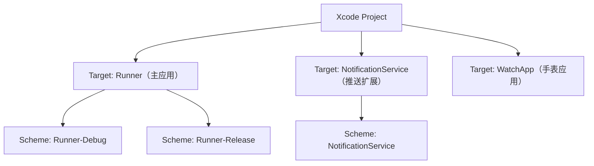

## 一句话概括

Xcode 项目远不止一个代码仓库，它是包含构建系统、资源配置、签名授权等十余种文件类型的完整工程体系——理解其内部结构是从 Flutter、React Native 或鸿蒙开发切入 iOS 原生扩展的必修课。

## 背景与意义

对于习惯了 `flutter create` 或 `npx react-native init` 一键生成工程的跨平台开发者来说，iOS 原生项目往往是一个令人畏惧的"黑盒"。每当遇到 iOS 构建报错、签名失败、权限配置遗漏或真机调试无法运行等问题时，不得不打开 Xcode，面对密密麻麻的文件面板和菜单选项，却不知道从何入手。

这种困扰本质上源于跨平台框架对原生部分的抽象设计。Flutter 的 dart:io 和 React Native 的 JavaScript 运行时都提供了一个"跨平台中间层"，开发者大部分时间都在这个中间层工作。但当需要调用原生摄像头的 `NSCameraUsageDescription`、配置推送证书的 `Push Notifications` 授权，或处理 Podfile 的依赖冲突时，就不得不揭开 Xcode 项目的面纱。

Xcode 项目不是一个简单的文件，而是一整套互相关联的配置文件集合，它们共同决定了：

- **构建流程**：代码如何被编译、链接和打包
- **签名与安全**：应用如何被签名以在真机上运行
- **能力授权**：应用可以访问哪些系统资源（摄像头、定位、推送等）
- **资源配置**：启动画面、图标、本地化字符串等静态资源如何组织
- **依赖管理**：第三方库和框架如何集成

对于 Flutter 和 RN 开发者而言，理解 Xcode 项目结构的意义尤其重大：

1. **调试效率提升**：构建报错后能迅速定位到是 pbxproj 冲突、Info.plist 配置遗漏还是 Entitlements 授权不足
2. **CI/CD 配置**：持续集成中常需要直接操作 pbxproj 或修改 Info.plist 的版本号
3. **原生插件开发**：需要向 Xcode 项目添加文件引用、依赖框架和 Build Phase 脚本
4. **团队协作**：多人同时修改 Xcode 项目文件导致的合并冲突需要手动解决

本章将从跨平台开发者的视角，系统拆解 Xcode 项目中的每个核心文件，让你不再把 Xcode 项目视为"咒语盒子"，而是变成一个清晰可理解的工程系统。

## 核心知识点拆解

### 一、.xcodeproj 与 pbxproj 文件的奥秘

每个 Xcode 项目都有一个 `.xcodeproj` 后缀的包。有趣的是，macOS 把它显示为一个文件，但实际上它是一个文件夹：

```
Runner.xcodeproj/
├── project.pbxproj    ← 项目的核心文件
├── project.xcworkspace/
│   ├── contents.xcworkspacedata
│   └── xcshareddata/
│       └── WorkspaceSettings.xcsettings
└── xcuserdata/
    └── username.xcuserdatad/
        └── xcschemes/
            └── xcschememanagement.plist
```

最核心的 `project.pbxproj` 是一个老式的 plist 格式文件（看起来像 JSON+引用的混合体）。新手最容易犯的错误是——直接在 Finder 中双击 `.xcodeproj` 的图标打开项目——实际上，对于使用 CocoaPods 的项目，应该打开同级的 `.xcworkspace` 文件。

**pbxproj 的内部结构**

pbxproj 文件的核心设计基于"全局对象引用"模式，类似数据库的主键-外键关系。每个实体都有一个 24 位十六进制 ID（如 `A1B2C3D4E5F6`），通过 UUID 交叉引用：

```pbxproj
rootObject = A1B2C3D4E5F6; /* 指向根对象 */

/* ──── 以下是几个主要 Section ──── */

/* 文件引用 — 记录项目中所有文件的路径和类型 */
PBXFileReference section:
A1B2C3D4E5F7001 /* AppDelegate.swift */ = {isa = PBXFileReference; lastKnownFileType = sourcecode.swift; path = AppDelegate.swift; sourceTree = "<group>"; };

/* 组引用 — 模拟 Finder 中的文件夹结构 */
PBXGroup section:
A1B2C3D4E5F7002 /* Runner */ = {isa = PBXGroup; children = (A1B2C3D4E5F7001, ...); };

/* 编译构建阶段 — 定义每个资源属于哪个阶段 */
PBXSourcesBuildPhase: /* Swift 和 ObjC 源文件 */
PBFrameworksBuildPhase: /* 链接的框架 */
PBXResourcesBuildPhase: /* Storyboard、Asset Catalog 等 */
PBXFrameworksBuildPhase: /* 链接 Framework */

/* 原生 Target — 每个 Target 是一个可构建的产品 */
PBXNativeTarget:
A1B2C3D4E5F7003 /* Runner */ = {isa = PBXNativeTarget; buildConfigurationList = ...; buildPhases = (...); productReference = ...; };
```

**理解 Build Phase（构建阶段）**

每个 Target 的构建过程被划分为多个 Phase（阶段），按顺序执行：

1. **Sources**：编译 Swift/ObjC/C/C++ 源文件
2. **Frameworks**：链接系统的 Framework（UIKit、Foundation 等）
3. **Resources**：拷贝资源文件（Assets.xcassets、Storyboard、xib 等）
4. **Copy Files**（可选）：拷贝特定文件到目标路径
5. **Shell Script**（可选）：运行自定义脚本，Flutter/RN 的 Build Phase 脚本就在这里

对于 Flutter 项目，打开 Runner Target 的 Build Phases，会看到类似 `[CP] Embed Pods Frameworks` 和 `[CP] Copy Pods Resources` 这样的 CocoaPods 脚本。此外，Flutter 还会添加一个脚本阶段来生成 `AppFrameworkInfo.plist`。

**合并冲突的噩梦**

当团队成员同时修改 Xcode 项目（比如各自添加文件）时，pbxproj 的合并冲突是所有 iOS 团队最头疼的问题。原因是 pbxproj 中的 UUID 是每次添加时随机生成的，而 Git 无法智能合并这些 UUID 引用。解决策略：

- 使用 `.gitattributes` 将 pbxproj 标记为 `merge=union`（不完全安全）
- 推荐使用 Xcode 的 Group 管理和文件引用操作避免手动编辑
- 频繁提交，减少冲突范围
- 使用 XcodeGen（基于 YAML 生成 xcodeproj）从根源消除冲突

### 二、Info.plist — 应用的"身份证"

`Info.plist` 是每个 iOS 应用必备的元信息文件，Xcode 新建项目时自动生成。它是一个 XML 格式的属性列表文件，系统在启动应用前读取它来获取关键配置。

**Bundle Identifier 和版本号**

```xml
<key>CFBundleIdentifier</key>
<string>com.yourcompany.yourapp</string>  <!-- 唯一标识符，和 Apple 开发者账号绑定 -->
<key>CFBundleVersion</key>
<string>12</string>                       <!-- Build 版本号，每次上传递增 -->
<key>CFBundleShortVersionString</key>
<string>1.2.3</string>                    <!-- 展示给用户的版本号 -->
```

跨平台开发者最容易踩的坑：在 Flutter 的 `pubspec.yaml` 中修改了 version，却在 Xcode 构建时发现版本号没变。这是因为 Flutter 项目会在 build 时自动同步 `pubspec.yaml` 的版本到 Info.plist，但如果没有执行 `flutter build ios` 而直接用 Xcode 构建，就不会触发这个同步。

**设备方向与界面配置**

```xml
<key>UISupportedInterfaceOrientations</key>
<array>
    <string>UIInterfaceOrientationPortrait</string>    <!-- 竖屏 -->
    <string>UIInterfaceOrientationLandscapeLeft</string> <!-- 横屏左 -->
</array>
<key>UIStatusBarStyle</key>
<string>UIStatusBarStyleDefault</string>
<key>UIViewControllerBasedStatusBarAppearance</key>
<false/>
```

**后台模式配置**

```xml
<key>UIBackgroundModes</key>
<array>
    <string>audio</string>                  <!-- 后台播放音频 -->
    <string>location</string>               <!-- 后台获取位置 -->
    <string>fetch</string>                  <!-- 后台数据获取 -->
    <string>remote-notification</string>    <!-- 推送唤醒 -->
    <string>processing</string>             <!-- 后台处理任务（iOS 13+） -->
</array>
```

后台模式需要在 Apple 开发者门户中为 App ID 声明，并在 Info.plist 中配置，两者缺一不可。对于跨平台项目，如果在 Dart 或 JS 中使用后台定位插件，一定要确认这俩地方都已配置。

### 三、Entitlements — 应用的"权限护照"

Entitlements（授权文件）是 Xcode 项目中最重要的安全配置文件之一。它告诉 iOS 系统："这个应用被允许访问以下能力"。

**常见 Entitlements 配置**

```xml
<?xml version="1.0" encoding="UTF-8"?>
<!DOCTYPE plist PUBLIC "-//Apple//DTD PLIST 1.0//EN" "http://www.apple.com/DTDs/PropertyList-1.0.dtd">
<plist version="1.0">
<dict>
    <!-- App Sandbox（macOS 特定） -->
    <key>com.apple.security.app-sandbox</key>
    <true/>

    <!-- iCloud -->
    <key>com.apple.developer.icloud-container-identifiers</key>
    <array>
        <string>iCloud.com.yourcompany.yourapp</string>
    </array>
    <key>com.apple.developer.ubiquity-kvstore-identifier</key>
    <string>$(TeamIdentifierPrefix)$(CFBundleIdentifier)</string>

    <!-- Push Notifications -->
    <key>com.apple.developer.aps-environment</key>
    <string>development</string>  <!-- 调试时为 development，发布时为 production -->

    <!-- Apple Pay -->
    <key>com.apple.developer.in-app-payments</key>
    <array>
        <string>merchant.com.yourcompany.yourapp</string>
    </array>

    <!-- 关联域名（Universal Links） -->
    <key>com.apple.developer.associated-domains</key>
    <array>
        <string>applinks:example.com</string>
    </array>

    <!-- Keychain Sharing -->
    <key>com.apple.developer.keychain-access-groups</key>
    <array>
        <string>$(AppIdentifierPrefix)com.yourcompany.yourapp</string>
    </array>
</dict>
</plist>
```

很多跨平台开发者会混淆 Info.plist 和 Entitlements 的区别：

- **Info.plist**：声明应用的特性和需求（我想做什么）
- **Entitlements**：授权应用使用受保护的服务（我被允许做什么）

一个典型的例子是推送通知：Info.plist 中配置 `UIBackgroundModes: remote-notification` 声明了应用需要接收推送；而 Entitlements 中的 `aps-environment` 则授权了这个应用在 APNs 服务器的身份。两者都是配置推送的"必要不充分条件"。

### 四、App Transport Security（ATS）

iOS 9 开始，Apple 引入了 App Transport Security（ATS），默认要求所有网络连接使用 HTTPS。对于跨平台开发中常见的 HTTP 测试接口或自签名证书场景，需要在 Info.plist 中配置豁免。

**完整的 ATS 配置案例**

```xml
<key>NSAppTransportSecurity</key>
<dict>
    <!-- 全局允许 HTTP（不推荐，审核可能被拒） -->
    <key>NSAllowsArbitraryLoads</key>
    <false/>

    <!-- 为特定域名允许 HTTP -->
    <key>NSExceptionDomains</key>
    <dict>
        <key>localhost</key>
        <dict>
            <key>NSExceptionAllowsInsecureHTTPLoads</key>
            <true/>
        </dict>
        <key>api.dev.example.com</key>
        <dict>
            <key>NSExceptionAllowsInsecureHTTPLoads</key>
            <true/>
            <key>NSIncludesSubdomains</key>
            <true/>
        </dict>
    </dict>

    <!-- 特定场景免检（iOS 10+） -->
    <key>NSAllowsArbitraryLoadsForMedia</key>
    <false/>
    <key>NSAllowsArbitraryLoadsInWebContent</key>
    <false/>
    <key>NSAllowsLocalNetworking</key>
    <true/>
</dict>
```

**调试经验**：如果 Xcode 控制台出现类似 `App Transport Security has blocked a cleartext HTTP (http://) resource load` 的错误，100% 是 ATS 配置问题。不要把时间浪费在检查网络库配置上，直接去看 Info.plist。

### 五、项目与 Target 的关系

**项目（Project）**：包含所有源文件、资源和配置，是最高级的容器。

**Target**：指定一个"产品"（应用/扩展/框架）及其构建规则。一个项目可以包含多个 Target。

**Scheme**：定义"构建什么 Target + 什么配置 + 什么操作"的快照。



**跨平台场景中的经典配置**

Flutter 项目的 Runner Target 通常包含：
- **Build Settings**：`ENABLE_BITCODE = NO`（Flutter 不支持 Bitcode）
- **Build Settings**：`IPHONEOS_DEPLOYMENT_TARGET`（最低 iOS 版本）
- **Build Phases**：`[CP] Embed Pods Frameworks`（CocoaPods 集成）
- **Build Phases**：带有 Flutter 脚本的 Run Script Phase

当添加推送通知扩展或 Siri 扩展时，会在同一个 Project 下创建新的 Target，但这很少需要跨平台开发者手动操作——大多数情况下，相关原生插件或 Flutter 模版会处理这些。

### 六、跨平台开发者的 Xcode 速查清单

打开 Xcode 处理跨平台项目时，重点关注以下几个关键区域：

**1. 检查 Podfile 是否已正确集成**

Xcode 左侧面板的 Project Navigator 中，如果看到 `Pods` 文件夹（紫色图标）和 `Podfile`，说明 CocoaPods 已集成。否则需要在项目根目录运行 `pod install`。

**2. Runner Target 的配置检查**

点击左侧 Project Navigator 中的蓝色项目图标，在中间面板选择 TARGETS 下的 Runner：

- **General > Identity > Bundle Identifier**：确认包名与 Apple Developer 中注册的一致
- **General > Deployment Info > Deployment Target**：确认最低版本与你的第三方库兼容
- **Signing & Capabilities**：确认 Team 已选择且会自动管理签名

**3. Build Settings 的搜索技巧**

右上角的搜索框可以快速定位设置项。对于跨平台项目，记得勾选"All"和"Combined"：

- 搜索 `ENABLE_BITCODE` → 设为 NO
- 搜索 `IPHONEOS_DEPLOYMENT_TARGET` → 设为所需版本
- 搜索 `PRODUCT_BUNDLE_IDENTIFIER` → 确认包名格式

## 实战案例

### 案例：Flutter 项目中添加后台定位功能

先从跨平台开发者的真实场景出发：在已有的 Flutter 项目中集成后台定位功能，需要修改哪些 Xcode 配置？

**步骤 1：确认 Entitlements**

1. 打开 Xcode → 选择 Runner Target → Signing & Capabilities
2. 点击 + Capability 搜索并添加 "Background Modes"
3. 勾选 "Location updates"

系统会自动在 Entitlements 文件中添加对应的权限字符串。如果你使用 Xcode 自动签名，这一步就够了。

**步骤 2：配置 Info.plist**

在 Info.plist 中添加定位权限描述：

```xml
<key>NSLocationWhenInUseUsageDescription</key>
<string>此应用需要获取您的位置以提供导航服务</string>
<key>NSLocationAlwaysAndWhenInUseUsageDescription</key>
<string>此应用需要在后台持续获取您的位置以记录运动轨迹</string>
```

注意：iOS 要求两个描述文本不能相同，否则 App Store 审核可能被拒。

**步骤 3：配置后台模式**

在 Info.plist 中添加：

```xml
<key>UIBackgroundModes</key>
<array>
    <string>location</string>
</array>
```

**步骤 4：在 Flutter 中使用插件**

配置完成后，在 Dart 代码中使用 `location` 或 `geolocator` 插件请求权限，并进行定位监听。

### 案例：React Native 项目允许 HTTP 请求

开发环境下，RN 的 Metro bundler 通过 HTTP 本地服务器通信，如果 ATS 阻止了 HTTP 请求，模拟器可能无法正常加载 JS bundle。

**解决方法**：在 Info.plist 中添加以下配置：

```xml
<key>NSAppTransportSecurity</key>
<dict>
    <key>NSAllowsLocalNetworking</key>
    <true/>
    <key>NSExceptionDomains</key>
    <dict>
        <key>localhost</key>
        <dict>
            <key>NSExceptionAllowsInsecureHTTPLoads</key>
            <true/>
        </dict>
    </dict>
</dict>
```

**安全提示**：测试完成后应限制例外域名范围，`NSAllowsArbitraryLoads = true` 会导致 App Store 审核被拒（除非你能提供合理的屏蔽原因）。

## 常见问题

### Q1：从 GitHub 拉取 Flutter 项目后，Xcode 无法打开

**现象**：双击 `.xcodeproj` 或 `.xcworkspace` 提示"找不到文件"或项目列表空白。

**原因**：.xcodeproj 被 Git LFS 存储或 pbxproj 文件损坏。

**解决**：
1. 确认执行了 `git lfs pull`（如果项目使用 LFS）
2. 在项目根目录执行 `pod deintegrate && pod install` 重新生成
3. 极端情况下，删除 `.xcodeproj` 和 `.xcworkspace`，然后重新 `pod init` 和 `pod install`

### Q2：多人协作时 xcodeproj 冲突频繁

**现象**：git merge 时 `project.pbxproj` 出现大量冲突标记。

**原因**：pbxproj 使用 UUID 引用，Git 的自动合并算法无法理解内部结构。

**解决策略**：
- **短期**：使用 `.gitattributes` 设置 `*.pbxproj merge=union`
- **中期**：规定谁负责修改 Xcode 配置，避免多人同时操作
- **长期**：迁移到 XcodeGen（YAML → xcodeproj）或 Tuist（Swift → xcodeproj）

### Q3：Info.plist 中配置了权限描述，但权限弹窗不出现

**现象**：代码中已经调用摄像头/定位 API，但系统不弹出权限请求。

**原因**：可能缺少对应的系统框架链接，或权限状态已被永久拒绝。

**排查步骤**：
1. 在 Info.plist 中搜索对应的 `NSCameraUsageDescription` 是否拼写正确
2. 检查 Entitlements 中是否有对应的 Capability 声明
3. 在设置 > 隐私中检查应用权限状态，如果是"已拒绝"需引导用户手动开启

### Q4：Xcode 自动签名报错 "No matching provisioning profile"

**现象**：选择自动签名后，仍然无法在真机运行，报 Provisioning Profile 不匹配。

**排查要点**：
1. 确认 Xcode > Preferences > Accounts 中的 Apple ID 已添加
2. 确认 Bundle Identifier 在开发者门户中唯一
3. 尝试 Xcode > Product > Clean Build Folder 后重新构建
4. 在 Signing & Capabilities 中切换 Team 再切回来，触发自动修复

## 总结

### 思维导图式的结构回顾

为了帮助快速记忆，可以将整个 pbxproj 理解为一本"通信录"——它用一个巨大的 UUID 索引表，把所有文件、组、构建阶段和 Target 串联起来。Info.plist 是"名片"，Entitlements 是"护照"，而 Target 就是"工作流"上的不同站点。当某个站点报错时，沿着工作流回溯就能找到问题的源头——是名片信息不全、护照权限不足，还是站点的构建阶段缺失了关键步骤。

这种分层理解的方式，对于跨平台开发者来说尤为重要。Flutter 和 RN 的构建流程，本质上就是借助 CocoaPods 和 Flutter 插件机制，在原生 Target 的 Build Phases 中插入了自定义脚本和依赖。一旦脚本执行出错或依赖解析失败，错误往往会以令人费解的方式出现在 Xcode 控制台或 Flutter 终端中。掌握 Xcode 的构建日志分析技巧——比如区分"编译错误"（Syntax/Type mismatch）、"链接错误"（Undefined symbol/Swift compatibility）和"资源错误"（Missing asset/Main storyboard），能帮你少走无数弯路。

### 对跨平台开发者的进阶建议

当你从 Flutter/RN 出发深入 iOS 原生扩展开发时，以下三条实践值得长期坚持：

1. **每次构建失败，先打开 Xcode 看真正的错误日志**：Flutter 终端输出的错误信息往往是上层框架的转述，Xcode 的日志才包含了真正的编译器输出行号。

2. **用 `.xcodeproj` 和 `.xcworkspace` 的差异来区分 Debug 思路**：如果使用的是 `.xcworkspace`，先检查 Podfile 中的 `post_install` 钩子是否会修改项目配置；如果使用的是 `.xcodeproj`，检查 Scheme 和 Build Settings 是否完整。这一条诊断思路可以帮助你将绝大多数构建失败问题归类为"依赖问题"或"配置问题"两大类型，从而按对应对策解决。

3. **与团队约定 Xcode 配置的修改权限**：只允许少数人在必要时修改 Xcode 的原生配置，其余人通过 Flutter 或 RN 的配置文件间接控制。这是经历过无数次 pbxproj 冲突后总结出的团队协作铁律。

理解 Xcode 项目结构不仅是为了修复构建错误，更是为了打破"iOS 原生开发是黑盒"的心理障碍。当你能清晰地描述出 Info.plist 中的每一个配置项的含义、知道 pbxproj 中的 UUID 如何串联起整个构建流程时，你已经是半个 iOS 原生开发者了——而这正是跨平台开发者成长为全栈移动工程师的重要一环。


Xcode 项目结构看似复杂，实则是一个高度模块化的工程系统。对于跨平台开发者而言，不需要掌握每个配置项的细节，但需要建立三个关键的认知框架：

1. **三层配置模型**：Info.plist（声明需求）→ Entitlements（申请授权）→ Provisioning Profile（验证身份），这三层共同决定了应用能做什么、是什么、被谁信任。

2. **文件引用 vs 实际文件**：pbxproj 中的 PBXFileReference 只是"指针"，真正重要的是通过 Build Phase 决定每个文件在构建时的命运。

3. **Target 是独立王国**：每个 Target 有自己的源文件集合、资源集合和配置集合，即使它们属于同一个 Project。

理解了这些，跨平台开发者就能在面对 iOS 构建问题时，像查字典一样快速定位问题所在——是 Info.plist 没配权限、Entitlements 没开 Capability、还是 pbxproj 的 Phase 遗漏了关键资源。这种认知升级将直接转化为调试效率的提升，让你在处理 iOS 原生扩展时游刃有余。

### Xcode 调试面板的高效使用技巧

掌握 Xcode 调试工具是处理跨平台项目的必备技能。除了常见的控制台日志外，Xcode 还提供了丰富的调试功能。**对象调试器**（Debug Memory Graph）可以直观显示内存中的对象引用关系，帮助你发现循环引用导致的内存泄漏。**视图层级检查器**（View Debugger）能展示当前屏幕的 UI 层次结构，非常适合排查布局问题。**符号断点**（Symbolic Breakpoint）是追踪调用栈的利器——在断点导航器中输入 `-[NSException raise]` 作为符号名称，可以捕获所有抛出的异常。**僵尸对象**（Zombies）工具帮助检测野指针访问，开启方式是在 Product → Scheme → Edit Scheme → Diagnostics 中勾选 Zombie Objects。掌握这些调试工具，能让跨平台开发者在处理原生层问题时拥有与 Xcode 原生开发者同等的问题诊断能力。

### 从 Flutter 项目视角看 Xcode 控制台日志的分层解读

当你运行 `flutter build ios` 时，控制台输出的日志实际上经过了多层封装。理解这些日志的来源层有助于快速定位问题——第一层是 Flutter 工具链本身（Dart 编译、资源打包），第二层是 Xcode 的构建系统（Swift/ObjC 编译、链接、签名），第三层是 CocoaPods 的依赖解析。其中最有价值的诊断信息通常藏在第二层，可以通过添加 `--verbose` 标志获取完整日志，然后搜索 "error:" 和 "warning:" 关键字快速定位。跨平台开发者常犯的错误是只看 Flutter 的顶层错误信息就盲目搜索解决方案，而忽略了下层 Xcode 输出的精确行号和错误码——那些才是最直接的线索。
