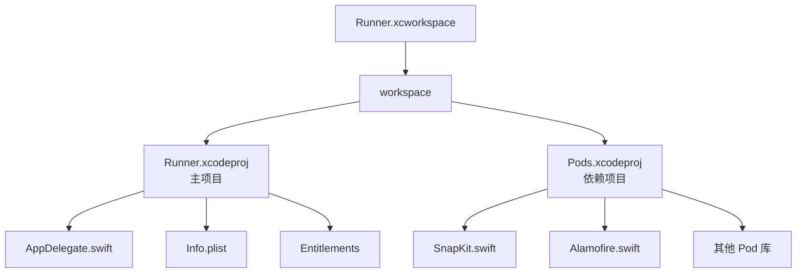

## 一句话概括

CocoaPods 和 SPM（Swift Package Manager）是 iOS 生态中两大主流依赖管理工具——CocoaPods 生态丰富但配置稍繁，SPM 原生集成更简洁但覆盖范围稍窄，理解它们的工作机制和协作关系，是跨平台开发者高效管理 iOS 原生依赖的关键。

## 背景与意义

在 Flutter、React Native 和鸿蒙的跨平台项目中，iOS 原生部分本质上是一个"被包裹"的 Xcode 项目。以 Flutter 为例，项目的 iOS 目录结构大致如下：

```
myapp/
├── lib/                      # Flutter Dart 源码
│   └── main.dart
├── ios/                      # iOS 原生项目（重要！）
│   ├── Runner.xcworkspace   # 用这个打开！
│   ├── Runner.xcodeproj
│   ├── Podfile              # CocoaPods 依赖声明
│   └── Runner/
│       ├── AppDelegate.swift
│       └── Info.plist
├── pubspec.yaml              # Flutter 依赖声明
└── android/                 # Android 原生项目
```

当你运行 `flutter pub get` 时，Flutter 会自动为 Android 和 iOS 生成各自的原生项目。但 iOS 的原生依赖（C++ 编解码库、Swift 原生库等）无法用 Dart 包管理器管理——这就是 CocoaPods 和 SPM 存在的意义。

跨平台开发者最常遇到的依赖管理问题场景包括：

- **Flutter/RN 插件安装后构建失败**：`pod install` 报错找不到某个 .podspec 文件
- **版本冲突**：`The sandbox is not in sync with the Podfile.lock`
- **CocoaPods vs SPM 混用带来的奇怪问题**：Xcode 自动签名和手动签名冲突
- **编译时间异常长**：每次 pod install 后重新编译整个依赖树

理解 CocoaPods 和 SPM 的差异，不仅仅是"哪个更好用"的问题，更关乎如何设计你的项目依赖结构、如何处理 CI/CD 中的构建一致性，以及如何快速诊断和解决依赖冲突。

## 核心知识点拆解

### 一、CocoaPods 完整解析

CocoaPods 是 Ruby 编写的依赖管理器，从 2011 年诞生至今已有十余年历史，是 iOS 社区中使用最广泛的依赖管理工具。几乎所有 Flutter 和 RN 的 iOS 原生插件都以 CocoaPods 的形式分发。

**Podfile 核心语法**

```ruby
# 指定最低 iOS 版本
platform :ios, '12.0'

# 使用 CocoaPods 的源（默认）
source 'https://cdn.cocoapods.org/'

# 项目范围（通常为隐式 .xcodeproj）
project 'Runner'

# CocoaPods 本身的目标（不要修改这段，除非你知道你在做什么）
target 'Runner' do
  use_frameworks!  # 重要！Swift 库需要这个参数
  use_frameworks! :linkage => :static  # 静态链接方式

  # 依赖声明
  pod 'Alamofire', '~> 5.8'           # 语义版本范围
  pod 'SnapKit', '~> 5.6'              # 纯 Swift 的 AutoLayout 库
  pod 'Flutter', :path => '.'           # Flutter Runner 本身
  pod 'google_maps_flutter', :path => '../packages/google_maps_flutter/ios'  # 本地路径
  pod 'FMDB', :git => 'https://github.com/ccgus/fmdb.git', :tag => '2.7.7' # Git 源

  # 条件化依赖（仅在 Debug 配置下使用）
  pod 'IQKeyboardManagerSwift', :configurations => ['Debug']

  # subspecs（仅包含需要的子模块）
  pod 'Firebase/Analytics'           # 仅包含 Analytics 模块
  pod 'Firebase/Messaging'           # 仅包含 Messaging 模块
end

# 安装后钩子（pod install 完成后自动执行）
post_install do |installer|
  installer.pods_project.targets.each do |target|
    target.build_configurations.each do |config|
      config.build_settings['IPHONEOS_DEPLOYMENT_TARGET'] = '12.0'
    end
  end
end
```

**pod install vs pod update**

这是两个经常被混淆的命令：

| 命令 | 行为 | 何时使用 |
|-----|------|---------|
| `pod install` | 仅安装 Podfile.lock 中锁定的版本 | 日常开发、CI/CD（保持团队一致性） |
| `pod update` | 忽略 Podfile.lock，更新到最新符合语义版本约束的版本 | 主动升级依赖版本 |
| `pod update PodName` | 仅更新指定 Pod | 升级某个特定库 |
| `pod update --repo-update` | 更新 Pod 索引后重装 | Pod 仓库索引过旧 |

**Podfile.lock 的重要性**

Podfile.lock 是 CocoaPods 的"锁文件"，它记录了每个 Pod 的精确版本。当团队成员 A 运行 `pod install` 时，锁文件保证了 B 在自己的机器上安装的是完全相同的版本。这是团队协作一致性的关键。

**正确的团队协作流程**：
1. 在 Podfile 中指定版本约束（`~> 3.0`）
2. `pod install` 后提交 Podfile 和 Podfile.lock 到 Git
3. 团队成员 clone 项目后，只需运行 `pod install`（不需要 `pod update`）
4. 需要升级时，由专人负责 `pod update` 测试后再提交新的 Podfile.lock

**Podfile.lock 不应该忽略**：很多开发者习惯性地将 Podfile.lock 加入 .gitignore，这会导致团队中每个人的依赖版本不一致，是跨平台项目中出现"我本地构建没问题，CI 构建报错了"这类问题的根本原因之一。

**Pod 的类型**

CocoaPods 中的 Pod 有三种类型，理解它们有助于你理解为什么某些 Pod 的行为与预期不符：

1. **Source Pod**（源码 Pod）：纯 Swift/ObjC 源码组成，`pod 'SnapKit'` 即为这种
2. **Framework Pod**：提供预编译的 Framework（如 `Firebase/Analytics`）
3. **Bundle Pod**：仅包含资源文件（图片、Storyboard 等）

### 二、.xcworkspace vs .xcodeproj

对于刚接触 iOS 开发的跨平台开发者来说，"打开哪个文件"是一个高频问题。

**直接用 Xcode 打开项目时**：
- 双击 `.xcodeproj` → Xcode 只加载主项目，不加载 CocoaPods
- 结果：Xcode 找不到 Pods 中定义的任何类/符号 → 构建失败

**正确的打开方式**：
- 双击 `.xcworkspace` → Xcode 加载主项目 + CocoaPods Workspace
- Pods 中的所有类、方法和资源都正确引用
- **Flutter 和 RN 项目几乎都使用 CocoaPods，所以必须打开 .xcworkspace**



### 三、Swift Package Manager（SPM）

SPM 是 Apple 官方从 Swift 3 开始逐步完善的依赖管理工具，从 Xcode 11 起深度集成到 Xcode 中。它的设计理念与 CocoaPods 完全不同。

**与 CocoaPods 的核心区别**

| 维度 | CocoaPods | SPM |
|-----|---------|-----|
| **配置方式** | Podfile（Ruby DSL）| Xcode UI 或 Package.swift |
| **安装位置** | Pods/（隔离在工作目录内）| 参考路径（可复用系统 Framework）|
| **增量编译** | 差，重新编译整个 Pods 树 | 好，Xcode 智能增量编译 |
| **版本管理** | Podfile + Podfile.lock | Package.resolved |
| **生态覆盖** | 几乎所有 iOS 库 | 主要 Swift 库，部分 ObjC 库需要手动处理 |
| **CI/CD** | 需要 `pod install` | Xcode 自动处理 |
| **Swift 版本** | 任意 | 受 Package.swift 中声明的版本限制 |
| **条件编译** | 支持 `:configurations` 参数 | 在 Package.swift 中配置 |

**Xcode 中的 SPM 配置**

从 Xcode 11 开始，在 Project Navigator 中右键项目 → "Add Packages" 即可通过 Swift Package Registry 添加依赖包：

```swift
// Package.swift 示例（如果你要发布一个 SPM 包）
import PackageDescription

let package = Package(
    name: "MyLibrary",
    platforms: [
        .iOS(.v12),  // 最低 iOS 版本
    ],
    products: [
        .library(
            name: "MyLibrary",
            targets: ["MyLibrary"]
        ),
    ],
    dependencies: [
        // 语义版本依赖
        .package(url: "https://github.com/Alamofire/Alamofire.git", from: "5.8.0"),
        // 分支依赖
        .package(url: "https://github.com/SnapKit/SnapKit.git", branch: "develop"),
        // 精确版本依赖
        .package(url: "https://github.com/onevcat/Kingfisher.git", exact: "7.10.0"),
    ],
    targets: [
        .target(
            name: "MyLibrary",
            dependencies: [
                "Alamofire",       // 依赖另一个包
                .product(name: "SnapKit", package: "SnapKit"), // 指定 product
            ]
        ),
    ]
)
```

**在 Flutter/RN 中使用 SPM**

对于 Flutter 项目，可以通过 Flutter 插件的 `pubspec.yaml` 配置来间接使用 SPM 库（如果插件本身支持 SPM）。RN 项目中，由于 RN 本身的 iOS 原生部分高度依赖 CocoaPods，目前 SPM 的集成相对有限。

**SPM 的优势场景**

1. **编译速度快**：SPM 不需要单独的 `pod install` 步骤，依赖在 Xcode 打开项目时自动解析和下载
2. **构建产物可复用**：系统级依赖可以在多个项目间共享，不需要每个项目单独拷贝
3. **与 Xcode 深度集成**：包依赖在 Xcode Project Navigator 中清晰可见，且版本升级只需右键 → Update

**SPM 的局限场景**

1. **ObjC 库支持不完善**：很多成熟的 iOS 库（如 Masonry、FMDB）没有 SPM 支持
2. **条件化平台支持**：跨平台库在 iOS 和 macOS 的兼容性配置相对繁琐
3. **二进制分发不稳定**：Apple 官方文档建议使用源码分发，但部分大型库（如 SwiftUI 的第三方库）可能需要二进制分发时遇到签名问题

### 四、CocoaPods vs SPM 深度对比

**生态覆盖对比**

根据最新的社区统计（2024 年）：
- CocoaPods Trunk：超过 12 万个公开 Pod
- Swift Package Index：约 4 万个公开 Package

但需要注意：很多"老牌"iOS 库（如 SDWebImage、Masonry、AFNetworking）仍然只有 CocoaPods 版本，而较新的纯 Swift 库通常会同时支持 SPM 和 CocoaPods。

**Flutter/RN 项目中的实践建议**

对于跨平台项目，建议的策略是：

**CocoaPods 作为基础依赖管理**：
- Flutter 的 iOS 原生代码和大部分 RN 原生代码依赖 CocoaPods
- 第三方地图 SDK（高德/百度/Google Maps）的 Flutter/RN 插件几乎都基于 CocoaPods
- 视频编解码库（FFmpeg 封装）基本只有 CocoaPods 版本

**SPM 作为增量补充**：
- 纯 Swift 工具库（如 SwiftLint、URLSession 的封装等）
- Apple 官方库的 Swift 封装（如 swift-collections）
- 在 CocoaPods 基础之上，通过 Xcode 的 SPM 功能额外添加纯 Swift 库

**不建议混合**：在同一个 Target 中同时使用 CocoaPods 和 SPM 管理同一类库，可能导致符号冲突或重复链接问题。正确的做法是选择一个主要工具，然后用另一个工具添加 CocoaPods 没有覆盖的库。

### 五、私有 Pod 仓库

在企业开发或团队协作中，经常需要发布私有库而不公开到 CocoaPods Trunk。私有 Pod 有两种主流方式：

**方式一：使用私有 Spec Repo**

```bash
# 1. 创建私有 Spec Repo（本质上是一个 git 仓库）
git init ios-specs-repo
cd ios-specs-repo
git commit -m "Initial commit"

# 2. 在 CocoaPods Trunk 注册（或不注册，直接内部使用）
# pod repo add my-private-specs https://github.com/myorg/ios-specs-repo.git

# 3. 在 Podfile 中添加私有源
source 'https://cdn.cocoapods.org/'
source 'https://github.com/myorg/ios-specs-repo.git'  # 私有源在前

pod 'MyInternalLib', '~> 1.0'
```

**方式二：使用本地路径或 Git 源**

对于不需要版本化的内部库，可以直接在 Podfile 中引用本地路径或 Git URL：

```ruby
# 本地路径（适合单仓库 monorepo 项目）
pod 'MyInternalLib', :path => '../ios/MyInternalLib/'

# Git URL（适合独立仓库）
pod 'MyInternalLib', :git => 'https://github.com/myorg/MyInternalLib.git', :tag => '1.0.0'
```

### 六、Flutter/RN 项目中依赖管理的链式关系

理解这个链式关系对于解决依赖问题至关重要：

**Flutter 项目的 iOS 依赖链**

```
pubspec.yaml（Flutter 依赖）
    ↓
    Flutter 工具链
    ↓
生成 Runner.xcodeproj + Runner.xcworkspace
    ↓
Podfile（iOS 原生依赖）
    ↓
pod install
    ↓
Pods/ 目录（实际的 .a / .framework 文件）
    ↓
Xcode 编译链接
```

关键理解点：
- 当你在 `pubspec.yaml` 中添加一个 Flutter 插件（如 `camera`），Flutter 会在 `ios/Podfile` 中自动追加一行 `pod 'camera'` 的声明
- 如果你手动删除了 `Pods/` 目录，只需要运行 `pod install` 重建
- 但如果你手动修改了 Podfile，注意不要与 Flutter 自动追加的声明冲突

**React Native 项目的 iOS 依赖链**

```
package.json（JS 依赖）
    ↓
npm install
    ↓
node_modules/
    ↓
react-native CLI
    ↓
ios/Podfile + Podfile.lock
    ↓
pod install
    ↓
Pods/
```

RN 项目中，很多原生模块通过 `react-native link` 命令自动添加到 Podfile。但从 RN 0.60 开始，AutoLink 机制自动将 `node_modules/` 中包含原生 iOS 代码的包添加到 Podfile，不需要手动 `react-native link`。

**解决 CocoaPods 依赖冲突的常见策略**

当两个不同的插件依赖了同一库的不同版本时（如插件 A 依赖 SnapKit 5.0，插件 B 依赖 SnapKit 5.6），会发生冲突：

1. **使用 subspecs 减少依赖范围**：指定具体子模块而非整个库
2. **在 Podfile 中指定版本覆盖**：
```ruby
pod 'SnapKit', '~> 5.6'  # 全局覆盖
```
3. **使用 CocoaPods 的 `:modular_headers => true`**：解决某些库的头文件冲突
4. **对于无法解决的冲突**：考虑 fork 原插件并修改其 podspec 版本依赖

## 实战案例

### 案例一：从零配置一个 Flutter 项目的 CocoaPods 依赖

**场景**：新团队成员 clone Flutter 项目后，运行 `flutter run` 报错。

**排查步骤**：

Step 1：确认打开的是 `.xcworkspace` 而非 `.xcodeproj`

```bash
ls ios/*.xcworkspace   # 应该看到 Runner.xcworkspace
ls ios/*.xcodeproj     # 不应该单独打开这个
```

Step 2：运行 pod install

```bash
cd ios
pod install --verbose  # --verbose 显示详细日志
```

Step 3：检查常见错误

**错误 1**：`[!] Oh no, an accusation against us!`
→ 通常是网络问题（DNS 污染、代理问题）。尝试更换网络或使用代理。

**错误 2**：`[!] Unable to find a podspec in ...`
→ Podfile 中引用的本地路径 pod 不存在，或路径错误。

**错误 3**：`The sandbox is not in sync with the Podfile.lock`
→ Xcode 与 CocoaPods 版本不同步。尝试：
```bash
pod deintegrate      # 解除所有 Pod 集成
pod install         # 重新安装
xcodebuild clean    # 清理 Xcode 构建缓存
```

Step 4：确认 Flutter 版本和插件兼容性

某些 Flutter 插件声明的 iOS 最低版本可能高于你当前设置的 `IPHONEOS_DEPLOYMENT_TARGET`。检查 `Podfile` 中的 `platform :ios` 声明和每个插件的 README。

### 案例二：解决 Flutter 中 Google Maps 插件的 CocoaPods 依赖问题

**场景**：集成 `google_maps_flutter` 后构建报错。

**问题分析**：Google Maps 插件依赖 `GoogleMaps`（iOS 原生 SDK），而 `GoogleMaps` 需要 API Key 并且与 Firebase 等其他库可能存在冲突。

**解决步骤**：

Step 1：在 `ios/Runner/AppDelegate.swift` 中配置 API Key

```swift
import UIKit
import Flutter
import GoogleMaps

@UIApplicationMain
@objc class AppDelegate: FlutterAppDelegate {
  override func application(
    _ application: UIApplication,
    didFinishLaunchingWithOptions launchOptions: [UIApplication.LaunchOptionsKey: Any]?
  ) -> Bool {
    // 在这里配置 Google Maps API Key
    GMSServices.provideAPIKey("YOUR_API_KEY_HERE")
    GeneratedPluginRegistrant.register(with: self)
    return super.application(application, didFinishLaunchingWithOptions: launchOptions)
  }
}
```

Step 2：检查 Podfile 中是否正确添加了 Google Maps

Flutter 的 google_maps_flutter 插件会自动在 Podfile 中添加：

```ruby
# plugins 下通常会自动追加以下内容（Flutter 自动管理）
pod 'GoogleMaps', '~> 6.0'  # Flutter 自动添加
```

如果手动版本不对，可以在 Podfile 中用 `pod 'GoogleMaps', '~> 6.2'` 覆盖。

Step 3：添加 Google Maps 的 Info.plist 配置

在 Info.plist 中添加（注意：这与 Flutter 插件冲突时要检查）：

```xml
<key>NSLocationWhenInUseUsageDescription</key>
<string>此应用需要获取您的位置以显示在地图上</string>
```

## 常见问题

### Q1：pod install 非常慢怎么办？

**优化策略**：

1. **使用国内镜像源**（仅在测试环境）：
```ruby
source 'https://mirrors.aliyun.com/cocoapods/'
```

2. **增量安装**：
```bash
pod install --no-repo-update  # 跳过 repo 更新，加快速度
```

3. **使用 --jobs 参数并行安装**：
```bash
pod install --jobs=4
```

4. **检查网络**：大部分慢是因为下载 .podspec 或 .framework 文件慢。可以使用 `curl -L` 直接测试下载速度。

### Q2：如何排查"符号找不到"的链接错误？

**现象**：Xcode 构建时出现 `Undefined symbol: _OBJC_CLASS_$_XXX` 或 `ld: symbol(s) not found for architecture armv7`。

**排查步骤**：

1. 确定符号来自哪个库：`ld: undefined symbol` 后面的类名通常就是线索
2. 确认该库是否在 Podfile 中正确声明
3. 检查 Podfile 中的 `use_frameworks!` 设置——某些库（如 Google Maps）在静态链接模式下需要额外配置
4. 对于 Flutter 项目，尝试清理后重新安装：
```bash
cd ios
pod deintegrate
rm -rf Pods Podfile.lock
pod install
```

### Q3：SPM 和 CocoaPods 可以同时使用吗？

**技术上可以，但不推荐**。

两个工具管理依赖的方式不同：
- CocoaPods 将所有 Pod 拷贝到 `Pods/` 目录，并修改 Xcode 项目文件添加引用
- SPM 在 Xcode 的 Package Dependencies 面板中管理，不修改项目文件

**如果你坚持同时使用**：
- 确保同一库不会同时通过两个工具添加（会导致重复符号）
- 注意 `use_frameworks! :linkage => :static` 与 SPM 的静态链接可能冲突
- 每次 Xcode 升级后，SPM 的缓存位置可能变化，CI 构建时需要清理

### Q4：CocoaPods 升级后构建失败怎么办？

**常见场景**：Pod 维护者发布了不兼容的新版本（如 Swift 版本升级、删除了某个 API）。

**解决策略**：

1. **立即回退到已知工作的版本**：
```bash
pod update --pod-name MyLib --verbose
# 测试新版本，如果不兼容：
git checkout Podfile.lock  # 恢复到之前的锁文件版本
pod install
```

2. **在 Podfile 中锁定版本**：
```ruby
pod 'MyLib', '3.2.1'  # 精确版本锁定，不接受任何更新
```

3. **向插件维护者报告问题**：很多 Flutter/RN 插件的 iOS 部分实际上是第三方维护的，及时反馈有助于修复。

## 总结

### 思维导图式的结构回顾

为了帮助快速记忆，可以将整个 pbxproj 理解为一本"通信录"——它用一个巨大的 UUID 索引表，把所有文件、组、构建阶段和 Target 串联起来。Info.plist 是"名片"，Entitlements 是"护照"，而 Target 就是"工作流"上的不同站点。当某个站点报错时，沿着工作流回溯就能找到问题的源头——是名片信息不全、护照权限不足，还是站点的构建阶段缺失了关键步骤。

这种分层理解的方式，对于跨平台开发者来说尤为重要。Flutter 和 RN 的构建流程，本质上就是借助 CocoaPods 和 Flutter 插件机制，在原生 Target 的 Build Phases 中插入了自定义脚本和依赖。一旦脚本执行出错或依赖解析失败，错误往往会以令人费解的方式出现在 Xcode 控制台或 Flutter 终端中。掌握 Xcode 的构建日志分析技巧——比如区分"编译错误"（Syntax/Type mismatch）、"链接错误"（Undefined symbol/Swift compatibility）和"资源错误"（Missing asset/Main storyboard），能帮你少走无数弯路。

### 对跨平台开发者的进阶建议

当你从 Flutter/RN 出发深入 iOS 原生扩展开发时，以下三条实践值得长期坚持：

1. **每次构建失败，先打开 Xcode 看真正的错误日志**：Flutter 终端输出的错误信息往往是上层框架的转述，Xcode 的日志才包含了真正的编译器输出行号。

2. **用 `.xcodeproj` 和 `.xcworkspace` 的差异来区分 Debug 思路**：如果使用的是 `.xcworkspace`，先检查 Podfile 中的 `post_install` 钩子是否会修改项目配置；如果使用的是 `.xcodeproj`，检查 Scheme 和 Build Settings 是否完整。这一条诊断思路可以帮助你将绝大多数构建失败问题归类为"依赖问题"或"配置问题"两大类型，从而按对应对策解决。

3. **与团队约定 Xcode 配置的修改权限**：只允许少数人在必要时修改 Xcode 的原生配置，其余人通过 Flutter 或 RN 的配置文件间接控制。这是经历过无数次 pbxproj 冲突后总结出的团队协作铁律。

理解 Xcode 项目结构不仅是为了修复构建错误，更是为了打破"iOS 原生开发是黑盒"的心理障碍。当你能清晰地描述出 Info.plist 中的每一个配置项的含义、知道 pbxproj 中的 UUID 如何串联起整个构建流程时，你已经是半个 iOS 原生开发者了——而这正是跨平台开发者成长为全栈移动工程师的重要一环。


CocoaPods 和 SPM 是 iOS 生态中互补的两种依赖管理工具，它们的设计哲学体现了 Apple 生态"渐进演进"的特点——CocoaPods 作为历史积累的社区方案提供了最大兼容性，而 SPM 作为官方方案提供了更现代的开发体验。

对于跨平台开发者，理解这两个工具的关键要点是：

1. **CocoaPods 是 Flutter/RN iOS 原生部分的事实标准**——几乎所有 Flutter 和 RN 的 iOS 原生插件都以 CocoaPods 分发
2. **永远用 .xcworkspace 打开项目**——这是 CocoaPods 项目的正确入口
3. **Podfile.lock 必须加入 Git**——它是团队构建一致性的保障
4. **pod install 维护版本一致性，pod update 升级版本**——这个区别在团队协作中极其重要
5. **SPM 适合纯 Swift 库和 Apple 官方库的封装**——在 CocoaPods 生态的基础上作为补充

当你下次遇到 iOS 构建失败或依赖报错时，能够快速判断是 CocoaPods 配置问题、SPM 依赖解析问题还是 Pod 之间的版本冲突，将极大地加速你的调试过程。理解依赖管理工具的工作原理，是从"照着文档配置"到"能够独立诊断问题"的必经之路。

### 依赖管理工具的未来趋势

随着 Swift 生态的成熟，Apple 正在逐步推进 SPM 成为官方唯一推荐方案。Xcode 15 开始，CocoaPods 生成的 `Pods.xcodeproj` 在构建时的兼容性出现了微妙变化，需要开发者注意。与此同时，新一代依赖管理替代方案也在崛起——**Tuist** 使用 Swift 描述项目结构，配合 Xcode 原生缓存机制可以大幅提升构建速度；**XcodeGen** 基于 YAML 描述项目结构，从根本上解决了 pbxproj 的合并冲突问题。对于新的跨平台项目，可以评估这些新方案是否适用于你的团队，但对于已有的 Flutter 和 RN 项目，CocoaPods 仍然是经过验证的稳妥选择。
