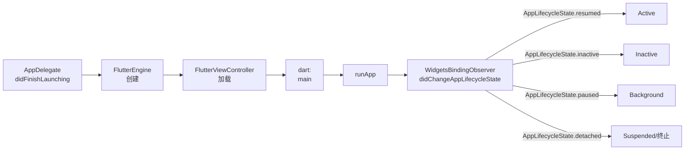

## 一句话概括

iOS 应用生命周期定义了应用从启动、前台运行、后台挂起到最终终止的完整状态机模型，理解它是跨平台开发者在原生层正确管理用户数据、网络连接和 UI 状态的前提。

## 背景与意义

对于使用 Flutter、React Native 或鸿蒙进行跨平台开发的工程师来说，理解 iOS 应用生命周期是通往 iOS 原生扩展"深水区"的必经之路。原因是：

1. **框架的抽象隐藏了复杂性**：Flutter 的 `WidgetsBindingObserver` 和 RN 的 `AppState` API 虽然提供了统一的生命周期接口，但底层仍然需要正确调用 iOS 的原生生命周期方法。

2. **错误的状态管理会导致数据丢失**：没有正确处理 `applicationDidEnterBackground:` 的应用，在用户切换到别的应用后被系统挂起或终止时，可能会丢失未保存的用户数据。

3. **前后台切换影响用户体验**：不恰当的生命周期处理会导致 UI 冻结、网络连接中断、视频播放异常等问题。

4. **后台任务需要明确管理**：iOS 对后台任务的时间限制远比其他平台严格（默认 30 秒，最大 10 分钟），不了解这些限制容易导致后台功能失效。

5. **iOS 13+ 的 SceneDelegate 改变了游戏规则**：多窗口支持、不同场景可独立管理生命周期，这对 iPad 和 Mac Catalyst 的应用设计提出了新的要求。

典型的跨平台开发者可能遇到的场景包括：

- 用户在编辑表单时接到电话，切换回来发现输入内容全部丢失
- 应用切到后台再回来，网络连接已断开，需要手动重连
- 后台播放音频功能在 iOS 14+ 上失效，用户投诉
- 应用在前台时收到推送通知但无法弹出横幅
- 使用后台定位时只获得了有限的时间，无法完成轨迹记录

这些问题的根因，大多与生命周期管理有关。

## 核心知识点拆解

### 一、iOS 应用状态机

在讨论生命周期方法之前，先建立完整的 iOS 应用状态模型：

```
                          ┌────────────────┐
                          │   Not Running   │  ← 应用未启动或已终止
                          └────────┬───────┘
                                   │
                          ┌────────▼───────┐
                          │    Inactive     │  ← 应用在前台但未接收事件
                          │  (过渡状态)     │   （如来电遮挡、SpringBoard 动画中）
                          └────────┬───────┘
                                   │
                    ┌──────────────┼──────────────┐
                    │              │              │
           ┌────────▼─────┐  ┌────▼──────┐  ┌────▼──────┐
           │    Active     │  │Suspended  │  │Background │
           │  (正常运行)   │  │(挂起状态)  │  │(后台运行)  │
           └────────┬─────┘  └────┬──────┘  └────┬──────┘
                    │              │              │
                    └──────────────┴──────────────┘
                                   │
                          ┌────────▼───────┐
                          │  Not Running   │
                          └────────────────┘
```

**UIApplicationState 枚举的三个状态**

```swift
enum UIApplicationState {
    case active          // 应用在前台且活跃（用户可交互）
    case inactive        // 过渡状态（电话、锁屏、控制中心等）
    case background      // 应用在后台（可能正在运行或被挂起）
}
```

**状态迁移规则**：
- **Active → Inactive**：来电、锁屏、应用切换
- **Inactive → Active**：用户返回应用
- **Active → Background**：按下 Home 键（iPhone X+ 上划回到桌面）
- **Background → Active**：用户从多任务选择器回到应用
- **Background → Suspended**：系统在应用进入后台一段时间后挂起它（内存仍保留）
- **Suspended → Background**：极少数情况（如 PB 推送）
- **Suspended / Background → Not Running**：系统因内存压力回收应用，或用户从多任务选择器上划关闭

这些状态之间的大多数过渡都会触发 AppDelegate 和 SceneDelegate 中的对应回调方法。理解这些状态机是后续调试工作的基石。

### 二、AppDelegate 核心方法

AppDelegate 是 iOS 应用的"中央枢纽"，它监控应用的完整生命周期。直到 iOS 12，这是唯一的生命周期管理入口。从 iOS 13 开始，SceneDelegate 分担了 UI 状态相关的管理，但 AppDelegate 仍然是应用级事件的入口。

**应用启动**

```swift
func application(
    _ application: UIApplication,
    didFinishLaunchingWithOptions launchOptions: [UIApplication.LaunchOptionsKey: Any]?
) -> Bool {
    // ── 应用启动完成但界面尚未准备好 ──
    // 这是做以下操作的恰当时机：
    
    // 1. 初始化第三方 SDK（最小化延迟，建议放在后台线程）
    Analytics.initialize()
    
    // 2. 注册推送通知（在授权之后）
    UNUserNotificationCenter.current().delegate = self
    
    // 3. 配置全局外观
    UINavigationBar.appearance().tintColor = .blue
    
    // 4. 处理启动参数（如推送通知或 URL 打开）
    if let userInfo = launchOptions?[.remoteNotification] as? [String: Any] {
        // 从推送通知启动
    }
    
    return true // 返回 false 表示应用拒绝启动（极少使用）
}
```

**⚠️ 对 Flutter 开发者**：Flutter 项目中，`GeneratedPluginRegistrant.register(with:)` 会在这个方法中自动调用，以注册所有在 pubspec.yaml 中声明的插件。如果你手动修改了这个方法，确保没有移除这一行。

**进入后台**

```swift
func applicationDidEnterBackground(_ application: UIApplication) {
    // ── 应用即将从前台切换到后台 ──
    // 重要操作（必须做）：
    
    // 1. 保存未提交的用户数据（核心数据、草稿等）
    CoreDataStack.shared.saveContext()
    
    // 2. 释放可重建的大型资源（图片缓存、大数组）
    imageCache.clearMemoryCache()
    
    // 3. 停止正在进行的网络请求
    URLSession.shared.invalidateAndCancel()
    
    // 4. 如果开启了后台任务，在此启动
    let backgroundTask = application.beginBackgroundTask(withName: "SaveData") {
        // 后台任务超时回调（30 秒后）
    }
    
    // 5. 保存应用状态（用于恢复）
    saveAppState()
    
    // 注意：这个方法只有大约 5 秒的执行时间
    // 超过时间应用会被系统挂起
}
```

**⚠️ 关键时间限制**：`applicationDidEnterBackground` 方法必须在 5 秒内返回，否则系统会认为应用"无响应"并强制终止。如果你需要在后台继续执行任务，必须使用 `beginBackgroundTask(expirationHandler:)`。

**即将进入前台**

```swift
func applicationWillEnterForeground(_ application: UIApplication) {
    // ── 应用即将从后台回到前台 ──
    // 通常在 applicationDidEnterBackground 的操作的反向操作：
    
    // 1. 重新配置网络连接
    // 2. 刷新 UI 数据
    // 3. 重新获取最新的应用状态
}
```

**变为活跃状态**

```swift
func applicationDidBecomeActive(_ application: UIApplication) {
    // ── 应用准备接收用户事件 ──
    // 这是真正"可用"的信号：
    
    // 1. 恢复暂停的动画和游戏
    // 2. 重新开启定时器
    // 3. 刷新需要立即更新的数据
    // 4. ATT（App Tracking Transparency）弹窗的最佳时机
}
```

**即将变为非活跃（去激活）**

```swift
func applicationWillResignActive(_ application: UIApplication) {
    // ── 应用即将失去焦点 ──
    // 来电、锁屏、向上划出多任务界面时触发
    
    // 1. 暂停正在进行的游戏和动画
    // 2. 停止定时器
    // 3. 暂停视频/音频播放
    // 4. 减少渲染帧率以节省电量
}
```

**应用终止**

```swift
func applicationWillTerminate(_ application: UIApplication) {
    // ── 应用即将被终止 ──
    // 重要注意事项：
    // - 这个方法在用户从多任务界面直接上划关闭应用时调用
    // - 如果应用已被系统挂起（Suspended），被回收时不会调用此方法
    // - 因此，不要依赖于这里做"唯一"的数据保存操作
    
    // 最后的保存机会
    CoreDataStack.shared.saveContext()
}
```

### 三、SceneDelegate（iOS 13+ 多窗口支持）

iOS 13（iPadOS 13 和 macOS 10.15）引入了 SceneDelegate，这是 iOS 从单窗口模式迈向多窗口支持的重要架构变化。

**AppDelegate 和 SceneDelegate 的分工**

| AppDelegate（应用级） | SceneDelegate（场景级） |
|---|---|
| 应用启动生命周期 | 每个场景（窗口）的生命周期 |
| 远程通知注册 | UI / 界面生命周期 |
| 深层链接（Universal Links） | 场景间状态管理 |
| Handoff 的配置 | 场景配置（iPad 多窗口） |
| 应用级设置 | UI 约束（大小、位置） |

**SceneDelegate 核心方法**

```swift
class SceneDelegate: UIResponder, UIWindowSceneDelegate {
    var window: UIWindow?
    
    // ── 场景即将连接到应用 ──
    // 相当于旧的 AppDelegate 中的 didFinishLaunching 的 UI 部分
    func scene(
        _ scene: UIScene,
        willConnectTo session: UISceneSession,
        options connectionOptions: UIScene.ConnectionOptions
    ) {
        guard let windowScene = (scene as? UIWindowScene) else { return }
        
        // 创建 UIWindow 并设置 rootViewController
        let window = UIWindow(windowScene: windowScene)
        let vc = ViewController()
        window.rootViewController = vc
        self.window = window
        window.makeKeyAndVisible()
        
        // 处理来自连接选项的数据
        // activityItems（Handoff）
        // userActivities（快捷指令）
        // urlContexts（URL 打开）
        // shortcutItem（主屏幕快捷操作）
    }
    
    // ── 场景变为活跃（失去焦点后重新获得）─
    func sceneDidBecomeActive(_ scene: UIScene) {
        // 类似于 applicationDidBecomeActive
    }
    
    // ── 场景即将变为非活跃 ──
    func sceneWillResignActive(_ scene: UIScene) {
        // 类似于 applicationWillResignActive
    }
    
    // ── 场景即将进入后台 ──
    func sceneDidEnterBackground(_ scene: UIScene) {
        // 类似于 applicationDidEnterBackground
        // 保存用户数据、释放资源等
    }
    
    // ── 场景即将进入前台 ──
    func sceneWillEnterForeground(_ scene: UIScene) {
        // 类似于 applicationWillEnterForeground
    }
    
    // ── 场景与应用的连接断开 ──
    func sceneDidDisconnect(_ scene: UIScene) {
        // 场景被系统断开（不是终止应用，只是关闭了这个"窗口"）
        // 释放场景特有的资源
    }
}
```

**对 Flutter 项目的影响**

Flutter 默认情况下在 iOS 13+ 上是否启用 SceneDelegate 取决于创建项目时的 Flutter 版本和配置。在新版 Flutter（3.x）中，iOS 项目默认包含 SceneDelegate。如果你的 Flutter 项目仍然使用 AppDelegate 作为唯一的 UI 生命周期入口，它仍然可以正常在 iOS 13+ 上运行，但某些多窗口特定功能（如 iPad 独立窗口）将无法使用。

### 四、后台任务管理

iOS 对后台执行有严格限制。与其他平台相比，iOS 更倾向于"短时后台任务"而非"常驻后台服务"。

**beginBackgroundTask — 短时后台任务**

这是最常用的后台执行方式，适用于需要在应用进入后台后短时间（约 30 秒）内完成的任务。

```swift
// 启动后台任务
var backgroundTaskId: UIBackgroundTaskIdentifier = .invalid

backgroundTaskId = UIApplication.shared.beginBackgroundTask(withName: "SaveGameState") {
    // expirationHandler（超时回调，必须在 30 秒内）
    // 系统即将终止后台任务，请在这里紧急保存关键数据
    UserDefaults.standard.synchronize()
    UIApplication.shared.endBackgroundTask(backgroundTaskId)
    backgroundTaskId = .invalid
}

// 执行需要后台完成的任务
GameManager.shared.saveGameState()

// ⚠️ 务必在任务完成后结束后台任务！
// 如果不调用 endBackgroundTask，应用会一直被系统保持运行
// 直到超时（30 秒）
if backgroundTaskId != .invalid {
    UIApplication.shared.endBackgroundTask(backgroundTaskId)
    backgroundTaskId = .invalid
}
```

**Background Modes — 长时后台任务**

如果在 Signing & Capabilities 中配置了相应的 Background Mode，可以获得特定类型的长时后台执行权限：

| Background Mode | 用途 | 典型时长 | 审核要求 |
|----------------|------|---------|---------|
| Audio | 后台音频播放 | 无限制（需系统音频会话）| 应用必须有音频播放功能 |
| Location | 后台定位更新 | 无限制 | 应用必须有与定位相关的功能 |
| Voice over IP | VoIP 通话 | 无限制（极严格） | 应用必须有 VoIP 功能 |
| Fetch | 间歇性后台数据获取 | 系统决定 | Apple 会检查是否有必要 |
| Remote notifications | 推送唤醒后台 | 30 秒 | 推送内容必须是"可操作的" |
| Processing | 大文件上传/下载、ML 模型训练 | 几分钟到几小时 | iOS 13+，需使用 BGProcessingTask |

**后台任务的最佳实践**

1. **请求额外的时间**：iOS 13+ 提供了 `BGProcessingTask` 和 `BGAppRefreshTask`，可以通过 `BGTaskScheduler` 请求在系统空闲时执行非紧急任务
2. **不要依赖后台任务的精确执行时间**：系统在电量低或内存紧张时会缩短后台任务时间
3. **小心后台任务嵌套**：如果在后台任务中又调用了其他需要长时间执行的操作，可能导致意外的超时和资源泄漏
4. **监控后台执行时间**：使用系统日志调试后台任务是否在预期时间窗口内完成

### 五、Flutter 与 RN 生命周期映射

对于跨平台开发者来说，最重要的不是记忆 iOS 的生命周期方法，而是理解**框架层的生命周期事件如何映射到 iOS 原生层**。

**Flutter 的生命周期映射**



在 Flutter Dart 代码中：

```dart
class LifecycleWidget extends StatefulWidget {
  @override
  _LifecycleWidgetState createState() => _LifecycleWidgetState();
}

class _LifecycleWidgetState extends State<LifecycleWidget>
    with WidgetsBindingObserver {
  
  @override
  void initState() {
    super.initState();
    WidgetsBinding.instance!.addObserver(this);
  }

  @override
  void dispose() {
    WidgetsBinding.instance!.removeObserver(this);
    super.dispose();
  }

  @override
  void didChangeAppLifecycleState(AppLifecycleState state) {
    switch (state) {
      case AppLifecycleState.resumed:
        // 对应 iOS: applicationDidBecomeActive
        // 恢复暂停的动画、定时器、网络连接
        break;
      case AppLifecycleState.inactive:
        // 对应 iOS: applicationWillResignActive
        // 暂停非必要的 UI 更新
        break;
      case AppLifecycleState.paused:
        // 对应 iOS: applicationDidEnterBackground
        // 保存用户数据、停止网络连接
        break;
      case AppLifecycleState.detached:
        // 对应 iOS: applicationWillTerminate（部分场景）
        // Flutter Engine 即将被分离
        break;
    }
  }
}
```

**Flutter 生命周期映射的关键点**：
- `resumed` 对应 iOS 的 `active` 状态（用户可交互）
- `inactive` 是一个短暂过渡状态（来电、锁屏），应尽量避免在这个状态执行耗时操作
- `paused` 是进入后台的标志，这是保存数据的最后安全时机
- `detached` 状态在新版 Flutter 中较少出现，但在 Widget 树被完全销毁时触发

**关于 iOS 后台任务在 Flutter 中的处理**：

在 Dart 中监听 `paused` 状态时，你应该用 `MethodChannel` 通知 iOS 原生端启动后台任务。Flutter 的 iOS 端在 `applicationDidEnterBackground` 回调中需要调用 `beginBackgroundTask` 来保持后台运行。

**React Native 的生命周期映射**

React Native 使用更精简的状态模型，它的生命周期事件通过 `AppState` API 暴露：

```javascript
import { AppState, AppStateStatus } from 'react-native';

const App = () => {
  const [appState, setAppState] = useState<AppStateStatus>('active');
  const subscriptionRef = useRef(null);

  useEffect(() => {
    // 注册生命周期监听
    subscriptionRef.current = AppState.addEventListener('change', (nextState) => {
      console.log('AppState changed to:', nextState);
      setAppState(nextState);
    });

    return () => {
      // 清除监听
      if (subscriptionRef.current) {
        subscriptionRef.current.remove();
      }
    };
  }, []);

  useEffect(() => {
    switch (appState) {
      case 'active':
        // 对应 iOS: applicationDidBecomeActive
        // 恢复定时器、动画、WebSocket 连接
        break;
      case 'inactive':
        // 对应 iOS: applicationWillResignActive
        // 暂停非关键动画
        break;
      case 'background':
        // 对应 iOS: applicationDidEnterBackground
        // 保存草稿数据、结束长任务
        break;
    }
  }, [appState]);

  return (
    <View style={styles.container}>
      <Text>当前状态: {appState}</Text>
    </View>
  );
};
```

**RN 生命周期映射的关键点**：
- RN 的 `AppState` 是将 iOS 的多个原生状态压缩为三个状态
- `background` 状态很关键——这是你实现"保存草稿""暂停定时器"等操作的好时机
- RN 没有直接提供类似于 Flutter 的 `detached` 状态，如果引擎被销毁，JS 代码也无法执行

**⚠️ 常见的生命周期陷阱**：

在跨平台项目中，很多开发者只关注"当前是否活跃"，却忽略了实际的底层生命周期事件。例如：

```javascript
// ❌ 错误：只在 App 进入 Background 时保存数据
// 如果应用在 Inactive 状态崩溃，数据就丢了
AppState.addEventListener('change', (state) => {
  if (state === 'background') {
    saveData();
  }
});

// ✅ 正确：在应用非活跃时也开始保存操作
// 增加主动触发保存的频率，而非仅靠生命周期钩子
```

## 实战案例

### 案例一：Flutter 音乐播放器的后台播放

**场景**：Flutter 项目需要在应用切到后台后继续播放音乐。

**iOS 端需要做三件事**：

Step 1：配置后台模式

在 Xcode 中：选择 Runner Target → Signing & Capabilities → + → Background Modes → 勾选 "Audio, AirPlay, and Picture in Picture"

Step 2：配置 Info.plist 和音频会话

在 `ios/Runner/AppDelegate.swift` 中配置音频会话：

```swift
import AVFoundation

override func application(
    _ application: UIApplication,
    didFinishLaunchingWithOptions launchOptions: [UIApplication.LaunchOptionsKey: Any]?
) -> Bool {
    // 配置音频会话为播放模式
    do {
        try AVAudioSession.sharedInstance().setCategory(.playback, mode: .default)
        try AVAudioSession.sharedInstance().setActive(true)
    } catch {
        print("Failed to set audio session category: \(error)")
    }
    
    GeneratedPluginRegistrant.register(with: self)
    return super.application(application, didFinishLaunchingWithOptions: launchOptions)
}
```

Step 3：在 Dart 侧使用 `just_audio` 插件

```dart
import 'package:just_audio/just_audio.dart';

final player = AudioPlayer();

// 配置后台播放（插件自动处理）
await player.setAudioSource(AudioSource.uri(Uri.parse('https://example.com/song.mp3')));
await player.play();

// 在 WidgetsBindingObserver 的 didChangeAppLifecycleState 中
// 不需要特殊处理——iOS 的音频会话已启动后台模式
```

**调试技巧**：在 Xcode 的控制台中输入 `log stream --predicate 'subsystem == "com.apple.avfoundation"'` 可以查看音频会话的实时日志。

### 案例二：RN 应用的后台数据保存

**场景**：用户正在填写一个复杂的表单，突然接到电话，然后应用退出，回来后表单数据丢失。

**完整的生命周期实现方案**：

```javascript
import React, { useEffect, useRef } from 'react';
import { AppState, AsyncStorage } from 'react-native';

const FormScreen = ({ formData, onDataChange }) => {
  const formDataRef = useRef(formData);
  const saveTimerRef = useRef(null);

  // 状态变化同步到 ref
  useEffect(() => {
    formDataRef.current = formData;
  }, [formData]);

  // 多种数据保存策略组合
  useEffect(() => {
    // 策略一：监听生命周期变化
    const subscription = AppState.addEventListener('change', async (nextState) => {
      // 应用进入后台时保存
      if (nextState === 'background') {
        await saveFormData(formDataRef.current);
      }
    });

    // 策略二：定期自动保存（草稿模式）
    saveTimerRef.current = setInterval(async () => {
      await saveFormData(formDataRef.current);
    }, 30000); // 每 30 秒自动保存

    return () => {
      subscription.remove();
      clearInterval(saveTimerRef.current);
    };
  }, []);

  // 策略三：每次数据变化时触发
  const handleChange = async (field, value) => {
    const newData = { ...formData, [field]: value };
    onDataChange(newData);
    // 数据变化时也保存（防丢）
    await saveFormData(newData);
  };

  const saveFormData = async (data) => {
    try {
      await AsyncStorage.setItem('form_draft', JSON.stringify(data));
    } catch (e) {
      console.error('Failed to save draft:', e);
    }
  };

  // 启动时恢复草稿
  useEffect(() => {
    AsyncStorage.getItem('form_draft').then((draft) => {
      if (draft) {
        onDataChange(JSON.parse(draft));
      }
    });
  }, []);

  // ... 渲染表单
};
```

**核心设计**：这个示例使用三种互补的策略来提高数据保存的可靠性，而不是依赖单一的生命周期钩子。

## 常见问题

### Q1：应用被系统挂起（Suspended）后还能执行代码吗？

**答案**：不能。

当应用进入 Background 状态一段时间（通常是 30 秒内没有后台任务）后，系统会将其置于 Suspended 状态。在 Suspended 状态下，应用的代码完全停止执行，内存中的数据完整保留（但无法访问）。只有以下几种方式可以唤醒应用：

1. **用户主动返回应用**：应用从 Suspended 恢复到 Active
2. **后台推送（Remote Notification）**：如果推送内容包含 `content-available: 1`，系统会在后台短暂唤醒应用
3. **后台定位事件**：如果配置了后台定位，位置变化会触发应用唤醒
4. **BGTaskScheduler 触发的后台任务**：系统在合适的时机调度

### Q2：SceneDelegate 方法什么时候才有意义？

**场景**：如果你的应用只运行在 iPhone 上（不支持多窗口），SceneDelegate 和 AppDelegate 的工作方式没有本质区别。但在以下场景中，SceneDelegate 的设计优势会体现出来：

1. **iPad 多窗口**：用户可以在同一个应用中打开两个文档并独立管理各自的会话
2. **Mac Catalyst**：macOS 应用可以同时打开多个窗口
3. **CarPlay**：应用在车机上可以作为独立场景运行

如果你的应用不需要这些场景，可以安全地仅在 AppDelegate 中处理生命周期（Flutter 默认为此方案）。

### Q3：iOS 后台任务的有效期到底多长？

**官方文档说法**：`beginBackgroundTask` 的超时时间是可变的，标准约为 30 秒。

**实际情况**：
- 普通情况下，约 28-30 秒后系统会调用 `expirationHandler`
- 如果设备电量充足且没有竞争的后台任务，系统可能延长至 3 分钟
- 如果设备电量低或内存紧张，系统可能在 10 秒左右就调用 `expirationHandler`
- `BGProcessingTask`（iOS 13+）可以申请几分钟到几小时的后台执行时间，但最终的调度时间和时长由系统决定

**最佳实践**：永远假设你有 15 秒的可靠执行时间。超过时间的任务应当完成最关键的数据保存，然后优雅地结束。

### Q4：Flutter/RN 在 iOS 后台如何使用原生定位服务？

**Flutter 方案**：

```dart
import 'package:geolocator/geolocator.dart';

// 监听位置
LocationPermission permission = await Geolocator.requestPermission();

PositionStream stream = Geolocator.getPositionStream(
  locationSettings: LocationSettings(
    accuracy: LocationAccuracy.high,
    distanceFilter: 50,
    // 重要：iOS 后台定位必须设置此项
    timeLimit: Duration(hours: 8),  // 后台运行的合理时间
  ),
);
```

但在 iOS 端，后台定位还需要在 Info.plist 中配置 `NSLocationAlwaysAndWhenInUseUsageDescription`、在 Signing & Capabilities 中开启 Background Modes 的 Location updates。在 `AppDelegate.swift` 中也要配置 `CLLocationManager` 以获取位置更新。

## 总结

iOS 应用生命周期是 Apple 对系统资源管理的核心设计之一。与 Android 的 Activity 生命周期或鸿蒙的 Ability 生命周期相比，iOS 的整体设计更向"省电"和"简洁"倾斜——应用在后台能做的事情非常有限，但换来的是更好的电池续航和更稳定的系统体验。

对于跨平台开发者，几个需要牢记的观念是：

1. **iOS 的生命周期状态是线性的**：Not Running → Active → Background → Suspended → Not Running，中间状态（Inactive）非常短暂
2. **数据保存要双重保障**：不要仅依靠生命周期钩子，同时也要使用定期自动保存
3. **后台任务不是"服务"**：iOS 没有 Android 的 Service 概念，后台执行时间非常有限，长时运行需要特定的 Background Mode
4. **Flutter/RN 框架封装了 iOS 的复杂状态**：但封装并不意味着你可以忽略底层逻辑——正确理解原生生命周期，能让你在遇到 iOS 特有的崩溃和数据丢失问题时迅速定位根因
5. **iOS 13+ 的变化不是破坏性的**：SceneDelegate 为多窗口场景准备，如果你的应用不需要这些，AppDelegate + Flutter/RN 框架的封装已经足够使用

掌握 iOS 应用生命周期，意味着你不再需要在遇到"切后台回来数据丢失"这样的问题时感到困惑——你将清晰地知道哪些生命周期回调是"最后的救命稻草"，以及如何与跨平台框架的事件系统协同工作。
