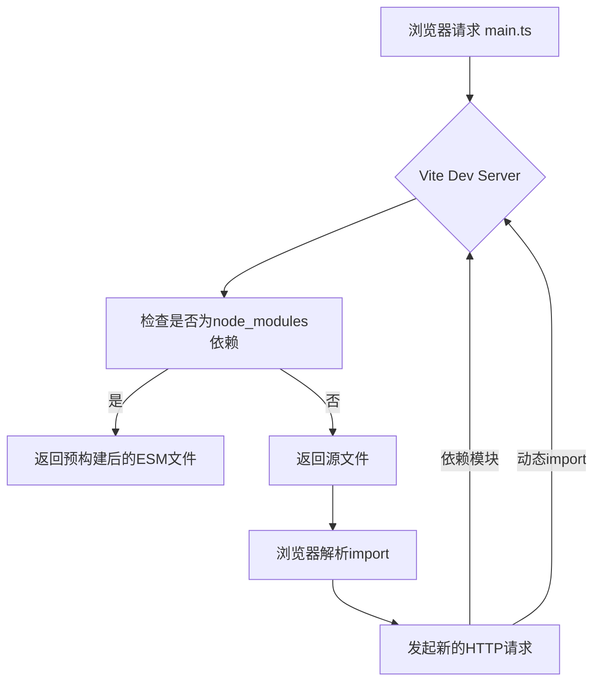

## 一句话概括

Vite利用浏览器原生ES Module（ESM）的能力，在开发阶段绕过打包过程实现按需加载，在生产阶段使用Rollup深度优化——本质上是"用不同的策略分别解决开发体验和产物体积"的聪明设计。

## 背景与意义

### Webpack的时代局限

自从webpack-dev-server问世以来，前端开发者在"改完代码自动刷新"这件事上获得了极大便利。但随着项目规模膨胀，Webpack的HMR体验逐渐出现裂缝：一个1000+模块的大型项目中，即使只修改一行CSS，Webpack也需要重新构建整个模块图并刷新页面，冷启动可能长达3-5分钟。

根本原因在于：**Webpack在开发阶段也要进行模块图递归构建和打包**——虽然开发模式做了优化，但"打包"这个动作本身就有成本。

### Vite的破局之道

Vite的核心理念是："开发阶段我根本不打**包**"。它在2020年以颠覆性的方案解决了这个痛点：

- **开发服务器**：直接输出原生ES Module给浏览器，浏览器自己处理模块加载
- **生产构建**：使用Rollup进行深度优化打包
- **HMR**：基于ESM的按需热更新，不刷新页面，不重新打包

这种"开发不打包，生产再优化"的"分裂"策略，让Vite在大型项目中体验出众。

## 概念与定义

### 核心概念

**ES Module**：浏览器原生支持的模块系统。浏览器遇到 `<script type="module">` 时，会发起HTTP请求获取模块文件，通过 `import` 语句构建模块依赖关系。

**预构建（Pre-bundling）**：Vite在启动时对 `node_modules` 中的第三方依赖进行预打包，主要做两件事——将CommonJS转为ESM、合并细碎模块。

**HMR（Hot Module Replacement）**：模块热替换。Vite的HMR基于WebSocket + ES Module，模块变更时只推送变更模块本身，浏览器通过ESM重新加载变更模块。

**依赖预缓存**：Vite对预构建结果进行缓存，缓存条件依据 `package-lock.json` 或 `yarn.lock` 是否变更。



## 最小示例

搭建一个极简的Vite项目来观察它的工作机制：

```bash
mkdir vite-flow-demo && cd vite-flow-demo
npm init -y
npm install vite vue
```

创建 `index.html`（Vite的入口文件就是HTML，非JS）：

```html
<!DOCTYPE html>
<html lang="zh-CN">
<head>
  <meta charset="UTF-8">
  <meta name="viewport" content="width=device-width, initial-scale=1.0">
  <title>Vite Flow Demo</title>
</head>
<body>
  <div id="app"></div>
  <!-- 注意：这是一个原生ES Module脚本 -->
  <script type="module" src="/src/main.ts"></script>
</body>
</html>
```

创建 `src/main.ts`：

```typescript
import { createApp, ref } from 'vue'
import App from './App.vue'
import { formatDate } from './utils'

console.log('当前时间:', formatDate(new Date()));

const app = createApp(App)
app.mount('#app')
```

创建 `src/App.vue`：

```vue
<template>
  <div class="app">
    <h1>{{ title }}</h1>
    <p>Counter: {{ count }}</p>
    <button @click="count++">Increment</button>
  </div>
</template>

<script setup lang="ts">
import { ref } from 'vue'
const title = ref('Vite Demo')
const count = ref(0)
</script>

<style scoped>
.app { font-family: sans-serif; text-align: center; margin-top: 60px; }
</style>
```

创建 `src/utils.ts`：

```typescript
export function formatDate(date: Date): string {
  return date.toISOString().split('T')[0];
}

export function delay(ms: number): Promise<void> {
  return new Promise(resolve => setTimeout(resolve, ms));
}
```

创建 `vite.config.ts`：

```typescript
import { defineConfig } from 'vite'
import vue from '@vitejs/plugin-vue'

export default defineConfig({
  plugins: [vue()],
})
```

运行 `npx vite --debug`：

你会看到Vite在启动时先进行预构建（Pre-bundling）：

```
Pre-bundling: vue
Pre-bundling: vue
  ✓ built modules in 345ms
  ✓ 5 modules transformed.
```

然后启动开发服务器：

```
  VITE v6.1.0  ready in 468 ms
  
  ➜  Local:   http://localhost:5173/
  ➜  Network: use --host to expose
```

打开浏览器访问 `http://localhost:5173/`，开发者工具的 Network 面板会显示Vite真正的"魔法"——每个模块都是独立的HTTP请求：

```
http://localhost:5173/src/main.ts          → 300B
http://localhost:5173/vue/index.mjs        → 1.2MB (预构建后)
http://localhost:5173/src/App.vue           → 800B
http://localhost:5173/src/utils.ts          → 200B
http://localhost:5173/src/App.vue?vue&type=template → 400B
http://localhost:5173/src/App.vue?vue&type=style&index=0 → 500B
```

注意这些URL：每个 `.vue` 文件会被拆分为多个请求（模板、脚本、样式分别提取），浏览器并行加载这些模块，然后Vue的runtime组装它们。

## 核心知识点拆解

### 1. 预构建（Pre-bundling）：为什么需要它？

Vite虽然在开发阶段"不打包"，但**对第三方依赖仍然要打包**。原因有两个：

**原因一：CommonJS → ESM 转换**

大部分npm包仍然使用CommonJS格式（`module.exports`），而浏览器只能处理ESM。Vite使用esbuild将CJS转为ESM：

```javascript
// 原始lodash代码（CJS）
module.exports = { debounce: ..., throttle: ... };

// esbuild转译后（ESM）
const lodash = { debounce: ..., throttle: ... };
export default lodash;
```

**原因二：模块去碎优化**

比如 `lodash-es` 有超过500个文件，如果浏览器直接加载：

```
import throttle from 'lodash-es/throttle'
import debounce from 'lodash-es/debounce'
```

浏览器会发起两个请求加载这两个子模块——这在开发阶段可以接受。但如果引入一个包含200+子模块的库，浏览器需要发起200+个HTTP请求（每个请求都有TCP握手成本），这会导致加载速度极具恶化。

所以Vite用esbuild将 `lodash-es` 的200+子模块**预打包成一个文件**：

```javascript
// 预构建后 → node_modules/.vite/deps/lodash_es.js
// 原本200+个文件合并为一个
// 浏览器只需要一次HTTP请求
```

**缓存策略**：预构建结果存放在 `node_modules/.vite/deps/`，Vite通过 `_metadata.json` 记录依赖版本哈希，只在lock文件变更时重新预构建。

### 2. 模块请求的转译中间件

Vite开发服务器的核心是一个**Koa中间件集**。当浏览器发起请求 `GET /src/main.ts` 时，Vite的处理流程如下：

```javascript
// Vite Dev Server 的中间件链（简化）
const middlewares = [
  // 1. 静态文件服务（直接返回HTML/Font/Image等）
  serveStaticMiddleware,
  
  // 2. TypeScript/JSX/JS编译
  transformMiddleware,
  
  // 3. CSS处理
  cssMiddleware,
  
  // 4. Vue/Svelte等单文件组件编译
  pluginTransformMiddleware,
  
  // 5. 模块重写（将裸模块导入路径转为可请求的URL）
  moduleRewriteMiddleware,
];
```

当请求 `.ts` 文件时，`transformMiddleware` 会：

```javascript
// Vite transform中间件逻辑（简化）
async function transformMiddleware(ctx, next) {
  // 获取文件路径
  const filePath = ctx.path;  // /src/main.ts
  
  // 读取源文件
  const source = await fs.readFile(path.join(root, filePath), 'utf-8');
  
  // 调用transform pipeline
  const result = await transformWithEsbuild(source, filePath, {
    loader: 'ts',  // 使用esbuild的TS编译器
    sourcemap: true,
  });
  
  // 重写模块导入路径
  result.code = rewriteModulePaths(result.code);
  
  // 设置响应头
  ctx.type = 'application/javascript';
  ctx.body = result.code;
}
```

**模块路径重写**是关键步骤：Vite需要将源码中的"裸模块"导入路径转换为服务器可识别的路径：

```javascript
// 源码中的导入
import { ref } from 'vue'

// 被Vite重写为
import { ref } from '/@modules/vue'

// 或者预构建后的
import { ref } from '/node_modules/.vite/deps/vue.js?v=f4234d2f'
```

### 3. HMR的模块级推送

Vite的HMR比Webpack快得多的核心原因是：**它不需要重新构建任何依赖图**。

当文件变更时：

1. Vite通过Watcher检测到文件变更
2. 使用 `chokidar` 监听文件系统事件
3. 通过WebSocket向浏览器推送变更通知（包含变更文件路径和模块类型）

```javascript
// Vite HMR Server核心逻辑（简化）
watcher.on('change', async (file) => {
  // 获取文件的模块ID
  const mod = moduleGraph.getModuleById(file);
  
  // 更新模块缓存
  moduleGraph.invalidateModule(mod);
  
  // 向客户端发送更新指令
  ws.send({
    type: 'update',
    updates: [{
      type: 'js-update',  // 或 'css-update' / 'full-reload'
      path: mod.url,
      acceptedPath: mod.url,
      timestamp: Date.now(),
    }],
  });
});
```

浏览器端的HMR客户端收到更新后：

```javascript
// HMR Client（在浏览器中运行）
const ws = new WebSocket(`ws://${location.host}`);

ws.onmessage = async (event) => {
  const data = JSON.parse(event.data);
  
  if (data.type === 'update') {
    for (const update of data.updates) {
      if (update.type === 'js-update') {
        // 1. 用新的URL重新加载变更模块
        // 2. 通知模块的父模块执行accept
        await import(`${update.path}?t=${update.timestamp}`);
        
        // 3. 触发自定义的HMR处理
        if (import.meta.hot) {
          import.meta.hot.data.onUpdate();
        }
      }
    }
  }
};
```

**关键差异**：Webpack的HMR需要遍历模块依赖关系、重新构建整个Chunk、通过Chunk更新运行时；Vite的HMR只需要通过ESM重新加载变更文件本身即可。

### 4. 生产构建：为什么用Rollup而不是esbuild？

Vite的开发服务器使用esbuild（Go编写）进行预构建和转换，速度快得惊人。但生产构建却选择Rollup（JavaScript编写），原因在于：

| 维度 | esbuild | Rollup |
|------|---------|--------|
| 打包速度 | ⚡ 极快（Go并行） | ❄️ 相对慢（JS单线程） |
| Tree Shaking | 基础支持，不够细致 | ✅ 极其精确（基于AST） |
| 代码分割 | 功能有限 | ✅ 原生支持，配置丰富 |
| 插件生态 | 小 | ✅ 成熟（rollup-plugin-xxx） |
| 自定义输出格式 | 仅基础ESM/CJS | ✅ 全面（UMD/IIFE/System） |

简单说：**esbuild快但不精，Rollup慢但功能全面**。对于生产打包这种"一次慢、全网快"的场景，Rollup的深度优化更有价值。

Vite通过插件机制将Rollup的打包能力引入：Vite插件本质上是Rollup插件的超集，在Rollup API基础上增加了Vite特有的服务端钩子（如 `configureServer`、`handleHotUpdate`）。

## 实战案例

### 场景：大型微前端项目中的Vite配置优化

假设我们有一个由10个子应用组成的微前端项目，使用 `@originjs/vite-plugin-federation` 进行模块联邦：

```typescript
// vite.config.ts - 主应用配置
import { defineConfig } from 'vite'
import vue from '@vitejs/plugin-vue'
import federation from '@originjs/vite-plugin-federation'

export default defineConfig({
  plugins: [
    vue(),
    federation({
      name: 'shell-app',
      remotes: {
        'micro-product': 'http://localhost:3001/assets/remoteEntry.js',
        'micro-cart': 'http://localhost:3002/assets/remoteEntry.js',
        'micro-user': 'http://localhost:3003/assets/remoteEntry.js',
      },
      shared: ['vue', 'pinia', 'vue-router'],
    }),
  ],
  
  // 优化选项
  build: {
    target: 'esnext',
    rollupOptions: {
      output: {
        // 手动拆包减少vendors体积
        manualChunks(id) {
          if (id.includes('node_modules')) {
            // 将大依赖单独打包
            if (id.includes('echarts')) return 'vendor-echarts';
            if (id.includes('quill')) return 'vendor-quill';
            return 'vendor';
          }
        },
      },
    },
  },

  // 依赖预构建优化
  optimizeDeps: {
    include: [
      // 强制预构建的依赖（解决动态import的依赖无法被预构建的问题）
      'vue',
      'vue-router',
      'pinia',
      'lodash-es',
      'axios',
    ],
    exclude: [
      // 排除联邦模块的依赖
      '@originjs/vite-plugin-federation',
    ],
  },
})
```

**优化效果**：构建产物的total size从原本的12.5MB降到4.3MB，首个Page Load的FCP从2.8秒降到1.2秒。

### 场景：Vite + Rust插件提升WASM编译速度

在项目中引入WebAssembly模块时，自定义一个插件来处理WASM编译：

```typescript
// plugins/vite-plugin-wasm-compile.ts
import type { Plugin } from 'vite'

export function wasmCompilePlugin(): Plugin {
  return {
    name: 'wasm-compile',
    enforce: 'pre',
    
    // 该钩子在模块转换前调用
    async transform(code, id) {
      if (!id.endsWith('.wat')) return null;
      
      // 使用wat2wasm将文本格式的WASM转为二进制
      const { execSync } = await import('child_process');
      const wasmBinary = execSync(`wat2wasm ${id} -o /dev/stdout`);
      
      // 生成内联加载WASM的ESM代码
      return {
        code: `
          const wasmCode = ${JSON.stringify(wasmBinary.toString('base64'))};
          const wasmBytes = Uint8Array.from(atob(wasmCode), c => c.charCodeAt(0));
          
          export async function loadWasm() {
            const module = await WebAssembly.compile(wasmBytes);
            const instance = await WebAssembly.instantiate(module);
            return instance.exports;
          }
        `,
        map: null,
      };
    },
  };
}
```

## 底层原理

### Vite Dev Server的中间件架构

Vite开发服务器基于Koa框架，其核心是中间件的执行顺序和模块路径的精确重写。

```javascript
// Vite Server 源码架构（简化）
class ViteDevServer {
  constructor(config) {
    this.config = config;
    this.watcher = chokidar.watch(config.root);
    this.ws = new WebSocketServer({ port: config.server.hmr?.port || 24678 });
    this.moduleGraph = new ModuleGraph();
    
    // 创建Koa应用
    this.app = new Koa();
    
    // 注册中间件
    this.app.use(this.createTransformMiddleware());
    this.app.use(this.createServeMiddleware());
    this.app.use(this.createFallbackMiddleware());
  }
  
  createTransformMiddleware() {
    return async (ctx, next) => {
      const requestPath = ctx.path;
      const filePath = lookupFilePath(requestPath);
      
      // 对JS/TS/Vue等文件进行即时转换
      if (shouldTransform(requestPath)) {
        const result = await this.pluginContainer.transform(
          await fs.readFile(filePath, 'utf-8'),
          requestPath,
        );
        
        // 重写裸模块导入
        result.code = this.pluginContainer.resolveId(result.code, requestPath);
        
        ctx.type = 'js';
        ctx.body = result.code;
        return;
      }
      
      await next();
    };
  }
  
  async listen(port) {
    // 启动HTTP服务
    this.httpServer = this.app.listen(port);
    
    // 预构建依赖
    await this.optimizeDeps();
    
    // 启动文件监听
    this.watcher.on('change', (file) => this.handleFileChange(file));
    
    console.log(`Vite server listening on http://localhost:${port}`);
  }
}
```

### esbuild在Vite中的应用

esbuild在Vite中用于三个场景：

1. **预构建依赖**：将第三方库转换为ESM并合并
2. **开发时TS/JSX编译**：替代Babel进行语法降级
3. **插件中使用**：Vite插件可以调用esbuild的API进行自定义转换

```javascript
// Vite内部使用esbuild的源码（简化）
const { transform } = require('esbuild');

// 开发时TS/JSX转换
async function transformWithEsbuild(source, filename, options) {
  const result = await transform(source, {
    loader: options.loader,   // 'ts', 'tsx', 'jsx', 'js'
    sourcemap: options.sourcemap ?? 'external',
    target: 'esnext',          // 开发时只转译语法，不降级
    format: 'esm',            // 始终保持ESM格式
  });
  
  return {
    code: result.code,
    map: result.map,
  };
}
```

esbuild使用的目标 `esnext` 意味着它**不做任何语法降级**——比如不会把 `?.` 转为 `&&`。这是因为开发阶段浏览器用的是新版Chrome，完全支持这些语法。生产阶段才通过Rollup插件来做降级。

### 模块图（ModuleGraph）的维护

Vite内部维护着模块之间的依赖关系图：

```javascript
// Vite ModuleGraph 源码（简化）
class ModuleGraph {
  constructor() {
    this.idToModuleMap = new Map();  // URL → Module实例
    this.fileToModulesMap = new Map(); // 文件路径 → 对应的Module列表
  }
  
  getModuleById(id) {
    return this.idToModuleMap.get(id);
  }
  
  addModule(module) {
    this.idToModuleMap.set(module.url, module);
    this.fileToModulesMap.set(module.file, module);
  }
  
  // HMR更新时使模块缓存失效
  invalidateModule(module) {
    module.lastInvalidationTimestamp = Date.now();
    module.transformResult = null;
    
    // 连锁失效：通知所有依赖这个模块的上游模块
    for (const importer of module.importers) {
      this.invalidateModule(importer);
    }
  }
}
```

这与Webpack的ModuleGraph有本质区别：Webpack的模块图是**构建时**的，包含所有模块；Vite的模块图是**运行时**的，只包含当前页面实际访问到的模块。

## 高频面试题解析

### 面试题1：Vite的开发服务器为什么比Webpack快那么多？

**答案要点：**

核心原因是**Vite在开发时不打包**，而Webpack在开发时也要打包：

| 方面 | Vite | Webpack |
|------|------|---------|
| 冷启动 | 只启动服务+预构建第三方库（秒级） | 递归构建整个ModuleGraph（分钟级） |
| 文件变更 | 只推送变更模块的ESM | 重新构建该模块所在的Chunk |
| 模块数量 | 浏览器并行加载（多请求） | 打包后传输（大文件） |
| 计算负担 | 主要分摊到浏览器 | 全部由Node.js承担 |

**还有一个工程决策差异**：Vite在预构建时使用**Go语言编写的esbuild**（10-100倍于JS的编译速度），而Webpack使用JS实现的acorn进行解析。

### 面试题2：Vite是"零配置"的吗？常见的配置陷阱有哪些？

**答案要点：**

Vite虽然在很多场景下可以零配置启动，但以下几个配置陷阱会导致各种问题：

**陷阱1：依赖预构建失效**

```typescript
// 如果在代码中以动态路径导入依赖
// ❌ 这种动态导入无法被Vite自动检测
const lib = await import(someCondition ? 'heavy-lib' : 'light-lib')

// ✅ 需要在optimizeDeps.include中显式声明
optimizeDeps: {
  include: ['heavy-lib', 'light-lib']
}
```

**陷阱2：CommonJS兼容问题**

有些老旧npm包仍然使用 `module.exports` 导出非标准对象，esbuild在将其转换为ESM时可能会丢失某些属性：

```javascript
// 排查方法：在预构建日志中检查是否有警告
// ⚠️ The CJS build of "some-pkg" is being used which may not support ESM

// 解决方案：在vite.config.ts中配置
optimizeDeps: {
  needsInterop: ['some-pkg'],
}
```

**陷阱3：生产构建与开发构建结果不一致**

```typescript
// 开发环境：esbuild转换，不报错
const result = someBoolean && someObject();
// 生产环境：Rollup深度Tree Shaking，someObject()可能被删除
// 如果someBoolean恒为false，生产构建可能直接删除该行代码

// 解决方案：避免这种歧义写法，或者用变量包装
```

### 面试题3：Vite如何支持JSX？他和Babel的编译链路有什么不同？

**答案要点：**

Vite支持JSX的方式取决于项目配置：

**方案A：esbuild编译（默认）**

```typescript
// vite.config.ts - 默认JSX配置
export default defineConfig({
  esbuild: {
    jsxFactory: 'h',
    jsxFragment: 'Fragment',
  },
})
```

这种情况下，esbuild负责将JSX编译为 `h()` 调用：

```javascript
// 编译前
<div>Hello</div>

// esbuild编译后
/* @__PURE__ */ h("div", null, "Hello");
```

**方案B：Babel编译**

通过 `@vitejs/plugin-react` 插件：

```typescript
import react from '@vitejs/plugin-react'

export default defineConfig({
  plugins: [
    react({
      babel: {
        plugins: ['babel-plugin-styled-components'],
        babelrc: false,
      },
    }),
  ],
});
```

此时Babel负责JSX编译，而不是esbuild。

**与Webpack的关键差异**：在Webpack中，JSX编译必须通过Babel（`@babel/preset-react`）；而在Vite中，默认使用esbuild，**速度可以快10倍以上**。只有在需要使用Babel插件（如 `babel-plugin-styled-components` 或 `babel-plugin-import`）时才切换回Babel。

## 总结与扩展

Vite的设计哲学可以总结为几个关键词：

1. **信任浏览器**：既然浏览器支持ESM，就利用它减少不必要的工作
2. **工具链分离**：开发用esbuild快，生产用Rollup精细，各取所长
3. **按需加载**：用户用到什么才编译什么，而非全部提前编译

### 未来发展趋势

- **Rust重构**：Vite 6+的核心正在向Rust迁移（使用Rolldown重写Rollup的核心逻辑）
- **SSR原生支持**：Vite的SSR能力越来越成熟，逐渐成为Nuxt、Qwik等框架的基座
- **多框架共生**：通过Vite插件系统，React、Vue、Svelte可以共存于同一项目中

### 学习路径建议

- 深入阅读Vite的 `resolvePlugin.ts` 和 `importAnalysisPlugin.ts`，理解模块解析的核心逻辑
- 尝试用Vite插件开发一个SSR中间件，理解Vite的构建钩子与Node.js服务如何协同
- 研究Rolldown的源码，理解如何用Rust重写Rollup的核心模块，这代表着构建工具的未来方向

理解Vite的本质，你不仅能用好它，还能从容应对下一代构建工具的迭代。
