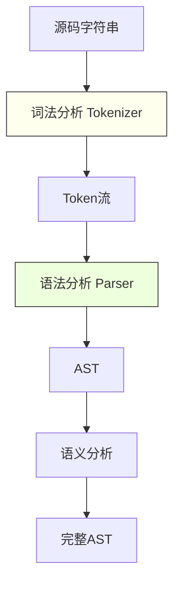

## 一句话概括

Babel本质上是一个**可插拔的JavaScript编译器**，它通过将源码解析为抽象语法树（AST）、遍历AST应用转换、再从AST生成代码的"三段式"流程，实现了从"任意方言JS"到"标准JS"的桥梁作用。

## 背景与意义

### JavaScript的方言时代

2015年ES6（ES2015）发布后，JavaScript语言进入"每年一版本"的快速迭代周期。与此同时，TypeScript崛起、React带来JSX语法、Flow类型注解被广泛应用、Vue SFC需要特殊编译……浏览器无法同时支持所有这些语法变体。

Babel应运而生，它的使命是："让你用最新的语法写代码，然后自动转换为浏览器能理解的形式"。

### 为什么Babel至今仍不可替代？

尽管esbuild、swc等原生编译器正在蚕食Babel的市场，但Babel在以下几个维度仍然不可替代：

1. **插件生态**：npm上有超过4000个Babel插件，覆盖从代码转换到性能分析的各个维度
2. **兼容性**：支持几乎所有的语法提案（Stage 0-4）
3. **Polyfill**：`@babel/polyfill`、`core-js` 结合 `useBuiltIns` 提供了精准的polyfill注入
4. **可定制性**：插件开发门槛低，只要有JavaScript基础就能写

## 概念与定义

### 编译三阶段模型

Babel的编译过程分为三个核心阶段：


1. **解析（Parse）**：使用 `@babel/parser`（Babylon）将源码解析为AST
2. **转换（Transform）**：遍历AST并应用插件进行修改
3. **生成（Generate）**：使用 `@babel/generator` 从修改后的AST生成目标代码

### 关键概念

**AST（抽象语法树）**：源码的一种树形表示。每个节点（Node）代表源码中的一个结构——变量声明、函数调用、if语句等。

**Visitor（访问者模式）**：Babel通过Visitor模式遍历AST。你声明"我想在进入 `ArrowFunctionExpression` 时做什么"，Babel就会在遍历到箭头函数时调用你的函数。

**Plugin/Preset**：Babel的功能单元。Plugin单一职责（比如 `@babel/plugin-transform-arrow-functions` 只转换箭头函数）；Preset是Plugin的集合（比如 `@babel/preset-env` 包含所有语法转换）。

## 最小示例

### 项目搭建

```bash
mkdir babel-deep-demo && cd babel-deep-demo
npm init -y
npm install @babel/core @babel/cli @babel/parser @babel/traverse @babel/generator @babel/types
```

### 使用Babel API进行手动编译

```javascript
// manual-compile.js
const babelParser = require('@babel/parser');
const traverse = require('@babel/traverse').default;
const generate = require('@babel/generator').default;
const t = require('@babel/types');
const fs = require('fs');

// 源码
const sourceCode = `
const hello = (name) => {
  return \`Hello, \${name}!\`;
};
console.log(hello('World'));
`;

// 阶段1：解析
const ast = babelParser.parse(sourceCode, {
  sourceType: 'module',
  plugins: [
    'jsx',          // 支持JSX
    'dynamicImport', // 支持动态import
    'optionalChaining', // 支持可选链 ?.
    'nullishCoalescingOperator', // 支持空值合并 ??
  ],
});

console.log('=== 阶段1：解析完成 ===');
console.log(`AST节点数量: ${JSON.stringify(ast).length} 字符`);

// 阶段2：转换 - 将箭头函数转为普通函数
const arrowFunctionCount = { count: 0 };

traverse(ast, {
  // 进入ArrowFunctionExpression节点
  ArrowFunctionExpression(path) {
    arrowFunctionCount.count++;
    
    const node = path.node;
    
    // 检查是否使用了this——箭头函数会捕获外层this
    let usesThis = false;
    path.traverse({
      ThisExpression() { usesThis = true; }
    });

    // 创建普通函数表达式
    const funcExpression = t.functionExpression(
      null,                          // 匿名函数
      node.params,                   // 参数列表不变
      node.body,                     // 函数体
      false,                         // 不是generator
      node.async,                    // 保持异步属性
    );

    // 如果使用了this，需要创建 _this 变量绑定
    if (usesThis) {
      // 复杂场景：需要 _this 引用
      console.log('⚠️ 检测到this引用，需要特殊处理');
    }

    // 替换当前节点
    path.replaceWith(funcExpression);
  },

  // 进入模板字符串
  TemplateLiteral(path) {
    // 将模板字符串转为字符串拼接
    const quasis = path.node.quasis;
    const expressions = path.node.expressions;
    
    if (expressions.length === 0) {
      // 没有插值，直接转为普通字符串
      path.replaceWith(t.stringLiteral(quasis[0].value.cooked));
      return;
    }

    // 有插值：转为 "Hello" + name + "!" 的形式
    let result = t.stringLiteral(quasis[0].value.cooked);
    for (let i = 0; i < expressions.length; i++) {
      result = t.binaryExpression(
        '+',
        result,
        t.binaryExpression(
          '+',
          expressions[i],
          t.stringLiteral(quasis[i + 1].value.cooked || '')
        )
      );
    }
    path.replaceWith(result);
  },
});

console.log(`\n=== 阶段2：转换完成 ===`);
console.log(`转换了 ${arrowFunctionCount.count} 个箭头函数`);

// 阶段3：生成
const output = generate(ast, {
  retainLines: false,
  retainFunctionParens: false,
  comments: true,
  compact: false,
  minified: false,
}, sourceCode);

console.log('\n=== 阶段3：生成完成 ===');
console.log('输出代码:\n');
console.log(output.code);
```

运行 `node manual-compile.js` 输出：

```
=== 阶段1：解析完成 ===
AST节点数量: 8546 字符

=== 阶段2：转换完成 ===
转换了 1 个箭头函数

=== 阶段3：生成完成 ===
输出代码:

const hello = function (name) {
  return "Hello, " + name + "!";
};
console.log(hello('World'));
```

### 使用Babel配置文件

```javascript
// babel.config.js
module.exports = {
  presets: [
    ['@babel/preset-env', {
      targets: {
        // 只支持最近2个版本的浏览器
        browsers: ['last 2 versions', 'not dead', '> 0.5%'],
      },
      // 按需引入core-js polyfill
      useBuiltIns: 'usage',
      corejs: { version: 3, proposals: true },
      // 不自动转换模块（留给打包工具处理）
      modules: false,
    }],
  ],
  plugins: [
    // 编译装饰器语法
    ['@babel/plugin-proposal-decorators', { legacy: true }],
    // 转换class属性
    '@babel/plugin-proposal-class-properties',
    // 移除console.log
    ['transform-remove-console', { exclude: ['error', 'warn'] }],
  ],
};
```

## 核心知识点拆解

### 1. AST节点的深度解析

了解AST的结构是编写插件的基础。以下是一些常见JavaScript构造在AST中的表示：

```javascript
// 源码: const x = a + b;
// AST表示为:
{
  type: "VariableDeclaration",
  kind: "const",         // let / var / const
  declarations: [{
    type: "VariableDeclarator",
    id: {
      type: "Identifier",
      name: "x"
    },
    init: {
      type: "BinaryExpression",
      operator: "+",
      left: { type: "Identifier", name: "a" },
      right: { type: "Identifier", name: "b" }
    }
  }]
}
```

```javascript
// 源码: import React, { useState } from 'react';
// AST表示为:
{
  type: "ImportDeclaration",
  source: { type: "StringLiteral", value: "react" },
  specifiers: [
    {
      type: "ImportDefaultSpecifier",
      local: { type: "Identifier", name: "React" }
    },
    {
      type: "ImportSpecifier",
      imported: { type: "Identifier", name: "useState" },
      local: { type: "Identifier", name: "useState" }
    }
  ]
}
```

可以使用 `AST Explorer`（https://astexplorer.net）在线查看任意代码的AST结构——这对调试插件非常有帮助。

### 2. path对象与Scope管理

Babel的Traverse中，每个节点被包裹在一个`path`对象中。Path不仅包含节点本身，还提供了一系列操作方法：

```javascript
traverse(ast, {
  FunctionDeclaration(path) {
    // Path方法一览
    
    // 1. 查找祖先节点
    const isInClass = path.findParent(p => p.isClassDeclaration());
    const isInFunction = path.find(p => p.isFunction());
    
    // 2. 替换节点
    path.replaceWith(t.identifier('replaced'));
    path.replaceWithMultiple([node1, node2]);
    
    // 3. 插入节点
    path.insertBefore(t.expressionStatement(...));
    path.insertAfter(t.expressionStatement(...));
    
    // 4. 删除节点
    path.remove();
    
    // 5. 跳过子节点
    path.skip(); // 不遍历此节点的子节点
    path.skipKey('body'); // 跳过body属性的遍历
    
    // 6. 停止遍历
    path.stop();
    
    // 7. 获取当前作用域
    const scope = path.scope;
    // scope.bindings - 当前作用域的绑定变量
    // scope.block - 当前作用域所在的节点
    // scope.parent - 父级作用域
    // scope.globals - 全局变量
  },
});
```

**Scope管理**是插件开发中最容易出错的地方：

```javascript
// 插件中如果引入了新变量，需要注意变量名冲突
traverse(ast, {
  FunctionDeclaration(path) {
    const scope = path.scope;
    
    // ❌ 错误：直接使用固定变量名
    // path.node.body.body.unshift(
    //   t.variableDeclaration('const', [
    //     t.variableDeclarator(t.identifier('helper'), ...)
    //   ])
    // );
    
    // ✅ 正确：使用generateUidIdentifier生成唯一的变量名
    const helperId = path.scope.generateUidIdentifier('helper');
    // 如果'helper'已被占用，会自动生成为 '_helper'、'_helper2' 等
    
    const declaration = t.variableDeclaration('const', [
      t.variableDeclarator(helperId, t.functionExpression(...))
    ]);
    path.node.body.body.unshift(declaration);
  },
});
```

### 3. Babel的类型辅助系统

`@babel/types` 提供了构建和检查AST节点的完整工具：

```javascript
const t = require('@babel/types');

// 类型检查
t.isIdentifier(node);          // node.type === 'Identifier'
t.isFunctionDeclaration(node); // node.type === 'FunctionDeclaration'
t.isCallExpression(node);      // node.type === 'CallExpression'

// 断言（检查失败抛异常）
t.assertIdentifier(node);

// 构建新节点
t.identifier('myVar');                // 变量引用: myVar
t.stringLiteral('hello');             // 字符串: "hello"
t.numericLiteral(42);                 // 数字: 42
t.booleanLiteral(true);               // 布尔: true
t.nullLiteral();                      // null
t.arrayExpression([...]);             // 数组: [...]
t.objectExpression([...]);            // 对象: { ... }
t.callExpression(callee, args);       // 函数调用: foo()
t.memberExpression(object, property); // 属性访问: obj.prop
t.arrowFunctionExpression(params, body); // 箭头函数: () => ...
t.returnStatement(argument);          // return语句

// 更复杂的构建
t.functionDeclaration(
  t.identifier('add'),
  [t.identifier('a'), t.identifier('b')],
  t.blockStatement([
    t.returnStatement(
      t.binaryExpression('+', t.identifier('a'), t.identifier('b'))
    )
  ])
);
// 生成: function add(a, b) { return a + b; }
```

## 实战案例

### 场景：国际化文本自动提取插件

在项目中，所有硬编码的中文文本都需要在Babel编译时自动替换为t函数调用，并将原文本提取到locale文件：

```javascript
// plugins/babel-plugin-i18n.js
const fs = require('fs');
const path = require('path');

let localeMap = {};
let autoId = 0;

module.exports = function i18nPlugin(babel) {
  const t = babel.types;

  return {
    name: 'babel-plugin-i18n',
    
    // pre：在遍历开始前调用，适合初始化
    pre(file) {
      // 尝试读取已有的locale文件
      const localePath = path.resolve(file.opts.filename, '../locales/zh.json');
      try {
        localeMap = JSON.parse(fs.readFileSync(localePath, 'utf-8'));
        autoId = Object.keys(localeMap).length;
      } catch (e) {
        localeMap = {};
        autoId = 0;
      }
    },

    // visitor：核心转换逻辑
    visitor: {
      // 处理Vue SFC中的v-text等模板（需配合vue-loader）
      
      // 处理JSX中的中文文本
      JSXText(path) {
        const text = path.node.value.trim();
        if (!text) return;
        if (!/[\u4e00-\u9fa5]/.test(text)) return;
        if (path.findParent(p => p.isJSXExpressionContainer())) return;

        const key = generateKey(text);
        replaceWithI18nCall(path, key, t);
      },

      // 处理普通字符串字面量中的中文
      StringLiteral(path) {
        const value = path.node.value;
        if (!value) return;
        if (!/[\u4e00-\u9fa5]/.test(value)) return;
        // 排除t函数本身的参数（避免递归替换）
        if (isCalledByT(path)) return;

        const key = generateKey(value);
        replaceWithI18nCall(path, key, t);
      },

      // 处理模板字符串中的中文
      TemplateLiteral(path) {
        const quasis = path.node.quasis;
        const hasChinese = quasis.some(q => 
          /[\u4e00-\u9fa5]/.test(q.value.cooked || '')
        );
        if (!hasChinese) return;

        // 将模板字符串转为 t('key') 调用
        // TODO: 处理插值场景
        const fullText = quasis.map(q => q.value.cooked || '').join('${}');
        const key = generateKey(fullText);
        replaceWithI18nCall(path, key, t);
      },
    },

    // post：在遍历结束后调用，适合输出结果
    post(file) {
      // 提取到的所有中文字符串
      if (autoId > 0) {
        const localePath = path.resolve(file.opts.filename, '../locales/zh.json');
        fs.mkdirSync(path.dirname(localePath), { recursive: true });
        fs.writeFileSync(localePath, JSON.stringify(localeMap, null, 2));
      }
    },
  };
};

function generateKey(str) {
  // 用内容哈希作为key的一部分
  const hash = str.split('').reduce((acc, c) => ((acc << 5) - acc) + c.charCodeAt(0), 0);
  const key = `__K_${Math.abs(hash).toString(36)}__`;
  localeMap[key] = str;
  return key;
}

function replaceWithI18nCall(path, key, t) {
  const i18nCall = t.callExpression(
    t.identifier('t'),
    [t.stringLiteral(key)]
  );
  path.replaceWith(i18nCall);
  
  // 确保t函数被导入
  const program = path.findParent(p => p.isProgram());
  const hasImport = program.node.body.some(
    n => t.isImportDeclaration(n) && n.source.value === '@utils/i18n'
  );
  
  if (!hasImport) {
    program.node.body.unshift(
      t.importDeclaration(
        [t.importDefaultSpecifier(t.identifier('t'))],
        t.stringLiteral('@utils/i18n')
      )
    );
  }
}

function isCalledByT(path) {
  // 检查是否是 t('xxx') 调用中的参数
  const parent = path.parentPath;
  return parent && parent.isCallExpression() && 
    parent.node.callee.name === 't';
}
```

**使用方式**：

```javascript
// babel.config.js - 在项目中启用插件
module.exports = {
  plugins: [
    ['./plugins/babel-plugin-i18n.js'],
  ],
};
```

### 场景：性能检测插件——自动标注热点函数

用于微基准测试场景，自动在所有函数前后插入时间测量代码：

```javascript
// plugins/babel-plugin-profiler.js
module.exports = function profilingPlugin({ types: t }) {
  return {
    name: 'babel-plugin-profiler',
    visitor: {
      // 只在 >=5 行的函数中插入分析代码
      Function(path) {
        const body = path.node.body;
        if (!t.isBlockStatement(body)) return;
        
        const sourceLines = path.hub.file.code.slice(
          body.start, body.end
        ).split('\n');
        
        if (sourceLines.length < 5) return;
        
        const name = path.node.id?.name || 'anonymous';
        const loc = path.node.loc?.start?.line || 0;
        
        // 在函数体开始插入开始计时
        body.body.unshift(
          t.expressionStatement(
            t.callExpression(
              t.memberExpression(
                t.identifier('console'),
                t.identifier('time')
              ),
              [t.stringLiteral(`${name}:${loc}`)]
            )
          )
        );
        
        // 遍历return语句，在return前插入结束计时
        path.traverse({
          ReturnStatement(returnPath) {
            returnPath.insertBefore(
              t.expressionStatement(
                t.callExpression(
                  t.memberExpression(
                    t.identifier('console'),
                    t.identifier('timeEnd')
                  ),
                  [t.stringLiteral(`${name}:${loc}`)]
                )
              )
            );
          }
        });
        
        // 在函数体末尾也有计时结束
        body.body.push(
          t.expressionStatement(
            t.callExpression(
              t.memberExpression(
                t.identifier('console'),
                t.identifier('timeEnd')
              ),
              [t.stringLiteral(`${name}:${loc}`)]
            )
          )
        );
      },
    },
  };
};
```

## 底层原理

### 解析器：@babel/parser 的内部机制

Babel的解析器基于 `acorn`（一个JavaScript解析器），但做了大量扩展。解析器的工作流程是：



**词法分析**将源码拆分为Token序列：

```javascript
// 源码: const a = 1 + 2;

// Token序列:
[
  { type: 'keyword', value: 'const' },
  { type: 'identifier', value: 'a' },
  { type: 'operator', value: '=' },
  { type: 'number', value: '1' },
  { type: 'operator', value: '+' },
  { type: 'number', value: '2' },
  { type: 'separator', value: ';' },
]
```

**语法分析**使用递归下降解析算法，将Token序列组合为AST。比如遇到 `const` token时，Parser会进入 `parseVarStatement` 方法：

```javascript
// @babel/parser 源码简化
parseVarStatement(node, kind) {
  // 确认是变量声明
  // 解析标识符
  const id = this.parseVarHead(); 
  // 如果有初始化，解析等号右侧
  const init = this.eat(types.eq) ? this.parseMaybeAssign() : null;
  
  return this.finishNode({
    type: 'VariableDeclarator',
    id,
    init,
  }, 'VariableDeclarator');
}
```

### 遍历器的递归下降与路径缓存

`@babel/traverse` 的核心是一个**深度优先遍历**算法：

```javascript
// @babel/traverse 核心逻辑简化
function traverse(node, visitor, state) {
  // 1. 获取节点类型对应的visitor函数
  const enter = visitor[node.type]?.enter || visitor[node.type];
  
  // 2. 创建path对象（包裹节点）
  const path = new Path(node, state);
  
  // 3. 调用enter
  if (enter) {
    enter.call(state, path);
  }
  
  // 4. 遍历子节点（根据type定义）
  for (const key of VISITOR_KEYS[node.type]) {
    const child = node[key];
    if (Array.isArray(child)) {
      for (const item of child) {
        // 递归遍历
        traverse(item, visitor, state);
      }
    } else if (child) {
      traverse(child, visitor, state);
    }
  }
  
  // 5. 调用exit（如果有）
  const exit = visitor[node.type]?.exit;
  if (exit) {
    exit.call(state, path);
  }
}
```

### 代码生成器与SourceMap

`@babel/generator` 的生成策略是：**将AST节点直接转换为源代码字符串，并保留源码映射**：

```javascript
// @babel/generator 简化
class CodeGenerator {
  generate(node) {
    switch (node.type) {
      case 'Identifier':
        this.write(node.name);
        break;
      case 'StringLiteral':
        this.write(JSON.stringify(node.value));
        break;
      case 'BinaryExpression':
        this.generate(node.left);
        this.write(' ' + node.operator + ' ');
        this.generate(node.right);
        break;
      case 'FunctionDeclaration':
        this.write('function ');
        this.generate(node.id);
        this.write('(');
        node.params.forEach((p, i) => {
          if (i > 0) this.write(', ');
          this.generate(p);
        });
        this.write(') ');
        this.generate(node.body);
        break;
    }
    
    // 同时跟踪位置信息以生成source map
    this.markSourceMapping(node);
  }
}
```

## 高频面试题解析

### 面试题1：Babel的@babel/preset-env中的useBuiltIns配置项有几种取值？各自的区别是什么？

**答案要点：**

`useBuiltIns` 控制Babel如何向代码中注入polyfill，有三种取值：

**1. `useBuiltIns: false`（默认值）**

不自动注入任何polyfill。你需要手动在入口文件引入：

```javascript
// 你需要手动写这条import
import "core-js/stable";
import "regenerator-runtime/runtime";
```

**2. `useBuiltIns: 'entry'`**

在入口文件中引入了 `core-js` 后，Babel会根据 `targets` 配置替换为针对性的引入：

```javascript
// 你的代码
import "core-js";

// Babel根据targets替换后的代码（比如只需要es6-array-find）
import "core-js/modules/es.array.find";
import "core-js/modules/es.object.entries";
// ...只包含 target浏览器不支持的API
```

**3. `useBuiltIns: 'usage'`（推荐）**

按需注入：Babel会逐个文件分析用到的API，只注入当前文件所需要的polyfill：

```javascript
// 你的代码
const arr = [1, 2, 3].find(x => x > 2);
Promise.resolve().then();

// Babel自动注入（无需手动引入core-js）
import "core-js/modules/es.array.find";
import "core-js/modules/es.promise";
```

**`usage` 的好处是产物体积最小**，但缺点是有时Babel无法检测到动态代码（如 `new Function()` 中的Promise使用）。

### 面试题2：Babel插件中的pre/post函数有什么用？

**答案要点：**

`pre` 和 `post` 是Babel插件生命周期的两个钩子：

```javascript
module.exports = function() {
  return {
    pre(file) {
      // file参数是File对象，包含：
      // file.code - 源码
      // file.opts - 编译选项
      // file.path - 程序根路径
      // file.metadata - 可共享的metadata对象
      
      // 适合做：初始化、读取配置文件
      this.cache = new Map();
    },
    
    visitor: {
      // ...转换逻辑
    },
    
    post(file) {
      // 所有遍历和转换完成后调用
      // file.metadata 此时已包含插件的元数据
      
      // 适合做：清理工作、输出统计分析
      console.log(`插件处理了 ${this.cache.size} 个节点`);
    }
  };
};
```

**使用场景**：`pre` 中读取配置、初始化分析器；`post` 中生成分析报告、写入缓存文件。

### 面试题3：Babel的preset和plugin的执行顺序是怎样的？

**答案要点：**

Babel严格执行以下顺序规则：

**基础规则**：Plugin先执行，Preset后执行。Plugin按添加顺序（从前往后），Preset按添加顺序逆序（从后往前）。

```javascript
module.exports = {
  plugins: [
    'plugin-a',     // 1st
    'plugin-b',     // 2nd
  ],
  presets: [
    'preset-x',     // 4th（Preset先执行最后的）
    'preset-y',     // 3rd（Preset先执行最后的）
  ],
  // 实际执行顺序: plugin-a → plugin-b → preset-y → preset-x
};
```

**Preset逆序的原因**：Preset通常是"从新到旧"配置的（比如 `preset-env`、`preset-stage-0`），最先进去的最新标准应该在最后被执行，以避免被旧标准覆盖。

**特殊情况**：如果某个Plugin需要在其他Plugin之前或之后执行，可以使用 `before` 和 `after` 属性：

```javascript
module.exports = function() {
  return {
    name: 'my-plugin',
    pre(file) {
      // 设置执行顺序
      file.pluginOrder = {
        before: ['another-plugin'],
        after: ['preset-env'],
      };
    },
    visitor: { ... },
  };
};
```

## 总结与扩展

Babel的核心价值在于"**编译层桥接**"——它让开发者可以在语言特性和浏览器支持之间自由取舍，而无需等待浏览器厂商更新。

### 学习的三个阶段

1. **会用**：配置 `preset-env`、掌握 `babel.config.js` 和 `.babelrc` 的区别
2. **会写插件**：理解Visitor模式、AST操作、Scope管理
3. **理解编译原理**：掌握Parse → Transform → Generate三段论，理解递归下降解析和代码生成

### 未来趋势

Babel作为传统的JavaScript编译器，正面临Rust/Go语言原生编译器的挑战。但它的插件生态极其成熟，短期不会被完全替代。未来的方向是：

- **Babel + swc/esbuild混合使用**：开发阶段用Babel（灵活），生产阶段用swc（快速）
- **Babel作为DSL编译器**：越来越多的框架使用Babel编译自定义语法（JSX、SFC、RSC等）

理解Babel的编译原理，不仅是为了写插件，更是为了掌握"代码即数据"的编程范式，这在元编程和工具链开发中有着深远的价值。
