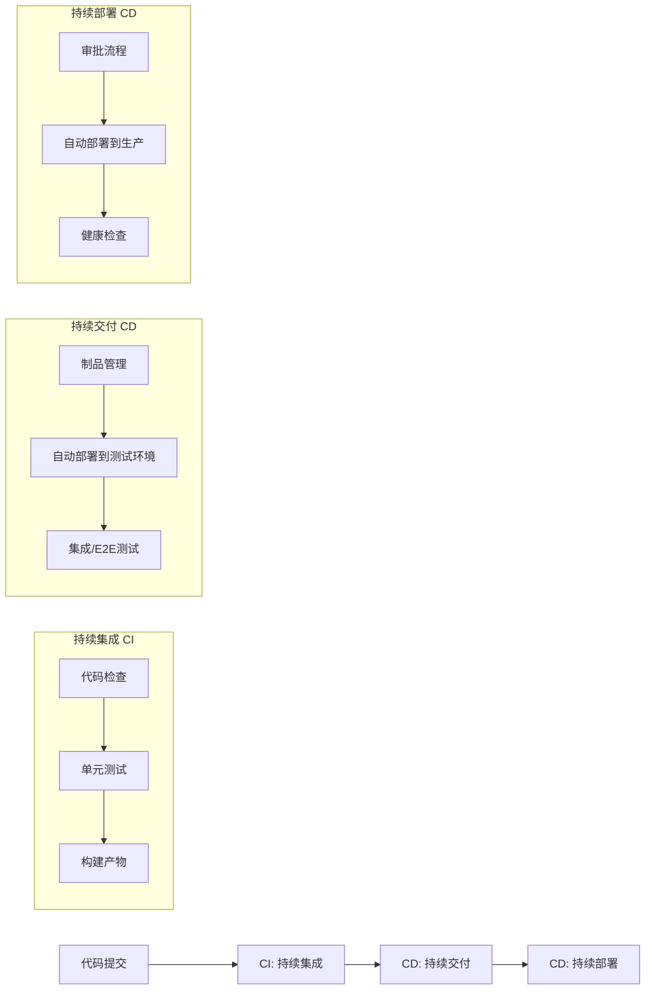
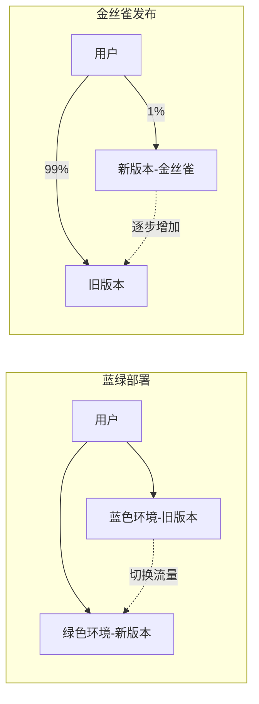
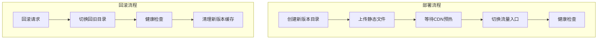

## 一句话概括

CI/CD是一套将代码变更从"编写完成"到"生产部署"的自动化管道——持续集成（CI）保证每次代码变更都被自动构建和测试，持续交付/部署（CD）确保可交付产物能自动发布到目标环境。

## 背景与意义

### 从"发布日"到"随时发布"

在2010年之前，前端项目的发布流程通常是这样的：

1. 团队使用Feature Branch开发功能
2. 在"发布日"将所有功能分支合并到主干
3. 运行集成测试（通常有一半不通）
4. 手动修复Bug（引入新的Bug）
5. 再次测试……
6. 凌晨2点，有人手动在服务器上替换文件
7. 第二天发现线上挂了，回滚

这就是著名的"发布日地狱"。2010年，Jez Humble和Dave Farley出版了《持续交付》一书，系统性地提出了CI/CD的理论框架。他们的核心洞察是：**软件交付中很多风险不是来自代码本身，而是来自"最后一次集成"的不可预测性**。

### 前端CI/CD的特殊挑战

相比后端，前端在CI/CD中有几个独特的痛点：

1. **构建环境一致性**：不同Node.js版本、不同npm版本可能导致构建结果不一致
2. **资源版本管理**：静态资源（JS/CSS/图片）需要正确的缓存策略
3. **增量部署**：大型项目构建需要分钟级，每次全量构建浪费巨大
4. **测试复杂度**：单元测试、组件测试、E2E测试、视觉回归测试
5. **多环境配置**：开发、测试、预发布、生产需要不同的环境变量注入

## 概念与定义

### CI/CD三阶段模型



| 阶段 | 自动化程度 | 人工介入 | 典型时长 |
|------|-----------|---------|---------|
| CI | 全自动 | 无 | 3-15分钟 |
| 持续交付（CD） | 自动到测试环境 | 审批是否发布生产 | 10-30分钟 |
| 持续部署（CD） | 全自动 | 无 | 取决于部署策略 |

### GitHub Actions的核心概念

GitHub Actions是目前前端项目最流行的CI/CD平台（2026年数据：超过70%的开源前端项目使用）。它由以下核心概念组成：

- **Workflow**：一个完整的自动化流程定义文件（YAML格式）
- **Job**：Workflow中的一个执行单元，可以并行或依赖执行
- **Step**：Job中的最小执行步骤
- **Action**：可复用的自动化逻辑单元（包括官方actions和社区actions）
- **Runner**：运行Workflow的虚拟机或容器
- **Event**：触发Workflow执行的事件（如push、pull_request、schedule）

## 最小示例

### 一本完整的CI/CD流水线

```yaml
# .github/workflows/ci-cd-pipeline.yml
name: CI/CD Pipeline

# 触发条件
on:
  push:
    branches: [main, develop]
  pull_request:
    branches: [main]
  # 也可以定时触发（比如每天凌晨执行）
  schedule:
    - cron: '0 2 * * *'

# 环境变量（全局）
env:
  NODE_VERSION: '20'
  PNPM_VERSION: '9'
  REGISTRY: 'ghcr.io'

# Jobs 定义
jobs:
  # ============ Job 1: 代码检查 ============
  lint:
    name: Lint & Format Check
    runs-on: ubuntu-latest
    # 策略矩阵：可以并行跑多个配置
    strategy:
      matrix:
        node-version: [18, 20]
    
    steps:
      - uses: actions/checkout@v4
        with:
          fetch-depth: 0  # 需要获取完整历史用于eslint diff检查

      - uses: actions/setup-node@v4
        with:
          node-version: ${{ matrix.node-version }}
          cache: 'npm'

      - name: Install dependencies
        run: npm ci

      - name: ESLint
        run: npx eslint src/ --max-warnings 0

      - name: Prettier Check
        run: npx prettier --check "src/**/*.{ts,tsx,css,json}"

      - name: TypeScript Check
        run: npx tsc --noEmit

  # ============ Job 2: 单元测试 ============
  test:
    name: Unit Tests
    needs: lint  # 依赖lint job完成
    runs-on: ubuntu-latest
    
    steps:
      - uses: actions/checkout@v4
      - uses: actions/setup-node@v4
        with:
          node-version: ${{ env.NODE_VERSION }}
          cache: 'npm'

      - run: npm ci

      - name: Run unit tests with coverage
        run: npx vitest run --coverage
        env:
          CI: true

      - name: Upload coverage report
        uses: actions/upload-artifact@v4
        with:
          name: coverage-report
          path: coverage/
          retention-days: 7

      - name: Check coverage threshold
        run: |
          # 自定义覆盖率阈值检查
          npx istanbul check-coverage \
            --statements 80 \
            --branches 75 \
            --functions 80 \
            --lines 80 \
            coverage/coverage-final.json

  # ============ Job 3: 构建 ============
  build:
    name: Build
    needs: [lint, test]
    runs-on: ubuntu-latest
    
    steps:
      - uses: actions/checkout@v4
      - uses: actions/setup-node@v4
        with:
          node-version: ${{ env.NODE_VERSION }}
          cache: 'npm'

      - run: npm ci
      
      - name: Build production bundle
        run: npm run build
        env:
          NODE_ENV: production
          VITE_API_BASE_URL: ${{ secrets.API_BASE_URL }}

      - name: Upload build artifacts
        uses: actions/upload-artifact@v4
        with:
          name: build-output
          path: dist/
          retention-days: 7

      # 生成构建报告
      - name: Analyze bundle size
        run: npx vite-bundle-analyzer dist/stats.json

  # ============ Job 4: E2E测试 ============
  e2e:
    name: E2E Tests
    needs: [build]
    runs-on: ubuntu-latest
    
    services:
      # 启动测试依赖的服务（如PostgreSQL）
      postgres:
        image: postgres:16
        env:
          POSTGRES_PASSWORD: testpass
          POSTGRES_DB: testdb
        options: >-
          --health-cmd pg_isready
          --health-interval 10s
          --health-timeout 5s
          --health-retries 5
        ports:
          - 5432:5432

    steps:
      - uses: actions/checkout@v4
      - uses: actions/setup-node@v4
        with:
          node-version: ${{ env.NODE_VERSION }}
          cache: 'npm'

      - run: npm ci
      
      - name: Download build artifacts
        uses: actions/download-artifact@v4
        with:
          name: build-output
          path: dist/

      - name: Start preview server
        run: |
          npx vite preview --port 4173 &
          sleep 3
          # 等待服务就绪
          npx wait-on http://localhost:4173

      - name: Run Playwright E2E tests
        run: npx playwright test
        env:
          BASE_URL: 'http://localhost:4173'

      - name: Upload E2E test screenshots
        if: failure()
        uses: actions/upload-artifact@v4
        with:
          name: e2e-failure-screenshots
          path: test-results/

  # ============ Job 5: 部署到测试环境 ============
  deploy-staging:
    name: Deploy to Staging
    needs: [e2e]
    if: github.ref == 'refs/heads/develop'  # 只有develop分支触发
    runs-on: ubuntu-latest
    environment: staging  # 环境保护规则
    
    steps:
      - name: Download build artifacts
        uses: actions/download-artifact@v4
        with:
          name: build-output
          path: dist/

      - name: Deploy to Staging
        uses: peaceiris/actions-gh-pages@v3
        with:
          github_token: ${{ secrets.GITHUB_TOKEN }}
          publish_dir: ./dist
          destination_dir: staging/${{ github.sha }}

      - name: Run smoke tests
        run: |
          # 检查部署是否成功
          curl -f https://staging.example.com/health

  # ============ Job 6: 部署到生产环境 ============
  deploy-production:
    name: Deploy to Production
    needs: [deploy-staging]
    if: github.ref == 'refs/heads/main'  # 只有main分支触发
    runs-on: ubuntu-latest
    environment: 
      name: production
      url: https://example.com  # 部署后的访问地址
    
    # 需要手动审批才能执行（在GitHub项目Settings中配置）
    # environment的protection rules会在这一步等待审批
    
    steps:
      - name: Download build artifacts
        uses: actions/download-artifact@v4
        with:
          name: build-output
          path: dist/

      - name: Configure AWS credentials
        uses: aws-actions/configure-aws-credentials@v4
        with:
          aws-access-key-id: ${{ secrets.AWS_ACCESS_KEY_ID }}
          aws-secret-access-key: ${{ secrets.AWS_SECRET_ACCESS_KEY }}
          aws-region: ap-northeast-1

      - name: Deploy to S3 + CloudFront
        run: |
          # 同步文件到S3
          aws s3 sync dist/ s3://my-app-production/ \
            --delete \
            --cache-control "public, max-age=31536000, immutable"
          
          # 更新Service Worker（不缓存sw.js）
          aws s3 cp dist/sw.js s3://my-app-production/sw.js \
            --cache-control "no-cache"
          
          # 更新HTML文件（使用版本号策略）
          aws s3 cp dist/index.html s3://my-app-production/index.html \
            --cache-control "no-cache"
          
          # 刷新CloudFront缓存
          aws cloudfront create-invalidation \
            --distribution-id ${{ secrets.CLOUDFRONT_DIST_ID }} \
            --paths "/" "/index.html"

      - name: Health check after deployment
        run: |
          # 多次检查确保部署成功
          for i in {1..5}; do
            STATUS=$(curl -s -o /dev/null -w "%{http_code}" https://example.com/health)
            if [ "$STATUS" = "200" ]; then
              echo "✅ Health check passed"
              exit 0
            fi
            echo "Waiting... attempt $i"
            sleep 2
          done
          echo "❌ Health check failed after 5 attempts"
          exit 1

      - name: Notify team
        uses: slackapi/slack-github-action@v1.24.0
        with:
          payload: |
            {
              "text": "✅ 生产环境部署完成\n版本: ${{ github.sha }}\n部署者: ${{ github.actor }}\n环境: ${{ github.ref_name }}"
            }
        env:
          SLACK_WEBHOOK_URL: ${{ secrets.SLACK_WEBHOOK_URL }}
```

## 核心知识点拆解

### 1. 缓存策略：如何让CI快10倍

CI中的构建速度是开发者体验的关键。GitHub Actions的缓存机制：

```yaml
# 缓存Node.js依赖
- name: Cache node_modules
  uses: actions/cache@v4
  with:
    path: |
      ~/.npm
      node_modules
    key: npm-cache-${{ runner.os }}-${{ hashFiles('package-lock.json') }}
    restore-keys: |
      npm-cache-${{ runner.os }}-

# 缓存Vite/Webpack的编译缓存
- name: Cache build cache
  uses: actions/cache@v4
  with:
    path: |
      node_modules/.cache
      .esbuild-cache
    key: build-cache-${{ runner.os }}-${{ github.sha }}
    restore-keys: |
      build-cache-${{ runner.os }}-
```

**缓存原理**：
- `key`：生成缓存键。如果 `package-lock.json` 没变，key不变，直接命中缓存
- `restore-keys`：key不精确命中时，尝试前缀匹配（如最近的可用缓存）
- 缓存命中时 **~5秒**，缓存未命中时 **~2分钟**（npm install）

**实际效果**：在一个200+依赖的项目中，合理配置缓存后，CI时间从8分15秒降到1分30秒。

### 2. 矩阵构建（Matrix Build）

矩阵构建让你在不同环境下并行执行测试：

```yaml
jobs:
  test:
    strategy:
      matrix:
        # 三种操作系统 × 三个Node版本 = 9个并行job
        os: [ubuntu-latest, windows-latest, macos-latest]
        node-version: [18, 20, 22]
        
        # 排除不需要的组合
        exclude:
          - os: macos-latest
            node-version: 18  # 不测试macOS + Node 18
          
        # 添加特定组合的额外配置
        include:
          - os: ubuntu-latest
            node-version: 20
            coverage: true  # 只在这个组合下跑覆盖率
```

**矩阵策略的最佳实践**：
- 对依赖项（如Node版本）使用全矩阵，确保兼容性
- 对操作系统使用代表性样本（Linux + 1个其他OS）
- 覆盖率报告只跑一次（避免重复）

### 3. 部署策略：蓝绿部署与金丝雀发布



前端项目中使用**版本化目录部署**可以模拟蓝绿部署：

```yaml
# Deploy步骤中的版本化部署
- name: Versioned deployment
  run: |
    BUILD_ID=$(date +%Y%m%d%H%M%S)
    
    # 1. 上传带时间戳的版本目录
    aws s3 sync dist/ s3://my-app/builds/$BUILD_ID/ \
      --cache-control "public, max-age=31536000, immutable"
    
    # 2. 更新index.html的引用（使用最新版本号）
    # 或者使用路由级别的流量切换
    aws s3 cp \
      s3://my-app/builds/$BUILD_ID/index.html \
      s3://my-app/current/index.html
    
    # 3. 保留旧版本用于回滚
    # 回滚时只需将current指向旧的BUILD_ID
```

### 4. 安全实践：Secrets管理

```yaml
# ✅ 正确做法：通过GitHub Secrets管理敏感信息
- name: Deploy
  env:
    # 从GitHub Secrets读取（加密存储，不会在日志中显示）
    API_KEY: ${{ secrets.PRODUCTION_API_KEY }}
    DEPLOY_TOKEN: ${{ secrets.DEPLOY_TOKEN }}
  run: |
    # 使用环境变量（自动脱敏）
    npm run deploy -- --token "$DEPLOY_TOKEN"

# ❌ 错误做法：直接将secret写入命令
- name: ❌ Wrong way
  run: |
    # 这会在日志中打印实际值
    npm run deploy -- --token "my-real-token-12345"
```

**Secrets的最佳实践**：
- 用环境级别隔离Secrets（`test.DEPLOY_TOKEN` vs `prod.DEPLOY_TOKEN`）
- 定期轮换密钥
- 不在日志中打印包含环境变量的命令
- 使用 `actions/security-scan` 检测泄露

## 实战案例

### 场景：Monorepo中的智能流水线

在Monorepo中，不希望在每次提交时都构建和测试所有包。GitHub Actions支持基于路径过滤的智能触发：

```yaml
# .github/workflows/monorepo-ci.yml
name: Monorepo CI

on:
  push:
    branches: [main]
  pull_request:
    branches: [main]

jobs:
  # 第一步：确定哪些包受影响
  changes:
    runs-on: ubuntu-latest
    outputs:
      # 输出一个JSON数组，包含受影响的包
      packages: ${{ steps.detect.outputs.packages }}
    
    steps:
      - uses: actions/checkout@v4
        with:
          fetch-depth: 0  # 需要比较分支历史

      - name: Detect changed packages
        id: detect
        run: |
          # 使用git diff找出变更文件所属的包
          CHANGED=$(git diff --name-only origin/main...HEAD | \
            grep -oE 'packages/[^/]+' | sort -u | \
            jq -R -s -c 'split("\n")[:-1]')
          echo "packages=$CHANGED" >> $GITHUB_OUTPUT
          echo "Affected packages: $CHANGED"

  # 第二步：只构建受影响的包
  build:
    needs: [changes]
    if: needs.changes.outputs.packages != '[]'
    strategy:
      matrix:
        package: ${{ fromJSON(needs.changes.outputs.packages) }}
    
    runs-on: ubuntu-latest
    steps:
      - uses: actions/checkout@v4
      - uses: actions/setup-node@v4
        with:
          node-version: 20
      
      - name: Install root deps
        run: npm ci
        
      - name: Build ${{ matrix.package }}
        run: |
          npx lerna run build --scope=${{ matrix.package }}
          # 或者使用Turborepo
          # npx turbo run build --filter=${{ matrix.package }}
      
      - name: Upload ${{ matrix.package }} build
        uses: actions/upload-artifact@v4
        with:
          name: build-${{ matrix.package }}
          path: packages/${{ matrix.package }}/dist/

  # 第三步：集成测试（涉及多个包变更时）
  integration-test:
    needs: [build]
    if: needs.changes.outputs.packages != '[]'
    runs-on: ubuntu-latest
    steps:
      - uses: actions/checkout@v4
      - run: npm ci
      
      - name: Build all affected packages
        run: |
          PACKAGES=$(echo '${{ needs.changes.outputs.packages }}' | jq -r '.[]')
          for pkg in $PACKAGES; do
            npx lerna run build --scope=$pkg
          done
      
      - name: Run integration tests
        run: npx vitest run --config vitest.integration.config.ts

  # 自动更新依赖图
  update-dep-graph:
    needs: [changes]
    if: github.ref == 'refs/heads/main' && needs.changes.outputs.packages != '[]'
    runs-on: ubuntu-latest
    steps:
      - uses: actions/checkout@v4
      
      - name: Generate dependency graph
        run: npx dependency-cruiser --output-type dot packages/ > deps.dot
      
      - name: Upload dependency graph
        uses: actions/upload-artifact@v4
        with:
          name: dependency-graph
          path: deps.dot
```

### 场景：自定义Action发布npm包

```yaml
# .github/workflows/publish-npm.yml
name: Publish to npm

on:
  release:
    types: [published]

jobs:
  publish:
    runs-on: ubuntu-latest
    permissions:
      contents: read
      id-token: write  # 允许使用npm provenance
    
    steps:
      - uses: actions/checkout@v4
      - uses: actions/setup-node@v4
        with:
          node-version: 20
          registry-url: 'https://registry.npmjs.org'
      
      - run: npm ci
      - run: npm run build
      - run: npm run test
      
      # 生成npm provenance（证明包来自哪个仓库和CI）
      - run: npm publish --provenance --access public
        env:
          NODE_AUTH_TOKEN: ${{ secrets.NPM_TOKEN }}

      - name: Create GitHub Release
        uses: softprops/action-gh-release@v1
        with:
          files: |
            dist/*
            package.json
          generate_release_notes: true
```

## 底层原理

### GitHub Actions的Runner架构

GitHub Actions的Runner是一个Go语言编写的Agent，核心架构如下：

```go
// Runner核心逻辑简化（Go伪代码）
type Runner struct {
  Name       string
  Labels     []string  // 如 "ubuntu-latest", "self-hosted"
  Repository string    // 所属仓库
  Token      string    // 身份验证Token
}

func (r *Runner) Run() {
  for {
    // 1. 轮询GitHub API获取任务
    job := r.pollForJob()
    if job == nil {
      time.Sleep(5 * time.Second)
      continue
    }
    
    // 2. 创建执行环境
    workDir := os.TempDir() + "/actions-runner/" + job.ID
    os.MkdirAll(workDir, 0755)
    
    // 3. 下载workflow文件
    workflow := r.fetchWorkflow(job.WorkflowPath)
    
    // 4. 并行执行Jobs（根据needs依赖）
    for _, jobStep := range workflow.Jobs {
      go r.executeJob(jobStep, workDir)
    }
    
    // 5. 上报结果
    r.reportResult(job.ID, result)
  }
}

func (r *Runner) executeJob(job Job, workDir string) {
  // 1. 设置环境变量
  for key, value := range job.Env {
    os.Setenv(key, value)
  }
  
  // 2. 按顺序执行Steps
  for _, step := range job.Steps {
    // 如果是composite action，递归执行子步骤
    if step.Uses != "" {
      r.runAction(step.Uses, step.With)
    } else {
      // 直接执行shell命令
      exec.Command("bash", "-c", step.Run).Run()
    }
  }
}
```

**Runner的三种形态**：
1. **GitHub托管的Runner**：微软云上的干净VM，每次job结束后销毁
2. **自托管Runner**：团队自己的机器，需要维护环境和清理
3. **分群Runner**：按标签分群（如 `gpu-runner`、`windows-arm64`）

### 部署的原子性与回滚机制



**前端部署的原子性实现**：

```bash
# 伪代码：原子化前端部署
# 关键：使用符号链接切换，保证切换瞬间完成

# 部署前：current → v1.0.0
# ls -l  dist/current
# lrwxr-xr-x  dist/current → dist/releases/v1.0.0

# 部署步骤：
# 1. 创建新版本目录
mkdir -p dist/releases/v2.0.0
cp -r build/* dist/releases/v2.0.0/

# 2. CDN预热（可选但推荐）
for file in $(find dist/releases/v2.0.0 -type f); do
  curl -X PURGE https://cdn.example.com/$file
done

# 3. 原子切换（symlink替换是原子的）
ln -sfn dist/releases/v2.0.0 dist/current

# 切换后：current → v2.0.0

# 4. 健康检查
curl -f https://example.com/health

# 5. 回滚（如果健康检查失败）
ln -sfn dist/releases/v1.0.0 dist/current
```

## 高频面试题解析

### 面试题1：CI和CD的核心区别是什么？前端项目中为什么经常看到"CI/CD"混用？

**答案要点：**

**核心理念区别**：

- **CI（持续集成）**：关注"开发阶段的反馈循环"——每次代码提交都应该经过构建和测试，确保新代码与现有代码能够成功集成。CI失败意味着"当前代码不可用"。
- **CD（持续交付/部署）**：关注"发布阶段的自动化"——确保构建产物可以可靠地交付到目标环境。CD失败意味着"无法上线"。

**前端混用的原因**：

前端项目的CI/CD通常在一个Workflow文件里完成，因为：
1. 前端构建既是CI的验证步骤，也是CD的准备工作
2. 前端项目规模通常比后端小，分离CI/CD反而增加复杂度
3. GitHub Actions用jobs的needs依赖自然分阶段

**但严格来说，混合的Workflow应该有逻辑分界**：

```yaml
# ✅ 好的实践：使用needs清晰地分界
jobs:
  # CI阶段
  lint:    ...
  test:    needs: [lint]
  build:   needs: [test]
  
  # CD阶段（需要手动审批）
  deploy-staging:   needs: [build]
  deploy-production: needs: [deploy-staging]  # 需要手工审核
```

### 面试题2：前端的CDN部署中，Cache-Control头应该如何设置？

**答案要点：**

前端资源分两种类型，需要不同的缓存策略：

**1. 带哈希的文件（内容变更时文件名改变）**

```yaml
# 这类文件可以长期缓存
- run: |
    # 对于 main.a1b2c3d4.js 这样的文件
    aws s3 sync dist/assets/ s3://bucket/assets/ \
      --cache-control "public, max-age=31536000, immutable"
```

- `max-age=31536000` = 缓存1年
- `immutable` 告诉浏览器：文件永远不会在URL不变的情况下变更（即使强刷也不要重新请求）
- 文件内容变更 → 构建产生新哈希 → URL变更 → 浏览器下载新文件

**2. 不带哈希的文件（index.html）**

```yaml
- run: |
    # index.html 不使用缓存
    aws s3 cp dist/index.html s3://bucket/index.html \
      --cache-control "no-cache, no-store, must-revalidate"
    
    # Service Worker 不使用缓存
    aws s3 cp dist/sw.js s3://bucket/sw.js \
      --cache-control "no-cache"
```

- `no-cache`：每次使用前向服务器验证是否过期
- `no-store`：浏览器不保存任何缓存副本
- `must-revalidate`：一旦过期，必须到服务器验证

### 面试题3：如果部署过程中出现问题，如何最小化对用户的影响？

**答案要点：**

前端部署失败时，有以下几个层次的应对策略：

**第一层：部署前的验证**

```yaml
# 使用pre-check钩子
- name: Pre-deployment checks
  run: |
    # 构建完整性检查
    if [ ! -f dist/index.html ]; then
      echo "❌ dist/index.html 不存在"
      exit 1
    fi
    
    # JS文件检查
    JS_COUNT=$(find dist -name "*.js" | wc -l)
    if [ "$JS_COUNT" -lt 3 ]; then
      echo "❌ JS文件数量异常: $JS_COUNT"
      exit 1
    fi
    
    # 入口HTML检查（确保引用的资源存在）
    grep -oP 'src="/assets/\K[^"]+' dist/index.html | while read -r asset; do
      if [ ! -f "dist/assets/$asset" ]; then
        echo "❌ 引用的资源不存在: $asset"
        exit 1
      fi
    done
```

**第二层：蓝绿/金丝雀切换**

```yaml
# 金丝雀发布
- name: Canary release (1% traffic)
  run: |
    # 先部署到金丝雀服务器
    # 只让1%的流量走新版本
    # 运行5分钟的自动化监控
    sleep 300
    
    # 如果没有问题，逐步增加流量
    # 50% → 100%
```

**第三层：自动回滚**

```yaml
# 回滚触发机制
- name: Auto rollback on failure
  if: failure()
  run: |
    echo "🚨 部署失败，自动回滚..."
    
    # 恢复current指向旧版本
    aws s3 cp \
      s3://bucket/releases/prev-version/index.html \
      s3://bucket/current/index.html
    
    # 更新CDN缓存
    aws cloudfront create-invalidation \
      --distribution-id $DIST_ID \
      --paths "/index.html"
    
    # 通知团队
    curl -X POST $SLACK_WEBHOOK \
      -d '{"text":"🚨 自动回滚已执行"}'
```

**第四层：人肉防线**

在CI/CD中最容易忽略的是"人"的因素。设定部署审批流程：超过20%的流量切换或数据库变更需要DevOps和Tech Lead同时审批。

## 总结与扩展

CI/CD不是"把手动操作变成YAML文件"这么简单，它的本质是**建立从代码到生产的可靠管道**：

1. **可靠性**：每次发布的步骤和结果都是可复现的
2. **可追溯性**：每个部署都能追溯到对应的commit和PR
3. **可回滚性**：任何部署失败都能在1分钟内回滚
4. **可观察性**：部署的每一步都有日志、报警、健康检查

### 未来趋势

- **GitOps**：声明式的部署方式，Git仓库是部署的唯一真实来源
- **Edge Deploy**：Cloudflare Workers等边缘计算平台改变前端部署模型
- **AI驱动的CI**：AI自动分析测试失败原因、优化构建流程、预测部署风险

### 学习路径

1. 先从一个简单的CI（lint + test + build）开始
2. 添加CD步骤（部署到Staging环境）
3. 学习Docker容器化部署（适用于前后端分离的项目）
4. 探索Terraform等IaC（基础设施即代码）工具

CI/CD的终极目标是：**让部署变得无聊**——越无聊越可靠，越无聊越稳定。
