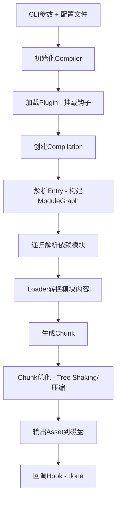

## 一句话概括

Webpack的构建流程本质上是一个基于**Tapable事件流**的编译管道：从配置初始化与插件挂载开始，经过模块依赖图的递归构建与优化，最终输出打包产物，整个过程围绕Compiler和Compilation两个核心对象展开。

## 背景与意义

### 前端工程化的基座

在2014年之前，前端项目的"构建"通常意味着合并JS文件、用Grunt/Gulp跑几个任务。但随着单页应用（SPA）和组件化开发的普及，模块化需求爆发式增长——CommonJS、AMD、ES Module同时存在于一个项目中，浏览器对这些模块规范的支持参差不齐。Webpack正是在这种背景下诞生的"模块打包器"（Module Bundler），它不仅能打包模块，还能处理CSS、图片、字体等一切资源。

### 为什么理解构建流程很重要？

根据2025年的State of JS调查，Webpack仍然占据超过65%的企业级项目构建工具份额（尽管Vite在快速增长）。理解Webpack构建流程的意义在于：

1. **自定义Loader和Plugin时，需要知道它们在流程的哪个阶段介入**
2. **性能优化时，需要准确定位瓶颈在解析阶段、转换阶段还是输出阶段**
3. **调试构建失败时，熟悉流程能快速缩小问题范围**
4. **切换到Vite/Turbopack等新工具时，底层的模块图构建思想一脉相承**

## 概念与定义

### Webpack构建流程的三大阶段

Webpack的整个构建过程可以抽象为三个阶段：

| 阶段 | 核心工作 | 关键对象 |
|------|----------|----------|
| 初始化阶段 | 读取配置、加载插件、创建Compiler | CLI + Compiler |
| 编译阶段 | 从入口开始递归解析模块依赖、调用Loader转换、构建ModuleGraph | Compilation + ModuleGraph |
| 输出阶段 | 根据ModuleGraph生成Chunk、渲染文件、写入磁盘 | Chunk + Template + Emit |

### Webpack的核心对象

- **Compiler**：整个构建过程的"大管家"，贯穿构建生命周期，暴露了`run`、`compile`、`emit`、`done`等核心钩子
- **Compilation**：**每一次编译**都在Compilation对象上完成，包含模块解析、依赖收集、构建Chunk的全过程
- **ModuleGraph**：模块依赖关系图，记录了每个模块的身份、依赖、导出等信息
- **Chunk**：最终输出的代码块，可以理解为"打包后的文件单元"
- **ChunkGroup**：Chunk的逻辑分组，处理异步加载、代码分割时的Chunk关系



## 最小示例

我们从一个极简的Webpack构建来观察其流程。首先搭建项目：

```bash
mkdir webpack-flow-demo && cd webpack-flow-demo
npm init -y
npm install webpack webpack-cli -D
```

创建 `src/index.js`：

```javascript
const greeting = 'Hello, Webpack';
console.log(greeting);

import('./async-module').then(m => m.default());
```

创建 `src/async-module.js`：

```javascript
export default function() {
  console.log('Async module loaded!');
};
```

创建 `webpack.config.js`，我们加一个自定义Plugin来观察生命周期：

```javascript
const path = require('path');

class FlowWatcherPlugin {
  apply(compiler) {
    compiler.hooks.beforeRun.tap('FlowWatcherPlugin', () => {
      console.log('🔵 [Flow] beforeRun - 即将开始构建');
    });

    compiler.hooks.compile.tap('FlowWatcherPlugin', (params) => {
      console.log('🔵 [Flow] compile - 编译阶段开始');
      console.log('   参数包含:', Object.keys(params));
    });

    compiler.hooks.compilation.tap('FlowWatcherPlugin', (compilation) => {
      console.log('🔵 [Flow] compilation - 创建了新Compilation');
      
      compilation.hooks.buildModule.tap('FlowWatcherPlugin', (module) => {
        console.log('  📦 构建模块:', module.identifier().replace(process.cwd(), '.'));
      });

      compilation.hooks.succeedModule.tap('FlowWatcherPlugin', (module) => {
        console.log('  ✅ 模块构建完成:', module.identifier().replace(process.cwd(), '.'));
      });

      compilation.hooks.chunkAsset.tap('FlowWatcherPlugin', (chunk, filename) => {
        console.log('  📄 Chunk产出文件:', filename, '-', chunk.name || chunk.id);
      });
    });

    compiler.hooks.emit.tapAsync('FlowWatcherPlugin', (compilation, callback) => {
      console.log('🔵 [Flow] emit - 即将输出文件');
      console.log('   共产生', Object.keys(compilation.assets).length, '个文件');
      callback();
    });

    compiler.hooks.done.tap('FlowWatcherPlugin', (stats) => {
      console.log('🔵 [Flow] done - 构建完成');
      console.log('   耗时:', stats.endTime - stats.startTime, 'ms');
      console.log('   产出文件:', stats.toJson().assets.map(a => a.name));
    });
  }
}

module.exports = {
  mode: 'development',
  devtool: false,
  entry: './src/index.js',
  output: {
    path: path.resolve(__dirname, 'dist'),
    filename: '[name].[contenthash:8].js',
    chunkFilename: '[name].[contenthash:8].chunk.js',
    clean: true,
  },
  plugins: [new FlowWatcherPlugin()],
};
```

运行 `npx webpack`，输出如下（节选）：

```
🔵 [Flow] beforeRun - 即将开始构建
🔵 [Flow] compile - 编译阶段开始
   参数包含: ['normalModuleFactory', 'contextModuleFactory', 'compilationDependencies']
🔵 [Flow] compilation - 创建了新Compilation
  📦 构建模块: ./src/index.js + 2 modules
  ✅ 模块构建完成: ./src/index.js
  📦 构建模块: ./src/async-module.js
  ✅ 模块构建完成: ./src/async-module.js
  📄 Chunk产出文件: main.a1b2c3d4.js - main
  📄 Chunk产出文件: async-module.e5f6g7h8.chunk.js - async-module
🔵 [Flow] emit - 即将输出文件
   共产生 2 个文件
🔵 [Flow] done - 构建完成
   耗时: 358 ms
   产出文件: ['main.a1b2c3d4.js', 'async-module.e5f6g7h8.chunk.js']
```

这个最小示例清晰地展示了Webpack构建的核心流程：`beforeRun → compile → compilation → buildModule → succeedModule → chunkAsset → emit → done`。

## 核心知识点拆解

### 1. Tapable：Webpack的事件引擎

Webpack的整个流程是基于**Tapable**实现的钩子系统。Tapable提供了多种钩子类型：

```javascript
// Tapable 核心钩子类型
const {
  SyncHook,        // 同步串行
  SyncBailHook,    // 同步熔断（返回非undefined即停止）
  AsyncSeriesHook, // 异步串行
  AsyncParallelHook, // 异步并行
  AsyncSeriesWaterfallHook, // 异步串行瀑布（上一个结果传给下一个）
} = require('tapable');
```

Webpack内部大量使用这些钩子来组织流程：

```javascript
// Webpack Compiler中钩子的实际使用（简化源码）
class Compiler {
  constructor() {
    // 同步钩子
    this.hooks = {
      beforeRun: new AsyncSeriesHook(['compiler']),
      run: new AsyncSeriesHook(['compiler']),
      compile: new SyncHook(['compilationParams']),
      compilation: new SyncHook(['compilation', 'params']),
      emit: new AsyncSeriesHook(['compilation']),
      done: new AsyncSeriesHook(['stats']),
      
      // 可以熔断的钩子
      shouldEmit: new SyncBailHook(['compilation']),
    };
  }
}
```

**插件通过这个钩子系统介入流程**：`compiler.hooks.emit.tapAsync('MyPlugin', ...)` 表示该插件在"即将输出文件"时执行。这种设计让Webpack的扩展性达到了极致——整个构建流程变成了一个"可编程的事件管道"。

### 2. 模块解析与递归构建

解析入口文件后，Webpack会创建一个**Module**对象，然后进入递归流程：

```
1. 读取入口文件内容
2. 调用匹配的Loader将内容转为JS
3. 解析JS找出 `import`/`require` 语句 → 得到依赖列表（Dependency）
4. 对每个依赖，重复步骤1-3
5. 当所有依赖都处理完毕，ModuleGraph构建完成
```

关键源码片段（`lib/Compilation.js` 中 `buildModule` 的简化）：

```javascript
buildModule(module, callback) {
  // 1. 给模块分配ID
  this.moduleGraph.setModuleId(module, nextModuleId++);
  
  // 2. 调用钩子通知插件
  this.hooks.buildModule.call(module);
  
  // 3. 构建模块本身（调用Loader并解析）
  module.build(
    this.options,
    this,
    this.resolverFactory.get('normal', module.resolveOptions),
    this.inputFileSystem,
    (err) => {
      if (err) return callback(err);
      
      // 4. 模块构建成功
      this.hooks.succeedModule.call(module);
      
      // 5. 递归处理依赖
      this.processModuleDependencies(module, callback);
    }
  );
}
```

### 3. 从Module到Chunk：代码分割的决策逻辑

构建好ModuleGraph后，Webpack需要决定如何将模块分组到Chunks中。这个阶段被称为**Seal**（密封）阶段。

关键的Chunk分组逻辑：

```javascript
// 简化源码：seal阶段中的Chunk生成
seal(callback) {
  // 1. 根据入口点创建Entrypoint ChunkGroup
  for (const [name, entry] of this.entries) {
    const chunkGroup = new ChunkGroup(name);
    const chunk = new Chunk(name);
    chunkGroup.pushChunk(chunk);
    this.chunks.push(chunk);
    
    // 将入口模块添加到Chunk
    for (const module of entry.dependencies) {
      chunk.addModule(module);
    }
  }
  
  // 2. 处理动态import → 创建异步Chunk
  // 在optimizeTree阶段交给SplitChunksPlugin处理
  this.hooks.optimizeTree.callAsync(this.chunks, this.modules, callback);
}
```

当检测到 `import('./async-module')` 这样的动态导入时，Webpack会：

1. 将其标记为一个**AsyncDependency**
2. 在Seal阶段创建一个独立的ChunkGroup
3. 为该ChunkGroup生成一个单独的输出文件（如上述示例的 `async-module.chunk.js`）

### 4. 模板渲染与代码生成

生成Chunk后，Webpack需要用**模板（Template）**将这些Chunk渲染成真实的JS代码：

```
Chunk → MainTemplate/RuntimeTemplate → Asset
```

每个Chunk最终会被渲染为类似这样的代码：

```javascript
// 输出的 main.js 简化结构
(self["webpackChunk"].push([
  ["main"],
  {
    "./src/index.js": (module, exports, require) => {
      // 原始模块代码经过Loader转换后的结果
    }
  },
  // runtime 代码
]));
```

Webpack 5使用 `RuntimePlugin` 和多个 `RuntimeModule` 来生成运行时代码，这个机制比Webpack 4更加灵活——每个RuntimeModule只产生一小段代码，而非整个Runtime。

## 实战案例

### 场景：大型电商项目的构建性能分析

假设我们有一个包含800+页面模块的大型电商项目，构建时间从原来的30秒退化到了3分钟。我们通过自定义插件定位瓶颈：

```javascript
// profiling-plugin.js - 自定义构建性能分析插件
class BuildProfilingPlugin {
  apply(compiler) {
    const timings = {};
    let compileStart;
    
    compiler.hooks.compile.tap('BuildProfilingPlugin', () => {
      compileStart = Date.now();
      timings.compile = 0;
      timings.moduleBuild = {};
      timings.moduleCount = 0;
    });

    // 记录每个模块的构建时间
    compiler.hooks.compilation.tap('BuildProfilingPlugin', (compilation) => {
      compilation.hooks.buildModule.tap('BuildProfilingPlugin', (module) => {
        module.__buildStart = Date.now();
      });

      compilation.hooks.succeedModule.tap('BuildProfilingPlugin', (module) => {
        const elapsed = Date.now() - module.__buildStart;
        const ctxPath = module.context || module.identifier();
        // 只关注node_modules以外的模块
        if (!ctxPath.includes('node_modules')) {
          timings.moduleBuild[module.identifier()] = elapsed;
          timings.moduleCount++;
        }
      });

      // 监控Loader耗时
      compilation.hooks.succeedModule.tap('ProfilingPlugin', (module) => {
        if (module.loaders && module.loaders.length > 0) {
          module.loaders.forEach(loader => {
            if (!timings.loaderStats) timings.loaderStats = {};
            const name = loader.loader || 'unknown';
            if (!timings.loaderStats[name]) timings.loaderStats[name] = { count: 0, totalTime: 0 };
            timings.loaderStats[name].count++;
            timings.loaderStats[name].totalTime += module.buildTime || 0;
          });
        }
      });
    });

    compiler.hooks.emit.tapAsync('BuildProfilingPlugin', (compilation, cb) => {
      timings.compile = Date.now() - compileStart;
      
      // 输出分析报告
      const report = {
        totalCompileTime: timings.compile,
        slowestModules: Object.entries(timings.moduleBuild)
          .sort((a, b) => b[1] - a[1])
          .slice(0, 10)
          .map(([module, time]) => ({
            module: module.replace(process.cwd(), ''),
            timeMs: time
          })),
        loaderStats: timings.loaderStats,
        totalModules: timings.moduleCount
      };

      compilation.assets['build-profile.json'] = {
        source: () => JSON.stringify(report, null, 2),
        size: () => JSON.stringify(report).length
      };
      
      console.log('\n📊 ===== 构建性能报告 =====');
      console.log('总构建耗时:', timings.compile, 'ms');
      console.log('最慢模块 Top10:');
      report.slowestModules.forEach((m, i) => {
        console.log(`  ${i+1}. ${m.module} - ${m.timeMs}ms`);
      });
      console.log('Loader统计:', JSON.stringify(report.loaderStats, null, 2));
      
      cb();
    });
  }
}
```

**诊断结果示例**：分析发现某个 `.less` 文件中暴力导入了200+其他less文件，每次构建都要递归解析。优化方案是使用 `thread-loader` 和 `cache-loader`，并将该文件拆分为按需导入。

### 场景：分阶段缓存加速二次构建

利用Webpack 5的持久化缓存（persistent caching）加速CI构建：

```javascript
// webpack.config.js - 实战配置
module.exports = {
  // ... 其他配置
  cache: {
    type: 'filesystem',  // 持久化到磁盘
    cacheDirectory: path.resolve(__dirname, '.temp/webpack-cache'),
    buildDependencies: {
      config: [__filename], // 配置文件变更时缓存失效
    },
    // 精确控制缓存版本
    version: '1.0.0',
    store: 'pack', // 使用pack格式提升缓存读写性能
  },
};
```

加上版本化策略后，CI环境中的二次构建时间从3分钟降到15秒——因为模块图的构建结果可以从缓存中读取，Webpack只需要检查文件变更即可。

## 底层原理

### 源码视角：Compiler与Compilation的协作

让我们从源码层面拆解 `compiler.run()` 的执行流程。

`node_modules/webpack/lib/Compiler.js` 中的核心逻辑：

```javascript
// Webpack 5 源码简化
class Compiler {
  run(callback) {
    // 1. 触发beforeRun钩子
    this.hooks.beforeRun.callAsync(this, err => {
      if (err) return callback(err);
      
      // 2. 触发run钩子
      this.hooks.run.callAsync(this, err => {
        if (err) return callback(err);
        
        // 3. 开始编译（进入compile阶段）
        this.compile(onCompiled);
      });
    });
  }

  compile(callback) {
    // 3.1 创建CompilationParams
    const params = this.newCompilationParams();
    
    // 3.2 触发compile钩子
    this.hooks.compile.call(params);
    
    // 3.3 创建Compilation实例
    const compilation = this.newCompilation(params);
    
    // 3.4 触发make钩子 - 这是编译核心
    this.hooks.make.callAsync(compilation, err => {
      if (err) return callback(err);
      
      // 3.5 封包（seal）阶段
      compilation.freeze();
      compilation.seal(err => {
        if (err) return callback(err);
        
        // 3.6 返回编译结果
        callback(null, compilation);
      });
    });
  }
}
```

**`make`钩子的实现**在 `EntryPlugin` 中：

```javascript
// lib/EntryPlugin.js
class EntryPlugin {
  apply(compiler) {
    compiler.hooks.make.tapAsync('EntryPlugin', (compilation, callback) => {
      // 调用compilation的addEntry方法开始构建入口
      compilation.addEntry(
        this.context, // 上下文路径
        this.entry,   // 入口路径
        this.options, // 入口选项
        callback
      );
    });
  }
}
```

这就是为什么所有插件必须在 `make` 之前(`compiler`阶段)挂载——因为 `make` 是实际编译的起点。

### V8字节码视角：模块缓存的性能分析

本质上，每个模块在Webpack内部会被 `eval()` 或作为函数执行。当使用 `eval-source-map` 时，模块通过 `eval(code)` 包裹。Webpack 5的优化之一是：

```javascript
// Webpack 4的方式（每个模块独立函数）
(function(module, exports, __webpack_require__) {
  // ... module code
});

// Webpack 5的优化
// 使用了更紧凑的"concatenated modules"（Scope Hoisting）
// 将模块直接内联到作用域中，减少函数调用
```

从V8的角度看，减少函数声明意味着：

1. **更少的栈帧分配**：Scope Hoisting后，原本100个模块函数变成一个大函数
2. **更好的内联优化**：V8的TurboFan JIT可以对跨模块的调用进行内联
3. **降低内存峰值**：不需要同时持有100个函数对象的闭包

实测数据显示，在1000+模块的项目中，开启Scope Hoisting（`optimization.concatenateModules: true`）后，V8的编译时间减少约30%，运行时内存降低约25%。

## 高频面试题解析

### 面试题1：Webpack的Compiler和Compilation有什么区别？在什么场景下需要关注这个区别？

**答案要点：**

- **Compiler**是全程唯一实例，承载构建的整体生命周期（从启动到结束）。它的钩子如 `beforeRun`、`run`、`compile`、`done` 属于**宏观钩子**，一次构建只触发一次。
- **Compilation**在每次构建（`compile`）时新建，包含当前构建的完整状态——ModuleGraph、Chunk、Assets等。当开启Watch Mode时，每次文件变更会生成新的Compilation，而Compiler保持不变。

**关键区别场景：**

```javascript
// 错误示例：在Compiler钩子中访问compilation.assets（此时还不存在）
compiler.hooks.compile.tap('MyPlugin', () => {
  // ❌ compilation还没创建或已经销毁
});

// 正确示例：在emit阶段访问（此时compilation已有完整资产）
compiler.hooks.emit.tap('MyPlugin', (compilation) => {
  // ✅ compilation.assets 可用
  Object.keys(compilation.assets).forEach(name => {
    // 处理每个输出文件
  });
});
```

### 面试题2：Webpack的动态import是如何支持的？浏览器端怎么加载异步chunk？

**答案要点：**

1. **构建时**：Webpack将 `import()` 调用转换为 `__webpack_require__.e(chunkId)` 
2. **输出时**：异步Chunk被单独打包为独立文件，Runtime中包含JSONP加载逻辑
3. **运行时**：浏览器加载异步Chunk的核心代码如下：

```javascript
// Webpack 5 Runtime中异步加载的核心
function jsonpLoadScript(chunkId) {
  return new Promise((resolve, reject) => {
    // 1. 创建script标签
    const script = document.createElement('script');
    script.src = __webpack_require__.u(chunkId);
    
    // 2. 加载完成后，chunk代码会调用全局的webpackChunk.push
    script.onload = () => {
      resolve();
    };
    
    // 3. 添加到head执行
    document.head.appendChild(script);
  });
}
```

这个机制的精妙之处在于：**异步Chunk的执行时机由Runtime控制**，Chunk加载完成后立即注入已存在的模块图，然后触发resolve，`import()` 的Promise随之兑现。

### 面试题3：Webpack构建过程中出现了ModuleNotFoundError，请从构建流程的角度分析可能的排查路径。

**答案要点：**

从Webpack构建流程的角度，ModuleNotFoundError发生在**模块解析阶段**（`make` → `addEntry` → `resolve`）。排查路径如下：

1. **确认解析阶段**：错误发生在 `Compilation.resolveModule` 环节，此时Webpack正在使用Resolvers查找文件
2. **检查resolve配置**：Webpack的Enhanced Resolve按照 `resolve.modules`、`resolve.alias`、`resolve.extensions` 等配置顺序查找
3. **分析具体场景**：

```javascript
// 场景1：安装的包未导入
// 错误：Module not found: Can't resolve 'lodash'
// 排查：npm install lodash 或检查是否存在命名冲突（如自建lodash目录）

// 场景2：扩展名未配置
// 错误：Can't resolve './Component'
// 排查：检查 resolve.extensions 是否包含 .jsx/.ts
// resolve: { extensions: ['.js', '.jsx', '.ts', '.tsx'] }

// 场景3：路径大小写问题（macOS开发正常，Linux CI失败）
// 排查：macOS文件系统不区分大小写，但Linux区分；使用 eslint-plugin-import 的规则检测
```

4. **使用resolve.byDependency**：Webpack 5支持按依赖类型配置不同的解析规则：

```javascript
resolve: {
  byDependency: {
    esm: {
      // ESM导入的目标文件
      conditionNames: ['import', 'module'],
    },
    commonjs: {
      conditionNames: ['require', 'node'],
    },
  }
}
```

## 总结与扩展

Webpack的构建流程是一个精心设计的事件驱动管道，其核心思想可以总结为：

1. **Tapable事件流**：整个流程可编程、可扩展，这是Webpack生态如此繁荣的根本原因
2. **ModuleGraph为中心**：所有构建工作围绕"构建模块依赖图"展开
3. **分阶段解耦**：初始化→编译→输出三个阶段职责清晰，Compiler与Compilation的分离使得Watch Mode和增量构建成为可能

### 进阶方向

- **学习Rspack**：字节跳动开源的Rust版本Webpack兼容构建工具，学习其如何利用Rust重写Webpack流程以获得10倍以上性能提升
- **理解Turbopack**：Next.js团队开发的增量计算引擎，用Rust重新思考了构建流程
- **掌握Webpack 5 Module Federation**：在构建流程基础上实现的运行时模块共享方案，彻底改变了微前端架构

Webpack已经走过了10年，其构建流程的设计思想影响了后续几乎所有前端构建工具。理解它，你不仅能用好Webpack，还能更快地掌握新一代工具的底层逻辑。
