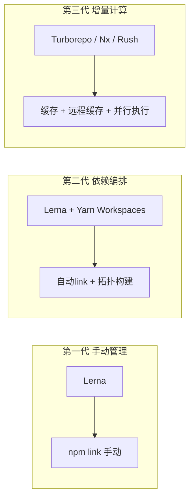
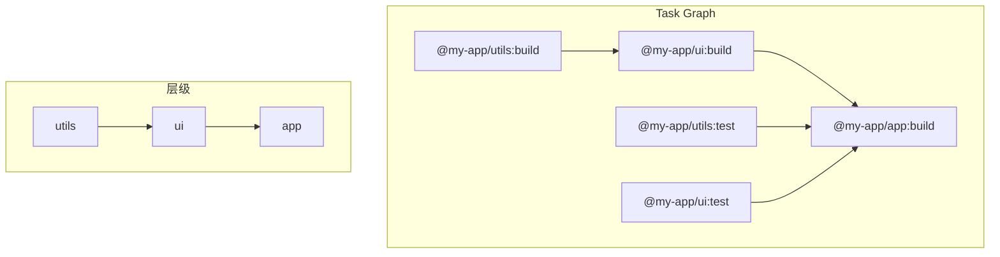

## 一句话概括

Monorepo架构将多个相关项目的代码仓库统一管理，它的核心挑战在于**依赖管理、任务编排和构建缓存**；从Lerna的手动工作流到Turborepo的自动缓存计算，Monorepo工具链的进化史就是前端工程化"从手动控制到增量智能"的缩影。

## 背景与意义

### 从Multi-Repo到Monorepo的范式转换

2015年前后的前端项目通常是Multi-Repo的——UI组件库一个仓库、工具函数一个仓库、业务项目一个仓库。这种方式带来的问题是：

1. **跨仓库修改的沟通成本**：修改一个API → 需要同时改A库和B库 → 提两个PR → 先合并A，发布 → 再更新B的依赖 → 合并B。整个过程至少需要2个PR、1次发布、多次CI
2. **工具链碎片化**：每个仓库有自己的ESLint配置、TypeScript配置、构建脚本，难以统一
3. **版本对齐的头痛**：A@1.5只匹配B@2.3，如果不小心升级了其中一个，可能引发连锁反应

Babel在2016年的仓库重组是一个标志性事件：Babel团队将所有包（30+个）统一到一个仓库中，**任何内部依赖的变更在提交时立即可见**，不需要等待发布。这就是Monorepo的核心价值——**原子变更（Atomic Changes）**。

### Monorepo的核心挑战

Monorepo的优势清晰，但实现起来的挑战也明显：

| 挑战 | 描述 | 解决方案 |
|------|------|---------|
| 构建效率 | 修改一个包 → 全量构建所有包 = 浪费 | 增量构建、缓存 |
| 依赖管理 | 包间依赖需要正确排序 | 拓扑排序、workspace协议 |
| 权限控制 | 不能所有人都能改核心包 | CODEOWNERS |
| 版本发布 | 哪些包需要发布新版本 | 自动化版本检测 |
| CI时间 | 全量测试耗时太长 | 管道化CI、只跑受影响包 |

## 概念与定义

### Monorepo工具的三代演进



| 工具 | 发布时间 | 核心能力 | 缓存 | 远程缓存 |
|------|---------|---------|------|---------|
| Lerna | 2015 | 包管理、版本发布 | ❌ | ❌ |
| Yarn Workspaces | 2017 | 依赖link | ❌ | ❌ |
| Rush | 2017 | 构建编排、依赖管理 | ✅ | ✅ (需配置) |
| Nx | 2018 | 任务编排、缓存、依赖图分析 | ✅ | ✅ (Nx Cloud) |
| Turborepo | 2021 | 增量构建、缓存、管道化 | ✅ | ✅ (Vercel Remote Cache) |

### 核心概念

**Workspace（工作空间）**：多个包在同一个仓库中共享同一个node_modules根目录。

**依赖图（Dependency Graph）**：包之间的依赖关系图，决定了构建/测试的顺序。

**拓扑排序（Topological Sort）**：根据依赖图确定包的执行顺序——必须先构建依赖方，再构建消费者。

**增量构建（Incremental Build）**：只构建变更的包及其下游依赖包。

**Task Graph（任务图）**：Turborepo的核心概念，将构建、测试、lint、类型检查等任务按照依赖关系组织为图。

## 最小示例

### 搭建一个基础Monorepo

```bash
mkdir monorepo-demo && cd monorepo-demo
npm init -y
```

使用 `pnpm` 创建一个最简单的Monorepo：

```yaml
# pnpm-workspace.yaml
packages:
  - 'packages/*'
```

```json
// package.json（根）
{
  "name": "my-monorepo",
  "private": true,
  "scripts": {
    "build": "turbo run build",
    "test": "turbo run test",
    "lint": "turbo run lint",
    "dev": "turbo run dev --parallel"
  },
  "devDependencies": {
    "turbo": "^2.0.0",
    "typescript": "^5.5.0",
    "eslint": "^9.0.0",
    "prettier": "^3.0.0"
  }
}
```

创建工具包：

```json
// packages/utils/package.json
{
  "name": "@my-app/utils",
  "version": "0.1.0",
  "main": "dist/index.js",
  "types": "dist/index.d.ts",
  "scripts": {
    "build": "tsc",
    "test": "vitest run"
  },
  "dependencies": {
    "lodash": "^4.17.21"
  },
  "devDependencies": {
    "typescript": "^5.5.0",
    "vitest": "^2.0.0"
  }
}
```

```typescript
// packages/utils/src/index.ts
import { debounce } from 'lodash';

export function createDebouncedSearch<T>(
  fetcher: (query: string) => Promise<T>,
  waitMs: number = 300
) {
  return debounce(async (query: string): Promise<T | undefined> => {
    if (!query.trim()) return undefined;
    return fetcher(query);
  }, waitMs);
}

export function formatCurrency(amount: number, locale = 'zh-CN'): string {
  return new Intl.NumberFormat(locale, {
    style: 'currency',
    currency: 'CNY',
  }).format(amount);
}
```

创建UI包（依赖于utils包）：

```json
// packages/ui/package.json
{
  "name": "@my-app/ui",
  "version": "0.1.0",
  "main": "dist/index.js",
  "types": "dist/index.d.ts",
  "scripts": {
    "build": "tsc",
    "test": "vitest run"
  },
  // workspace:^ 表示使用workspace协议
  "dependencies": {
    "@my-app/utils": "workspace:^0.1.0",
    "react": "^18.3.0"
  }
}
```

```typescript
// packages/ui/src/SearchBox.tsx
import React, { useState } from 'react';
import { createDebouncedSearch } from '@my-app/utils';

export function SearchBox() {
  const [results, setResults] = useState<string[]>([]);
  
  const search = createDebouncedSearch(async (query: string) => {
    const res = await fetch(`/api/search?q=${query}`);
    return res.json();
  });

  const handleChange = (e: React.ChangeEvent<HTMLInputElement>) => {
    search(e.target.value);
  };

  return (
    <div>
      <input onChange={handleChange} placeholder="搜索..." />
      <ul>
        {results.map((r, i) => <li key={i}>{r}</li>)}
      </ul>
    </div>
  );
}
```

### 配置Turborepo

```json5
// turbo.json
{
  "$schema": "https://turbo.build/schema.json",
  // 全局依赖（影响所有任务的哈希）
  "globalDependencies": [
    "tsconfig.json",
    ".eslintrc.js",
    ".env",
  ],
  // 全局环境的变量（影响所有任务的缓存）
  "globalEnv": [
    "NODE_ENV",
    "CI",
  ],
  // 任务管道定义
  "pipeline": {
    "build": {
      // 构建依赖：packages/ui 的 build 依赖 packages/utils 的 build 先执行
      "dependsOn": ["^build"],
      // 构建输出目录（用于缓存判断）
      "outputs": ["dist/**", ".next/**"],
      // 构建依赖的环境变量
      "env": ["NODE_ENV", "VITE_API_URL"],
      // 构建的缓存配置
      "cache": true,
    },
    "test": {
      "dependsOn": ["build"],
      "outputs": ["coverage/**"],
      "cache": true,
    },
    "lint": {
      // lint没有依赖其他任务，可以独立执行
      "dependsOn": [],
      "outputs": [],
      "cache": false, // lint结果通常不缓存
    },
    "dev": {
      "cache": false,
      "persistent": true, // dev进程是持久运行的
    },
    "typecheck": {
      "dependsOn": ["^build"],
      "cache": true,
    },
    // 根级别的任务（对所有包执行）
    "clean": {
      "cache": false,
    },
    // 自定义任务
    "analyze": {
      "dependsOn": ["build"],
      "outputs": ["dist/stats.json"],
    },
  },
}
```

运行：

```bash
# 构建所有包（按拓扑顺序）
pnpm exec turbo run build

# 只构建ui包及其依赖
pnpm exec turbo run build --filter=@my-app/ui

# 并行运行dev服务器
pnpm exec turbo run dev --parallel

# 只运行变更的包
pnpm exec turbo run test --filter=[HEAD^1]
```

## 核心知识点拆解

### 1. 构建编排与Task Graph

Turborepo的Task Graph是Monorepo工具中最重要的创新之一。`dependsOn` 字段定义了任务之间的执行顺序。



**dependsOn符号的含义**：

| 符号 | 含义 | 示例 |
|------|------|------|
| `^build` | 依赖上游包的build任务必须先执行 | `ui:build` 依赖 `utils:build` |
| `build` | 依赖当前包的build任务 | 无前缀表示同包的不同任务 |
| `//#lint` | 依赖根目录的lint任务 | 根级别的全局任务 |

### 2. 增量计算与缓存策略

Turborepo的缓存方案极其精确——它计算每个任务输入的**哈希值**，如果哈希没有变化，直接从缓存恢复结果：

```javascript
// Turborepo 缓存哈希计算逻辑（简化）
function computeTaskHash(task, config) {
  const hashInput = {
    // 1. 任务文件的glob哈希（构建时所有文件的内容哈希）
    files: hashGlob(task.inputs || ['src/**/*']),
    
    // 2. 依赖包的输出哈希
    dependencies: task.dependencies.map(dep => dep.outputHash),
    
    // 3. 全局依赖哈希（tsconfig、eslint等）
    globalDependencies: hashGlob(config.globalDependencies),
    
    // 4. 环境变量哈希
    env: hashEnv(task.env || []),
    
    // 5. 全局环境变量
    globalEnv: hashEnv(config.globalEnv || []),
    
    // 6. 任务命令本身
    command: task.command,
  };

  return crypto.createHash('sha256')
    .update(JSON.stringify(hashInput))
    .digest('hex');
}
```

**缓存命中时**：

```
@my-app/utils:build  cache hit, replaying output...
  → 耗时 0ms（从缓存读取dist目录和日志）
  
@my-app/ui:build  cache hit, replaying output...
  → 耗时 0ms

@my-app/app:build  cache miss, running...
  → 耗时 45秒（只构建了变更的最终包）
```

**缓存存储在 `node_modules/.cache/turbo/`**，也可以通过 `TURBO_REMOTE_CACHE_API` 配置为远程存储（Vercel Remote Cache）。

### 3. 依赖管理：workspace协议

pnpm和yarn都支持workspace协议：

```json
{
  // workspace:^ 表示 >= pkg 的当前版本且允许patch更新
  "@my-app/utils": "workspace:^0.1.0",
  
  // workspace:* 表示精确匹配当前版本
  "@my-app/config": "workspace:*",
  
  // workspace:~ 表示补丁版本级匹配
  "@my-app/types": "workspace:~0.1.0",
}
```

**发布时的自动转换**：发布到npm时，`workspace:` 协议会被自动转换为真实的版本号：

```json
// 发布前（开发阶段）
"@my-app/utils": "workspace:^0.1.0"

// 发布到npm后
"@my-app/utils": "^0.1.0"
```

### 4. 版本发布策略

Monorepo中有两种版本发布模式：

**独立模式（Independent Mode）**：每个包独立版本号

```bash
# Lerna独立模式
lerna publish --independent

# changesets
npx changeset
npx changeset version
```

**同步模式（Fixed Mode）**：所有包使用相同的版本号

```bash
# 所有包统一版本号
npx lerna version major  # 所有包变成 v2.0.0

# changesets
# 在 .changeset/config.json 设置固定模式
```

**Changesets的推荐用法**：

```bash
# 1. 开发完成，创建changeset
npx changeset
# → 交互式选择哪些包有变更
# → 选择变更类型（major/minor/patch）
# → 输入变更说明

# 2. 在CI中自动生成版本和CHANGELOG
npx changeset version

# 3. 发布
npx changeset publish
```

```javascript
// .changeset/config.json
{
  "$schema": "https://unpkg.com/@changesets/config/schema.json",
  "changelog": "@changesets/cli/changelog",
  "commit": true,
  "fixed": [["@my-app/*"]],  // 固定版本模式
  "linked": [],               // 链接包（保持版本关系）
  "access": "public",
  "baseBranch": "main",
  "updateInternalDependencies": "patch",
  "ignore": ["@my-app/experimental"]
}
```

## 实战案例

### 场景：大型前端Monorepo的Turborepo配置

一个包含50+包的Monorepo的真实配置：

```json5
// turbo.json - 企业级配置
{
  "$schema": "https://turbo.build/schema.json",
  
  // 远程缓存配置
  "remoteCache": {
    "enabled": true,
    "apiUrl": "https://turbo-cache.mycompany.com",
    "teamId": "team_xxxxx",
    "signature": true,
  },
  
  "globalDependencies": [
    ".env",
    "tsconfig.base.json",
    "eslint.config.js",
    "turbo.json",
    ".node-version",
    ".npmrc",
  ],
  
  "globalEnv": [
    "NODE_ENV",
    "CI",
    "VERCEL_ENV",
    "VERCEL_URL",
    "NEXT_PUBLIC_*", // 支持通配符
  ],
  
  "pipeline": {
    "build": {
      "dependsOn": ["^build", "typecheck"],
      "outputs": ["dist/**", ".next/**", ".build/**"],
      "env": ["NODE_ENV", "API_BASE_URL"],
      "inputs": ["src/**/*.ts", "src/**/*.tsx", "tsconfig.json"],
      "cache": true,
      // 超出时间自动失败
      "timeout": 600,
    },
    
    "typecheck": {
      "dependsOn": ["^build"],
      "outputs": [],
      "inputs": ["src/**/*.ts", "src/**/*.tsx", "tsconfig.json"],
    },
    
    "test:unit": {
      "dependsOn": ["build"],
      "outputs": ["coverage/**"],
      "inputs": ["src/**/*.ts", "src/**/*.spec.ts"],
    },
    
    "test:e2e": {
      "dependsOn": ["^build"],
      "outputs": ["playwright-report/**"],
      "inputs": ["e2e/**", "src/**/*.ts"],
    },
    
    "lint": {
      "dependsOn": [],
      "outputs": [],
      "inputs": ["src/**/*.ts", "src/**/*.tsx"],
    },
    
    "dev": {
      "cache": false,
      "persistent": true,
    },
    
    "storybook": {
      "dependsOn": ["^build"],
      "outputs": ["storybook-static/**"],
      "cache": true,
    },
    
    "analyze": {
      "dependsOn": ["build"],
      "outputs": ["dist/stats.json"],
    },
  },
}
```

### 场景：CI流水线中的Monorepo优化


```yaml
# .github/workflows/monorepo-ci.yml
name: Monorepo CI

on:
  push:
    branches: [main]
  pull_request:
    branches: [main]

env:
  TURBO_TEAM: ${{ secrets.TURBO_TEAM }}
  TURBO_API: ${{ secrets.TURBO_API }}
  TURBO_TOKEN: ${{ secrets.TURBO_TOKEN }}

jobs:
  # 第一步：只对受影响的包运行检查
  quality:
    runs-on: ubuntu-latest
    steps:
      - uses: actions/checkout@v4
        with:
          fetch-depth: 0  # 必须获取完整历史用于Turborepo的filter
      
      - uses: pnpm/action-setup@v4
        with:
          version: 10
      
      - uses: actions/setup-node@v4
        with:
          node-version: 20
          cache: 'pnpm'
      
      - run: pnpm install --frozen-lockfile
      
      # 只对受影响的包运行任务
      # 分支对比：PR时的base分支 vs 当前HEAD
      - name: Lint affected
        run: npx turbo run lint --filter=[main...HEAD]
      
      - name: Type-check affected
        run: npx turbo run typecheck --filter=[main...HEAD]
      
      - name: Unit test affected
        run: npx turbo run test:unit --filter=[main...HEAD]
      
      - name: Build affected
        run: npx turbo run build --filter=[main...HEAD]

  # 第二步：完整的端到端测试（定期或全量发布时）
  full-e2e:
    needs: [quality]
    if: github.ref == 'refs/heads/main'
    runs-on: ubuntu-latest
    steps:
      - uses: actions/checkout@v4
      - uses: pnpm/action-setup@v4
      - uses: actions/setup-node@v4
        with:
          node-version: 20
      
      - run: pnpm install --frozen-lockfile
      
      # 全量构建
      - run: npx turbo run build
      
      # 启动所有服务
      - name: Start all services
        run: npx turbo run dev --parallel &
      
      - name: Run E2E tests
        run: npx turbo run test:e2e

  # 第三步：自动发布
  release:
    needs: [full-e2e]
    if: github.ref == 'refs/heads/main' && github.event_name == 'push'
    runs-on: ubuntu-latest
    permissions:
      contents: write
      pull-requests: write
    steps:
      - uses: actions/checkout@v4
      - uses: pnpm/action-setup@v4
      - uses: actions/setup-node@v4
        with:
          node-version: 20
      
      - run: pnpm install --frozen-lockfile
      
      - name: Create Release PR
        uses: changesets/action@v1
        with:
          publish: npx changeset publish
        env:
          GITHUB_TOKEN: ${{ secrets.GITHUB_TOKEN }}
          NPM_TOKEN: ${{ secrets.NPM_TOKEN }}
```


### 场景：Nx的依赖图可视化与分析

```bash
# Nx提供了强大的依赖图可视化
npx nx graph  # 打开浏览器查看依赖图

# 查看特定包的依赖
npx nx graph --focus=@my-app/app

# 找出所有影响了app包的变更
npx nx affected:graph --base=main
```

```javascript
// nx.json
{
  "npmScope": "my-app",
  "affected": {
    "defaultBase": "main"
  },
  "tasksRunnerOptions": {
    "default": {
      "runner": "nx/tasks-runners/default",
      "options": {
        "cacheableOperations": ["build", "test", "lint", "typecheck"],
        "parallel": 3,
        "runtimeCacheInputs": ["node -v"],
        "remoteCache": {
          "enabled": true,
          "url": "https://nx-cache.mycompany.com"
        }
      }
    }
  },
  "targetDefaults": {
    "build": {
      "dependsOn": ["^build"],
      "inputs": ["production", "^production"],
      "outputs": ["{projectRoot}/dist"]
    },
    "test": {
      "inputs": ["default", "^production", "{workspaceRoot}/jest.config.ts"]
    }
  }
}
```

### 场景：自定义Turborepo Runner（分布式缓存）

```typescript
// scripts/turbo-custom-runner.ts
// Turborepo支持自定义Runner来实现分布式缓存

interface CacheResult {
  hash: string;
  outputs: string[];
  duration: number;
}

class RemoteCacheRunner {
  private storage: Map<string, Buffer> = new Map();
  
  async load(hash: string): Promise<CacheResult | null> {
    // 从远程存储（如S3/Redis）恢复缓存
    const cached = await this.fetchFromS3(`turbo-cache/${hash}.tar.gz`);
    if (!cached) return null;
    
    // 解压到output路径
    await this.extractArchive(cached);
    return JSON.parse(
      (await this.fetchFromS3(`turbo-cache/${hash}.meta.json`))!.toString()
    );
  }
  
  async store(hash: string, outputs: string[], duration: number) {
    // 打包outputs
    const archive = await this.createArchive(outputs);
    await this.uploadToS3(`turbo-cache/${hash}.tar.gz`, archive);
    
    // 存储元数据
    const meta = JSON.stringify({ hash, outputs, duration });
    await this.uploadToS3(`turbo-cache/${hash}.meta.json`, Buffer.from(meta));
  }
  
  private async fetchFromS3(key: string): Promise<Buffer | null> {
    // 调用S3 SDK
    return null;
  }
  
  private async uploadToS3(key: string, data: Buffer) {
    // 调用S3 SDK
  }
}
```

## 底层原理

### Turborepo的哈希计算引擎

Turborepo的增量构建依赖于一个精确的哈希引擎：

```rust
// Turborepo 哈希引擎（Rust源码简化，基于turbo-ignore）
use sha2::{Sha256, Digest};
use std::collections::HashMap;

struct TaskHash {
    global_hash: String,      // 全局输入哈希
    task_hash: String,        // 任务相关哈希
    combined_hash: String,    // 最终哈希
}

impl TaskHash {
    fn compute(
        task_name: &str,
        package_path: &str,
        global_config: &GlobalConfig,
        inputs: &[String],
    ) -> Self {
        let mut hasher = Sha256::new();
        
        // 1. 全局依赖
        hasher.update(global_config.global_deps_hash.as_bytes());
        hasher.update(global_config.env_hash.as_bytes());
        
        // 2. 包文件内容（按配置的inputs glob）
        for file in glob::glob(inputs).unwrap() {
            if let Ok(contents) = std::fs::read(&file) {
                hasher.update(&contents);
            }
        }
        
        // 3. 任务配置
        hasher.update(task_name.as_bytes());
        hasher.update(package_path.as_bytes());
        
        // 4. 依赖包的输出（递归）
        // 检查 package.json 的 dependencies
        // 对每个依赖包，读取其 build 的输出哈希
        
        let combined = hex::encode(hasher.finalize());
        
        Self {
            global_hash: String::new(),
            task_hash: String::new(),
            combined_hash: combined,
        }
    }
}
```

### Nx的项目图构建算法

Nx的独特之处在于它维护了一个完整的项目图（Project Graph）：

```typescript
// Nx 项目图构建逻辑
class ProjectGraphBuilder {
  private graph: ProjectGraph = {
    nodes: {},
    dependencies: {},
  };

  async buildProjectGraph(workspaceRoot: string) {
    // 1. 发现所有项目
    const projects = await this.discoverProjects(workspaceRoot);
    
    // 2. 构建项目节点
    for (const project of projects) {
      this.graph.nodes[project.name] = {
        name: project.name,
        type: 'lib' as const,
        data: project,
      };
    }
    
    // 3. 解析依赖关系（读取每个项目的 package.json / tsconfig paths）
    for (const project of projects) {
      const deps = await this.resolveDependencies(project);
      this.graph.dependencies[project.name] = deps;
    }
    
    // 4. 隐式依赖检测（比如使用了相同的测试框架）
    const implicitDeps = await this.detectImplicitDependencies(projects);
    for (const { source, target } of implicitDeps) {
      this.graph.dependencies[source].push({
        type: 'implicit',
        target,
      });
    }
    
    return this.graph;
  }
  
  // 递归依赖解析
  private async resolveDependencies(project: ProjectData) {
    const deps: Dependency[] = [];
    
    // 解析 package.json 的 dependencies
    for (const [depName, version] of Object.entries(project.packageJson.dependencies || {})) {
      // 检查是否是 workspace 内的包
      const internalDep = this.findProjectByName(depName);
      if (internalDep) {
        deps.push({
          type: 'static',
          target: internalDep.name,
          source: project.name,
        });
      }
    }
    
    // 解析 tsconfig paths
    // 解析 import 语句（使用静态分析）
    
    return deps;
  }
}
```

Nx与Turborepo的核心差异：Nx利用了更复杂的"静态依赖分析"——它不只是读 `package.json`，还会解析源码中的 `import` 语句，识别出"虽然现在没有明确的依赖配置，但实际上A引用了B中的类型"的隐式依赖。

### Lerna的"旧时代"架构

```javascript
// Lerna v6 的核心算法（简化）
class Lerna {
  constructor(options) {
    this.packages = [];
    this.graph = new DependencyGraph();
  }
  
  async bootstrap() {
    // 1. 读取 packages/*/package.json
    const pkgDirs = await glob('packages/*/package.json');
    
    // 2. 构建依赖图
    for (const pkgDir of pkgDirs) {
      const pkg = JSON.parse(await fs.readFile(pkgDir));
      this.packages.push(pkg);
      
      // 解析内部依赖
      const internalDeps = Object.entries(pkg.dependencies || {})
        .filter(([name]) => this.isInternalPackage(name));
      
      this.graph.addEdges(pkg.name, internalDeps);
    }
    
    // 3. 拓扑排序
    const sorted = this.graph.topologicalSort();
    
    // 4. 按序执行命令（如 npm link, npm install）
    for (const pkg of sorted) {
      await this.execInPackage(pkg, ['npm', 'install']);
    }
  }
  
  async publish(versionType) {
    // 1. 计算哪些包需要发布
    const changedPackages = await this.getChangedPackages();
    
    // 2. 更新版本号
    for (const pkg of changedPackages) {
      pkg.version = semver.inc(pkg.version, versionType);
    }
    
    // 3. 提交 + 打tag
    // 4. npm publish
  }
}
```

Lerna本质上只是一个**脚本编排器**——它没有自己的缓存机制，每次 `bootstrap` 和 `run build` 都是全量执行。这也是为什么Lerna在2020年后逐渐被Turborepo和Nx取代。

## 高频面试题解析

### 面试题1：Monorepo中如何解决"构建时间太长"的问题？

**答案要点：**

Monorepo的构建时间问题是其核心矛盾。解决方案分为三个层次：

**第一层：增量构建**

```bash
# Turborepo的方案
npx turbo run build --filter=[main...HEAD]
# 只构建变更的包 + 受影响的消费者包
```

Turborepo通过**任务级缓存**实现增量——每个包每次构建的输入计算哈希，没变的直接跳过。

**第二层：并行化**

```bash
# 使用 --parallel 参数
npx turbo run test --parallel

# 控制并发数
npx turbo run build --concurrency=5

# Nx的parallel选项
npx nx run-many --target=build --parallel=3
```

**第三层：CI中的管道化构建**

在CI中分阶段执行不同类型的任务：

```yaml
# CI job拆分
jobs:
  lint-all:     # 耗时短，先跑（5min）
  build-core:   # 构建核心包（10min）
  build-apps:   # 依赖核心包构建（20min）
  e2e:          # 最慢，最后（30min）
```

**量化数据**：在一个50包的Monorepo中，从全量构建的10分钟优化为增量构建的1-2分钟，优化幅度80-90%。

### 面试题2：pnpm workspace、yarn workspace、npm workspace的区别？

**答案要点：**

**共同点**：三者都实现了workspace的核心功能——将包link到一起、在根目录安装共享依赖。

**差异点**：

| 维度 | pnpm workspace | yarn v4 workspace | npm workspace |
|------|---------------|-------------------|---------------|
| 依赖隔离 | ✅ 严格（无幽灵依赖） | 默认严格（PnP模式） | ⚠️ 扁平化（有幽灵依赖） |
| 磁盘效率 | ✅ 硬链接共享 | 依赖缓存策略 | ❌ 每个workspace独立安装 |
| 协议支持 | `workspace:*` | `workspace:^` | 官方未内置，靠工具转译 |
| Monorepo文件数 | ✅ 极少（符号链接） | PnP模式下无node_modules | 大量（扁平化节点） |
| 兼容性 | ✅ 好 | PnP模式有工具不兼容 | ✅ 最好（按需兼容） |
| 性能 | ✅ 安装速度极快 | ✅ 安装速度快 | ⚠️ 中等 |

**选型建议**：
- 新项目首选 **pnpm workspace**（性能+隔离+兼容性的最佳平衡）
- 与Yarn生态绑定的项目继续用 **yarn v4**
- 零依赖配置选 **npm workspace**

### 面试题3：Monorepo中不同包之间的TypeScript类型如何共享和版本管理？

**答案要点：**

**方案1：项目引用（Project References）**

```json5
// packages/utils/tsconfig.json
{
  "compilerOptions": {
    "composite": true,        // 表明这是可被引用的项目
    "declaration": true,      // 生成.d.ts声明文件
    "outDir": "./dist",
    "rootDir": "./src",
  },
  "include": ["src"],
}

// packages/ui/tsconfig.json
{
  "compilerOptions": {
    "composite": true,
  },
  "references": [
    // 引用utils包
    { "path": "../utils" }
  ],
  "include": ["src"],
}
```

**方案2：构建时声明文件生成**

```bash
# 构建顺序：先构建utils（生成.d.ts），再构建ui
turbo run build

# 各包的package.json中
"types": "dist/index.d.ts",
```

**方案3：使用类型专用包**

```bash
packages/
├── types/              # 集中管理所有共享类型
│   ├── src/
│   │   ├── index.ts    # 导出所有类型
│   │   └── api.ts
│   └── package.json    # 只有类型，无运行时代码
├── utils/
└── ui/
```

**版本管理的经验**：
- 内部包的类型变更**立即生效**（不需要等发布）
- 破坏性类型变更用 `BREAKING CHANGE` 在commit中标注
- 使用 `isolatedModules: true` 确保TypeScript与打包工具的一致性

## 总结与扩展

Monorepo不是银弹，但它是超大型前端项目的必然选择。核心要点：

1. **选择对的工具比选择对的模式更重要**：Turborepo的缓存机制是Monorepo的真正"魔法"
2. **增量构建是效率的基石**：没有缓存机制的Monorepo只是"更大的单仓库"
3. **依赖图的精确性是Monorepo的命脉**：错误依赖导致的全量构建是性能杀手

### 未来趋势

- **Rust化**：Turborepo从v2开始用Rust重写了核心，速度比v1快10倍
- **Turborepo与Nx的竞争**：两者都在向彼此靠近（Turborepo变得更可配置，Nx变得更简单）
- **远程缓存的SaaS化**：Vercel Remote Cache、Nx Cloud等让团队共享构建结果
- **与Vite的深度集成**：Vite的按需编译与Turborepo的任务编排结合，有潜力进一步加速开发体验

### 学习路径

1. 先理解Turborepo的 `turbo.json` 的每个配置项含义
2. 用 `turbo run build --graph` 可视化你的项目依赖图
3. 配置远程缓存，观察CI构建时间的变化
4. 对比Nx的 `affected` 命令和Turborepo的 `--filter` 命令的差异
5. 研究Rush的哲学（严格的可控性），理解它与Turborepo的权衡

Monorepo工具的核心是**将"人知道怎么编排"变为"工具自动发现并编排"**。当你配置好Turborepo的pipeline后，每一次 `turbo run build` 都是一次"自动化的拓扑排序+增量计算+缓存命中"的精确工程。
