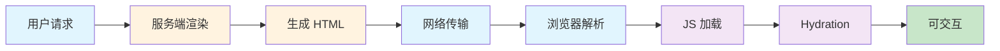

## 一句话概括

SSR 性能优化是服务端渲染落地中最具挑战性的环节。核心目标是在**更短的时间内输出正确的 HTML 到浏览器**，同时平衡**服务端资源消耗**和**客户端交互体验**。优化沿着三条主线展开：**缓存策略**（从内存到 CDN 的多级缓存）、**流式渲染**（React 18 的 renderToPipeableStream 让 TTFB 降低 60%）、**部分水合**（只激活用户即将交互的区域）。在 2026 年的前端性能优化图谱中，SSR 优化已经从"可选技巧"变成了"刚需工程实践"——任何上规模的 SSR 项目都必须系统地解决 TTFB 过长、服务端 CPU 过载、激活开销过大这三大问题。

## 背景与意义

### SSR 的性能困境

SSR 虽然解决了 CSR 的 SEO 和白屏问题，但也引入了新的性能挑战：



从请求到可交互的全链路中，SSR 有两个关键瓶颈：

1. **服务端渲染时间过长**：每次请求都需要在服务端执行 JavaScript，如果组件树复杂或数据获取慢，渲染时间可能达到数百毫秒甚至数秒。
2. **客户端激活（Hydration）开销大**：即使 HTML 已经展示给用户，JavaScript 还需要在客户端重新执行一次组件逻辑来绑定事件，这个阶段用户无法交互。

这就是著名的"SSR 性能悖论"：虽然首屏内容展示变快了，但用户可交互的时间可能延迟。

### 性能指标的变化

| 指标 | 含义 | SSR 优化目标 |
|------|------|------------|
| TTFB（首字节时间） | 浏览器收到第一个字节的时间 | < 200ms |
| FCP（首次内容渲染） | 用户看到内容的时间 | < 1.5s |
| LCP（最大内容渲染） | 页面主要内容加载完成 | < 2.5s |
| TTI（可交互时间） | 用户可以交互的时间 | < 3.5s |
| TBT（总阻塞时间） | 主线程被阻塞的总时间 | < 100ms |

在面试中，SSR 性能优化是高级前端/全栈开发的高频话题。面试官不仅问"SSR 有什么缺点"，更会追问"如何优化 SSR 的渲染性能"、"缓存策略如何设计"、"流式渲染的原理是什么"。这些问题考察的是候选人是否真的在生产环境中实践过 SSR。

## 概念与定义

### SSR 性能优化的三个维度

**渲染加速**：减少服务端生成 HTML 的时间。
- 组件级缓存
- 渲染结果缓存
- 模板预编译

**网络加速**：减少 HTML 传输到浏览器的时间。
- 流式渲染（Streaming SSR）
- CDN 边缘缓存
- HTTP/2 Server Push

**客户端加速**：减少浏览器激活页面的时间。
- 部分水合（Partial Hydration）
- 渐进式水合（Progressive Hydration）
- 岛屿架构（Islands Architecture）

### 核心术语

| 术语 | 定义 |
|------|------|
| TTFB | Time to First Byte，浏览器收到第一个响应字节的时间 |
| Streaming SSR | 边渲染边发送 HTML，而不是全部渲染完再发送 |
| Hydration | 客户端激活，将静态 DOM 变为可交互的 UI |
| Partial Hydration | 只对页面中的交互部分进行激活 |
| Islands Architecture | 页面中独立的交互小岛，各自激活互不干扰 |
| TTI/TBT | 可交互时间/总阻塞时间，衡量交互体验的关键指标 |

## 核心知识点拆解

### 1. 多级缓存策略

缓存是 SSR 性能优化最直接有效的手段。设计良好的缓存策略可以将 P90 的响应时间从 500ms 降至 10ms。

```javascript
// === 多级缓存架构 ===

// 第一级：内存缓存（最快，适合热点页面）
class MemoryCache {
  constructor(options = {}) {
    this.cache = new Map();
    this.maxSize = options.maxSize || 100;  // 最大条目数
    this.ttl = options.ttl || 60000;        // 默认 TTL: 60s
    this.stats = { hits: 0, misses: 0 };
  }

  get(key) {
    const entry = this.cache.get(key);
    if (!entry) {
      this.stats.misses++;
      return null;
    }

    // 检查 TTL
    if (Date.now() - entry.timestamp > this.ttl) {
      this.cache.delete(key);
      this.stats.misses++;
      return null;
    }

    this.stats.hits++;
    return entry.value;
  }

  set(key, value, customTtl) {
    // LRU 淘汰
    if (this.cache.size >= this.maxSize) {
      const firstKey = this.cache.keys().next().value;
      this.cache.delete(firstKey);
    }

    this.cache.set(key, {
      value,
      timestamp: Date.now(),
      ttl: customTtl || this.ttl
    });
  }

  // 主动失效
  invalidate(key) {
    this.cache.delete(key);
  }

  // 按模式失效（相关页面批量失效）
  invalidatePattern(pattern) {
    for (const key of this.cache.keys()) {
      if (key.includes(pattern)) {
        this.cache.delete(key);
      }
    }
  }

  getStats() {
    const total = this.stats.hits + this.stats.misses;
    return {
      size: this.cache.size,
      hits: this.stats.hits,
      misses: this.stats.misses,
      hitRate: total > 0 ? (this.stats.hits / total * 100).toFixed(2) + '%' : '0%'
    };
  }
}

// 第二级：Redis 缓存（跨进程共享，适合分布式部署）
class RedisCache {
  constructor(redisClient) {
    this.client = redisClient;
    this.defaultTTL = 300; // 5 分钟
  }

  async get(key) {
    try {
      const value = await this.client.get(`ssr:${key}`);
      if (value) {
        return JSON.parse(value);
      }
      return null;
    } catch (err) {
      console.error('Redis cache get error:', err);
      return null; // 缓存故障不应影响页面正常渲染
    }
  }

  async set(key, value, ttl) {
    try {
      await this.client.set(
        `ssr:${key}`,
        JSON.stringify(value),
        'EX',
        ttl || this.defaultTTL
      );
    } catch (err) {
      console.error('Redis cache set error:', err);
    }
  }

  async invalidate(pattern) {
    const keys = await this.client.keys(`ssr:${pattern}*`);
    if (keys.length > 0) {
      await this.client.del(keys);
    }
  }
}

// 第三级：CDN 缓存（全球边缘节点，最快响应）
// CDN 配置通常通过 Cache-Control 头控制
function setCacheHeaders(res, maxAge = 60) {
  // 对于 ISR 场景，使用 stale-while-revalidate 策略
  res.setHeader('Cache-Control', `public, max-age=0, s-maxage=${maxAge}, stale-while-revalidate=${maxAge * 10}`);
  // 示例：max-age=0 表示浏览器不缓存，s-maxage=60 表示 CDN 缓存 60 秒
  // stale-while-revalidate=600 表示 CDN 可以在 600 秒内返回过期缓存同时后台更新
}
```

```javascript
// === 完整的缓存策略集成 ===

// 缓存键构造：区分不同用户的缓存
function buildCacheKey(req) {
  const url = req.url;
  const userAgent = req.headers['user-agent'] || '';

  // 决定是否缓存（登录用户、个性化页面不缓存）
  const isLoggedIn = req.cookies?.session_token;
  const isBot = /bot|crawler|spider/i.test(userAgent);

  if (isLoggedIn && !isBot) {
    // 登录用户：不缓存，或按用户缓存
    return `user:${req.userId}:${url}`;
  }

  // 匿名用户：按 URL 缓存
  return `anon:${url}`;
}

// 缓存决策器
class CacheDecider {
  constructor() {
    this.memoryCache = new MemoryCache({ maxSize: 200, ttl: 30000 });
    this.redisCache = null; // 需要时初始化
    this.stats = {
      memory: { hits: 0, misses: 0 },
      redis: { hits: 0, misses: 0 }
    };
  }

  async getCachedPage(req) {
    const cacheKey = buildCacheKey(req);

    // 1. 检查内存缓存
    const memoryResult = this.memoryCache.get(cacheKey);
    if (memoryResult) {
      this.stats.memory.hits++;
      return { html: memoryResult.html, from: 'memory' };
    }
    this.stats.memory.misses++;

    // 2. 检查 Redis 缓存
    if (this.redisCache) {
      const redisResult = await this.redisCache.get(cacheKey);
      if (redisResult) {
        this.stats.redis.hits++;
        // 回填内存缓存
        this.memoryCache.set(cacheKey, redisResult, 10000); // 内存存 10 秒
        return { html: redisResult.html, from: 'redis' };
      }
      this.stats.redis.misses++;
    }

    // 3. 缓存未命中：渲染页面
    return null;
  }

  setCachedPage(req, html, ttl) {
    const cacheKey = buildCacheKey(req);
    const entry = { html, timestamp: Date.now() };

    // 写入内存缓存（较短 TTL）
    this.memoryCache.set(cacheKey, entry, Math.min(ttl || 60000, 30000));

    // 写入 Redis 缓存（较长 TTL）
    if (this.redisCache) {
      this.redisCache.set(cacheKey, entry, ttl || 300);
    }
  }

  // 页面更新时使缓存失效
  async invalidateRelated(url) {
    await this.memoryCache.invalidatePattern(url);
    if (this.redisCache) {
      await this.redisCache.invalidate(url);
    }
  }
}
```

### 2. 组件级缓存（Component-Level Caching）

有时候缓存整个页面不够灵活。对于某些计算密集但内容相对稳定的组件，可以应用组件级缓存。

```javascript
// === React 组件级缓存 ===

// 方案 1：React.memo + 手动缓存
const ExpensiveComponent = React.memo(function ExpensiveComponent({ data, userId }) {
  // 渲染大量数据，比如一个复杂的表格
  const processedData = useMemo(() => {
    return data.map(item => ({
      ...item,
      fullName: `${item.firstName} ${item.lastName}`,
      // 大量计算...
    }));
  }, [data]);

  return (
    <div className="expensive-table">
      {processedData.map(row => (
        <Row key={row.id} data={row} />
      ))}
    </div>
  );
});

// 方案 2：使用 LRU 缓存组件渲染结果（服务端）
const serverComponentCache = new LRUCache({
  max: 500,
  ttl: 1000 * 60 * 5 // 5 分钟
});

function renderComponentWithCache(Component, props, cacheKey) {
  // 检查缓存
  const cached = serverComponentCache.get(cacheKey);
  if (cached) {
    return cached;
  }

  // 渲染组件
  const html = ReactDOMServer.renderToString(
    React.createElement(Component, props)
  );

  // 写入缓存
  serverComponentCache.set(cacheKey, html);

  return html;
}

// 方案 3：动态缓存——根据数据特征决定缓存策略
class ComponentRenderer {
  constructor() {
    this.cache = new Map();
    this.renderCount = new Map();
  }

  shouldCache(componentName, props) {
    // 规则：高频访问的组件才缓存
    const count = this.renderCount.get(componentName) || 0;

    // 如果渲染次数超过阈值，考虑缓存
    if (count > 100) {
      // 检查 props 是否稳定（没有 userId 等个性化数据）
      return !props.userId && !props.sessionToken;
    }

    return false;
  }

  render(Component, props) {
    const name = Component.displayName || Component.name || 'Unknown';

    // 更新渲染计数
    this.renderCount.set(name, (this.renderCount.get(name) || 0) + 1);

    // 如果可以缓存，构建缓存键
    if (this.shouldCache(name, props)) {
      const cacheKey = `${name}:${JSON.stringify(props)}`;
      const cached = this.cache.get(cacheKey);
      if (cached) {
        return cached;
      }

      const html = ReactDOMServer.renderToString(
        React.createElement(Component, props)
      );

      this.cache.set(cacheKey, html);
      return html;
    }

    // 不可缓存，直接渲染
    return ReactDOMServer.renderToString(
      React.createElement(Component, props)
    );
  }
}
```

### 3. 流式渲染（Streaming SSR）

流式渲染是 React 18 带来的重大革新。核心思想是：**不等所有数据就绪，渲染多少就发送多少**。

```javascript
// === 流式渲染的完整实现 ===

import express from 'express';
import React from 'react';
import { renderToPipeableStream } from 'react-dom/server';

const app = express();

// 模拟慢速 API
function fetchHeader() {
  return new Promise(resolve => {
    setTimeout(() => resolve({ title: '我的博客', logo: '/logo.png' }), 50);
  });
}

function fetchMainContent() {
  return new Promise(resolve => {
    setTimeout(() => resolve({
      title: 'SSR 性能优化指南',
      content: '这是一篇关于 SSR 性能优化的深度文章...（长内容）'
    }), 500);
  });
}

function fetchSidebar() {
  return new Promise(resolve => {
    setTimeout(() => resolve({
      recentPosts: ['文章1', '文章2', '文章3'],
      categories: ['前端', '后端', '架构']
    }), 1000);
  });
}

function fetchComments() {
  return new Promise(resolve => {
    setTimeout(() => resolve([
      { author: '张三', text: '好文章！' },
      { author: '李四', text: '学习了' }
    ]), 1500);
  });
}

// 流式渲染处理器
function handleStreamingRequest(req, res) {
  res.setHeader('Content-Type', 'text/html; charset=utf-8');

  // 1. 立即发送 HTML 头部
  res.write(`
    <!DOCTYPE html>
    <html>
    <head>
      <title>流式渲染 Demo</title>
      <style>
        .skeleton { background: #f0f0f0; border-radius: 4px; animation: pulse 1.5s infinite; }
        @keyframes pulse { 0%, 100% { opacity: 0.6; } 50% { opacity: 1; } }
        .content-loaded { animation: fadeIn 0.3s; }
        @keyframes fadeIn { from { opacity: 0; } to { opacity: 1; } }
      </style>
    </head>
    <body>
      <div id="root">
  `);

  // 2. 尽快发送页面头部（不需要等 API）
  fetchHeader().then(header => {
    const headerHtml = `
      <header class="content-loaded">
        <h1>${header.title}</h1>
        <nav>首页 | 关于 | 联系</nav>
      </header>
    `;
    res.write(headerHtml);

    // 3. 骨架屏：在主要内容加载前发送占位
    res.write(`
      <main>
        <div class="skeleton" style="height: 24px; width: 60%; margin-bottom: 20px;"></div>
        <div class="skeleton" style="height: 200px; margin-bottom: 20px;"></div>
      </main>
      <aside>
        <div class="skeleton" style="height: 150px;"></div>
      </aside>
    `);
  });

  // 4. 主内容就绪后发送真实内容
  fetchMainContent().then(content => {
    // 使用流式插入替换骨架屏
    res.write(`
      <script>
        document.querySelector('main').innerHTML = \`
          <article class="content-loaded">
            <h2>${content.title}</h2>
            <div>${content.content}</div>
          </article>
        \`;
      </script>
    `);
  });

  // 5. 侧边栏就绪
  fetchSidebar().then(sidebar => {
    res.write(`
      <script>
        document.querySelector('aside').innerHTML = \`
          <div class="sidebar content-loaded">
            <h3>最近文章</h3>
            <ul>${sidebar.recentPosts.map(p => '<li>' + p + '</li>').join('')}</ul>
            <h3>分类</h3>
            <ul>${sidebar.categories.map(c => '<li>' + c + '</li>').join('')}</ul>
          </div>
        \`;
      </script>
    `);
  });

  // 6. 评论就绪
  fetchComments().then(comments => {
    res.write(`
      <script>
        document.querySelector('main').insertAdjacentHTML('beforeend', \`
          <section class="comments content-loaded">
            <h3>评论</h3>
            ${comments.map(c => '<div><strong>' + c.author + '</strong>: ' + c.text + '</div>').join('')}
          </section>
        \`);
      </script>
    `);
  });

  // 7. 等待所有异步任务完成后结束响应
  Promise.all([
    fetchHeader(),
    fetchMainContent(),
    fetchSidebar(),
    fetchComments()
  ]).then(() => {
    res.write(`
      </div>
      <script src="/client.js"></script>
    </body>
    </html>
    `);
    res.end();
  });
}

app.get('/streaming', handleStreamingRequest);

// === React 18 的流式 SSR（使用 renderToPipeableStream） ===
function ReactStreamingPage() {
  return (
    <html>
      <head>
        <title>React 18 Streaming</title>
      </head>
      <body>
        <Header />
        <Suspense fallback={<LoadingSkeleton />}>
          <MainContent />
        </Suspense>
        <Suspense fallback={<SidebarSkeleton />}>
          <Sidebar />
        </Suspense>
        <Scripts />
      </body>
    </html>
  );
}

// 服务端使用
app.get('/react-streaming', (req, res) => {
  const { pipe } = renderToPipeableStream(
    React.createElement(ReactStreamingPage),
    {
      onShellReady() {
        res.setHeader('Content-Type', 'text/html');
        pipe(res);
      },
      onShellError(err) {
        res.status(500).send('Error');
      }
    }
  );
});
```

### 4. 部分水合（Partial Hydration）

全量水合意味着页面上的每个组件都需要激活，即使有些组件从未被用户交互。部分水合只激活需要交互的区域。

```javascript
// === 部分水合实现 ===

// 方案 1：按组件声明是否需要水合
// 通过自定义属性标记
const HYDRATION_ATTR = 'data-hydrate';

class SelectiveHydration {
  constructor(rootElement) {
    this.root = rootElement;
    this.hydrationTasks = [];
  }

  // 扫描页面，收集需要水合的组件
  scan() {
    // 查找所有带有 data-hydrate 属性的元素
    const elements = this.root.querySelectorAll(`[${HYDRATION_ATTR}]`);

    elements.forEach(el => {
      const componentName = el.getAttribute(HYDRATION_ATTR);
      const props = JSON.parse(el.getAttribute('data-props') || '{}');

      this.hydrationTasks.push({
        element: el,
        componentName,
        props,
        priority: this.getPriority(el)
      });
    });

    return this.hydrationTasks;
  }

  // 计算优先级
  getPriority(element) {
    const rect = element.getBoundingClientRect();
    const inViewport = rect.top < window.innerHeight &&
      rect.bottom > 0;

    const isInteractive = element.matches(
      'button, input, select, textarea, [role="button"], a'
    );

    // 在视口内的交互元素最高优先级
    if (inViewport && isInteractive) return 3;
    if (inViewport) return 2;
    if (isInteractive) return 1;
    return 0;
  }

  // 执行水合
  hydrate() {
    // 按优先级排序
    this.hydrationTasks.sort((a, b) => b.priority - a.priority);

    // 高优先级立即执行
    const immediate = this.hydrationTasks.filter(t => t.priority >= 2);
    const deferred = this.hydrationTasks.filter(t => t.priority < 2);

    immediate.forEach(task => this.hydrateElement(task));

    // 低优先级在空闲时执行
    if (deferred.length > 0) {
      if ('requestIdleCallback' in window) {
        requestIdleCallback(() => {
          deferred.forEach(task => this.hydrateElement(task));
        }, { timeout: 5000 });
      } else {
        setTimeout(() => {
          deferred.forEach(task => this.hydrateElement(task));
        }, 2000);
      }
    }
  }

  hydrateElement(task) {
    const { element, componentName, props } = task;

    // 已经被水合的跳过
    if (element.hasAttribute('data-hydrated')) return;

    switch (componentName) {
      case 'LikeButton':
        this.hydrateLikeButton(element, props);
        break;
      case 'CommentForm':
        this.hydrateCommentForm(element, props);
        break;
      case 'SearchInput':
        this.hydrateSearchInput(element, props);
        break;
      // 其他组件...
    }

    element.setAttribute('data-hydrated', 'true');
  }

  // 每个组件的水合逻辑独立
  hydrateLikeButton(element, { initialCount }) {
    let count = initialCount;
    const countDisplay = element.querySelector('.count');

    element.addEventListener('click', async () => {
      count++;
      if (countDisplay) countDisplay.textContent = count;
    });
  }

  hydrateCommentForm(element) {
    const textarea = element.querySelector('textarea');
    const submitBtn = element.querySelector('button');

    if (submitBtn && textarea) {
      submitBtn.addEventListener('click', async () => {
        const text = textarea.value;
        if (!text.trim()) return;
        // 提交评论...
        submitBtn.disabled = true;
        submitBtn.textContent = '提交中...';
      });
    }
  }

  hydrateSearchInput(element) {
    const input = element.querySelector('input');
    if (input) {
      input.addEventListener('input', (e) => {
        // 搜索防抖...
      });
    }
  }
}

// 服务端：输出带水合标记的 HTML
function renderWithHydrationMarkers(componentRegistry) {
  return function(Component, props) {
    // 检查组件是否需要水合
    const config = componentRegistry[Component.name];

    if (config && config.hydrate) {
      // 渲染组件但不包括 JavaScript，只留下标记
      const html = ReactDOMServer.renderToString(
        React.createElement(Component, props)
      );

      return `
        <div ${HYDRATION_ATTR}="${Component.name}"
             data-props='${JSON.stringify(props)}'>
          ${html}
        </div>
      `;
    }

    // 不需要水合的组件——直接输出静态 HTML
    return ReactDOMServer.renderToString(
      React.createElement(Component, props)
    );
  };
}

// 方案 2：使用 Intersection Observer 实现懒水合
class LazyHydration {
  constructor() {
    this.observer = new IntersectionObserver((entries) => {
      entries.forEach(entry => {
        if (entry.isIntersecting) {
          const element = entry.target;
          this.hydrateElement(element);
          this.observer.unobserve(element);
        }
      });
    }, {
      rootMargin: '200px' // 提前 200px 开始水合
    });
  }

  observe(element) {
    this.observer.observe(element);
  }

  hydrateElement(element) {
    // 执行水合逻辑
    console.log('Hydrating:', element);
    element.setAttribute('data-hydrated', 'true');
  }

  disconnect() {
    this.observer.disconnect();
  }
}
```

## 实战案例

### 构建一个高性能 SSR 电商页面

将上述优化技术整合到一个真实的电商商品详情页中。

```javascript
// === server/product-page.js - 高性能 SSR 商品页 ===

import express from 'express';
import React from 'react';
import { renderToPipeableStream } from 'react-dom/server';
import { CacheDecider } from './cache';
import { SelectiveHydration } from './hydration';

const app = express();
const cache = new CacheDecider();

// 商品页面的多级缓存处理
app.get('/products/:id', async (req, res) => {
  const startTime = Date.now();

  // 1. 检查缓存
  const cached = await cache.getCachedPage(req);
  if (cached) {
    const latency = Date.now() - startTime;
    console.log(`[Cache HIT] ${req.url} — ${latency}ms (from ${cached.from})`);
    setCacheHeaders(res, 60);
    return res.send(cached.html);
  }

  // 2. 准备数据（并行获取）
  const productPromise = fetchProduct(req.params.id);
  const recommendationsPromise = fetchRecommendations(req.params.id);
  const reviewsPromise = fetchReviews(req.params.id);
  const inventoryPromise = checkInventory(req.params.id);

  // 3. 流式渲染
  res.setHeader('Content-Type', 'text/html; charset=utf-8');
  res.setHeader('Transfer-Encoding', 'chunked');

  // 立即发送 HTML 头部
  res.write('<!DOCTYPE html><html><head>');
  res.write('<title>商品详情</title>');
  res.write('<link rel="stylesheet" href="/styles.css">');
  res.write('</head><body><div id="root">');

  // 发送页面头部（布局）
  res.write(`
    <header class="site-header">
      <nav>...</nav>
    </header>
    <div class="product-layout">
  `);

  // 等待核心数据（产品信息）
  const product = await productPromise;

  // 核心 HTML：产品标题、价格、图片等
  res.write(`
    <div class="product-main">
      <div class="product-gallery">
        
      </div>
      <div class="product-info">
        <h1 class="product-title">${product.name}</h1>
        <div class="product-price">
          <span class="current-price">¥${product.price}</span>
          ${product.originalPrice ? `<span class="original-price">¥${product.originalPrice}</span>` : ''}
        </div>
        <p class="product-desc">${product.shortDescription}</p>
        <!-- "加入购物车"按钮使用部分水合 -->
        <div data-hydrate="AddToCartButton" data-props='${JSON.stringify({ productId: product.id, price: product.price })}'>
          <button class="add-to-cart-btn">加入购物车</button>
          <span class="price-display">¥${product.price}</span>
        </div>
      </div>
    </div>
  `);

  // 侧边栏推荐（使用骨架屏占位，延迟加载）
  res.write(`
    <aside class="product-sidebar">
      <h3>推荐商品</h3>
      <div id="recommendations-placeholder">
        <div class="skeleton" style="height: 100px;"></div>
        <div class="skeleton" style="height: 100px; margin-top: 10px;"></div>
      </div>
    </aside>
  `);

  // 继续并行等待其他数据
  const [recommendations, reviews] = await Promise.all([
    recommendationsPromise,
    reviewsPromise
  ]);

  // 推荐商品就绪后流式插入
  if (recommendations && recommendations.length > 0) {
    const recHtml = recommendations.map(r => `
      <div class="recommendation-item">
        <a href="/products/${r.id}">
          
          <span>${r.name}</span>
          <span>¥${r.price}</span>
        </a>
      </div>
    `).join('');

    res.write(`
      <script>
        document.getElementById('recommendations-placeholder').innerHTML = '${recHtml}';
      </script>
    `);
  }

  // 评论区域——使用懒水合，不在首屏激活
  if (reviews && reviews.length > 0) {
    const reviewHtml = reviews.slice(0, 3).map(r => `
      <div class="review-item">
        <strong>${r.author}:</strong>
        <p>${r.text}</p>
      </div>
    `).join('');

    res.write(`
      <div data-hydrate="ReviewSection"
           data-props='${JSON.stringify({ productId: product.id, totalReviews: reviews.length })}'
           style="margin-top: 30px;">
        <h3>用户评价</h3>
        ${reviewHtml}
        <button class="view-all-reviews" style="display: ${reviews.length > 3 ? 'block' : 'none'}">
          查看全部 ${reviews.length} 条评价
        </button>
      </div>
    `);
  }

  // 关闭 HTML 结构
  res.write('</div></div>');

  // 注入水合脚本
  res.write(`
    <script src="/client-hydration.js"></script>
    <script>
      window.__INITIAL_STATE__ = ${JSON.stringify({
        productId: product.id,
        price: product.price,
        initialData: {
          product,
          recommendations,
          reviews
        }
      }).replace(/</g, '\\u003c')};
    </script>
  `);

  res.write('</body></html>');
  res.end();

  // 4. 缓存整页结果（写缓存）
  const fullHtml = ''; // 实际需收集所有 chunk
  cache.setCachedPage(req, { html: fullHtml, timestamp: Date.now() }, 60);

  const totalTime = Date.now() - startTime;
  console.log(`[Render] ${req.url} — ${totalTime}ms`);
});

// 性能监控中间件
app.use((req, res, next) => {
  const start = Date.now();
  res.on('finish', () => {
    const duration = Date.now() - start;
    const url = req.originalUrl || req.url;
    console.log(`[${res.statusCode}] ${url} — ${duration}ms — ${res.getHeader('x-cache') || 'MISS'}`);

    // 记录慢查询（超过 500ms 的请求）
    if (duration > 500) {
      console.warn(`[SLOW] ${url} took ${duration}ms`);
    }
  });
  next();
});
```

```javascript
// === public/client-hydration.js - 客户端水合逻辑 ===

(function() {
  'use strict';

  // 延迟与优先级管理
  const PRIORITY = {
    IMMEDIATE: 3,  // 视口内交互组件
    DEFERRED: 2,   // 视口内非交互组件
    LAZY: 1,       // 视口外交互组件
    IDLE: 0        // 视口外非交互组件
  };

  // 组件水合器注册表
  const hydrators = {};

  function registerHydrator(name, hydratorFn) {
    hydrators[name] = hydratorFn;
  }

  // 基础水合器
  registerHydrator('AddToCartButton', (element, props) => {
    const { productId, price } = props;
    const btn = element.querySelector('.add-to-cart-btn');
    const countDisplay = element.querySelector('.price-display');
    let quantity = 1;

    if (btn) {
      btn.addEventListener('click', async () => {
        btn.disabled = true;
        btn.textContent = '添加中...';

        try {
          const res = await fetch('/api/cart/add', {
            method: 'POST',
            headers: { 'Content-Type': 'application/json' },
            body: JSON.stringify({ productId, quantity })
          });

          if (res.ok) {
            btn.textContent = '✓ 已加入购物车';
            btn.classList.add('added');
          }
        } catch (err) {
          btn.textContent = '添加失败，重试';
          btn.disabled = false;
        }
      });
    }
  });

  registerHydrator('ReviewSection', (element) => {
    const viewAllBtn = element.querySelector('.view-all-reviews');

    if (viewAllBtn) {
      viewAllBtn.addEventListener('click', async () => {
        viewAllBtn.textContent = '加载中...';
        viewAllBtn.disabled = true;
        // 加载更多评论...
      });
    }
  });

  // 水合执行器
  function hydrate() {
    const initialData = window.__INITIAL_STATE__ || {};
    delete window.__INITIAL_STATE__;

    // 收集所有需要水合的元素
    const elements = document.querySelectorAll('[data-hydrate]');
    const tasks = [];

    elements.forEach(el => {
      const name = el.getAttribute('data-hydrate');
      const props = JSON.parse(el.getAttribute('data-props') || '{}');
      const rect = el.getBoundingClientRect();
      const inViewport = rect.top < window.innerHeight && rect.bottom > 0;
      const isInteractive = el.matches('button, a, input, select, textarea') ||
        !!el.querySelector('button, a, input, select, textarea');

      let priority = PRIORITY.IDLE;
      if (inViewport && isInteractive) priority = PRIORITY.IMMEDIATE;
      else if (inViewport) priority = PRIORITY.DEFERRED;
      else if (isInteractive) priority = PRIORITY.LAZY;

      tasks.push({ element: el, name, props, priority });
    });

    // 按优先级排序
    tasks.sort((a, b) => b.priority - a.priority);

    // 分组执行
    const immediateTasks = tasks.filter(t => t.priority >= PRIORITY.DEFERRED);
    const lazyTasks = tasks.filter(t => t.priority < PRIORITY.DEFERRED);

    // 立即执行高优先级
    immediateTasks.forEach(task => {
      const hydrator = hydrators[task.name];
      if (hydrator) {
        try {
          hydrator(task.element, task.props);
          task.element.setAttribute('data-hydrated', 'true');
        } catch (err) {
          console.error(`Hydration error: ${task.name}`, err);
        }
      }
    });

    // 延迟执行低优先级
    if (lazyTasks.length > 0) {
      const observer = new IntersectionObserver((entries) => {
        entries.forEach(entry => {
          if (entry.isIntersecting) {
            const el = entry.target;
            const name = el.getAttribute('data-hydrate');
            const props = JSON.parse(el.getAttribute('data-props') || '{}');
            const hydrator = hydrators[name];

            if (hydrator && !el.hasAttribute('data-hydrated')) {
              hydrator(el, props);
              el.setAttribute('data-hydrated', 'true');
            }
            observer.unobserve(el);
          }
        });
      }, { rootMargin: '100px' });

      lazyTasks.forEach(task => observer.observe(task.element));

      // 15 秒后备：强制水合剩余所有组件
      setTimeout(() => {
        lazyTasks.forEach(task => {
          if (!task.element.hasAttribute('data-hydrated')) {
            const hydrator = hydrators[task.name];
            if (hydrator) {
              hydrator(task.element, task.props);
              task.element.setAttribute('data-hydrated', 'true');
            }
          }
        });
      }, 15000);
    }

    // 报告性能指标
    setTimeout(() => {
      const perf = performance.getEntriesByType('navigation')[0];
      if (perf) {
        console.log('[SSR Performance]', {
          TTFB: perf.responseStart - perf.requestStart,
          FCP: perf.domContentLoadedEventEnd - perf.fetchStart,
          DOMContentLoaded: perf.domContentLoadedEventEnd - perf.responseEnd,
          HydrationTasks: tasks.length,
          ImmediateHydrations: immediateTasks.filter(t =>
            t.element.hasAttribute('data-hydrated')
          ).length
        });
      }
    }, 1000);
  }

  // DOM 就绪后启动水合
  if (document.readyState === 'loading') {
    document.addEventListener('DOMContentLoaded', hydrate);
  } else {
    hydrate();
  }
})();
```

## 底层原理

### renderToPipeableStream 的工作原理

理解流式渲染的底层机制，是掌握 SSR 性能优化的关键。

```javascript
// === 简化版 renderToPipeableStream 实现 ===

class StreamingRenderer {
  constructor(reactElement) {
    this.element = reactElement;
    this.fiberTree = null;
    this.outgoingBuffer = [];
    this.flushScheduled = false;
    this.suspenseBoundaries = new Map();
  }

  // 核心方法
  pipe(nodejsWritableStream) {
    // 1. 创建 Fiber 树
    this.fiberTree = this.createFiberTree(this.element);

    // 2. 开始工作循环
    this.workLoop();

    // 3. 返回控制对象
    return {
      abort: () => this.abort()
    };
  }

  // 简化的 Fiber 工作循环
  workLoop() {
    // 深度优先遍历 Fiber 树
    const stack = [this.fiberTree];

    while (stack.length > 0) {
      const fiber = stack.pop();

      if (fiber.isSuspenseBoundary) {
        // Suspense 边界：创建一个独立的"任务"
        this.handleSuspenseBoundary(fiber);
        continue;
      }

      if (fiber.isAsyncComponent) {
        // 异步组件：等待 Promise 解析
        this.handleAsyncComponent(fiber);
        continue;
      }

      // 同步组件：直接生成 HTML
      this.renderFiberToBuffer(fiber);

      // 继续处理子节点
      const children = fiber.children;
      if (children) {
        // 使用 Array.reverse 保持顺序
        for (let i = children.length - 1; i >= 0; i--) {
          stack.push(children[i]);
        }
      }
    }

    // 立即刷新缓冲区
    this.flush();
  }

  handleSuspenseBoundary(fiber) {
    const boundaryId = fiber.props?.id || `suspense-${Date.now()}`;

    // 记录 Suspense 边界
    this.suspenseBoundaries.set(boundaryId, {
      fiber,
      resolved: false,
      content: null
    });

    // 先渲染 fallback
    if (fiber.props?.fallback) {
      this.renderFiberToBuffer(fiber.props.fallback);
    }

    // 异步解析主内容
    const promise = this.resolveSuspenseContent(fiber);

    // 当主内容就绪时，通过流插入
    promise.then(content => {
      const boundary = this.suspenseBoundaries.get(boundaryId);
      if (boundary) {
        boundary.resolved = true;
        boundary.content = content;

        // 通过 <script> 注入内容替换
        // 浏览器端执行脚本替换 DOM
        const injection = `
          <script>
            document.querySelector('[data-suspense-id="${boundaryId}"]')?.outerHTML =
              \`${content}\`;
          </script>
        `;

        this.outgoingBuffer.push(injection);
        this.flush();
      }
    });
  }

  renderFiberToBuffer(fiber) {
    if (typeof fiber.type === 'string') {
      // 原生 HTML 元素
      const { type, props } = fiber;
      let html = `<${type}`;

      // 转换 props 到 HTML attributes
      for (const [key, value] of Object.entries(props || {})) {
        if (key === 'children') continue;
        if (key === 'className') {
          html += ` class="${this.escapeHtml(value)}"`;
        } else if (key === 'style' && typeof value === 'object') {
          html += ` style="${this.styleObjToCSS(value)}"`;
        } else if (!key.startsWith('on')) {
          html += ` ${key}="${this.escapeHtml(String(value))}"`;
        }
      }

      html += '>';

      // 处理 children
      const children = props?.children;
      if (typeof children === 'string') {
        html += this.escapeHtml(children);
      } else if (typeof children === 'number') {
        html += String(children);
      }

      html += `</${type}>`;
      this.outgoingBuffer.push(html);
    } else if (typeof fiber.type === 'function') {
      // 函数组件
      const element = fiber.type(fiber.props);
      const subFiber = this.createFiberTree(element);
      this.workLoopOnFiber(subFiber);
    }
  }

  // 刷新缓冲区到流
  flush() {
    if (this.flushScheduled) return;

    this.flushScheduled = true;
    // 使用微任务排队，合并多个 flush
    Promise.resolve().then(() => {
      this.flushScheduled = false;

      // 如果当前有数据要发送
      if (this.outgoingBuffer.length > 0 && this.writableStream) {
        const data = this.outgoingBuffer.join('');
        this.outgoingBuffer = [];

        // 写入流
        this.writableStream.write(data);

        // 如果数据量小且未结束，不立即 flush
        // 让 node.js 的内部缓冲区决定何时发送
      }
    });
  }

  abort() {
    // 停止所有渲染任务
    this.outgoingBuffer = [];
    this.writableStream = null;
  }
}
```

### 性能瓶颈的识别与测量

知道瓶颈在哪里，才能有针对性地优化。

```javascript
// === SSR 性能监控 ===

class SSRProfiler {
  constructor() {
    this.marks = {};
    this.measures = [];
  }

  mark(name) {
    this.marks[name] = performance?.now ? performance.now() : Date.now();
  }

  measure(from, to, label) {
    const start = this.marks[from];
    const end = this.marks[to] || Date.now();
    const duration = end - start;

    this.measures.push({ label, duration, from, to });
    return duration;
  }

  getReport() {
    return {
      measures: this.measures,
      summary: {
        totalRenderTime: this.measures
          .filter(m => m.label === 'total')
          .reduce((sum, m) => sum + m.duration, 0),
        dataFetching: this.measures
          .filter(m => m.label.includes('data'))
          .reduce((sum, m) => sum + m.duration, 0),
        htmlGeneration: this.measures
          .filter(m => m.label.includes('render'))
          .reduce((sum, m) => sum + m.duration, 0),
      },
      slowest: this.measures.sort((a, b) => b.duration - a.duration).slice(0, 3)
    };
  }
}

// 在渲染流程中使用
async function renderWithProfiling(req, res) {
  const profiler = new SSRProfiler();

  profiler.mark('request-start');

  // 数据获取
  profiler.mark('data-start');
  const data = await fetchData(req);
  profiler.measure('data-start', 'data-end', 'data-fetching');

  // 渲染
  profiler.mark('render-start');
  const html = ReactDOMServer.renderToString(React.createElement(App, data));
  profiler.measure('render-start', 'render-end', 'render-to-string');

  profiler.measure('request-start', 'render-end', 'total');

  const report = profiler.getReport();
  console.log('[SSR Profile]', report);

  // 如果渲染时间超过阈值，发送告警
  if (report.summary.totalRenderTime > 500) {
    console.warn('[SSR SLOW] ' + req.url, report.summary);
  }

  res.send(html);
}

// === 服务端渲染时间分布分析 ===
// 典型的 SSR 请求时间分布：
//
//  数据获取:  250ms (50%)  ← 优化重点
//  renderToString: 200ms (40%)
//  其他开销:  50ms  (10%)
//  ─────────────────────────
//  总计:      500ms
//
// 优化后预期：
//  缓存命中: 15ms  (10%)
//  流式渲染: 150ms
//  TTFB 从 500ms 降至 150ms
```

## 高频面试题解析

### 面试题 1：SSR 项目中，如何设计缓存策略来平衡性能和实时性？

**答案要点**：

**多级缓存架构**：

1. **内存缓存（L1）**：最快的缓存层，适合热点页面。配置 TTL 为 10-30 秒。注意内存使用限制，使用 LRU 淘汰策略。

2. **Redis/Memcached 缓存（L2）**：跨进程共享，适合分布式部署。TTL 配置为 5-15 分钟。设计缓存降级策略，Redis 故障时回退到服务端渲染。

3. **CDN 缓存（L3）**：全球边缘缓存，配置 `s-maxage` 和 `stale-while-revalidate`。CDN 可以返回过期缓存同时后台更新。

**缓存策略选择原则**：
- 匿名用户 > 登录用户（匿名页面更易于缓存）。
- GET 请求 > POST 请求。
- 非个性化页面 > 个性化页面。
- 高频访问页面 > 低频访问页面。

**实时性平衡技巧**：
- ISR（增量静态再生）：定期后台重新生成，用户永远不等待。
- Stale-while-revalidate：返回过期缓存的同时后台更新。
- On-demand 缓存失效：数据变化时主动清除相关缓存。

### 面试题 2：流式渲染（Streaming SSR）相比传统 SSR 有哪些优势？适用场景是什么？

**答案要点**：

**优势**：
1. **TTFB 大幅降低**：传统 SSR 需要等待所有数据就绪才能发送第一个字节。流式渲染可以在 50-100ms 内发送页面骨架，大幅降低 TTFB。
2. **渐进式内容加载**：用户可以提前看到页面结构和占位内容，减少感知等待时间。
3. **并行度提升**：不同数据源的加载并行进行，无需等待最慢的数据源完成才发送。
4. **配合 Suspense 提供精细化控制**：React 18 的 Suspense 可以精确控制哪些部分延迟、哪些部分优先渲染。

**适用场景**：
- 数据依赖较多的页面（需要从多个 API 获取数据）。
- 部分数据响应较慢的场景（如第三方 API 集成）。
- 首屏速度要求高的场景（电商、新闻、内容平台）。
- 移动端和弱网环境（提前展示内容减少白屏）。

**不适用场景**：
- 内容非常简单的页面（一个 API 调用即可完成）。
- 对页面完整性有严格要求（金融、医疗等合规场景）。

### 面试题 3：什么是部分水合（Partial Hydration）？它解决了什么问题？

**答案要点**：

**定义**：部分水合是指只对页面中的交互组件进行水合（激活），静态内容保持纯 HTML，不再绑定 JavaScript。

**解决的问题**：
- **JS 体积过大**：全量水合需要下载所有组件的 JavaScript 代码，部分水合只下载需要交互的部分。
- **水合时间过长**：DOM 树越大，遍历和事件绑定的开销越大。部分水合只遍历交互组件。
- **CPU 资源浪费**：很多组件展示内容即可，不需要水合（如文章内容、产品描述、用户头像）。

**实现方式**：
1. 服务端输出带标记的 HTML（`data-hydrate="ComponentName"`）。
2. 客户端扫描标记，只对标记元素执行水合。
3. 使用 Intersection Observer 实现懒水合。
4. 框架层面：Astro 的岛屿架构、Qwik 的可恢复性模式。

**性能收益**：部分水合可以将首次水合时间减少 60-80%，JS 体积减少 50-70%。

### 面试题 4：如何监控和分析 SSR 应用的性能瓶颈？

**答案要点**：

**服务端监控**：
1. **渲染时间追踪**：记录每个渲染请求的执行时间。
2. **慢查询日志**：设定阈值（如 500ms），超过阈值的请求记录详细日志。
3. **CPU 和内存监控**：渲染是 CPU 密集型操作，关注 CPU 使用率和 GC 频率。
4. **APM 工具集成**：Datadog、New Relic、OpenTelemetry 等。

**客户端监控**：
1. **Core Web Vitals**：LCP、FID、CLS 是衡量 SSR 效果的核心指标。
2. **TTFB 监控**：通过 `PerformanceObserver` 采集。
3. **水合时间监控**：记录从 HTML 解析完成到交互可用的时间。
4. **JS 体积监控**：跟踪客户端 bundle 大小变化。

**关键指标**：
```javascript
// 需要监控的 SSR 核心指标
const ssrMetrics = {
  // 服务端
  serverRenderTime: '服务端渲染时间',
  dataFetchTime: '数据获取时间',
  cacheHitRate: '缓存命中率',
  serverErrorRate: '服务端错误率',

  // 客户端
  TTFB: '首字节时间',
  FCP: '首次内容渲染',
  LCP: '最大内容渲染',
  TTI: '可交互时间',
  hydrationTime: '水合完成时间'
};
```

### 面试题 5：在 SSR 应用中，如何优化 JavaScript Bundle 的大小？

**答案要点**：

1. **服务端组件与客户端组件分离**：
   - 服务端组件不会被打包到客户端 bundle 中。
   - 只在服务端使用的库（如 Markdown 解析、代码高亮）不会发送到客户端。
   - 在 Next.js App Router 和 Nuxt 3 中默认支持。

2. **动态导入和代码分割**：
   ```javascript
   // ❌ 直接导入，始终打包
   import HeavyChart from './HeavyChart';

   // ✅ 动态导入，按需加载
   const HeavyChart = dynamic(() => import('./HeavyChart'), {
     ssr: false // 不需要 SSR
   });
   ```

3. **Tree Shaking**：
   - 使用 ES Module 格式的依赖。
   - 只导入需要的部分：`import { format } from 'date-fns'` 而不是整个库。

4. **确保水合脚本精简**：
   - 只发送必要的交互逻辑。
   - 静态内容不与水合脚本关联。

5. **监控和分析**：
   - 使用 `next/bundle-analyzer` 或 `webpack-bundle-analyzer`。
   - 监控 JS 体积随版本的变化趋势。

## 总结与扩展

### 优化策略路线图

根据项目阶段和预算，SSR 性能优化可分为三个层次：

**第一层（基础）——开箱即用**：
- 使用 ISR 替代纯 SSR。
- 配置合理的缓存策略。
- 开启压缩（gzip/brotli）。

**第二层（进阶）——架构优化**：
- 引入流式渲染。
- 实现部分水合/渐进式水合。
- 组件级缓存策略。
- 数据预取优化（并行、缓存）。

**第三层（极致）——架构重构**：
- 应用岛屿架构（Astro）。
- 边缘渲染（Vercel Edge / Cloudflare Workers）。
- 细化到原子级别的激活（Qwik Resumability）。
- 结合微前端分治。

### 延伸阅读

- [React 18 Streaming SSR 指南](https://react.dev/reference/react-dom/server/renderToPipeableStream)
- [Web Vitals 官方指南](https://web.dev/vitals/)
- [Patterns for Performance - Addy Osmani](https://patternsforperformance.com/)
- [Astro Islands Architecture](https://docs.astro.build/en/concepts/islands/)
- [Qwik - Resumable vs Hydration](https://qwik.dev/docs/concepts/resumable/)
- [Google的 RENDERING PERFORMANCE 指南](https://web.dev/rendering-performance/)

SSR 性能优化是一个系统工程，需要从前端到后端、从代码到架构、从开发到运维全面考虑。没有任何一种优化方案能解决所有问题。最佳实践是：**测量 → 定位瓶颈 → 针对优化 → 验证效果 → 持续监控**，做好这个循环，SSR 的性能问题终将迎刃而解。
