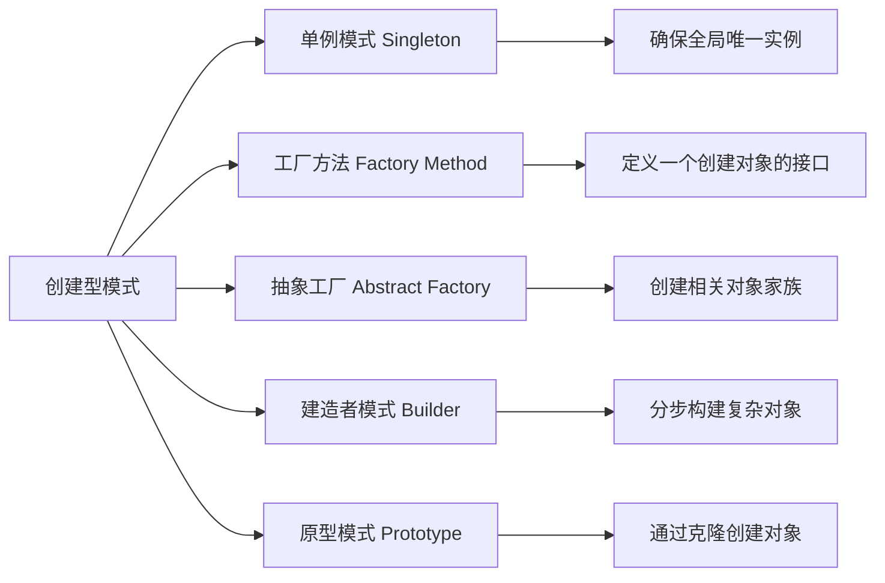

## 一句话概括

创建型设计模式是一组关于**对象实例化**的最佳实践，它们将"如何使用对象"与"如何创建对象"解耦，通过单例模式、工厂模式和建造者模式等经典方案，解决不同场景下的对象创建复杂度——从全局唯一实例控制，到复杂产品的分步装配。

## 背景与意义

在面向对象编程中，最自然的操作莫过于 `new` 一个对象。但 `new` 关键字背后隐藏着一系列问题：如果某个对象在整个应用中只应该存在一个实例，如何保证？如果对象的创建逻辑复杂且容易变化，如何让客户端代码免受影响？如果一个对象由多个部分组成且组装过程额外复杂，如何让客户端不关心装配细节？

这些问题看似简单，但在大规模前端工程中，它们会急剧放大。

以一个典型的企业级管理系统为例：系统中可能有日志记录器、缓存管理器、状态管理store、API请求客户端等全局唯一对象。如果不加控制地随处 `new`，轻则资源浪费（重复创建WebSocket连接），重则状态错乱（多个实例维护各自的缓存，导致数据不一致）。

更深层次的问题在于**变化**。当一个对象的构造方式发生变化时（例如：原本只需要一个参数的构造器现在需要三个参数），所有 `new` 这个对象的代码都需要修改。这在几十个文件范围内尚可维护，但在上百个文件中则是灾难。

创建型模式的核心价值正是在这里：**它们将"创建"抽象为第一等概念**，让对象的创建过程独立于使用过程，从而：

1. **控制实例数量**（单例模式）：确保全局只有一个实例
2. **封装创建逻辑**（工厂模式）：将 `new` 的细节隐藏在工厂函数之后
3. **分步构建复杂对象**（建造者模式）：让产品构建过程和产品表示分离
4. **原型克隆**（原型模式）：通过克隆来创建对象，避免昂贵构造过程

## 概念与定义

### 创建型模式的家族

GoF（Gang of Four）定义了五种创建型模式：



本文重点深入前端工程中最常用的三个：单例模式、工厂模式和建造者模式。

### 为什么前端更需要创建型模式？

现代前端开发已经高度组件化、状态化，对象的生命周期管理成为核心挑战：

- **状态管理Store**（Redux、Pinia、Zustand的store）本质上就是单例——整个应用只有一个store实例，所有组件共享同一个状态树。
- **组件工厂**（`createElement`、`h` 函数）是工厂模式的核心体现——传入组件配置，返回组件实例的工作由框架代为完成。
- **复杂组件配置**（日期选择器、富文本编辑器）本质上是一个分步构建过程，每一步配置一个特性，最终得到一个完整组件。

## 核心知识点拆解

### 一、单例模式：从经典实现到模块化演进

#### 经典单例：饿汉式与懒汉式

单例模式的核心约束只有一个：**一个类只有一个实例，并提供全局访问点**。

```typescript
// 饿汉式单例 - 类加载时即创建实例
class GlobalConfig {
  private static instance: GlobalConfig = new GlobalConfig();
  
  private config: Record<string, any> = {};

  private constructor() {
    // 私有构造器，防止外部直接new
    this.config = {
      apiBaseUrl: 'https://api.example.com',
      appName: 'MyApp',
      version: '1.0.0',
      debug: false,
    };
  }

  static getInstance(): GlobalConfig {
    return GlobalConfig.instance;
  }

  get(key: string): any {
    return this.config[key];
  }

  set(key: string, value: any): void {
    this.config[key] = value;
  }
}

// 使用
const config1 = GlobalConfig.getInstance();
const config2 = GlobalConfig.getInstance();
console.log(config1 === config2); // true
```

饿汉式的优点是线程安全（在JS单线程环境下这个优势不明显），缺点是程序启动就会创建实例，即使从未使用。懒汉式则在第一次调用时创建：

```typescript
// 懒汉式单例 - 首次访问时才创建
class LazyConnectionPool {
  private static instance: LazyConnectionPool | null = null;
  private connections: WebSocket[] = [];
  private maxConnections = 5;

  private constructor() {
    console.log('连接池初始化（首次调用时才会执行）');
  }

  static getInstance(): LazyConnectionPool {
    if (!LazyConnectionPool.instance) {
      LazyConnectionPool.instance = new LazyConnectionPool();
    }
    return LazyConnectionPool.instance;
  }

  acquire(): WebSocket | null {
    if (this.connections.length < this.maxConnections) {
      const ws = new WebSocket('wss://api.example.com/ws');
      this.connections.push(ws);
      return ws;
    }
    return null;
  }

  release(ws: WebSocket): void {
    const index = this.connections.indexOf(ws);
    if (index !== -1) {
      this.connections.splice(index, 1);
      ws.close();
    }
  }

  get activeConnections(): number {
    return this.connections.length;
  }
}
```

#### 前端中的单例模式变体：模块导出

在现代前端工程中，单例模式已经进化出更优雅的实现方式——利用ES Module的模块缓存机制：

```typescript
// store.ts - ES Module天然单例
import { createStore } from 'zustand/vanilla';

interface AppState {
  user: { id: string; name: string } | null;
  theme: 'light' | 'dark';
  setUser: (user: AppState['user']) => void;
  toggleTheme: () => void;
}

// 每次 import store 时，拿到的都是同一个实例
// 因为 ES Module 会缓存模块的执行结果
export const store = createStore<AppState>((set) => ({
  user: null,
  theme: 'light',
  setUser: (user) => set({ user }),
  toggleTheme: () => set((state) => ({ 
    theme: state.theme === 'light' ? 'dark' : 'light' 
  })),
}));

// 在任何文件中 import 使用
// userService.ts
import { store } from './store';

export function getCurrentUser() {
  return store.getState().user;
}

export function updateUser(user: AppState['user']) {
  store.getState().setUser(user);
}
```

这种方式不需要 `getInstance()` 方法——模块本身就是单例的工厂。这是前端工程中最推荐的单例模式实现。

#### 真实场景：全局Toast管理器

```typescript
// ToastManager.ts - 全局唯一的Toast管理器
type ToastType = 'success' | 'error' | 'warning' | 'info';

interface ToastConfig {
  message: string;
  type: ToastType;
  duration?: number;
  position?: 'top-right' | 'top-center' | 'bottom-right';
}

interface ToastItem extends ToastConfig {
  id: string;
  createdAt: number;
}

class ToastManager {
  private static instance: ToastManager;
  private container: HTMLElement | null = null;
  private toasts: ToastItem[] = [];
  private toastIdCounter = 0;

  private constructor() {
    this.createContainer();
    // 全局只监听一次事件，由框架层调度UI更新
    window.addEventListener('toast-update', () => {
      this.render();
    });
  }

  static getInstance(): ToastManager {
    if (!ToastManager.instance) {
      ToastManager.instance = new ToastManager();
    }
    return ToastManager.instance;
  }

  private createContainer(): void {
    // 避免重复创建DOM容器
    if (!this.container) {
      this.container = document.createElement('div');
      this.container.id = 'global-toast-container';
      this.container.style.cssText = `
        position: fixed;
        top: 16px;
        right: 16px;
        z-index: 9999;
        display: flex;
        flex-direction: column;
        gap: 8px;
      `;
      document.body.appendChild(this.container);
    }
  }

  private render(): void {
    if (!this.container) return;
    this.container.innerHTML = this.toasts
      .map(
        (t) => `
          <div class="toast-item toast-${t.type}" data-toast-id="${t.id}">
            <span>${t.message}</span>
            <button class="toast-close" data-id="${t.id}">&times;</button>
          </div>
        `
      )
      .join('');

    // 绑定关闭事件
    this.container.querySelectorAll('.toast-close').forEach((btn) => {
      btn.addEventListener('click', (e) => {
        const id = (e.target as HTMLElement).dataset.id!;
        this.remove(id);
      });
    });
  }

  show(config: ToastConfig): string {
    const id = `toast_${++this.toastIdCounter}`;
    const item: ToastItem = {
      ...config,
      id,
      createdAt: Date.now(),
      duration: config.duration || 3000,
    };
    this.toasts.push(item);
    window.dispatchEvent(new Event('toast-update'));

    // 自动移除
    setTimeout(() => this.remove(id), item.duration);
    return id;
  }

  remove(id: string): void {
    this.toasts = this.toasts.filter((t) => t.id !== id);
    window.dispatchEvent(new Event('toast-update'));
  }

  success(message: string, duration?: number): string {
    return this.show({ message, type: 'success', duration });
  }

  error(message: string, duration?: number): string {
    return this.show({ message, type: 'error', duration });
  }
}

// 在全局入口文件初始化后，到处使用同一个实例
export const toast = ToastManager.getInstance();
```

这个ToastManager展示了单例模式在真实项目中的价值：**DOM容器的唯一性**确保Toast通知不会重复创建DOM节点；**跨组件的共享状态**确保即使在不同组件中调用Toast，它们共享同一渲染队列和位置管理。

### 二、工厂模式：从简单工厂到抽象工厂

#### 简单工厂（工厂函数）

前端中最常见、也最简单的工厂模式就是**工厂函数**（Factory Function）：

```typescript
// 简单工厂：根据type创建不同的验证器
interface Validator {
  validate(value: any): { valid: boolean; message: string };
}

function createValidator(type: string, rules?: any): Validator {
  switch (type) {
    case 'required':
      return {
        validate(value: any) {
          const valid = value !== null && value !== undefined && value !== '';
          return {
            valid,
            message: valid ? '' : '此字段为必填项',
          };
        },
      };
    case 'email':
      return {
        validate(value: string) {
          const emailRegex = /^[^\s@]+@[^\s@]+\.[^\s@]+$/;
          const valid = emailRegex.test(value);
          return {
            valid,
            message: valid ? '' : '请输入有效的邮箱地址',
          };
        },
      };
    case 'minLength':
      return {
        validate(value: string) {
          const min = rules?.min || 6;
          const valid = value.length >= min;
          return {
            valid,
            message: valid ? '' : `最少需要${min}个字符`,
          };
        },
      };
    case 'custom':
      return {
        validate(value: any) {
          return rules?.validator(value) || { valid: true, message: '' };
        },
      };
    default:
      return {
        validate() {
          return { valid: true, message: '' };
        },
      };
  }
}

// 使用：无需关心验证器的具体实现
const requiredValidator = createValidator('required');
const emailValidator = createValidator('email');
const minLengthValidator = createValidator('minLength', { min: 8 });

console.log(requiredValidator.validate(''));      // { valid: false, message: '此字段为必填项' }
console.log(emailValidator.validate('test'));      // { valid: false, message: '请输入有效的邮箱地址' }
console.log(minLengthValidator.validate('abc'));   // { valid: false, message: '最少需要8个字符' }
```

#### 工厂方法模式（把工厂变成类）

当工厂的逻辑比较复杂，或者需要在子类中扩展时，简单工厂就升级为工厂方法模式：

```typescript
// 工厂方法模式：用子类决定创建什么
abstract class DialogFactory {
  abstract createButton(): HTMLButtonElement;
  abstract createContent(): HTMLElement;

  createDialog(title: string): HTMLElement {
    // 模板方法：确定对话框的基本结构
    const dialog = document.createElement('div');
    dialog.className = 'dialog';

    const header = document.createElement('div');
    header.className = 'dialog-header';
    header.textContent = title;

    const content = this.createContent();
    content.className = 'dialog-content';

    const footer = document.createElement('div');
    footer.className = 'dialog-footer';
    const confirmBtn = this.createButton();
    confirmBtn.textContent = '确认';
    footer.appendChild(confirmBtn);

    dialog.appendChild(header);
    dialog.appendChild(content);
    dialog.appendChild(footer);

    return dialog;
  }
}

class ConfirmDialogFactory extends DialogFactory {
  createButton(): HTMLButtonElement {
    const btn = document.createElement('button');
    btn.className = 'btn btn-primary';
    btn.addEventListener('click', () => {
      console.log('确认操作执行');
    });
    return btn;
  }

  createContent(): HTMLElement {
    const p = document.createElement('p');
    p.textContent = '请确认您的操作';
    return p;
  }
}

class FormDialogFactory extends DialogFactory {
  createButton(): HTMLButtonElement {
    const btn = document.createElement('button');
    btn.className = 'btn btn-success';
    btn.type = 'submit';
    return btn;
  }

  createContent(): HTMLElement {
    const form = document.createElement('form');
    form.innerHTML = `
      <label>用户名: <input type="text" name="username" /></label>
      <label>密码: <input type="password" name="password" /></label>
    `;
    return form;
  }
}

// 使用
const confirmDialog = new ConfirmDialogFactory().createDialog('提示');
document.body.appendChild(confirmDialog);

const formDialog = new FormDialogFactory().createDialog('登录');
document.body.appendChild(formDialog);
```

#### 前端中最经典的工厂：React的createElement

React框架中，`createElement` 就是工厂模式的极致体现——它接受类型、属性和子元素，返回一个描述UI的"虚拟DOM节点"：

```typescript
// React.createElement 的精简实现
function createElement(
  type: string | Function,
  props: Record<string, any> | null,
  ...children: any[]
): VNode {
  return {
    type,
    props: {
      ...props,
      children: children.length === 1 ? children[0] : children,
    },
    key: props?.key || null,
    ref: props?.ref || null,
  } as VNode;
}

// JSX 编译后的产物就是 createElement 调用
// <div className="container">
//   <h1>Hello</h1>
//   <p>World</p>
// </div>
//
// 编译后：
// createElement(
//   'div',
//   { className: 'container' },
//   createElement('h1', null, 'Hello'),
//   createElement('p', null, 'World')
// )
```

这是一个完美的工厂模式实践：`createElement` 封装了VNode的创建细节，开发者不需要关心VNode的具体结构，只需要声明"我要渲染什么"。

### 三、建造者模式：分步构建复杂对象

当对象的构造过程包含多个可选部分、且各部分之间有复杂的组合关系时，建造者模式就派上用场了。

#### 经典建造者模式

考虑一个搜索查询对象的构建——它可能包含关键词、筛选条件、排序、分页等多个部分：

```typescript
// 搜索查询构建器
interface SortConfig {
  field: string;
  order: 'asc' | 'desc';
}

interface FilterConfig {
  field: string;
  operator: 'eq' | 'neq' | 'gt' | 'gte' | 'lt' | 'lte' | 'in' | 'contains';
  value: any;
}

class SearchQuery {
  constructor(
    public keywords: string = '',
    public filters: FilterConfig[] = [],
    public sort: SortConfig = { field: 'createdAt', order: 'desc' },
    public page: number = 1,
    public pageSize: number = 20,
    public fields: string[] = []
  ) {}

  toQueryString(): string {
    const params = new URLSearchParams();
    if (this.keywords) params.set('q', this.keywords);
    if (this.filters.length > 0) {
      params.set('filters', JSON.stringify(this.filters));
    }
    params.set('sort', `${this.sort.field}:${this.sort.order}`);
    params.set('page', String(this.page));
    params.set('pageSize', String(this.pageSize));
    if (this.fields.length > 0) params.set('fields', this.fields.join(','));
    return params.toString();
  }
}

class SearchQueryBuilder {
  private query: SearchQuery;

  constructor() {
    this.query = new SearchQuery();
  }

  setKeywords(keywords: string): this {
    this.query.keywords = keywords;
    return this;
  }

  addFilter(field: string, operator: FilterConfig['operator'], value: any): this {
    this.query.filters.push({ field, operator, value });
    return this;
  }

  setSort(field: string, order: 'asc' | 'desc'): this {
    this.query.sort = { field, order };
    return this;
  }

  setPagination(page: number, pageSize: number): this {
    this.query.page = page;
    this.query.pageSize = pageSize;
    return this;
  }

  selectFields(...fields: string[]): this {
    this.query.fields = fields;
    return this;
  }

  build(): SearchQuery {
    return this.query;
  }
}

// 使用建造者模式创建搜索查询
const query = new SearchQueryBuilder()
  .setKeywords('前端框架')
  .addFilter('category', 'eq', 'javascript')
  .addFilter('price', 'gte', 0)
  .setSort('popularity', 'desc')
  .setPagination(1, 20)
  .selectFields('id', 'title', 'price', 'category')
  .build();

console.log(query.toQueryString());
// q=前端框架&filters=[{"field":"category","operator":"eq","value":"javascript"},{"field":"price","operator":"gte","value":0}]&sort=popularity:desc&page=1&pageSize=20&fields=id,title,price,category
```

建造者模式的核心价值体现在：**方法返回 `this`**（链式调用），每一步都是一个可选的构建步骤，客户端可以根据需要选择调用哪些方法。让对象创建变得**可读、可组合、可扩展**。

#### 真实场景：图表配置构建器

前端中建造者模式最精彩的应用之一就是图表库的配置构建：

```typescript
// 一个极简的 ECharts 配置构建器
type ChartType = 'line' | 'bar' | 'pie' | 'scatter';

interface AxisConfig {
  name: string;
  data: string[] | number[];
  type: 'value' | 'category' | 'time';
}

interface SeriesConfig {
  name: string;
  type: ChartType;
  data: number[];
  smooth?: boolean;
  stack?: string;
  areaStyle?: boolean;
}

class EChartOptionBuilder {
  private option: Record<string, any> = {};

  constructor() {
    this.option = {
      tooltip: { trigger: 'axis' },
      grid: { left: '3%', right: '4%', bottom: '3%', containLabel: true },
    };
  }

  setTitle(title: string, subTitle?: string): this {
    this.option.title = { text: title, subtext: subTitle };
    return this;
  }

  setXAxis(config: Partial<AxisConfig>): this {
    this.option.xAxis = {
      type: config.type || 'category',
      data: config.data || [],
      name: config.name || '',
      axisLabel: { rotate: (config.data?.length || 0) > 10 ? 45 : 0 },
    };
    return this;
  }

  setYAxis(name?: string): this {
    this.option.yAxis = {
      type: 'value',
      name: name || '',
    };
    return this;
  }

  addSeries(config: SeriesConfig): this {
    if (!this.option.series) this.option.series = [];
    this.option.series.push({
      name: config.name,
      type: config.type,
      data: config.data,
      smooth: config.smooth ?? false,
      stack: config.stack,
      areaStyle: config.areaStyle ? { opacity: 0.3 } : undefined,
      emphasis: {
        focus: 'series',
      },
    });
    return this;
  }

  enableDataZoom(): this {
    this.option.dataZoom = [
      { type: 'inside', start: 0, end: 100 },
      { type: 'slider', start: 0, end: 100 },
    ];
    return this;
  }

  enableLegend(position?: 'top' | 'bottom' | 'left' | 'right'): this {
    this.option.legend = { bottom: position || 'bottom' };
    return this;
  }

  build(): Record<string, any> {
    return this.option;
  }
}

// 使用示例
const months = ['1月', '2月', '3月', '4月', '5月', '6月'];

const option = new EChartOptionBuilder()
  .setTitle('季度销售趋势', '2026年1月-6月')
  .setXAxis({ data: months, type: 'category', name: '月份' })
  .setYAxis('销售额（万元）')
  .addSeries({
    name: '线上渠道',
    type: 'line',
    data: [120, 150, 180, 210, 260, 300],
    smooth: true,
    areaStyle: true,
  })
  .addSeries({
    name: '线下渠道',
    type: 'bar',
    data: [80, 95, 110, 130, 155, 180],
  })
  .enableLegend('top')
  .enableDataZoom()
  .build();

// 构建后直接传入 ECharts
// myChart.setOption(option);
```

## 实战案例

### 完整场景：构建一个可扩展的支付模块

假设我们在一个电商系统中，需要对接多种支付方式——微信支付、支付宝、银行卡支付、余额支付。每种支付方式都有不同的参数、不同的验证逻辑、不同的回调处理。让我们使用工厂模式和建造者模式来优雅地解决这个问题。

```typescript
// ========== 1. 支付抽象接口 ==========
interface PaymentRequest {
  orderId: string;
  amount: number;
  currency: string;
  description?: string;
  metadata?: Record<string, any>;
}

interface PaymentResponse {
  success: boolean;
  transactionId?: string;
  redirectUrl?: string;
  errorMessage?: string;
  raw?: any;
}

interface PaymentMethod {
  readonly name: string;
  readonly icon: string;
  validate(request: PaymentRequest): { valid: boolean; errors: string[] };
  pay(request: PaymentRequest): Promise<PaymentResponse>;
  refund(transactionId: string, amount?: number): Promise<PaymentResponse>;
}

// ========== 2. 具体的支付实现 ==========
class WeChatPay implements PaymentMethod {
  name = '微信支付';
  icon = 'wechat-icon.svg';

  validate(request: PaymentRequest): { valid: boolean; errors: string[] } {
    const errors: string[] = [];
    if (request.amount <= 0) errors.push('支付金额必须大于0');
    if (request.amount > 50000) errors.push('微信支付单笔限额50000元');
    return { valid: errors.length === 0, errors };
  }

  async pay(request: PaymentRequest): Promise<PaymentResponse> {
    try {
      // 模拟微信支付SDK调用
      const result = await this.callWeChatSDK(request);
      return {
        success: true,
        transactionId: result.transactionId,
        redirectUrl: result.jsapiUrl,
      };
    } catch (error: any) {
      return {
        success: false,
        errorMessage: error.message || '微信支付失败',
      };
    }
  }

  private async callWeChatSDK(request: PaymentRequest): Promise<any> {
    // 实际项目中这里是真实的微信支付SDK调用
    return new Promise((resolve) => {
      setTimeout(() => {
        resolve({
          transactionId: `WX${Date.now()}`,
          jsapiUrl: `https://wx.tenpay.com/pay?order=${request.orderId}`,
        });
      }, 500);
    });
  }

  async refund(transactionId: string, amount?: number): Promise<PaymentResponse> {
    console.log(`微信退款：${transactionId}, 金额: ${amount || '全额'}`);
    return { success: true, transactionId: `REF${Date.now()}` };
  }
}

class Alipay implements PaymentMethod {
  name = '支付宝';
  icon = 'alipay-icon.svg';

  validate(request: PaymentRequest): { valid: boolean; errors: string[] } {
    const errors: string[] = [];
    if (request.amount <= 0) errors.push('支付金额必须大于0');
    if (request.currency !== 'CNY') errors.push('支付宝仅支持人民币');
    return { valid: errors.length === 0, errors };
  }

  async pay(request: PaymentRequest): Promise<PaymentResponse> {
    try {
      const result = await this.callAlipaySDK(request);
      return { success: true, transactionId: result.tradeNo, redirectUrl: result.payUrl };
    } catch (error: any) {
      return { success: false, errorMessage: error.message || '支付宝支付失败' };
    }
  }

  private async callAlipaySDK(request: PaymentRequest): Promise<any> {
    return new Promise((resolve) => {
      setTimeout(() => {
        resolve({
          tradeNo: `ALIPAY${Date.now()}`,
          payUrl: `https://openapi.alipay.com/gateway.do?order=${request.orderId}`,
        });
      }, 500);
    });
  }

  async refund(transactionId: string, amount?: number): Promise<PaymentResponse> {
    return { success: true, transactionId: `ALIREF${Date.now()}` };
  }
}

class BalancePay implements PaymentMethod {
  name = '余额支付';
  icon = 'balance-icon.svg';
  private userBalance = 10000; // 模拟用户余额

  validate(request: PaymentRequest): { valid: boolean; errors: string[] } {
    const errors: string[] = [];
    if (request.amount <= 0) errors.push('支付金额必须大于0');
    if (request.amount > this.userBalance) errors.push('余额不足');
    return { valid: errors.length === 0, errors };
  }

  async pay(request: PaymentRequest): Promise<PaymentResponse> {
    if (this.userBalance < request.amount) {
      return { success: false, errorMessage: '余额不足' };
    }
    this.userBalance -= request.amount;
    return { success: true, transactionId: `BAL${Date.now()}` };
  }

  async refund(transactionId: string, amount?: number): Promise<PaymentResponse> {
    this.userBalance += amount || 0;
    return { success: true, transactionId: `BALREF${Date.now()}` };
  }
}

// ========== 3. 支付工厂 ==========
class PaymentFactory {
  private static paymentMethods: Map<string, PaymentMethod> = new Map();

  static register(type: string, method: PaymentMethod): void {
    PaymentFactory.paymentMethods.set(type, method);
  }

  static create(type: string): PaymentMethod {
    const method = PaymentFactory.paymentMethods.get(type);
    if (!method) {
      throw new Error(`不支持的支付方式: ${type}`);
    }
    return method;
  }

  static getAllTypes(): string[] {
    return Array.from(PaymentFactory.paymentMethods.keys());
  }
}

// 注册支付方式
PaymentFactory.register('wechat', new WeChatPay());
PaymentFactory.register('alipay', new Alipay());
PaymentFactory.register('balance', new BalancePay());

// ========== 4. 支付请求构建器 ==========
class PaymentRequestBuilder {
  private request: Partial<PaymentRequest> = {};

  setOrder(orderId: string): this {
    this.request.orderId = orderId;
    return this;
  }

  setAmount(amount: number, currency: string = 'CNY'): this {
    this.request.amount = amount;
    this.request.currency = currency;
    return this;
  }

  setDescription(desc: string): this {
    this.request.description = desc;
    return this;
  }

  setMetadata(meta: Record<string, any>): this {
    this.request.metadata = meta;
    return this;
  }

  build(): PaymentRequest {
    if (!this.request.orderId) throw new Error('订单ID不能为空');
    if (!this.request.amount || this.request.amount <= 0) throw new Error('支付金额无效');
    return this.request as PaymentRequest;
  }
}

// ========== 5. 支付服务（客户端使用） ==========
class PaymentService {
  async checkout(params: {
    paymentType: string;
    orderId: string;
    amount: number;
    description?: string;
  }): Promise<PaymentResponse> {
    // 通过工厂获取支付方式
    const method = PaymentFactory.create(params.paymentType);

    // 通过建造者构建支付请求
    const request = new PaymentRequestBuilder()
      .setOrder(params.orderId)
      .setAmount(params.amount)
      .setDescription(params.description || '')
      .build();

    // 验证支付请求
    const validation = method.validate(request);
    if (!validation.valid) {
      return {
        success: false,
        errorMessage: validation.errors.join('; '),
      };
    }

    // 执行支付
    return method.pay(request);
  }

  getAvailablePaymentMethods(): { name: string; icon: string; type: string }[] {
    return PaymentFactory.getAllTypes().map((type) => {
      const method = PaymentFactory.create(type);
      return { name: method.name, icon: method.icon, type };
    });
  }
}

// ========== 使用示例 ==========
async function main() {
  const paymentService = new PaymentService();

  // 获取可用支付方式
  const methods = paymentService.getAvailablePaymentMethods();
  console.log('可用支付方式:', methods);
  // [{ name: '微信支付', icon: 'wechat-icon.svg', type: 'wechat' }, ...]

  // 使用微信支付
  const result = await paymentService.checkout({
    paymentType: 'wechat',
    orderId: 'ORDER_20260829001',
    amount: 99.99,
    description: '购买前端架构课程',
  });

  if (result.success) {
    console.log(`支付成功！交易ID: ${result.transactionId}`);
    if (result.redirectUrl) {
      // 跳转到支付页面
      window.location.href = result.redirectUrl;
    }
  } else {
    console.error(`支付失败: ${result.errorMessage}`);
  }
}

main();
```

这个实战案例展示了两种创建型模式的协同工作：

- **工厂模式** (`PaymentFactory`)：封装了支付方式的创建逻辑，客户端不需要知道 `WeChatPay`、`Alipay` 等具体类的存在。新增支付方式时，只需新写一个类并向工厂注册，无需修改 `PaymentService`。

- **建造者模式** (`PaymentRequestBuilder`)：`PaymentRequest` 的参数组合并不固定——用户可以选择只传必要参数，也可以附加元数据。建造者模式让参数构建过程透明且可读。

两者结合，`PaymentService.checkout` 方法只有不到10行有效代码，却支持了任意多的支付方式扩展。

## 底层原理

### 单例模式的"副作用"管理

单例模式经常被诟病的一个问题就是**隐藏的耦合**。当一个全局单例被多个模块引用时，模块之间的依赖关系变得隐式而难以追踪。这实际上是对"全局变量"问题的重新包装。

从底层来看，单例本质上解决的是**状态共享**与**资源复用**的矛盾：

- **共享状态**：多个模块需要访问同一份数据（如用户登录状态）
- **资源复用**：创建和销毁某个资源的成本很高（如WebSocket连接、索引数据库连接）

解决方案的核心是不让单例成为"全局变量"，而是让它成为**显式依赖**：

```typescript
// 不推荐：隐式依赖全局单例
function getUserName() {
  return GlobalStore.getInstance().user.name;
}

// 推荐：通过依赖注入显式声明
function getUserName(store: GlobalStore) {
  return store.user.name;
}
```

### 工厂模式与多态的关系

工厂模式的底层是**多态**——通过统一的接口来操作不同子类的实例。当客户端调用 `PaymentFactory.create('wechat').pay(request)` 时，它根本不知道 `WeChatPay` 类的存在，但依然能正确调用 `pay()` 方法。

这是面向接口编程的核心体现：**客户端面向 `PaymentMethod` 接口编程，而不是面向具体实现编程**。

接口定义了"契约"，工厂封装了"选择"，多态实现了"执行"。这三位一体才是工厂模式真正的威力。

### 建造者模式的"分步构建"优化

建造者模式在底层解决的，是**构造函数的"伸缩性问题"**（Telescoping Constructor Problem）。当一个类的构造参数超过4个，尤其是当许多参数可选时，构造函数会变得难以使用和维护：

```typescript
// 伸缩构造函数反模式
class Pizza {
  constructor(size: string, cheese?: boolean, pepperoni?: boolean, 
              mushrooms?: boolean, onions?: boolean, bacon?: boolean,
              extraCheese?: boolean, stuffedCrust?: boolean) {}
}

// 客户端代码难以阅读
const pizza = new Pizza('large', true, true, false, true, false, true, false);
```

建造者模式通过将参数分到不同的方法中，解决了这个问题。其底层原理是**变化点分离**——把"对象的构建步骤"和"对象的表示"分离，让同一个构建过程可以产生不同表示。

## 高频面试题解析

### Q1: 单例模式在前端中有什么典型应用？ES Module是不是天然的方案？

**最佳回答**：
前端中单例模式的典型应用场景：

1. **状态管理Store**：Redux、Pinia、Zustand的全局Store，在整个应用中只有一个实例
2. **路由实例**：React Router、Vue Router的全局router对象
3. **日志/监控SDK**：Sentry、Google Analytics等埋点SDK，需要确保全局只有一个实例
4. **WebSocket管理器**：需要维护连接池的全局唯一性
5. **主题/配置系统**：全局的配置对象，所有模块共享同一份配置

ES Module的模块缓存机制确实是"天然的"单例方案。因为ES Module规范明确要求：同一个模块在同一个运行时中只执行一次，每个import都拿到同一个引用。

但这种"天然单例"也有局限：
- 无法进行**懒加载**——模块一旦被import就会执行（除非用动态import `import()`）
- 无法进行**销毁**——模块的执行结果无法被清理
- **测试困难**——模块级状态在测试间无法重置

因此，模块导出单例适合"工具类"（工具函数集合、常量等），而"有状态单例"（Store、服务类）更适合用类单例 + 依赖注入的方式来实现。

### Q2: 简单工厂模式和工厂方法模式有什么区别？

**最佳回答**：

| 对比维度 | 简单工厂 | 工厂方法 |
|---------|---------|---------|
| 实现方式 | 一个函数/方法，用switch/if创建对象 | 抽象类定义工厂接口，子类实现具体创建 |
| 扩展方式 | 修改工厂函数（违反开闭原则） | 新增子类（符合开闭原则） |
| 复杂度 | 低，适合产品种类少的场景 | 高，适合产品种类多且需要扩展的场景 |
| 适用场景 | 验证器工厂、API错误处理工厂 | 跨平台UI组件工厂、数据导出工厂 |

简单工厂适合"产品类型固定、扩展不频繁"的场景；工厂方法适合"需要预留扩展点"的场景。

一个实用的判断标准：**当你发现自己需要经常修改工厂函数体时，就该升级为工厂方法模式了**。

### Q3: 建造者模式和工厂模式的区别是什么？什么时候用建造者？

**最佳回答**：

两者的核心区别在于**"构建的关注点"**：

- **工厂模式**关注的是"根据条件选择创建哪种产品"，屏蔽了实例化逻辑
- **建造者模式**关注的是"如何一步步构建一个复杂产品"，屏蔽了装配细节

什么时候应该用建造者模式？

1. **产品构造参数太多**（超过4个参数）且大部分可选
2. **构造过程需要分步骤**，且不同步骤之间有顺序依赖
3. **同一个构造过程可以产生不同的产品表示**（比如同一个建造者可以构建HTML表单也可以构建JSON Schema）
4. **需要一个流畅的API**来提升代码的可读性

一个对比的例子：创建MySQL数据库连接用工厂（根据配置创建不同类型的连接池），创建一份完整的报表配置用建造者（标题、数据源、图表、筛选器、权限，每个部分都是单独配置）。

### Q4: 在TypeScript中如何安全地实现私有构造函数？

**最佳回答**：

TypeScript的`private constructor()`只会在编译时检查，运行时依然可以通过`(Class as any).constructor()`等方式绕过。如果需要真正的"运行时私有化"，有几种方案：

方案一：在构造函数中检查实例来源：
```typescript
class Singleton {
  private static instance: Singleton;
  private static locked = true;

  private constructor() {
    // 运行时保护
    if (!Singleton.locked) {
      throw new Error('请使用 getInstance() 创建实例');
    }
  }

  static getInstance(): Singleton {
    if (!Singleton.instance) {
      Singleton.locked = false;
      Singleton.instance = new Singleton();
      Singleton.locked = true;
    }
    return Singleton.instance;
  }
}
```

方案二：使用闭包（完全无法外部访问）：
```typescript
const createSingleton = <T>(factory: () => T) => {
  let instance: T | null = null;
  return () => {
    if (!instance) {
      instance = factory();
    }
    return instance;
  };
};

const getStore = createSingleton(() => ({
  state: {} as Record<string, any>,
  set: function(key: string, value: any) { this.state[key] = value; },
}));

const store1 = getStore();
const store2 = getStore();
console.log(store1 === store2); // true
```

一般来说，**闭包方案是更安全的**，因为它在语言层面就保证了无法绕过。

### Q5: 创建型模式和"DI（依赖注入）"是什么关系？

**最佳回答**：
依赖注入（Dependency Injection）和创建型模式解决的是同一个问题的两个侧面——**对象创建与管理的自动化**。

关系可以理解为：
- **创建型模式**是"手动挡"：开发者手动控制对象的创建策略
- **依赖注入**是"自动挡"：通过DI容器自动管理对象的创建和生命周期

```typescript
// 创建型模式视角：手动解析依赖
class UserService {
  private api: ApiClient;
  private store: Store;

  constructor() {
    this.api = ApiClientFactory.create();
    this.store = StoreFactory.create();
  }
}

// DI视角：自动注入依赖
class UserService {
  constructor(
    private api: ApiClient,    // 由DI容器注入
    private store: Store       // 由DI容器注入
  ) {}
}
```

在现代前端框架中，Vue的`provide/inject`和React的`Context`都是轻量级的DI实现，它们通常与单例模式配合使用：服务类以单例形式注册到DI容器，容器确保每次注入都拿到同一个实例。

选择建议：**中小项目用创建型模式就够了，大型项目（模块超过50个）建议引入DI容器**。

## 总结与扩展

创建型模式是设计模式中实践密度最高的类别，因为它们直接解决了开发者每天都会遇到的"new对象"问题。

本文的核心要点：

1. **单例模式的本质是全局唯一性控制**。放弃ES Module的模块机制？还是用类的私有构造器？选择取决于是否需要懒加载、销毁和测试支持。

2. **工厂模式的核心是"选择"的封装**。简单工厂适合变化少的场景，工厂方法适合需要预留扩展点的场景。在前端，`createElement`、`h()` 函数都是工厂模式的经典实践。

3. **建造者模式的灵魂是链式构建**。当对象的构造参数超过4个、有大量可选参数，或多步构造之间有顺序依赖时，建造者模式是必然选择。它让代码从"难以理解的参数序列"变成"自描述的方法链"。

4. **三种模式可以协同使用**：建造者构建复杂请求对象，工厂选择执行策略，单例确保服务管理器唯一。

创建型模式的下一个演化方向，是**声明式创建**——通过配置而非代码来描述对象的创建过程。这已经在React的配置化组件、JSON Schema表单、低代码平台中广泛应用。理解创建型模式的本质，就是在理解"如何在变化的业务中，让对象的创建保持稳定可控"。
