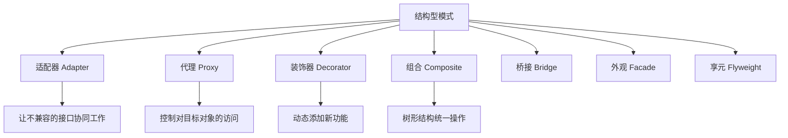

## 一句话概括

结构型设计模式关注**类与对象的组合方式**，通过适配器、代理、装饰器等模式，在不修改现有代码的前提下扩展系统功能、整合异构接口、控制对象访问，让代码的"骨架"既灵活又稳固。

## 背景与意义

软件系统的演化过程中，一个不可避免的现象是"不兼容"——两个设计良好的模块，拼在一起可能无法直接工作。这可能是因为接口签名不一致、协议不同、数据格式不同，或者只是因为它们来自不同的开发阶段、不同的团队甚至不同的公共库。

结构型模式正是为了解决这个问题而生的。它们不改变模块的内部，而是通过调整模块间的"连接方式"来让系统协同工作。

以一个典型的微前端项目为例：团队A维护订单模块，使用Vue 2和Element UI；团队B维护用户模块，使用React和Ant Design；团队C维护一个通用的数据可视化组件库，基于D3.js。这三个模块需要在一个壳子应用中共存——理想情况是它们彼此独立、互不干扰，但现实是它们需要共享全局状态、统一错误处理、保持一致的UI风格。

如果直接修改团队A和团队B的代码，成本极高且容易引入bug。结构型模式的思路是：**在模块之间增加一层"转换"或"代理"**，让各方不需要修改自身代码，就能协同工作。

更深层次的意义在于：**结构型模式体现了软件设计的核心原则——"对扩展开放，对修改关闭"（开闭原则）**。

- **适配器模式**：不必修改现有的数据源，就能让它适配新的接口
- **代理模式**：不必修改原有的业务对象，就能控制对它的访问
- **装饰器模式**：不必修改核心组件，就能动态地扩展它的功能
- **组合模式**：不必区分"单个对象"和"对象集合"，就能统一操作

## 概念与定义

### 结构型模式家族



本文聚焦前端工程中最常用的四种：适配器、代理、装饰器和组合，其余模式作为扩展提及。

### 为什么前端中结构型模式如此重要？

现代前端应用的复杂性，本质上源于**"集成"**：集成不同的UI框架、集成不同的数据源、集成不同的状态管理模式、集成不同的第三方服务。每一次"集成"都是一次结构与结构的碰撞，需要用结构型模式来"缓冲"。

更具体地说：

- **组件化架构**天然适配**组合模式**——单个基础组件和包含多个组件的容器，对外暴露相同的行为
- **数据流管理**中，**代理模式**让状态管理得以实现"不可变更新"——通过代理拦截状态变化，而不是直接修改状态
- **高阶组件（HOC）** 是**装饰器模式**的React实现——包裹一个组件来扩展其功能
- **跨框架集成**中，**适配器模式**让Vue组件包在React壳子中照常工作

## 核心知识点拆解

### 一、适配器模式：让不兼容的接口协同工作

#### 经典适配器

适配器模式是最直觉也最有用的结构型模式：当两个模块的接口不一致时，在它们之间插入一个"适配器"进行转换。

```typescript
// 场景：老系统的XML数据需要适配新系统的JSON接口

// ===== 老系统：返回XML格式数据 =====
interface LegacyDataProvider {
  fetchData(): string; // 返回XML字符串
}

class LegacyUserService implements LegacyDataProvider {
  fetchData(): string {
    return `
      <users>
        <user id="1">
          <name>张三</name>
          <email>zhangsan@example.com</email>
        </user>
        <user id="2">
          <name>李四</name>
          <email>lisi@example.com</email>
        </user>
      </users>
    `;
  }
}

// ===== 新系统：期望JSON格式数据 =====
interface User {
  id: number;
  name: string;
  email: string;
}

interface ModernDataProvider {
  getUsers(): Promise<User[]>;
}

// ===== 适配器：将老系统适配到新接口 =====
class XMLToJSONAdapter implements ModernDataProvider {
  constructor(private legacyProvider: LegacyDataProvider) {}

  async getUsers(): Promise<User[]> {
    const xmlString = this.legacyProvider.fetchData();
    return this.parseXMLToUsers(xmlString);
  }

  private parseXMLToUsers(xml: string): User[] {
    // 简易XML解析（生产环境请使用DOMParser）
    const users: User[] = [];
    const userRegex = /<user id="(\d+)">([\s\S]*?)<\/user>/g;
    let match;

    while ((match = userRegex.exec(xml)) !== null) {
      const id = parseInt(match[1]);
      const content = match[2];
      const name = content.match(/<name>(.*?)<\/name>/)![1];
      const email = content.match(/<email>(.*?)<\/email>/)![1];
      users.push({ id, name, email });
    }

    return users;
  }
}

// ===== 使用 =====
// 老系统代码无需修改，也不需要知道新系统的存在
const legacyService = new LegacyUserService();
const adapter = new XMLToJSONAdapter(legacyService);

// 新系统通过适配器获取数据，仿佛老系统本身就支持JSON格式
adapter.getUsers().then((users) => {
  console.log(users);
  // [{ id: 1, name: '张三', email: 'zhangsan@example.com' }, ...]
});
```

适配器模式的核心价值在于：**它架起了一座桥，让两个独立发展、互不了解的模块可以对话**。

#### 前端真实场景：第三方库的Promise化

许多传统的Node.js库使用回调风格（Error-First Callback），但现代项目更倾向Promise或async/await。适配器模式在这里大显身手：

```typescript
// 传统回调风格的路由SDK
interface LegacyRouter {
  navigate(path: string, callback: (error: Error | null, data?: any) => void): void;
  getCurrentRoute(callback: (error: Error | null, route?: string) => void): void;
}

// 适配为Promise风格
class RouterAdapter {
  constructor(private legacyRouter: LegacyRouter) {}

  navigate(path: string): Promise<any> {
    return new Promise((resolve, reject) => {
      this.legacyRouter.navigate(path, (error, data) => {
        if (error) reject(error);
        else resolve(data);
      });
    });
  }

  getCurrentRoute(): Promise<string> {
    return new Promise((resolve, reject) => {
      this.legacyRouter.getCurrentRoute((error, route) => {
        if (error) reject(error);
        else resolve(route!);
      });
    });
  }
}

// 使用
const legacyRouter: LegacyRouter = getLegacyRouterInstance();
const modernRouter = new RouterAdapter(legacyRouter);

async function init() {
  const currentRoute = await modernRouter.getCurrentRoute();
  console.log('当前路由:', currentRoute);
}
```

#### 另一种形式：对象适配器 vs 类适配器

TypeScript/JavaScript中没有真正的"类适配器"（即多继承适配），但可以通过对象组合实现：

```typescript
// 对象适配器（推荐）
class ApiAdapter {
  constructor(private legacyApi: LegacyApi) {}
  
  async fetch(path: string): Promise<any> {
    const response = await this.legacyApi.getRequest(path);
    return this.transformResponse(response);
  }
}

// "类适配器"在JS中通过继承模拟（不推荐，因为破坏封装）
class ApiAdapterViaExtends extends LegacyApi {
  async fetch(path: string): Promise<any> {
    const response = await super.getRequest(path);
    return this.transformResponse(response);
  }
}
```

**对象适配器优于"类适配器"**，因为组合比继承更灵活——你可以适配任意实例，而不局限于某个特定子类。

### 二、代理模式：控制对目标的访问

代理模式和适配器模式在外观上有些相似，但意图完全不同：适配器是为了"接口转换"，代理是为了"控制访问"。

#### 虚拟代理：延迟加载

最典型的代理模式应用——图片懒加载。在真正需要展示图片之前，先用一个占位代理"蒙混过关"：

```typescript
// 真实图片加载器
interface ImageLoader {
  display(): void;
}

class RealImage implements ImageLoader {
  private src: string;

  constructor(src: string) {
    this.src = src;
    this.loadFromDisk();
  }

  private loadFromDisk(): void {
    console.log(`[加载] 从服务器加载图片: ${this.src}`);
    // 模拟加载耗时
    const start = Date.now();
    while (Date.now() - start < 2000) {} // 2秒同步阻塞模拟大图加载
    console.log(`[完成] 图片加载完成: ${this.src}`);
  }

  display(): void {
    console.log(`[显示] 展示图片: ${this.src}`);
  }
}

// 代理：延迟加载
class ProxyImage implements ImageLoader {
  private realImage: RealImage | null = null;
  private src: string;

  constructor(src: string) {
    this.src = src;
  }

  display(): void {
    if (!this.realImage) {
      // 第一次调用时创建真实对象（触发加载）
      console.log(`[代理] 首次访问，开始加载图片: ${this.src}`);
      this.realImage = new RealImage(this.src);
    } else {
      console.log(`[代理] 图片已缓存，直接显示`);
    }
    this.realImage.display();
  }
}

// 使用：代理的使用方式与真实对象完全一致
const image1 = new ProxyImage('https://example.com/large-image-1.jpg');
const image2 = new ProxyImage('https://example.com/large-image-2.jpg');

// 页面初始化时只创建代理，不加载图片
// 用户滚动到图片位置时才真正加载
image1.display(); // 这里才触发实际加载
// [代理] 首次访问，开始加载图片
// [加载] 从服务器加载图片
// [完成] 图片加载完成
// [显示] 展示图片

// 第二次访问直接使用缓存
image1.display();
// [代理] 图片已缓存，直接显示
// [显示] 展示图片
```

#### 保护代理：权限控制

```typescript
// 敏感操作：管理员面板
interface AdminPanel {
  viewLogs(): string[];
  deleteUser(userId: string): void;
  updateConfig(config: Record<string, any>): void;
}

class RealAdminPanel implements AdminPanel {
  viewLogs(): string[] {
    return [
      '[2026-08-30 10:00] 用户张三登录',
      '[2026-08-30 10:05] 用户李四修改密码',
      '[2026-08-30 10:10] 管理员王五删除用户test_user',
    ];
  }

  deleteUser(userId: string): void {
    console.log(`已删除用户: ${userId}`);
  }

  updateConfig(config: Record<string, any>): void {
    console.log(`配置已更新:`, config);
  }
}

// 保护代理
class AdminPanelProxy implements AdminPanel {
  private realPanel: RealAdminPanel;

  constructor(private currentUser: { role: string; username: string }) {
    this.realPanel = new RealAdminPanel();
  }

  private checkPermission(operation: string): void {
    if (this.currentUser.role !== 'admin') {
      throw new Error(`权限不足：用户"${this.currentUser.username}"没有"${operation}"权限`);
    }
  }

  viewLogs(): string[] {
    this.checkPermission('查看日志');
    return this.realPanel.viewLogs();
  }

  deleteUser(userId: string): void {
    this.checkPermission('删除用户');
    console.log(`[审计] ${this.currentUser.username} 执行了删除操作: ${userId}`);
    return this.realPanel.deleteUser(userId);
  }

  updateConfig(config: Record<string, any>): void {
    this.checkPermission('更新配置');
    return this.realPanel.updateConfig(config);
  }
}

// 使用
const adminPanel = new AdminPanelProxy({ role: 'admin', username: 'admin_ht' });
adminPanel.deleteUser('user_123'); // 正常执行

const guestPanel = new AdminPanelProxy({ role: 'guest', username: 'visitor' });
guestPanel.viewLogs(); // 抛出错误：权限不足
```

#### 远程代理：接口调用封装

前端中最常见的代理模式——API请求代理：

```typescript
// API代理：提供统一错误处理、重试、日志
interface ApiService {
  get<T>(path: string): Promise<T>;
  post<T>(path: string, body: any): Promise<T>;
  put<T>(path: string, body: any): Promise<T>;
  delete<T>(path: string): Promise<T>;
}

class RealApiService implements ApiService {
  private baseUrl: string;

  constructor(baseUrl: string) {
    this.baseUrl = baseUrl;
  }

  async get<T>(path: string): Promise<T> {
    const response = await fetch(`${this.baseUrl}${path}`);
    return response.json();
  }

  async post<T>(path: string, body: any): Promise<T> {
    const response = await fetch(`${this.baseUrl}${path}`, {
      method: 'POST',
      headers: { 'Content-Type': 'application/json' },
      body: JSON.stringify(body),
    });
    return response.json();
  }

  async put<T>(path: string, body: any): Promise<T> {
    const response = await fetch(`${this.baseUrl}${path}`, {
      method: 'PUT',
      headers: { 'Content-Type': 'application/json' },
      body: JSON.stringify(body),
    });
    return response.json();
  }

  async delete<T>(path: string): Promise<T> {
    const response = await fetch(`${this.baseUrl}${path}`, { method: 'DELETE' });
    return response.json();
  }
}

// 代理层：添加重试、日志、统一错误处理
class ApiProxy implements ApiService {
  private realService: RealApiService;
  private maxRetries = 3;

  constructor(baseUrl: string) {
    this.realService = new RealApiService(baseUrl);
    this.setupAuthInterceptor();
  }

  private setupAuthInterceptor(): void {
    // 每个请求前自动附加认证token
    const originalFetch = window.fetch;
    window.fetch = (input, init = {}) => {
      const token = localStorage.getItem('auth_token');
      if (token) {
        init.headers = {
          ...init.headers,
          'Authorization': `Bearer ${token}`,
        };
      }
      return originalFetch(input, init);
    };
  }

  private async withRetry<T>(operation: () => Promise<T>, path: string): Promise<T> {
    let lastError: Error | null = null;

    for (let attempt = 1; attempt <= this.maxRetries; attempt++) {
      try {
        const startTime = performance.now();
        const result = await operation();
        const duration = performance.now() - startTime;

        // 日志记录
        console.log(`[API] ${path} 请求成功 (尝试${attempt}次, 耗时${duration.toFixed(0)}ms)`);

        return result;
      } catch (error: any) {
        lastError = error;
        console.warn(`[API] ${path} 请求失败 (尝试${attempt}/${this.maxRetries}):`, error.message);

        // 仅对5xx错误进行重试
        if (error.status && error.status < 500) {
          throw error; // 4xx错误不重试
        }

        if (attempt < this.maxRetries) {
          // 指数退避
          await new Promise((r) => setTimeout(r, 1000 * Math.pow(2, attempt)));
        }
      }
    }

    throw lastError || new Error('请求失败');
  }

  async get<T>(path: string): Promise<T> {
    return this.withRetry(() => this.realService.get<T>(path), path);
  }

  async post<T>(path: string, body: any): Promise<T> {
    return this.withRetry(() => this.realService.post<T>(path, body), path);
  }

  async put<T>(path: string, body: any): Promise<T> {
    return this.withRetry(() => this.realService.put<T>(path, body), path);
  }

  async delete<T>(path: string): Promise<T> {
    return this.withRetry(() => this.realService.delete<T>(path), path);
  }
}

// 使用
const api = new ApiProxy('https://api.example.com/v2');

// 客户端只关心业务逻辑，无需关心重试、日志、token注入
async function loadUserData() {
  try {
    const user = await api.get<User>('/users/me');
    const orders = await api.get<Order[]>('/users/me/orders');
    return { user, orders };
  } catch (error) {
    console.error('加载用户数据失败:', error);
    showErrorMessage('数据加载失败，请检查网络后重试');
  }
}
```

这个API代理展示了代理模式的强大：**在不改动 `RealApiService` 一行代码的前提下，为所有请求添加了重试、日志、认证Token自动注入**。

### 三、装饰器模式：动态扩展功能

装饰器模式和代理模式结构上很像，但意图完全不同：代理控制访问，装饰器**增强功能**。

#### 经典装饰器：数据验证和缓存

```typescript
// 基础数据服务接口
interface DataService {
  fetchData(id: string): Promise<any>;
}

// 真实的数据服务
class RealDataService implements DataService {
  async fetchData(id: string): Promise<any> {
    console.log(`[数据库] 查询数据: ${id}`);
    // 模拟数据库查询
    return { id, timestamp: new Date(), value: Math.random() };
  }
}

// 装饰器基类
abstract class DataServiceDecorator implements DataService {
  constructor(protected service: DataService) {}

  abstract fetchData(id: string): Promise<any>;
}

// 具体装饰器1：添加缓存
class CacheDecorator extends DataServiceDecorator {
  private cache = new Map<string, { data: any; expiresAt: number }>();
  private ttl = 60000; // 60秒缓存

  async fetchData(id: string): Promise<any> {
    const cached = this.cache.get(id);
    if (cached && cached.expiresAt > Date.now()) {
      console.log(`[缓存] 命中: ${id}`);
      return cached.data;
    }

    const data = await this.service.fetchData(id);
    this.cache.set(id, { data, expiresAt: Date.now() + this.ttl });
    return data;
  }

  clearCache(): void {
    this.cache.clear();
  }
}

// 具体装饰器2：添加日志
class LoggingDecorator extends DataServiceDecorator {
  async fetchData(id: string): Promise<any> {
    const startTime = performance.now();
    console.log(`[日志] 开始请求: ${id}`);

    try {
      const data = await this.service.fetchData(id);
      const duration = performance.now() - startTime;
      console.log(`[日志] 请求完成: ${id} (耗时: ${duration.toFixed(0)}ms)`);
      return data;
    } catch (error) {
      console.error(`[日志] 请求失败: ${id}`, error);
      throw error;
    }
  }
}

// 具体装饰器3：验证数据完整性
class ValidationDecorator extends DataServiceDecorator {
  async fetchData(id: string): Promise<any> {
    const data = await this.service.fetchData(id);

    if (!data || !data.id) {
      throw new Error(`数据验证失败: id为${id}的数据格式不正确`);
    }

    return data;
  }
}

// 使用装饰器组合
const baseService = new RealDataService();
const cachedService = new CacheDecorator(baseService);
const loggedService = new LoggingDecorator(cachedService);
const validatedService = new ValidationDecorator(loggedService);

// 现在 validatedService 同时拥有缓存、日志、验证三种能力
async function demo() {
  // 第一次调用：会查询数据库+记录日志+验证
  const data1 = await validatedService.fetchData('user_001');
  console.log('数据1:', data1);

  // 第二次调用：从缓存读取，但依然有日志
  const data2 = await validatedService.fetchData('user_001');
  console.log('数据2:', data2);
}

demo();
// [日志] 开始请求: user_001
// [数据库] 查询数据: user_001
// [日志] 请求完成: user_001 (耗时: 5ms)
// 数据1: { id: 'user_001', timestamp: ..., value: 0.123 }
// [日志] 开始请求: user_001
// [缓存] 命中: user_001
// [日志] 请求完成: user_001 (耗时: 1ms)
// 数据2: { id: 'user_001', timestamp: ..., value: 0.123 }
```

#### React中的装饰器模式：高阶组件（HOC）

```typescript
import React, { ComponentType, useEffect, useState } from 'react';

// 高阶组件：本质上就是装饰器模式
interface WithLoaderProps {
  loading: boolean;
}

function withLoader<P extends object>(
  WrappedComponent: ComponentType<P>,
  fetchData: () => Promise<any>
): ComponentType<P & WithLoaderProps> {
  return function EnhancedComponent(props: P & WithLoaderProps) {
    const [loading, setLoading] = useState(false);
    const [error, setError] = useState<Error | null>(null);
    const [data, setData] = useState<any>(null);

    useEffect(() => {
      setLoading(true);
      fetchData()
        .then((result) => {
          setData(result);
          setLoading(false);
        })
        .catch((err) => {
          setError(err);
          setLoading(false);
        });
    }, []);

    if (loading) {
      return <div className="loading-spinner">加载中...</div>;
    }

    if (error) {
      return <div className="error-message">加载失败: {error.message}</div>;
    }

    return <WrappedComponent {...props} data={data} />;
  };
}

// ===== 使用 =====
interface UserProfileProps {
  data: { id: string; name: string } | null;
}

function UserProfile({ data }: UserProfileProps) {
  if (!data) return null;
  return (
    <div className="user-profile">
      <h2>{data.name}</h2>
      <p>用户ID: {data.id}</p>
    </div>
  );
}

// 装饰：为UserProfile添加数据加载能力
const UserProfileWithData = withLoader(
  UserProfile,
  () => fetch('/api/users/me').then((res) => res.json())
);

// 使用：UserProfileWithData 在渲染时会自动加载数据
// <UserProfileWithData /> 
```

从底层来看，高阶组件（HOC）模式的本质就是装饰器模式——"装饰"一个组件，返回一个增强后的组件，而不修改原组件本身。

## 实战案例

### 完整场景：微前端中的跨应用模块集成

假设我们在做一个微前端项目，主应用中使用Vue 3，但需要集成一个由React团队开发的"数据分析看板"模块。这两个技术栈的差异，加上不同团队开发的接口不兼容性，需要一个系统的结构型方案来解决。

```typescript
// ========== 场景：在主应用中使用React组件 ==========

// ===== 1. 适配器：让React组件适应Vue环境 =====
import { defineComponent, h, ref, onMounted, onUnmounted } from 'vue';
import React from 'react';
import { createRoot, Root } from 'react-dom/client';

// Vue适配器：包裹React组件，暴露为Vue组件
function useReactComponent<T extends Record<string, any>>(
  ReactComponent: React.ComponentType<T>,
  reactProps: T
) {
  return defineComponent({
    setup() {
      const containerRef = ref<HTMLElement | null>(null);
      let root: Root | null = null;

      onMounted(() => {
        if (containerRef.value) {
          root = createRoot(containerRef.value);
          root.render(React.createElement(ReactComponent, reactProps));
        }
      });

      onUnmounted(() => {
        root?.unmount();
      });

      return () => h('div', { ref: containerRef });
    },
  });
}

// React侧的"数据分析看板"组件（假设由另一个团队导出）
interface DashboardProps {
  title: string;
  userId: string;
  onDrillDown: (dimension: string, value: string) => void;
  theme: 'light' | 'dark';
}

const ReactDashboard: React.ComponentType<DashboardProps> = (props) => {
  return React.createElement('div', { className: 'dashboard-container' },
    React.createElement('h2', null, props.title),
    React.createElement('div', { className: 'dashboard-content' },
      React.createElement('p', null, `用户ID: ${props.userId}`),
      React.createElement('button', {
        onClick: () => props.onDrillDown('region', '华东'),
      }, '下钻查看华东区域数据')
    )
  );
};

// Vue侧的包装组件
export const VueDashboard = useReactComponent(ReactDashboard, {
  title: '数据分析看板',
  userId: 'current_user_id',
  onDrillDown: (dimension, value) => {
    console.log(`[Vue] 接收到下钻事件: ${dimension} = ${value}`);
    // 调用Vue侧的全局事件总线
    window.dispatchEvent(new CustomEvent('dashboard-drilldown', {
      detail: { dimension, value },
    }));
  },
  theme: 'light',
});

// ===== 2. 代理：控制第三方模块的资源加载 =====
class MicroFrontendProxy {
  private loadedApps = new Map<string, { mount: Function; unmount: Function }>();
  private loadingApps = new Map<string, Promise<any>>();

  async loadApp(name: string, container: HTMLElement, props: any): Promise<void> {
    if (this.loadedApps.has(name)) {
      console.warn(`[代理] 微应用 ${name} 已加载，跳过`);
      return;
    }

    // 保护代理：检查资源完整性
    const manifest = await this.loadManifest(name);
    if (!manifest.main) {
      throw new Error(`[代理] 微应用 ${name} 缺少入口文件`);
    }

    this.loadingApps.set(name, this.loadScript(manifest.main));

    const app = await this.loadingApps.get(name);
    if (app) {
      app.mount(container, props);
      this.loadedApps.set(name, app);
    }
  }

  async unloadApp(name: string): Promise<void> {
    const app = this.loadedApps.get(name);
    if (app) {
      app.unmount();
      this.loadedApps.delete(name);
      this.loadingApps.delete(name);
    }
  }

  private async loadManifest(name: string): Promise<{ main: string }> {
    const response = await fetch(`/micro-apps/${name}/manifest.json`);
    return response.json();
  }

  private async loadScript(src: string): Promise<any> {
    return new Promise((resolve, reject) => {
      const script = document.createElement('script');
      script.src = src;
      script.onload = () => resolve((window as any).__MICRO_APP__);
      script.onerror = () => reject(new Error(`脚本加载失败: ${src}`));
      document.body.appendChild(script);
    });
  }
}

// ===== 3. 装饰器：为所有微应用行为添加统一监控 =====
interface AppMonitor {
  recordEvent(appName: string, event: string, data?: any): void;
}

class ConsoleMonitor implements AppMonitor {
  recordEvent(appName: string, event: string, data?: any): void {
    console.log(`[监控][${appName}] ${event}`, data);
  }
}

// 装饰器：添加性能追踪
class PerformanceDecorator implements AppMonitor {
  private wrapped: AppMonitor;

  constructor(wrapped: AppMonitor) {
    this.wrapped = wrapped;
  }

  recordEvent(appName: string, event: string, data?: any): void {
    if (event === 'app-mount') {
      performance.mark(`${appName}-mount-start`);
    } else if (event === 'app-mounted') {
      performance.mark(`${appName}-mount-end`);
      performance.measure(
        `${appName}-mount-duration`,
        `${appName}-mount-start`,
        `${appName}-mount-end`
      );
    }
    this.wrapped.recordEvent(appName, event, data);
  }
}

// 装饰器：添加错误边界
class ErrorBoundaryDecorator implements AppMonitor {
  private wrapped: AppMonitor;

  constructor(wrapped: AppMonitor) {
    this.wrapped = wrapped;
  }

  recordEvent(appName: string, event: string, data?: any): void {
    try {
      this.wrapped.recordEvent(appName, event, data);
    } catch (error) {
      // 监控上报不允许抛出异常，避免影响业务
      console.error(`[监控异常][${appName}] 上报失败:`, error);
    }
  }
}

// 组合装饰器
const monitor = new ErrorBoundaryDecorator(
  new PerformanceDecorator(
    new ConsoleMonitor()
  )
);

// ===== 使用 =====
const proxy = new MicroFrontendProxy();
const appContainer = document.getElementById('micro-app-container')!;

await proxy.loadApp('react-dashboard', appContainer, {
  userId: 'user_001',
  theme: 'dark',
});

monitor.recordEvent('react-dashboard', 'app-mount');
// 等待加载...
monitor.recordEvent('react-dashboard', 'app-mounted');
```

这个实战案例展示了三种结构型模式在微前端中的协同：

- **适配器**：让React组件在Vue应用中正常工作，不需要修改React侧的代码
- **代理**：在加载第三方微应用时，控制资源加载流程、完整性检查和错误处理
- **装饰器**：为监控系统叠加性能追踪和错误边界功能，各层装饰器职责单一

三个模式各自解决不同层面的问题，组合在一起形成一个健壮的集成方案。

## 底层原理

### 适配器 vs 代理 vs 装饰器：意图差异

这三个模式在代码结构上非常相似——都包含一个"包装类"持有一个"被包装对象"。但它们的**意图**完全不同：

| 模式 | 意图 | 是否修改接口 | 示例 | 前端典型场景 |
|------|------|------------|------|------------|
| 适配器 | 使不兼容的接口协同工作 | ✅ 改变接口 | XML解析器→JSON接口 | 跨框架组件包装 |
| 代理 | 控制对对象的访问 | ❌ 保持接口不变 | 懒加载图片 | API请求重试、权限控制 |
| 装饰器 | 动态增加对象的功能 | ❌ 保持接口不变 | 日志、缓存装饰 | 高阶组件、中间件 |

判别技巧：**问自己一个问题——这个包装类改变了被包装对象的接口吗？**

- 改变了 → 适配器
- 没改变，但添加了新功能 → 装饰器
- 没改变，但控制访问方式 → 代理

### 结构型模式与组合优于继承原则

结构型模式深刻体现了"组合优于继承"（Favor Composition over Inheritance）这一OO设计原则。

以装饰器模式为例，为什么不用继承来扩展功能？

```typescript
// 继承方式：需要为每个组合创建新类
class CachedAndLoggedService extends LoggedService {
  // ... 需要重新实现缓存逻辑
}

class CachedAndValidatedService extends ValidatedService {
  // ... 又需要重新实现缓存逻辑
}

// 3个功能 × 2种组合方式 = 6个类，功能越多组合爆炸越严重！
```

而装饰器（组合方式）只需要每个功能一个类，通过包装链自由组合：

```
ValidationDecorator(LoggingDecorator(CacheDecorator(RealService)))
```

组合的方式让功能可以像积木一样自由组合，而继承的每一种组合都需要一个子类。这就是为什么结构型模式强调**用组合替代继承**。

### 代理模式的"透明性"要求

一个好的代理应该对客户端"透明"，即客户端无法感知它是在使用代理还是真实对象。这就要求代理实现与被代理对象相同的接口：

```typescript
// 正确的代理：实现相同接口
interface Service { doSomething(): void; }

class RealService implements Service { ... }
class ServiceProxy implements Service { ... }

// 客户端不需要感知代理的存在
function client(service: Service) {
  service.doSomething();
}

client(new RealService());   // 正常工作
client(new ServiceProxy());  // 也正常工作
```

这种透明性是代理模式优雅的核心——它让"是否使用代理"成为一个部署决策，而非代码设计决策。

## 高频面试题解析

### Q1: 适配器模式和外观模式（Facade）有什么区别？

**最佳回答**：
这是一个经常混淆的问题。两者都包装一个原有对象，但意图完全不同：

- **适配器模式**：将一个接口转换成另一个接口，解决**"不兼容"**问题。它改变接口，让客户端可以用自己期望的接口使用现有功能。

- **外观模式**：为一组子系统提供一个简化接口，解决**"复杂性"**问题。它不改变原有接口，而是提供更高层次的抽象接口。

```typescript
// 适配器：接口转换
class JsonToXmlAdapter {
  constructor(private jsonService: JsonService) {}
  
  toXml(): string { // 适配成XML接口
    const json = this.jsonService.getData();
    return this.convertToXml(json);
  }
}

// 外观：简化复杂子系统
class CheckoutFacade {
  private payment = new PaymentSystem();
  private inventory = new InventorySystem();
  private shipping = new ShippingSystem();
  private notification = new NotificationSystem();

  async checkout(order: Order) {
    // 简化调用：一个checkout方法完成了四个子系统的协调
    await this.inventory.reserve(order.items);
    const payment = await this.payment.charge(order.total);
    await this.shipping.createLabel(order, payment);
    await this.notification.send(order.userId, '下单成功');
  }
}
```

简单判别："接口不对，用适配器；功能太复杂，用外观"。

### Q2: 装饰器模式和高阶组件（HOC）是什么关系？

**最佳回答**：
高阶组件（Higher-Order Component）是装饰器模式在React中的具体实现。装饰器模式的核心是"在不修改原有对象的情况下，通过包装来扩展功能"，而HOC正是"通过包裹一个组件来为其添加新功能"。

```typescript
// 装饰器模式的经典结构
// 装饰器 = 包装器
function withAuth(WrappedComponent: ComponentType) {
  return function EnhancedComponent(props: any) {
    const user = useAuth();
    if (!user) return <Navigate to="/login" />;
    return <WrappedComponent {...props} user={user} />;
  };
}

// 多个装饰器叠加
const EnhancedComponent = withAuth(withLogger(withTheme(MyComponent)));
```

不过要注意，装饰器模式的一个重要目标是"保持相同的接口"，而HOC可能会修改props（传入新props或过滤props），这其实偏离了装饰器的纯正定义，更接近**适配器模式**的范畴。但在前端社区，"React HOC ≈ 装饰器模式"是广泛接受的类比。

### Q3: ES6的Proxy对象和代理模式是什么关系？

**最佳回答**：
ES6的`Proxy`对象提供了语言级别的代理支持，它与设计模式中的"代理模式"是**实现手段与设计意图**的关系：

- **设计模式**中的代理模式：一种**设计思想**（控制对象访问）
- **ES6 Proxy**：一种**语言特性**（拦截对象操作）

ES6 Proxy可以让代理模式的实现更加简洁和动态：

```typescript
// 传统的代理模式需要手动实现所有方法
class ApiProxy implements ApiService {
  // 需要手动实现每个方法...
  async get() { return this.service.get(); }
  async post() { return this.service.post(); }
  async put() { return this.service.put(); }
  async delete() { return this.service.delete(); }
}

// 用ES6 Proxy：一行代码实现所有方法的代理
function createApiProxy(realService: ApiService): ApiService {
  return new Proxy(realService, {
    get(target, prop: keyof ApiService) {
      const original = target[prop];
      if (typeof original === 'function') {
        return function (...args: any[]) {
          console.log(`[Proxy] 调用 ${prop}(${JSON.stringify(args)})`);
          const start = performance.now();
          const result = original.apply(target, args);
          console.log(`[Proxy] ${prop} 完成 (耗时${performance.now() - start}ms)`);
          return result;
        };
      }
      return original;
    },
  });
}

const api = createApiProxy(new RealApiService('https://api.example.com'));
await api.get('/users'); // 自动记录日志
await api.post('/users', { name: '测试' }); // 自动记录日志
```

ES6 Proxy相比传统代理模式的优势在于：
1. **不需要手动转发每个方法**——`get`陷阱自动拦截所有属性访问
2. **支持动态属性**——甚至可以代理新增的方法
3. **更细粒度的拦截**——可以拦截`get`、`set`、`has`、`deleteProperty`等13种操作

但ES6 Proxy也有局限：它是运行时机制，无法通过TypeScript的类型系统获得严格的代理类型推断；此外，`Proxy`的性能开销略高于手动代理。

### Q4: 适配器模式和桥接模式有什么区别？

**最佳回答**：
两者在形式上（都涉及接口转换）有相似性，但意图和使用场景截然不同：

**适配器模式**解决的是**事后**的兼容问题——两个系统已经存在，它们的接口不一致。适配器是一个"事后补救"的工具。

**桥接模式**解决的是**事前**的维度分离问题——预见到一个对象的"抽象"和"实现"会各自独立变化。桥接是一个"事前设计"的工具。

```typescript
// 适配器：已有老API和新接口不兼容
const adapter = new OldAPIAdapter(new LegacyService());

// 桥接：提前分离抽象和实现维度
class Shape {
  constructor(protected renderer: Renderer) {}
  abstract draw(): void;
}

class Circle extends Shape {
  draw() {
    this.renderer.renderCircle(this.radius);
  }
}

// 渲染器可以独立变化
interface Renderer { renderCircle(radius: number): void; }
class SVGRenderer implements Renderer { ... }
class CanvasRenderer implements Renderer { ... }
// "形状"和"渲染方式"两个维度独立变化
```

桥接模式在前端中并不常见，因为前端的"维度分离"通常由框架本身处理。但有一个很好的例子：**React的`react-dom`和`react-native`**——`React`定义了组件化抽象，`react-dom`和`react-native`分别提供了Web端和移动端的实现。这就是一种桥接。

### Q5: 组合模式在前端组件化中是如何体现的？

**最佳回答**：
组合模式的核心思想是：**将对象组合成树形结构以表示"部分-整体"的层次结构，并让客户端统一对待单个对象和组合对象**。

前端组件的本质就是组合模式的实践：

```typescript
// 基础组件（叶子节点）
function Button({ onClick, children }: any) {
  return <button onClick={onClick}>{children}</button>;
}

// 容器组件（组合节点）
function Card({ title, children }: any) {
  return (
    <div className="card">
      <div className="card-header">{title}</div>
      <div className="card-body">{children}</div>
    </div>
  );
}

// 使用：统一对待叶子节点和容器节点
function Dashboard() {
  return (
    <Card title="数据面板">
      <Button onClick={refresh}>刷新</Button>
      <Card title="子面板">
        <Button onClick={export}>导出</Button>
      </Card>
    </Card>
  );
}
```

`Button`和`Card`都可以包含子元素，也可以被其他组件包含。React/Vue组件的`children`/`slot`机制就是组合模式的核心体现——**递归组合**（一个组件可以作为另一个组件的子组件）。

符合组合模式的组件设计有几个特征：
- 组件可以嵌套
- 每个组件都通过props接收数据和回调
- 组件不关心自己处于树的哪个位置
- 组件只通过props与父组件通信

这正是现代组件化框架的基石。

## 总结与扩展

结构型模式是软件架构的"粘合剂"——它们决定了系统中的"零件"如何拼接在一起。回顾本文核心要点：

1. **适配器模式**：不兼容的两个模块之间插入一层转换。前端中最常见的应用是跨框架组件包装和API数据格式转换。

2. **代理模式**：不改变接口，控制对对象的访问。延迟加载、权限校验、API请求重试都是典型应用。

3. **装饰器模式**：不改变接口，动态增强功能。高阶组件是React社区对装饰器模式最广泛的实践。

4. **三个模式的判别**：适配器改接口，代理控制访问，装饰器增强功能。结构相似但意图不同，理解意图胜于理解代码。

结构型模式的应用，本质上是在回答一个问题：**"在不变动现有代码的前提下，如何让系统以新的方式工作？"** 这正是优秀架构与混乱架构的分水岭——好的架构能适应变化，坏的架构在每次变化时都需要拆改。

未来的前端架构演进中，结构型模式仍然是核心指导思想：微前端的适配器方案、组件库的装饰器扩展、跨端桥接实现……每一次"连接"都是结构型模式的应用场景。
