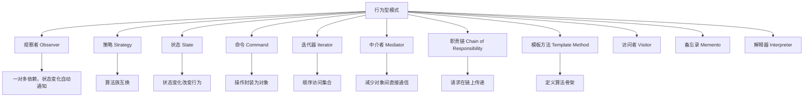

## 一句话概括

行为型设计模式聚焦于**对象之间的通信与职责分配**，通过观察者模式实现一对多的依赖关系、发布订阅模式实现解耦的事件通信、策略模式实现算法的动态切换，共同构成前端状态管理与交互逻辑的核心基础设施。

## 背景与意义

如果说创建型模式回答的是"对象怎么来"、结构型模式回答的是"对象怎么拼"，那么行为型模式回答的就是**"对象之间怎么说话"**。

在一个前端应用中，对象之间的通信是无比频繁的：

- 用户点击按钮 → 触发状态更新 → 界面重新渲染
- 用户输入搜索关键词 → 发送API请求 → 渲染搜索结果列表 → 更新URL参数
- WebSocket推送新消息 → 更新消息队列 → 通知各个UI组件更新

如果放任这些通信随意进行，结果就是代码中充满了循环依赖、难以追踪的事件链、修改一个模块导致三个模块崩坏的"幽灵bug"。

行为型模式的核心价值在于：**它们定义了"对象之间应该如何对话"的规范**，让通信变得可预测、可维护、可测试。

前端开发中，行为型模式的影响极其深远：

- **观察者模式**是MVVM框架的底层数据绑定机制——Vue的响应式系统本质上就是观察者模式的精妙实现
- **发布订阅模式**是跨组件通信的基石——EventBus、mitt、Redux的dispatch/subscribe都是发布订阅的变体
- **策略模式**是"配置化编程"的核心——根据不同的配置调用不同的算法逻辑，表单校验、排序、权限验证都是策略模式的应用场景
- **迭代器模式**让ES6的`for...of`、展开运算符`...`和`Array.from`等语法得以统一工作
- **命令模式**是撤销/重做功能的底层架构——编辑器中的Ctrl+Z就是命令模式

## 概念与定义

### 行为型模式全貌



本文深入前端最常用的四个：观察者、发布订阅、策略模式。

### 行为型模式与前端的关系

前端应用本质上是一个**事件驱动系统**。用户的操作、服务器的推送、定时器的触发——一切都以"事件"的形式发生。行为型模式正是事件驱动架构的理论基础。

**观察者 vs 发布订阅**：这两个模式经常被混淆。观察者模式定义了"一对多"的依赖关系，当主题状态变化时，所有观察者自动收到通知。发布订阅模式在观察者的基础上引入了一个**"事件通道"**作为中介，发布者和订阅者完全不知道对方的存在。

简单说：观察者模式中，观察者知道它观察的是谁；发布订阅模式中，订阅者只关心事件名称，不关心谁发布了事件。

## 核心知识点拆解

### 一、观察者模式：响应式系统的基础

观察者模式是前端最重要的行为型模式，没有之一。Vue的响应式系统、RxJS、甚至回调函数都可以看作观察者模式的变体。

#### 经典实现

```typescript
// 观察者接口
interface Observer {
  update(data: any): void;
}

// 主题（被观察者）
class Subject {
  private observers: Observer[] = [];
  private state: any;

  attach(observer: Observer): void {
    const exists = this.observers.includes(observer);
    if (!exists) {
      this.observers.push(observer);
      console.log(`[Subject] 注册了一个观察者`);
    }
  }

  detach(observer: Observer): void {
    const index = this.observers.indexOf(observer);
    if (index !== -1) {
      this.observers.splice(index, 1);
      console.log(`[Subject] 移除了一个观察者`);
    }
  }

  notify(): void {
    for (const observer of this.observers) {
      observer.update(this.state);
    }
  }

  setState(newState: any): void {
    console.log(`[Subject] 状态更新为:`, newState);
    this.state = newState;
    this.notify(); // 状态变化后自动通知所有观察者
  }

  getState(): any {
    return this.state;
  }
}

// 具体观察者
class ConcreteObserver implements Observer {
  private name: string;

  constructor(name: string) {
    this.name = name;
  }

  update(data: any): void {
    console.log(`[${this.name}] 收到通知，数据为:`, data);
  }
}

// 使用
const subject = new Subject();
const observer1 = new ConcreteObserver('观察者A');
const observer2 = new ConcreteObserver('观察者B');

subject.attach(observer1);
subject.attach(observer2);
subject.setState({ message: 'Hello, Observers!' });
// [Subject] 状态更新为: { message: 'Hello, Observers!' }
// [观察者A] 收到通知，数据为: { message: 'Hello, Observers!' }
// [观察者B] 收到通知，数据为: { message: 'Hello, Observers!' }
```

这个经典实现很清晰，但也暴露了一个问题：**Subject和Observer互相知道对方的存在**，产生了一定的耦合——这就是观察者模式的天然局限。

#### 前端中的观察者：Vue响应式系统

Vue 3的响应式系统是观察者模式的极致演绎。以下是`reactive`和`watch`的简化实现：

```typescript
// 核心：依赖收集器和响应式系统

type EffectFn = () => void;

// 当前正在执行的副作用函数
let activeEffect: EffectFn | null = null;

class Dep {
  private subscribers = new Set<EffectFn>();

  depend(): void {
    if (activeEffect) {
      this.subscribers.add(activeEffect);
    }
  }

  notify(): void {
    this.subscribers.forEach((effect) => effect());
  }
}

// 将对象变为响应式
function reactive<T extends Record<string, any>>(obj: T): T {
  const deps = new Map<string | symbol, Dep>();

  return new Proxy(obj, {
    get(target, key, receiver) {
      // 获取依赖收集器
      if (!deps.has(key)) {
        deps.set(key, new Dep());
      }
      const dep = deps.get(key)!;

      // 收集当前正在执行的副作用
      dep.depend();

      return Reflect.get(target, key, receiver);
    },
    set(target, key, value, receiver) {
      const result = Reflect.set(target, key, value, receiver);

      // 通知所有依赖该属性的副作用
      if (deps.has(key)) {
        deps.get(key)!.notify();
      }
      return result;
    },
  });
}

// 创建一个副作用函数
function watchEffect(fn: EffectFn): void {
  function wrappedEffect() {
    activeEffect = wrappedEffect;
    fn();
    activeEffect = null;
  }
  wrappedEffect(); // 立即执行以收集依赖
}

// 计算属性（特殊形式的观察者）
function computed<T>(fn: () => T): { readonly value: T } {
  let value: T;
  let dirty = true;
  const dep = new Dep();

  watchEffect(() => {
    if (dirty) {
      value = fn();
      dirty = false;
      dep.notify();
    }
  });

  return {
    get value() {
      dep.depend(); // 让计算属性也可以被观察
      return value;
    },
  };
}

// 使用：这就是Vue响应式系统的核心逻辑
const state = reactive({
  count: 0,
  name: '张三',
});

watchEffect(() => {
  console.log(`[Effect] count变化了: ${state.count}`);
});

watchEffect(() => {
  console.log(`[Effect] name变化了: ${state.name}`);
});

state.count = 1;
// [Effect] count变化了: 1

state.name = '李四';
// [Effect] name变化了: 李四

// 读取count会触发依赖收集
const double = computed(() => state.count * 2);
console.log(double.value); // 2

state.count = 2;
console.log(double.value); // 4（计算属性自动重新计算）
```

这个简化实现揭示了Vue响应式系统的底层机制：

1. **`reactive`** 使用Proxy拦截get和set操作
2. **get拦截**时，将当前正在执行的`watchEffect`（通过全局变量`activeEffect`追踪）注册为该属性的依赖
3. **set拦截**时，通知所有依赖该属性的`watchEffect`重新执行
4. **`computed`** 本质上也是一个观察者——它观察依赖的属性，当依赖变化时标记自身"脏"（dirty），下次访问时重新计算

这是观察者模式在前端中最精妙的应用之一：**通过语言特性（Proxy）实现了无侵入的依赖跟踪**。

### 二、发布订阅模式：彻底的解耦

发布订阅模式是观察者模式的升级版。它引入了一个**"事件通道"（Event Channel）**作为中介，让发布者和订阅者完全解耦。

```typescript
type EventHandler = (...args: any[]) => void;

class EventBus {
  private events = new Map<string, Set<EventHandler>>();

  // 订阅事件
  on(eventName: string, handler: EventHandler): () => void {
    if (!this.events.has(eventName)) {
      this.events.set(eventName, new Set());
    }
    this.events.get(eventName)!.add(handler);

    // 返回取消订阅的函数
    return () => {
      this.off(eventName, handler);
    };
  }

  // 取消订阅
  off(eventName: string, handler: EventHandler): void {
    const handlers = this.events.get(eventName);
    if (handlers) {
      handlers.delete(handler);
      if (handlers.size === 0) {
        this.events.delete(eventName);
      }
    }
  }

  // 只订阅一次
  once(eventName: string, handler: EventHandler): () => void {
    const wrappedHandler = (...args: any[]) => {
      handler(...args);
      this.off(eventName, wrappedHandler);
    };
    return this.on(eventName, wrappedHandler);
  }

  // 发布事件
  emit(eventName: string, ...args: any[]): void {
    const handlers = this.events.get(eventName);
    if (handlers) {
      handlers.forEach((handler) => {
        try {
          handler(...args);
        } catch (error) {
          console.error(`[EventBus] 事件 ${eventName} 处理出错:`, error);
        }
      });
    }
  }

  // 查询事件订阅者数量
  listenerCount(eventName: string): number {
    return this.events.get(eventName)?.size || 0;
  }

  // 清空所有事件
  clear(): void {
    this.events.clear();
  }

  // 获取所有已注册的事件名
  eventNames(): string[] {
    return Array.from(this.events.keys());
  }
}

// 全局事件总线
export const globalEventBus = new EventBus();

// 使用示例
const unsubscribe = globalEventBus.on('user:login', (user: any) => {
  console.log(`用户登录: ${user.name}`);
});

// 发布
globalEventBus.emit('user:login', { id: 1, name: '张三' });
// 用户登录: 张三

// 取消订阅
unsubscribe();
```

#### 发布订阅 vs 原生EventTarget

你可能注意到了，EventBus的逻辑和浏览器原生的`EventTarget`很像。实际上，一些前端库（如mitt）就是EventBus的微型实现。但浏览器原生CustomEvent也可以实现类似效果：

```typescript
// 原生EventTarget实现
class NativeEventBus extends EventTarget {
  emit(eventName: string, detail?: any): void {
    this.dispatchEvent(new CustomEvent(eventName, { detail }));
  }

  on(eventName: string, handler: EventHandler): () => void {
    const wrappedHandler = (e: Event) => handler((e as CustomEvent).detail);
    this.addEventListener(eventName, wrappedHandler as EventListener);
    return () => {
      this.removeEventListener(eventName, wrappedHandler as EventListener);
    };
  }
}
```

但自定义EventBus的优势在于：**支持`once`、`listenerCount`、类型安全等原生API不支持的操作**。

#### 真实场景：跨组件Tab切换通信

```typescript
// 场景：多Tab页面，Tab之间需要同步状态

// 事件名称常量
export const TabEvents = {
  TAB_CHANGED: 'tab:changed',
  TAB_REFRESH: 'tab:refresh',
  TAB_CLOSE: 'tab:close',
  DATA_UPDATED: 'data:updated',
  TAB_ERROR: 'tab:error',
} as const;

interface TabEventPayloads {
  'tab:changed': { from: string; to: string; timestamp: number };
  'tab:refresh': { tabName: string; force: boolean };
  'tab:close': { tabName: string };
  'data:updated': { tabName: string; entityType: string; entityId: string };
  'tab:error': { tabName: string; error: Error; context: string };
}

// 类型安全的事件总线
class TypedEventBus {
  private bus = new EventBus();

  on<K extends keyof TabEventPayloads>(
    event: K,
    handler: (payload: TabEventPayloads[K]) => void
  ): () => void {
    return this.bus.on(event as string, handler);
  }

  emit<K extends keyof TabEventPayloads>(
    event: K,
    payload: TabEventPayloads[K]
  ): void {
    this.bus.emit(event as string, payload);
  }
}

export const typedBus = new TypedEventBus();

// ===== Tab容器组件 =====
class TabContainer {
  private currentTab = 'dashboard';

  constructor() {
    // 订阅数据更新事件
    typedBus.on('data:updated', ({ tabName, entityType }) => {
      if (tabName === this.currentTab) {
        console.log(`[TabContainer] 当前Tab(${tabName})的${entityType}已更新`);
        this.refreshCurrentTab();
      }
    });

    // 订阅错误事件
    typedBus.on('tab:error', ({ tabName, error }) => {
      console.error(`[TabContainer] Tab ${tabName} 出错:`, error);
      this.showErrorMessage(tabName, error.message);
    });
  }

  switchTab(tabName: string): void {
    const from = this.currentTab;
    this.currentTab = tabName;

    typedBus.emit('tab:changed', {
      from,
      to: tabName,
      timestamp: Date.now(),
    });
  }

  private refreshCurrentTab(): void {
    console.log(`刷新当前Tab: ${this.currentTab}`);
  }

  private showErrorMessage(tabName: string, message: string): void {
    console.log(`在 ${tabName} 中显示错误: ${message}`);
  }
}

// ===== 独立的数据管理模块 =====
class DataManager {
  updateEntity(tabName: string, entityType: string, entityId: string): void {
    // 更新数据...
    console.log(`[DataManager] 更新 ${entityType}:${entityId}`);

    // 发布事件
    typedBus.emit('data:updated', { tabName, entityType, entityId });
  }
}

// ===== 独立的Tab内组件 =====
class TabContent {
  private unsubscribes: Array<() => void> = [];
  private tabName: string;

  constructor(tabName: string) {
    this.tabName = tabName;

    // 订阅Tab切换事件
    const unsub1 = typedBus.on('tab:changed', ({ to }) => {
      if (to === this.tabName) {
        console.log(`[TabContent:${tabName}] 我变成了激活Tab，开始加载数据`);
        this.loadData();
      }
    });

    // 订阅刷新事件
    const unsub2 = typedBus.on('tab:refresh', ({ tabName: name, force }) => {
      if (name === this.tabName && force) {
        console.log(`[TabContent:${tabName}] 强制刷新`);
        this.loadData();
      }
    });

    this.unsubscribes.push(unsub1, unsub2);
  }

  destroy(): void {
    this.unsubscribes.forEach((fn) => fn());
  }

  private loadData(): void {
    console.log(`[TabContent:${tabName}] 加载数据...`);
  }

  reportError(error: Error, context: string): void {
    typedBus.emit('tab:error', {
      tabName: this.tabName,
      error,
      context,
    });
  }
}

// 使用
const container = new TabContainer();
const dashboardTab = new TabContent('dashboard');
const settingsTab = new TabContent('settings');

const dataManager = new DataManager();

// Tab切换到settings
container.switchTab('settings');
// [TabContainer] 当前Tab(dashboard)停止活动
// [TabContent:settings] 我变成了激活Tab，开始加载数据

// 数据更新，通知当前Tab
dataManager.updateEntity('settings', 'user', '123');
// [TabContainer] 当前Tab(settings)的user已更新
```

这个例子展示了发布订阅模式的解耦能力：`TabContainer`、`TabContent`、`DataManager`三个模块彼此完全不知道对方的存在，却能通过事件总线协调工作。任何模块都可以独立替换或删除，而不影响其他模块。

### 三、策略模式：算法的动态切换

策略模式将算法族封装为独立的策略类，让它们可以互相替换。客户端不再依赖具体的算法实现，而是依赖策略接口。

#### 经典实现：表单校验系统

```typescript
// 策略接口
interface ValidationStrategy {
  validate(value: any): { valid: boolean; message: string };
}

// 具体策略实现
class RequiredStrategy implements ValidationStrategy {
  validate(value: any): { valid: boolean; message: string } {
    const valid = value !== null && value !== undefined && value !== '';
    return { valid, message: valid ? '' : '此字段为必填项' };
  }
}

class EmailStrategy implements ValidationStrategy {
  private pattern = /^[^\s@]+@[^\s@]+\.[^\s@]+$/;

  validate(value: string): { valid: boolean; message: string } {
    const valid = this.pattern.test(value);
    return { valid, message: valid ? '' : '邮箱格式不正确' };
  }
}

class MinLengthStrategy implements ValidationStrategy {
  constructor(private minLength: number) {}

  validate(value: string): { valid: boolean; message: string } {
    const valid = value.length >= this.minLength;
    return { valid, message: valid ? '' : `至少需要${this.minLength}个字符` };
  }
}

class MaxLengthStrategy implements ValidationStrategy {
  constructor(private maxLength: number) {}

  validate(value: string): { valid: boolean; message: string } {
    const valid = value.length <= this.maxLength;
    return { valid, message: valid ? '' : `最多${this.maxLength}个字符` };
  }
}

class PhoneStrategy implements ValidationStrategy {
  private pattern = /^1[3-9]\d{9}$/;

  validate(value: string): { valid: boolean; message: string } {
    const valid = this.pattern.test(value);
    return { valid, message: valid ? '' : '手机号格式不正确' };
  }
}

class RangeStrategy implements ValidationStrategy {
  constructor(private min: number, private max: number) {}

  validate(value: number): { valid: boolean; message: string } {
    const valid = value >= this.min && value <= this.max;
    return { valid, message: valid ? '' : `值必须在${this.min}到${this.max}之间` };
  }
}

class RegexStrategy implements ValidationStrategy {
  constructor(private pattern: RegExp, private errorMsg: string) {}

  validate(value: string): { valid: boolean; message: string } {
    const valid = this.pattern.test(value);
    return { valid, message: valid ? '' : this.errorMsg };
  }
}

// 上下文：组合多个策略
class FieldValidator {
  private strategies: ValidationStrategy[] = [];

  addStrategy(strategy: ValidationStrategy): this {
    this.strategies.push(strategy);
    return this;
  }

  validate(value: any): { valid: boolean; messages: string[] } {
    const errors: string[] = [];

    for (const strategy of this.strategies) {
      const result = strategy.validate(value);
      if (!result.valid) {
        errors.push(result.message);
      }
    }

    return {
      valid: errors.length === 0,
      messages: errors,
    };
  }
}

// 表单模型
class FormModel {
  private fields = new Map<string, FieldValidator>();
  private data = new Map<string, any>();

  addField(name: string, validators: ValidationStrategy[]): void {
    const validator = new FieldValidator();
    validators.forEach((v) => validator.addStrategy(v));
    this.fields.set(name, validator);
  }

  setValue(name: string, value: any): void {
    this.data.set(name, value);
  }

  getValue(name: string): any {
    return this.data.get(name);
  }

  validate(): { valid: boolean; errors: Record<string, string[]> } {
    const errors: Record<string, string[]> = {};

    this.fields.forEach((validator, fieldName) => {
      const value = this.data.get(fieldName);
      const result = validator.validate(value);
      if (!result.valid) {
        errors[fieldName] = result.messages;
      }
    });

    return {
      valid: Object.keys(errors).length === 0,
      errors,
    };
  }
}

// 使用
const registerForm = new FormModel();

registerForm.addField('username', [
  new RequiredStrategy(),
  new MinLengthStrategy(3),
  new MaxLengthStrategy(20),
  new RegexStrategy(/^[a-zA-Z0-9_]+$/, '用户名只能包含字母、数字和下划线'),
]);

registerForm.addField('email', [
  new RequiredStrategy(),
  new EmailStrategy(),
]);

registerForm.addField('phone', [
  new RequiredStrategy(),
  new PhoneStrategy(),
]);

registerForm.addField('age', [
  new RequiredStrategy(),
  new RangeStrategy(18, 120),
]);

// 模拟用户输入
registerForm.setValue('username', '张三');
registerForm.setValue('email', 'test@');
registerForm.setValue('phone', '1381234');
registerForm.setValue('age', 25);

const validationResult = registerForm.validate();
console.log(validationResult);
// {
//   valid: false,
//   errors: {
//     email: ['邮箱格式不正确'],
//     phone: ['手机号格式不正确']
//   }
// }

// 修正后再次验证
registerForm.setValue('email', 'test@example.com');
registerForm.setValue('phone', '13812345678');

const result2 = registerForm.validate();
console.log(result2);
// { valid: true, errors: {} }
```

策略模式的核心优势在这个例子中完美体现：

1. **开闭原则**：新增验证规则只需要新增一个Strategy类，不需要修改现有代码
2. **组合灵活**：每个字段的验证规则通过"策略组合"实现，`required + minLength + regex`自由搭配
3. **单一职责**：每个策略类只做一件事，验证逻辑的单元测试极度简单
4. **可复用**：`EmailStrategy`可以复用于登录表单、注册表单、找回密码表单

#### 策略模式在框架中的体现：排序策略

```typescript
// 排序系统
interface SortStrategy<T> {
  sort(items: T[]): T[];
  name: string;
}

class AscendingSort implements SortStrategy<number> {
  name = '升序';

  sort(items: number[]): number[] {
    return [...items].sort((a, b) => a - b);
  }
}

class DescendingSort implements SortStrategy<number> {
  name = '降序';

  sort(items: number[]): number[] {
    return [...items].sort((a, b) => b - a);
  }
}

class RandomSort implements SortStrategy<number> {
  name = '随机';

  sort(items: number[]): number[] {
    return [...items].sort(() => Math.random() - 0.5);
  }
}

// 上下文
class Sorter<T> {
  private strategy: SortStrategy<T>;

  constructor(strategy: SortStrategy<T>) {
    this.strategy = strategy;
  }

  setStrategy(strategy: SortStrategy<T>): void {
    this.strategy = strategy;
    console.log(`切换到排序方式: ${strategy.name}`);
  }

  sort(items: T[]): T[] {
    return this.strategy.sort(items);
  }
}

// 使用
const data = [3, 1, 4, 1, 5, 9, 2, 6];
const sorter = new Sorter(new AscendingSort());

console.log(sorter.sort(data)); // [1, 1, 2, 3, 4, 5, 6, 9]

sorter.setStrategy(new DescendingSort());
console.log(sorter.sort(data)); // [9, 6, 5, 4, 3, 2, 1, 1]

sorter.setStrategy(new RandomSort());
console.log(sorter.sort(data)); // 随机排列

// 还可以在运行时动态切换策略
const sortStrategies: SortStrategy<number>[] = [
  new AscendingSort(),
  new DescendingSort(),
  new RandomSort(),
];

// 根据用户选择切换排序
function sortWithStrategy(items: number[], strategyIndex: number): number[] {
  return sortStrategies[strategyIndex].sort(items);
}
```

## 实战案例

### 完整场景：构建一个可配置的数据查询面板

假设我们要开发一个数据查询面板，用户可以选择：
1. 数据筛选策略（等于、大于、小于、范围、模糊匹配）
2. 排序策略（正序、倒序）
3. 数据变更通知策略（实时通知、批量汇总通知、定时通知）

这是一个策略模式、观察者模式和发布订阅模式三者协同的理想场景。

```typescript
// ========== 1. 筛选策略（策略模式） ==========
interface FilterStrategy {
  apply(data: any[], field: string, value: any): any[];
  label: string;
  operator: string;
}

class EqualFilter implements FilterStrategy {
  label = '等于';
  operator = '=';

  apply(data: any[], field: string, value: any): any[] {
    return data.filter((item) => item[field] === value);
  }
}

class GreaterThanFilter implements FilterStrategy {
  label = '大于';
  operator = '>';

  apply(data: any[], field: string, value: any): any[] {
    return data.filter((item) => item[field] > value);
  }
}

class LessThanFilter implements FilterStrategy {
  label = '小于';
  operator = '<';

  apply(data: any[], field: string, value: any): any[] {
    return data.filter((item) => item[field] < value);
  }
}

class RangeFilter implements FilterStrategy {
  label = '范围';
  operator = 'range';

  apply(data: any[], field: string, value: { min: number; max: number }): any[] {
    return data.filter(
      (item) => item[field] >= value.min && item[field] <= value.max
    );
  }
}

class ContainsFilter implements FilterStrategy {
  label = '包含';
  operator = 'contains';

  apply(data: any[], field: string, value: string): any[] {
    return data.filter((item) =>
      String(item[field]).toLowerCase().includes(value.toLowerCase())
    );
  }
}

// 筛选策略工厂
class FilterStrategyFactory {
  private static strategies = new Map<string, FilterStrategy>();

  static register(type: string, strategy: FilterStrategy): void {
    FilterStrategyFactory.strategies.set(type, strategy);
  }

  static create(type: string): FilterStrategy {
    const strategy = FilterStrategyFactory.strategies.get(type);
    if (!strategy) throw new Error(`不支持的筛选类型: ${type}`);
    return strategy;
  }

  static getAll(): FilterStrategy[] {
    return Array.from(FilterStrategyFactory.strategies.values());
  }
}

FilterStrategyFactory.register('eq', new EqualFilter());
FilterStrategyFactory.register('gt', new GreaterThanFilter());
FilterStrategyFactory.register('lt', new LessThanFilter());
FilterStrategyFactory.register('range', new RangeFilter());
FilterStrategyFactory.register('contains', new ContainsFilter());

// ========== 2. 查询引擎（观察者模式 + 策略模式） ==========
interface QueryChangeObserver {
  onQueryChange(query: Query): void;
}

interface QueryEvent {
  type: 'filter_added' | 'filter_removed' | 'filter_changed' | 'sort_changed' | 'data_fetched';
  timestamp: number;
  payload?: any;
}

class Query {
  filters: Array<{ field: string; strategy: FilterStrategy; value: any }> = [];
  sortField: string | null = null;
  sortAscending = true;

  addFilter(field: string, strategy: FilterStrategy, value: any): void {
    this.filters.push({ field, strategy, value });
  }

  removeFilter(field: string): void {
    this.filters = this.filters.filter((f) => f.field !== field);
  }

  clearFilters(): void {
    this.filters = [];
  }

  apply(data: any[]): any[] {
    let result = [...data];
    // 应用筛选
    for (const filter of this.filters) {
      result = filter.strategy.apply(result, filter.field, filter.value);
    }
    // 应用排序
    if (this.sortField) {
      result.sort((a, b) => {
        const cmp = a[this.sortField!] < b[this.sortField!] ? -1 :
                    a[this.sortField!] > b[this.sortField!] ? 1 : 0;
        return this.sortAscending ? cmp : -cmp;
      });
    }
    return result;
  }
}

class QueryEngine {
  private query = new Query();
  private observers: QueryChangeObserver[] = [];
  private data: any[] = [];

  constructor(data: any[]) {
    this.data = data;
  }

  attach(observer: QueryChangeObserver): void {
    this.observers.push(observer);
  }

  detach(observer: QueryChangeObserver): void {
    const index = this.observers.indexOf(observer);
    if (index !== -1) this.observers.splice(index, 1);
  }

  private notify(event: QueryEvent): void {
    this.observers.forEach((observer) => observer.onQueryChange(this.query));
    // 同时也通过发布订阅模式通知更广泛的范围
    queryEventBus.emit('query:changed', {
      event,
      filteredData: this.getFilteredData(),
    });
  }

  addFilter(field: string, strategyType: string, value: any): void {
    const strategy = FilterStrategyFactory.create(strategyType);
    this.query.addFilter(field, strategy, value);
    this.notify({
      type: 'filter_added',
      timestamp: Date.now(),
      payload: { field, strategyType, value },
    });
  }

  removeFilter(field: string): void {
    this.query.removeFilter(field);
    this.notify({
      type: 'filter_removed',
      timestamp: Date.now(),
      payload: { field },
    });
  }

  setSort(field: string, ascending: boolean): void {
    this.query.sortField = field;
    this.query.sortAscending = ascending;
    this.notify({
      type: 'sort_changed',
      timestamp: Date.now(),
      payload: { field, ascending },
    });
  }

  getFilteredData(): any[] {
    return this.query.apply(this.data);
  }

  getQueryState(): Query {
    return this.query;
  }
}

// ========== 3. 事件总线（发布订阅模式） ==========
const queryEventBus = new EventBus();

// ========== 4. UI组件 ===========
// 查询面板UI（观察者）
class QueryPanel {
  private engine: QueryEngine;
  private container: HTMLElement;

  constructor(engine: QueryEngine, container: HTMLElement) {
    this.engine = engine;
    this.container = container;

    // 注册为观察者
    engine.attach({
      onQueryChange: (query) => this.renderActiveFilters(query),
    });

    // 监听数据更新事件
    queryEventBus.on('query:changed', ({ event, filteredData }) => {
      this.updateResultCount(filteredData.length);
    });
  }

  private renderActiveFilters(query: Query): void {
    const filterList = this.container.querySelector('.active-filters')!;
    filterList.innerHTML = query.filters
      .map(
        (f) => `
          <span class="filter-tag">
            ${f.field} ${f.strategy.label} ${JSON.stringify(f.value)}
            <button data-field="${f.field}" class="remove-filter">×</button>
          </span>
        `
      )
      .join('');

    filterList.querySelectorAll('.remove-filter').forEach((btn) => {
      btn.addEventListener('click', (e) => {
        this.engine.removeFilter(
          (e.target as HTMLElement).dataset.field!
        );
      });
    });
  }

  private updateResultCount(count: number): void {
    const counter = this.container.querySelector('.result-count');
    if (counter) counter.textContent = `共 ${count} 条结果`;
  }
}

// ========== 5. 使用 ==========
const sampleData = [
  { id: 1, name: '苹果', category: '水果', price: 5.5, stock: 100 },
  { id: 2, name: '香蕉', category: '水果', price: 3.2, stock: 200 },
  { id: 3, name: '牛奶', category: '乳制品', price: 12.0, stock: 50 },
  { id: 4, name: '面包', category: '烘焙', price: 8.5, stock: 80 },
  { id: 5, name: '牛肉', category: '肉制品', price: 45.0, stock: 30 },
];

const engine = new QueryEngine(sampleData);

// 添加筛选条件
engine.addFilter('category', 'contains', '肉');
const result1 = engine.getFilteredData();
console.log('筛选结果:', result1.map((r) => r.name));
// ['牛肉']

// 添加第二个筛选条件
engine.addFilter('price', 'lt', 10);
const result2 = engine.getFilteredData();
console.log('添加价格筛选:', result2.map((r) => r.name));
// []（牛肉价格45，不小于10）

// 切换排序
engine.setSort('price', true);
const result3 = engine.getFilteredData();
console.log('按价格升序:', result3);
```

这个实战案例展示了三种行为型模式的协同：

- **策略模式**（FilterStrategy）：让筛选逻辑可以自由组合和替换
- **观察者模式**（QueryEngine Observers）：让UI组件自动响应查询条件变化
- **发布订阅模式**（EventBus）：将查询事件广播给更多不相关的模块

## 底层原理

### 观察者模式 vs 发布订阅模式：本质差异

两者最大的差异在于**"耦合度"**：

- 观察者模式：Subject知道Observer的存在（`observers: Observer[]`）。这是一种**组合关系**——Subject包含Observer。
- 发布订阅模式：发布者和订阅者完全不知晓对方，通过Event Channel中转。这是一种**事件关系**——双方只约定事件名称和数据结构。

从实现角度看：

```typescript
// 观察者模式：主题持有观察者引用
class Subject {
  observers: Observer[] = [];
  notify() {
    observers.forEach(o => o.update(data));
  }
}

// 发布订阅模式：事件通道作为中介
class PubSub {
  handlers: Map<string, Set<Handler>> = new Map();
  publish(event, data) {
    handlers.get(event)?.forEach(h => h(data));
  }
}
```

选择建议：
- **代码内部、已知依赖关系、需要明确通信路径** → 观察者模式
- **跨模块、未知接收者、需要低耦合** → 发布订阅模式
- **Vue/React组件内部** → 观察者模式（props/emit）
- **跨组件、跨微前端应用** → 发布订阅模式（EventBus）

### 策略模式与函数式编程

在函数式编程的视角下，策略模式可以简化为**"把函数当做参数传递"**：

```typescript
// 函数式策略模式
type FilterFn<T> = (item: T) => boolean;
type SortFn<T> = (a: T, b: T) => number;

function query<T>(
  data: T[],
  filters: FilterFn<T>[],
  sorter?: SortFn<T>
): T[] {
  let result = data;
  for (const filter of filters) {
    result = result.filter(filter);
  }
  if (sorter) result = [...result].sort(sorter);
  return result;
}

// 使用：函数取代了策略类
const cheap = (item: any) => item.price < 10;
const inCategory = (cat: string) => (item: any) => item.category === cat;
const byPrice = (a: any, b: any) => a.price - b.price;

const result = query(
  products,
  [inCategory('水果'), cheap],
  byPrice
);
```

函数式版本比类版本更简洁，但**失去了策略的"命名"和"自描述"能力**。当一个策略只有几行逻辑时，用函数就够了；当一个策略有复杂的状态和生命周期时，用类策略更合适。没有绝对的好坏，取决于复杂度。

## 高频面试题解析

### Q1: 观察者模式和发布订阅模式有什么区别？在前端各自的应用场景是什么？

**最佳回答**：
核心区别在于**有没有事件通道（Event Channel）作为中介**：

| 维度 | 观察者模式 | 发布订阅模式 |
|------|-----------|------------|
| 通信方式 | Subject → Observer（直连） | Publisher → EventChannel → Subscriber（中转） |
| 耦合度 | 观察者知道主题，主题知道观察者 | 双方都不知道对方存在 |
| 扩展性 | 添加观察者需要修改Subject代码 | 添加订阅者只需注册事件 |
| 典型应用 | Vue响应式系统、RxJS Subject | EventBus、Redux dispatch、mitt |

**Vue中两者的体现**：
- **观察者模式**：`watch`、`computed`、`watchEffect`。当state变化时，直接通知相关的effect重新执行。
- **发布订阅模式**：`mitt`或自定义EventBus用于跨组件通信。`emit('event-name', payload)`和`on('event-name', handler)`。

**React中两者的体现**：
- **观察者模式**：`useEffect`的依赖数组——当依赖变化时，effect重新执行。
- **发布订阅模式**：Redux的`store.subscribe(listener)`、zustand的`useStore.subscribe()`。

### Q2: Vue的响应式系统中，为什么用Proxy替代了Object.defineProperty？

**最佳回答**：
Vue 2使用`Object.defineProperty`实现响应式，Vue 3改用`Proxy`。这个转换深层次的原因就是**观察者模式中"依赖收集"的能力边界问题**。

`Object.defineProperty`的局限性：
1. **无法检测属性新增和删除**：Vue 2要用`Vue.set()`和`Vue.delete()`来补救
2. **数组索引和长度变化**：`arr[0] = 1`和`arr.length = 0`无法触发更新
3. **初始化时递归遍历所有属性**：性能开销在深层嵌套大对象上尤为明显

`Proxy`的优势：
1. **拦截所有操作**：get、set、deleteProperty、has等13种操作都能拦截
2. **支持动态新增属性**：`obj.newProp = value`也能触发响应式
3. **支持数组变化检测**：`arr[0] = 1`自动触发更新
4. **懒递归**：只有读取到深层属性时才创建响应式包装，性能更好

从观察者模式的角度看：`Object.defineProperty`需要预知所有"可观察的属性"；而`Proxy`可以拦截任意属性访问——这更符合观察者模式的精神：**主题（对象）的变化可以动态传递给观察者**。

### Q3: 前端什么场景下应该使用EventBus？什么场景下应该避免？

**最佳回答**：
**推荐使用EventBus的场景**：
1. **跨层级组件通信**：祖孙组件之间，用props层层传递太麻烦
2. **跨框架通信**：Vue组件与React组件之间
3. **模块解耦**：不相关的业务模块需要同步状态
4. **发布全局事件**：用户登录/登出、数据同步完成、WebSocket消息

**应该避免EventBus的场景**：
1. **父子组件通信**：用props和事件就足够了，用EventBus反而降低了可读性
2. **多个模块监听同一个事件，但缺乏明确的文档**：EventBus会让数据流难以追踪——"这个事件是谁发布的？谁在监听？"
3. **不需要解耦的场景**：两个模块强关联，分开反而增加复杂度
4. **类型安全要求高的大型项目**：无法在编译时检查事件名称和参数类型

**经验法则**：如果只有2-3个组件需要通信，不要用EventBus。如果需要跨5个以上不直接相关的组件通信，EventBus是合适的选择。

### Q4: 策略模式和状态模式有什么区别？

**最佳回答**：
策略模式和状态模式的结构非常相似——都封装了不同的行为，并在运行时切换。但它们解决的问题完全不同：

| 维度 | 策略模式 | 状态模式 |
|------|---------|---------|
| 关注点 | "怎么做" | "什么状态下做什么" |
| 切换触发 | 客户端主动选择策略 | 状态自动转换导致行为变化 |
| 状态感知 | 策略不感知其他策略 | 状态对象可以触发状态转换 |
| 变化原因 | 外部条件变化 | 内部状态变化 |

```typescript
// 策略模式：客户端主动选择算法
class Sorter {
  sort(strategy: SortStrategy, data: number[]): number[] {
    return strategy.sort(data); // 客户端决定用什么算法
  }
}

// 状态模式：状态自动决定行为
class Document {
  private state: DocumentState;

  publish(): void {
    this.state.publish(this);
    // state内部决定是否切换状态
  }
}
```

简单判别：**如果切换策略的决策来自外部用户/配置 → 策略模式；如果切换策略的决策来自内部状态变化 → 状态模式**。

### Q5: 如何设计一个"撤销/重做"功能？它和命令模式有什么关系？

**最佳回答**：
撤销/重做功能是**命令模式**的经典应用。命令模式将"操作"封装为对象，使得可以记录、排队、撤销操作。

```typescript
// 命令接口
interface Command {
  execute(): void;
  undo(): void;
  readonly name: string;
}

// 具体命令
class UpdateTextCommand implements Command {
  name = '修改文本';

  constructor(
    private target: { text: string },
    private newText: string,
    private oldText: string
  ) {}

  execute(): void {
    this.target.text = this.newText;
  }

  undo(): void {
    this.target.text = this.oldText;
  }
}

// 命令管理器（支持撤销/重做）
class CommandManager {
  private history: Command[] = [];
  private redoStack: Command[] = [];
  private maxHistory = 50;

  execute(command: Command): void {
    command.execute();
    this.history.push(command);
    this.redoStack = []; // 新操作清空重做栈

    if (this.history.length > this.maxHistory) {
      this.history.shift();
    }

    console.log(`[执行] ${command.name}`);
  }

  undo(): void {
    const command = this.history.pop();
    if (command) {
      command.undo();
      this.redoStack.push(command);
      console.log(`[撤销] ${command.name}`);
    }
  }

  redo(): void {
    const command = this.redoStack.pop();
    if (command) {
      command.execute();
      this.history.push(command);
      console.log(`[重做] ${command.name}`);
    }
  }

  get canUndo(): boolean {
    return this.history.length > 0;
  }

  get canRedo(): boolean {
    return this.redoStack.length > 0;
  }
}

// 使用
const editor = { text: '' };
const manager = new CommandManager();

manager.execute(new UpdateTextCommand(editor, 'Hello', ''));
manager.execute(new UpdateTextCommand(editor, 'Hello World', 'Hello'));
console.log(editor.text); // Hello World

manager.undo();
console.log(editor.text); // Hello

manager.redo();
console.log(editor.text); // Hello World
```

命令模式的关键在于**将"操作"提升为一等对象**。这使得操作可以被序列化、延迟执行、组合执行，从而支撑了撤销/重做、操作日志、事务等高级功能。

## 总结与扩展

行为型模式是前端开发中使用频率最高的设计模式类别。它们定义了应用中"事件"和"数据"的流动方式：

1. **观察者模式**是响应式编程的基石——Vue的响应式系统、React的`useEffect`、RxJS的`Observable`都是观察者模式的变体或扩展。

2. **发布订阅模式**是实现模块解耦的最有效手段——EventBus、mitt、Redux、甚至window.addEventListener都是发布订阅模式的应用。

3. **策略模式**让算法可以灵活切换——表单校验、数据筛选、排序、权限验证，每个"if-else"在增长到一定程度后都应该考虑重构为策略模式。

4. **命令模式**将操作封装为对象——撤销/重做、操作日志、事务支持，这些看似高端的功能底层都是命令模式。

观察这三种模式，你会发现一个共同的演进方向：**从"直接依赖"到"间接依赖"**。观察者模式用Observer接口解耦，发布订阅模式用Event Channel解耦，策略模式用Strategy接口解耦。解耦不是目的，目的——是让系统能够更灵活地应对变化。当新的需求来临时，不需要修改现有代码，只需要添加新的"类"或"处理函数"即可。
