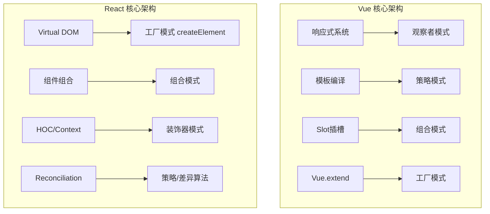
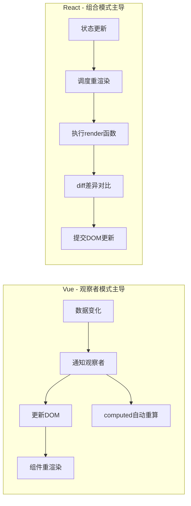

## 一句话概括

Vue和React两大前端框架的核心架构本身就是设计模式的教科书式实践——Vue围绕观察者模式构建了响应式数据绑定系统，React以组合模式为核心构建声明式UI范式，两者在虚拟DOM、组件化、数据流等层面上深刻体现了适配器、策略、工厂等多种设计模式的协同。

## 背景与意义

对于前端工程师而言，"设计模式"和"前端框架"似乎是两个平行的知识体系——面试时你分别准备，工作中你分别使用。但很少有人停下来问一个问题：**Vue和React的底层架构，到底用了哪些设计模式？**

这个问题的答案，其实比想象中更丰富、更深刻。

Vue和React都不是从零开始"发明"的。它们的作者在构建框架时，面对的是所有前端应用都存在的共性问题——UI如何描述、状态如何管理、变化如何传播。这些问题恰好是设计模式试图解决的"通用问题"。因此，两大框架在架构层面大量借鉴了经典的设计模式思想，并结合前端的特点进行了创新。

理解这些框架底层的设计模式，带来的价值是多维度的：

1. **从"用框架"到"懂框架"**：知道Vue响应式系统是观察者模式的实现，你就不会再对"为什么解构会丢失响应式"感到困惑。知道React的组合模式原理，你就理解了为什么"渲染props"比"继承组件"更优雅。

2. **提升框架设计决策能力**：在Vue和React之间做技术选型时，理解它们不同的设计模式哲学能帮助你做出更明智的选择——Vue的观察者模式更适合"数据变化驱动UI更新"的场景，而React的组合模式更适合"UI是状态的函数"的纯函数理念。

3. **构建可扩展的组件体系**：当你需要编写自己的组件库、设计系统或SDK时，框架中使用的设计模式都可以作为参考——工厂模式创建组件实例，组合模式构建组件树，策略模式处理平台适配。

## 概念与定义

两大框架的核心设计哲学，可以归结为两个关键设计模式：



### Vue的设计模式哲学

Vue的核心设计理念是**"可变状态 + 自动追踪"**。开发者修改数据，框架自动计算出需要更新的DOM节点并进行最小化更新。这种"自动"的背后，是观察者模式在驱动。

Vue的三驾马车：
- **数据驱动**（观察者模式）：`reactive`、`ref`、`computed`构成响应式依赖图
- **模板系统**（策略模式）：编译时将模板优化为渲染函数，在不同平台（Web/SSR/原生）上采用不同策略
- **组件系统**（组合模式）：组件可以包含子组件，形成树形结构，对外暴露相同的接口（`props` + `emit`）

### React的设计模式哲学

React的核心设计理念是**"不可变状态 + 声明式UI"**。组件是状态的纯函数——`UI = f(state)`。这种"函数式"的背后，是组合模式和工厂模式在运作。

React的三驾马车：
- **组件组合**（组合模式）：一切皆组件，组件包含组件形成UI树
- **Virtual DOM**（工厂模式）：`createElement`作为VNode工厂，Render阶段执行差异比较
- **Hooks**（适配器/策略模式）：将状态管理逻辑从组件中剥离，以函数形式注入

## 核心知识点拆解

### 一、Vue中的观察者模式：响应式系统的灵魂

Vue 3的响应式系统是观察者模式最精妙的前端实现之一。它通过`Proxy`拦截对象的读写操作，在读取时收集依赖（订阅），在写入时通知更新（发布）。

#### Vue响应式的简化实现

```typescript
// ===== Vue 3 响应式系统的核心逻辑 =====

let activeEffect: (() => void) | null = null;

class Dep {
  private subscribers = new Set<() => void>();

  depend(): void {
    if (activeEffect) {
      this.subscribers.add(activeEffect);
    }
  }

  notify(): void {
    this.subscribers.forEach((effect) => effect());
  }
}

// 构建响应式对象
function reactive<T extends Record<string, any>>(target: T): T {
  const deps = new Map<string | symbol, Dep>();

  return new Proxy(target, {
    get(obj, key, receiver) {
      if (!deps.has(key)) {
        deps.set(key, new Dep());
      }
      deps.get(key)!.depend();
      return Reflect.get(obj, key, receiver);
    },
    set(obj, key, value, receiver) {
      const result = Reflect.set(obj, key, value, receiver);
      if (deps.has(key)) {
        deps.get(key)!.notify();
      }
      return result;
    },
  });
}

// 自动追踪的副作用
function watchEffect(fn: () => void): () => void {
  const effect = () => {
    activeEffect = effect;
    fn();
    activeEffect = null;
  };
  effect();
  return () => {
    // cleanup: 从所有dep中移除这个effect
  };
}

// 计算属性
function computed<T>(getter: () => T): { readonly value: T } {
  let cached: T;
  let dirty = true;
  const dep = new Dep();

  watchEffect(() => {
    if (dirty) {
      cached = getter();
      dirty = false;
      dep.notify();
    }
  });

  return {
    get value() {
      dep.depend();
      return cached;
    },
  };
}

// ===== Vue中的实际使用 =====
import { reactive, computed, watchEffect } from 'vue';

// 场景：购物车计算
const cart = reactive({
  items: [
    { name: '苹果', price: 5, quantity: 3 },
    { name: '香蕉', price: 3, quantity: 5 },
    { name: '牛奶', price: 12, quantity: 2 },
  ],
});

// computed自动追踪依赖项的变化
const total = computed(() => {
  return cart.items.reduce((sum, item) => sum + item.price * item.quantity, 0);
});

const itemCount = computed(() => {
  return cart.items.reduce((sum, item) => sum + item.quantity, 0);
});

// watchEffect在依赖变化时自动重新执行
watchEffect(() => {
  console.log(`购物车更新: ${itemCount.value}件商品, 总计¥${total.value}`);
});

// 修改数据 → 自动触发计算属性重新计算 → watchEffect重新执行
cart.items[0].quantity = 10;
// 控制台输出: 购物车更新: 17件商品, 总计¥89

cart.items.push({ name: '面包', price: 8, quantity: 1 });
// 控制台输出: 购物车更新: 18件商品, 总计¥97
```

这个示例清楚地展示了Vue响应式系统作为观察者模式的工作流程：

```
数据变化 → 依赖通知（Dep.notify） → 副作用重新执行（watchEffect）
                              → 计算属性重新计算（computed）
                              → 组件重新渲染（render函数）
```

#### 为什么Vue选择观察者模式？

Vue的作者尤雨溪在多次演讲中阐述了这个设计决策的考量：

1. **可变数据的直觉**：前端开发者天然倾向于"修改数据，UI自动更新"的直觉。观察者模式天然支持"数据变化→自动通知"的语义。

2. **精细的依赖追踪**：观察者模式允许Vue精确知道"哪个组件依赖于哪个属性"。当某个属性变化时，只有依赖它的组件重新渲染，无关组件不受影响。

3. **高性能的细粒度更新**：相比React的"从根组件开始diff"，Vue的观察者模式可以实现更精确的重渲染控制。

#### 观察者模式在Vue组件中的体现

```typescript
// Vue组件的响应式生命周期——观察者模式的组件级别实现
import { defineComponent, ref, onMounted, onUnmounted } from 'vue';

export default defineComponent({
  setup() {
    // ref创建观察目标
    const count = ref(0);
    const user = ref<{ name: string } | null>(null);
    
    // 组件本身就是观察者
    // 当 setup 中访问到的响应式变量变化时，组件自动重渲染
    
    // watch是显式观察者
    watch(count, (newVal, oldVal) => {
      console.log(`count从${oldVal}变为${newVal}`);
      // count.value 变化时触发
    });
    
    // watchEffect自动收集依赖
    watchEffect(() => {
      // 这里的每个响应式依赖被读取时，都会被收集
      document.title = `计数: ${count.value}`;
      if (user.value) {
        document.title += ` - ${user.value.name}`;
      }
    });
    
    onMounted(() => {
      // 模拟数据获取
      setTimeout(() => {
        user.value = { name: '张三' };
        // user.value变化自动触发watchEffect重新执行
        // 但不会触发watch(count)，因为count没变
      }, 1000);
    });
    
    return { count, user };
  },
});
```

### 二、React中的组合模式：声明式UI的基石

React最核心的设计理念不是"虚拟DOM"也不是"JSX"，而是**组合（Composition）**。React官方文档甚至直言："React的核心是一个组合模型（composition model）。"

组合模式的核心思想是：**"部分-整体"的层次结构可以统一对待**。在React中，无论是简单的`<Button>`、`<span>`，还是复杂的`<Dashboard>`、`<DataTable>`，它们共享相同的接口——接收`props`，返回JSX。

#### React组合模式的核心体现

```typescript
import React, { ReactNode, useState } from 'react';

// ===== 1. 基础组件（叶子节点） =====
interface ButtonProps {
  variant?: 'primary' | 'secondary' | 'danger';
  size?: 'sm' | 'md' | 'lg';
  disabled?: boolean;
  onClick?: () => void;
  children: ReactNode;
}

function Button({ variant = 'primary', size = 'md', disabled, onClick, children }: ButtonProps) {
  const baseClass = 'btn';
  const classNames = `${baseClass} ${baseClass}--${variant} ${baseClass}--${size}`;
  
  return (
    <button className={classNames} disabled={disabled} onClick={onClick}>
      {children}
    </button>
  );
}

// ===== 2. 容器组件（复合节点） =====
interface CardProps {
  title?: string;
  subtitle?: string;
  footer?: ReactNode;
  children: ReactNode;
}

function Card({ title, subtitle, footer, children }: CardProps) {
  return (
    <div className="card">
      {(title || subtitle) && (
        <div className="card__header">
          {title && <h3 className="card__title">{title}</h3>}
          {subtitle && <p className="card__subtitle">{subtitle}</p>}
        </div>
      )}
      <div className="card__body">{children}</div>
      {footer && <div className="card__footer">{footer}</div>}
    </div>
  );
}

// ===== 3. 列表组件（组合+渲染子项） =====
interface ListProps<T> {
  items: T[];
  renderItem: (item: T, index: number) => ReactNode;
  emptyMessage?: string;
  loading?: boolean;
}

function List<T>({ items, renderItem, emptyMessage = '暂无数据', loading }: ListProps<T>) {
  if (loading) return <div className="list__loading">加载中...</div>;
  if (items.length === 0) {
    return <div className="list__empty">{emptyMessage}</div>;
  }
  
  return (
    <div className="list">
      {items.map((item, index) => (
        <div className="list__item" key={index}>
          {renderItem(item, index)}
        </div>
      ))}
    </div>
  );
}

// ===== 4. 组合使用 =====
interface User { id: number; name: string; email: string; role: string; }

function UserManagement() {
  const [users] = useState<User[]>([
    { id: 1, name: '张三', email: 'zhang@example.com', role: '管理员' },
    { id: 2, name: '李四', email: 'li@example.com', role: '编辑者' },
    { id: 3, name: '王五', email: 'wang@example.com', role: '查看者' },
  ]);

  return (
    <Card
      title="用户管理"
      subtitle="管理系统中的所有用户"
      footer={
        <div className="card__actions">
          <Button variant="primary" onClick={() => alert('新增用户')}>
            新增用户
          </Button>
        </div>
      }
    >
      <List
        items={users}
        renderItem={(user: User) => (
          <div className="user-item">
            <div className="user-item__info">
              <span className="user-item__name">{user.name}</span>
              <span className="user-item__email">{user.email}</span>
              <span className="user-item__role">{user.role}</span>
            </div>
            <div className="user-item__actions">
              <Button variant="secondary" size="sm" onClick={() => alert(`编辑 ${user.name}`)}>
                编辑
              </Button>
              <Button variant="danger" size="sm" onClick={() => alert(`删除 ${user.name}`)}>
                删除
              </Button>
            </div>
          </div>
        )}
        emptyMessage="还没有用户数据"
      />
    </Card>
  );
}
```

在这个例子中，`Button`、`Card`、`List`都是"组件"——组合模式要求它们具有相同的接口（接收props，返回JSX）。`List`不关心`renderItem`返回的是什么组件，它只知道"这里有一个渲染函数，我调用它即可"。`Card`不关心children里面是什么，它只需要包裹它们。

**这就是组合模式的前端实践：递归的、类型统一的树形结构**。

#### 组合模式 vs 继承

React官方文档有一个重要的论断：**"在React中，使用组合而非继承来复用代码"**。

```typescript
// ❌ 继承方式（反模式）
class BaseModal extends React.Component {
  render() {
    return (
      <div className="modal-overlay">
        <div className="modal-content">
          <h2>{this.props.title}</h2>
          <div className="modal-body">{this.renderBody()}</div>
        </div>
      </div>
    );
  }
  renderBody() { return null; }
}

class ConfirmModal extends BaseModal {
  renderBody() {
    return <p>确定要执行此操作吗？</p>;
  }
}

// 问题：
// 1. 每个变体都需要创建一个新类
// 2. 多层继承导致"脆弱的基类问题"
// 3. 组件逻辑分散在多个方法中，难以测试

// ✅ 组合方式（推荐）
interface ModalProps {
  title: string;
  body: ReactNode;
  footer?: ReactNode;
  onClose?: () => void;
}

function Modal({ title, body, footer, onClose }: ModalProps) {
  return (
    <div className="modal-overlay" onClick={onClose}>
      <div className="modal-content" onClick={(e) => e.stopPropagation()}>
        <header className="modal-header">
          <h2>{title}</h2>
          <button onClick={onClose}>&times;</button>
        </header>
        <div className="modal-body">{body}</div>
        {footer && <footer className="modal-footer">{footer}</footer>}
      </div>
    </div>
  );
}

// 通过组合来"变体"
<Modal
  title="确认操作"
  body={<p>确定要执行此操作吗？</p>}
  footer={
    <>
      <Button variant="secondary">取消</Button>
      <Button variant="primary">确定</Button>
    </>
  }
  onClose={() => setIsOpen(false)}
/>

// 甚至可以通过"包裹"来创建专用变体
function ConfirmModal({ message, onConfirm, onCancel }: {
  message: string;
  onConfirm: () => void;
  onCancel: () => void;
}) {
  return (
    <Modal
      title="确认操作"
      body={<p>{message}</p>}
      footer={
        <>
          <Button variant="secondary" onClick={onCancel}>取消</Button>
          <Button variant="primary" onClick={onConfirm}>确定</Button>
        </>
      }
    />
  );
}
```

组合模式相对于继承的优势：
1. **灵活**：任意组合 `{children}`、`{footer}`、`{body}`，不需要为每种变体创建新组件
2. **类型安全**：每个部分通过props传递，TypeScript可以检查类型
3. **可测试**：每个组件可以独立测试，没有"父类方法覆盖"的问题

### 三、观察者模式与组合模式的对比

两大框架的核心设计模式差异，可以归结为一张对比表：



| 维度 | Vue（观察者模式） | React（组合模式） |
|------|-----------------|-----------------|
| 更新触发 | 数据变化自动通知 | setState触发render |
| 更新粒度 | 组件级，精确追踪变化 | 组件树根开始diff |
| 性能特征 | 细粒度更新，无需手动优化 | 需要memo/shouldComponentUpdate |
| 变更检测 | 自动（Proxy拦截） | 手动（setState/useState） |
| 心智模型 | "修改数据，UI自动更新" | "UI = f(state)" |

### 四、框架中的其他设计模式

除了观察者模式和组合模式，两大框架还深度运用了其他设计模式：

#### 工厂模式：createElement与h函数

```typescript
// React.createElement 是组件实例的工厂
// JSX 编译后就是 createElement 调用
const element = createElement(
  'div',                // 类型
  { className: 'app' }, // props
  createElement('h1', null, 'Hello'),
  createElement('p', null, 'World')
);

// Vue 的 h 函数同样是一个工厂
import { h } from 'vue';
const vnode = h(
  'div',
  { class: 'app' },
  [h('h1', 'Hello'), h('p', 'World')]
);

// 工厂模式的核心：将"创建"封装为函数，调用者只需要传入参数
// 客户端（开发者）不需要知道VNode的内部结构
```

`createElement`和`h`都是"虚拟节点工厂"，它们封装了VNode的创建逻辑。开发者通过JSX/模板描述"想要什么"，工厂负责创建"描述UI的对象"。

#### 策略模式：diff算法

```typescript
// React的Reconciliation（diff）算法使用了策略模式
// 根据节点类型采用不同的比较策略：

function reconcile(current: Fiber | null, workInProgress: Fiber): Fiber {
  if (current === null) {
    // 策略1：首次挂载 → 直接创建
    return mountFiber(workInProgress);
  }

  if (current.type !== workInProgress.type) {
    // 策略2：节点类型不同 → 销毁重建
    return replaceFiber(current, workInProgress);
  }

  // 策略3：相同类型 → 比较属性并递归子节点
  return updateFiber(current, workInProgress);
}

// Vue的diff采用双端比较策略
function patchChildren(oldCh: VNode[], newCh: VNode[], container: Element) {
  let oldStartIdx = 0;
  let oldEndIdx = oldCh.length - 1;
  let newStartIdx = 0;
  let newEndIdx = newCh.length - 1;

  while (oldStartIdx <= oldEndIdx && newStartIdx <= newEndIdx) {
    if (oldCh[oldStartIdx] === newCh[newStartIdx]) {
      // 策略A：头头对比
      patchVnode(oldCh[oldStartIdx], newCh[newStartIdx]);
      oldStartIdx++;
      newStartIdx++;
    } else if (oldCh[oldEndIdx] === newCh[newEndIdx]) {
      // 策略B：尾尾对比
      patchVnode(oldCh[oldEndIdx], newCh[newEndIdx]);
      oldEndIdx--;
      newEndIdx--;
    } else if (oldCh[oldStartIdx] === newCh[newEndIdx]) {
      // 策略C：头尾对比（节点移动到尾部）
      patchVnode(oldCh[oldStartIdx], newCh[newEndIdx]);
      oldStartIdx++;
      newEndIdx--;
    } else if (oldCh[oldEndIdx] === newCh[newStartIdx]) {
      // 策略D：尾头对比（节点移动到头部）
      patchVnode(oldCh[oldEndIdx], newCh[newStartIdx]);
      oldEndIdx--;
      newStartIdx++;
    } else {
      // 策略E：根据key查找并移动
      const idxInOld = findIdxByKey(oldCh, newCh[newStartIdx].key);
      if (idxInOld !== -1) {
        patchVnode(oldCh[idxInOld], newCh[newStartIdx]);
      } else {
        mountElement(newCh[newStartIdx], container);
      }
      newStartIdx++;
    }
  }
}
```

diff算法是策略模式的典型应用——**根据不同的节点类型和位置关系，采用不同的比较策略**。每种策略处理一种特定的场景（新增、删除、移动、属性变化），策略之间无缝切换。

## 实战案例

### 完整场景：构建一个状态管理库——理解框架底层的设计模式

为了深入理解框架中的设计模式，我们来实现一个微型的状态管理库，融合Vue的观察者模式和React的组合模式思想。

```typescript
// ===== 微型状态管理库 =====

// ---------- 观察者模式：状态变更通知 ----------
type Listener = () => void;

class ObservableState<T extends Record<string, any>> {
  private state: T;
  private listeners = new Set<Listener>();
  private keyListeners = new Map<keyof T, Set<Listener>>();

  constructor(initialState: T) {
    this.state = this.makeReactive(initialState);
  }

  // 利用Proxy实现响应式（Vue风格）
  private makeReactive(obj: T): T {
    const self = this;

    return new Proxy(obj, {
      set(target, key, value, receiver) {
        const oldValue = target[key as keyof T];
        const result = Reflect.set(target, key, value, receiver);

        if (oldValue !== value) {
          // 通知全局监听器
          self.listeners.forEach((fn) => fn());
          // 通知特定key的监听器
          const keyListeners = self.keyListeners.get(key as keyof T);
          if (keyListeners) {
            keyListeners.forEach((fn) => fn());
          }
        }

        return result;
      },
      get(target, key, receiver) {
        return Reflect.get(target, key, receiver);
      },
    });
  }

  getState(): T {
    return this.state;
  }

  // 通用订阅
  subscribe(listener: Listener): () => void {
    this.listeners.add(listener);
    return () => this.listeners.delete(listener);
  }

  // 精确订阅特定key的变化
  subscribeKey<K extends keyof T>(key: K, listener: Listener): () => void {
    if (!this.keyListeners.has(key)) {
      this.keyListeners.set(key, new Set());
    }
    this.keyListeners.get(key)!.add(listener);
    return () => this.keyListeners.get(key)?.delete(listener);
  }

  // 批量更新（类似React的batchedUpdates）
  batchUpdate(updater: (state: T) => void): void {
    updater(this.state);
    // 批量更新只通知一次
    this.listeners.forEach((fn) => fn());
  }
}

// ---------- 组合模式：Store组合 ----------
interface StoreSlice<S> {
  name: string;
  initialState: S;
  actions?: Record<string, (...args: any[]) => (state: S) => Partial<S>>;
}

class CompositeStore {
  private stores = new Map<string, ObservableState<any>>();

  // 注册一个"切片"（类似Redux的slice）
  registerSlice<S extends Record<string, any>>(slice: StoreSlice<S>): void {
    const store = new ObservableState(slice.initialState);
    this.stores.set(slice.name, store);
  }

  // 获取某个切片的状态（组合模式：统一接口）
  getSlice<S>(name: string): S | undefined {
    const store = this.stores.get(name);
    return store?.getState() as S | undefined;
  }

  // 获取整个应用状态（递归组合）
  getState(): Record<string, any> {
    const state: Record<string, any> = {};
    this.stores.forEach((store, name) => {
      state[name] = store.getState();
    });
    return state;
  }

  // 订阅某个切片的变化
  subscribeSlice(name: string, listener: Listener): () => void {
    const store = this.stores.get(name);
    if (!store) throw new Error(`Store "${name}" 未注册`);
    return store.subscribe(listener);
  }

  // 订阅所有切片的任意变化
  subscribe(listener: Listener): () => void {
    const unsubscribes: Array<() => void> = [];
    this.stores.forEach((store) => {
      unsubscribes.push(store.subscribe(listener));
    });
    return () => unsubscribes.forEach((fn) => fn());
  }
}

// ---------- 使用 ----------
// 创建组合Store
const store = new CompositeStore();

// 注册多个切片
store.registerSlice({
  name: 'user',
  initialState: { profile: null, permissions: [] as string[], loading: false },
});

store.registerSlice({
  name: 'products',
  initialState: { items: [] as any[], currentPage: 1, total: 0 },
});

store.registerSlice({
  name: 'ui',
  initialState: { theme: 'light' as 'light' | 'dark', sidebarOpen: true },
});

// 获取用户切片的store实例
const userSlice = store.getSlice<{
  profile: { name: string } | null;
  permissions: string[];
  loading: boolean;
}>('user')!;

// 直接修改状态（观察者模式自动通知）
userSlice.profile = { name: '张三' };

// 使用订阅
const unsubscribe = store.subscribeSlice('user', () => {
  const user = store.getSlice<any>('user');
  if (user.profile) {
    console.log(`[订阅] 用户信息已更新: ${user.profile.name}`);
  }
});

// 取消订阅
unsubscribe();

// 使用批量更新
const userStore = (store as any).stores.get('user');
userStore.batchUpdate((state: any) => {
  state.loading = true;
  state.permissions = ['read', 'write'];
  // 只触发一次通知
});
```

这个微型状态管理库融合了两种设计模式：

- **观察者模式**：`ObservableState` 使用Proxy实现自动依赖追踪和数据更新通知。这很像Vue的响应式系统。

- **组合模式**：`CompositeStore` 包含多个 `ObservableState` 切片，对外提供统一的`getState()`和`subscribe()`接口。这很像Redux的 `combineReducers`。

## 底层原理

### 框架设计模式的选择根源

为什么Vue选择了观察者模式，而React选择了组合模式？这背后不仅仅是技术偏好，而是两者对"前端应用的本质"的不同理解。

**Vue的视角**：前端应用的本质是"数据操作和DOM操作"——开发者修改数据，框架帮助更新DOM。因此，自然选择观察者模式这种"数据变化→自动更新"的模型。

**React的视角**：前端应用的本质是"UI是状态的函数"——`UI = f(state)`。开发者负责更新状态，框架负责重新渲染出完整的UI。因此，自然选择组合模式这种"函数组合→声明式描述UI"的模型。

这两种视角没有对错之分，它们只是对同一问题的不同抽象层次。

### 观察者模式在Vue中的局限与补偿

观察者模式有一个固有的问题：**依赖图可能变得复杂且不可预测**。

```typescript
// Vue中的循环依赖陷阱
const A = reactive({ value: 0 });
const B = computed(() => A.value + 1);
watchEffect(() => {
  A.value = B.value; // ⚠️ 可能导致循环
});
```

Vue通过**"调度器"**来解决这个问题——当一次修改触发了多个观察者更新时，调度器将这些更新批量处理，并在同一个tick中完成，避免了不必要的中间状态和循环调用。

### 组合模式在React中的局限与补偿

组合模式也有自己的问题：**每次状态更新都从根组件开始递归diff，性能开销较大**。

React的解决方案是结合"不可变性"（Immutability）来优化：

```typescript
// React利用引用相等性跳过不必要的渲染
function MyComponent({ items }: { items: any[] }) {
  // 每次render都重新创建函数引用
  // 需要使用useCallback来稳定引用
  const handleClick = useCallback(() => {
    console.log('clicked');
  }, []);

  return items.map((item) => <Item key={item.id} data={item} onClick={handleClick} />);
}

// React.memo 包装的组件只有在props变化时才重新渲染
const Item = React.memo(function Item({ data, onClick }: any) {
  return <div onClick={onClick}>{data.name}</div>;
});
```

React的优化手段（`memo`、`useMemo`、`useCallback`）本质上是在**补偿组合模式下的性能问题**——因为组合模式天然会导致"整体重新计算"。

## 高频面试题解析

### Q1: Vue的响应式原理和React的状态更新机制，在底层设计模式上有什么本质区别？

**最佳回答**：
Vue的响应式系统基于**观察者模式**，React的状态更新基于**组合模式+不可变数据**。

**Vue（观察者模式）**：
- 数据通过Proxy变为"可观察的"
- 组件在渲染时收集依赖（读取了哪些响应式属性）
- 当属性变化时，通知依赖该属性的组件重新渲染
- 更新粒度是"组件级"——只有依赖变化的组件会重渲染

**React（组合模式）**：
- 状态是不可变的——每次更新都要创建新的状态对象
- `setState`/`useState`返回的更新函数触发整个组件树的重新渲染
- React从根组件开始递归执行render函数，通过虚拟DOM diff找出变化
- 通过`memo`、`useMemo`、`shouldComponentUpdate`等机制减少不必要的渲染

**一个关键的差异**：
- Vue在"数据层面"就知道哪些组件需要更新（观察者模式的一对多依赖）
- React在"虚拟DOM层面"计算出哪些部分需要更新（组合模式的diff差异）

这一差异导致了性能优化策略的不同：Vue开发者通常不需要手动优化（除了列表渲染的`:key`）；React开发者需要主动使用`memo`等API来避免不必要的渲染。

### Q2: 为什么React官方推荐"组合"而非"继承"？Vue中类似的思想是什么？

**最佳回答**：
React推荐组合而非继承，是因为**组合模式在组件化架构中具有天然优势**：

1. **类型灵活**：`children` 可以接收任意类型的JSX，无需为每种变体创建子类
2. **可预测的数据流**：props单向向下传递，不需要了解父类的内部状态
3. **松耦合**：父组件不需要知道子组件的具体类型，只需要知道它能接收哪些props
4. **更符合函数式思想**：组合就是函数的嵌套调用，与"UI = f(state)"的理念一致

Vue中类似的设计是**Slot插槽**：

```html
<!-- BaseLayout.vue - 定义布局骨架 -->
<template>
  <div class="layout">
    <header><slot name="header" /></header>
    <main><slot /></main>
    <footer><slot name="footer" /></footer>
  </div>
</template>

<!-- 使用方式：组合 -->
<BaseLayout>
  <template #header>
    <nav>导航栏</nav>
  </template>
  <template #default>
    <article>主内容</article>
  </template>
  <template #footer>
    <div>版权信息</div>
  </template>
</BaseLayout>
```

Vue的Slot和React的`children`在本质上都是组合模式的实现——**容器组件定义布局结构，具体内容由调用者决定**。

### Q3: React Hooks的设计体现了哪些设计模式？

**最佳回答**：
React Hooks的设计是多种设计模式的融合：

1. **适配器模式**：Hooks将类组件的生命周期和能力（`state`、`effect`、`context`）适配为函数形式。开发者不再需要理解`componentDidMount`、`componentDidUpdate`等概念，只需要`useState`、`useEffect`等直观的API。

```typescript
// 类组件（旧的接口）
class Example extends React.Component {
  componentDidMount() { document.title = this.props.title; }
  componentDidUpdate(prevProps) {
    if (prevProps.title !== this.props.title) {
      document.title = this.props.title;
    }
  }
}

// Hooks（适配后的新接口）
function Example({ title }: { title: string }) {
  useEffect(() => {
    document.title = title;
  }, [title]);
}
```

2. **策略模式**：`useEffect`的第二个参数（依赖数组）决定了effect的执行策略——不传依赖时每次渲染执行，传空数组时只执行一次，传具体依赖时只在依赖变化时执行。

3. **备忘录模式**：`useMemo`和`useCallback`就是备忘录模式——缓存计算结果，只有在依赖变化时才重新计算。

4. **工厂模式**：每个Hook调用（如`useState(0)`）创建并返回一个"状态单元"。React在底层维护了一个链表结构的Hook队列，每次渲染按顺序从链表中取出对应的状态。

```typescript
// React Hooks的底层简化：钩子链表
interface Hook {
  memoizedState: any;
  next: Hook | null;
  queue: UpdateQueue | null;
}

let currentlyRenderingFiber: Fiber | null = null;
let workInProgressHook: Hook | null = null;

function useState<S>(initialState: S | (() => S)): [S, Dispatch<S>] {
  const hook = mountWorkInProgressHook();
  hook.memoizedState = typeof initialState === 'function' 
    ? (initialState as () => S)() 
    : initialState;
  
  const dispatch = dispatchAction.bind(null, currentlyRenderingFiber, hook.queue);
  return [hook.memoizedState, dispatch];
}
```

### Q4: Vue中`v-model`的双向绑定和React的受控组件，分别体现了什么设计模式？

**最佳回答**：
**Vue的`v-model`** 本质上是**观察者模式**的"双向绑定"变体。它同时做了两件事：
1. 将数据绑定到视图（数据→视图，观察者通知更新）
2. 将用户输入同步回数据（视图→数据，事件监听）

```html
<!-- v-model 是语法糖 -->
<input v-model="message" />

<!-- 等价于 -->
<input 
  :value="message" 
  @input="message = $event.target.value" 
/>
```

这实际上是一种**"双向观察"**：组件观察数据变化来更新视图，视图观察用户输入来更新数据。

**React的受控组件** 体现了**策略模式**——React将"数据从状态流向视图"作为唯一策略，不允许视图绕过状态直接修改数据。用户输入产生的事件由开发者自行处理，决定是否更新状态。

```typescript
function ControlledInput() {
  const [value, setValue] = useState('');

  // 开发者完全控制"何时"以及"如何"更新
  const handleChange = (e: React.ChangeEvent<HTMLInputElement>) => {
    const raw = e.target.value;
    // 可以在这里添加自定义逻辑
    if (raw.length <= 10) { // 限制长度
      setValue(raw.toUpperCase()); // 自动转大写
    }
  };

  return <input value={value} onChange={handleChange} />;
}
```

两者的核心差异：
- **Vue**：自动处理双向同步（观察者模式）
- **React**：开发者通过策略控制更新逻辑（策略模式）

### Q5: 虚拟DOM的设计中运用了哪些设计模式？

**最佳回答**：
虚拟DOM（Virtual DOM）的设计至少运用了三种设计模式：

1. **工厂模式**：`createElement` / `h` 函数创建VNode节点。开发者通过JSX描述UI结构，工厂负责生成对应的虚拟节点树。

2. **组合模式**：VNode形成树形结构，每个节点都是`{ type, props, children }`的统一结构。无论是根节点还是叶子节点，其结构完全一致——这是组合模式的核心特征。

3. **策略模式**：React的Reconciliation和Vue的Patch算法，根据不同的节点类型和更新情况采用不同的策略：
   - 类型不同 → 销毁重建
   - 类型相同 → 更新属性
   - 列表变化 → 使用key执行最小移动策略
   - 文本节点 → 直接替换

```typescript
// 虚拟DOM节点：组合模式的统一接口
interface VNode {
  type: string | Component;
  props: Record<string, any>;
  children: VNode[] | string;
  key: string | number | null;
}

// 工厂模式生产VNode
function createElement(
  type: string | Component,
  props: Record<string, any> | null,
  ...children: any[]
): VNode {
  return {
    type,
    props: { ...props },
    children: children.length === 1 ? children[0] : children,
    key: props?.key ?? null,
  };
}

// 策略模式的diff逻辑
function patch(prev: VNode, next: VNode, container: HTMLElement) {
  const strategy = getPatchStrategy(prev, next);
  strategy.execute(prev, next, container);
}

function getPatchStrategy(prev: VNode, next: VNode): PatchStrategy {
  if (typeof prev.type !== typeof next.type || prev.type !== next.type) {
    return new ReplaceStrategy();
  }
  if (typeof prev.type === 'string') {
    return new UpdateDOMStrategy();
  }
  return new UpdateComponentStrategy();
}
```

## 总结与扩展

通过本文的分析，我们可以清楚地看到：**前端框架不是凭空创造的，它们建立在经典的设计模式之上**。

Vue围绕**观察者模式**构建了它的响应式系统——数据变化自动通知依赖者，实现细粒度的精准更新。React围绕**组合模式**构建了它的声明式UI——组件组合成树，统一接口，通过函数组合来描述UI。

但这两种设计模式不是互相排斥的。现代前端框架正在融合各自的长处：

- **Vue 3**引入了`Composition API`，借鉴了React Hooks的函数式组合思想
- **React**的`useSyncExternalStore`等API，也在尝试更精确的依赖追踪
- **Solid.js**等新一代框架，融合了Vue的细粒度响应式和React的函数式组件

理解框架底层设计模式的意义，不在于"背出Vue用了什么模式"，而在于：

1. **能用设计的眼光看框架**——知道一个API为什么这样设计，它的优缺点是什么
2. **能预测框架的行为**——理解观察者模式，就知道解构会丢失响应式；理解组合模式，就知道`React.memo`为什么必要
3. **能在框架之外应用这些模式**——写组件库时用组合模式替代继承，写SDK时用工厂模式创建实例，写状态管理时用观察者模式发布更新

设计模式是"通用问题解决经验"，框架是"特定领域的最佳实践集合"。当你能在两个层面之间自如切换时，你就从一个"框架使用者"成长为一个"架构设计者"了。
