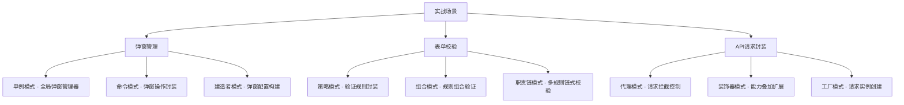

## 一句话概括

设计模式实战是将理论模式应用于具体业务场景的工程实践——通过弹窗管理系统（命令模式+单例模式）、表单校验引擎（策略模式+组合模式）和API请求封装（代理模式+装饰器模式）三个真实案例，展示设计模式如何解决前端开发中的重复性架构问题。

## 背景与意义

设计模式的理论学习往往面临一个尴尬的局面：看书时觉得"懂了"，写代码时却"不会用"。尤其在前端领域，设计模式的教学素材往往以Java/C++的经典场景为例，与前端开发者的日常工作脱节。

这种"理论-实践"的鸿沟，根源在于：**设计模式书籍教的是"解决问题的通用思路"，而不是"前端场景的具体方案"**。

本文的目标就是跨越这个鸿沟。我们将选取三个前端开发中最常见、最核心的场景——弹窗管理、表单校验、API请求封装——用设计模式的视角重写它们的实现。

为什么选这三个场景？

- **弹窗管理**：每个前端项目都有。从简单的alert/confirm，到复杂的嵌套弹窗、步骤弹窗、拖拽弹窗。它们"看起来简单，写起来乱"——这正是设计模式发挥作用的地方。
- **表单校验**：每个前端项目都有。规则越来越多、场景越来越复杂、验证逻辑散落在各个组件的callback中。策略模式为这种问题提供了完美的解决方案。
- **API请求封装**：每个前端项目都有。token注入、重试、缓存、错误处理——如果每个请求都手动处理这些，项目将陷入"样板代码泥潭"。代理模式和装饰器模式能将这些问题隔离为可组合的拦截层。

## 概念与定义

### 三个场景与设计模式的映射



### 为什么需要"模式化"地思考？

对于弹窗、表单、请求这么"常见"的功能，很多人会说：**"这些我早就写过很多遍了，为什么要用设计模式重写？"**

答案在于**规模**。当项目只有3个弹窗时，你不需要设计模式。但当项目发展到50个弹窗，且需要支持嵌套、拖拽、自定义动画、步骤流程时，不用设计模式的代码会在第30个弹窗时崩溃。

设计模式的价值在**复杂度拐点**之后才显现出来——这个拐点通常出现在团队规模超过5人、或项目持续维护超过6个月时。在拐点之前，模式是"负担"；在拐点之后，模式是"救星"。

## 核心知识点拆解

### 一、弹窗管理系统：单例模式 + 命令模式 + 建造者模式

#### 传统弹窗的痛点

大多数项目的弹窗是"用完即弃"的——在需要时创建，关闭时销毁。这在弹窗数量少时没问题，但遇到以下场景就开始出问题：

1. **多个弹窗同时打开**：A弹窗打开时打开B弹窗，关闭A后B的z-index错误
2. **弹窗的撤销与恢复**：用户误操作关闭了弹窗，如何恢复？
3. **弹窗状态的序列化**：页面刷新后，之前打开的弹窗能否恢复？

让我们用设计模式来系统地解决这些问题。

#### 弹窗管理器的命令模式实现

```typescript
// ===== 1. 命令模式：将弹窗操作封装为命令 =====

interface DialogCommand {
  execute(): Promise<string>;  // 返回弹窗ID
  undo(): void;
  readonly name: string;
  readonly timestamp: number;
}

// 弹窗配置建造者
class DialogConfigBuilder {
  private config: Record<string, any> = {
    width: 400,
    height: 300,
    closeOnOverlay: true,
    showClose: true,
    animation: 'fade',
    draggable: false,
    modal: true,
  };

  setTitle(title: string): this {
    this.config.title = title;
    return this;
  }

  setContent(content: string | HTMLElement): this {
    this.config.content = content;
    return this;
  }

  setSize(width: number, height: number): this {
    this.config.width = width;
    this.config.height = height;
    return this;
  }

  setDraggable(draggable: boolean): this {
    this.config.draggable = draggable;
    return this;
  }

  setAnimation(animation: 'fade' | 'slide' | 'scale' | 'none'): this {
    this.config.animation = animation;
    return this;
  }

  setCloseOnOverlay(close: boolean): this {
    this.config.closeOnOverlay = close;
    return this;
  }

  onConfirm(callback: (data?: any) => void): this {
    this.config.onConfirm = callback;
    return this;
  }

  onCancel(callback: () => void): this {
    this.config.onCancel = callback;
    return this;
  }

  build(): DialogConfig {
    return this.config as DialogConfig;
  }
}

// 打开弹窗命令
class OpenDialogCommand implements DialogCommand {
  public readonly timestamp = Date.now();
  public readonly name = 'OpenDialog';

  constructor(
    private dialogManager: DialogManager,
    private config: DialogConfig
  ) {}

  async execute(): Promise<string> {
    return this.dialogManager.open(this.config);
  }

  undo(): void {
    this.dialogManager.closeById(`dialog_${this.timestamp}`);
  }
}

// 关闭弹窗命令
class CloseDialogCommand implements DialogCommand {
  public readonly timestamp = Date.now();
  public readonly name = 'CloseDialog';
  private closedDialogConfig: DialogConfig | null = null;

  constructor(
    private dialogManager: DialogManager,
    private dialogId: string
  ) {}

  async execute(): Promise<string> {
    this.closedDialogConfig = this.dialogManager.getConfig(this.dialogId);
    this.dialogManager.closeById(this.dialogId);
    return this.dialogId;
  }

  undo(): void {
    if (this.closedDialogConfig) {
      this.dialogManager.open(this.closedDialogConfig);
    }
  }
}

// 弹窗管理器（单例 + 命令历史）
class DialogManager {
  private static instance: DialogManager;
  private activeDialogs: Map<string, HTMLElement> = new Map();
  private commandHistory: DialogCommand[] = [];
  private maxHistory = 50;
  private zIndex = 1000;

  private constructor() {
    this.createOverlayContainer();
  }

  static getInstance(): DialogManager {
    if (!DialogManager.instance) {
      DialogManager.instance = new DialogManager();
    }
    return DialogManager.instance;
  }

  private createOverlayContainer(): void {
    if (!document.getElementById('dialog-overlay-container')) {
      const container = document.createElement('div');
      container.id = 'dialog-overlay-container';
      container.style.cssText = `
        position: fixed;
        top: 0;
        left: 0;
        width: 100%;
        height: 100%;
        pointer-events: none;
        z-index: ${this.zIndex};
      `;
      document.body.appendChild(container);
    }
  }

  async open(config: DialogConfig): Promise<string> {
    const dialogId = `dialog_${Date.now()}_${Math.random().toString(36).slice(2, 8)}`;
    this.zIndex++;

    const overlay = this.createOverlay(config, dialogId);
    document.getElementById('dialog-overlay-container')!.appendChild(overlay);
    this.activeDialogs.set(dialogId, overlay);

    // 触发动画
    await this.animateIn(overlay, config.animation);

    return dialogId;
  }

  private createOverlay(config: DialogConfig, dialogId: string): HTMLElement {
    const overlay = document.createElement('div');
    overlay.className = 'dialog-overlay';
    overlay.dataset.dialogId = dialogId;
    overlay.style.cssText = `
      position: fixed;
      top: 0; left: 0;
      width: 100%; height: 100%;
      background: rgba(0, 0, 0, ${config.modal ? 0.5 : 0});
      display: flex;
      align-items: center;
      justify-content: center;
      z-index: ${this.zIndex};
      pointer-events: auto;
      opacity: 0;
      transition: opacity 0.2s ease;
    `;

    // 点击遮罩关闭
    if (config.closeOnOverlay) {
      overlay.addEventListener('click', (e) => {
        if (e.target === overlay) {
          config.onCancel?.();
          this.closeById(dialogId);
        }
      });
    }

    // 创建弹窗主体
    const dialog = document.createElement('div');
    dialog.className = 'dialog-box';
    dialog.style.cssText = `
      background: white;
      border-radius: 8px;
      box-shadow: 0 8px 32px rgba(0,0,0,0.12);
      width: ${config.width}px;
      max-width: 90vw;
      max-height: 85vh;
      overflow: hidden;
      display: flex;
      flex-direction: column;
    `;

    // 标题区域
    const header = document.createElement('div');
    header.className = 'dialog-header';
    header.style.cssText = `
      padding: 16px 24px;
      border-bottom: 1px solid #eee;
      display: flex;
      align-items: center;
      justify-content: space-between;
      cursor: ${config.draggable ? 'move' : 'default'};
    `;
    header.innerHTML = `<h3 style="margin:0;font-size:16px">${config.title || ''}</h3>`;
    
    if (config.showClose) {
      const closeBtn = document.createElement('button');
      closeBtn.innerHTML = '&times;';
      closeBtn.style.cssText = `
        border: none; background: none; font-size: 20px;
        cursor: pointer; padding: 0; line-height: 1;
        color: #999;
      `;
      closeBtn.addEventListener('click', () => {
        config.onCancel?.();
        this.closeById(dialogId);
      });
      header.appendChild(closeBtn);
    }

    // 内容区域
    const body = document.createElement('div');
    body.className = 'dialog-body';
    body.style.cssText = `
      padding: 24px;
      flex: 1;
      overflow-y: auto;
    `;
    if (typeof config.content === 'string') {
      body.innerHTML = config.content;
    } else if (config.content instanceof HTMLElement) {
      body.appendChild(config.content);
    }

    dialog.appendChild(header);
    dialog.appendChild(body);
    overlay.appendChild(dialog);

    // 拖拽支持
    if (config.draggable) {
      this.makeDraggable(dialog, header);
    }

    return overlay;
  }

  private async animateIn(element: HTMLElement, animation: string): Promise<void> {
    switch (animation) {
      case 'fade':
        element.style.opacity = '0';
        requestAnimationFrame(() => {
          element.style.opacity = '1';
        });
        break;
      case 'slide':
        element.style.transform = 'translateY(-20px)';
        element.style.opacity = '0';
        requestAnimationFrame(() => {
          element.style.transform = 'translateY(0)';
          element.style.opacity = '1';
        });
        break;
      default:
        element.style.opacity = '1';
    }
    await new Promise((r) => setTimeout(r, 200));
  }

  private makeDraggable(dialog: HTMLElement, handle: HTMLElement): void {
    let isDragging = false;
    let startX = 0, startY = 0;
    let offsetX = 0, offsetY = 0;

    handle.addEventListener('mousedown', (e) => {
      isDragging = true;
      startX = e.clientX - offsetX;
      startY = e.clientY - offsetY;
      dialog.style.transition = 'none';
    });

    document.addEventListener('mousemove', (e) => {
      if (!isDragging) return;
      offsetX = e.clientX - startX;
      offsetY = e.clientY - startY;
      dialog.style.transform = `translate(${offsetX}px, ${offsetY}px)`;
    });

    document.addEventListener('mouseup', () => {
      isDragging = false;
      dialog.style.transition = '';
    });
  }

  closeById(dialogId: string): void {
    const overlay = this.activeDialogs.get(dialogId);
    if (overlay) {
      overlay.style.opacity = '0';
      setTimeout(() => {
        overlay.remove();
        this.activeDialogs.delete(dialogId);
      }, 200);
    }
  }

  closeAll(): void {
    this.activeDialogs.forEach((_, id) => this.closeById(id));
  }

  getConfig(dialogId: string): DialogConfig | null {
    // 从DOM中恢复配置（简化处理）
    return null;
  }

  executeCommand(command: DialogCommand): Promise<string> {
    this.commandHistory.push(command);
    if (this.commandHistory.length > this.maxHistory) {
      this.commandHistory.shift();
    }
    return command.execute();
  }

  undo(): void {
    const lastCommand = this.commandHistory.pop();
    if (lastCommand) {
      lastCommand.undo();
    }
  }

  get activeCount(): number {
    return this.activeDialogs.size;
  }
}

// ===== 使用 =====
const dialogManager = DialogManager.getInstance();

// 建造者模式构建弹窗配置
const config = new DialogConfigBuilder()
  .setTitle('确认删除')
  .setContent('<p>确定要删除这条记录吗？此操作不可撤销。</p>')
  .setSize(400, 200)
  .setDraggable(true)
  .setAnimation('slide')
  .onConfirm(() => console.log('已确认删除'))
  .onCancel(() => console.log('取消删除'))
  .build();

// 命令模式操作
const openCmd = new OpenDialogCommand(dialogManager, config);
dialogManager.executeCommand(openCmd).then((dialogId) => {
  console.log(`弹窗已打开: ${dialogId}`);
});

// 用户关闭弹窗后，可以通过undo恢复
setTimeout(() => {
  dialogManager.undo();
}, 5000); // 5秒后恢复被关闭的弹窗
```

这个弹窗管理系统的设计模式应用：

- **单例模式**（`DialogManager.getInstance()`）：确保全局只有一个弹窗管理器，统一管理z-index、DOM容器
- **命名模式**（`DialogCommand`）：将"打开弹窗"和"关闭弹窗"封装为命令对象，支持撤销/重做
- **建造者模式**（`DialogConfigBuilder`）：弹窗配置参数多且大部分可选，链式API清晰表达意图

### 二、表单校验引擎：策略模式 + 组合模式

#### 从"散装校验"到"策略引擎"

大多数项目的表单校验是这样的：

```typescript
// ❌ 反模式：散落的校验逻辑
function validateForm(data: any) {
  const errors: Record<string, string> = {};
  
  // 校验逻辑分散在if-else中
  if (!data.username) errors.username = '用户名必填';
  if (data.username && data.username.length < 3) errors.username = '用户名至少3个字符';
  if (!data.email) errors.email = '邮箱必填';
  if (data.email && !/^[^\s@]+@[^\s@]+\.[^\s@]+$/.test(data.email)) {
    errors.email = '邮箱格式不正确';
  }
  if (!data.password) errors.password = '密码必填';
  if (data.password && data.password.length < 8) errors.password = '密码至少8位';
  if (!data.confirmPassword) errors.confirmPassword = '确认密码必填';
  if (data.password !== data.confirmPassword) errors.confirmPassword = '两次密码不一致';
  
  return errors;
}
```

这段代码的问题：
1. **重复**：每个表单都要写类似的 `if !xxx` 逻辑
2. **不可配置**：规则硬编码，不能动态组合
3. **不可测试**：需要构造完整的data对象来测试单个规则
4. **不可扩展**：新增规则要修改函数体

用策略模式重构：

```typescript
// ===== 1. 策略接口 =====
interface ValidationRule {
  name: string;
  message: string;
  validate(value: any, context?: Record<string, any>): boolean;
}

// ===== 2. 具体策略 =====
class RequiredRule implements ValidationRule {
  name = 'required';
  message = '此字段为必填项';

  validate(value: any): boolean {
    if (typeof value === 'string') return value.trim().length > 0;
    if (typeof value === 'number') return !isNaN(value);
    if (Array.isArray(value)) return value.length > 0;
    return value !== null && value !== undefined;
  }
}

class MinLengthRule implements ValidationRule {
  name = 'minLength';
  constructor(
    private min: number,
    message?: string
  ) {
    this.message = message || `最少需要${min}个字符`;
  }
  message: string;

  validate(value: string): boolean {
    return String(value).length >= this.min;
  }
}

class MaxLengthRule implements ValidationRule {
  name = 'maxLength';
  constructor(
    private max: number,
    message?: string
  ) {
    this.message = message || `最多${max}个字符`;
  }
  message: string;

  validate(value: string): boolean {
    return String(value).length <= this.max;
  }
}

class PatternRule implements ValidationRule {
  name = 'pattern';
  constructor(
    private pattern: RegExp,
    message: string
  ) {
    this.message = message;
  }
  message: string;

  validate(value: string): boolean {
    return this.pattern.test(String(value));
  }
}

class EmailRule extends PatternRule {
  constructor(message?: string) {
    super(
      /^[^\s@]+@[^\s@]+\.[^\s@]+$/,
      message || '请输入有效的邮箱地址'
    );
    this.name = 'email';
  }
}

class PhoneRule extends PatternRule {
  constructor(message?: string) {
    super(
      /^1[3-9]\d{9}$/,
      message || '请输入有效的手机号码'
    );
    this.name = 'phone';
  }
}

class CompareRule implements ValidationRule {
  name = 'compare';
  constructor(
    private targetField: string,
    private operator: 'eq' | 'neq' | 'gt' | 'lt',
    message?: string
  ) {
    this.message = message || `与${targetField}不匹配`;
  }
  message: string;

  validate(value: any, context?: Record<string, any>): boolean {
    const targetValue = context?.[this.targetField];
    switch (this.operator) {
      case 'eq': return value === targetValue;
      case 'neq': return value !== targetValue;
      case 'gt': return value > targetValue;
      case 'lt': return value < targetValue;
    }
  }
}

// ===== 3. 规则注册表（工厂） =====
class RuleRegistry {
  private static rules = new Map<string, (...args: any[]) => ValidationRule>();

  static register(name: string, factory: (...args: any[]) => ValidationRule): void {
    RuleRegistry.rules.set(name, factory);
  }

  static create(name: string, ...args: any[]): ValidationRule {
    const factory = RuleRegistry.rules.get(name);
    if (!factory) throw new Error(`不支持的验证规则: ${name}`);
    return factory(...args);
  }
}

// 注册内置规则
RuleRegistry.register('required', () => new RequiredRule());
RuleRegistry.register('minLength', (min: number, msg?: string) => new MinLengthRule(min, msg));
RuleRegistry.register('maxLength', (max: number, msg?: string) => new MaxLengthRule(max, msg));
RuleRegistry.register('email', (msg?: string) => new EmailRule(msg));
RuleRegistry.register('phone', (msg?: string) => new PhoneRule(msg));
RuleRegistry.register('compare', (field: string, op: string, msg?: string) => 
  new CompareRule(field, op as any, msg));

// ===== 4. 字段校验器（组合模式） =====
class FieldValidator {
  private rules: ValidationRule[] = [];
  private asyncValidators: Array<(value: any) => Promise<string | null>> = [];
  private fieldName: string;

  constructor(fieldName: string) {
    this.fieldName = fieldName;
  }

  addRule(rule: ValidationRule): this {
    this.rules.push(rule);
    return this;
  }

  addRules(rules: ValidationRule[]): this {
    this.rules.push(...rules);
    return this;
  }

  addAsyncValidator(validator: (value: any) => Promise<string | null>): this {
    this.asyncValidators.push(validator);
    return this;
  }

  async validate(value: any, context?: Record<string, any>): Promise<string[]> {
    const errors: string[] = [];

    // 同步规则验证
    for (const rule of this.rules) {
      if (!rule.validate(value, context)) {
        errors.push(rule.message);
        if (rule.name === 'required' && !rule.validate(value, context)) {
          // 必填项未通过时，不继续验证其他规则
          break;
        }
      }
    }

    // 异步规则验证（如唯一性检查）
    if (errors.length === 0) {
      for (const validator of this.asyncValidators) {
        const error = await validator(value);
        if (error) errors.push(error);
      }
    }

    return errors;
  }
}

// ===== 5. 表单校验器 =====
class FormValidator {
  private fields = new Map<string, FieldValidator>();
  private data: Record<string, any> = {};

  setField(name: string): FieldValidator {
    const validator = new FieldValidator(name);
    this.fields.set(name, validator);
    return validator;
  }

  setData(data: Record<string, any>): void {
    this.data = data;
  }

  async validate(): Promise<{
    valid: boolean;
    errors: Record<string, string[]>;
  }> {
    const errors: Record<string, string[]> = {};
    let valid = true;

    for (const [fieldName, validator] of this.fields) {
      const fieldErrors = await validator.validate(this.data[fieldName], this.data);
      if (fieldErrors.length > 0) {
        errors[fieldName] = fieldErrors;
        valid = false;
      }
    }

    return { valid, errors };
  }
}

// ===== 6. 使用 =====
function createRegistrationForm() {
  const form = new FormValidator();

  // 用户名：必填，3-20字符，字母数字下划线
  form.setField('username')
    .addRules([
      RuleRegistry.create('required'),
      RuleRegistry.create('minLength', 3),
      RuleRegistry.create('maxLength', 20),
      RuleRegistry.create('pattern', /^[a-zA-Z0-9_]+$/, '只能包含字母数字和下划线'),
    ]);

  // 邮箱：必填，格式校验
  form.setField('email')
    .addRules([
      RuleRegistry.create('required'),
      RuleRegistry.create('email'),
    ]);

  // 密码：必填，最少8位
  form.setField('password')
    .addRules([
      RuleRegistry.create('required'),
      RuleRegistry.create('minLength', 8),
    ]);

  // 确认密码：必填，与密码一致
  form.setField('confirmPassword')
    .addRules([
      RuleRegistry.create('required'),
      RuleRegistry.create('compare', 'password', 'eq', '两次密码不一致'),
    ]);

  return form;
}

// 使用
const form = createRegistrationForm();

form.setData({
  username: 'abc',
  email: 'test@',
  password: '12345678',
  confirmPassword: '87654321',
});

form.validate().then((result) => {
  console.log('验证结果:', result);
  // {
  //   valid: false,
  //   errors: {
  //     email: ['请输入有效的邮箱地址'],
  //     confirmPassword: ['两次密码不一致']
  //   }
  // }
});

// 还可以轻松扩展自定义规则
RuleRegistry.register('strongPassword', (msg?: string) => ({
  name: 'strongPassword',
  message: msg || '密码必须包含大写字母、小写字母和数字',
  validate(value: string): boolean {
    return /[A-Z]/.test(value) && /[a-z]/.test(value) && /[0-9]/.test(value);
  },
}));
```

这个表单校验引擎的核心设计模式：

- **策略模式**（`ValidationRule`）：每种校验规则封装为一个独立的策略类，可自由组合
- **工厂模式**（`RuleRegistry`）：通过注册表创建规则实例，支持动态扩展新规则
- **组合模式**（`FieldValidator` + `FormValidator`）：字段级验证器组合成表单级验证器，对外暴露一致的`validate()`接口

### 三、API请求封装：代理模式 + 装饰器模式

#### 从"散装请求"到"可组合的请求管道"

```typescript
// ===== 1. 基础类型定义 =====
interface RequestConfig {
  url: string;
  method: 'GET' | 'POST' | 'PUT' | 'DELETE' | 'PATCH';
  headers?: Record<string, string>;
  params?: Record<string, any>;
  data?: any;
  timeout?: number;
  responseType?: 'json' | 'text' | 'blob' | 'arraybuffer';
}

interface Response<T = any> {
  data: T;
  status: number;
  headers: Record<string, string>;
  duration: number; // 请求耗时(ms)
}

interface RequestInterceptor {
  onRequest(config: RequestConfig): RequestConfig | Promise<RequestConfig>;
  onError?(error: Error): void;
}

interface ResponseInterceptor {
  onResponse<T>(response: Response<T>): Response<T> | Promise<Response<T>>;
  onError?(error: Error): void;
}

// ===== 2. 基础HTTP客户端（使用fetch） =====
class HttpClient {
  async request<T = any>(config: RequestConfig): Promise<Response<T>> {
    const startTime = performance.now();

    const { url, method, headers, params, data, timeout = 10000 } = config;

    // 构建URL
    const urlObj = new URL(url);
    if (params) {
      Object.entries(params).forEach(([key, value]) => {
        urlObj.searchParams.append(key, String(value));
      });
    }

    // 使用AbortController实现超时
    const controller = new AbortController();
    const timeoutId = setTimeout(() => controller.abort(), timeout);

    try {
      const response = await fetch(urlObj.toString(), {
        method,
        headers: {
          'Content-Type': 'application/json',
          ...headers,
        },
        body: data ? JSON.stringify(data) : undefined,
        signal: controller.signal,
      });

      clearTimeout(timeoutId);

      const responseData = config.responseType === 'text'
        ? await response.text()
        : await response.json();

      return {
        data: responseData,
        status: response.status,
        headers: Object.fromEntries(response.headers.entries()),
        duration: performance.now() - startTime,
      };
    } catch (error: any) {
      clearTimeout(timeoutId);
      throw error;
    }
  }
}

// ===== 3. 代理模式：拦截器链 =====
class RequestProxy {
  private client: HttpClient;
  private requestInterceptors: RequestInterceptor[] = [];
  private responseInterceptors: ResponseInterceptor[] = [];

  constructor(client: HttpClient) {
    this.client = client;
  }

  useRequestInterceptor(interceptor: RequestInterceptor): () => void {
    this.requestInterceptors.push(interceptor);
    return () => {
      const index = this.requestInterceptors.indexOf(interceptor);
      if (index !== -1) this.requestInterceptors.splice(index, 1);
    };
  }

  useResponseInterceptor(interceptor: ResponseInterceptor): () => void {
    this.responseInterceptors.push(interceptor);
    return () => {
      const index = this.responseInterceptors.indexOf(interceptor);
      if (index !== -1) this.responseInterceptors.splice(index, 1);
    };
  }

  async request<T = any>(config: RequestConfig): Promise<Response<T>> {
    // 请求拦截器链（从后往前执行）
    let processedConfig = { ...config };
    for (let i = this.requestInterceptors.length - 1; i >= 0; i--) {
      try {
        processedConfig = await this.requestInterceptors[i].onRequest(processedConfig);
      } catch (error: any) {
        this.requestInterceptors[i].onError?.(error);
        throw error;
      }
    }

    // 执行请求
    let response: Response<T>;
    try {
      response = await this.client.request<T>(processedConfig);
    } catch (error: any) {
      // 让响应拦截器处理错误
      for (const interceptor of [...this.responseInterceptors].reverse()) {
        interceptor.onError?.(error);
      }
      throw error;
    }

    // 响应拦截器链（从前往后执行）
    for (const interceptor of this.responseInterceptors) {
      try {
        response = await interceptor.onResponse(response);
      } catch (error: any) {
        interceptor.onError?.(error);
        throw error;
      }
    }

    return response;
  }
}

// ===== 4. 装饰器模式：扩展功能 =====

// 装饰器：添加Token认证
class AuthDecorator implements RequestInterceptor {
  constructor(private getToken: () => string | null) {}

  onRequest(config: RequestConfig): RequestConfig {
    const token = this.getToken();
    if (token) {
      return {
        ...config,
        headers: {
          ...config.headers,
          'Authorization': `Bearer ${token}`,
        },
      };
    }
    return config;
  }

  onError(error: Error): void {
    if (error.message.includes('401')) {
      // Token过期，触发重新登录
      console.warn('[Auth] Token已过期，请重新登录');
      window.dispatchEvent(new CustomEvent('auth:expired'));
    }
  }
}

// 装饰器：请求重试
class RetryDecorator implements RequestInterceptor {
  constructor(
    private maxRetries = 3,
    private retryDelay = 1000,
    private shouldRetry: (error: any) => boolean = (err) => {
      // 默认只重试网络错误和5xx
      return err.name === 'TypeError' || // 网络错误
             err.status >= 500 || // 服务端错误
             err.name === 'AbortError'; // 超时
    }
  ) {}

  async onRequest(config: RequestConfig): Promise<RequestConfig> {
    return config; // 请求本身不需要处理
  }

  // 注意：重试逻辑应该在响应拦截器中使用
  // 这里简化处理
}

// 装饰器：请求日志
class LoggingDecorator implements RequestInterceptor, ResponseInterceptor {
  onRequest(config: RequestConfig): RequestConfig {
    console.log(`[HTTP] --> ${config.method} ${config.url}`, config.params || config.data || '');
    return config;
  }

  onResponse<T>(response: Response<T>): Response<T> {
    console.log(
      `[HTTP] <-- ${response.status} (${response.duration.toFixed(0)}ms)`
    );
    return response;
  }

  onError(error: Error): void {
    console.error(`[HTTP] Error:`, error);
  }
}

// 装饰器：缓存
class CacheDecorator implements RequestInterceptor, ResponseInterceptor {
  private cache = new Map<string, { data: any; expiresAt: number }>();
  private ttl: number;

  constructor(ttlMs = 60000) {
    this.ttl = ttlMs;
  }

  getCacheKey(config: RequestConfig): string {
    return `${config.method}:${config.url}:${JSON.stringify(config.params)}`;
  }

  onRequest(config: RequestConfig): RequestConfig {
    // GET请求可以读取缓存
    if (config.method === 'GET') {
      const cacheKey = this.getCacheKey(config);
      const cached = this.cache.get(cacheKey);
      if (cached && cached.expiresAt > Date.now()) {
        console.log(`[Cache] HIT: ${config.url}`);
        // 抛出一个"已经缓存"的信号
        throw { __cached: true, data: cached.data };
      }
    }
    return config;
  }

  onResponse<T>(response: Response<T>): Response<T> {
    // 缓存GET请求的响应
    return response;
  }

  setCache(config: RequestConfig, data: any): void {
    if (config.method === 'GET') {
      const cacheKey = this.getCacheKey(config);
      this.cache.set(cacheKey, { data, expiresAt: Date.now() + this.ttl });
    }
  }

  clearCache(): void {
    this.cache.clear();
  }
}

// ===== 5. 构建生产级API客户端 =====
class ApiClient {
  private proxy: RequestProxy;
  private cacheDecorator: CacheDecorator;
  private loggingDecorator: LoggingDecorator;
  private authDecorator: AuthDecorator;

  constructor() {
    const httpClient = new HttpClient();
    this.proxy = new RequestProxy(httpClient);

    this.loggingDecorator = new LoggingDecorator();
    this.cacheDecorator = new CacheDecorator(60000);
    this.authDecorator = new AuthDecorator(() => localStorage.getItem('auth_token'));

    // 注册拦截器（注意顺序：写在前面的先处理请求，后处理响应）
    this.proxy.useRequestInterceptor(this.loggingDecorator);
    this.proxy.useResponseInterceptor(this.loggingDecorator);

    this.proxy.useRequestInterceptor(this.authDecorator);

    // 缓存装饰器在请求阶段提前返回，在响应阶段存储
    this.proxy.useRequestInterceptor(this.cacheDecorator);
    this.proxy.useResponseInterceptor(this.cacheDecorator);

    // Token刷新拦截器
    this.proxy.useResponseInterceptor({
      onResponse: async (response) => {
        if (response.status === 401) {
          // 尝试刷新Token
          const newToken = await this.refreshToken();
          if (newToken) {
            localStorage.setItem('auth_token', newToken);
          }
        }
        return response;
      },
      onError: (error) => {
        if (error.status === 401) {
          console.warn('认证失败，请重新登录');
        }
      },
    });
  }

  private async refreshToken(): Promise<string | null> {
    const refreshToken = localStorage.getItem('refresh_token');
    if (!refreshToken) return null;

    try {
      const response = await fetch('/api/auth/refresh', {
        method: 'POST',
        headers: { 'Content-Type': 'application/json' },
        body: JSON.stringify({ refreshToken }),
      });
      const data = await response.json();
      return data.accessToken;
    } catch {
      return null;
    }
  }

  async get<T>(url: string, params?: Record<string, any>): Promise<T> {
    const response = await this.proxy.request<T>({ url, method: 'GET', params });
    return response.data;
  }

  async post<T>(url: string, data?: any): Promise<T> {
    const response = await this.proxy.request<T>({ url, method: 'POST', data });
    return response.data;
  }

  async put<T>(url: string, data?: any): Promise<T> {
    const response = await this.proxy.request<T>({ url, method: 'PUT', data });
    return response.data;
  }

  async delete<T>(url: string): Promise<T> {
    const response = await this.proxy.request<T>({ url, method: 'DELETE' });
    return response.data;
  }
}

// ===== 6. 使用 =====
const api = new ApiClient();

// 业务代码只需要关心"我要调什么API"，不需要关心Token、日志、缓存
async function loadDashboard() {
  try {
    const [user, stats, notifications] = await Promise.all([
      api.get<User>('/api/users/me'),
      api.get<Stats>('/api/dashboard/stats'),
      api.get<Notification[]>('/api/notifications'),
    ]);

    return { user, stats, notifications };
  } catch (error) {
    console.error('加载仪表盘失败:', error);
    showErrorMessage('数据加载失败');
  }
}
```

这个API客户端的设计模式应用：

- **代理模式**（`RequestProxy`）：在真实HTTP请求前后插入拦截器链，控制了请求的"何时发送"和"如何发送"
- **装饰器模式**（`AuthDecorator`、`LoggingDecorator`、`CacheDecorator`）：每个装饰器只做一件事，通过"注册到拦截器链"来叠加功能。新增功能不需要修改现有代码

## 实战案例

### 三个模式在同一个应用中的协同

在实际项目中，弹窗、表单、API请求不是孤立的。让我们看一个综合场景，展示它们如何协同工作。

```typescript
// ===== 综合场景：用户注册流程 =====

async function handleUserRegistration(data: RegistrationFormData) {
  // 1. 表单验证（策略模式）
  const form = createRegistrationForm();
  form.setData(data);
  const validation = await form.validate();

  if (!validation.valid) {
    // 验证失败，弹窗显示错误（命令模式 + 建造者模式）
    const errorMessage = Object.entries(validation.errors)
      .map(([field, msgs]) => `<p><strong>${field}:</strong> ${msgs.join('; ')}</p>`)
      .join('');

    const dialogManager = DialogManager.getInstance();
    const openCmd = new OpenDialogCommand(
      dialogManager,
      new DialogConfigBuilder()
        .setTitle('表单验证失败')
        .setContent(`<div class="error-messages">${errorMessage}</div>`)
        .setSize(420, 300)
        .setAnimation('fade')
        .build()
    );
    await dialogManager.executeCommand(openCmd);
    return;
  }

  // 2. 显示加载弹窗
  const dialogManager = DialogManager.getInstance();
  const loadingDialogId = await dialogManager.executeCommand(
    new OpenDialogCommand(
      dialogManager,
      new DialogConfigBuilder()
        .setTitle('注册中...')
        .setContent('<div class="loading-spinner">正在创建您的账号...</div>')
        .setSize(300, 150)
        .setCloseOnOverlay(false)
        .showClose(false)
        .build()
    )
  );

  // 3. 发送注册请求（代理模式 + 装饰器模式）
  try {
    const result = await api.post<{ userId: string }>('/api/users/register', data);

    // 4. 注册成功，关闭加载弹窗，显示成功提示
    dialogManager.closeById(loadingDialogId);
    dialogManager.executeCommand(
      new OpenDialogCommand(
        dialogManager,
        new DialogConfigBuilder()
          .setTitle('注册成功')
          .setContent(`<p>您的账号已创建成功！用户ID: ${result.userId}</p>`)
          .setSize(400, 200)
          .setDraggable(true)
          .onConfirm(() => window.location.href = '/login')
          .build()
      )
    );
  } catch (error: any) {
    // 5. 注册失败，关闭加载弹窗，显示错误
    dialogManager.closeById(loadingDialogId);
    
    // 错误信息可能来自服务端验证或网络错误
    const errorContent = error.status === 400
      ? `<p>${error.data?.message || '输入数据有误'}</p>`
      : '<p>网络异常，请稍后重试</p>';

    dialogManager.executeCommand(
      new OpenDialogCommand(
        dialogManager,
        new DialogConfigBuilder()
          .setTitle('注册失败')
          .setContent(errorContent)
          .setAnimation('slide')
          .build()
      )
    );
  }
}
```

这个综合案例展示了三种设计模式在同一个流程中的无缝协作：

- **策略模式**确保发送到服务端的数据已经过完整验证
- **代理模式**确保请求携带了Token，且具备日志和重试能力
- **命令模式**+**单例模式**确保弹窗的打开、关闭、撤销行为统一且可追踪

当业务逻辑（注册流程）与基础设施（弹窗管理、表单校验、API请求）通过设计模式解耦后，每个部分都可以独立演化和测试。

## 底层原理

### 为什么设计模式能解决"重复"问题？

设计模式解决重复问题的底层原理是**"变化点隔离"**——将代码中"不变的部分"和"变化的部分"分开。

以表单校验为例：
- **不变的部分**：校验的流程（获取值 → 执行规则 → 收集错误 → 返回结果）
- **变化的部分**：具体规则（required、email、phone……）、规则组合方式

策略模式做的就是：**把变化的部分（规则）提取为独立的对象，让不变的部分（校验流程）去调用它们**。

类似地：
- **弹窗管理**：不变的是"打开→显示→关闭"的流程，变化的是弹窗的配置（标题、内容、大小、动画）
- **API请求**：不变的是"发送请求→接收响应"的流程，变化的是拦截器（Token、日志、缓存、重试）

"变化点隔离"的终极效果是：**新增功能时，你只需要添加新的策略/拦截器/命令，而不是修改现有的代码**。这正是"开闭原则"在实践中的体现。

## 高频面试题解析

### Q1: 在实际项目中，你什么时候会选择用设计模式，什么时候觉得"写个简单函数就够了"？

**最佳回答**：
这是一个非常实际的问题。判断标准可以用"**复杂度预见性**"来衡量：

**用设计模式**当满足多个条件：
1. 这个功能大概率会**有3种以上的变体**（3种以上的校验规则、3种以上的弹窗类型）
2. 不同变体之间**需要自由组合**
3. **团队中多人需要维护**这段代码
4. 预估的**生命周期超过6个月**

**简单函数就够了**当满足多个条件：
1. 功能只有1~2种变体
2. 组合关系固定（一个if-else就够）
3. 功能由一个人临时维护
4. 生命周期短于3个月

一个经验法则：**"如果我有三次想'再加一个if'的冲动，就该考虑重构为策略模式了"**。

### Q2: 弹窗管理器的单例模式可能会有什么问题？如何解决？

**最佳回答**：
单例模式的问题主要是**"隐藏的耦合"和"测试困难"**。

**问题1：隐式依赖**
```typescript
// 组件中直接引用单例
function MyComponent() {
  const handleClick = () => {
    DialogManager.getInstance().open(config);
    // 这个调用隐式依赖了全局DialogManager实例
    // 如果在测试环境中没有初始化，会出问题
  };
}
```

解决方案：**依赖注入**。
```typescript
// 通过props或context注入弹窗管理器
function MyComponent({ dialogManager }: { dialogManager: DialogManager }) {
  const handleClick = () => {
    dialogManager.open(config);
  };
}

// 组件不知道它是单例还是Mock
// 测试时可以注入Mock实例
```

**问题2：状态污染**
单例的状态在测试之间无法自动重置。测试A打开了一个弹窗，测试B继承了这个弹窗状态，导致测试B失败。

解决方案：在`getInstance()`中添加可选的reset机制，或在测试中重新创建实例（放弃单例约束）。

```typescript
class DialogManager {
  static reset(): void {
    DialogManager.instance?.closeAll();
    DialogManager.instance = null;
  }
}

// 测试代码
beforeEach(() => {
  DialogManager.reset(); // 每次测试前重置
});
```

### Q3: 策略模式和if-else有什么区别？性能上有差异吗？

**最佳回答**：
策略模式本质上是**"去掉if-else的面向对象方案"**，但它不是"消灭"if-else，而是将if-else的决策逻辑从客户端代码中移动到**对象创建阶段**。

```typescript
// if-else版本：决策发生在每次调用
function validate(value: any, type: string) {
  if (type === 'email') { /* ... */ }
  else if (type === 'phone') { /* ... */ }
  // 每次调用都经过if-else
}

// 策略版本：决策只发生一次（创建策略时）
const strategy = RuleRegistry.create('email');
// 每次调用时直接执行策略，没有if-else
strategy.validate(value);
```

**性能差异**：策略模式在运行时调用比if-else略慢（函数间接调用 vs 分支预测），但这个差异通常在纳秒级别，完全可忽略。策略模式真正的性能优势在于**代码分析和测试阶段**——单个策略类的测试不需要加载整个if-else链。

### Q4: 请求拦截器和装饰器模式是什么关系？

**最佳回答**：
请求拦截器链（Request Interceptor Chain）是**装饰器模式的变体**。两者都是"包装"原对象来添加功能，但调用方式不同：

**标准装饰器模式**：装饰器嵌套调用，内层装饰器调用外层装饰器：

```typescript
// 标准装饰器：嵌套调用
const client = new LoggingDecorator(
  new AuthDecorator(
    new CacheDecorator(
      new HttpClient()
    )
  )
);
client.request(config); // Logging → Auth → Cache → HttpClient
```

**拦截器链**：拦截器顺序执行，形成一个"管道"：

```typescript
// 拦截器链：数组顺序执行
proxy.use(new LoggingInterceptor());
proxy.use(new AuthInterceptor());
proxy.use(new CacheInterceptor());
proxy.request(config); // Logging → Auth → Cache → HttpClient
```

拦截器链的优势是**运行时动态增删**，装饰器模式的优势是**类型安全和静态组合**。在TypeScript项目中，装饰器模式更适合编译时确定的扩展，拦截器链更适合运行时动态变化的扩展。

### Q5: 如果让你设计一个"可插拔"的表单校验系统，你会怎么做？

**最佳回答**：
"可插拔"的核心是**统一接口 + 注册机制**。我会分层设计：

```
第1层 - 规则注册表（工厂模式）
  提供注册接口，接受"规则名称→创建函数"的映射
  支持第三方插件注册自定义规则

第2层 - 规则执行引擎（组合模式+职责链模式）
  支持字段级规则组合（required + minLength + email）
  支持链式规则验证（第一条失败可终止后续验证）
  支持异步规则（远程唯一性检查）

第3层 - 模板系统（策略模式）
  预置常用表单模板：登录表单、注册表单、支付表单
  模板是"字段名→规则集合"的配置对象

第4层 - 集成层
  与UI框架（Ant Design、Element Plus）的适配器
  触发时机（onChange / onBlur / onSubmit）的配置
  错误展示的自定义渲染
```

"可插拔"的设计核心是不在代码中硬编码任何规则，所有规则都通过注册机制加入。这样的系统，社区可以扩展、公司内部可以扩展、个人项目也可以扩展——并且都是通过同一个接口。

## 总结与扩展

本文通过三个前端真实场景，展示了设计模式从理论到实践的完整映射：

1. **弹窗管理系统**中，单例模式确保全局唯一的弹窗管理、命令模式支持弹窗操作的撤销重做、建造者模式让弹窗配置更加优雅。

2. **表单校验引擎**中，策略模式将每个验证规则封装为独立的策略类、组合模式将字段级验证组合为表单级验证、工厂模式让规则的创建与使用分离。

3. **API请求封装**中，代理模式构建拦截器链控制请求的生命周期、装饰器模式将跨切面关注点（认证、日志、缓存）分解为独立的装饰器。

三个案例共同揭示了一个道理：**设计模式不是"炫技"，而是"边界管理"**。好的设计模式应用，是在"变化的部分"和"不变的部分"之间划出清晰的边界，让两端可以独立演化。

实践中需要注意的几点：
- **不要过早引入模式**：代码复杂度没到拐点时，简单的函数更合适
- **模式不是银弹**：每个模式有自己的适用场景和trade-off
- **前端特有的模式变体**：拦截器、Hooks、Composition API都是经典模式的前端化变体
- **模式会演进**：今天的最佳实践，明天的历史包袱，保持迭代思维
