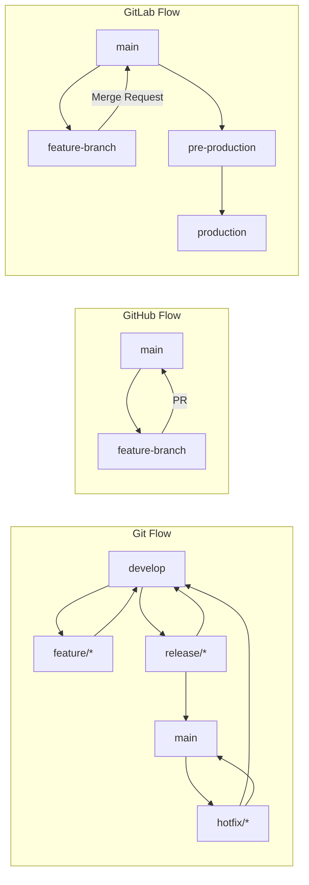
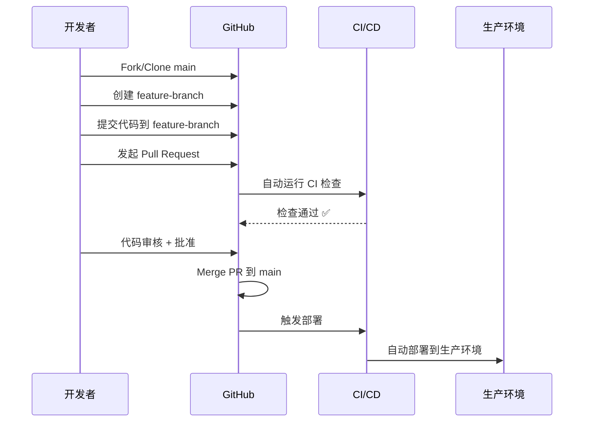
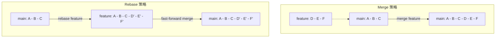
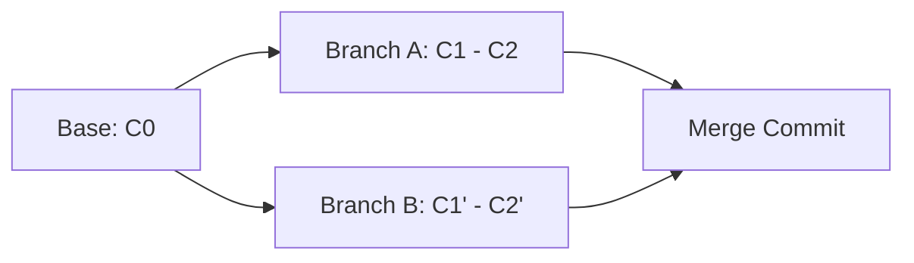

## 一句话概括

Git工作流本质上是"**团队对版本控制过程中的分支策略、合并时机、发布节奏和提交规范的共识**"，它解决的核心问题不是技术问题，而是"在多人同时开发多个功能时，如何保证代码变更有序、可追溯、可回滚"的协作问题。

## 背景与意义

### 从SVN到Git的协作模式变迁

在SVN时代，分支是"重"操作——创建分支需要复制整个目录结构，合并分支更是噩梦。这使得团队习惯"主干开发"模式：所有人在 `trunk` 上工作，遇到发布就拉一个 `tags/release-v1.0`。

Git的出现彻底改变了这一切。它的分支是轻量级的指针（38字节的引用），创建和销毁几乎零成本，merge和rebase的算法比SVN精确得多。但"工具能力"和"协作效率"之间还有一条巨大的鸿沟——**工作流（Workflow）的规范化**试图填平这道鸿沟。

### 为什么需要规范的工作流？

没有工作流规范的Git项目，最常见的症状是：

- 有人直接在 `main` 分支上commit修改
- 有人把3个不相关的功能混在一个分支上
- Release分支上发现了bug，修完bug后merge不回去
- `git log` 里全是"fix bug"、"update"、"改了点东西"
- 回滚一个功能时发现无法干净回滚（因为和另一个功能的代码交错在一起）

工作流规范不是"管控开发者的自由"，而是**确保代码变更的每个操作都有迹可循**。在《持续交付》一书中，Jez Humble强调："版本控制的黄金法则是——任何一次提交都应该能够被独立部署。"

## 概念与定义

### 三大主流工作流

目前业界有三个被广泛采用的Git工作流模型：



| 工作流 | 分支数量 | 适合场景 | 复杂度 |
|--------|---------|---------|--------|
| GitHub Flow | 2个永久分支（main + feature） | 持续部署的Web应用 | ⭐ 低 |
| Git Flow | 3-5个永久分支 | 有固定版本的发布维护 | ⭐⭐⭐ 高 |
| GitLab Flow | 2-3个永久分支 | 需要环境隔离的企业应用 | ⭐⭐ 中 |

### Conventional Commits 规范

Conventional Commits是工作流与语义版本号的"粘合剂"：

```
<type>(<scope>): <subject>

<body>

<footer>
```

常见的类型：

| Type | 含义 | 是否影响版本号 |
|------|------|---------------|
| `feat` | 新功能 | 小版本（MINOR） |
| `fix` | Bug修复 | 补丁版本（PATCH） |
| `BREAKING CHANGE` | 破坏性变更 | 主版本（MAJOR） |
| `docs` | 文档变更 | 不发布 |
| `refactor` | 重构 | 不发布 |
| `perf` | 性能优化 | 补丁版本 |
| `test` | 测试 | 不发布 |
| `ci` | CI配置 | 不发布 |

## 最小示例

### 模拟Git Flow工作流

```bash
# 1. 初始化仓库
mkdir git-flow-demo && cd git-flow-demo
git init

# 2. 创建main分支的初始提交
echo "# My Project" > README.md
git add README.md
git commit -m "chore: initial commit"

# 3. 创建develop分支（功能开发的分支）
git checkout -b develop main

echo "console.log('Hello App');" > app.js
git add app.js
git commit -m "chore: setup app entry"

# 4. 从develop分支创建feature分支
git checkout -b feature/user-auth develop

# 5. 在feature分支上开发
echo "function login(email, password) { /* ... */ }" > auth.js
git add auth.js
git commit -m "feat(auth): add login function"

echo "function register(user) { /* ... */ }" >> auth.js
git add auth.js
git commit -m "feat(auth): add register function"

# 6. 完成feature开发，合并回develop
git checkout develop
git merge --no-ff feature/user-auth -m "feat: complete user auth feature"
# --no-ff 保留分支历史

# 7. 准备发布release
git checkout -b release/1.0.0 develop

# 更新版本号
echo "v1.0.0" > VERSION
git add VERSION
git commit -m "chore(release): bump version to 1.0.0"

# 8. 将release合并到main
git checkout main
git merge --no-ff release/1.0.0 -m "release: v1.0.0"
git tag -a v1.0.0 -m "Version 1.0.0 - user auth feature"

# 9. 将release合并回develop
git checkout develop
git merge --no-ff release/1.0.0 -m "chore: merge release 1.0.0 back to develop"

# 10. 模拟hotfix
git checkout -b hotfix/1.0.1 main

echo "fixed" >> auth.js
git add auth.js
git commit -m "fix(auth): fix login validation issue"

git checkout main
git merge --no-ff hotfix/1.0.1 -m "fix: version 1.0.1 hotfix"
git tag -a v1.0.1 -m "Version 1.0.1"
```

查看分支图：

```bash
git log --graph --all --oneline --decorate
```

输出：

```
*   81f3a2b (HEAD -> main, tag: v1.0.1) fix: version 1.0.1 hotfix
|\  
| * c9a5e12 (hotfix/1.0.1) fix(auth): fix login validation issue
|/  
*   e7b3c8a (tag: v1.0.0) release: v1.0.0
|\  
| | * ba3f123 (develop) chore: merge release 1.0.0 back to develop
| |/  
|/|   
* | 4d2e1f7 (release/1.0.0) chore(release): bump version to 1.0.0
| |\  
| | * c7f8912 (feature/user-auth) feat(auth): add register function
| | * a1b2c3d feat(auth): add login function
|/ /  
* | 5e6f7g8 chore: setup app entry
* | 9a8b7c6 (initial) chore: initial commit
```

## 核心知识点拆解

### 1. Git Flow的复杂性管理

Git Flow使用多个永久性分支来解决不同类型变更的隔离问题：

- **master/main**：只保存可发布的代码，不接受功能开发
- **develop**：日常开发的主线，所有功能分支合并到这里
- **feature/***：从develop分出的功能开发分支，完成后合并回develop
- **release/***：从develop分出的准备发布分支，只做最后的修复和版本号更新
- **hotfix/***：从master分出的紧急修复分支，修复后同时合并回master和develop

**Git Flow的最大优势**是"清晰的变更分类"：功能开发、发布准备、紧急修复在分支层面就做了隔离。**最大劣势**是"过重"——对于持续部署（每天多次发布）的项目来说，创建release分支、合并回develop等操作显得冗余。

**Git Flow的适用条件**：

- 项目有明确的版本号（如移动App、npm包）
- 发布周期固定（如每2周一个版本）
- 需要同时维护多个版本（如v1.x线和v2.x线）

### 2. GitHub Flow的轻量化简

GitHub Flow在2011年由Scott Chacon提出，核心原则是：

1. `main` 分支上的代码**始终是可部署的**
2. 每个功能从 `main` 创建新分支进行开发
3. 开发完成后通过Pull Request发起审核
4. 审核通过后合并到 `main` 并立即部署



**关于code review**：GitHub Flow中，Pull Request不仅仅是"合并前审核"——它还是一个"文档化的决策记录"。每个PR包含了你做了什么、为什么做、如何做的完整讨论，这比任何文档都更有价值。

### 3. Conventional Commits与语义版本

Conventional Commits与semver的自动关联，是现代CI/CD的基石：

```javascript
// standard-version 自动计算版本号
// 输入: git log 中的 commit 信息
// 输出: 自动化 bump 版本号

// 分析提交历史
const commits = [
  { type: 'feat', breaking: false },   // MINOR
  { type: 'fix', breaking: false },     // PATCH
  { type: 'feat', breaking: true },     // MAJOR
  { type: 'refactor', breaking: false }, // 不触发版本变更
];

// 自动计算下一个版本号
function getNextVersion(current, commits) {
  const semver = require('semver');
  
  let [major, minor, patch] = current.split('.').map(Number);
  
  const hasBreaking = commits.some(c => c.breaking);
  const hasFeature = commits.some(c => c.type === 'feat');
  const hasFix = commits.some(c => c.type === 'fix');
  
  if (hasBreaking) {
    // BREAKING CHANGE 触发主版本号变更
    major += 1;
    minor = 0;
    patch = 0;
  } else if (hasFeature) {
    // feat 触发次版本号变更
    minor += 1;
    patch = 0;
  } else if (hasFix) {
    // fix 触发补丁版本号变更
    patch += 1;
  }
  
  return `${major}.${minor}.${patch}`;
}

console.log(getNextVersion('1.2.3', commits)); // 2.0.0
```

### 4. Rebase vs Merge 的选择

这是每个Git团队都会面临的核心争论：



**Merge**（`--no-ff`）保留分支历史，清晰展示"什么功能在什么时间被合并"。缺点是日志变复杂。

**Rebase** 让历史变成线性，更整洁。但**永远不要在公共分支上rebase**：rebase会改写提交历史，如果别人已基于你的分支工作，rebase会导致他们本地的提交历史与远程冲突。

**实践建议**：

- 在个人分支（feature/xxx）上随意用rebase
- 在公共分支（develop/main）上永远使用merge（推荐 `--no-ff`）
- 在release分支上使用merge，保留发布准备的痕迹

## 实战案例

### 场景：自动化版本发布与CHANGELOG生成

```javascript
// scripts/release.js - 自动化发布脚本
const { execSync } = require('child_process');
const semver = require('semver');

function release(type = 'patch') {
  // 1. 检查当前分支
  const branch = execSync('git rev-parse --abbrev-ref HEAD').toString().trim();
  if (branch !== 'develop') {
    console.error('❌ 发布必须从 develop 分支执行');
    process.exit(1);
  }

  // 2. 检查工作区是否干净
  const status = execSync('git status --porcelain').toString().trim();
  if (status) {
    console.error('❌ 工作区不干净，请先提交所有修改');
    process.exit(1);
  }

  // 3. 读取当前版本号
  const currentVersion = require('../package.json').version;
  
  // 4. 从commit信息分析版本
  const log = execSync(`git log $(git describe --tags --abbrev=0)..HEAD --oneline`).toString();
  const breaksBreaking = log.match(/BREAKING CHANGE/i);
  const hasFeat = log.match(/^feat/m);
  const hasFix = log.match(/^fix/m);
  
  let newVersion;
  if (breaksBreaking) newVersion = semver.inc(currentVersion, 'major');
  else if (hasFeat) newVersion = semver.inc(currentVersion, 'minor');
  else if (hasFix) newVersion = semver.inc(currentVersion, 'patch');
  else newVersion = semver.inc(currentVersion, 'patch'); // 默认
  
  console.log(`📦 当前版本: ${currentVersion} → ${newVersion}`);

  // 5. 创建release分支
  execSync(`git checkout -b release/${newVersion} develop`, { stdio: 'inherit' });
  
  // 6. 更新package.json版本
  const pkg = require('../package.json');
  pkg.version = newVersion;
  require('fs').writeFileSync('package.json', JSON.stringify(pkg, null, 2) + '\n');
  
  execSync('git add package.json', { stdio: 'inherit' });
  execSync(`git commit -m "chore(release): bump version to ${newVersion}"`, { stdio: 'inherit' });
  
  // 7. 自动生成CHANGELOG
  const changelog = generateChangelog(currentVersion, newVersion);
  require('fs').writeFileSync('CHANGELOG.md', changelog);
  execSync('git add CHANGELOG.md', { stdio: 'inherit' });
  execSync(`git commit -m "docs: update CHANGELOG for ${newVersion}"`, { stdio: 'inherit' });
  
  // 8. 合并到main并打tag
  execSync('git checkout main', { stdio: 'inherit' });
  execSync(`git merge --no-ff release/${newVersion} -m "release: v${newVersion}"`, { stdio: 'inherit' });
  execSync(`git tag -a v${newVersion} -m "Version ${newVersion}"`, { stdio: 'inherit' });
  
  // 9. 合并回develop
  execSync('git checkout develop', { stdio: 'inherit' });
  execSync(`git merge --no-ff release/${newVersion} -m "chore: merge release ${newVersion} back to develop"`, { stdio: 'inherit' });
  
  // 10. 删除release分支
  execSync(`git branch -d release/${newVersion}`, { stdio: 'inherit' });
  
  // 11. 推送
  console.log('\n🚀 推送所有分支和标签到远程...');
  execSync('git push origin main --tags', { stdio: 'inherit' });
  execSync('git push origin develop', { stdio: 'inherit' });
  
  console.log(`\n✅ 版本 ${newVersion} 发布完成！`);
}

function generateChangelog(oldVersion, newVersion) {
  // 获取两个版本之间的所有commit
  const log = execSync(`git log v${oldVersion}..HEAD --format="%s (%h) [%an]"`).toString();
  
  const entries = log.split('\n').filter(Boolean);
  
  const categories = {
    feat: [],
    fix: [],
    docs: [],
    refactor: [],
    perf: [],
    chore: [],
  };
  
  entries.forEach(entry => {
    const match = entry.match(/^(feat|fix|docs|refactor|perf|chore)(\(.*?\))?:\s(.+?)(?:\s\(|$)/);
    if (match) {
      categories[match[1]]?.push(`  - ${match[3]}`);
    } else {
      categories.chore.push(`  - ${entry}`);
    }
  });
  
  let changelog = `# CHANGELOG\n\n## v${newVersion} (${new Date().toISOString().split('T')[0]})\n\n`;
  
  if (categories.feat.length) changelog += '### ✨ Features\n' + categories.feat.join('\n') + '\n\n';
  if (categories.fix.length) changelog += '### 🐛 Bug Fixes\n' + categories.fix.join('\n') + '\n\n';
  if (categories.refactor.length) changelog += '### 🔄 Refactors\n' + categories.refactor.join('\n') + '\n\n';
  if (categories.perf.length) changelog += '### ⚡ Performance\n' + categories.perf.join('\n') + '\n\n';
  
  return changelog;
}

// 执行
release(process.argv[2]);
```

### 场景：Husky + Commitlint + Standard Version 的完整工作流

```javascript
// commitlint.config.js
module.exports = {
  extends: ['@commitlint/config-conventional'],
  rules: {
    'scope-enum': [2, 'always', [
      'auth', 'payment', 'profile', 'search',
      'admin', 'ui', 'infra', 'deps',
    ]],
    'scope-case': [2, 'always', 'kebab-case'],
    'subject-case': [2, 'always', 'lower-case'],
  },
};
```

```bash
# .husky/commit-msg
npx --no -- commitlint --edit $1

# .husky/prepare-commit-msg
# 在写commit message前，自动添加分支名作为scope
BRANCH_NAME=$(git rev-parse --abbrev-ref HEAD)
BRANCH_SCOPE=$(echo $BRANCH_NAME | sed -n 's/.*\/\([^-]*\).*/\1/p')
if [ -n "$BRANCH_SCOPE" ]; then
  echo "($BRANCH_SCOPE): " >> $1
fi
```

```json
// package.json - standard-version 配置
{
  "scripts": {
    "release": "standard-version",
    "release:minor": "standard-version --release-as minor",
    "release:major": "standard-version --release-as major",
    "prerelease": "standard-version --prerelease alpha"
  }
}
```

```yaml
# .github/workflows/release.yml
name: Release

on:
  push:
    branches: [main]

jobs:
  release:
    runs-on: ubuntu-latest
    steps:
      - uses: actions/checkout@v4
        with:
          fetch-depth: 0
      
      - uses: actions/setup-node@v4
        with:
          node-version: 20
      
      - run: npm ci
      
      # 自动生成版本和变更日志
      - name: Create Release PR
        uses: google-github-actions/release-please-action@v3
        with:
          release-type: node
          package-name: "my-project"
```

## 底层原理

### Git分支的本质：引用与提交图

Git分支不过是一个**指向commit的引用（指针）**。每次 `git commit` 时，HEAD指向的引用被更新为最新的commit哈希。

```c
// Git内部的数据结构（简化C语言表示）
struct commit {
  char sha1[41];         // 40字节的SHA-1哈希 + null
  struct commit *parents; // 父commit的指针（正常合并有两个父commit）
  char *message;         // commit message
  struct tree *tree;     // 目录树的根节点
};

struct ref {
  char *name;           // 分支名，如 "refs/heads/develop"
  struct commit *commit; // 指向的commit
};

struct tag {
  char *name;           // 标签名
  struct commit *target; // 标签指向的commit（annotated tag还包含额外的metadata）
  char *message;        // 标签的message
};
```

分支切换（`git checkout`）的本质：

```c
// checkout操作的简化语义
void git_checkout(struct ref *branch) {
  // 1. 将HEAD指向新的分支
  HEAD = branch;
  
  // 2. 读取新分支指向的commit的tree
  struct tree *workTree = branch->commit->tree;
  
  // 3. 将tree展开到工作目录
  for (每个tree中的文件) {
    创建工作目录文件(tree中的内容);
  }
}
```

### Git Merge的三方合并算法

当执行 `git merge B` 时，当前在A分支，Git需要做三方合并：



Git使用**递归三方合并（recursive 3-way merge）**：

```python
# Git merge算法的Python式伪代码
def merge(base, branch_a, branch_b):
    conflicts = []
    result = {}
    
    # 获取三个版本的完整文件列表
    all_files = set(base.keys()) | set(branch_a.keys()) | set(branch_b.keys())
    
    for file in all_files:
        base_ver = base.get(file)
        a_ver = branch_a.get(file)
        b_ver = branch_b.get(file)
        
        if a_ver == b_ver:  # 两边改的一样，直接用
            result[file] = a_ver
        elif base_ver == a_ver:  # 只有B改了，用B的
            result[file] = b_ver
        elif base_ver == b_ver:  # 只有A改了，用A的
            result[file] = a_ver
        elif a_ver == None:  # A删除了文件
            if b_ver == None:  # 两边都删了，保持删除
                continue
            else:  # A删但B改了 → 冲突
                conflicts.append(file)
        else:  # 两边都改但内容不同 → 冲突
            if a_ver == b_ver:
                result[file] = a_ver
            else:
                conflicts.append(file)
    
    return result, conflicts
```

### Rebase的变基操作

Rebase的底层操作与merge完全不同：

```python
def rebase(onto, branch):
    """将branch上的提交重放到onto之上"""
    # 1. 找到branch和onto的共同祖先
    base = merge_base(onto, branch)
    
    # 2. 获取branch上从base以来的所有commit
    commits = get_commits_between(base, branch)
    
    # 3. 逐个应用commit到onto上
    current = onto
    for commit in commits:
        # 创建新的commit（新的哈希）
        new_commit = cherry_pick(commit, current)
        current = new_commit
    
    # 4. 将branch指针指向新的commit链末尾
    branch.commit = current
```

这就是为什么rebase会**改写历史**——每个commit被"剪切"后重新应用时，由于父commit的哈希变了，commits的哈希也会全部改变。

## 高频面试题解析

### 面试题1：Git Flow工作流有什么缺点？在什么场景下应该放弃Git Flow？

**答案要点：**

Git Flow的主要缺点：

1. **分支操作过多**：创建功能分支、合并到develop、创建release分支、合并release到master、合并release回develop。每次发布都要经过5步以上操作

2. **不支持持续部署**：develop分支上的代码与master分支始终存在滞后，每次发布都需要release分支做"最后一公里的集成测试"，这违背了持续部署"随时可以发布"的理念

3. **Hotfix的复杂性**：线上发现问题 → 从master创建hotfix分支 → 修复 → 合并到master和develop。在第3步和第4步之间如果develop有大量未发布的变更，合并hotfix可能导致冲突

**应放弃Git Flow的场景**：

- SaaS/Web应用的持续部署（每天多次发布）：GitHub Flow更合适
- 10人以下的小团队：不需要那么多分支管理
- 采用功能开关（Feature Flag）的项目：不需要功能分支来"隔离"未完成的功能
- 使用Trunk-Based Development模式的团队

**Git Flow仍然适合的场景**：

- 移动端App发布（固定的版本节奏 + 需要维护多个版本）
- npm包/SDK开发（每个版本有独立的维护线）
- 大型项目需要严格的分支权限管理

### 面试题2：如何修复一个已经push到远程仓库的错误的commit message？

**答案要点：**

**情况1：commit尚未被其他人pull（安全的改写）**

```bash
# 修改最近一次commit message
git commit --amend -m "新的提交信息"

# 修改历史中的某次commit（交互式rebase）
# 假设修改前3次的commit message
git rebase -i HEAD~3

# 在交互界面中：
# pick a1b2c3d old message 1
# reword e5f6g7h wrong message ← 标记reword
# pick i9j0k1l old message 3

# 保存退出后，Git会逐一让你修改被标记为reword的commit的message

# 强制推送到远程
git push --force-with-lease origin feature-branch
```

**注意**：`--force-with-lease` 比 `--force` 安全——它会检查远程分支是否有你未见过的更新。如果有人在你rebase期间push了新commit，`--force-with-lease` 会拒绝操作并提示。

**情况2：commit已经被其他人pull（不能改写）**

```bash
# 使用 git revert 创建新的反向commit
git revert <bad-commit-hash>

# 如果只想还原message而不是代码变更
# 使用新commit来"补充说明"
git commit --allow-empty -m "补充: 更正之前commit message的解释..."
```

**专业建议**：团队应当约定"**公共分支永远不rebase，只merge**"的原则。如果严格遵循，95%的commit message错误都可以通过代码审核（PR review阶段）发现并修正，不需要事后修改。

### 面试题3：如何设计一个适合自己团队的Conventional Commits规范？

**答案要点：**

不能直接复制开源项目的commit规范——需要根据团队特点设计：

```javascript
// 团队Commit规范设计决策树
const teamProfile = {
  size: 15,                    // 团队规模
  releaseCycle: 'biweekly',    // 发布周期（weeks）
  hasCI: true,                 // 是否使用CI
  hasReview: true,             // 是否使用Code Review
  mainTech: 'TypeScript',      // 主要技术栈
};

function designCommitRules(team) {
  const rules = {};
  
  // 小型团队（<10人）用精简类型
  if (team.size < 10) {
    rules.types = ['feat', 'fix', 'refactor', 'chore'];
  } else {
    // 大型团队用完整类型 + scope划分
    rules.types = ['feat', 'fix', 'docs', 'style', 'refactor', 
                   'perf', 'test', 'build', 'ci', 'chore', 'revert'];
    rules.scopeRequired = true;
  }
  
  // 按发布周期决定是否强制BREAKING CHANGE标注
  if (team.releaseCycle <= 'weekly') {
    rules.breakingChangeRequired = true; // 持续部署需要精确的BREAKING标注
  }
  
  // 代码审核团队可以放松格式要求
  if (team.hasReview) {
    rules.subjectMaxLength = 100; // Review时手动修正
  } else {
    rules.subjectMaxLength = 50;  // 严格限制
  }
  
  return rules;
}
```

**落地实践**：

1. **渐进式推行**：第一周只强制 `type` 和 `subject`，第2-4周逐步增加 `scope` 和 `footers`
2. **在PR描述中使用规范**：如果某个commit不规范，在PR合并时使用 squash 来修改合并后的commit message
3. **CI自动化验证**：在CI中配置 `commitlint` + `PR title lint`，不符合规范的PR直接标记为blocked

## 总结与扩展

Git工作流的本质不是"选择哪个模版"，而是"形成团队的共识"：

1. **分支策略**：定义何时创建分支、何时合并、如何命名
2. **提交规范**：定义commit message的格式和内容要求
3. **发布流程**：定义从代码到生产的完整路径
4. **应急机制**：定义hotfix如何处理、如何回滚

### 未来趋势

- **Trunk-Based Development**：谷歌和Facebook的实践——所有人频繁提交到主干（trunk），通过功能开关控制发布
- **Merge Queue**：GitHub的Merge Queue功能自动串行化合并操作，解决main分支的commit顺序问题
- **AI辅助自动化**：AI自动生成PR描述、自动检测是否包含Breaking Change

### 学习路径

1. 深入理解 `git reflog` 命令——它是Git的"后悔药"
2. 学习 `git bisect` 二分法查找引入bug的commit——排查线上问题的利器
3. 掌握交互式rebase（`git rebase -i`）的5种操作：pick、reword、edit、squash、fixup
4. 阅读 `git merge` 和 `git rebase` 的手册，理解两者的技术差异而非信仰差异

选择工作流的终极标准是：**你的团队是否能在5分钟内向新人解释清楚工作流**。如果能，就是好工作流；如果解释需要画3个图表和30分钟，那么团队不会严格执行它。
