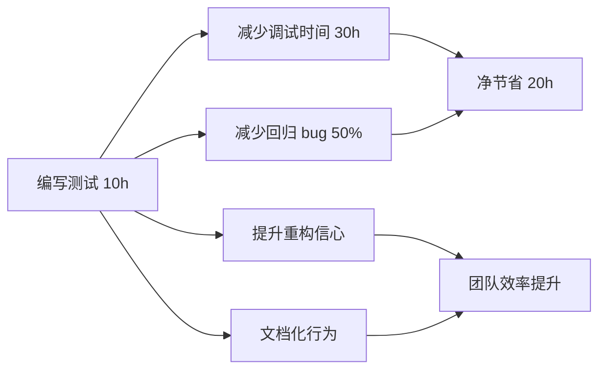

## 一句话概括

单元测试是前端质量保障体系中最基础的环节，它通过将代码分解为最小的可测试单元（函数、模块），验证每个单元在给定输入下是否产生预期输出。在 2026 年的前端工程化实践中，Jest 仍然是单元测试的事实标准工具，其背后的核心概念——**断言（Assertion）**、**Mock（模拟）** 和 **覆盖率（Coverage）**——构成了测试驱动的三大支柱。高质量的单元测试不仅能在代码变更时快速发现回归 bug，更是"可测试代码设计"的重要驱动力：一个难以测试的函数，往往是一个设计不良的函数。

## 背景与意义

### 为什么单元测试如此重要？

前端行业对单元测试的态度经历了一个从"不需要"到"可有可无"再到"必须"的认知转变。推动这个转变的因素有三：

1. **前端项目的复杂度急剧上升**：十年前的前端项目可能只有几千行 jQuery 代码。2026 年的前端项目动辄数十万行代码，包含状态管理、路由、服务端渲染、国际化等复杂模块。没有单元测试，每次重构都像是在拆炸弹。

2. **CI/CD 流水线的自动化需求**：现代开发流程要求在代码合并前自动运行测试。没有测试的代码无法通过 CI 流水线，这已经成为行业标准（不限于大厂）。

3. **组件化架构带来的测试机会**：React/Vue 组件天然是"输入 → 渲染 → 输出"的结构，非常适合单元测试。

在面试中，单元测试的相关问题通常分为三个层次：
- **初级**：Jest 的基本使用方法、Matcher、describe/it 组织。
- **中级**：Mock 策略、异步测试、快照测试。
- **高级**：TDD 实践、测试覆盖率策略、测试替身的选择。

### 单元测试的投资回报



一个投入 10 小时编写的单元测试套件，在项目的 6 个月生命周期中通常可以节省 30+ 小时的调试和 bug 修复时间。回报周期大约为 2-3 个月。

## 概念与定义

### 什么是单元测试？

**单元测试**（Unit Testing）是对软件中的最小可测试单元进行验证的实践。在前端上下文中，一个"单元"通常指：

- 一个纯函数
- 一个模块的导出函数
- 一个 Hook（自定义 Hook）
- 一个工具函数
- 一个 Redux reducer

### 核心术语

| 术语 | 英文 | 定义 |
|------|------|------|
| 断言 | Assertion | 检查代码行为是否符合预期的表达式 |
| Matcher | Matcher | Jest 提供的断言方法，如 `toBe`、`toEqual` |
| Mock | Mock | 模拟函数或模块的行为，用于隔离测试依赖 |
| Spy | Spy | 监听函数调用而不改变其行为 |
| Stub | Stub | 为测试提供预设返回值 |
| Coverage | Coverage | 测试代码覆盖了多少生产代码的度量 |
| Test Suite | Test Suite | 一组相关的测试用例集合 |
| Test Case | Test Case | 单个测试用例 |

### 测试的黄金法则

```
每次提交代码前，确保：
1. 新增代码有对应的测试
2. 所有测试通过
3. 覆盖率达到团队约定的阈值（通常 80%+）
```

## 核心知识点拆解

### 1. Jest 基础配置与使用

Jest 是一个由 Facebook 开发的 JavaScript 测试框架。它的设计目标是"零配置"开箱即用。

```javascript
// jest.config.js - Jest 配置
module.exports = {
  // 测试环境
  testEnvironment: 'jsdom',

  // 测试文件匹配模式
  testMatch: [
    '**/__tests__/**/*.[jt]s?(x)',
    '**/?(*.)+(spec|test).[jt]s?(x)'
  ],

  // 模块别名映射（与 webpack/tsconfig 对应）
  moduleNameMapper: {
    '^@/(.*)$': '<rootDir>/src/$1',
    '\\.(css|less|scss)$': '<rootDir>/__mocks__/styleMock.js',
    '\\.(jpg|jpeg|png|gif|svg)$': '<rootDir>/__mocks__/fileMock.js'
  },

  // 代码转换（TypeScript + ES Module）
  transform: {
    '^.+\\.tsx?$': 'ts-jest',
    '^.+\\.jsx?$': 'babel-jest'
  },

  // 覆盖率收集
  collectCoverageFrom: [
    'src/**/*.{ts,tsx,js,jsx}',
    '!src/**/*.d.ts',
    '!src/index.tsx',
    '!src/reportWebVitals.ts'
  ],

  // 覆盖率阈值
  coverageThreshold: {
    global: {
      branches: 80,
      functions: 85,
      lines: 85,
      statements: 85
    }
  },

  // 每个测试文件执行前自动运行的模块
  setupFilesAfterSetup: [
    '<rootDir>/jest.setup.ts'
  ],

  // 是否在 watch 模式下显示覆盖信息
  coverageReporters: ['text', 'lcov', 'html']
};
```

```javascript
// 一个完整的 Jest 测试文件结构
import { describe, it, expect, beforeEach, afterEach } from '@jest/globals';

describe('Calculator', () => {
  // 测试前的准备工作
  beforeEach(() => {
    // 初始化
  });

  // 测试后的清理工作
  afterEach(() => {
    // 清理
  });

  describe('add()', () => {
    it('should return the sum of two positive numbers', () => {
      // Arrange（准备）
      const calculator = new Calculator();

      // Act（执行）
      const result = calculator.add(2, 3);

      // Assert（断言）
      expect(result).toBe(5);
    });

    it('should handle negative numbers', () => {
      const calculator = new Calculator();
      expect(calculator.add(-1, -2)).toBe(-3);
      expect(calculator.add(-1, 1)).toBe(0);
    });

    // 边界条件测试
    it('should handle decimal numbers with precision', () => {
      const calculator = new Calculator();
      expect(calculator.add(0.1, 0.2)).not.toBe(0.3);
      // 浮点数运算，使用 toBeCloseTo
      expect(calculator.add(0.1, 0.2)).toBeCloseTo(0.3, 10);
    });
  });
});
```

### 2. 断言（Assertion）最佳实践

Jest 提供了丰富的 Matcher，选择合适的 Matcher 是写出好测试的关键。

```javascript
// === 基本类型断言 ===
test('基本类型断言', () => {
  // 精确相等（用于原始类型）
  expect(2 + 2).toBe(4);
  expect('hello').toBe('hello');

  // 值相等（用于对象和数组）
  expect({ a: 1, b: 2 }).toEqual({ a: 1, b: 2 });
  expect([1, 2, 3]).toEqual([1, 2, 3]);

  // 严格相等（检查类型和值）
  expect(1).toBe(1);           // ✓
  // expect('1').toBe(1);      // ✗ toBe 不用于不同类型
});

// === 对象断言 ===
test('对象断言', () => {
  const user = {
    id: 1,
    name: '张三',
    address: {
      city: '北京',
      district: '海淀'
    },
    createdAt: new Date('2026-01-01')
  };

  // 部分匹配
  expect(user).toMatchObject({
    name: '张三',
    address: { city: '北京' }
  });

  // 检查属性存在
  expect(user).toHaveProperty('id');
  expect(user).toHaveProperty('address.city');

  // 检查属性值和类型
  expect(typeof user.id).toBe('number');
  expect(Array.isArray(user.tags)).toBe(false);
});

// === 数组断言 ===
test('数组断言', () => {
  const numbers = [1, 2, 3, 4, 5];

  expect(numbers).toHaveLength(5);
  expect(numbers).toContain(3);
  expect(numbers).not.toContain(6);

  // 数组中的部分匹配（对象数组）
  const users = [
    { id: 1, name: '张三' },
    { id: 2, name: '李四' }
  ];
  expect(users).toContainEqual({ id: 1, name: '张三' });
});

// === 异常断言 ===
test('异常断言', () => {
  // 同步异常
  expect(() => {
    throw new Error('出错了');
  }).toThrow();

  expect(() => {
    throw new Error('参数错误');
  }).toThrow('参数错误');

  // 异步异常
  async function asyncFunction() {
    throw new Error('异步错误');
  }

  expect(asyncFunction()).rejects.toThrow('异步错误');
});

// === 自定义断言 ===
test('自定义断言', () => {
  // 自定义匹配器
  expect.extend({
    toBeWithinRange(received, floor, ceiling) {
      const pass = received >= floor && received <= ceiling;
      return {
        message: () =>
          `expected ${received} to be within range ${floor} - ${ceiling}`,
        pass
      };
    }
  });

  expect(10).toBeWithinRange(5, 15);
  expect(20).not.toBeWithinRange(5, 15);
});
```

### 3. Mock 策略详解

Mock 是单元测试中最强大的工具，也是最容易滥用导致测试失效的工具。正确的 Mock 策略至关重要。

```javascript
// === 1. Mock 函数 ===

// 创建一个 mock 函数
const mockFn = jest.fn();

// 设置返回值
mockFn.mockReturnValue(42);
console.log(mockFn()); // 42

// 链式调用 Mock
mockFn
  .mockReturnValueOnce(10)
  .mockReturnValueOnce(20)
  .mockReturnValue(30);

console.log(mockFn()); // 10（一次性的）
console.log(mockFn()); // 20（一次性的）
console.log(mockFn()); // 30（默认）
console.log(mockFn()); // 30

// Mock 异步函数
const asyncMock = jest.fn().mockResolvedValue('success');
await asyncMock(); // → 'success'

const errorMock = jest.fn().mockRejectedValue(new Error('failed'));
await errorMock(); // → throws

// 检查 Mock 调用信息
test('Mock 调用追踪', () => {
  const fetchData = jest.fn();

  fetchData('/api/users', { page: 1 });
  fetchData('/api/users/1');

  // 调用次数
  expect(fetchData).toHaveBeenCalledTimes(2);

  // 调用参数
  expect(fetchData).toHaveBeenCalledWith('/api/users', { page: 1 });
  expect(fetchData).toHaveBeenLastCalledWith('/api/users/1');

  // 调用详情
  console.log(fetchData.mock.calls);
  // [
  //   ['/api/users', { page: 1 }],
  //   ['/api/users/1']
  // ]

  console.log(fetchData.mock.instances);
  // [undefined, undefined]（箭头函数，没有 this）
});
```

```javascript
// === 2. Mock 模块 ===

// api.ts - 被测试模块依赖的外部模块
import axios from 'axios';

export async function fetchUser(id: number) {
  const response = await axios.get(`/api/users/${id}`);
  return response.data;
}

// api.test.ts - Mock axios 模块
jest.mock('axios');
const mockedAxios = axios as jest.Mocked<typeof axios>;

test('fetchUser should return user data', async () => {
  // 设置 Mock 返回值
  const mockUser = { id: 1, name: '张三', email: 'zhangsan@example.com' };
  mockedAxios.get.mockResolvedValue({ data: mockUser });

  // 执行被测试函数
  const result = await fetchUser(1);

  // 验证结果
  expect(result).toEqual(mockUser);

  // 验证调用
  expect(mockedAxios.get).toHaveBeenCalledWith('/api/users/1');
  expect(mockedAxios.get).toHaveBeenCalledTimes(1);
});

test('fetchUser should handle errors', async () => {
  // Mock 拒绝
  const error = new Error('Network error');
  mockedAxios.get.mockRejectedValue(error);

  // 验证异常
  await expect(fetchUser(999)).rejects.toThrow('Network error');
});
```

```javascript
// === 3. Mock 部分模块（实际模块的大部分功能不变） ===

// utils.ts
export function formatDate(date: Date): string {
  return date.toISOString().split('T')[0];
}

export function capitalize(str: string): string {
  return str.charAt(0).toUpperCase() + str.slice(1);
}

export function generateId(): string {
  return Math.random().toString(36).substring(2, 10);
}

// 测试中只 Mock generateId，其他函数保持真实
jest.mock('./utils', () => ({
  ...jest.requireActual('./utils'),
  generateId: jest.fn().mockReturnValue('fixed-id-123'),
}));

import { formatDate, capitalize, generateId } from './utils';

test('should use mocked generateId but real formatDate', () => {
  expect(generateId()).toBe('fixed-id-123');
  expect(formatDate(new Date('2026-01-15'))).toBe('2026-01-15');
  expect(capitalize('hello')).toBe('Hello');
});
```

```javascript
// === 4. Spy（监听现有函数的行为） ===

// logger.ts
export const logger = {
  info: (msg: string) => console.log(`[INFO] ${msg}`),
  warn: (msg: string) => console.warn(`[WARN] ${msg}`),
  error: (msg: string) => console.error(`[ERROR] ${msg}`),
};

// payment.ts
import { logger } from './logger';

export function processPayment(amount: number): boolean {
  if (amount <= 0) {
    logger.warn('Invalid payment amount');
    return false;
  }
  logger.info(`Processing payment: ${amount}`);
  // 处理支付逻辑...
  return true;
}

// payment.test.ts
import { logger } from './logger';
import { processPayment } from './payment';

test('should warn when amount is invalid', () => {
  const warnSpy = jest.spyOn(logger, 'warn').mockImplementation(() => {});

  const result = processPayment(-1);

  expect(result).toBe(false);
  expect(warnSpy).toHaveBeenCalledWith('Invalid payment amount');

  // 恢复原始函数
  warnSpy.mockRestore();
});

test('should log info when payment succeeds', () => {
  const infoSpy = jest.spyOn(logger, 'info');

  const result = processPayment(100);

  expect(result).toBe(true);
  expect(infoSpy).toHaveBeenCalledWith('Processing payment: 100');

  infoSpy.mockRestore();
});
```

### 4. 异步测试

前端应用中大量逻辑是异步的，测试异步代码需要特别注意。

```javascript
// === 异步测试模式 ===

// 模式 1：回调方式（过时，不推荐）
test('async callback style', (done) => {
  function fetchData(callback: (data: string) => void) {
    setTimeout(() => callback('data'), 100);
  }

  fetchData((data) => {
    expect(data).toBe('data');
    done(); // 必须调用，否则测试超时
  });
});

// 模式 2：Promise 方式
test('async promise style', () => {
  function fetchData(): Promise<string> {
    return Promise.resolve('data');
  }

  // 直接 return Promise
  return fetchData().then(data => {
    expect(data).toBe('data');
  });
});

// 模式 3：async/await（推荐）
test('async await style', async () => {
  const data = await fetchData();
  expect(data).toBe('data');
});

// 模式 4：resolves / rejects（最简洁）
test('async resolves style', async () => {
  await expect(Promise.resolve('hello')).resolves.toBe('hello');
  await expect(Promise.reject(new Error('fail'))).rejects.toThrow('fail');
});

// === 并发与定时器测试 ===
test('timer testing', async () => {
  jest.useFakeTimers();

  function debounce<T extends (...args: any[]) => void>(
    fn: T,
    delay: number
  ): T {
    let timer: NodeJS.Timeout;
    return ((...args: any[]) => {
      clearTimeout(timer);
      timer = setTimeout(() => fn(...args), delay);
    }) as T;
  }

  const mockFn = jest.fn();
  const debouncedFn = debounce(mockFn, 500);

  debouncedFn();
  debouncedFn();
  debouncedFn();

  // 时间还没到，不应该被调用
  expect(mockFn).not.toHaveBeenCalled();

  // 快进时间
  jest.advanceTimersByTime(500);

  // 由于 debounce，只应该调用最后一次
  expect(mockFn).toHaveBeenCalledTimes(1);

  jest.useRealTimers();
});

// === 竞态条件测试 ===
test('race condition handling', async () => {
  // 模拟多次快速请求，只有最后一次应该生效
  const searchApi = jest.fn();
  searchApi
    .mockResolvedValueOnce('result-1')
    .mockResolvedValueOnce('result-2')
    .mockResolvedValueOnce('result-3');

  async function search(keyword: string): Promise<string> {
    const result = await searchApi(keyword);
    return result;
  }

  // 并发发送三个请求
  const results = await Promise.all([
    search('a'),
    search('b'),
    search('c')
  ]);

  expect(results).toEqual(['result-1', 'result-2', 'result-3']);
  expect(searchApi).toHaveBeenCalledTimes(3);
});
```

### 5. 覆盖率（Coverage）

覆盖率不是目的，而是手段。100% 覆盖率不意味着代码没有 bug，但低覆盖率一定意味着存在盲区。

```javascript
// === 覆盖率指标详解 ===

// 被测试代码
function calculateDiscount(price: number, userType: string): number {
  let discount = 0;

  if (userType === 'vip') {
    discount = 0.2;          // 分支 1
  } else if (userType === 'member') {
    discount = 0.1;          // 分支 2
  } else {
    discount = 0;            // 分支 3
  }

  if (price > 1000) {
    discount += 0.05;        // 分支 4
  }

  return price * (1 - discount);
}

// 不够充分的测试 —— 只有 75% 行覆盖率
test('calculateDiscount for vip', () => {
  expect(calculateDiscount(2000, 'vip')).toBe(1500);
  // 通过: 分支 1 ✓, 分支 4 ✓
  // 未覆盖: 分支 2 ✗, 分支 3 ✗
});

// 完整的测试 —— 100% 覆盖率
describe('calculateDiscount', () => {
  test('vip user with high price', () => {
    expect(calculateDiscount(2000, 'vip')).toBe(1500);
  });

  test('member user with low price', () => {
    expect(calculateDiscount(500, 'member')).toBe(450);
  });

  test('regular user with high price', () => {
    expect(calculateDiscount(1500, 'normal')).toBe(1425);
  });

  test('regular user with low price', () => {
    expect(calculateDiscount(100, 'normal')).toBe(100);
  });
});

// 覆盖率报告解读
/*
  ---------|---------|----------|---------|---------|-------------------
  File     | % Stmts | % Branch | % Funcs | % Lines | Uncovered Line #s
  ---------|---------|----------|---------|---------|-------------------
  语句覆盖率 |  95%    |  88%     |  90%    |  95%    |
  ---------|---------|----------|---------|---------|-------------------

  - % Stmts（语句覆盖率）：执行的语句比例
  - % Branch（分支覆盖率）：走到的分支比例（if/else、&&、||）
  - % Funcs（函数覆盖率）：被调用的函数比例
  - % Lines（行覆盖率）：被执行的代码行比例
*/
```

## 实战案例

### 一个完整的单元测试套件：用户管理模块

```typescript
// userService.ts - 被测试的模块
interface User {
  id: number;
  name: string;
  email: string;
  role: 'admin' | 'user';
  createdAt: Date;
}

interface CreateUserInput {
  name: string;
  email: string;
  role?: 'admin' | 'user';
}

// 模拟数据库（实际项目中会连接真正的数据库）
const usersDB: User[] = [
  { id: 1, name: '管理员', email: 'admin@example.com', role: 'admin', createdAt: new Date('2025-01-01') },
  { id: 2, name: '张三', email: 'zhangsan@example.com', role: 'user', createdAt: new Date('2026-06-01') },
];

let nextId = 3;

export const userService = {
  // 获取所有用户
  getAll(): User[] {
    return [...usersDB];
  },

  // 根据 ID 获取用户
  getById(id: number): User | undefined {
    return usersDB.find(user => user.id === id);
  },

  // 创建用户
  create(input: CreateUserInput): User {
    // 验证
    if (!input.name || !input.email) {
      throw new Error('Name and email are required');
    }

    // Email 格式验证
    if (!this.isValidEmail(input.email)) {
      throw new Error('Invalid email format');
    }

    // 检查重复
    const existing = usersDB.find(u => u.email === input.email);
    if (existing) {
      throw new Error('Email already exists');
    }

    const newUser: User = {
      id: nextId++,
      name: input.name,
      email: input.email,
      role: input.role || 'user',
      createdAt: new Date()
    };

    usersDB.push(newUser);
    return newUser;
  },

  // 更新用户
  update(id: number, updates: Partial<Omit<User, 'id' | 'createdAt'>>): User {
    const user = usersDB.find(u => u.id === id);
    if (!user) {
      throw new Error('User not found');
    }

    Object.assign(user, updates);
    return user;
  },

  // 删除用户
  delete(id: number): boolean {
    const index = usersDB.findIndex(u => u.id === id);
    if (index === -1) return false;
    usersDB.splice(index, 1);
    return true;
  },

  // 邮箱验证（辅助方法）
  isValidEmail(email: string): boolean {
    return /^[^\s@]+@[^\s@]+\.[^\s@]+$/.test(email);
  },

  // 获取用户统计
  getStats() {
    return {
      total: usersDB.length,
      admins: usersDB.filter(u => u.role === 'admin').length,
      users: usersDB.filter(u => u.role === 'user').length
    };
  }
};
```

```typescript
// userService.test.ts - 完整的测试套件

// 在测试前重置数据状态
import { userService } from './userService';

describe('UserService', () => {
  // 每个测试前重置状态
  beforeEach(() => {
    // 重置内部状态（通过重新导入或反射）
    // 实际项目应该使用依赖注入来避免这种 hack
  });

  // ============ getAll ============
  describe('getAll()', () => {
    it('should return all users', () => {
      const users = userService.getAll();
      expect(users).toBeInstanceOf(Array);
      expect(users.length).toBeGreaterThan(0);
    });

    it('should return a copy of the users array', () => {
      const users = userService.getAll();
      users.push({} as User); // 修改返回的数组
      const usersAgain = userService.getAll();
      expect(usersAgain.length).toBeLessThan(users.length);
    });
  });

  // ============ getById ============
  describe('getById()', () => {
    it('should return user by id', () => {
      const user = userService.getById(1);
      expect(user).toBeDefined();
      expect(user!.id).toBe(1);
      expect(user!.name).toBe('管理员');
    });

    it('should return undefined for non-existing id', () => {
      expect(userService.getById(999)).toBeUndefined();
    });

    it('should handle edge case: id = 0', () => {
      expect(userService.getById(0)).toBeUndefined();
    });
  });

  // ============ create ============
  describe('create()', () => {
    it('should create a new user with valid input', () => {
      const newUser = userService.create({
        name: '新用户',
        email: 'newuser@example.com',
        role: 'user'
      });

      expect(newUser).toHaveProperty('id');
      expect(newUser.name).toBe('新用户');
      expect(newUser.email).toBe('newuser@example.com');
      expect(newUser.role).toBe('user');
      expect(newUser.createdAt).toBeInstanceOf(Date);
    });

    it('should create user with default role when not specified', () => {
      const user = userService.create({
        name: '默认角色',
        email: 'default@example.com'
      });
      expect(user.role).toBe('user');
    });

    it('should throw error when name is missing', () => {
      expect(() => {
        userService.create({
          name: '',
          email: 'test@example.com'
        });
      }).toThrow('Name and email are required');
    });

    it('should throw error when email is missing', () => {
      expect(() => {
        userService.create({
          name: '测试',
          email: ''
        });
      }).toThrow('Name and email are required');
    });

    it('should throw error for invalid email format', () => {
      const invalidEmails = [
        'not-an-email',
        '@example.com',
        'user@',
        'user@.com',
        'user name@example.com'
      ];

      invalidEmails.forEach(email => {
        expect(() => {
          userService.create({ name: '测试', email });
        }).toThrow('Invalid email format');
      });
    });

    it('should throw error for duplicate email', () => {
      expect(() => {
        userService.create({
          name: '重复',
          email: 'admin@example.com' // 已存在的邮箱
        });
      }).toThrow('Email already exists');
    });
  });

  // ============ update ============
  describe('update()', () => {
    it('should update user name', () => {
      const updated = userService.update(1, { name: '新管理员' });
      expect(updated.name).toBe('新管理员');
    });

    it('should update user role', () => {
      const updated = userService.update(2, { role: 'admin' });
      expect(updated.role).toBe('admin');
    });

    it('should throw when updating non-existing user', () => {
      expect(() => {
        userService.update(999, { name: '不存在' });
      }).toThrow('User not found');
    });

    it('should not allow updating id and createdAt', () => {
      // TypeScript 层面已经阻止，但运行时不应生效
      const updated = userService.update(1, { name: 'test' } as any);
      expect(updated.id).toBe(1); // ID 不变
    });
  });

  // ============ delete ============
  describe('delete()', () => {
    it('should delete existing user and return true', () => {
      const result = userService.delete(1);
      expect(result).toBe(true);
      expect(userService.getById(1)).toBeUndefined();
    });

    it('should return false for non-existing user', () => {
      expect(userService.delete(999)).toBe(false);
    });
  });

  // ============ isValidEmail ============
  describe('isValidEmail()', () => {
    it('should validate correct emails', () => {
      const validEmails = [
        'user@example.com',
        'user.name@example.co.uk',
        'user+tag@example.com',
        '123@example.com',
      ];

      validEmails.forEach(email => {
        expect(userService.isValidEmail(email)).toBe(true);
      });
    });

    it('should reject invalid emails', () => {
      const invalidEmails = [
        '',
        'not-email',
        '@no-local-part.com',
        'no-domain@',
        'spaces in@email.com',
      ];

      invalidEmails.forEach(email => {
        expect(userService.isValidEmail(email)).toBe(false);
      });
    });
  });

  // ============ getStats ============
  describe('getStats()', () => {
    it('should return correct statistics', () => {
      const stats = userService.getStats();
      expect(stats).toHaveProperty('total');
      expect(stats).toHaveProperty('admins');
      expect(stats).toHaveProperty('users');
      expect(stats.total).toBe(stats.admins + stats.users);
    });
  });
});
```

## 底层原理

### Jest 的运行原理

理解 Jest 的底层工作方式，有助于识别测试中的陷阱。

```javascript
// === Jest 的测试运行器核心逻辑（简化版） ===

class JestRunner {
  constructor(config) {
    this.config = config;
    this.testFiles = [];
    this.results = { passed: 0, failed: 0, skipped: 0 };
  }

  async run() {
    // 1. 发现测试文件
    this.testFiles = this.discoverTestFiles();

    // 2. 并行执行测试（默认使用 worker 线程）
    const workers = this.config.maxWorkers || require('os').cpus().length;
    const queue = [...this.testFiles];
    const running = [];

    while (queue.length > 0 || running.length > 0) {
      // 启动新的 worker
      while (running.length < workers && queue.length > 0) {
        const testFile = queue.shift();
        const worker = this.runTestInWorker(testFile);
        running.push(worker);

        worker.then(result => {
          this.collectResult(result);
          const idx = running.indexOf(worker);
          if (idx > -1) running.splice(idx, 1);
        });
      }

      // 等待任一 worker 完成
      await Promise.race(running);
    }

    return this.results;
  }

  // 在独立的 VM 沙箱中执行测试文件
  runTestInWorker(testFile) {
    return new Promise((resolve) => {
      // 实际使用 worker_threads
      const worker = new Worker('./jest-worker.js', {
        workerData: {
          testFile,
          config: this.config
        }
      });

      worker.on('message', (result) => {
        resolve(result);
      });

      worker.on('error', (err) => {
        resolve({ file: testFile, error: err.message });
      });
    });
  }

  // 测试文件的沙箱执行
  executeTestFile(filename) {
    // 1. 创建沙箱环境
    const sandbox = {
      describe: this.createDescribe(),
      it: this.createIt(),
      expect: this.createExpect(),
      jest: this.createJestAPI(),
      beforeEach: [],
      afterEach: [],
      beforeAll: [],
      afterAll: []
    };

    // 2. 编译测试文件（TypeScript/Babel 转换）
    const compiledCode = this.transformFile(filename);

    // 3. 在沙箱中执行
    const fn = new Function('describe', 'it', 'expect', 'jest', compiledCode);
    fn(sandbox.describe, sandbox.it, sandbox.expect, sandbox.jest);

    // 4. 收集测试结果
    return sandbox.describe.getResults();
  }

  // describe/it 的实现
  createDescribe() {
    const suites = [];
    let currentSuite = null;

    function describe(name, fn) {
      const suite = {
        name,
        tests: [],
        beforeAll: [],
        afterAll: [],
        beforeEach: [],
        afterEach: [],
        children: []
      };

      if (currentSuite) {
        currentSuite.children.push(suite);
      }

      const parentSuite = currentSuite;
      currentSuite = suite;
      fn();
      currentSuite = parentSuite;

      suites.push(suite);
      return suite;
    }

    describe.it = function it(name, fn) {
      if (currentSuite) {
        currentSuite.tests.push({ name, fn });
      }
    };

    describe.getResults = function() {
      return this.runTests(suites);
    };

    describe.runTests = function(suites) {
      const results = [];

      for (const suite of suites) {
        // 执行 beforeAll
        suite.beforeAll.forEach(fn => fn());

        for (const test of suite.tests) {
          // 执行 beforeEach
          suite.beforeEach.forEach(fn => fn());

          try {
            // 执行测试函数
            test.fn();
            results.push({
              suite: suite.name,
              test: test.name,
              passed: true
            });
          } catch (error) {
            results.push({
              suite: suite.name,
              test: test.name,
              passed: false,
              error: error.message
            });
          }

          // 执行 afterEach
          suite.afterEach.forEach(fn => fn());
        }

        // 递归执行子 suite
        results.push(...this.runTests(suite.children));

        // 执行 afterAll
        suite.afterAll.forEach(fn => fn());
      }

      return results;
    };

    return describe;
  }

  // expect 匹配器的实现
  createExpect(actualValue) {
    const matchers = {
      toBe(expected) {
        if (actualValue !== expected) {
          throw new Error(
            `Expected ${JSON.stringify(expected)}, got ${JSON.stringify(actualValue)}`
          );
        }
        return true;
      },

      toEqual(expected) {
        const isEqual = this.deepEqual(actualValue, expected);
        if (!isEqual) {
          throw new Error(
            `Expected ${JSON.stringify(expected)}, got ${JSON.stringify(actualValue)}`
          );
        }
        return true;
      },

      toBeGreaterThan(expected) {
        if (!(actualValue > expected)) {
          throw new Error(
            `Expected ${actualValue} > ${expected}`
          );
        }
        return true;
      },

      toThrow(expectedError) {
        try {
          actualValue();
          throw new Error('Expected function to throw');
        } catch (error) {
          if (expectedError instanceof RegExp) {
            if (!expectedError.test(error.message)) {
              throw new Error(`Expected error to match ${expectedError}`);
            }
          } else if (typeof expectedError === 'string') {
            if (error.message !== expectedError) {
              throw new Error(`Expected error message "${expectedError}"`);
            }
          }
        }
        return true;
      },

      deepEqual(a, b) {
        if (a === b) return true;
        if (typeof a !== typeof b) return false;
        if (a === null || b === null) return a === b;
        if (typeof a !== 'object') return a === b;
        if (Array.isArray(a) !== Array.isArray(b)) return false;

        if (Array.isArray(a)) {
          if (a.length !== b.length) return false;
          return a.every((item, i) => this.deepEqual(item, b[i]));
        }

        const keysA = Object.keys(a);
        const keysB = Object.keys(b);
        if (keysA.length !== keysB.length) return false;

        return keysA.every(key =>
          Object.prototype.hasOwnProperty.call(b, key) &&
          this.deepEqual(a[key], b[key])
        );
      }
    };

    // 支持 .not 修饰符
    const notMatchers = {};
    for (const [key, fn] of Object.entries(matchers)) {
      notMatchers[key] = function(...args) {
        try {
          fn.call(this, ...args);
          throw new Error(`Expected not: ${key}`);
        } catch (e) {
          if (e.message?.startsWith('Expected not:')) {
            throw e;
          }
          // 函数抛出了预期异常，说明 not 测试通过
          return true;
        }
      };
    }

    return {
      ...matchers,
      get not() {
        return notMatchers;
      }
    };
  }
}
```

### Jest Mock 的实现原理

理解 Mock 的底层运行机制，可以帮助你写出更可靠的测试。

```javascript
// === Mock 函数的简化实现 ===

class MockFunction {
  constructor(implementation) {
    this._calls = [];        // 所有调用的记录
    this._instances = [];    // this 指向记录
    this._results = [];      // 返回值记录
    this._returnValues = []; // mockReturnValue 队列
    this._implementation = implementation || (() => undefined);
  }

  // 模拟函数调用
  __call(...args) {
    const callInfo = {
      args,
      timestamp: Date.now(),
      context: this
    };

    this._calls.push(args);
    this._instances.push(this);

    // 确定返回值：优先使用 mockReturnValueOnce
    let returnValue;
    if (this._returnValues.length > 0) {
      returnValue = this._returnValues.shift();
    } else if (this._defaultReturnValue !== undefined) {
      returnValue = this._defaultReturnValue;
    } else if (this._implementation) {
      returnValue = this._implementation(...args);
    } else {
      returnValue = undefined;
    }

    // 处理 Promise
    if (this._isAsync) {
      returnValue = this._asyncReturn === 'resolve'
        ? Promise.resolve(returnValue)
        : Promise.reject(returnValue);
    }

    this._results.push({ type: 'return', value: returnValue });
    return returnValue;
  }

  // API 方法
  mockReturnValue(value) {
    this._defaultReturnValue = value;
    return this;
  }

  mockReturnValueOnce(value) {
    this._returnValues.push(value);
    return this;
  }

  mockResolvedValue(value) {
    this._isAsync = true;
    this._asyncReturn = 'resolve';
    this._defaultReturnValue = value;
    return this;
  }

  mockRejectedValue(value) {
    this._isAsync = true;
    this._asyncReturn = 'reject';
    this._defaultReturnValue = value;
    return this;
  }

  mockImplementation(fn) {
    this._implementation = fn;
    return this;
  }

  // 调用信息查询
  get mock() {
    return {
      calls: this._calls,
      instances: this._instances,
      results: this._results,
      lastCall: this._calls[this._calls.length - 1] || [],
      lastResult: this._results[this._results.length - 1]
    };
  }

  // 重置
  mockClear() {
    this._calls = [];
    this._instances = [];
    this._results = [];
    return this;
  }

  mockReset() {
    this.mockClear();
    this._returnValues = [];
    this._defaultReturnValue = undefined;
    this._implementation = () => undefined;
    return this;
  }
}
```

## 高频面试题解析

### 面试题 1：什么是好的单元测试？如何写出高质量的单测？

**答案要点**：

好的单元测试具有 F.I.R.S.T 特性：
- **Fast**（快速）：毫秒级完成。
- **Independent**（独立）：不依赖环境、顺序、其他测试。
- **Repeatable**（可重复）：每次运行结果一致。
- **Self-validating**（自验证）：自动判断通过/失败。
- **Timely**（及时）：在代码编写时（或之前）完成。

**高质量单测的实践原则**：
1. **只测试一个行为**：一个 it 块只测试一个逻辑分支。
2. **使用 AAA 模式**：Arrange（准备）→ Act（执行）→ Assert（断言）。
3. **测试边界条件**：空值、边界值、异常情况。
4. **避免测试实现细节**：测试 public API，而非私有方法。
5. **Mock 外部依赖**：数据库、网络、文件系统等。

### 面试题 2：Mock 和 Spy 的区别是什么？什么时候用 Mock，什么时候用 Spy？

**答案要点**：

**Mock（模拟）**：
- 完全替换函数/模块的行为。
- 不关心原始实现。
- 用于隔离外部依赖（API 调用、数据库操作）。
- 使用场景：`jest.mock('axios')`、`jest.fn()`。

**Spy（监听）**：
- 包装现有函数，保留原始行为。
- 可以观察调用信息，也可以选择性地拦截。
- 用于验证函数是否被正确调用。
- 使用场景：`jest.spyOn(console, 'log')`。

**选择指南**：

| 场景 | 使用 |
|------|------|
| 测试模块 A 时隔离模块 B | `jest.mock('module-b')` |
| 验证回调函数被调用 | `jest.fn()` |
| 验证 console.log 被调用 | `jest.spyOn(console, 'log')` |
| 拦截 Date.now() 返回固定时间 | `jest.spyOn(Date, 'now')` |
| 模拟 API 请求 | `jest.mock('axios')` |

### 面试题 3：如何测试异步代码？测试定时器（setTimeout/setInterval）应该注意什么？

**答案要点**：

**异步代码测试方法**：
1. 使用 `async/await` 是最清晰的方式。
2. 使用 `expect().resolves`/`expect().rejects` 可以更简洁。
3. 回调风格的异步代码需要使用 `done` 回调。
4. 注意 Promise 的链式调用——确保 return 或 await。

**定时器测试**：
1. 使用 `jest.useFakeTimers()` 替换真实定时器。
2. 使用 `jest.advanceTimersByTime(ms)` 快进时间。
3. 使用 `jest.runAllTimers()` 执行所有定时器。
4. 测试结束后调用 `jest.useRealTimers()` 恢复。
5. 注意 `jest.useFakeTimers()` 应该在 beforeEach 中调用。

**常见陷阱**：
- 忘记 return Promise，导致测试提前结束。
- 使用 `jest.useFakeTimers()` 后所有 setTimeout 都被替换。
- 嵌套定时器需要多次 runAllTimers。

### 面试题 4：测试覆盖率的合理目标是多少？如何提升覆盖率又不浪费精力？

**答案要点**：

**合理目标**：
- **行覆盖率**：80%+ 是良好标准，90%+ 是优秀。
- **分支覆盖率**：75%+。
- **函数覆盖率**：85%+。

**提升策略**：
1. **新增代码必须覆盖**：在 PR Review 时关注新增代码是否有测试。
2. **核心逻辑优先**：工具函数、数据处理、业务逻辑优先覆盖。
3. **UI 代码降低要求**：纯展示组件、样式代码覆盖率要求适度降低。
4. **使用增量覆盖率**：关注本次改动新增的代码覆盖情况。
5. **不要盲目追求 100%**：有些代码（如错误边界、死代码）难以测试，100% 覆盖率的投入产出比过低。

**覆盖率不是目标，而是信号**：
- 低覆盖率 → 测试不够 → 增加测试。
- 高覆盖率但 bug 多 → 测试方向错了 → 关注测试质量而非数量。

### 面试题 5：TDD（测试驱动开发）在前端开发中是否适用？如何应用？

**答案要点**：

**TDD 在前端的适用性**：
- 非常适合纯逻辑模块（工具函数、状态管理、数据处理）。
- 较难用于 UI 组件（视觉样式、动画效果、交互细节）。
- 混合模式（Hybrid TDD）是前端的最佳实践。

**前端 TDD 实践模式**：
```
Red-Green-Refactor 循环：
1. Red：编写一个失败的测试（定义期望行为）
2. Green：编写最简单的代码让测试通过
3. Refactor：优化代码结构，确保测试保持绿色
```

**适用场景**：
1. **状态管理逻辑**（Redux reducer、MobX store）。
2. **数据转换函数**（格式化、过滤、排序、聚合）。
3. **业务规则验证**（表单校验、权限判断、价格计算）。
4. **自定义 Hooks**（纯逻辑 Hook 非常适合 TDD）。
5. **API 服务层**（封装 HTTP 请求的模块）。

**不适用场景**：
1. **纯展示组件**（没有业务逻辑的 Compoent）。
2. **动画交互**（时间相关的行为很难用 TDD 驱动）。
3. **第三方集成测试**（外部依赖的集成验证）。

## 总结与扩展

### 知识体系

单元测试的知识体系：

- **测试框架层**：Jest、Vitest、Mocha、Jasmine。
- **断言库**：Jest Matchers、Chai、assert。
- **Mock 策略**：jest.fn、jest.mock、jest.spyOn、Manual Mocks。
- **覆盖工具**：Istanbul（Jest 内置覆盖率收集器）。
- **测试模式**：AAA、Given-When-Then、Parameterized Tests。
- **测试替身**：Dummies、Fakes、Stubs、Spies、Mocks。

### Vitest —— Jest 的现代替代方案

2026 年，Vitest 正在快速崛起。它是基于 Vite 的测试框架，与 Jest API 高度兼容：

```typescript
// 同样的 API，但更快（因为 Vite）
import { describe, it, expect, vi } from 'vitest';

describe('Vitest 示例', () => {
  it('should work like Jest', () => {
    const fn = vi.fn();
    fn('hello');
    expect(fn).toHaveBeenCalledWith('hello');
  });
});
```

Vitest 的优势：原生 TypeScript 支持、HMR 驱动的开发体验、与 Vite 配置无缝集成。

### 延伸阅读

- [Jest 官方文档](https://jestjs.io/docs/getting-started) — 最权威的 Jest 学习资源
- [Testing JavaScript - Kent C. Dodds](https://testingjavascript.com/) — 前端测试的完整课程
- [Unit Testing Principles, Practices, and Patterns - Vladimir Khorikov](https://www.manning.com/books/unit-testing) — 单元测试的经典著作
- [Vitest 官方文档](https://vitest.dev/) — 现代测试框架的选择
- [React Testing Library 文档](https://testing-library.com/react) — 组件测试的最佳实践

单元测试不是银弹，但它是质量保障体系中最基础也是最有效的一环。当你的项目稳定运行、重构无碍、新成员也能放心改代码时，那些投入在测试上的时间就都值了。
