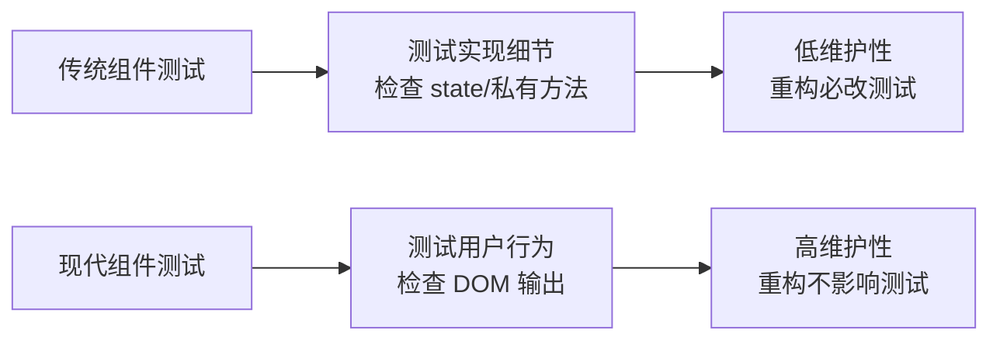

## 一句话概括

组件测试位于测试金字塔的中间层，它验证组件在给定输入（props、用户交互、数据）下是否产生正确的输出（渲染结果、事件触发、状态变化）。与单元测试不同，组件测试更关注"组件像用户一样使用时的行为表现"，而非内部实现细节。在 React 生态中，React Testing Library 主导了以"用户行为驱动"的测试范式；在 Vue 生态中，Vue Test Utils 提供了灵活而强大的组件挂载与交互仿真能力。2026 年的组件测试最佳实践已经形成共识：**测试行为而非实现、优先集成而非隔离、避免测试框架的私有 API**。

## 背景与意义

### 为什么需要组件测试？

前端应用的本质是"用户与 UI 的交互"。单元测试验证了函数逻辑的正确性，但无法覆盖以下场景：

1. **组件渲染是否正确**：给定 props 和 state，DOM 输出是否符合预期？
2. **用户交互是否触发预期行为**：点击按钮是否调用了正确的回调？表单提交是否发送了 AJAX 请求？
3. **组件间协作是否正常**：父组件传递给子组件的 props 是否正确？子组件 emit 的事件是否被父组件捕获？
4. **边界条件是否处理**：空数据渲染是否崩溃？长文本是否溢出？加载状态是否展示？

组件测试就是为了回答这些问题而生。

### 组件测试的面试地位

在面试中，组件测试是考察候选人"工程化能力"的重要标尺：

- **初/中级**：能否写出基本的组件渲染测试和交互测试？
- **中级**：能否正确处理异步数据加载、条件渲染、Mock 子组件？
- **高级**：能否定义测试的"可测性"标准？能否区分哪些行为值得测试，哪些不值得？

### React Testing Library vs Vue Test Utils

| 维度 | React Testing Library | Vue Test Utils |
|------|----------------------|----------------|
| 设计哲学 | "测试行为，而非实现" | 灵活，提供更多底层能力 |
| 挂载方式 | `render(<Component />)` | `mount(Component)` / `shallowMount(Component)` |
| 查询方式 | `getByRole`、`getByText`、`getByTestId` | `.find()`, `.findComponent()` |
| 事件模拟 | `fireEvent` / `userEvent` | `.trigger()` / `.setValue()` |
| 状态验证 | `expect(screen.getByText('...')).toBeInTheDocument()` | `.text()`, `.html()`, `.exists()` |

## 概念与定义

### 什么是组件测试？

组件测试（Component Testing）是针对 UI 组件的测试，验证组件在不同输入下的渲染输出和行为响应。输入可以是：

- **Props**：组件接收的属性
- **State**：组件的内部状态
- **用户交互**：点击、输入、键盘事件
- **上下文**：Provider、主题、路由等

输出包括：

- **DOM 结构**：渲染出的 HTML 内容
- **CSS 类名/样式**：组件的视觉状态
- **事件回调**：对外触发的函数调用
- **子组件**：渲染了哪些子组件

### 测试范式演进



### 核心术语

| 术语 | 英文 | 定义 |
|------|------|------|
| 挂载 | Mount | 将组件渲染到虚拟 DOM 中 |
| 浅渲染 | Shallow Render | 只渲染当前组件，不渲染子组件 |
| 查询 | Query | 在 DOM 中查找元素 |
| 事件模拟 | Fire Event | 触发浏览器事件（click、change） |
| 用户事件 | User Event | 更真实地模拟用户操作 |
| 快照 | Snapshot | 序列化组件的渲染输出 |

## 核心知识点拆解

### 1. React Testing Library 核心用法

React Testing Library 的核心理念是：**测试组件输出，而不是组件实现**。它提供了一系列查询方法，用于在渲染后的 DOM 中查找元素并断言。

```jsx
// === 基础组件测试 ===

// Counter.jsx - 一个简单的计数器组件
import React, { useState } from 'react';

export function Counter({ initialValue = 0 }) {
  const [count, setCount] = useState(initialValue);

  return (
    <div className="counter">
      <h2>计数器</h2>
      <p className="count-display" data-testid="count">
        当前计数: {count}
      </p>
      <button onClick={() => setCount(c => c + 1)} className="increment">
        +1
      </button>
      <button onClick={() => setCount(c => c - 1)} className="decrement" disabled={count <= 0}>
        -1
      </button>
      <button onClick={() => setCount(initialValue)} className="reset">
        重置
      </button>
    </div>
  );
}

// Counter.test.jsx - 计数器测试
import { render, screen, fireEvent } from '@testing-library/react';
import userEvent from '@testing-library/user-event';
import { Counter } from './Counter';

describe('Counter Component', () => {
  it('应该渲染初始值', () => {
    render(<Counter initialValue={5} />);
    const countDisplay = screen.getByTestId('count');
    expect(countDisplay).toHaveTextContent('当前计数: 5');
  });

  it('点击 +1 按钮应该增加计数', async () => {
    render(<Counter initialValue={0} />);

    const incrementBtn = screen.getByRole('button', { name: '+1' });
    const countDisplay = screen.getByTestId('count');

    await fireEvent.click(incrementBtn);
    expect(countDisplay).toHaveTextContent('当前计数: 1');

    await fireEvent.click(incrementBtn);
    expect(countDisplay).toHaveTextContent('当前计数: 2');
  });

  it('计数为 0 时 -1 按钮应该禁用', () => {
    render(<Counter initialValue={0} />);
    const decrementBtn = screen.getByRole('button', { name: '-1' });
    expect(decrementBtn).toBeDisabled();
  });

  it('点击重置应该回到初始值', async () => {
    render(<Counter initialValue={10} />);

    // 先增加几次
    const incrementBtn = screen.getByRole('button', { name: '+1' });
    await fireEvent.click(incrementBtn);
    await fireEvent.click(incrementBtn);

    // 点击重置
    const resetBtn = screen.getByRole('button', { name: '重置' });
    await fireEvent.click(resetBtn);

    const countDisplay = screen.getByTestId('count');
    expect(countDisplay).toHaveTextContent('当前计数: 10');
  });

  it('使用 userEvent 模拟更真实的交互', async () => {
    const user = userEvent.setup();
    render(<Counter initialValue={3} />);

    const incrementBtn = screen.getByRole('button', { name: '+1' });

    // userEvent.click 更接近真实用户行为
    // 会触发完整的 click 事件链（mouseDown → mouseUp → click）
    await user.click(incrementBtn);
    await user.click(incrementBtn);
    await user.click(incrementBtn);

    expect(screen.getByTestId('count')).toHaveTextContent('当前计数: 6');
  });
});
```

### 2. 查询方法优先级

React Testing Library 提供了多种元素查找方式，但推荐使用"对人友好的"查询。

```jsx
// === 查询方法优先级 ===

// 最佳实践：有多少开发者就能找到，查询越接近用户越稳定

// 级别 1：对所有人都可访问（推荐）
// getByRole: 通过 ARIA 角色查找（屏幕阅读器友好）
screen.getByRole('button', { name: /提交/i });
screen.getByRole('heading', { name: '用户信息' });
screen.getByRole('textbox', { name: '用户名' });

// getByLabelText: 通过 label 文本查找（表单友好）
screen.getByLabelText('用户名');
screen.getByLabelText(/密码/i);

// getByPlaceholderText: 通过 placeholder 查找
screen.getByPlaceholderText('请输入邮箱');

// getByText: 通过文本内容查找（最直接）
screen.getByText('提交');
screen.getByText('确定删除这个项目吗？');

// getByDisplayValue: 通过表单值查找
screen.getByDisplayValue('默认值');

// 级别 2：语义化查询
// getByAltText: 通过图片 alt 文本查找
screen.getByAltText('产品封面图');

// getByTitle: 通过 title 属性查找
screen.getByTitle('关闭');

// 级别 3：测试 ID（最后手段）
// getByTestId: 通过 data-testid 属性查找
// 当以上所有方法都不适用时使用
screen.getByTestId('user-avatar');

// === 查询类型后缀 ===
// getBy*     → 找到 1 个，否则抛异常
// queryBy*   → 找到 0 或 1 个，不会抛异常（用于检查元素不存在）
// findBy*    → 异步，等待元素出现（配合 async/await）

test('查询类型示例', async () => {
  render(<AsyncComponent />);

  // getBy: 立即查找
  expect(screen.getByText('静态文本')).toBeInTheDocument();

  // queryBy: 用于检查元素不存在
  expect(screen.queryByText('动态内容')).not.toBeInTheDocument();

  // findBy: 等待异步内容出现（默认超时 1000ms）
  const asyncContent = await screen.findByText('动态内容');
  expect(asyncContent).toBeInTheDocument();

  // getAllBy / queryAllBy / findAllBy: 返回元素数组
  expect(screen.getAllByRole('listitem')).toHaveLength(3);
});
```

### 3. Vue Test Utils 核心用法

Vue Test Utils 是 Vue 官方的测试工具库，提供了在虚拟环境中挂载 Vue 组件的能力。

```vue

<!-- UserCard.vue - 待测试的 Vue 组件 -->
<template>
  <div class="user-card" :class="{ vip: isVip }">
    
    <div class="user-info">
      <h3 class="user-name">{{ user.name }}</h3>
      <span v-if="isVip" class="vip-badge">VIP 用户</span>
      <p class="user-email">{{ user.email }}</p>
      <div class="actions">
        <button
          v-if="showFollowButton"
          class="follow-btn"
          :class="{ following: isFollowing }"
          @click="toggleFollow"
        >
          {{ isFollowing ? '已关注' : '关注' }}
        </button>
        <button class="message-btn" @click="$emit('message', user.id)">
          发消息
        </button>
      </div>
    </div>
  </div>
</template>

<script setup lang="ts">
import { ref, computed } from 'vue';

const props = defineProps<{
  user: {
    id: number;
    name: string;
    email: string;
    avatar: string;
    isVip?: boolean;
  };
  showFollowButton?: boolean;
}>();

const emit = defineEmits<{
  (e: 'follow', userId: number): void;
  (e: 'unfollow', userId: number): void;
  (e: 'message', userId: number): void;
}>();

const isFollowing = ref(false);

const isVip = computed(() => props.user.isVip ?? false);

function toggleFollow() {
  isFollowing.value = !isFollowing.value;
  if (isFollowing.value) {
    emit('follow', props.user.id);
  } else {
    emit('unfollow', props.user.id);
  }
}
</script>

```

```typescript
// UserCard.spec.ts - Vue Test Utils 测试
import { describe, it, expect, vi } from 'vitest';
import { mount } from '@vue/test-utils';
import UserCard from './UserCard.vue';

describe('UserCard.vue', () => {
  const mockUser = {
    id: 1,
    name: '张三',
    email: 'zhangsan@example.com',
    avatar: '/avatars/1.png',
    isVip: true
  };

  it('应该渲染用户信息', () => {
    const wrapper = mount(UserCard, {
      props: { user: mockUser }
    });

    // 验证渲染的文字内容
    expect(wrapper.text()).toContain('张三');
    expect(wrapper.text()).toContain('zhangsan@example.com');

    // 验证图片
    const img = wrapper.find('img.avatar');
    expect(img.exists()).toBe(true);
    expect(img.attributes('src')).toBe('/avatars/1.png');
    expect(img.attributes('alt')).toBe('张三');

    // 验证 VIP 标识
    expect(wrapper.find('.vip-badge').exists()).toBe(true);
    expect(wrapper.find('.user-card').classes()).toContain('vip');
  });

  it('非 VIP 用户不应该显示 VIP 标识', () => {
    const normalUser = { ...mockUser, isVip: false };
    const wrapper = mount(UserCard, {
      props: { user: normalUser }
    });

    expect(wrapper.find('.vip-badge').exists()).toBe(false);
    expect(wrapper.find('.user-card').classes()).not.toContain('vip');
  });

  it('showFollowButton 为 false 时不显示关注按钮', () => {
    const wrapper = mount(UserCard, {
      props: { user: mockUser, showFollowButton: false }
    });

    expect(wrapper.find('.follow-btn').exists()).toBe(false);
  });

  it('点击关注按钮应该触发 follow 事件', async () => {
    const wrapper = mount(UserCard, {
      props: { user: mockUser, showFollowButton: true }
    });

    const followBtn = wrapper.find('.follow-btn');
    await followBtn.trigger('click');

    // 验证按钮文本变化
    expect(followBtn.text()).toBe('已关注');

    // 验证事件触发
    expect(wrapper.emitted('follow')).toBeTruthy();
    expect(wrapper.emitted('follow')![0]).toEqual([1]);
  });

  it('再次点击关注按钮应该触发 unfollow 事件', async () => {
    const wrapper = mount(UserCard, {
      props: { user: mockUser, showFollowButton: true }
    });

    const followBtn = wrapper.find('.follow-btn');

    // 第一次点击：关注
    await followBtn.trigger('click');
    // 第二次点击：取消关注
    await followBtn.trigger('click');

    expect(followBtn.text()).toBe('关注');
    expect(wrapper.emitted('follow')).toHaveLength(1);
    expect(wrapper.emitted('unfollow')).toHaveLength(1);
  });

  it('点击发消息按钮应该触发 message 事件', async () => {
    const wrapper = mount(UserCard, {
      props: { user: mockUser }
    });

    await wrapper.find('.message-btn').trigger('click');

    expect(wrapper.emitted('message')).toBeTruthy();
    expect(wrapper.emitted('message')![0]).toEqual([1]);
  });

  it('应该在按下 Enter 键时也触发关注', async () => {
    const wrapper = mount(UserCard, {
      props: { user: mockUser, showFollowButton: true }
    });

    await wrapper.find('.follow-btn').trigger('keydown.enter');

    expect(wrapper.emitted('follow')).toBeTruthy();
  });
});
```

### 4. 异步组件测试

现代前端应用中大量组件包含异步逻辑——数据获取、动画、延迟加载。测试这些组件需要特殊处理。

```jsx

// === React 异步组件测试 ===

// UserProfile.jsx - 异步数据加载组件
import React, { useState, useEffect } from 'react';
import { fetchUser } from './api';

export function UserProfile({ userId }) {
  const [user, setUser] = useState(null);
  const [loading, setLoading] = useState(true);
  const [error, setError] = useState(null);

  useEffect(() => {
    let cancelled = false;

    async function loadUser() {
      try {
        setLoading(true);
        setError(null);
        const data = await fetchUser(userId);
        if (!cancelled) {
          setUser(data);
          setLoading(false);
        }
      } catch (err) {
        if (!cancelled) {
          setError(err.message);
          setLoading(false);
        }
      }
    }

    loadUser();
    return () => { cancelled = true; };
  }, [userId]);

  if (loading) return <div className="loading" data-testid="loading">加载中...</div>;
  if (error) return <div className="error" data-testid="error">加载失败: {error}</div>;
  if (!user) return null;

  return (
    <div className="user-profile" data-testid="profile">
      
      <h2>{user.name}</h2>
      <p>{user.bio}</p>
    </div>
  );
}

// UserProfile.test.jsx
import { render, screen, waitFor } from '@testing-library/react';
import { UserProfile } from './UserProfile';

// Mock API 调用
jest.mock('./api', () => ({
  fetchUser: jest.fn()
}));

const { fetchUser } = require('./api');

describe('UserProfile - 异步组件测试', () => {
  beforeEach(() => {
    fetchUser.mockReset();
  });

  it('加载中显示 loading 状态', () => {
    // 让 Promise 永远不 resolve
    fetchUser.mockReturnValue(new Promise(() => {}));

    render(<UserProfile userId={1} />);

    expect(screen.getByTestId('loading')).toBeInTheDocument();
    expect(screen.getByText('加载中...')).toBeInTheDocument();
  });

  it('数据加载成功展示用户信息', async () => {
    const mockUser = {
      id: 1,
      name: '张三',
      avatar: '/avatars/1.png',
      bio: '前端工程师'
    };

    fetchUser.mockResolvedValue(mockUser);

    render(<UserProfile userId={1} />);

    // 使用 waitFor 等待异步渲染完成
    await waitFor(() => {
      expect(screen.getByTestId('profile')).toBeInTheDocument();
    });

    expect(screen.getByText('张三')).toBeInTheDocument();
    expect(screen.getByText('前端工程师')).toBeInTheDocument();
    expect(screen.getByAltText('张三')).toHaveAttribute('src', '/avatars/1.png');
  });

  it('数据加载失败显示错误信息', async () => {
    fetchUser.mockRejectedValue(new Error('Network Error'));

    render(<UserProfile userId={1} />);

    await waitFor(() => {
      expect(screen.getByTestId('error')).toBeInTheDocument();
    });

    expect(screen.getByText(/加载失败/)).toHaveTextContent('Network Error');
  });

  it('用户 ID 变化重新加载数据', async () => {
    const mockUser1 = { id: 1, name: '张三', avatar: '', bio: '' };
    const mockUser2 = { id: 2, name: '李四', avatar: '', bio: '' };

    fetchUser
      .mockResolvedValueOnce(mockUser1)
      .mockResolvedValueOnce(mockUser2);

    const { rerender } = render(<UserProfile userId={1} />);

    await waitFor(() => {
      expect(screen.getByText('张三')).toBeInTheDocument();
    });

    // 更改 userId 重新渲染
    rerender(<UserProfile userId={2} />);

    await waitFor(() => {
      expect(screen.getByText('李四')).toBeInTheDocument();
    });

    // 确认 fetchUser 被调用了两次
    expect(fetchUser).toHaveBeenCalledTimes(2);
    expect(fetchUser).toHaveBeenCalledWith(1);
    expect(fetchUser).toHaveBeenCalledWith(2);
  });
});

// === Vue 异步组件测试 ===

// UserDashboard.vue
<template>
  <div class="dashboard">
    <div v-if="loading" class="loading">数据加载中...</div>
    <div v-else-if="error" class="error">{{ error }}</div>
    <div v-else class="content">
      <h2>欢迎回来，{{ user.name }}</h2>
      <div class="stats">
        <div class="stat-item">
          <span class="stat-value">{{ stats.posts }}</span>
          <span class="stat-label">文章</span>
        </div>
        <div class="stat-item">
          <span class="stat-value">{{ stats.followers }}</span>
          <span class="stat-label">粉丝</span>
        </div>
      </div>
    </div>
  </div>
</template>

<script setup lang="ts">
import { ref, onMounted } from 'vue';
import { fetchUserDashboard } from './api';

const props = defineProps<{ userId: number }>();

const user = ref(null);
const stats = ref(null);
const loading = ref(true);
const error = ref(null);

onMounted(async () => {
  try {
    const data = await fetchUserDashboard(props.userId);
    user.value = data.user;
    stats.value = data.stats;
  } catch (err) {
    error.value = err.message || '加载失败';
  } finally {
    loading.value = false;
  }
});
</script>

// UserDashboard.spec.ts
import { describe, it, expect, vi } from 'vitest';
import { mount, flushPromises } from '@vue/test-utils';
import UserDashboard from './UserDashboard.vue';
import * as api from './api';

vi.mock('./api');

describe('UserDashboard.vue - 异步测试', () => {
  it('初始状态显示 loading', () => {
    // 让 API 请求保持 pending
    (api.fetchUserDashboard as any).mockReturnValue(new Promise(() => {}));

    const wrapper = mount(UserDashboard, {
      props: { userId: 1 }
    });

    expect(wrapper.find('.loading').exists()).toBe(true);
    expect(wrapper.find('.loading').text()).toBe('数据加载中...');
  });

  it('加载成功显示内容', async () => {
    (api.fetchUserDashboard as any).mockResolvedValue({
      user: { id: 1, name: '张三' },
      stats: { posts: 42, followers: 128 }
    });

    const wrapper = mount(UserDashboard, {
      props: { userId: 1 }
    });

    // 等待所有异步操作完成
    await flushPromises();

    expect(wrapper.text()).toContain('张三');
    expect(wrapper.text()).toContain('42');
    expect(wrapper.text()).toContain('128');
  });

  it('加载失败显示错误', async () => {
    (api.fetchUserDashboard as any).mockRejectedValue(new Error('API Error'));

    const wrapper = mount(UserDashboard, {
      props: { userId: 1 }
    });

    await flushPromises();

    expect(wrapper.find('.error').exists()).toBe(true);
    expect(wrapper.text()).toContain('API Error');
  });
});

```

### 5. 表单、路由与 Context 测试

实际应用中的组件往往依赖路由、全局状态或上下文。

```jsx
// === 表单测试 ===

// LoginForm.jsx
export function LoginForm({ onSubmit }) {
  const [email, setEmail] = useState('');
  const [password, setPassword] = useState('');
  const [errors, setErrors] = useState({});

  function handleSubmit(e) {
    e.preventDefault();
    const newErrors = {};

    if (!email) newErrors.email = '请输入邮箱';
    if (!password) newErrors.password = '请输入密码';
    if (!/^[^\s@]+@[^\s@]+\.[^\s@]+$/.test(email)) {
      newErrors.email = '邮箱格式不正确';
    }

    if (Object.keys(newErrors).length > 0) {
      setErrors(newErrors);
      return;
    }

    setErrors({});
    onSubmit({ email, password });
  }

  return (
    <form onSubmit={handleSubmit} className="login-form">
      <h2>登录</h2>
      <div className="form-field">
        <label htmlFor="email">邮箱</label>
        <input
          id="email"
          type="email"
          value={email}
          onChange={e => setEmail(e.target.value)}
          placeholder="请输入邮箱"
        />
        {errors.email && <span className="error" role="alert">{errors.email}</span>}
      </div>

      <div className="form-field">
        <label htmlFor="password">密码</label>
        <input
          id="password"
          type="password"
          value={password}
          onChange={e => setPassword(e.target.value)}
          placeholder="请输入密码"
        />
        {errors.password && <span className="error" role="alert">{errors.password}</span>}
      </div>

      <button type="submit" className="submit-btn">登录</button>
    </form>
  );
}

// LoginForm.test.jsx
import { render, screen } from '@testing-library/react';
import userEvent from '@testing-library/user-event';
import { LoginForm } from './LoginForm';

describe('LoginForm', () => {
  it('提交空表单应显示验证错误', async () => {
    const user = userEvent.setup();
    const onSubmit = jest.fn();

    render(<LoginForm onSubmit={onSubmit} />);

    await user.click(screen.getByRole('button', { name: '登录' }));

    expect(screen.getAllByRole('alert')).toHaveLength(2);
    expect(onSubmit).not.toHaveBeenCalled();
  });

  it('输入有效信息后提交应调用 onSubmit', async () => {
    const user = userEvent.setup();
    const onSubmit = jest.fn();

    render(<LoginForm onSubmit={onSubmit} />);

    await user.type(screen.getByLabelText('邮箱'), 'user@example.com');
    await user.type(screen.getByLabelText('密码'), 'password123');
    await user.click(screen.getByRole('button', { name: '登录' }));

    expect(onSubmit).toHaveBeenCalledWith({
      email: 'user@example.com',
      password: 'password123'
    });
  });

  it('邮箱格式不正确显示相应错误', async () => {
    const user = userEvent.setup();
    render(<LoginForm onSubmit={jest.fn()} />);

    await user.type(screen.getByLabelText('邮箱'), 'invalid-email');
    await user.type(screen.getByLabelText('密码'), 'password123');
    await user.click(screen.getByRole('button', { name: '登录' }));

    expect(screen.getByText('邮箱格式不正确')).toBeInTheDocument();
  });
});
```

```jsx
// === Context / Redux 测试 ===

// 需要 context 的组件需要用 Provider 包裹
import { render } from '@testing-library/react';
import { ThemeProvider } from './ThemeContext';
import { UserProvider } from './UserContext';

// 自定义 render 函数，包裹所有需要的 Provider
function renderWithProviders(ui, {
  theme = 'light',
  user = null,
  ...renderOptions
} = {}) {
  function Wrapper({ children }) {
    return (
      <ThemeProvider initialTheme={theme}>
        <UserProvider initialUser={user}>
          {children}
        </UserProvider>
      </ThemeProvider>
    );
  }

  return render(ui, { wrapper: Wrapper, ...renderOptions });
}

// 在测试中使用
test('DashBoard 组件渲染用户信息', () => {
  const mockUser = { id: 1, name: '张三', role: 'admin' };

  renderWithProviders(<Dashboard />, {
    user: mockUser,
    theme: 'dark'
  });

  expect(screen.getByText('张三')).toBeInTheDocument();
  expect(screen.getByText('管理员')).toBeInTheDocument();
});
```

## 实战案例

### 完整的组件测试套件：TodoList 应用

```jsx
// TodoList.jsx - 完整功能
import React, { useState, useCallback } from 'react';

function TodoItem({ todo, onToggle, onDelete }) {
  return (
    <li className={`todo-item ${todo.completed ? 'completed' : ''}`}>
      <input
        type="checkbox"
        checked={todo.completed}
        onChange={() => onToggle(todo.id)}
        aria-label={`标记 "${todo.text}" 为${todo.completed ? '未完成' : '已完成'}`}
      />
      <span className="todo-text">{todo.text}</span>
      <button
        onClick={() => onDelete(todo.id)}
        className="delete-btn"
        aria-label={`删除 "${todo.text}"`}
      >
        删除
      </button>
    </li>
  );
}

function FilterBar({ currentFilter, onFilterChange }) {
  const filters = [
    { value: 'all', label: '全部' },
    { value: 'active', label: '进行中' },
    { value: 'completed', label: '已完成' },
  ];

  return (
    <div className="filter-bar" role="tablist" aria-label="过滤选项">
      {filters.map(({ value, label }) => (
        <button
          key={value}
          role="tab"
          aria-selected={currentFilter === value}
          onClick={() => onFilterChange(value)}
          className={`filter-btn ${currentFilter === value ? 'active' : ''}`}
        >
          {label}
        </button>
      ))}
    </div>
  );
}

export function TodoList() {
  const [todos, setTodos] = useState([
    { id: 1, text: '学习 React Testing Library', completed: true },
    { id: 2, text: '编写组件测试', completed: false },
    { id: 3, text: '理解测试金字塔', completed: false },
  ]);
  const [newTodoText, setNewTodoText] = useState('');
  const [filter, setFilter] = useState('all');

  const addTodo = useCallback((e) => {
    e.preventDefault();
    if (!newTodoText.trim()) return;
    const newTodo = {
      id: Date.now(),
      text: newTodoText.trim(),
      completed: false,
    };
    setTodos(prev => [...prev, newTodo]);
    setNewTodoText('');
  }, [newTodoText]);

  const toggleTodo = useCallback((id) => {
    setTodos(prev => prev.map(t =>
      t.id === id ? { ...t, completed: !t.completed } : t
    ));
  }, []);

  const deleteTodo = useCallback((id) => {
    setTodos(prev => prev.filter(t => t.id !== id));
  }, []);

  const filteredTodos = todos.filter(todo => {
    if (filter === 'active') return !todo.completed;
    if (filter === 'completed') return todo.completed;
    return true;
  });

  const remainingCount = todos.filter(t => !t.completed).length;

  return (
    <div className="todo-app">
      <h1>待办事项</h1>

      <form onSubmit={addTodo} className="add-todo-form">
        <input
          type="text"
          value={newTodoText}
          onChange={e => setNewTodoText(e.target.value)}
          placeholder="添加新的待办事项..."
          aria-label="新待办事项"
        />
        <button type="submit" aria-label="添加">添加</button>
      </form>

      <FilterBar currentFilter={filter} onFilterChange={setFilter} />

      <ul className="todo-list" aria-label="待办事项列表">
        {filteredTodos.map(todo => (
          <TodoItem
            key={todo.id}
            todo={todo}
            onToggle={toggleTodo}
            onDelete={deleteTodo}
          />
        ))}
      </ul>

      <p className="remaining-count" role="status">
        剩余 {remainingCount} 项未完成
      </p>
    </div>
  );
}
```

```jsx
// TodoList.test.jsx - 完整测试套件
import { render, screen, within } from '@testing-library/react';
import userEvent from '@testing-library/user-event';
import { TodoList } from './TodoList';

describe('TodoList 完整测试', () => {
  describe('渲染', () => {
    it('应该渲染所有初始待办事项', () => {
      render(<TodoList />);

      const list = screen.getByRole('list', { name: '待办事项列表' });
      const items = within(list).getAllByRole('listitem');
      expect(items).toHaveLength(3);
    });

    it('应该显示正确的剩余计数', () => {
      render(<TodoList />);
      expect(screen.getByRole('status')).toHaveTextContent('剩余 2 项未完成');
    });

    it('应该渲染三个过滤按钮', () => {
      render(<TodoList />);
      const tabs = screen.getAllByRole('tab');
      expect(tabs).toHaveLength(3);
      expect(tabs[0]).toHaveTextContent('全部');
      expect(tabs[1]).toHaveTextContent('进行中');
      expect(tabs[2]).toHaveTextContent('已完成');
    });
  });

  describe('添加待办事项', () => {
    it('输入文字后点击添加应新增一项', async () => {
      const user = userEvent.setup();
      render(<TodoList />);

      const input = screen.getByLabelText('新待办事项');
      await user.type(input, '新的测试任务');

      const addBtn = screen.getByRole('button', { name: '添加' });
      await user.click(addBtn);

      const list = screen.getByRole('list', { name: '待办事项列表' });
      const items = within(list).getAllByRole('listitem');
      expect(items).toHaveLength(4);
      expect(items[3]).toHaveTextContent('新的测试任务');
    });

    it('添加空文本不应新增事项', async () => {
      const user = userEvent.setup();
      render(<TodoList />);

      const addBtn = screen.getByRole('button', { name: '添加' });
      await user.click(addBtn);

      const list = screen.getByRole('list', { name: '待办事项列表' });
      expect(within(list).getAllByRole('listitem')).toHaveLength(3);
    });

    it('添加后输入框应该被清空', async () => {
      const user = userEvent.setup();
      render(<TodoList />);

      const input = screen.getByLabelText('新待办事项');
      await user.type(input, '临时事项');
      await user.click(screen.getByRole('button', { name: '添加' }));

      expect(input).toHaveValue('');
    });
  });

  describe('切换完成状态', () => {
    it('点击复选框应标记为已完成', async () => {
      const user = userEvent.setup();
      render(<TodoList />);

      const secondItem = screen.getByText('编写组件测试').closest('li')!;
      const checkbox = within(secondItem).getByRole('checkbox');

      await user.click(checkbox);

      expect(secondItem).toHaveClass('completed');
      expect(screen.getByRole('status')).toHaveTextContent('剩余 1 项未完成');
    });

    it('再次点击已完成项应取消完成', async () => {
      const user = userEvent.setup();
      render(<TodoList />);

      const firstItem = screen.getByText('学习 React Testing Library').closest('li')!;
      const checkbox = within(firstItem).getByRole('checkbox');

      // 初始是已完成
      expect(firstItem).toHaveClass('completed');

      // 点击取消完成
      await user.click(checkbox);
      expect(firstItem).not.toHaveClass('completed');
      expect(screen.getByRole('status')).toHaveTextContent('剩余 3 项未完成');
    });
  });

  describe('删除待办事项', () => {
    it('点击删除按钮应移除该项', async () => {
      const user = userEvent.setup();
      render(<TodoList />);

      const deleteBtn = screen.getByRole('button', { name: '删除 "学习 React Testing Library"' });
      await user.click(deleteBtn);

      const list = screen.getByRole('list', { name: '待办事项列表' });
      expect(within(list).getAllByRole('listitem')).toHaveLength(2);
      expect(screen.queryByText('学习 React Testing Library')).not.toBeInTheDocument();
    });
  });

  describe('过滤功能', () => {
    it('点击"进行中"应只显示未完成的', async () => {
      const user = userEvent.setup();
      render(<TodoList />);

      const activeTab = screen.getByRole('tab', { name: '进行中' });
      await user.click(activeTab);

      const list = screen.getByRole('list', { name: '待办事项列表' });
      const items = within(list).getAllByRole('listitem');
      expect(items).toHaveLength(2);
      items.forEach(item => {
        expect(item).not.toHaveClass('completed');
      });
    });

    it('点击"已完成"应只显示已完成的', async () => {
      const user = userEvent.setup();
      render(<TodoList />);

      await user.click(screen.getByRole('tab', { name: '已完成' }));

      const list = screen.getByRole('list', { name: '待办事项列表' });
      const items = within(list).getAllByRole('listitem');
      expect(items).toHaveLength(1);
      expect(items[0]).toHaveTextContent('学习 React Testing Library');
    });

    it('过滤选项卡应正确切换活动状态', async () => {
      const user = userEvent.setup();
      render(<TodoList />);

      const tabs = screen.getAllByRole('tab');
      expect(tabs[0]).toHaveAttribute('aria-selected', 'true');
      expect(tabs[1]).toHaveAttribute('aria-selected', 'false');

      await user.click(tabs[1]);
      expect(tabs[0]).toHaveAttribute('aria-selected', 'false');
      expect(tabs[1]).toHaveAttribute('aria-selected', 'true');
    });
  });
});
```

## 底层原理

### render() 函数的内部机制

React Testing Library 的 `render` 函数看似简单，实则做了大量工作。

```javascript
// === render() 的简化实现 ===

function render(ui, {
  container,
  baseElement = container,
  queries,
  hydrate = false,
  wrapper: WrapperComponent,
  ...options
} = {}) {
  // 1. 创建容器
  if (!container) {
    container = document.createElement('div');
    document.body.appendChild(container);
  }

  // 2. 创建 React 根节点
  const root = hydrate
    ? ReactDOMClient.hydrateRoot(container, ui)
    : ReactDOMClient.createRoot(container);

  // 3. 如果提供了 Wrapper，用 Wrapper 包裹组件
  function renderWithWrapper(element) {
    if (!WrapperComponent) return element;
    return React.createElement(WrapperComponent, null, element);
  }

  // 4. 渲染组件
  root.render(renderWithWrapper(ui));

  // 5. 获取核心查询方法
  const queriesFromLib = getQueriesForElement(baseElement, queries);

  // 6. 返回查询方法和辅助工具
  return {
    container,
    baseElement,
    debug: (el = baseElement) => console.log(formatDOM(el)),
    unmount: () => root.unmount(),
    rerender: (newUi) => {
      root.render(renderWithWrapper(newUi));
    },
    asFragment: () => {
      // 返回当前 DOM 的快照
      return document.createRange().createContextualFragment(
        baseElement.outerHTML
      );
    },
    // 所有查询方法
    ...queriesFromLib
  };
}
```

### Vue Test Utils 的 mount 与 shallowMount

Vue Test Utils 的 `mount` 和 `shallowMount` 的区别在于子组件渲染的处理方式。

```javascript
// === mount 和 shallowMount 的简化实现 ===

function mount(component, options = {}) {
  // 1. 创建 Vue 应用实例
  const app = createApp(component);

  // 2. 应用全局插件
  if (options.global?.plugins) {
    options.global.plugins.forEach(plugin => app.use(plugin));
  }

  // 3. 创建根组件实例
  const rootComponent = defineComponent({
    render() {
      return h(component, options.props || {});
    }
  });

  // 4. 挂载到 DOM 容器
  const container = document.createElement('div');
  document.body.appendChild(container);

  const vm = app.mount(container);

  // 5. 返回 Wrapper（包含辅助方法）
  return new VueWrapper(vm, options);
}

function shallowMount(component, options = {}) {
  // 与 mount 类似，但 Stub 所有子组件
  // stubs: true 自动 Stub 所有子组件
  const stubbedOptions = {
    ...options,
    global: {
      ...options.global,
      stubs: {
        ...options.global?.stubs,
        Transition: false,       // 保留 Transition
        'router-link': true,    // Stub router-link
        ...(options.global?.stubs)
      }
    }
  };

  return mount(component, stubbedOptions);
}

// VueWrapper 提供的方法
class VueWrapper {
  constructor(vm, options) {
    this.vm = vm;
    this.element = vm.$el;
  }

  // 查找元素
  find(selector) {
    const el = this.element.querySelector(selector);
    if (!el) throw new Error(`找不到元素: ${selector}`);
    return new DOMWrapper(el);
  }

  // 查找组件
  findComponent(component) {
    // 在 Vue 3 中通过 __vue_parent__ 找到子组件实例
    const instance = this.vm.$el?.__vueParentComponent;
    // ...
  }

  // 触发事件
  async trigger(event, options = {}) {
    const eventName = event.toLowerCase();
    const eventObj = new Event(eventName, {
      bubbles: true,
      cancelable: true,
      ...options
    });
    this.element.dispatchEvent(eventObj);
    await this.vm.$nextTick();
  }

  // 设置 props
  async setProps(props) {
    Object.assign(this.vm, props);
    await this.vm.$nextTick();
  }

  // 获取文本内容
  text() {
    return this.element.textContent?.trim() || '';
  }

  // 检查是否存在
  exists() {
    return this.element !== null && this.element !== undefined;
  }

  // 销毁
  unmount() {
    this.vm.$destroy();
    this.element.remove();
  }
}
```

## 高频面试题解析

### 面试题 1：React Testing Library 和 Vue Test Utils 的设计哲学有什么不同？你更推荐哪种？

**答案要点**：

**设计哲学差异**：

| 维度 | React Testing Library | Vue Test Utils |
|------|----------------------|----------------|
| 核心理念 | 测试用户行为，而非实现细节 | 灵活测试组件的行为和状态 |
| 查询方式 | 基于可访问性（role、label、text） | 基于 DOM 选择器（CSS 选择器、组件查找） |
| 状态访问 | 不推荐直接访问组件状态 | 提供 `vm` 访问组件实例 |
| 测试风格 | 黑盒测试（只看输入输出） | 灰盒测试（可以访问内部状态） |

**推荐**：
- 对于 React 项目，React Testing Library 是官方推荐，社区共识。
- 对于 Vue 项目，两者都行，但趋势是更偏向 RTL 风格——通过 DOM 断言而非组件实例。Vue Test Utils v2+ 也在参考 RTL 的设计。

### 面试题 2：什么时候使用 shallowMount，什么时候使用 mount？

**答案要点**：

**shallowMount（浅挂载）**：只渲染当前组件，子组件用占位替换。
- 适用于：测试组件隔离逻辑、只关注当前组件的行为。
- 优点：测试速度更快、不受子组件影响。
- 缺点：测试与真实渲染不一致，可能漏测子组件交互。

**mount（完全挂载）**：渲染所有子组件。
- 适用于：集成测试场景、需要验证组件树的整体行为。
- 优点：更接近真实用户环境。
- 缺点：测试更慢、子组件错误会导致测试失败。

**最佳实践**：
- 大多数情况下使用 `mount`。
- `shallowMount` 只在极少数场景下使用（如渲染成本极高、或不关心子组件的实现）。
- React Testing Library 故意没有 `shallowMount` 的概念——它强制你测试完整的组件树。

### 面试题 3：如何测试组件的错误处理和边界情况？

**答案要点**：

**常见边界测试场景**：

1. **空数据和 null 数据**：
   ```jsx
   // 空数组
   render(<List items={[]} />);
   expect(screen.getByText('暂无数据')).toBeInTheDocument();

   // null props
   render(<UserCard user={null} />);
   expect(screen.getByRole('alert')).toHaveTextContent('用户信息不可用');
   ```

2. **超长文本截断**：
   ```jsx
   render(<Title text={'a'.repeat(500)} maxLength={100} />);
   expect(screen.getByText(/\.\.\.$/)).toBeInTheDocument();
   ```

3. **错误边界（Error Boundary）**：
   ```jsx
   // 测试 ErrorBoundary 组件
   function BrokenComponent() {
     throw new Error('Broken!');
   }

   render(
     <ErrorBoundary fallback={<div>页面出错了</div>}>
       <BrokenComponent />
     </ErrorBoundary>
   );

   expect(screen.getByText('页面出错了')).toBeInTheDocument();
   ```

4. **并发和竞态条件**：
   ```jsx
   // 模拟快速连续请求，只有最后一次生效
   fetchUser
     .mockResolvedValueOnce({ id: 1 })
     .mockResolvedValueOnce({ id: 2 });

   const { rerender } = render(<UserProfile userId={1} />);
   rerender(<UserProfile userId={2} />);

   await waitFor(() => {
     // 最终显示的应该是 userId 2 的数据
     expect(/* ... */).toBeInTheDocument();
   });
   ```

### 面试题 4：组件测试中的 Mock 策略——你 Mock 了哪些内容？为什么？

**答案要点**：

**应该 Mock 的内容**：
1. **外部 API 调用**：避免真实网络请求，使测试快速确定。
2. **浏览器 API**：`localStorage`、`navigator`、`matchMedia` 等。
3. **第三方库**：图表、地图、支付 SDK 等大型或异步库。
4. **时间相关**：`Date.now`、`setTimeout`、`requestAnimationFrame`。

**不应该 Mock 的内容**：
1. **内部子组件**：应该渲染完整的组件树，Mock 子组件会导致测试不真实。
2. **纯工具函数**：应该在单元测试中覆盖，不用在组件测试中 Mock。
3. **状态管理逻辑**：Redux store、React Context 应该集成测试，Mock store 会丢失对真正逻辑的验证。

**决策原则**：
- Mock 让你的测试**变慢**的东西（网络、文件系统）。
- Mock 让你的测试**不确定**的东西（随机数、当前时间）。
- Mock **不归你控制**的东西（第三方 SDK）。
- 不要 Mock 你**自己写的**业务逻辑。

### 面试题 5：如何提高组件测试的维护性，减少"重构导致的测试大规模失效"？

**答案要点**：

**原则**：测试行为，而非实现。

**具体做法**：

1. **使用角色查询而非 CSS 选择器**：
   ```jsx
   // ❌ 脆弱的：依赖 DOM 结构
   wrapper.find('.btn.primary').click();
   
   // ✅ 健壮的：依赖语义
   screen.getByRole('button', { name: '提交' });
   ```

2. **不要测试内部状态**：
   ```jsx
   // ❌ 测试实现细节
   expect(wrapper.findComponent(CountDisplay).props('count')).toBe(5);
   
   // ✅ 测试输出
   expect(screen.getByTestId('count')).toHaveTextContent('5');
   ```

3. **接受合理的测试重复**：
   ```jsx
   // ❌ 过度抽象的测试工厂
   function setupLoginForm(options) { /* ... */ }
   
   // ✅ 每个测试显式地设置自己需要的状态
   it('空邮箱显示错误', () => { render(<LoginForm />); /* ... */ });
   it('空密码显示错误', () => { render(<LoginForm />); /* ... */ });
   ```

4. **使用 data-testid 作为最后手段**：
   ```jsx
   // 只在查询方法都无法满足时使用
   <div data-testid="custom-widget">...</div>
   screen.getByTestId('custom-widget');
   ```

5. **遵循 AAA 模式**：每个测试用例清晰分为 Arrange → Act → Assert。

## 总结与扩展

### 知识体系

组件测试的知识体系：

- **测试框架**：Jest / Vitest（运行器 + 断言）
- **组件库**：React Testing Library / Vue Test Utils
- **事件模拟**：fireEvent / userEvent（推荐 userEvent）
- **异步处理**：waitFor / findBy / flushPromises
- **Mock 策略**：jest.mock / jest.spyOn / vi.mock
- **快照测试**：toMatchSnapshot（主要用于静态组件）
- **可访问性**：jest-dom 的 toBeInTheDocument / toHaveAttribute
- **集成测试**：在组件测试基础上，验证跨组件协作

### 延伸阅读

- [React Testing Library 官方文档](https://testing-library.com/react) — 必读
- [Vue Test Utils 官方文档](https://test-utils.vuejs.org/) — Vue 测试官方指南
- [Common Testing Mistakes - Kent C. Dodds](https://kentcdodds.com/blog/common-testing-mistakes) — 常见测试错误
- [Testing Library 查询优先级](https://testing-library.com/docs/queries/about#priority)
- [Vue Testing Handbook](https://vue-testing-handbook.com/) — Vue 测试实战手册

组件测试是连接"单元测试"和"E2E 测试"的桥梁。它既不像单元测试那样微观到逐个函数，也不像 E2E 测试那样宏观到用户流程。在测试金字塔中，组件测试占据了性价比最高的黄金位置——足够的覆盖度，合理的维护成本。掌握组件测试，意味着你理解了"如何像用户一样去看待你的 UI 代码"。
