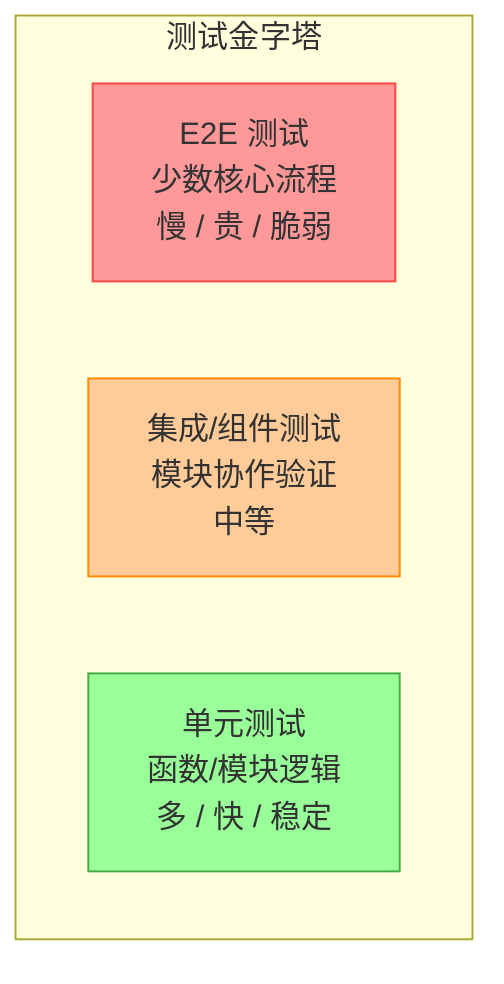
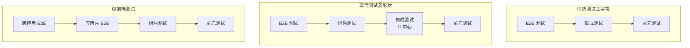
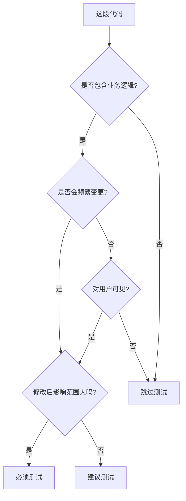

## 一句话概括

测试策略设计是前端工程化中最高层的质量保障活动，它回答了一个根本问题：**在有限的资源下，如何配置不同层级的测试来最大化质量保障效果**。测试金字塔（Test Pyramid）是指导这一决策的核心框架——将测试分为**单元测试**（基数最大，成本最低，速度最快）、**集成/组件测试**（中间层，验证模块协作）和 **E2E 测试**（顶层，数量最少，成本最高）。在 2026 年的前端实践中，有效的测试策略需要综合考量**覆盖率目标**（80% 行覆盖率是基线而非目标）、**投入产出比**（E2E 测试只覆盖 20% 的关键流程）、**运行速度**（CI 流水线应控制在 10 分钟以内），以及**可维护性**（避免脆弱的测试成为团队的负担）。

## 背景与意义

### 为什么要设计测试策略？

"100% 测试覆盖率"听起来很理想，但在实际项目中，这是一个成本极高且边际效益递减的目标。测试策略的意义在于：

1. **资源有限**：团队的时间、CI 的运行时间、维护精力都是有限的。不可能测试所有东西。
2. **不同测试的成本差异巨大**：一个单元测试的成本（编写 + 维护）约为数百元，一个 E2E 测试的成本可能是数千到数万元。
3. **测试的 ROI 递减**：前 70% 的覆盖率可以拦截 90% 的 bug，最后 10% 的覆盖率可能只拦截 1% 的 bug。

测试策略就是回答：**在哪里投入测试资源能获得最大的质量保障效果？**

### 测试策略的面试地位

在高级前端、前端架构师、测试架构师的面试中，测试策略是必考题：

- "请描述你的测试策略。"
- "如何为项目设定合理的覆盖率目标？"
- "测试金字塔在现代前端项目中还适用吗？"
- "你的项目测试覆盖率很高但 bug 依然很多，可能是什么原因？"

这些问题没有标准答案，考察的是候选人能否根据项目特性做出合理的权衡。

### 测试策略设计的输入因素

```
项目类型 ──→
团队规模 ──→
开发节奏 ──→   →  测试策略方案
技术栈   ──→
发布频率 ──→
质量要求 ──→
```

不同项目的测试策略差异：

| 项目类型 | 单元测试 | 组件测试 | E2E 测试 |
|---------|---------|---------|---------|
| 电商平台 | ⭐⭐⭐ | ⭐⭐⭐ | ⭐⭐⭐ |
| 管理后台 | ⭐⭐⭐ | ⭐⭐ | ⭐ |
| 内容网站 | ⭐⭐ | ⭐ | ⭐ |
| 工具库 | ⭐⭐⭐⭐⭐ | ⭐ | - |
| 移动端 H5 | ⭐⭐ | ⭐⭐⭐ | ⭐⭐ |

## 概念与定义

### 测试金字塔（Test Pyramid）

测试金字塔由 Mike Cohn 在 2009 年提出，是最经典的测试分层模型。



**核心原则**：越底层的测试越多，越顶层的测试越少。

| 层级 | 数量比例 | 运行时间 | 维护成本 | 发现 bug 的范围 |
|------|---------|---------|---------|---------------|
| 单元测试 | 70% | 毫秒级 | 低 | 函数级 |
| 组件测试 | 20% | 秒级 | 中 | 模块级 |
| E2E 测试 | 10% | 分钟级 | 高 | 系统级 |

### 测试覆盖率的四种指标

```typescript
// 被测试的代码
function processOrder(order: Order, user: User): OrderResult {
  let discount = 0;
  
  // 分支 1: VIP 用户享受 20% 折扣
  if (user.isVip) {
    discount = 0.2;
  }
  
  // 分支 2: 大额订单额外 5% 折扣
  if (order.total > 1000) {
    discount += 0.05;
  }
  
  // 分支 3: 新用户首单优惠
  if (user.isNew && !user.hasUsedDiscount) {
    discount = Math.max(discount, 0.3);
  }
  
  return {
    originalTotal: order.total,
    discount,
    finalTotal: order.total * (1 - discount),
    // 行 18: 计算积分
    points: Math.floor(order.total * 0.1)
  };
}
```

```
覆盖率报告解读：

行覆盖率（Lines）: 18/20 = 90%    → 执行的代码行比例
分支覆盖率（Branches）: 3/6 = 50% → if/else 分支走到的比例
函数覆盖率（Functions）: 1/1 = 100% → 被调用的函数比例
语句覆盖率（Statements）: 15/18 = 83% → 执行的语句比例

问题：行覆盖率 90%，但分支覆盖率只有 50%。
      user.isVip=true 且 order.total=500 的路径从未测试过。
      这可能导致 VIP 用户的折扣计算有 bug 而未被发现。
```

### 核心术语

| 术语 | 定义 |
|------|------|
| 测试策略 | 整体的质量保障方案，包含测试层级、工具、流程、目标 |
| 测试金字塔 | 描述测试层级数量和成本的模型 |
| 覆盖率 | 测试代码覆盖了多少生产代码的度量 |
| 变异测试 | 通过引入代码变异来评估测试充分性的方法 |
| TDD | 测试驱动开发，先写测试再写代码 |
| BDD | 行为驱动开发，从用户行为角度描述需求 |
| 回归测试 | 验证已有功能没有被新代码破坏 |

## 核心知识点拆解

### 1. 测试金字塔的现代演化

移动端、微前端、Serverless、岛屿架构等新技术范式催生了测试金字塔的不同变体。



**测试钻石（Testing Diamond）**：随着前端组件化的发展，组件测试（集成测试）取代单元测试成为测试金字塔的中心。原因是前端业务逻辑越来越多地封装在组件中，而非孤立的函数中。因此，测试策略的重心应从"纯函数测试"转移到"组件行为测试"。

### 2. 覆盖率目标的设定

覆盖率不是目标，而是信号。合理的覆盖率目标应该是"需要时覆盖，不需要时不强求"。

```javascript
// jest.config.js - 覆盖率阈值设置
module.exports = {
  coverageThreshold: {
    // 全局要求
    global: {
      statements: 80,
      branches: 75,
      functions: 80,
      lines: 80,
    },
    // 关键模块要求更高
    './src/store/**/*.ts': {
      statements: 95,
      branches: 90,
    },
    './src/utils/**/*.ts': {
      statements: 95,
      branches: 90,
    },
    // UI 组件适当放宽
    './src/components/**/*.tsx': {
      statements: 70,
      branches: 60,
    },
    // 页面级组件
    './src/pages/**/*.tsx': {
      statements: 60,
      branches: 50,
    },
    // 类型定义文件无需覆盖
    './src/types/**/*.ts': {
      statements: 0,
      branches: 0,
    },
  },
  
  // 忽略不重要的文件
  collectCoverageFrom: [
    'src/**/*.{ts,tsx}',
    '!src/**/*.d.ts',
    '!src/**/index.ts',
    '!src/vite-env.d.ts',
  ],
};
```

**不同类型代码的合理覆盖率目标**：

| 代码类型 | 建议覆盖率 | 原因 |
|---------|-----------|------|
| Redux Reducer / Zustand Store | 95-100% | 纯函数，状态变更逻辑，容易测试 |
| 工具函数（格式化、校验） | 95-100% | 纯函数，边界条件多，容易漏测 |
| 自定义 Hooks | 85-95% | 有状态逻辑，但仍然是"输入→输出" |
| UI 组件 | 60-80% | 部分代码（如样式、模板）不需要测试 |
| 页面级组件 | 40-60% | 大量胶水代码，测试成本高 |
| 配置文件、类型定义 | 0% | 不涉及执行逻辑 |

### 3. 不同测试层级的分工

优秀的测试策略不是"每一层都写很多测试"，而是"让每一层做自己擅长的事"。

```typescript
// 示例：用户注销功能的三层测试

// === 1. 单元测试：验证注销逻辑 ===
// userService.ts
export function logout(userId: string): void {
  // 清除 session
  sessionStorage.removeItem(`session_${userId}`);
  // 清除本地缓存
  localStorage.removeItem(`cache_${userId}`);
  // 发送注销请求
  fetch('/api/logout', { method: 'POST', body: JSON.stringify({ userId }) });
}

// userService.test.ts
describe('logout 单元测试', () => {
  beforeEach(() => {
    sessionStorage.clear();
    localStorage.clear();
    jest.clearAllMocks();
  });

  it('应该清除 session', () => {
    sessionStorage.setItem('session_user1', 'token123');
    logout('user1');
    expect(sessionStorage.getItem('session_user1')).toBeNull();
  });

  it('应该清除本地缓存', () => {
    localStorage.setItem('cache_user1', 'some-data');
    logout('user1');
    expect(localStorage.getItem('cache_user1')).toBeNull();
  });

  it('应该发送注销请求', () => {
    global.fetch = jest.fn().mockResolvedValue({ ok: true });
    logout('user1');
    expect(fetch).toHaveBeenCalledWith('/api/logout', expect.objectContaining({
      method: 'POST',
      body: JSON.stringify({ userId: 'user1' })
    }));
  });
});

// === 2. 组件测试：验证用户界面的交互 ===
// LogoutButton.tsx
export function LogoutButton() {
  const [confirming, setConfirming] = useState(false);
  const [loggingOut, setLoggingOut] = useState(false);

  if (loggingOut) return <div data-testid="logging-out">注销中...</div>;

  if (confirming) {
    return (
      <div data-testid="confirm-dialog">
        <p>确定要退出登录吗？</p>
        <button onClick={handleConfirm} data-testid="confirm-yes">确定</button>
        <button onClick={() => setConfirming(false)} data-testid="confirm-no">取消</button>
      </div>
    );
  }

  return (
    <button onClick={() => setConfirming(true)} data-testid="logout-btn">
      退出登录
    </button>
  );
}

// LogoutButton.test.tsx
describe('LogoutButton 组件测试', () => {
  it('初始状态下显示"退出登录"按钮', () => {
    render(<LogoutButton />);
    expect(screen.getByTestId('logout-btn')).toBeInTheDocument();
  });

  it('点击后显示确认对话框', async () => {
    render(<LogoutButton />);
    await fireEvent.click(screen.getByTestId('logout-btn'));
    expect(screen.getByTestId('confirm-dialog')).toBeInTheDocument();
    expect(screen.getByText('确定要退出登录吗？')).toBeInTheDocument();
  });

  it('点击取消回到初始状态', async () => {
    render(<LogoutButton />);
    await fireEvent.click(screen.getByTestId('logout-btn'));
    await fireEvent.click(screen.getByTestId('confirm-no'));
    expect(screen.queryByTestId('confirm-dialog')).not.toBeInTheDocument();
    expect(screen.getByTestId('logout-btn')).toBeInTheDocument();
  });

  it('点击确定应调用注销并显示加载状态', async () => {
    jest.spyOn(userService, 'logout').mockResolvedValue(undefined);
    render(<LogoutButton />);
    await fireEvent.click(screen.getByTestId('logout-btn'));
    await fireEvent.click(screen.getByTestId('confirm-yes'));
    expect(screen.getByTestId('logging-out')).toBeInTheDocument();
  });
});

// === 3. E2E 测试：验证完整注销流程 ===
// logout.spec.ts
test('用户完整注销流程', async ({ page }) => {
  // 1. 用户已登录
  await page.goto('/dashboard');
  await expect(page.getByText('欢迎回来')).toBeVisible();

  // 2. 点击注销
  await page.getByTestId('logout-btn').click();

  // 3. 确认注销
  await expect(page.getByText('确定要退出登录吗？')).toBeVisible();
  await page.getByTestId('confirm-yes').click();

  // 4. 验证已退出（跳转到登录页）
  await page.waitForURL('**/login');
  await expect(page.getByTestId('login-form')).toBeVisible();

  // 5. 验证无法再访问受保护页面
  await page.goto('/dashboard');
  await page.waitForURL('**/login');
});
```

**三层测试的分工总结**：

| 层级 | 验证内容 | 成本 | 时机 |
|------|---------|------|------|
| 单元测试 | 注销函数的逻辑正确性 | 低 | 每次提交 |
| 组件测试 | 注销按钮的 UI 交互流程 | 中 | 每次提交 |
| E2E 测试 | 完整的注销→跳转→权限验证 | 高 | 合并前/发布前 |

### 4. 测试替身策略

测试中不可避免地要替换外部依赖。选择合适的测试替身（Test Double）是测试策略设计的重要部分。

```typescript
// === 测试替身的五种类型 ===

// 1. Dummy（哑元）—— 满足参数要求，但不使用
function calculatePrice(items: any[], coupon?: any) {
  // ... 不使用 coupon 的逻辑
}

test('不使用优惠券的价格计算', () => {
  const dummyCoupon = {}; // Dummy：满足类型但不使用
  const price = calculatePrice([{ price: 100 }], dummyCoupon);
  expect(price).toBe(100);
});

// 2. Fake（仿制）—— 轻量级实现，替代真实依赖
// 真实数据库 → 内存数据库
class InMemoryDatabase {
  private store = new Map<string, any>();

  async find(id: string) {
    return this.store.get(id);
  }

  async save(id: string, data: any) {
    this.store.set(id, data);
  }

  async clear() {
    this.store.clear();
  }
}

test('用户服务测试', async () => {
  const db = new InMemoryDatabase(); // Fake：轻量级内存数据库
  const service = new UserService(db);
  await service.create({ id: '1', name: '张三' });
  const user = await service.get('1');
  expect(user.name).toBe('张三');
});

// 3. Stub（桩）—— 提供预设返回值
test('用户已登录时显示仪表盘', () => {
  // Stub：让 authService.isLoggedIn 始终返回 true
  jest.spyOn(authService, 'isLoggedIn').mockReturnValue(true);

  render(<ProtectedPage />);
  expect(screen.getByText('仪表盘')).toBeInTheDocument();
});

// 4. Spy（监听器）—— 监听调用信息
test('表单提交时发送正确的数据', async () => {
  const spy = jest.spyOn(api, 'submitOrder');
  
  render(<OrderForm />);
  await userEvent.click(screen.getByRole('button', { name: '提交' }));

  expect(spy).toHaveBeenCalledWith(expect.objectContaining({
    items: expect.any(Array),
    total: expect.any(Number)
  }));
});

// 5. Mock（模拟器）—— 预设行为 + 验证交互
test('购物车 API 错误时显示错误提示', async () => {
  // Mock：预设 API 返回错误
  const mock = jest.fn().mockRejectedValue(new Error('网络错误'));
  jest.spyOn(api, 'addToCart').mockImplementation(mock);

  render(<CartPage />);
  await userEvent.click(screen.getByText('结算'));

  // 验证 Mock 被调用
  expect(mock).toHaveBeenCalledTimes(1);
  // 验证 UI 响应
  expect(screen.getByText('结算失败')).toBeInTheDocument();
});
```

### 5. CI/CD 中的测试策略

测试策略在 CI/CD 流水线中如何执行，决定了开发者的开发节奏。

```yaml
# .github/workflows/test.yml - 分层测试策略
name: Test Suite

on:
  push:
    branches: [main, develop]
  pull_request:
    branches: [main]

jobs:
  # 第一层：快速反馈 —— 单元 + 组件测试
  unit-and-component-tests:
    runs-on: ubuntu-latest
    steps:
      - uses: actions/checkout@v4
      - uses: actions/setup-node@v4
        with:
          node-version: '20'
          cache: 'npm'
      
      - run: npm ci
      - run: npm run test:unit -- --coverage --changedSince=HEAD~1
      
      - name: Check coverage
        run: npm run test:coverage:check
  
  # 第二层：集成验证 —— 组件 + 快照测试
  integration-tests:
    needs: unit-and-component-tests
    runs-on: ubuntu-latest
    steps:
      - uses: actions/checkout@v4
      - run: npm ci
      - run: npm run test:integration
      - run: npm run test:visual
  
  # 第三层：全面验证 —— E2E + 安全测试
  e2e-and-security:
    needs: integration-tests
    runs-on: ubuntu-latest
    services:
      app:
        image: my-app:latest
        ports:
          - 3000:3000
      db:
        image: postgres:16
        env:
          POSTGRES_DB: test
    steps:
      - uses: actions/checkout@v4
      - run: npm ci
      - run: npx playwright install --with-deps
      
      - name: Run E2E tests
        run: npm run test:e2e
        env:
          BASE_URL: http://localhost:3000
      
      - name: Upload test results
        if: always()
        uses: actions/upload-artifact@v4
        with:
          name: playwright-report
          path: playwright-report/
  
  # 最终门禁：合并检查
  quality-gate:
    needs: [unit-and-component-tests, integration-tests, e2e-and-security]
    runs-on: ubuntu-latest
    steps:
      - run: echo "✅ All tests passed!"
```

**CI 测试策略设计原则**：

```
速度：单元测试 < 1min → 组件测试 < 3min → E2E 测试 < 10min
反馈：单元测试失败立即通知 → E2E 测试失败阻止合并
并行：尽可能并行的层级 → 依赖的层级串行
门禁：单元测试必须全绿 → 组件测试必须全绿 → E2E 测试建议全绿
```

## 实战案例

### 为电商平台设计完整的测试策略

```typescript
// 1. 分析项目特征
const projectProfile = {
  type: '电商平台',
  teamSize: 12,       // 12 人前端团队
  techStack: {
    framework: 'React 18',
    state: 'Redux Toolkit',
    routing: 'React Router 6',
    api: 'React Query',
    build: 'Vite'
  },
  releaseCycle: '双周发布',
  userBase: '百万级用户',
  criticalFeatures: [
    '用户登录/注册',
    '商品搜索/浏览',
    '购物车管理',
    '下单/支付',
    '订单管理',
    '用户中心'
  ]
};

// 2. 定义测试策略文档
const testStrategy = {
  // === 总体原则 ===
  principles: [
    '每个核心功能模块必须有单元测试',
    '每个核心用户流程必须有 E2E 测试',
    '测试覆盖率达到 80% 以上',
    'CI 测试总时间不超过 15 分钟',
    '禁止 Flaky 测试——发现即修复或删除'
  ],

  // === 分层策略 ===
  layers: {
    unit: {
      coverage: {
        utils: '95%',         // 纯工具函数
        store: '95%',         // 状态管理
        hooks: '85%',         // 自定义 Hooks
        components: '70%',    // UI 组件
        pages: '50%'          // 页面级组件
      },
      focus: [
        '登录/注册逻辑',
        '购物车加减操作',
        '价格计算/优惠券计算',
        '数据格式化函数',
        '自定义 Hooks'
      ],
      exempt: [
        '纯类型定义文件',
        '配置文件',
        '第三方库包装层'
      ]
    },

    integration: {
      // 组件 + 模块集成测试
      focus: [
        '购物车组件（增删改）',
        '商品筛选组件（多条件组合）',
        '登录表单组件（验证+提交流程）',
        '订单提交组件（创建订单→支付）',
        '搜索组件（实时搜索→结果展示）'
      ],
      strategy: '对关键组件编写集成测试，Mock API 调用',
      target: '覆盖 80% 的关键交互场景'
    },

    e2e: {
      // 只覆盖最核心的用户流程
      critical: [
        '用户注册 → 登录 → 浏览商品',
        '商品搜索 → 筛选 → 查看详情',
        '添加购物车 → 修改数量 → 结算',
        '下单 → 支付 → 查看订单',
        '用户中心 → 修改信息 → 查看历史订单'
      ],
      frequency: '每次 PR 合并前执行',
      timeout: '每个测试 < 30 秒，总套件 < 10 分钟',
      browsers: ['Chromium', 'Firefox']
    }
  },

  // === 异常场景测试 ===
  edgeCases: [
    '网络超时/断网时显示友好提示',
    'API 返回错误状态码时显示错误信息',
    '请求并发（快速连续点击提交按钮）',
    '大量数据（购物车 100 件商品）',
    '空数据（搜索结果为 0）',
    '用户未登录时访问受保护页面',
    'Token 过期后自动跳转登录页'
  ],

  // === 测试运行调度 ===
  schedule: {
    'pre-commit': '单元测试（增量）',
    'pre-push': '单元测试 + 组件测试（增量）',
    'PR': '全量单元测试 + 组件测试 + E2E 测试（核心流程）',
    'nightly': '全量 E2E 测试 + 性能测试',
    'pre-release': '回归测试（全部测试）'
  },

  // === 工具选型 ===
  tools: {
    unit: 'Vitest',
    component: '@testing-library/react',
    e2e: 'Playwright',
    coverage: 'Istanbul (Vitest 内置)',
    visual: 'Storybook + Chromatic',
    ci: 'GitHub Actions',
    reporting: 'Allure'
  },

  // === 质量门禁（Quality Gate） ===
  qualityGates: [
    {
      name: '快速门禁',
      trigger: '每 commit',
      check: '增量单元测试通过',
      block: false  // 不阻塞，仅通知
    },
    {
      name: '标准门禁',
      trigger: '每 PR',
      check: '全量单元测试 + 组件测试通过，覆盖率 ≥ 75%',
      block: true   // 阻塞合并
    },
    {
      name: '严格门禁',
      trigger: '合并到 main 前',
      check: 'E2E 核心流程通过，覆盖率 ≥ 80%',
      block: true   // 阻塞合并
    }
  ]
};
```

## 底层原理

### 测试覆盖率的统计机制

理解覆盖率统计的原理，有助于正确解读覆盖率报告。

```javascript
// === Istanbul（底层覆盖率引擎）的简化实现 ===

class CodeCoverage {
  constructor() {
    this.counters = {
      statements: new Map(),
      branches: new Map(),
      functions: new Map(),
      lines: new Map()
    };
  }

  // 在源代码中插入计数器
  instrument(source: string, filePath: string): string {
    // 1. 解析代码为 AST
    const ast = parse(source);
    
    // 2. 遍历 AST，在关键位置插入计数器
    traverse(ast, {
      // 在每一行插入行计数器
      enter(path) {
        if (path.isStatement() || path.isExpression()) {
          const line = path.node.loc.start.line;
          const col = path.node.loc.start.column;
          
          // 插入: __coverage.counters.lines.set('1:1', ...);
          path.insertBefore(
            createCounterStatement(`lines`, `${filePath}:${line}:${col}`)
          );
        }
      },
      
      // 在分支前插入分支计数器
      IfStatement(path) {
        const { loc } = path.node;
        const branchId = `${filePath}:${loc.start.line}:${loc.start.column}`;
        
        // 插入: __coverage.beginBranch(branchId, 2); // 2 个分支
        path.insertBefore(
          createBeginBranchStatement(branchId, 2)
        );
        
        // 在 if 体末尾插入: __coverage.endBranch(branchId, 0);
        path.get('consequent').get('body').pushContainer(
          'body',
          createEndBranchStatement(branchId, 0)
        );
        
        // 在 else 体末尾插入: __coverage.endBranch(branchId, 1);
        if (path.node.alternate) {
          // ...
        }
      },
      
      // 在函数体入口插入函数计数器
      FunctionDeclaration(path) {
        const funcId = `${filePath}:${path.node.id?.name}:${path.node.loc.start.line}`;
        path.get('body').unshiftContainer(
          'body',
          createFunctionEntryStatement(funcId)
        );
      }
    });
    
    // 3. 返回插桩后的代码
    return generateCode(ast);
  }

  // 覆盖率计算
  calculateCoverage(): CoverageReport {
    const total = {
      statements: { total: 0, covered: 0 },
      branches: { total: 0, covered: 0 },
      functions: { total: 0, covered: 0 },
      lines: { total: 0, covered: 0 }
    };

    // 聚合所有计数器的数据
    for (const [filePath, counters] of this.counters.lines) {
      const [_, line, col] = filePath.split(':');
      total.lines.total++;
      if (counters.executed > 0) {
        total.lines.covered++;
      }
    }

    // 计算百分比
    return {
      lines: (total.lines.covered / total.lines.total) * 100,
      branches: (total.branches.covered / total.branches.total) * 100,
      functions: (total.functions.covered / total.functions.total) * 100,
      statements: (total.statements.covered / total.statements.total) * 100
    };
  }
}

// === 变异测试（Mutation Testing） ===
// 变异测试比覆盖率更严格：它通过修改代码来验证测试是否真的能拦截 bug

// 原始代码
function isAdult(age: number): boolean {
  return age >= 18;
}

// 变异代码（变异测试会自动生成这些变体）
// 变异 1: age >= 18 → age > 18
// 变异 2: age >= 18 → age >= 17
// 变异 3: age >= 18 → age >= 19
// 变异 4: return age >= 18 → return !(age >= 18)

// 测试
test('isAdult', () => {
  expect(isAdult(18)).toBe(true);   // 杀死变异 1（如果 >18 才 true，18 就是 false）
  expect(isAdult(17)).toBe(false);  // 杀死变异 2、3
  // 但变异 4 没有被杀死！如果 return 取反了，测试不会感知
  // 需要补充：
  expect(isAdult(18)).toBe(true);   // 如果被取反，这里是 false，测试失败
  expect(isAdult(16)).toBe(false);
  // 实际上已经够了，因为 expect(18).toBe(true) 已经被覆盖
});

// 变异测试评分（Mutation Score）
// 变异杀死的比例，通常目标 > 80%
// 覆盖率 100% 时，变异测试评分可能只有 60%
// 这比单纯看行覆盖率更有说服力
```

### 测试的 Flakiness 分析

Flaky Test（不稳定的测试）是测试策略中最令人头疼的问题。理解其根本原因有助于设计更稳定的测试。

```typescript
// === Flaky Test 的根本原因分类 ===

class FlakinessAnalyzer {
  // 分类 1: 时间相关 (Timing)
  static timingIssues = [
    {
      problem: '等待固定时间而非条件',
      // ❌ 固定等待
      bad: `await page.waitForTimeout(3000);`,
      // ✅ 等待条件
      good: `await expect(page.getByText('加载完成')).toBeVisible({timeout: 10000});`
    },
    {
      problem: '动画未完成时断言',
      // ❌ 动画中
      bad: `await page.click('.submit');
            await expect(page.getByText('成功')).toBeVisible();`,
      // ✅ 等待动画完成
      good: `await page.click('.submit');
             await page.waitForSelector('.result-loaded');
             await expect(page.getByText('成功')).toBeVisible();`
    }
  ];

  // 分类 2: 数据污染 (Data Pollution)
  static dataPollution = [
    {
      problem: '测试间共享数据',
      bad: '测试 A 创建了一个用户，测试 B 假设该用户存在',
      good: '每个测试使用独立的前缀/随机 ID，测试前后清理数据'
    }
  ];

  // 分类 3: 环境依赖 (Environment)
  static environmentIssues = [
    {
      problem: '依赖外部服务',
      bad: 'E2E 测试调用真实的支付网关',
      good: 'Mock 第三方服务，仅集成测试使用真实服务'
    },
    {
      problem: '浏览器版本差异',
      bad: '只在最新 Chrome 上测试',
      good: '在 CI 中使用固定的浏览器版本'
    }
  ];

  // 分类 4: 测试顺序依赖 (Order Dependency)
  static orderDependency = [
    {
      problem: '测试按特定顺序执行才通过',
      bad: 'test A 设置状态，test B 依赖此状态',
      good: '每个测试独立 setup/teardown，不依赖顺序'
    }
  ];
}

// Flaky Test 的检测策略
class FlakyDetector {
  // 自动重跑检测
  static async detectFlakiness(testFile: string, times = 10) {
    const results: { pass: boolean; duration: number }[] = [];
    
    for (let i = 0; i < times; i++) {
      const start = Date.now();
      try {
        await runTest(testFile);
        results.push({ pass: true, duration: Date.now() - start });
      } catch (error) {
        results.push({ pass: false, duration: Date.now() - start });
      }
    }
    
    const passCount = results.filter(r => r.pass).length;
    const flakinessRate = (times - passCount) / times;
    
    return {
      passRate: `${(passCount / times) * 100}%`,
      flakinessRate: `${flakinessRate * 100}%`,
      verdict: flakinessRate > 0.2 
        ? '🔴 严重 Flaky，需要修复' 
        : flakinessRate > 0.05 
          ? '🟡 中度 Flaky，建议修复' 
          : '🟢 稳定'
    };
  }
}
```

## 高频面试题解析

### 面试题 1：测试金字塔在现代前端项目中还适用吗？有什么挑战和改进？

**答案要点**：

**仍适用，但需要进化**。

**现代前端的挑战**：
1. **组件化改变了测试的粒度**：现在"组件"是比"函数"更自然的测试单元，组件测试应该比纯单元测试更多。
2. **API 复杂度增加**：状态管理（Redux）、数据获取（React Query）、路由（React Router）等中间件增加了测试复杂度。
3. **微前端架构**：跨应用的集成测试和 E2E 测试变得更重要。
4. **Server Components**：服务端渲染的组件需要运行在 Node.js 环境中测试。

**测试菱形状的适应**：
```
传统金字塔：  单元最多 → 组件居中 → E2E 最少
现代钻石：    单元减少 → 组件最多 → E2E 适中

变化原因：
- 前端业务逻辑更多在组件中，而非独立函数
- 组件测试的投入产出比最高（覆盖组件行为 + 模块协作）
- 单元测试对纯函数仍然重要，但占总量的比例下降了
```

### 面试题 2：覆盖率 100% 就代表代码质量高吗？为什么？

**答案要点**：

**不一定**。覆盖率 100% 可能掩盖以下问题：

1. **测试没有断言**：代码执行了，但没有验证结果。
   ```typescript
   test('覆盖率', () => {
     calculatePrice(100, 0.2); // 执行了，但没有断言
   });
   ```

2. **测试了实现，未测试行为**：
   ```typescript
   // ✅ 有覆盖率，但没用
   it('点击按钮', () => {
     render(<Button />);
     fireEvent.click(button);
     expect(button.props.onClick).toHaveBeenCalled(); // 测试了内部状态
   });
   ```

3. **跳过复杂分支**：只测试了简单路径，复杂逻辑路径未被测试。
   ```typescript
   // 有行覆盖率，但分支覆盖率低
   if (condition1 && condition2 && condition3) {
     // 很复杂；但测试只覆盖了条件为 false 的路径
   }
   ```

4. **Mock 掉了所有复杂逻辑**：
   ```typescript
   jest.mock('./complex-module'); // Mock 了整个模块，测试变得无意义
   ```

**更好的质量指标组合**：
- 行覆盖率 + 分支覆盖率
- 变异测试评分（Mutant Score）
- 测试与 bug 的关联率
- 代码评审中的问题发现率

### 面试题 3：一个项目测试覆盖率很高但线上还是有很多 bug，可能的原因是什么？

**答案要点**：

**原因分析**：

1. **测试覆盖了 "错误的代码"**：
   - 大量测试在测试框架代码和样板代码上（配置、类型定义）。
   - 核心业务逻辑反而没有覆盖。

2. **集成问题未被覆盖**：
   - 单元测试隔离得好，但模块间协作的 bug 不会被发现。
   - 前后端 API 契约不一致——前端 Mock 太完美了。

3. **E2E 测试不足**：
   - 单元测试覆盖了 90%，但 E2E 只有 2 个测试。
   - 核心用户流程长时间没有 E2E 验证。

4. **测试质量低**：
   - 断言过于宽松（`expect(something).toBeTruthy()`）。
   - Mock 覆盖了真实错误（`jest.mock('./api')` 后从未验证 Mock 是否正确）。

5. **变动过频的代码**：
   - UI 频繁改动，但对应的测试没有更新。
   - 测试和代码"脱节"——测试绿了但不是在测试真实代码。

**解决方案**：
```
1. 审查测试质量，而非只看覆盖率数字
2. 增加分支覆盖率和变异测试评分
3. 确保核心 E2E 流程覆盖完整
4. 引入测试门禁：新代码必须有对应的有意义的测试
5. 使用"缺陷注入"测试——故意引入 bug 看测试是否会发现
```

### 面试题 4：你如何决定哪些代码需要写测试，哪些不需要？

**答案要点**：

**决策框架**：



**具体的优先级排序**：

| 优先级 | 代码类型 | 原因 |
|--------|---------|------|
| P0 | 核心业务逻辑（价格计算、权限判断） | 出错直接影响用户 |
| P0 | 公共工具函数（格式化、校验、日期处理） | 被多处调用，影响面广 |
| P1 | 状态管理逻辑（Reducer、Store） | 数据流的正确性保障 |
| P1 | API 服务层 | 前后端契约验证 |
| P2 | 交互复杂的 UI 组件（表单、购物车） | 用户体验密切相关 |
| P3 | 纯展示组件（头像、图标、标签） | 出错不影响功能 |
| P3 | 配置代码（路由表、常量） | 基本不变 |
| 跳过 | 类型定义、样式文件 | 无执行逻辑 |
| 跳过 | 第三方库包装 | 相信 vendor 质量 |

### 面试题 5：在一个从零开始的 React 项目中，如何分阶段建立测试体系？

**答案要点**：

**第一阶段：基础建设（第 1-2 周）**
```
目标：建立测试基础设施，确保关键工具函数可测试
- 配置 Jest + React Testing Library
- 配置覆盖率收集和阈值
- 为公共工具函数编写单元测试
- 建立 CI 中的测试环节
- 设置覆盖率门禁（初始 50%）
```

**第二阶段：核心覆盖（第 3-4 周）**
```
目标：覆盖核心业务模块和关键用户流程
- 为状态管理（Redux/Zustand）添加单元测试
- 为核心组件（表单、导航）编写组件测试
- 编写 3-5 个核心 E2E 测试
- 覆盖率提升至 70%
```

**第三阶段：全面覆盖（第 1-2 个月）**
```
目标：达到 80%+ 覆盖率，建立完整的测试体系
- 为所有业务组件添加组件测试
- 覆盖所有异常和边界场景
- 为所有核心用户流程添加 E2E 测试
- 引入视觉回归测试
- 建立测试代码评审机制
```

**第四阶段：持续优化（长期）**
```
目标：维持测试质量，优化测试速度和稳定性
- 定期审查测试质量，移除无意义测试
- 优化测试运行速度（并行、缓存）
- 解决 Flaky 测试
- 引入变异测试评估测试有效性
- 跟踪测试 vs bug 的关联分析
```

## 总结与扩展

### 知识体系

测试策略的核心要素：

- **分层模型**：测试金字塔/钻石/奖杯，不同架构的适配。
- **覆盖策略**：覆盖率目标设定、增量覆盖、重点覆盖。
- **执行策略**：CI/CD 测试流水线、并行执行、门禁策略。
- **维护策略**：测试审查、Flaky 处理、测试债管理。
- **度量指标**：行覆盖率、分支覆盖率、变异评分、测试 ROI。

### 测试策略的核心原则

```
1. 80/20 法则：20% 的测试覆盖 80% 的关键风险
2. 移动速度：测试应该尽可能快
3. 确定性：测试结果应该可复现
4. 维护性：测试也是代码，需要良好设计
5. 有意义：每个测试都应该是必要的
6. 及时反馈：失败的测试应该尽早通知相关人
```

### 延伸阅读

- [Test Pyramid - Martin Fowler](https://martinfowler.com/bliki/TestPyramid.html) — 测试金字塔的经典解释
- [The Practical Test Pyramid - Ham Vocke](https://martinfowler.com/articles/practical-test-pyramid.html) — 实践版测试金字塔指南
- [Testing Strategies in a Microservices Architecture - Toby Clemson](https://martinfowler.com/articles/microservice-testing/) — 微服务测试策略
- [Just Say No to More End-to-End Tests - Google Testing Blog](https://testing.googleblog.com/2015/04/just-say-no-to-more-end-to-end-tests.html) — 为什么不需要太多 E2E 测试
- [Mutation Testing with Stryker](https://stryker-mutation.io/) — 变异测试工具
- [Frontend Testing: A Comprehensive Guide](https://www.cypress.io/blog/2021/07/22/the-front-end-test-pyramid-revisited/) — 前端测试金字塔回顾

测试策略没有"银弹"。每个项目都有自己独特的上下文——技术栈、团队技能、业务优先级、发布节奏——这些因素共同决定了"适度"的测试策略。好的测试策略不是"最多"的测试，而是"刚好够用"的测试。学会在"测试不足"和"过度测试"之间找到平衡点，是测试策略设计的终极追求。
