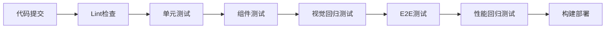

## 一句话概括

自动化测试集成是将单元测试、集成测试、端到端测试与CI/CD流水线深度融合的工程实践，通过截图对比确保UI视觉一致性，通过性能回归检测防止系统性能退化，从而构建从代码提交到生产交付的全链路质量保障体系。

## 背景与意义

在前端工程化领域，"测试"长期处于一种尴尬的地位——大多数开发者承认它重要，但实际项目中的测试覆盖率往往惨不忍睹。根据State of JS 2025年的调研数据，超过60%的前端项目没有自动化UI测试，超过80%的项目没有视觉回归测试。

这种现状的根源，并非开发者懒惰，而是传统前端测试存在几个深层次矛盾：

**测试收益的滞后性**：写测试消耗当下时间，但收益体现在未来——这种"现在痛苦、未来受益"的模式，在业务压力下天然被牺牲。

**UI测试的脆弱性**：传统Selenium/WebDriver时代的端到端测试，一场CSS重构就能让数百个测试用例集体变红，维护成本远超编写成本。

**视觉验证的主观性**：人类肉眼判断UI"看起来对不对"这件事，天然难以用断言来表达。"按钮距离顶部18px"和"按钮距离顶部20px"——哪个是对的？是bug还是设计变更？

正是在这样的背景下，现代化的自动化测试集成方案应运而生。它的核心思路是：**将测试从"负担"变为"基础设施"**。

当自动化测试被正确集成到CI流水线中时，它不再是开发流程中的"绊脚石"，而是一道自动化的安全网。每次代码提交，CI流水线自动触发测试套件——单元测试验证逻辑正确性、截图对比捕获视觉变化、性能回归测试检测性能趋势。开发者不再需要手动判断"这次改动是否引入了bug"，系统自动给出答案。

## 概念与定义

自动化测试集成并非单一技术，而是一套多层次的质量保障体系。理解它的前提，是厘清以下几个核心概念：

### 测试金字塔与前端的特殊性

经典的测试金字塔（Test Pyramid）将测试分为三层：底层是大量快速的单元测试，中层是中等粒度的集成测试，顶层是少量慢速的端到端测试。但在前端领域，这个金字塔的形状发生了显著变化：

- **单元测试**：测试独立函数、组件、工具方法。使用Jest、Vitest等框架。
- **组件测试**：测试单个组件的渲染和交互。使用@testing-library/react/vue、Enzyme等。
- **集成测试**：测试多个组件协同工作。仍使用组件测试框架，但粒度更大。
- **E2E测试**：模拟用户真实操作流。使用Playwright、Cypress等。
- **视觉回归测试**：通过截图对比检测UI视觉变化。使用Playwright Screenshot、Percy、Chromatic等。
- **性能回归测试**：检测性能指标的退化。使用Lighthouse CI、Playwright Performance等。

### CI集成中的测试流水线

CI/CD流水线中的测试阶段，通常按以下顺序执行：



每个阶段都有明确的"门禁"标准：当前阶段失败则流水线终止，确保问题在最早期被发现。

### 截图对比

截图对比（Screenshot Comparison / Visual Regression Testing）的核心思路是：**拿当前版本的页面截图，与基准版本（Baseline）进行比较，标记任何像素级别的差异**。

这解决了传统UI测试的核心痛点——不再需要手写"这个div的padding是16px"这样的断言，而是让工具自动对比整个界面的视觉输出。

### 性能回归

性能回归（Performance Regression）检测的是：**代码变更是否导致了关键性能指标的退化**。常见指标包括：

- LCP（Largest Contentful Paint）：最大内容绘制
- TBT（Total Blocking Time）：总阻塞时间
- CLS（Cumulative Layout Shift）：累计布局偏移
- FCP（First Contentful Paint）：首次内容绘制
- TTI（Time to Interactive）：可交互时间
- Bundle Size：打包体积

## 核心知识点拆解

### 一、基于Playwright的E2E测试集成

Playwright是目前最主流的前端E2E测试框架，由微软维护。它解决了传统测试框架的多个痛点：自动等待、跨浏览器支持、网络拦截、截图能力一流。

以下是一个完整的Playwright测试配置和用例编写：

```typescript
// playwright.config.ts
import { defineConfig, devices } from '@playwright/test';

export default defineConfig({
  testDir: './e2e',
  fullyParallel: true,
  forbidOnly: !!process.env.CI,
  retries: process.env.CI ? 2 : 0,
  workers: process.env.CI ? 4 : undefined,
  reporter: [
    ['html'],
    ['json', { outputFile: 'test-results/results.json' }],
    ['junit', { outputFile: 'test-results/junit.xml' }],
  ],
  use: {
    baseURL: process.env.BASE_URL || 'http://localhost:3000',
    trace: 'retain-on-failure',
    screenshot: 'only-on-failure',
    video: 'retain-on-failure',
  },
  projects: [
    {
      name: 'chromium',
      use: { ...devices['Desktop Chrome'] },
    },
    {
      name: 'firefox',
      use: { ...devices['Desktop Firefox'] },
    },
    {
      name: 'Mobile Safari',
      use: { ...devices['iPhone 14'] },
    },
  ],
  webServer: {
    command: 'pnpm dev --port 3000',
    port: 3000,
    timeout: 120 * 1000,
    reuseExistingServer: !process.env.CI,
  },
});
```

编写一个真实的E2E测试用例——模拟用户在电商网站中搜索商品、加入购物车、完成结算的全流程：

```typescript
// e2e/purchase-flow.spec.ts
import { test, expect } from '@playwright/test';

test.describe('用户购买流程', () => {
  test.beforeEach(async ({ page }) => {
    // 拦截网络请求，确保测试稳定性
    await page.route('**/api/products**', async route => {
      const response = await route.fetch();
      const json = await response.json();
      // 篡改返回数据，确保测试数据一致性
      json.products = json.products.map((p: any, i: number) => ({
        ...p,
        name: `测试商品 ${i + 1}`,
        price: 99.99,
        stock: 100,
      }));
      await route.fulfill({ response, json });
    });

    await page.goto('/');
    await page.waitForLoadState('networkidle');
  });

  test('完整购买流程：搜索→加购→结算→支付', async ({ page }) => {
    // 1. 搜索商品
    await page.getByPlaceholder('搜索商品').fill('无线耳机');
    await page.getByRole('button', { name: '搜索' }).click();
    await expect(page.getByText('搜索结果')).toBeVisible();

    // 2. 选择商品加入购物车
    const firstProduct = page.locator('.product-card').first();
    await firstProduct.getByRole('button', { name: '加入购物车' }).click();

    // 3. 验证购物车徽标更新
    const cartBadge = page.locator('.cart-badge');
    await expect(cartBadge).toHaveText('1');

    // 4. 进入购物车页面
    await page.getByRole('link', { name: '购物车' }).click();
    await expect(page).toHaveURL(/\/cart/);

    // 5. 验证商品信息
    await expect(page.getByText('测试商品 1')).toBeVisible();
    await expect(page.getByText('¥99.99')).toBeVisible();

    // 6. 点击结算
    await page.getByRole('button', { name: '去结算' }).click();
    await expect(page).toHaveURL(/\/checkout/);

    // 7. 填写收货地址
    await page.getByLabel('收货人').fill('张三');
    await page.getByLabel('手机号').fill('13800138000');
    await page.getByLabel('详细地址').fill('北京市朝阳区xxx路100号');

    // 8. 选择支付方式并支付
    await page.getByText('微信支付').click();
    await page.getByRole('button', { name: '立即支付' }).click();

    // 9. 验证支付成功
    await expect(page.getByText('支付成功')).toBeVisible();
    await expect(page.getByText('订单号')).toBeVisible();
  });

  test('购物车为空时禁用结算按钮', async ({ page }) => {
    await page.getByRole('link', { name: '购物车' }).click();
    const checkoutBtn = page.getByRole('button', { name: '去结算' });
    await expect(checkoutBtn).toBeDisabled();
    await expect(page.getByText('购物车空空如也')).toBeVisible();
  });
});
```

这个测试用例展示了Playwright的核心能力：自动等待（getByRole、getByText）、网络拦截（route API）、多页面导航、表单填写、状态断言。更重要的是，它验证了整个业务流程，而不是孤立的组件状态。

### 二、截图对比实现视觉回归检测

视觉回归测试的核心挑战在于：如何区分"真正的bug"和"有意的视觉变更"？比如，设计师将按钮颜色从蓝色改为绿色——这不是bug，而是设计迭代。但如果一个CSS修改意外导致按钮变透明，那就是bug。

优秀的截图对比系统需要具备以下能力：

```typescript
// e2e/visual-regression.spec.ts
import { test, expect } from '@playwright/test';

test.describe('视觉回归测试', () => {
  /**
   * 截图对比的核心逻辑：
   * 1. 先判断是否存在基准截图（baseline）
   * 2. 如果存在基准截图，对比当前截图与基准截图
   * 3. 计算差异比例，超过阈值则标记失败
   * 4. 如果有差异（且比例在合理范围内），可以自动更新基准
   */

  // 配置视觉对比的全局阈值
  const COMPARISON_THRESHOLD = 0.01; // 1% 像素差异以内视为正常

  test('首页完整截图对比', async ({ page }) => {
    await page.goto('/');
    await page.waitForLoadState('networkidle');

    // 等待所有图片加载完成
    await page.locator('img').first().waitFor({ state: 'visible' });
    
    // 确保懒加载内容已渲染
    await page.evaluate(() => new Promise(resolve => {
      const timer = setInterval(() => {
        const lazyElements = document.querySelectorAll('[data-lazy]');
        const loadedCount = document.querySelectorAll('[data-lazy-loaded]').length;
        if (loadedCount >= lazyElements.length) {
          clearInterval(timer);
          resolve(true);
        }
      }, 100);
      setTimeout(() => { clearInterval(timer); resolve(true); }, 5000);
    }));

    // 截取全页截图
    await expect(page).toHaveScreenshot('homepage-full.png', {
      fullPage: true,
      maxDiffPixels: 1000,
      threshold: COMPARISON_THRESHOLD,
      stylePath: './e2e/screenshot-styles.css',
      animations: 'disabled',
    });
  });

  test('关键组件视觉快照对比', async ({ page }) => {
    await page.goto('/products');

    // 截取搜索结果卡片区域
    const productGrid = page.locator('.product-grid');
    await expect(productGrid).toHaveScreenshot('product-grid.png', {
      threshold: COMPARISON_THRESHOLD,
      mask: [
        // 遮盖动态内容区域（如价格标签、库存数量等）
        page.locator('.product-price'),
        page.locator('.stock-badge'),
      ],
      maskColor: '#f0f0f0', // 遮盖区域使用灰色填充
    });

    // 截取导航菜单的快照
    const navMenu = page.locator('.main-navigation');
    await expect(navMenu).toHaveScreenshot('navigation-menu.png', {
      threshold: 0.005, // 导航菜单变化容忍度更低
    });
  });

  test('响应式布局截图对比', async ({ page }) => {
    // 测试不同视口下的布局
    const viewports = [
      { width: 1920, height: 1080, name: 'desktop' },
      { width: 768, height: 1024, name: 'tablet' },
      { width: 375, height: 812, name: 'mobile' },
    ];

    for (const vp of viewports) {
      await page.setViewportSize(vp);
      await page.goto('/product/12345');
      await page.waitForLoadState('networkidle');

      // 截取商品详情的响应式快照
      await expect(page).toHaveScreenshot(`product-detail-${vp.name}.png`, {
        fullPage: true,
        threshold: 0.02,
        animations: 'disabled',
      });
    }
  });
});
```

截图对比的关键技术细节：

**像素级对比的算法原理**：Playwright底层使用pixelmatch库进行像素对比。对于两张等尺寸图片，它逐个像素比较RGB值。如果某个像素的RGB差值超过阈值（通常设为0.1~0.2），则标记为差异像素。差异像素总数除以总像素数，即为diff比例。

**遮盖（Mask）策略**：动态内容（时间戳、价格、库存数）会导致伪阳性差异。通过mask选项设定忽略区域，只对比稳定的视觉元素。

**动画禁用**：CSS动画会导致截图结果不确定。通过`animations: 'disabled'`强制暂停所有动画，确保截图的可重复性。

### 三、性能回归测试流水线

性能回归测试的挑战与视觉回归不同：**性能本身不是一个确定值，而是一个分布**。同样的代码，在CI服务器和本地环境可能产生完全不同的性能数据。因此，性能回归的核心是"趋势分析"而非"绝对值比较"。

以下是一个实用级的性能回归测试实现：

```typescript
// e2e/performance-regression.spec.ts
import { test, expect } from '@playwright/test';
import { writeFileSync, readFileSync, existsSync } from 'fs';

interface PerformanceMetrics {
  timestamp: number;
  commitHash: string;
  fcp: number;
  lcp: number;
  tbt: number;
  cls: number;
  tti: number;
  bundleSize: number;
}

const HISTORY_FILE = './perf-history.json';
const LCP_THRESHOLD_INCREASE = 1.2; // LCP退化20%以上触发告警
const TBT_THRESHOLD_INCREASE = 1.3; // TBT退化30%以上

test.describe('性能回归检测', () => {
  test('核心Web指标收集与对比', async ({ page }) => {
    // 启用性能日志
    await page.coverage.startJSCoverage();

    // 模拟3G网络环境
    await page.context().route('**/*', async route => {
      // 添加网络延迟和限速
      await new Promise(r => setTimeout(r, 200));
      await route.continue();
    });

    await page.goto('/', { waitUntil: 'networkidle' });

    // 收集核心性能指标
    const metrics: PerformanceMetrics = {
      timestamp: Date.now(),
      commitHash: process.env.COMMIT_HASH || 'local',
      fcp: 0,
      lcp: 0,
      tbt: 0,
      cls: 0,
      tti: 0,
      bundleSize: 0,
    };

    // 从Performance API获取数据
    const performanceMetrics = await page.evaluate(() => {
      const perf = performance.getEntriesByType('paint');
      const fcp = perf.find(e => e.name === 'first-contentful-paint');
      
      // 获取LCP
      const lcpObserver = new Promise<number>(resolve => {
        new PerformanceObserver(list => {
          const entries = list.getEntries();
          resolve(entries[entries.length - 1].startTime);
        }).observe({ type: 'largest-contentful-paint', buffered: true });
        setTimeout(() => resolve(0), 5000);
      });

      // 获取CLS
      const clsObserver = new Promise<number>(resolve => {
        let clsValue = 0;
        new PerformanceObserver(list => {
          for (const entry of list.getEntries()) {
            if (!entry.hadRecentInput) {
              clsValue += (entry as any).value;
            }
          }
          resolve(clsValue);
        }).observe({ type: 'layout-shift', buffered: true });
        setTimeout(() => resolve(clsValue), 5000);
      });

      return Promise.all([lcpObserver, clsObserver]).then(([lcp, cls]) => ({
        fcp: fcp?.startTime || 0,
        lcp,
        cls,
      }));
    });

    metrics.fcp = performanceMetrics.fcp;
    metrics.lcp = performanceMetrics.lcp;
    metrics.cls = performanceMetrics.cls;

    // 计算TBT（总阻塞时间）
    metrics.tbt = await page.evaluate(() => {
      const longTasks = performance.getEntriesByType('longtask');
      return longTasks.reduce((total: number, task: PerformanceEntry) => {
        return total + (task.duration - 50);
      }, 0);
    });

    // 获取打包体积
    const response = await page.goto('/');
    const body = await response!.text();
    const scriptSize = body.match(/<script[^>]*src="([^"]+)"/g)
      ?.reduce(async (total, match) => {
        const src = match.match(/src="([^"]+)"/)![1];
        try {
          const res = await page.goto(new URL(src, page.url()).toString());
          return (await total) + (res?.headers()['content-length'] 
            ? parseInt(res.headers()['content-length']) : 0);
        } catch {
          return await total;
        }
      }, Promise.resolve(0)) || 0;

    metrics.bundleSize = scriptSize as number;

    // 加载历史数据
    let history: PerformanceMetrics[] = [];
    if (existsSync(HISTORY_FILE)) {
      history = JSON.parse(readFileSync(HISTORY_FILE, 'utf-8'));
    }

    // 与最近一次基准对比
    if (history.length > 0) {
      const baseline = history[history.length - 1];

      // LCP退化检测
      if (baseline.lcp > 0 && metrics.lcp > 0) {
        const lcpChange = metrics.lcp / baseline.lcp;
        expect(lcpChange).toBeLessThan(LCP_THRESHOLD_INCREASE);
        console.log(`LCP: ${baseline.lcp.toFixed(0)}ms → ${metrics.lcp.toFixed(0)}ms (${(lcpChange * 100 - 100).toFixed(1)}%)`);
      }

      // TBT退化检测
      if (baseline.tbt > 0) {
        const tbtChange = metrics.tbt / baseline.tbt;
        expect(tbtChange).toBeLessThan(TBT_THRESHOLD_INCREASE);
        console.log(`TBT: ${baseline.tbt.toFixed(0)}ms → ${metrics.tbt.toFixed(0)}ms (${(tbtChange * 100 - 100).toFixed(1)}%)`);
      }

      // Bundle size退化检测
      if (baseline.bundleSize > 0 && metrics.bundleSize > 0) {
        const bundleChange = metrics.bundleSize / baseline.bundleSize;
        expect(bundleChange).toBeLessThan(1.1); // 10%以内的增长可接受
        console.log(`Bundle: ${(baseline.bundleSize / 1024).toFixed(0)}KB → ${(metrics.bundleSize / 1024).toFixed(0)}KB`);
      }
    }

    // 更新历史记录（保留最近30条）
    history.push(metrics);
    if (history.length > 30) {
      history = history.slice(-30);
    }
    writeFileSync(HISTORY_FILE, JSON.stringify(history, null, 2));

    // 输出本次测试的性能报告摘要
    console.log(`性能报告摘要:
      FCP: ${metrics.fcp.toFixed(0)}ms
      LCP: ${metrics.lcp.toFixed(0)}ms
      TBT: ${metrics.tbt.toFixed(0)}ms
      CLS: ${metrics.cls.toFixed(4)}
      Bundle: ${(metrics.bundleSize / 1024).toFixed(0)}KB
    `);
  });
});
```

这个性能回归测试的核心思路是：**对比而非孤立的阈值判断**。它会从CI环境中收集每次构建的性能指标，记录到本地历史文件中，然后与上一次基准对比。LCP增加超过20%、TBT增加超过30%、Bundle Size增加超过10%，都会触发回归告警。

这样做的好处是：避免了"环境差异导致阈值失效"的问题。同一台CI机器上的前后对比，比跨环境对比更可靠。

### 四、CI流水线集成配置

将上述测试整合到CI流水线中，需要精心设计各个阶段的执行顺序和并行策略。以下是一个GitHub Actions的完整配置：

```yaml
# .github/workflows/test.yml
name: 自动化测试流水线
on:
  push:
    branches: [main, develop]
  pull_request:
    branches: [main]

env:
  NODE_VERSION: '20'
  PNPM_VERSION: '9'
  BASE_URL: 'http://localhost:3000'

jobs:
  # ===== 阶段1：代码质量与单元测试 =====
  lint-and-unit:
    runs-on: ubuntu-latest
    steps:
      - uses: actions/checkout@v4
      - uses: pnpm/action-setup@v4
        with:
          version: ${{ env.PNPM_VERSION }}
      - uses: actions/setup-node@v4
        with:
          node-version: ${{ env.NODE_VERSION }}
          cache: 'pnpm'
      - run: pnpm install --frozen-lockfile
      - run: pnpm lint
      - run: pnpm test:unit --coverage
      - uses: actions/upload-artifact@v4
        with:
          name: coverage-report
          path: coverage/
          retention-days: 7

  # ===== 阶段2：并行执行不同浏览器的E2E测试 =====
  e2e-tests:
    runs-on: ubuntu-latest
    strategy:
      fail-fast: false
      matrix:
        browser: [chromium, firefox, webkit]
    steps:
      - uses: actions/checkout@v4
      - uses: pnpm/action-setup@v4
        with:
          version: ${{ env.PNPM_VERSION }}
      - uses: actions/setup-node@v4
        with:
          node-version: ${{ env.NODE_VERSION }}
          cache: 'pnpm'
      - run: pnpm install --frozen-lockfile
      - run: pnpm playwright install ${{ matrix.browser }}
      - name: 启动服务并运行E2E测试
        run: |
          pnpm dev --port 3000 &
          sleep 5
          pnpm test:e2e --project=${{ matrix.browser }}
      - uses: actions/upload-artifact@v4
        if: failure()
        with:
          name: e2e-failure-${{ matrix.browser }}
          path: |
            test-results/
            playwright-report/
          retention-days: 14

  # ===== 阶段3：视觉回归测试 =====
  visual-regression:
    runs-on: ubuntu-latest
    needs: [lint-and-unit]
    steps:
      - uses: actions/checkout@v4
      - uses: pnpm/action-setup@v4
        with:
          version: ${{ env.PNPM_VERSION }}
      - uses: actions/setup-node@v4
        with:
          node-version: ${{ env.NODE_VERSION }}
          cache: 'pnpm'
      - run: pnpm install --frozen-lockfile
      - run: pnpm playwright install chromium
      # 从缓存中恢复基准截图
      - uses: actions/cache/restore@v4
        id: restore-baseline
        with:
          path: e2e/screenshots/baseline
          key: visual-baseline-${{ github.branch }}-${{ github.sha }}
          restore-keys: |
            visual-baseline-${{ github.branch }}-
            visual-baseline-main-
      # 如果PR创建者提供了基准截图，也恢复
      - name: 创建基准截图目录
        run: |
          mkdir -p e2e/screenshots/baseline
          mkdir -p e2e/screenshots/current
      - name: 运行视觉回归测试
        id: visual-test
        continue-on-error: true
        run: |
          pnpm dev --port 3000 &
          sleep 5
          # 先截取当前截图
          npx playwright test --grep "视觉回归" --reporter=json 2>&1 | tee visual-result.json
      - name: 生成视觉差异报告
        if: always()
        run: |
          echo "## 视觉回归测试结果" >> $GITHUB_STEP_SUMMARY
          echo '| 截图 | 结果 | 差异比例 |' >> $GITHUB_STEP_SUMMARY
          echo '|------|------|----------|' >> $GITHUB_STEP_SUMMARY
          # 逐行分析差异结果
          node -e "
            const results = require('./visual-result.json');
            for (const test of results.suites[0]?.specs || []) {
              const status = test.ok ? '✅ 通过' : '❌ 失败';
              const diff = test.diffRatio || 0;
              console.log(\`| \${test.title} | \${status} | \${(diff * 100).toFixed(2)}% |\`);
            }
          " >> $GITHUB_STEP_SUMMARY
      - uses: actions/upload-artifact@v4
        if: failure()
        with:
          name: visual-regression-diffs
          path: |
            e2e/screenshots/current/
            test-results/
          retention-days: 30

  # ===== 阶段4：性能回归检测 =====
  performance-regression:
    runs-on: ubuntu-latest
    needs: [lint-and-unit]
    steps:
      - uses: actions/checkout@v4
      - uses: pnpm/action-setup@v4
        with:
          version: ${{ env.PNPM_VERSION }}
      - uses: actions/setup-node@v4
        with:
          node-version: ${{ env.NODE_VERSION }}
          cache: 'pnpm'
      - run: pnpm install --frozen-lockfile
      - run: pnpm playwright install chromium
      - name: 恢复性能历史数据
        uses: actions/cache/restore@v4
        with:
          path: perf-history.json
          key: perf-history-${{ github.branch }}
          restore-keys: perf-history-main-
      - name: 运行性能回归测试
        run: |
          pnpm build
          npx playwright test --grep "性能回归"
        env:
          COMMIT_HASH: ${{ github.sha }}
      - name: 缓存性能历史数据
        uses: actions/cache/save@v4
        with:
          path: perf-history.json
          key: perf-history-${{ github.branch }}-${{ github.sha }}

  # ===== 阶段5：合并检查 =====
  check:
    if: always()
    needs: [lint-and-unit, e2e-tests, visual-regression, performance-regression]
    runs-on: ubuntu-latest
    steps:
      - name: 检查所有测试是否通过
        run: |
          result=$(echo '${{ toJSON(needs) }}' | jq -r '
            to_entries | map(select(.key != "check")) | all(.value.result == "success")
          ')
          if [ "$result" != "true" ]; then
            echo "❌ 检测到测试失败"
            exit 1
          fi
          echo "✅ 所有测试通过"
```

这个CI流水线的设计哲学是**"并行尽最大可能，失败不影响他人"**。E2E测试在不同浏览器上并行执行；视觉回归和性能回归在单元测试通过后立即开始。即使某个浏览器测试失败，也不会阻断其他流水线——这样做的好处是，开发者能一次性看到所有问题，而不是修复一个后又冒出一个。

## 实战案例

### 完整场景：企业级管理系统测试体系搭建

假设我们正在开发一个企业内部的后台管理系统，包含用户管理、权限控制、数据报表等模块。我们需要搭建一套完整的自动化测试体系。

首先看项目中的测试目录结构：

```
├── e2e/
│   ├── playwright.config.ts
│   ├── pages/
│   │   ├── LoginPage.ts
│   │   ├── DashboardPage.ts
│   │   └── UserManagementPage.ts
│   ├── specs/
│   │   ├── login.spec.ts
│   │   ├── user-management.spec.ts
│   │   └── permission.spec.ts
│   ├── visual/
│   │   ├── homepage.spec.ts
│   │   └── components.spec.ts
│   └── perf/
│       └── performance.spec.ts
├── src/
│   └── __tests__/
│       ├── utils/
│       └── components/
├── .github/
│   └── workflows/
│       └── test.yml
```

使用Page Object模式来组织E2E测试，提高可维护性：

```typescript
// e2e/pages/UserManagementPage.ts
import { Page, Locator, expect } from '@playwright/test';

export class UserManagementPage {
  readonly page: Page;
  readonly searchInput: Locator;
  readonly addUserBtn: Locator;
  readonly userTable: Locator;

  constructor(page: Page) {
    this.page = page;
    this.searchInput = page.getByPlaceholder('搜索用户名、邮箱');
    this.addUserBtn = page.getByRole('button', { name: '新增用户' });
    this.userTable = page.locator('.user-table');
  }

  async goto() {
    await this.page.goto('/admin/users');
    await this.page.waitForLoadState('networkidle');
  }

  async searchUser(keyword: string) {
    await this.searchInput.fill(keyword);
    await this.searchInput.press('Enter');
    await this.page.waitForResponse(resp => 
      resp.url().includes('/api/users') && resp.status() === 200
    );
  }

  async addUser(userInfo: {
    username: string;
    email: string;
    role: string;
    department: string;
  }) {
    await this.addUserBtn.click();
    await this.page.getByLabel('用户名').fill(userInfo.username);
    await this.page.getByLabel('邮箱').fill(userInfo.email);
    await this.page.getByLabel('角色').selectOption(userInfo.role);
    await this.page.getByLabel('部门').fill(userInfo.department);
    await this.page.getByRole('button', { name: '确认添加' }).click();
    await expect(this.page.getByText('添加成功')).toBeVisible();
  }

  async deleteUser(username: string) {
    const row = this.userTable.locator(`tr:has-text("${username}")`);
    await row.getByRole('button', { name: '删除' }).click();
    await this.page.getByRole('button', { name: '确认删除' }).click();
    await expect(this.page.getByText('删除成功')).toBeVisible();
  }

  async getUserRow(username: string): Promise<Locator> {
    return this.userTable.locator(`tr:has-text("${username}")`);
  }
}
```

利用Page Object后，测试用例变得极其简洁：

```typescript
// e2e/specs/user-management.spec.ts
import { test, expect } from '@playwright/test';
import { LoginPage } from '../pages/LoginPage';
import { UserManagementPage } from '../pages/UserManagementPage';

test.describe('用户管理模块', () => {
  let loginPage: LoginPage;
  let userPage: UserManagementPage;

  test.beforeEach(async ({ page }) => {
    loginPage = new LoginPage(page);
    userPage = new UserManagementPage(page);

    // 登录并导航到用户管理
    await loginPage.goto();
    await loginPage.login('admin', 'password123');
    await userPage.goto();
  });

  test('搜索用户并验证结果', async () => {
    await userPage.searchUser('张三');
    const row = await userPage.getUserRow('张三');
    await expect(row).toBeVisible();
    await expect(row.locator('.email')).toContainText('@company.com');
  });

  test('创建新用户并验证表格刷新', async () => {
    const newUser = {
      username: `test_user_${Date.now()}`,
      email: `test_${Date.now()}@company.com`,
      role: 'editor',
      department: '技术部',
    };

    await userPage.addUser(newUser);

    // 验证用户出现在表格中
    const row = await userPage.getUserRow(newUser.username);
    await expect(row).toBeVisible();
    await expect(row.locator('.role')).toHaveText('编辑者');
  });

  test('删除用户后表格不包含该用户', async () => {
    const testUser = {
      username: `delete_test_${Date.now()}`,
      email: `delete_${Date.now()}@company.com`,
      role: 'viewer',
      department: '测试部',
    };

    // 先创建
    await userPage.addUser(testUser);
    await expect(await userPage.getUserRow(testUser.username)).toBeVisible();

    // 再删除
    await userPage.deleteUser(testUser.username);

    // 验证不再显示
    await userPage.searchUser(testUser.username);
    await expect(userPage.page.getByText('未找到匹配的用户')).toBeVisible();
  });
});
```

运行截图对比和性能回归测试后，在CI中生成可视化的测试报告，让团队成员一目了然地看到每次变更的质量影响。

## 底层原理

### Playwright的自动等待机制

Playwright最强大的特性之一就是自动等待（Auto-Waiting）。但它是如何做到的？关键在于Playwright实现了基于Actionability Checks的等待逻辑。

当你在Playwright中调用`page.click()`时，内部执行以下检查序列：

1. **Attached**：元素是否已附加到DOM
2. **Visible**：元素是否可见（非`display: none`、非零尺寸、非透明覆盖）
3. **Stable**：元素是否保持不动（默认500ms内位置不变）
4. **Enabled**：元素是否可交互（非`disabled`、非只读）
5. **Not obscured**：元素未被其他元素遮挡（其他元素不会拦截点击事件）

只有所有检查都通过后，Playwright才会执行实际的动作。这一机制从根本上消除了传统测试框架中广泛存在的`waitForTimeout`反模式。

### 截图对比的像素级算法

截图对比工具使用pixelmatch库来进行像素级别的图像比较。其核心算法如下：

```
给定基准图像 A 和当前图像 B（相同尺寸）：
1. 对每个像素 (x, y)：
   a. 提取 A 的 RGBA 值 (r1, g1, b1, a1)
   b. 提取 B 的 RGBA 值 (r2, g2, b2, a2)
   c. 计算亮度差值：diff = max(|r1-r2|, |g1-g2|, |b1-b2|, |a1-a2|)
   d. 如果 diff > threshold，则标记为差异像素
2. 返回差异像素的总数

如果差异像素 / 总像素 > 容差阈值，则判定为视觉回归
```

这个算法虽然简单，但非常有效。实际生产环境中，一个关键优化是**抗锯齿（Anti-Aliasing）处理**——字体渲染的边缘像素在不同渲染器上可能会有1-2像素的差异，这些应该被容忍，而不是标记为bug。

### 性能指标收集的底层原理

**LCP（Largest Contentful Paint）** 的检测依赖于PerformanceObserver API，它监听`largest-contentful-paint`类型的性能条目。浏览器在渲染过程中会持续报告"当前最大内容元素的绘制时间"，当页面完全渲染后，最后报告的值就是LCP。

这与用户体验的关系密不可分：用户感知到的"页面加载速度"并不取决于所有资源加载完成的时间，而是取决于用户**看到主要内容的时间**。LCP衡量了从用户发起导航到最大内容元素（图片、视频、大文本块）在视口中变为可见的时间。

**CLS（Cumulative Layout Shift）** 的算法基于Layout Instability API。每次视觉元素的初始位置发生变化（不是由用户交互引起的），浏览器都会记录一个"布局偏移"：

$$CLS = \sum (impact\_fraction \times distance\_fraction)$$

其中 `impact_fraction` 是不稳定元素影响的视口面积比例，`distance_fraction` 是元素移动的距离占视口的比例。CLS的累计值越低，体验越好。

## 高频面试题解析

### Q1: 如何处理截图对比中的"伪阳性"差异？

**问题分析**：截图对比的最大痛点就是伪阳性（False Positive）——非bug的视觉变化被标记为失败。常见的伪阳性来源有：动态数据（时间戳、随机ID）、浏览器渲染差异（抗锯齿）、动画/过渡效果、第三方广告内容。

**最佳回答**：
```typescript
// 解决方案组合：
// 1. 使用遮盖策略隐藏动态内容
await expect(page.locator('.main-content')).toHaveScreenshot({
  mask: [
    page.locator('.timestamp'),
    page.locator('[data-dynamic]'),
    page.locator('.ad-container'),
  ],
  maskColor: '#f0f0f0',
});

// 2. 禁用CSS动画和过渡
// 在playwright.config.ts中全局配置
use: {
  contextOptions: {
    reducedMotion: 'reduce',
  },
}

// 3. 使用CSS注入覆盖动态样式
// e2e/screenshot-styles.css
.stock-badge, .random-avatar {
  visibility: hidden !important;
}

// 4. 设置合理的阈值
// 对不同区域使用不同的容差
const THRESHOLDS = {
  CRITICAL: 0,      // 关键区域（Logo、核心UI组件）零容忍
  NORMAL: 0.001,    // 普通区域0.1%容忍
  DYNAMIC: 0.05,    // 动态内容区域5%容忍
};
```

### Q2: CI环境中性能测试不稳定，如何解决？

**问题分析**：CI环境的CPU、内存、网络条件与开发环境完全不同，导致同样的代码在不同CI runner上产生不同的性能数据。

**最佳回答**：
核心思路是**"相对对比而非绝对判断"**。具体策略：

1. **与历史基准对比而非绝对值判断**：记录每次CI构建的性能数据，与最近5~10次构建的中位数对比。退化比例超过阈值才告警。

2. **锁定CI实例规格**：在CI YAML中显式指定Runner规格（如`runs-on: ubuntu-latest-16-cores`），避免不同规格实例间的噪声。

3. **多次取中位数**：每次构建运行3次性能测试，取中位数作为代表值，消除单次执行的随机波动。

4. **使用Dedicated Machine而非Shared Runner**：企业项目推荐使用自托管Runner，确保每次运行环境完全一致。

5. **补充Real User Monitoring (RUM)数据**：CI数据只是"内线测试"，RUM数据才是真实用户感受。两者结合使用效果最佳。

### Q3: 如何设计测试流水线才能在"速度"和"覆盖率"之间取得平衡？

**最佳回答**：
设计测试流水线的核心原则是**"快速反馈、逐层深入"**：

```
提交 → Lint（30秒）→ 单元测试（2分钟）→ 组件测试（3分钟）→ E2E + 视觉回归（并行，10分钟）→ 性能回归（5分钟）
```

关键设计决策：
1. **单元测试必须跑在所有测试之前**，快速识别明显的逻辑错误
2. **E2E测试分等级**：关键路径（登录、支付）的E2E测试必须每次运行；非关键路径的E2E测试在夜间或每周定时运行
3. **视觉回归采用"智能触发"**：只有涉及UI变更的PR才触发完整视觉回归，纯逻辑修改跳过
4. **性能回归只在主分支运行**：性能测试是趋势分析，没必要在每个PR分支上都运行
5. **善用测试分片**：大型E2E测试集可以按文件分片，在多个Runner上并行执行

### Q4: 前端测试的最佳Mock策略是什么？

**最佳回答**：
前端测试中的Mock应该遵循"从外到内"的原则：

1. **网络层Mock**（最常用）：Mock API请求而非Mock应用状态。使用Playwright的`page.route()`或MSW（Mock Service Worker）拦截HTTP请求。

```typescript
// 正确做法：Mock API层
await page.route('**/api/users', route => {
  route.fulfill({
    status: 200,
    body: JSON.stringify({ users: [{ id: 1, name: '张三' }] }),
  });
});

// 错误做法：Mock内部模块
// jest.mock('../api/users', () => ({ fetchUsers: () => [...] }));
// 这样Mock不到真实组件中使用的API调用
```

2. **时间Mock**：使用`page.clock`（Playwright内建的Time API）Mock时间，而不是真的等待。

3. **环境Mock**：Mock浏览器API（localStorage、sessionStorage、navigator）而非应用状态。

4. **永远不要Mock自己的业务逻辑**：Mock外部依赖（网络、存储、第三方SDK），不要Mock内部模块。Mock内部模块会导致测试验证的是Mock本身而非真实逻辑。

### Q5: 自动化测试覆盖率应该追求100%吗？

**最佳回答**：
不应该追求100%的代码覆盖率。应该追求的是**"关键流程覆盖率"**和**"风险覆盖率"**。

实践经验表明：
- 80%的代码覆盖率覆盖了20%的bug
- 20%的关键代码覆盖率覆盖了80%的bug

正确的策略：

1. **代码覆盖率作为趋势指标**（Trend Indicator），而非合格指标（Pass/Fail Gate）。关注覆盖率是上升还是下降，而非绝对值。

2. **重点覆盖**：
   - 业务核心流程（下单、支付、登录）
   - 边界条件（空状态、错误状态、极限数据）
   - 数据处理逻辑（数据转换、验证、格式化）
   - CDD（Contract-Driven Development）中的"合同"

3. **不需要覆盖**：
   - 简单UI渲染（less is more，截图对比已覆盖）
   - 第三方SDK集成（Mock即可）
   - 类型定义（TypeScript类型已经提供了编译时保护）

## 总结与扩展

自动化测试集成是一个系统工程，它不仅仅是"写测试"那么简单，而是涉及测试策略设计、工具选型、CI流水线编排、结果分析和持续改进的全链路工程实践。

让我们回顾本文的核心要点：

1. **测试金字塔的变形**：前端测试需要在传统金字塔基础上增加视觉回归和性能回归两个维度，形成五层体系。

2. **CI集成的关键在"并行"**：不同测试类型之间应最大程度并行执行。单元测试的快速反馈 + E2E测试的全面覆盖 = 既不慢又不漏。

3. **截图对比的灵魂在"策略"**：技术实现只是像素对比，真正的智慧在于"该忽略什么、该关注什么"。遮盖、阈值、响应式多维度结合使用。

4. **性能回归的核心在"趋势"**：不要迷恋绝对值，关注变化趋势。与环境无关的相对对比才是可靠的。

5. **Page Object模式是E2E测试的基础设施**：封装页面操作逻辑，让测试用例只关注"业务流程"而非"DOM操作"。

展望未来，有以下几个值得关注的方向：

- **AI驱动的测试生成**：利用大模型从用户行为日志中自动生成测试用例
- **智能截图比较**：不再做像素级对比，而是"语义级对比"——理解两个截图是否"看起来一样"，而非"像素是否一致"
- **自适应阈值**：根据历史数据自动调整视觉回归和性能回归的阈值
- **Flaky测试自动修复**：CI运行自动检测flaky测试，自动重试并标记可疑项

自动化测试集成不是一次性工程，而是需要持续投入和优化的"质量基础设施建设"。方向对了，每一次投入都在为下一次重构和快速迭代铺路。
