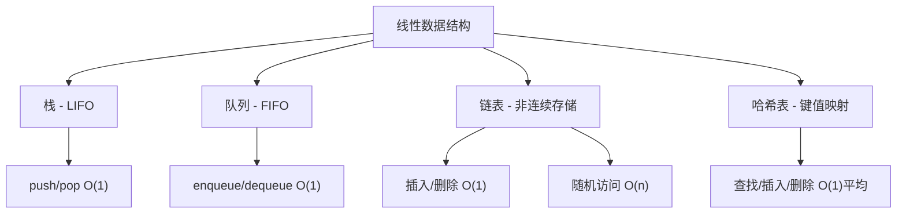

## 一句话概括

数据结构是计算机存储、组织数据的方式，本文聚焦前端开发最核心的四种基础数据结构——栈、队列、链表和哈希表，通过JavaScript实现每一类结构的完整操作，剖析其底层存储原理与复杂度特征，并在实战场景中展示它们如何解决真实的前端性能问题。

## 背景与意义

在许多前端开发者的认知中，"数据结构"是后端或算法面试才需要关心的东西——"前端又不写CRUD，数据结构能有什么用？"

这个认知大错特错。

真实的前端开发中，数据结构的应用无处不在：

- **浏览器的"前进/后退"** 就是栈——每次导航压栈，后退时弹栈
- **事件循环的任务队列** 就是队列——微任务队列、宏任务队列
- **Vue/React的虚拟DOM diff** 依赖于链表——Fiber架构用链表实现可中断的递归
- **对象的属性查找** 依赖于哈希表——JS引擎内建的属性访问优化
- **LRU缓存** 依赖于双向链表+哈希表——Vue的`keep-alive`内部就是LRU

不理解数据结构，你就在做"黑盒开发"——你知道`arr.push()`往数组末尾加元素，但不知道底层发生了什么。不理解队列，你就不理解为什么微任务比宏任务先执行。不理解链表，你就不理解为什么React Fiber能实现"可中断渲染"。

理解数据结构，是从"会用API"到"理解原理"的必经之路。

### 复杂度概念速览

在分析数据结构之前，我们需要一个衡量标准——**时间复杂度和空间复杂度**。

- **时间复杂度**：算法执行时间随数据规模增长的变化趋势。用大O表示法：O(1)表示常数时间（不随数据量变化），O(n)表示线性增长，O(n²)表示平方增长。
- **空间复杂度**：算法占用的额外内存随数据规模增长的变化趋势。

```javascript
// O(1) - 常数时间：数组按索引访问
const item = arr[5]; // 无论arr多长，时间都一样

// O(n) - 线性时间：在无序数组中查找
function find(arr, target) {
  for (let i = 0; i < arr.length; i++) {
    if (arr[i] === target) return i;
  }
}
// 如果arr有100个元素，最坏情况要查100次
// 如果arr有10000个元素，最坏情况要查10000次

// O(n²) - 平方时间：冒泡排序的双层循环
function bubbleSort(arr) {
  for (let i = 0; i < arr.length; i++) {
    for (let j = 0; j < arr.length - 1; j++) {
      if (arr[j] > arr[j + 1]) {
        [arr[j], arr[j + 1]] = [arr[j + 1], arr[j]];
      }
    }
  }
}
// 100个元素 → 10000次比较
// 10000个元素 → 100000000次比较
```

理解复杂度，就是理解"当数据变多时，代码会不会变慢"。

## 概念与定义

### 四种数据结构的定位



### 为什么用JavaScript实现？

JavaScript的数组（`Array`）本身就是一个"什么都能装的容器"——它可以当栈(`push/pop`)、当队列(`push/shift`)、甚至当哈希表（对象的键值对）。但这种灵活性也导致了两个问题：

1. **隐性的性能问题**：`Array.shift()`在JavaScript中不是O(1)而是O(n)——因为数组是连续存储的，删除头部元素需要将所有后续元素前移。不理解底层实现就无法意识到这个性能陷阱。

2. **不理解结构的本质**：当你用数组模拟栈时，你忽略了"栈"这个数据结构的核心约束——**LIFO（后进先出）**。如果有人在栈中间插入元素，栈的结构就被破坏了。

因此，用JavaScript"从零实现"数据结构，目的不是让你在生产环境中使用（你当然会用内建的`Array`和`Map`），而是让你理解每种结构的行为、约束和性能特征。

## 核心知识点拆解

### 一、栈（Stack）：后进先出

栈是一种**受限制的线性表**——只允许在表的一端进行插入（push）和删除（pop）操作。这个唯一端称为"栈顶"。

#### 底层实现

栈的底层可以用数组实现，也可以用链表实现。数组实现的优势是缓存友好、访问快；链表实现的优势是大小不受限制。

```javascript
// 基于数组的栈实现
class Stack {
  #items = [];
  #maxSize = Infinity;

  constructor(maxSize) {
    if (maxSize !== undefined) this.#maxSize = maxSize;
  }

  // 入栈：O(1)
  push(element) {
    if (this.size() >= this.#maxSize) {
      throw new Error('Stack overflow: 栈已满');
    }
    this.#items.push(element);
    return this.size();
  }

  // 出栈：O(1)
  pop() {
    if (this.isEmpty()) {
      throw new Error('Stack underflow: 栈为空');
    }
    return this.#items.pop();
  }

  // 查看栈顶元素：O(1)
  peek() {
    if (this.isEmpty()) return null;
    return this.#items[this.#items.length - 1];
  }

  // 判断栈是否为空
  isEmpty() {
    return this.#items.length === 0;
  }

  // 栈的大小
  size() {
    return this.#items.length;
  }

  // 清空栈
  clear() {
    this.#items = [];
  }

  // 便利方法：将栈转为数组（从栈底到栈顶）
  toArray() {
    return [...this.#items];
  }

  // 迭代器支持
  [Symbol.iterator]() {
    let index = this.#items.length - 1;
    return {
      next: () => {
        if (index >= 0) {
          return { value: this.#items[index--], done: false };
        }
        return { value: undefined, done: true };
      },
    };
  }
}
```

#### 实战应用：括号匹配检测

括号匹配是栈最经典的应用。编译器/解释器在解析代码时必须检查括号是否成对且嵌套正确：

```javascript
function isBalancedParentheses(code) {
  const stack = new Stack();
  const pairs = {
    '(': ')',
    '[': ']',
    '{': '}',
  };
  const opening = new Set(['(', '[', '{']);
  const closing = new Set([')', ']', '}']);

  // 记录位置以便报错
  let line = 1, col = 1;

  for (const char of code) {
    if (char === '\n') {
      line++;
      col = 0;
    }

    if (opening.has(char)) {
      stack.push({ char, line, col });
    } else if (closing.has(char)) {
      if (stack.isEmpty()) {
        return {
          balanced: false,
          error: `第${line}行第${col}列：多余的闭合括号 "${char}"`,
        };
      }

      const top = stack.pop();
      if (pairs[top.char] !== char) {
        return {
          balanced: false,
          error: `第${line}行第${col}列：期望 "${pairs[top.char]}"，但得到 "${char}"`,
        };
      }
    }

    col++;
  }

  if (!stack.isEmpty()) {
    const top = stack.peek();
    return {
      balanced: false,
      error: `第${top.line}行第${top.col}列：括号 "${top.char}" 未闭合`,
    };
  }

  return { balanced: true, error: null };
}

// 测试
const code1 = 'function foo() { return [1, 2, (3 + 4)]; }';
console.log(isBalancedParentheses(code1)); // { balanced: true, error: null }

const code2 = 'function foo() { return [1, 2, (3 + 4]; }';
console.log(isBalancedParentheses(code2));
// { balanced: false, error: '第1行第36列：期望 ")"，但得到 "]"' }

const code3 = 'function foo() { return [1, 2, (3 + 4)];';
console.log(isBalancedParentheses(code3));
// { balanced: false, error: '第1行第1列：未闭合的括号 "{"' }
```

#### 实战应用：表达式求值

计算器求值（中缀表达式转后缀表达式 + 后缀表达式求值）是栈的另一经典应用：

```javascript
class Calculator {
  // 将中缀表达式转为后缀表达式（逆波兰表示法）
  // 使用操作符栈来处理优先级
  static infixToPostfix(expression) {
    const output = [];
    const opStack = new Stack();
    const precedence = { '+': 1, '-': 1, '*': 2, '/': 2, '^': 3 };
    const tokens = expression.match(/\d+|[+\-*/^()]/g);

    if (!tokens) return [];

    for (const token of tokens) {
      if (/\d+/.test(token)) {
        // 操作数，直接输出
        output.push(token);
      } else if (token === '(') {
        opStack.push(token);
      } else if (token === ')') {
        // 弹栈直到遇到左括号
        while (!opStack.isEmpty() && opStack.peek() !== '(') {
          output.push(opStack.pop());
        }
        opStack.pop(); // 丢弃左括号
      } else {
        // 操作符：弹出栈顶所有优先级 >= 当前操作符的操作符
        while (
          !opStack.isEmpty() &&
          opStack.peek() !== '(' &&
          precedence[opStack.peek()] >= precedence[token]
        ) {
          output.push(opStack.pop());
        }
        opStack.push(token);
      }
    }

    // 清空栈中剩余的操作符
    while (!opStack.isEmpty()) {
      output.push(opStack.pop());
    }

    return output;
  }

  // 计算后缀表达式
  static evaluatePostfix(postfix) {
    const stack = new Stack();

    for (const token of postfix) {
      if (/\d+/.test(token)) {
        stack.push(parseFloat(token));
      } else {
        const b = stack.pop();
        const a = stack.pop();

        switch (token) {
          case '+': stack.push(a + b); break;
          case '-': stack.push(a - b); break;
          case '*': stack.push(a * b); break;
          case '/': stack.push(a / b); break;
          case '^': stack.push(Math.pow(a, b)); break;
        }
      }
    }

    return stack.pop();
  }

  static calculate(expression) {
    const postfix = this.infixToPostfix(expression);
    return this.evaluatePostfix(postfix);
  }
}

// 使用
console.log(Calculator.calculate('3 + 4 * 2'));      // 11
console.log(Calculator.calculate('(3 + 4) * 2'));    // 14
console.log(Calculator.calculate('10 / (2 + 3)'));   // 2
console.log(Calculator.calculate('2 ^ 3 + 5'));      // 13
```

#### 复杂度分析

| 操作 | 数组实现 | 链表实现 |
|------|---------|---------|
| push | O(1) 摊还 | O(1) |
| pop | O(1) | O(1) |
| peek | O(1) | O(1) |
| 空间 | O(n) | O(n) |

JS数组的`push`操作在底层数组容量足够时是O(1)；当容量不够时，JS引擎会分配新的更大的数组（通常为原来的1.5~2倍），并将元素复制过去。这个扩容操作是O(n)，但"摊还分析"（Amortized Analysis）表明，平均来看每次push仍然是O(1)。

### 二、队列（Queue）：先进先出

队列是一种**先进先出（FIFO）**的线性数据结构——只允许在后端（rear）插入、前端（front）删除。

#### 底层实现

普通队列如果直接用数组实现，`dequeue`操作需要`shift()`，这在JS中是O(n)。因此，更高效的实现是**循环队列**：

```javascript
// 基于循环数组的高效队列实现
class Queue {
  #items = [];
  #head = 0;  // 头部指针
  #tail = 0;  // 尾部指针
  #size = 0;

  // 入队：在尾部添加
  enqueue(element) {
    this.#items[this.#tail] = element;
    this.#tail = (this.#tail + 1) % (this.#items.length || 1);
    this.#size++;

    // 当数组满时，扩容
    if (this.#size === this.#items.length) {
      this.#resize(this.#items.length * 2 || 8);
    }

    return this.#size;
  }

  // 出队：从头部移除
  dequeue() {
    if (this.isEmpty()) {
      throw new Error('Queue underflow: 队列为空');
    }

    const element = this.#items[this.#head];
    this.#items[this.#head] = undefined; // 释放引用
    this.#head = (this.#head + 1) % this.#items.length;
    this.#size--;

    // 当使用率低于25%时，缩容
    if (this.#size > 0 && this.#size <= this.#items.length / 4) {
      this.#resize(Math.max(this.#items.length / 2, 8));
    }

    return element;
  }

  // 查看队首元素
  front() {
    if (this.isEmpty()) return null;
    return this.#items[this.#head];
  }

  // 查看队尾元素
  rear() {
    if (this.isEmpty()) return null;
    const index = this.#tail === 0
      ? this.#items.length - 1
      : this.#tail - 1;
    return this.#items[index];
  }

  isEmpty() {
    return this.#size === 0;
  }

  size() {
    return this.#size;
  }

  clear() {
    this.#items = [];
    this.#head = 0;
    this.#tail = 0;
    this.#size = 0;
  }

  #resize(newCapacity) {
    const newArray = new Array(newCapacity);
    for (let i = 0; i < this.#size; i++) {
      newArray[i] = this.#items[(this.#head + i) % this.#items.length];
    }
    this.#items = newArray;
    this.#head = 0;
    this.#tail = this.#size;
  }
}
```

#### 实战应用：任务调度器

浏览器事件循环的任务队列本质上就是多级队列。让我们实现一个简化版：

```javascript
// 多级队列任务调度器
class TaskScheduler {
  constructor() {
    this.microQueue = new Queue();  // 微任务（Promise回调、MutationObserver）
    this.macroQueue = new Queue();  // 宏任务（setTimeout、DOM事件、网络请求）
    this.animationQueue = new Queue(); // 动画帧任务（requestAnimationFrame）
    this.running = false;
  }

  // 添加微任务
  addMicroTask(task) {
    this.microQueue.enqueue(task);
  }

  // 添加宏任务
  addMacroTask(task) {
    this.macroQueue.enqueue(task);
  }

  // 添加动画帧任务
  addAnimationTask(task) {
    this.animationQueue.enqueue(task);
  }

  // 启动事件循环
  start() {
    if (this.running) return;
    this.running = true;
    this.#eventLoop();
  }

  async #eventLoop() {
    while (this.running) {
      // 1. 先清空微任务队列
      this.#drainMicroQueue();

      // 2. 取一个宏任务执行
      if (!this.macroQueue.isEmpty()) {
        const macroTask = this.macroQueue.dequeue();
        this.#runTask(macroTask);
      }

      // 3. 执行动画帧任务
      if (!this.animationQueue.isEmpty()) {
        const animTask = this.animationQueue.dequeue();
        this.#runTask(animTask);
      }

      // 4. 再次清空微任务（宏任务执行中可能产生新的微任务）
      this.#drainMicroQueue();

      // 如果没有任务了，退出循环
      if (this.macroQueue.isEmpty() && this.animationQueue.isEmpty()) {
        this.running = false;
      }

      // 模拟下一个tick
      await new Promise((resolve) => setTimeout(resolve, 0));
    }
  }

  #drainMicroQueue() {
    while (!this.microQueue.isEmpty()) {
      const microTask = this.microQueue.dequeue();
      this.#runTask(microTask);
    }
  }

  #runTask(task) {
    try {
      task();
    } catch (error) {
      console.error('任务执行出错:', error);
    }
  }

  stop() {
    this.running = false;
  }
}

// 使用
const scheduler = new TaskScheduler();

scheduler.addMacroTask(() => console.log('宏任务1'));
scheduler.addMacroTask(() => console.log('宏任务2'));
scheduler.addMicroTask(() => console.log('微任务A'));
scheduler.addMicroTask(() => console.log('微任务B'));
scheduler.addAnimationTask(() => console.log('动画帧任务'));

scheduler.start();
// 输出顺序：微任务A → 微任务B → 宏任务1 → 动画帧任务 → 宏任务2
// 这模拟了浏览器事件循环的优先级：微任务 > 宏任务 > 动画帧
```

#### 实战应用：树的广度优先遍历（BFS）

队列是实现BFS（Breadth-First Search）的核心数据结构：

```javascript
class TreeNode {
  constructor(value) {
    this.value = value;
    this.children = [];
  }

  addChild(child) {
    this.children.push(child);
    return this;
  }
}

function bfsTraversal(root) {
  if (!root) return [];

  const result = [];
  const queue = new Queue();
  queue.enqueue(root);

  while (!queue.isEmpty()) {
    const node = queue.dequeue();
    result.push(node.value);

    // 将子节点依次入队
    for (const child of node.children) {
      queue.enqueue(child);
    }
  }

  return result;
}

// 构建树
//        A
//      / | \
//     B  C  D
//    / \    |
//   E   F   G
const root = new TreeNode('A');
const b = new TreeNode('B');
const c = new TreeNode('C');
const d = new TreeNode('D');
root.addChild(b).addChild(c).addChild(d);
b.addChild(new TreeNode('E')).addChild(new TreeNode('F'));
d.addChild(new TreeNode('G'));

console.log(bfsTraversal(root));
// ['A', 'B', 'C', 'D', 'E', 'F', 'G']
```

#### 复杂度分析

| 操作 | 数组实现（无shift） | 链表实现 |
|------|-------------------|---------|
| enqueue | O(1) 摊还 | O(1) |
| dequeue | O(1) 摊还 | O(1) |
| front | O(1) | O(1) |
| 空间 | O(n) | O(n) |

关键点：如果用`Array.shift()`实现dequeue，时间复杂度是O(n)。循环队列通过两个指针（head/tail）将dequeue降至O(1)。

### 三、链表（Linked List）：非连续存储

链表由一系列节点组成，每个节点包含数据和指向下一个节点的指针。链表的优势在于插入和删除操作不需要移动其他元素。

#### 单向链表实现

```javascript
class ListNode {
  constructor(value) {
    this.value = value;
    this.next = null;
  }
}

class LinkedList {
  #head = null;
  #tail = null;
  #size = 0;

  // 头部插入：O(1)
  prepend(value) {
    const newNode = new ListNode(value);
    newNode.next = this.#head;
    this.#head = newNode;

    if (!this.#tail) {
      this.#tail = newNode;
    }

    this.#size++;
    return this;
  }

  // 尾部插入：O(1)
  append(value) {
    const newNode = new ListNode(value);

    if (!this.#head) {
      this.#head = newNode;
      this.#tail = newNode;
    } else {
      this.#tail.next = newNode;
      this.#tail = newNode;
    }

    this.#size++;
    return this;
  }

  // 指定位置插入：O(n)
  insertAt(value, index) {
    if (index < 0 || index > this.#size) {
      throw new Error('索引越界');
    }

    if (index === 0) {
      return this.prepend(value);
    }

    if (index === this.#size) {
      return this.append(value);
    }

    const newNode = new ListNode(value);
    const prev = this.#getNodeAt(index - 1);
    newNode.next = prev.next;
    prev.next = newNode;

    this.#size++;
    return this;
  }

  // 删除指定值（第一个匹配项）：O(n)
  remove(value) {
    if (!this.#head) return false;

    // 如果要删除的是头节点
    if (this.#head.value === value) {
      this.#head = this.#head.next;
      if (!this.#head) this.#tail = null;
      this.#size--;
      return true;
    }

    let current = this.#head;
    while (current.next) {
      if (current.next.value === value) {
        current.next = current.next.next;
        if (!current.next) this.#tail = current;
        this.#size--;
        return true;
      }
      current = current.next;
    }

    return false;
  }

  // 删除指定索引：O(n)
  removeAt(index) {
    if (index < 0 || index >= this.#size) {
      throw new Error('索引越界');
    }

    if (index === 0) {
      const value = this.#head.value;
      this.#head = this.#head.next;
      if (!this.#head) this.#tail = null;
      this.#size--;
      return value;
    }

    const prev = this.#getNodeAt(index - 1);
    const target = prev.next;
    prev.next = target.next;

    if (!prev.next) this.#tail = prev;

    this.#size--;
    return target.value;
  }

  // 查找：O(n)
  find(value) {
    let current = this.#head;
    let index = 0;
    while (current) {
      if (current.value === value) return index;
      current = current.next;
      index++;
    }
    return -1;
  }

  // 反转链表：O(n)
  reverse() {
    let prev = null;
    let current = this.#head;
    this.#tail = this.#head;

    while (current) {
      const next = current.next;
      current.next = prev;
      prev = current;
      current = next;
    }

    this.#head = prev;
    return this;
  }

  #getNodeAt(index) {
    let current = this.#head;
    for (let i = 0; i < index; i++) {
      current = current.next;
    }
    return current;
  }

  getHead() { return this.#head; }
  getTail() { return this.#tail; }
  size() { return this.#size; }
  isEmpty() { return this.#size === 0; }

  toArray() {
    const result = [];
    let current = this.#head;
    while (current) {
      result.push(current.value);
      current = current.next;
    }
    return result;
  }

  [Symbol.iterator]() {
    let current = this.#head;
    return {
      next: () => {
        if (current) {
          const value = current.value;
          current = current.next;
          return { value, done: false };
        }
        return { value: undefined, done: true };
      },
    };
  }
}
```

#### 双向链表实现

React Fiber架构大量使用双向链表。让我们实现一个支持"可中断遍历"的Fiber风格双向链表：

```javascript
class DoublyListNode {
  constructor(value) {
    this.value = value;
    this.prev = null;
    this.next = null;
    // Fiber风格的额外字段
    this.child = null;      // 子节点
    this.sibling = null;    // 兄弟节点
    this.return = null;     // 父节点
    this.effectTag = null;  // 操作标记
  }
}

class DoublyLinkedList {
  #head = null;
  #tail = null;
  #size = 0;

  append(value) {
    const node = new DoublyListNode(value);
    if (!this.#head) {
      this.#head = node;
      this.#tail = node;
    } else {
      node.prev = this.#tail;
      this.#tail.next = node;
      this.#tail = node;
    }
    this.#size++;
    return node;
  }

  prepend(value) {
    const node = new DoublyListNode(value);
    if (!this.#head) {
      this.#head = node;
      this.#tail = node;
    } else {
      node.next = this.#head;
      this.#head.prev = node;
      this.#head = node;
    }
    this.#size++;
    return node;
  }

  remove(node) {
    if (node.prev) node.prev.next = node.next;
    else this.#head = node.next;

    if (node.next) node.next.prev = node.prev;
    else this.#tail = node.prev;

    this.#size--;
    node.prev = null;
    node.next = null;
    return node.value;
  }

  // 将节点移动到头部（LRU核心操作）
  moveToHead(node) {
    if (node === this.#head) return;
    this.remove(node);
    node.next = this.#head;
    if (this.#head) this.#head.prev = node;
    this.#head = node;
    if (!this.#tail) this.#tail = node;
    this.#size++;
  }

  // 删除尾部节点（LRU淘汰操作）
  removeTail() {
    if (!this.#tail) return null;
    return this.remove(this.#tail);
  }

  toArray() {
    const result = [];
    let current = this.#head;
    while (current) {
      result.push({ value: current.value, child: current.child?.value, sibling: current.sibling?.value });
      current = current.next;
    }
    return result;
  }
}
```

#### 实战应用：React Fiber风格的"可中断渲染"链表

React Fiber将组件的渲染过程建模为一个双向链表，使得渲染可以被中断和恢复：

```javascript
// 简化版Fiber架构——用双向链表实现可中断渲染
class FiberNode {
  constructor(tag, props) {
    this.tag = tag;           // 节点类型
    this.props = props;       // 属性
    this.stateNode = null;    // 真实DOM节点

    // Fiber链表结构
    this.child = null;        // 第一个子节点
    this.sibling = null;      // 下一个兄弟节点
    this.return = null;       // 父节点

    // 渲染状态
    this.effectTag = null;    // 'PLACEMENT' | 'UPDATE' | 'DELETION'
    this.alternate = null;    // 上一次渲染的Fiber
  }
}

class FiberScheduler {
  constructor() {
    this.rootFiber = null;
    this.workInProgress = null;
    this.shouldYield = false;
  }

  // 创建Fiber树（从JSX转换为链表）
  createFiberTree(element, parentFiber = null) {
    if (!element) return null;

    const fiber = new FiberNode(
      typeof element.type === 'string' ? 'HOST' : 'COMPONENT',
      element.props
    );
    fiber.return = parentFiber;

    // 将子元素转换为Fiber链表
    if (element.props?.children) {
      const children = Array.isArray(element.props.children)
        ? element.props.children
        : [element.props.children];

      let prevSibling = null;
      for (const child of children) {
        if (child == null || typeof child === 'boolean') continue;

        const childFiber = this.createFiberTree(
          typeof child === 'string' || typeof child === 'number'
            ? { type: 'TEXT', props: { textContent: String(child) } }
            : child,
          fiber
        );

        if (prevSibling) {
          prevSibling.sibling = childFiber;
        } else {
          fiber.child = childFiber;
        }
        prevSibling = childFiber;
      }
    }

    return fiber;
  }

  // 开始渲染（可中断的深度优先遍历）
  startWork(rootFiber) {
    this.rootFiber = rootFiber;
    this.workInProgress = rootFiber;
    this.shouldYield = false;

    // 启动"工作循环"——执行"开始→返回→兄弟"的深度优先遍历
    this.#workLoop();
  }

  #workLoop() {
    const startTime = performance.now();
    const deadline = startTime + 50; // 50ms时间片

    while (this.workInProgress) {
      // 执行当前Fiber节点的工作
      this.workInProgress = this.#performUnitOfWork(this.workInProgress);

      // 检查是否超时，是否应该让出主线程
      if (performance.now() >= deadline) {
        console.log('[Fiber] 时间片耗尽，中断渲染，等待下一个帧');
        // 模拟让出主线程——实际React使用requestIdleCallback
        requestAnimationFrame(() => this.#workLoop());
        return;
      }
    }

    console.log('[Fiber] 渲染完成！');
  }

  #performUnitOfWork(fiber) {
    // 1. 创建或更新DOM节点
    this.#createDOMNode(fiber);

    // 2. 如果有子节点，继续深入到子节点
    if (fiber.child) {
      return fiber.child;
    }

    // 3. 没有子节点，返回兄弟节点或向上回溯
    let nextFiber = fiber;
    while (nextFiber) {
      if (nextFiber.sibling) {
        return nextFiber.sibling;
      }
      nextFiber = nextFiber.return; // 向上回溯
    }

    return null; // 遍历完成
  }

  #createDOMNode(fiber) {
    if (fiber.tag === 'HOST') {
      // 创建真实DOM节点
      if (!fiber.stateNode) {
        fiber.stateNode = document.createElement(fiber.props.type || 'div');
        fiber.effectTag = 'PLACEMENT';
        console.log(`[Fiber] 创建DOM节点: ${fiber.props.type || 'div'}`);
      }
    } else if (fiber.tag === 'TEXT') {
      if (!fiber.stateNode) {
        fiber.stateNode = document.createTextNode(fiber.props.textContent);
        fiber.effectTag = 'PLACEMENT';
        console.log(`[Fiber] 创建文本节点: "${fiber.props.textContent?.slice(0, 20)}"`);
      }
    }
  }
}
```

#### 复杂度分析

| 操作 | 单向链表 | 双向链表 | 数组 |
|------|---------|---------|------|
| 头部插入 | O(1) | O(1) | O(n) |
| 尾部插入 | O(1) | O(1) | O(1) |
| 中间插入 | O(n) | O(n) | O(n) |
| 按值删除 | O(n) | O(n) | O(n) |
| 按索引访问 | O(n) | O(n) | O(1) |

链表对比数组的核心取舍：**链表牺牲了随机访问（O(n) vs O(1)），换来了任意位置的插入删除（O(1) vs O(n)）**。

### 四、哈希表（Hash Table）：键值映射

哈希表通过哈希函数将键映射为数组索引，实现平均O(1)的查找、插入和删除。

#### 从零实现哈希表

JavaScript的`Map`和`Object`底层就是哈希表。让我们实现一个来理解其工作原理：

```javascript
class HashTable {
  #buckets = [];
  #size = 0;
  #capacity = 8;      // 初始容量
  #loadFactor = 0.75;  // 负载因子，超过即扩容

  constructor(capacity) {
    if (capacity) this.#capacity = capacity;
    this.#buckets = new Array(this.#capacity).fill(null).map(() => []);
  }

  // 哈希函数：将键转换为bucket索引
  #hash(key) {
    const keyStr = String(key);
    let hash = 0;
    for (let i = 0; i < keyStr.length; i++) {
      const char = keyStr.charCodeAt(i);
      hash = (hash * 31 + char) & 0x7fffffff; // 使用质数31，与Java String.hashCode()相同
    }
    return hash % this.#capacity;
  }

  // 插入/更新键值对
  set(key, value) {
    const index = this.#hash(key);
    const bucket = this.#buckets[index];

    // 查找是否已存在该键
    for (const entry of bucket) {
      if (entry.key === key) {
        entry.value = value; // 更新
        return this;
      }
    }

    // 不存在则新增
    bucket.push({ key, value });
    this.#size++;

    // 检查是否需要扩容
    if (this.#size >= this.#capacity * this.#loadFactor) {
      this.#resize(this.#capacity * 2);
    }

    return this;
  }

  // 获取值
  get(key) {
    const index = this.#hash(key);
    const bucket = this.#buckets[index];

    for (const entry of bucket) {
      if (entry.key === key) {
        return entry.value;
      }
    }

    return undefined;
  }

  // 检查键是否存在
  has(key) {
    const index = this.#hash(key);
    const bucket = this.#buckets[index];

    for (const entry of bucket) {
      if (entry.key === key) {
        return true;
      }
    }
    return false;
  }

  // 删除键值对
  delete(key) {
    const index = this.#hash(key);
    const bucket = this.#buckets[index];

    for (let i = 0; i < bucket.length; i++) {
      if (bucket[i].key === key) {
        bucket.splice(i, 1);
        this.#size--;
        return true;
      }
    }

    return false;
  }

  // 扩容
  #resize(newCapacity) {
    const oldBuckets = this.#buckets;
    this.#capacity = newCapacity;
    this.#buckets = new Array(newCapacity).fill(null).map(() => []);
    this.#size = 0;

    // 重新哈希所有已有元素
    for (const bucket of oldBuckets) {
      for (const entry of bucket) {
        this.set(entry.key, entry.value);
      }
    }
  }

  // 清空
  clear() {
    this.#buckets = new Array(this.#capacity).fill(null).map(() => []);
    this.#size = 0;
  }

  get size() { return this.#size; }
  get capacity() { return this.#capacity; }

  // 获取所有键
  keys() {
    const result = [];
    for (const bucket of this.#buckets) {
      for (const entry of bucket) {
        result.push(entry.key);
      }
    }
    return result;
  }

  // 获取所有值
  values() {
    const result = [];
    for (const bucket of this.#buckets) {
      for (const entry of bucket) {
        result.push(entry.value);
      }
    }
    return result;
  }

  // 显示内部结构（调试用）
  debug() {
    console.log(`容量: ${this.#capacity}, 元素: ${this.#size}, 负载: ${(this.#size / this.#capacity).toFixed(2)}`);
    for (let i = 0; i < this.#buckets.length; i++) {
      if (this.#buckets[i].length > 0) {
        console.log(`  bucket[${i}]:`, this.#buckets[i].map(e => `${e.key}=${e.value}`).join(', '));
      }
    }
  }
}

// 测试和演示
const ht = new HashTable(4);

ht.set('name', '张三');
ht.set('age', 25);
ht.set('email', 'zhang@example.com');
ht.set('phone', '13800138000');

console.log('name:', ht.get('name'));    // 张三
console.log('age:', ht.get('age'));      // 25
console.log('has phone:', ht.has('phone')); // true

ht.debug();
// 容量: 8, 元素: 4, 负载: 0.50
// bucket[0]: phone=13800138000
// bucket[4]: name=张三
// bucket[5]: age=25, email=zhang@example.com

// 测试更新
ht.set('age', 26);
console.log('age updated:', ht.get('age')); // 26

// 测试删除
ht.delete('phone');
console.log('has phone after delete:', ht.has('phone')); // false
```

#### 实战应用：LRU缓存

LRU（Least Recently Used）缓存是哈希表+双向链表的经典组合。Vue 3的`keep-alive`内部实现正是LRU：

```javascript
// LRU缓存 - 哈希表 + 双向链表
class LRUCache {
  #capacity;
  #cache = new Map(); // 哈希表：key → ListNode
  #list = new DoublyLinkedList(); // 双向链表维护访问顺序

  constructor(capacity) {
    this.#capacity = capacity;
  }

  get(key) {
    if (!this.#cache.has(key)) return -1;

    const node = this.#cache.get(key);
    // 将访问过的节点移到头部（最近访问）
    this.#list.moveToHead(node);
    return node.value.value; // node.value = { key, value }
  }

  put(key, value) {
    if (this.#cache.has(key)) {
      // 更新已有节点
      const node = this.#cache.get(key);
      node.value.value = value; // 更新值
      this.#list.moveToHead(node);
    } else {
      // 添加新节点
      if (this.#cache.size >= this.#capacity) {
        // 淘汰最久未使用的节点（尾部）
        const tail = this.#list.removeTail();
        if (tail) {
          this.#cache.delete(tail.key);
        }
      }

      // 创建新节点
      const listNode = this.#list.prepend({ key, value });
      this.#cache.set(key, listNode);
    }
  }

  has(key) {
    return this.#cache.has(key);
  }

  delete(key) {
    if (!this.#cache.has(key)) return false;
    const node = this.#cache.get(key);
    this.#list.remove(node);
    this.#cache.delete(key);
    return true;
  }

  clear() {
    this.#cache.clear();
    // 重新初始化链表
    this.#list = new DoublyLinkedList();
  }

  get size() { return this.#cache.size; }

  // 调试：打印缓存内容
  debug() {
    const items = this.#list.toArray().map(n => n.value);
    console.log(`LRU缓存 [${items.length}/${this.#capacity}]:`, items);
  }
}

// 使用测试
const cache = new LRUCache(3);

cache.put('A', 1);
cache.put('B', 2);
cache.put('C', 3);
cache.debug(); // [A, B, C]

cache.get('A');     // 访问A → A移到头部
cache.debug();      // [B, C, A]

cache.put('D', 4);  // 超过容量，淘汰最久未使用的B
cache.debug();      // [C, A, D]  B被移除

console.log(cache.get('B')); // -1 (已淘汰)
console.log(cache.get('C')); // 3
cache.debug();      // [A, D, C]
```

这个LRU缓存实现了O(1)的get、put、delete操作——完美展示了哈希表和双向链表的协同：

- **哈希表**提供O(1)的键查找
- **双向链表**提供O(1)的节点移动（移到头部）和节点删除（移除尾部）

## 实战案例

### 完整场景：基于数据结构的URL路由系统

URL路由是前端SPA框架的核心组件。让我们从一个简单的hash路由开始，构建一个完整的路由系统，其中用到了本文讨论的所有数据结构。

```javascript
// ===== 完整路由系统 =====

// ---------- 1. 路由节点（双向链表的节点） ----------
class RouteNode {
  constructor(path, handler, meta = {}) {
    this.path = path;           // 路由路径
    this.handler = handler;     // 处理函数
    this.meta = meta;           // 路由元信息
    this.prev = null;           // 前一个路由
    this.next = null;           // 后一个路由
  }
}

// ---------- 2. 路由管理器（双向链表 + 哈希表） ----------
class Router {
  constructor() {
    // 双向链表维护导航历史
    this.history = new DoublyLinkedList();
    this.currentNode = null;

    // 哈希表维护路由表（path → RouteNode）
    this.routeTable = new HashTable(32);

    // 路由参数缓存
    this.paramCache = new Map();

    // 待执行的路由守卫队列
    this.guardQueue = new Queue();

    // 注册路由监听
    this.#setupListener();
  }

  // 注册路由（哈希表）
  addRoute(path, handler, meta = {}) {
    const node = new RouteNode(path, handler, meta);
    this.routeTable.set(path, node);
    return this;
  }

  // 添加路由守卫（队列）
  addGuard(guardFn) {
    this.guardQueue.enqueue(guardFn);
    return this;
  }

  // 导航到指定路径
  navigate(path, replace = false) {
    const route = this.routeTable.get(path);
    if (!route) {
      console.warn(`路由不存在: ${path}`);
      return false;
    }

    // 路由守卫验证
    if (!this.#runGuards(path)) {
      console.warn('路由守卫阻止了导航');
      return false;
    }

    if (!replace) {
      // 推入导航历史（栈操作）
      this.history.append(route);
    }

    this.currentNode = route;
    this.#updateURL(path);
    this.#renderRoute(route);

    return true;
  }

  // 后退（栈的pop操作）
  back() {
    if (!this.currentNode?.prev) {
      console.warn('没有上一条历史记录');
      return false;
    }

    const prevNode = this.currentNode.prev;
    this.currentNode = prevNode;
    this.#updateURL(prevNode.path);
    this.#renderRoute(prevNode);
    return true;
  }

  // 前进（栈的pop操作，但从另一侧）
  forward() {
    if (!this.currentNode?.next) {
      console.warn('没有下一条历史记录');
      return false;
    }

    const nextNode = this.currentNode.next;
    this.currentNode = nextNode;
    this.#updateURL(nextNode.path);
    this.#renderRoute(nextNode);
    return true;
  }

  #runGuards(path) {
    let allPass = true;
    const tempQueue = new Queue();

    while (!this.guardQueue.isEmpty()) {
      const guard = this.guardQueue.dequeue();
      tempQueue.enqueue(guard);

      const result = guard(path, this.currentNode?.path);
      if (result === false) {
        allPass = false;
        break;
      }
    }

    // 还原守卫队列
    while (!tempQueue.isEmpty()) {
      this.guardQueue.enqueue(tempQueue.dequeue());
    }

    return allPass;
  }

  #updateURL(path) {
    window.location.hash = `#${path}`;
  }

  #renderRoute(route) {
    console.log(`[Router] 渲染路由: ${route.path}`);
    route.handler(route.meta);

    // 发布路由变化事件
    window.dispatchEvent(new CustomEvent('route:changed', {
      detail: { path: route.path, meta: route.meta },
    }));
  }

  #setupListener() {
    // 监听浏览器前进/后退
    window.addEventListener('hashchange', (e) => {
      const path = window.location.hash.slice(1) || '/';
      const route = this.routeTable.get(path);
      if (route && route !== this.currentNode) {
        this.currentNode = route;
        this.#renderRoute(route);
      }
    });
  }
}

// ---------- 3. 使用 ----------
const router = new Router();

// 注册路由
router
  .addRoute('/', () => renderPage('首页'), { title: '首页' })
  .addRoute('/about', () => renderPage('关于我们'), { title: '关于我们' })
  .addRoute('/products', () => renderPage('产品列表'), { title: '产品' })
  .addRoute('/products/:id', (meta) => renderPage(`产品详情: ${meta.params?.id}`), {
    title: '产品详情',
    dynamic: true,
  })
  .addRoute('/contact', () => renderPage('联系我们'), { title: '联系我们' });

// 路由守卫
router.addGuard((to, from) => {
  if (to === '/contact' && !userIsLoggedIn()) {
    alert('请先登录');
    return false;
  }
  return true;
});

router.addGuard((to) => {
  console.log(`导航到: ${to}`);
  return true;
});

// 导航
router.navigate('/about');
router.navigate('/products');
router.navigate('/contact');
router.back(); // 回到 /products
router.forward(); // 回到 /contact

function renderPage(name) {
  document.getElementById('app').innerHTML = `<h1>${name}</h1>`;
}

function userIsLoggedIn() {
  return localStorage.getItem('user') !== null;
}
```

这个路由系统展示了四种数据结构的协同：

- **栈**（浏览器历史API的内在行为）：后退是出栈，前进是入栈
- **队列**（守卫队列）：守卫需要按顺序执行
- **双向链表**（导航历史）：支持前进和后退导航，链表自然支持双向遍历
- **哈希表**（路由表）：O(1)的路径查找

## 底层原理

### 哈希冲突的解决策略

#### 链地址法（Seperate Chaining）

当两个键的哈希值相同（称为"哈希碰撞"）时，链地址法将冲突的键值对存储在同一个bucket的链表中。哈希表搜索时，先找到bucket，再遍历链表找到目标键。

以上文的实现中，`#buckets[index]`是一个数组（实际上是链表），多个键值对可以共存于同一个数组元素中。

**性能特征**：当哈希函数分布良好时，每个bucket平均只有1-2个元素，插入和查找仍是O(1)。当冲突严重时（很多键映射到同一个bucket），性能退化为O(n)。

#### 开放地址法（Open Addressing）

另一种策略是，当发生冲突时，寻找下一个空闲的bucket：

```javascript
class OpenAddressingHashTable {
  #keys = [];
  #values = [];
  #size = 0;
  #capacity = 8;

  set(key, value) {
    let index = this.#hash(key);
    while (this.#keys[index] !== undefined && this.#keys[index] !== key) {
      index = (index + 1) % this.#capacity; // 线性探测
    }

    if (this.#keys[index] === undefined) this.#size++;
    this.#keys[index] = key;
    this.#values[index] = value;

    if (this.#size >= this.#capacity * 0.7) this.#resize(this.#capacity * 2);
  }

  get(key) {
    let index = this.#hash(key);
    while (this.#keys[index] !== undefined) {
      if (this.#keys[index] === key) return this.#values[index];
      index = (index + 1) % this.#capacity;
    }
    return undefined;
  }
  // ...
}
```

开放地址法节省了链表的指针内存，但删除操作更复杂（需要特殊标记为"已删除"而非"空"）。

### JavaScript Map 与 Object 的选择

| 特性 | Map | Object |
|------|-----|--------|
| 键类型 | 任意值（包括对象、函数） | 只能是字符串或Symbol |
| 键顺序 | 插入顺序 | 整数字键按升序，其他按插入顺序 |
| 性能 | 高频增删场景通常更优 | 优化良好，但大量动态属性可能退化 |
| 原型链 | 无原型键，安全 | 可能覆盖原型属性 |

**选择建议**：需要非字符串键、大量增删操作时用Map；简单的字符串键值对（如JSON数据）用Object。

## 高频面试题解析

### Q1: 用栈实现队列，或者用队列实现栈

**最佳回答**：
这是经典的"用基础数据结构模拟另一个数据结构"问题。

**两个栈实现队列**：
```javascript
class QueueUsingStacks {
  constructor() {
    this.inStack = new Stack();   // 入队用
    this.outStack = new Stack();  // 出队用
  }

  enqueue(element) {
    this.inStack.push(element);
  }

  dequeue() {
    if (this.outStack.isEmpty()) {
      // 将inStack的所有元素出栈并入outStack
      while (!this.inStack.isEmpty()) {
        this.outStack.push(this.inStack.pop());
      }
    }
    return this.outStack.pop();
  }

  peek() {
    if (this.outStack.isEmpty()) {
      while (!this.inStack.isEmpty()) {
        this.outStack.push(this.inStack.pop());
      }
    }
    return this.outStack.peek();
  }

  isEmpty() {
    return this.inStack.isEmpty() && this.outStack.isEmpty();
  }
}
// 摊还分析：每个元素被push两次、pop两次，总复杂度O(1)摊还
```

**两个队列实现栈**：
```javascript
class StackUsingQueues {
  constructor() {
    this.queue = new Queue();
    this.helper = new Queue();
  }

  push(element) {
    // 将元素入队到helper
    this.helper.enqueue(element);
    // 将queue的所有元素移到helper（这样新元素就在头部）
    while (!this.queue.isEmpty()) {
      this.helper.enqueue(this.queue.dequeue());
    }
    // 交换引用
    [this.queue, this.helper] = [this.helper, this.queue];
  }

  pop() {
    return this.queue.dequeue();
  }

  peek() {
    return this.queue.front();
  }

  isEmpty() {
    return this.queue.isEmpty();
  }
}
// push是O(n)，pop是O(1)
```

### Q2: JavaScript中数组的shift是O(n)，为什么？

**最佳回答**：
JavaScript的数组是**连续内存块**（或者类似连续的结构）。当执行`shift()`删除第一个元素时，所有剩余元素需要**前移一位**——索引0变成索引0的原值被销毁，索引1的元素移入索引0，索引2移入索引1，以此类推。

对于长度为n的数组，需要移动n-1个元素，因此时间复杂度为O(n)。

同样的道理也适用于`unshift()`——在数组头部插入元素，同样需要将所有元素后移。

这就是为什么在频繁"头部增删"的场景下，应该使用**循环队列**或**链表**代替数组。

### Q3: 哈希表的扩容为什么是O(n)？如何优化？

**最佳回答**：
哈希表扩容时，容量变为原来的2倍（或其他倍数），但**哈希函数的结果依赖于容量**（`hash % capacity`），因此所有已有元素需要**重新计算哈希值并放入新的bucket中**。这需要遍历所有元素并重新插入，因此是O(n)。

优化策略：
1. **渐进式扩容（Incremental Resizing）**：不一次性移动所有元素，而是每次插入/删除操作时移动少量元素（如Redis的做法）
2. **使用一致性哈希**：当哈希函数不依赖于容量模运算时（如使用位运算替代取模）
3. **提前扩容，减少扩容频率**：设置合适的负载因子（如0.75），在容量快满时就提前扩容

在V8引擎中，Map的扩容策略经过精细优化，大多数情况下开发者不需要关心。

### Q4: 如何检测链表是否有环？

**最佳回答**：
使用**快慢指针法（Floyd's Cycle Detection Algorithm）**：

```javascript
function hasCycle(head) {
  if (!head || !head.next) return false;

  let slow = head;
  let fast = head;

  while (fast && fast.next) {
    slow = slow.next;       // 慢指针每次走一步
    fast = fast.next.next;  // 快指针每次走两步

    if (slow === fast) {
      return true; // 相遇说明有环
    }
  }

  return false; // 快指针到达终点，无环
}
```

算法的正确性证明：如果链表有环，快指针最终会追上慢指针（快指针比慢指针多走一圈）。快慢指针的速度差为1，相对位移为环的长度。

### Q5: 哈希表什么时候会退化为O(n)？

**最佳回答**：
哈希表在以下情况会从O(1)退化为O(n)：

1. **哈希函数设计不当**：所有键映射到同一个bucket（称为"哈希碰撞洪水"）——这是最严重的情况。对字符串哈希来说，如果使用`key.length % capacity`作为哈希函数，所有相同长度的字符串都会进入同一个bucket。

2. **负载因子过高**：当元素数量接近容量时，冲突概率显著增加。假设容量为10，已有8个元素（负载因子0.8），再插入新元素时发生冲突的概率约为80%。

3. **攻击性输入**：某些语言的哈希函数是可预测的，攻击者可以构造大量哈希值相同的键，导致服务器端哈希表退化为O(n)。这种攻击称为"哈希碰撞DoS攻击"。JavaScript的Map和Set在设计上已经考虑到了这一点，使用随机化哈希种子来防御。

## 总结与扩展

数据结构不是考试科目，而是编程"工具箱"中的工具。本文的核心收获：

1. **栈（Stack）**：LIFO后进先出。前端应用：浏览历史、括号匹配、表达式求值、调用栈。底层常用于实现"撤销"操作。

2. **队列（Queue）**：FIFO先进先出。前端应用：事件循环的任务队列、BFS遍历、请求排队。底层常用于"异步任务调度"。

3. **链表（LinkedList）**：非连续存储、插入删除O(1)、随机访问O(n)。前端应用：React Fiber架构、LRU缓存、路由历史。核心取舍：**用O(n)的随机访问换O(1)的任意位置插入删除**。

4. **哈希表（HashTable）**：键值映射、平均O(1)操作。前端应用：路由表、缓存、对象属性查找。核心挑战是"哈希冲突处理"。

五个数据结构之间的操作复杂度对比：

| 数据结构 | 插入头部 | 插入尾部 | 查找 | 删除 | 随机访问 |
|---------|---------|---------|------|------|---------|
| 栈 | N/A | O(1) | O(n) | O(1) | O(n) |
| 队列 | N/A | O(1) | O(n) | O(1) | O(n) |
| 单向链表 | O(1) | O(1) | O(n) | O(n) | O(n) |
| 双向链表 | O(1) | O(1) | O(n) | O(1)* | O(n) |
| 哈希表 | O(1) | O(1) | O(1) | O(1) | O(1) |
| 数组 | O(n) | O(1) | O(n) | O(n) | O(1) |

*双向链表的删除在已知节点引用时是O(1)，按值删除仍需O(n)查找。

JavaScript的`Array`确实足够灵活，可以作为所有数据结构的"折衷方案"。但从理解原理和追求性能的角度，掌握每种数据结构的特性和适用场景，是一个资深前端工程师的必备素养。
