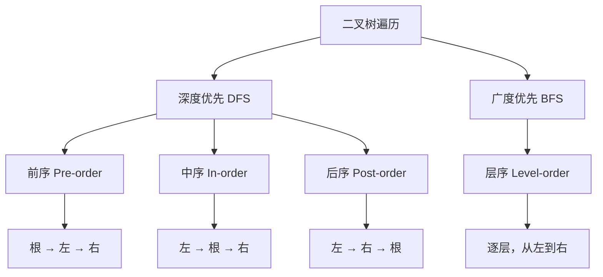

## 一句话概括

二叉树遍历是访问树中所有节点的基础算法，前序、中序、后序和层序四种遍历方式分别对应不同的访问顺序和实际应用场景——前序用于复制和序列化树结构，中序用于获取有序序列，后序用于内存释放和计算树属性，层序用于最短路径和图形化展示，理解遍历的本质等于掌握了递归与迭代的思维切换。

## 背景与意义

二叉树是前端开发中最基础也最重要的非线性数据结构之一。DOM树、虚拟DOM树、组件树、AST抽象语法树、路由树——前端中几乎所有的"树形结构"都可以抽象为二叉树的变体。

对二叉树的"遍历"——即按照某种规则访问每个节点恰好一次——是理解和操作树形结构的第一步，也是最重要的一步。

但很多开发者对遍历的理解停留在"背口诀"的层面：
- 前序：根左右
- 中序：左根右
- 后序：左右根
- 层序：从上到下、从左到右

这种记忆在面试题中或许足够，但在实际开发中远远不够。你需要在以下场景中深刻理解遍历：

1. **React的Reconciliation**：Fiber树的遍历本质上是前序遍历的变体——先处理当前节点，再处理子节点，最后处理兄弟节点。

2. **Vue模板编译**：Vue的编译器将模板解析为AST后，通过中序遍历/后序遍历来收集依赖、进行静态标记。

3. **DOM操作**：`NodeIterator`或`TreeWalker`在DOM树上的遍历就是前序遍历——先访问父节点，再访问子节点，最后访问兄弟节点。

4. **树的序列化与反序列化**：将一棵树保存为字符串（如JSON）并在需要时恢复——前序遍历是序列化最自然的方式。

5. **文件系统操作**：深度优先（前序/后序）和广度优先（层序）是递归删除、递归复制等操作的核心算法。

本文的目标：**让你真正"理解"而非"记住"遍历**。

## 概念与定义

### 什么是二叉树？

二叉树是每个节点最多有两个子树的树结构。两个子树分别称为"左子树"（left subtree）和"右子树"（right subtree）。

```javascript
// 二叉树节点的JavaScript表示
class TreeNode {
  constructor(val, left = null, right = null) {
    this.val = val;
    this.left = left;
    this.right = right;
  }
}

// 构建一棵简单的二叉树
//       1
//      / \
//     2   3
//    / \   \
//   4   5   6
const root = new TreeNode(1);
root.left = new TreeNode(2);
root.right = new TreeNode(3);
root.left.left = new TreeNode(4);
root.left.right = new TreeNode(5);
root.right.right = new TreeNode(6);
```

### 四种遍历方式的定义



对于上面那棵节点为 `1,2,3,4,5,6` 的树，四种遍历的结果：

| 遍历方式 | 访问顺序 |
|---------|---------|
| 前序 | 1, 2, 4, 5, 3, 6 |
| 中序 | 4, 2, 5, 1, 3, 6 |
| 后序 | 4, 5, 2, 6, 3, 1 |
| 层序 | 1, 2, 3, 4, 5, 6 |

### 递归 vs 迭代的考量

递归版本的遍历代码极其简洁，但有两个致命弱点：

1. **调用栈溢出**：当树的高度很大时（比如几万层的链表状树），递归调用会消耗完调用栈空间（通常在10^4~10^5级别）。
2. **无法中断**：递归一旦开始就会遍历完整棵树，无法中途暂停。

迭代版本的遍历虽然代码更复杂，但：
1. **栈空间可控**：使用显式的栈/队列，不会受调用栈限制
2. **可中断**：遍历可以在任意节点暂停，后续可以继续

这正是React选择Fiber架构（迭代）而不是递归渲染的原因——**"可中断的遍历"是实现时间切片的基础**。

## 核心知识点拆解

### 一、前序遍历（Pre-order Traversal）

前序遍历的顺序是：**根节点 → 左子树 → 右子树**。

#### 递归实现

```javascript
// 递归版前序遍历
function preorderTraversal(root) {
  const result = [];
  
  function traverse(node) {
    if (node === null) return;
    
    result.push(node.val);     // 1. 访问根节点
    traverse(node.left);        // 2. 遍历左子树
    traverse(node.right);       // 3. 遍历右子树
  }
  
  traverse(root);
  return result;
}

// 简化版（无辅助函数）
function preorderTraversalShort(root) {
  if (root === null) return [];
  return [
    root.val,
    ...preorderTraversalShort(root.left),
    ...preorderTraversalShort(root.right),
  ];
}

console.log(preorderTraversal(root)); // [1, 2, 4, 5, 3, 6]
```

#### 迭代实现

迭代版前序遍历使用**栈**来模拟递归调用：

```javascript
function preorderTraversalIterative(root) {
  if (root === null) return [];
  
  const result = [];
  const stack = [root]; // 显式栈

  while (stack.length > 0) {
    const node = stack.pop();
    result.push(node.val); // 访问当前节点

    // 注意：先压右子节点，再压左子节点
    // 因为栈是LIFO，先压右→后访问右？不对
    // 我们需要先访问左，所以应该后压左？不，先压右让左在栈顶
    if (node.right) stack.push(node.right);
    if (node.left) stack.push(node.left);
    // 栈顶是左子节点 → 下一次pop先处理左
  }

  return result;
}
```

为什么先压右子节点再压左子节点？

因为栈是**后进先出**（LIFO）。我们希望"先访问左子节点，后访问右子节点"。所以我们应该"先压入右子节点（让它在底），后压入左子节点（让它在顶）"——这样pop时先取到左子节点，符合"根→左→右"的顺序。

#### 前序遍历的应用：树的序列化

序列化是将一棵树转换为字符串以便传输或存储，反序列化是从字符串恢复为树。前序遍历最适合做这件事，因为根节点最先被访问，方便重建：

```javascript
// 前序遍历序列化
function serialize(root) {
  const result = [];
  
  function dfs(node) {
    if (node === null) {
      result.push('#'); // 用特殊符号标记空节点
      return;
    }
    result.push(String(node.val)); // 访问根（前序）
    dfs(node.left);
    dfs(node.right);
  }
  
  dfs(root);
  return result.join(','); // "1,2,4,#,#,5,#,#,3,#,6,#,#"
}

// 反序列化
function deserialize(data) {
  if (!data || data.length === 0) return null;
  
  const values = data.split(',');
  let index = 0;
  
  function dfs() {
    if (index >= values.length) return null;
    
    const val = values[index++];
    if (val === '#') return null; // 空节点
    
    const node = new TreeNode(parseInt(val, 10));
    node.left = dfs();   // 重建左子树
    node.right = dfs();  // 重建右子树
    
    return node;
  }
  
  return dfs();
}

// 测试
const serialized = serialize(root);
console.log(serialized); // "1,2,4,#,#,5,#,#,3,#,6,#,#"

const restored = deserialize(serialized);
console.log(preorderTraversal(restored)); // [1, 2, 4, 5, 3, 6]
```

这个序列化方案称为"前序遍历 +# 标记法"。它的巧妙之处在于：**利用前序遍历的顺序性，配合空节点标记，可以唯一确定一棵二叉树**。

### 二、中序遍历（In-order Traversal）

中序遍历的顺序是：**左子树 → 根节点 → 右子树**。

对于二叉搜索树（BST），中序遍历的结果是**升序排列**。

#### 递归实现

```javascript
function inorderTraversal(root) {
  const result = [];
  
  function traverse(node) {
    if (node === null) return;
    
    traverse(node.left);         // 1. 遍历左子树
    result.push(node.val);       // 2. 访问根节点
    traverse(node.right);        // 3. 遍历右子树
  }
  
  traverse(root);
  return result;
}
```

#### 迭代实现

迭代版中序遍历需要显式维护一个"回溯"栈。这是四种遍历中迭代实现最"不直观"的：

```javascript
function inorderTraversalIterative(root) {
  const result = [];
  const stack = [];
  let current = root;

  while (current !== null || stack.length > 0) {
    // 一直向左走，沿途节点入栈
    while (current !== null) {
      stack.push(current);
      current = current.left;
    }

    // 弹出栈顶（最左节点）
    current = stack.pop();
    result.push(current.val); // 访问

    // 转向右子树
    current = current.right;
  }

  return result;
}
```

这个算法的核心思想是：**"能往左就往左，左到底了才访问，然后向右一步"**。

步进分析（对树 `1,2,3,4,5,6`）：
1. `current = 1` → 入栈[1] → 往左到2 → 入栈[1,2] → 往左到4 → 入栈[1,2,4] → 往左到null
2. pop → 4, 访问4, current = (4的right=null)
3. pop → 2, 访问2, current = (2的right=5)
4. 5入栈 → [1,5] → 5往左到null
5. pop → 5, 访问5
6. pop → 1, 访问1, current = (1的right=3)
7. 3入栈 → [3] → 往左到null
8. pop → 3, 访问3, current = (3的right=6)
9. 6入栈 → [6] → 往左到null
10. pop → 6, 访问6
结果：[4, 2, 5, 1, 3, 6]

#### 中序遍历的应用：BST验证

二叉搜索树（BST）的核心性质是：**中序遍历的结果必须严格递增**。利用这个性质可以高效地验证一棵树是否是BST：

```javascript
function isValidBST(root) {
  const stack = [];
  let current = root;
  let prev = -Infinity; // 追踪前一个访问的值

  while (current !== null || stack.length > 0) {
    while (current !== null) {
      stack.push(current);
      current = current.left;
    }
    
    current = stack.pop();
    
    // 检查当前值是否严格大于前一个值
    if (current.val <= prev) {
      return false;
    }
    prev = current.val;
    
    current = current.right;
  }
  
  return true;
}

// 测试
const bst = new TreeNode(5);
bst.left = new TreeNode(3);
bst.right = new TreeNode(7);
bst.left.left = new TreeNode(2);
bst.left.right = new TreeNode(4);

console.log(isValidBST(bst)); // true

const notBst = new TreeNode(5);
notBst.left = new TreeNode(3);
notBst.right = new TreeNode(4); // 右子节点比根小，不是BST
notBst.left.left = new TreeNode(2);

console.log(isValidBST(notBst)); // false
```

#### 中序遍历的应用：BST中查找第K小元素

```javascript
function kthSmallest(root, k) {
  const stack = [];
  let current = root;
  let count = 0;

  while (current !== null || stack.length > 0) {
    while (current !== null) {
      stack.push(current);
      current = current.left;
    }

    current = stack.pop();
    count++;

    if (count === k) {
      return current.val;
    }

    current = current.right;
  }

  return null; // 树中节点数小于k
}

// 在BST [2,3,4,5,7] 中找第3小的元素
const sortedTree = bst; // 上面构建的BST
console.log(kthSmallest(sortedTree, 3)); // 4
```

### 三、后序遍历（Post-order Traversal）

后序遍历的顺序是：**左子树 → 右子树 → 根节点**。

后序遍历的"左右根"顺序有一个重要性质：**在处理当前节点之前，它的左右子树已经被处理完毕**。这使后序遍历特别适合"自底向上"的计算。

#### 递归实现

```javascript
function postorderTraversal(root) {
  const result = [];
  
  function traverse(node) {
    if (node === null) return;
    
    traverse(node.left);          // 1. 遍历左子树
    traverse(node.right);         // 2. 遍历右子树
    result.push(node.val);        // 3. 访问根节点
  }
  
  traverse(root);
  return result;
}
```

#### 迭代实现

后序遍历的迭代实现最复杂，因为需要记录**"节点是否已经处理过右子树"**：

```javascript
function postorderTraversalIterative(root) {
  if (root === null) return [];
  
  const result = [];
  const stack = [root];
  const visited = new Set(); // 记录已访问右子树的节点

  while (stack.length > 0) {
    const node = stack[stack.length - 1]; // 查看栈顶，但不弹出

    // 如果左右子树都已处理，访问当前节点
    if (visited.has(node)) {
      result.push(node.val);
      stack.pop();
      continue;
    }

    // 先处理右子树，再处理左子树
    if (node.right) stack.push(node.right);
    if (node.left) stack.push(node.left);
    
    visited.add(node); // 标记：该节点的子节点已入栈
  }

  return result;
}

// 另一种更优雅的实现：前序遍历的变体
// 前序：根→左→右 → 调换左右后得到 根→右→左 → 反转 → 左→右→根 = 后序！
function postorderTraversalElegant(root) {
  if (root === null) return [];
  
  const result = [];
  const stack = [root];

  while (stack.length > 0) {
    const node = stack.pop();
    result.push(node.val); // 前序是push到末尾，这里也push到末尾
    
    // 前序是right先入栈→访问left，现在调换：left先入栈→访问right
    if (node.left) stack.push(node.left);
    if (node.right) stack.push(node.right);
  }

  // 此时result的顺序是 "根→右→左" → 反转得到 "左→右→根"
  return result.reverse();
}
```

第二种实现非常巧妙：利用前序遍历和反转的关系，避免了标记法。

#### 后序遍历的应用：计算二叉树高度

后序遍历天然适合"从底部往上"的计算：

```javascript
function maxDepth(root) {
  if (root === null) return 0;
  
  // 先计算左右子树的高度（后序遍历的关键）
  const leftDepth = maxDepth(root.left);
  const rightDepth = maxDepth(root.right);
  
  // 再基于子结果计算当前节点的高度
  return Math.max(leftDepth, rightDepth) + 1;
}

// 更通用的：计算树的直径（任意两个节点之间的最长路径）
function diameterOfBinaryTree(root) {
  let maxDiameter = 0;
  
  function dfs(node) {
    if (node === null) return 0;
    
    const leftHeight = dfs(node.left);
    const rightHeight = dfs(node.right);
    
    // 更新直径：左子树高度 + 右子树高度
    maxDiameter = Math.max(maxDiameter, leftHeight + rightHeight);
    
    // 返回当前节点的高度
    return Math.max(leftHeight, rightHeight) + 1;
  }
  
  dfs(root);
  return maxDiameter;
}

// 测试
const tree = new TreeNode(1);
tree.left = new TreeNode(2);
tree.left.left = new TreeNode(4);
tree.left.right = new TreeNode(5);
tree.right = new TreeNode(3);

console.log(maxDepth(tree)); // 3
console.log(diameterOfBinaryTree(tree)); // 3 (4→5 或 4→3)
```

### 四、层序遍历（Level-order Traversal）

层序遍历按层级从上到下、同一层从左到右访问节点。这与前三种深度优先遍历不同，它是**广度优先**（BFS）的。

#### 使用队列实现

```javascript
function levelOrder(root) {
  if (root === null) return [];
  
  const result = [];
  const queue = [root]; // 队列

  while (queue.length > 0) {
    const levelSize = queue.length; // 当前层的节点数
    const currentLevel = [];

    for (let i = 0; i < levelSize; i++) {
      const node = queue.shift(); // 出队（注意：shift是O(n)）
      currentLevel.push(node.val);

      if (node.left) queue.push(node.left);
      if (node.right) queue.push(node.right);
    }

    result.push(currentLevel);
  }

  return result;
}

console.log(levelOrder(root));
// [[1], [2, 3], [4, 5, 6]]
```

**性能优化**：上面的`queue.shift()`是O(n)操作，当层数很多时性能不佳。优化方案是使用**索引指针**而非shift：

```javascript
function levelOrderOptimized(root) {
  if (root === null) return [];
  
  const result = [];
  const queue = [root];
  let head = 0; // 指向队列头部

  while (head < queue.length) {
    const levelSize = queue.length - head;
    const currentLevel = [];

    for (let i = 0; i < levelSize; i++) {
      const node = queue[head++]; // 通过指针"出队"，不修改数组
      currentLevel.push(node.val);

      if (node.left) queue.push(node.left);
      if (node.right) queue.push(node.right);
    }

    result.push(currentLevel);
  }

  return result;
}
```

使用指针替代`shift()`，可以将dequeue从O(n)降为O(1)。

#### 层序遍历的应用：锯齿形遍历

```javascript
function zigzagLevelOrder(root) {
  if (root === null) return [];
  
  const result = [];
  const queue = [root];
  let head = 0;
  let leftToRight = true;

  while (head < queue.length) {
    const levelSize = queue.length - head;
    const currentLevel = [];

    for (let i = 0; i < levelSize; i++) {
      const node = queue[head++];
      
      // 根据方向决定插入位置
      if (leftToRight) {
        currentLevel.push(node.val);
      } else {
        currentLevel.unshift(node.val); // 反向插入
      }

      if (node.left) queue.push(node.left);
      if (node.right) queue.push(node.right);
    }

    result.push(currentLevel);
    leftToRight = !leftToRight;
  }

  return result;
}

// 对树 [1,2,3,4,5,6]
// 锯齿遍历：[[1], [3, 2], [4, 5, 6]]
```

#### 层序遍历的应用：树的"完美打印"

```javascript
function printTree(root) {
  if (root === null) return;
  
  const levels = levelOrderOptimized(root);
  const maxWidth = levels[levels.length - 1].length;
  const height = levels.length;

  for (let i = 0; i < height; i++) {
    const level = levels[i];
    // 计算前置空格：随着层级加深而增多
    const spaces = ' '.repeat(Math.pow(2, height - i) - 1);
    const between = ' '.repeat(Math.pow(2, height - i + 1) - 1);
    
    console.log(spaces + level.join(between));
  }
}

//      1
//     / \
//    2   3
//   / \   \
//  4   5   6
printTree(root);
```

## 实战案例

### 完整场景：React Fiber树的"遍历即渲染"

React Fiber的核心创新是将递归渲染改为迭代遍历。理解这一点，就能理解React的"可中断渲染"机制。

```javascript
// ===== 模拟React Fiber的遍历与渲染 =====

// Fiber节点的类型
const HOST = 'host';       // 原生DOM节点
const FUNCTION = 'function'; // 函数组件
const CLASS = 'class';     // 类组件
const TEXT = 'text';       // 文本节点

class FiberNode {
  constructor(tag, props) {
    this.tag = tag;
    this.key = props?.key ?? null;
    this.props = props ?? {};
    this.stateNode = null; // 关联的真实DOM/node
    
    // Fiber树结构（链表）
    this.child = null;
    this.sibling = null;
    this.return = null; // 父Fiber
    
    // Effect
    this.effectTag = null; // 'PLACEMENT' | 'UPDATE' | 'DELETION'
    this.alternate = null; // 旧的Fiber
  }
}

// ===== Fiber树的构建 =====
// React通过递归构建Fiber树，而Fiber树本身是一个链表结构

// 模拟JSX描述
const jsxTree = {
  type: 'div',
  props: {
    className: 'app',
    children: [
      {
        type: 'h1',
        props: { children: 'Hello React' },
      },
      {
        type: 'ul',
        props: {
          className: 'list',
          children: [
            { type: 'li', props: { key: '1', children: 'Item 1' } },
            { type: 'li', props: { key: '2', children: 'Item 2' } },
            { type: 'li', props: { key: '3', children: 'Item 3' } },
          ],
        },
      },
      {
        type: 'p',
        props: { children: 'Footer content' },
      },
    ],
  },
};

// 将JSX树转换为Fiber链表
// 这个过程使用**前序遍历**："根 → 子 → 兄弟"
function createFiberFromElement(element, returnFiber) {
  if (!element) return null;

  const fiber = new FiberNode(
    typeof element.type === 'string' ? HOST : FUNCTION,
    element.props
  );
  fiber.return = returnFiber;

  return fiber;
}

function reconcileChildren(returnFiber, children) {
  if (!children) return null;

  // 确保children是数组
  const childArray = Array.isArray(children) ? children : [children];

  let firstChild = null;
  let prevSibling = null;

  // 前序遍历构建Fiber链表
  for (let i = 0; i < childArray.length; i++) {
    const child = childArray[i];
    if (child == null || typeof child === 'boolean') continue;

    const newFiber = createFiberFromElement(child, returnFiber);

    if (firstChild === null) {
      firstChild = newFiber; // 第一个子节点
    }

    if (prevSibling !== null) {
      prevSibling.sibling = newFiber; // 兄弟链接
    }

    prevSibling = newFiber;

    // 递归处理子节点的children
    if (child.props?.children) {
      newFiber.child = reconcileChildren(newFiber, child.props.children);
    }
  }

  return firstChild;
}

// 构建完整的Fiber树
function buildFiberTree(jsx) {
  const rootFiber = createFiberFromElement(jsx, null);
  rootFiber.child = reconcileChildren(rootFiber, jsx.props.children);
  return rootFiber;
}

// ===== "工作循环"——遍历Fiber树执行任务 =====
// 这是React的核心调度机制
// 它使用的是一个**深度优先的前序遍历**——但它是可中断的

class FiberScheduler {
  constructor() {
    this.workInProgress = null;
    this.rootFiber = null;
  }

  startWork(rootFiber) {
    this.rootFiber = rootFiber;
    this.workInProgress = rootFiber;
    this.#workLoop();
  }

  #workLoop() {
    const startTime = performance.now();
    const timeSlice = 16; // 约一帧的时间

    while (this.workInProgress) {
      // 执行当前Fiber的工作（创建DOM、调用组件等）
      this.#performUnitOfWork(this.workInProgress);

      // 时间片耗尽？中断循环，让出主线程
      if (performance.now() - startTime >= timeSlice) {
        console.log('[Fiber] 时间片耗尽，中断渲染');
        // 使用requestIdleCallback或requestAnimationFrame继续
        requestAnimationFrame(() => this.#workLoop());
        return;
      }
    }

    // 工作完毕，提交渲染
    console.log('[Fiber] 渲染完成，提交DOM更新');
    this.#commitWork(this.rootFiber);
  }

  #performUnitOfWork(fiber) {
    // 1. 创建DOM节点
    fiber.stateNode = this.#createDOMNode(fiber);
    console.log(`  创建DOM: ${fiber.props.type || 'text'}`);

    // 2. 优先处理子节点（深度优先的关键）
    if (fiber.child) {
      this.workInProgress = fiber.child;
      return;
    }

    // 3. 没有子节点，返回兄弟；没有兄弟，向上回溯
    let next = fiber;
    while (next) {
      if (next.sibling) {
        this.workInProgress = next.sibling;
        return;
      }
      next = next.return; // 回溯到父节点
    }

    // 4. 遍历结束
    this.workInProgress = null;
  }

  #createDOMNode(fiber) {
    if (fiber.tag === HOST) {
      return fiber.props.type
        ? document.createElement(fiber.props.type)
        : null;
    } else if (fiber.tag === TEXT) {
      return document.createTextNode(fiber.props.textContent || '');
    }
    return null;
  }

  #commitWork(fiber) {
    // 提交阶段：将DOM更新实际应用到页面
    // 这个阶段不可中断，必须一口气执行完
    if (!fiber) return;

    // 将创建的DOM挂载到父节点
    if (fiber.return?.stateNode && fiber.stateNode) {
      fiber.return.stateNode.appendChild(fiber.stateNode);
    }

    // 递归提交
    this.#commitWork(fiber.child);
    this.#commitWork(fiber.sibling);
  }
}

// ===== 使用 =====
const fiberTree = buildFiberTree(jsxTree);
const scheduler = new FiberScheduler();

console.log('Fiber树前序遍历:');
function printFiberTree(fiber, depth = 0) {
  if (!fiber) return;
  console.log(`${'  '.repeat(depth)}${fiber.props.type || 'text'} (${fiber.tag})`);
  printFiberTree(fiber.child, depth + 1);
  printFiberTree(fiber.sibling, depth);
}
printFiberTree(fiberTree);

// 输出：
// div (host)
//   h1 (host)
//   ul (host)
//     li (host)
//     li (host)
//     li (host)
//   p (host)

scheduler.startWork(fiberTree);
```

这个Fiber调度实现展示了：
- Fiber树的构建使用**前序遍历**（先访问父节点，再处理子节点，再处理兄弟）
- 工作循环使用**深度优先遍历**，但通过`requestAnimationFrame`实现"时间切片"——这是React"可中断渲染"的本质
- 提交阶段使用**递归的后序遍历**（左右根）——先提交子节点再提交父节点，确保DOM按正确顺序挂载

## 底层原理

### 调用栈 vs 显式栈

递归版遍历之所以简洁，是因为它**隐式地使用了JavaScript的调用栈**。每次递归调用都会创建一个新的函数执行上下文，包含局部变量和返回地址，压入调用栈。

而迭代版遍历用**显式的栈（数组）** 模拟了这个过程：

```javascript
// 递归版前序遍历的"隐式调用栈"
function preorder(node) {
  // 1. 当前上下文压入调用栈
  if (!node) return [];
  const result = [node.val]; // 当前节点的局部结果
  // 2. 调用左子树（递归——新上下文入栈）
  result.push(...preorder(node.left));  
  // 3. 返回后从栈中恢复当前上下文
  // 4. 调用右子树
  result.push(...preorder(node.right));
  // 5. 返回
  return result;
}

// 迭代版前序遍历的"显式栈"
function preorderIterative(node) {
  const stack = [node]; // 显式栈
  const result = [];
  while (stack.length) {
    const current = stack.pop(); // 等价于函数返回
    // 先压右→后压左→先取左 模拟了"先遍历左，后遍历右"
    if (current.right) stack.push(current.right);
    if (current.left) stack.push(current.left);
  }
  return result;
}
```

两者的本质相同，关键差异在于**栈的容量**：
- 调用栈：有限（浏览器通常约10^4层）
- 显式栈：无限（取决于堆内存）

### 前序、中序、后序的统一框架

三种深度优先遍历可以通过**统一的迭代框架**实现，核心区别在于"访问节点的时机"：

```javascript
function traversal(root, mode) {
  if (root === null) return [];
  
  const result = [];
  const stack = [];
  let current = root;
  let lastVisited = null; // 后序遍历需要

  while (current !== null || stack.length > 0) {
    if (current !== null) {
      if (mode === 'preorder') {
        result.push(current.val); // 前序：入栈前访问
      }
      stack.push(current);
      current = current.left;
    } else {
      const peek = stack[stack.length - 1];
      
      if (mode === 'inorder') {
        result.push(peek.val); // 中序：出栈前访问（左为空时）
        current = peek.right;
        stack.pop();
      } else if (mode === 'postorder') {
        // 后序：需要检查右子树是否已处理
        if (peek.right === null || peek.right === lastVisited) {
          result.push(peek.val);
          lastVisited = stack.pop();
          current = null;
        } else {
          current = peek.right;
        }
      } else {
        // preorder: 左子树为空，弹栈转向右
        stack.pop();
        current = peek.right;
      }
    }
  }

  return result;
}
```

看懂这个统一框架，三种遍历的本质就清楚了——**它们只是访问节点的时机不同而已**。

## 高频面试题解析

### Q1: 能递归实现遍历，为什么还要学迭代法？

**最佳回答**：
三种差距场景：

1. **栈溢出（Stack Overflow）**：当树高度超过10000时，递归会导致调用栈溢出（"Maximum call stack size exceeded"）。迭代法不受这个限制。

2. **可中断性**：递归遍历一旦开始就无法停止。迭代法可以在任意节点暂停并保存状态（因为栈是显式数据结构），后续可以继续。这是React Fiber的核心原理。

3. **尾递归优化的缺失**：虽然JavaScript引擎支持尾调用优化（TCO），但主流引擎（V8）在大多数情况下不启用。因此，递归不一定会被优化为迭代。

**面试加分**：能展示递归与迭代之间的转换能力，说明你理解了"栈"这个数据结构的本质。

### Q2: 如何判断一棵二叉树是否是对称的（镜像对称）？

**最佳回答**：
```javascript
function isSymmetric(root) {
  if (root === null) return true;
  
  function isMirror(left, right) {
    // 两个空节点：对称
    if (left === null && right === null) return true;
    // 一个为空一个不为空：不对称
    if (left === null || right === null) return false;
    // 值不同：不对称
    if (left.val !== right.val) return false;
    
    // 左的左与右的右对称 && 左的右与右的左对称
    return isMirror(left.left, right.right) && 
           isMirror(left.right, right.left);
  }
  
  return isMirror(root.left, root.right);
}

// 测试
const symmetric = new TreeNode(1);
symmetric.left = new TreeNode(2);
symmetric.right = new TreeNode(2);
symmetric.left.left = new TreeNode(3);
symmetric.left.right = new TreeNode(4);
symmetric.right.left = new TreeNode(4);
symmetric.right.right = new TreeNode(3);

console.log(isSymmetric(symmetric)); // true

// 利用层序遍历验证对称性
function isSymmetricLevelOrder(root) {
  if (root === null) return true;
  
  const queue = [root.left, root.right];
  let head = 0;
  
  while (head < queue.length) {
    const left = queue[head++];
    const right = queue[head++];
    
    if (left === null && right === null) continue;
    if (left === null || right === null) return false;
    if (left.val !== right.val) return false;
    
    // 注意入队顺序：左的左，右的右；左的右，右的左
    queue.push(left.left, right.right);
    queue.push(left.right, right.left);
  }
  
  return true;
}
```

### Q3: 前序遍历和后序遍历能唯一确定一棵二叉树吗？

**最佳回答**：
**不能**。只有**中序+前序**或**中序+后序**才能唯一确定一棵二叉树。

前序+后序无法唯一确定的原因：当某个节点只有左子树或只有右子树时，前序和后序无法区分"左"还是"右"。

```javascript
// 两棵不同的树，前序和后序相同
// 树A:       树B:
//   1          1
//  /            \
// 2              2
// 前序: [1, 2]  前序: [1, 2]
// 后序: [2, 1]  后序: [2, 1]

// 前序+中序才能唯一确定
function buildTreeFromPreIn(preorder, inorder) {
  if (preorder.length === 0) return null;
  
  const rootVal = preorder[0];
  const rootIndex = inorder.indexOf(rootVal);
  
  const leftInorder = inorder.slice(0, rootIndex);
  const rightInorder = inorder.slice(rootIndex + 1);
  
  const leftPreorder = preorder.slice(1, 1 + leftInorder.length);
  const rightPreorder = preorder.slice(1 + leftInorder.length);
  
  const root = new TreeNode(rootVal);
  root.left = buildTreeFromPreIn(leftPreorder, leftInorder);
  root.right = buildTreeFromPreIn(rightPreorder, rightInorder);
  
  return root;
}

// 前序: [1,2,4,5,3,6], 中序: [4,2,5,1,3,6]
const rebuilt = buildTreeFromPreIn([1,2,4,5,3,6], [4,2,5,1,3,6]);
console.log(preorderTraversal(rebuilt));   // [1,2,4,5,3,6]
console.log(inorderTraversal(rebuilt));    // [4,2,5,1,3,6]
```

### Q4: 层序遍历可以递归实现吗？

**最佳回答**：
层序遍历本质上是BFS，用递归**可以**实现，但效率较低，且丧失了队列处理的简洁性：

```javascript
function levelOrderRecursive(root) {
  const result = [];
  
  function visit(node, level) {
    if (node === null) return;
    
    if (result.length <= level) {
      result.push([]); // 首次到达该层
    }
    result[level].push(node.val);
    
    visit(node.left, level + 1);
    visit(node.right, level + 1);
  }
  
  visit(root, 0);
  return result;
}
```

这个实现本质上是**"带层级参数的DFS"**——它仍然是深度优先，只是记录了每个节点的层级。效果上和层序遍历相同，但访问顺序不同（DFS vs BFS）。

**为什么通常不这么做？**

1. **递归不可提前终止**：如果只要找第3层的一个元素，DFS仍然会遍历所有节点
2. **内存**：递归调用栈深度等于树的高度，而队列方式的内存与最宽层成正比

### Q5: 为什么要区分深度优先和广度优先？什么时候用哪种？

**最佳回答**：
选择DFS还是BFS取决于问题性质：

| 场景 | 推荐遍历 | 原因 |
|------|---------|------|
| 搜索"是否存在"某个元素 | DFS | 递归实现简单，可以快速深入 |
| 最短路径问题 | BFS | BFS第一次到达的路径一定是最短路径 |
| 树的高度/直径 | DFS（后序） | 需要子树的完整信息才能计算 |
| 按层展示 | BFS（层序） | 天然按层组织 |
| 序列化/反序列化 | DFS（前序） | 前序的"根先访问"特性便于重建 |
| 二叉搜索树中找第K小 | DFS（中序） | 中序天然有序 |
| 树很大但高度小 | BFS（层序） | BFS队列长度受最大宽度限制 |
| 树很高但宽度小 | DFS | DFS调用栈深度受高度限制 |

**空间复杂度对比**：
- DFS（递归）：O(h)，h为树的高度
- BFS（队列）：O(w)，w为树的最大宽度

当树是"宽而矮"时，BFS可能消耗更多内存；当树是"窄而高"时，DFS递归可能消耗更多内存（甚至栈溢出）。

## 总结与扩展

遍历二叉树的四种方式构成了操作树形结构的基础工具箱。回顾本文的核心要点：

1. **前序（根左右）**：最适合序列化、复制树结构。递归实现最自然："访问 → 左 → 右"。迭代实现用栈，关键在于"先压右再压左"。

2. **中序（左根右）**：对BST来说就是升序遍历。迭代实现是"能左则左，左空则访问，然后向右"。

3. **后序（左右根）**：依赖子结果计算父结果。自底向上计算树高、直径等属性时首选。迭代实现最复杂，可用"前序变体+反转"巧妙绕过。

4. **层序（从上到下，从左到右）**：BFS的树形实现。用队列，关键是记录每层的节点数。

四种遍历方式的选择其实对应着一个统一的决策树：

```
树的遍历 →
  需要自底向上计算 → 后序
  需要输出有序序列 → 中序（BST）
  需要序列化/复制 → 前序
  需要按层处理  → 层序
  需要最短路径  → 层序
```

掌握遍历之后，你对树形数据结构的操作能力将迈上一个新的台阶。当你在实际项目中遇到DOM遍历、AST处理、组件树渲染等问题时，你不会再问"怎么遍历？"，而是会问"用哪种遍历最合适？"。
