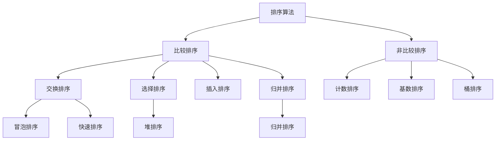

## 一句话概括

排序算法是计算机科学中研究最透彻的一类算法，冒泡排序、快速排序、归并排序和堆排序分别代表了不同设计范式——冒泡（迭代交换）、快排（分治+分区）、归并（分治+合并）、堆排（优先队列）——掌握它们的时间/空间复杂度边界与稳定性的取舍，等于掌握了"分治思想"和"复杂度分析"两把算法利刃。

## 背景与意义

排序是编程领域中最基础、也最深入研究的操作。你几乎每天都在使用排序——`Array.sort()`、SQL的`ORDER BY`、数据库索引的构建——但你可能从未问过一个关键问题：**排序，为什么有这么多算法？**

答案是：**没有一种排序算法在所有场景下都是最优的**。每种排序算法都在时间复杂度、空间复杂度、稳定性、数据规模、初始有序度等维度上做出了不同的取舍。

前端开发中排序的应用无所不在：

- **表格数据排序**：用户点击表头升降序——你需要一个稳定的排序算法（`Array.sort`在V8中默认为TimSort，是稳定的）
- **无限滚动列表**：新数据不断插入，需要维护已排序状态——插入排序的变体
- **Top K选择**：在大量数据中找到前K个最大值——堆排序是最佳选择
- **可视化排序展示**：冒泡排序的"冒泡"效果最直观（但最不实用）
- **服务端排序处理**：在Node.js中处理大型数据集——归并排序的外排序变体

理解排序算法，就是为了在面对排序问题时，能做出"用什么算法取决于数据特征"的工程决策。

### 衡量标准

评估排序算法主要看四个维度：

| 维度 | 含义 |
|------|------|
| **时间复杂度** | 比较和交换次数随n增长的趋势。最好、平均、最坏三个场景 |
| **空间复杂度** | 算法运行需要多少额外内存（原地排序 = O(1)，非原地 = O(n)） |
| **稳定性** | 相等元素的相对顺序是否保持不变（行列转换时稳定性至关重要） |
| **自适应性** | 是否能在输入近乎有序时跑得更快 |

四大排序的对比预览：

| 算法 | 平均时间 | 最坏时间 | 最好时间 | 空间 | 稳定 |
|------|---------|---------|---------|------|------|
| 冒泡排序 | O(n²) | O(n²) | O(n) | O(1) | ✅ |
| 快速排序 | O(n log n) | O(n²) | O(n log n) | O(log n) | ❌ |
| 归并排序 | O(n log n) | O(n log n) | O(n log n) | O(n) | ✅ |
| 堆排序 | O(n log n) | O(n log n) | O(n log n) | O(1) | ❌ |

## 概念与定义

### 排序算法的分类



本文聚焦最有代表性的四种比较排序。

### 为什么从冒泡开始？

冒泡排序是最直观的排序算法——它的名字本身就描述了过程：**较大的元素像气泡一样"浮"到数组的尾部**。

虽然冒泡在实际开发中几乎从不使用（因为低效），但它是最好的"教学工具"——理解冒泡后，对其优化就是快速排序；理解它的局限性，就理解了为什么需要更快的算法。

## 核心知识点拆解

### 一、冒泡排序（Bubble Sort）

#### 算法思想

遍历数组，比较相邻元素。如果前一个比后一个大，就交换。每轮遍历后，最大的元素"冒泡"到最后。重复n-1轮。

#### 基础实现

```javascript
function bubbleSort(arr) {
  const n = arr.length;
  // 深拷贝以防修改原数组
  const result = [...arr];

  for (let i = 0; i < n - 1; i++) {
    // 内层循环：从第一个元素到"未排序部分的最后一个"
    for (let j = 0; j < n - 1 - i; j++) {
      if (result[j] > result[j + 1]) {
        // 交换
        [result[j], result[j + 1]] = [result[j + 1], result[j]];
      }
    }
  }

  return result;
}

// 测试
console.log(bubbleSort([5, 3, 8, 4, 2])); // [2, 3, 4, 5, 8]
```

**执行过程（对[5, 3, 8, 4, 2]）**：
```
第1轮：3, 5, 4, 2, [8]   ← 8冒泡到末尾
第2轮：3, 4, 2, [5, 8]    ← 5冒泡到倒数第二
第3轮：3, 2, [4, 5, 8]    ← 4冒泡
第4轮：2, [3, 4, 5, 8]    ← 3冒泡
结果：2, 3, 4, 5, 8
```

#### 优化1：提前终止

如果某轮遍历没有发生任何交换，说明数组已有序，可以提前终止：

```javascript
function bubbleSortOptimized(arr) {
  const result = [...arr];
  const n = result.length;

  for (let i = 0; i < n - 1; i++) {
    let swapped = false;

    for (let j = 0; j < n - 1 - i; j++) {
      if (result[j] > result[j + 1]) {
        [result[j], result[j + 1]] = [result[j + 1], result[j]];
        swapped = true;
      }
    }

    if (!swapped) break; // 提前终止
  }

  return result;
}
```

这个优化使冒泡排序在**近乎有序**的数组上性能提升到O(n)。

#### 优化2：记录最后交换位置

每轮遍历的"最后交换位置"之后的元素已经有序，下一轮不需要再比较：

```javascript
function bubbleSortAdvanced(arr) {
  const result = [...arr];
  let n = result.length;

  while (n > 1) {
    let lastSwapIndex = 0;

    for (let i = 1; i < n; i++) {
      if (result[i - 1] > result[i]) {
        [result[i - 1], result[i]] = [result[i], result[i - 1]];
        lastSwapIndex = i;
      }
    }

    n = lastSwapIndex; // 下一轮只需比较到lastSwapIndex
  }

  return result;
}
```

#### 复杂度分析

- **最坏情况**（完全逆序）：O(n²)，每轮都要完全遍历
- **最好情况**（已排序）：O(n)，优化版只需一轮遍历
- **平均情况**：O(n²)
- **空间复杂度**：O(1)（原地排序）
- **稳定性**：稳定（当 `>` 时交换，`>=` 不交换，相等元素保持相对顺序）

### 二、快速排序（Quick Sort）

#### 算法思想

快速排序采用**分治策略**：
1. 从数组中选一个"基准"（pivot）
2. 将数组分成两部分：比基准小的在左，比基准大的在右（分区操作 partition）
3. 递归地对左右子数组进行快排

快排的平均性能极好（O(n log n)），且常数系数小，是实际应用中**最常用**的排序算法之一。

#### 基础实现

```javascript
function quickSort(arr) {
  if (arr.length <= 1) return arr;

  const pivot = arr[0]; // 选择第一个元素作为基准（简单但不好）
  const left = [];
  const right = [];

  for (let i = 1; i < arr.length; i++) {
    if (arr[i] < pivot) {
      left.push(arr[i]);
    } else {
      right.push(arr[i]);
    }
  }

  return [...quickSort(left), pivot, ...quickSort(right)];
}
```

这个实现虽然简洁，但有严重问题：**每次递归都创建新数组，空间复杂度为O(n log n)到O(n²)**。更专业的实现采用"原地分区"。

#### 原地分区（Lomuto分区方案）

```javascript
// 原地快排——在生产中可用
function quickSortInPlace(arr, left = 0, right = arr.length - 1) {
  if (left >= right) return arr;

  const pivotIndex = partition(arr, left, right);

  quickSortInPlace(arr, left, pivotIndex - 1);
  quickSortInPlace(arr, pivotIndex + 1, right);

  return arr;
}

// Lomuto分区方案
function partition(arr, left, right) {
  // 选择最右侧元素作为基准
  const pivot = arr[right];
  let i = left; // i是"小于基准区域的边界"

  for (let j = left; j < right; j++) {
    if (arr[j] <= pivot) {
      [arr[i], arr[j]] = [arr[j], arr[i]];
      i++;
    }
  }

  // 将基准放到正确位置
  [arr[i], arr[right]] = [arr[right], arr[i]];
  return i;
}

// 测试
const arr1 = [5, 3, 8, 4, 2, 7, 1, 6];
quickSortInPlace(arr1);
console.log(arr1); // [1, 2, 3, 4, 5, 6, 7, 8]
```

**分区过程详解（对 [5, 3, 8, 4, 2]，pivot=2）**：
```
初始: [5, 3, 8, 4, 2], left=0, right=4, i=0

j=0, arr[0]=5 > 2: 不交换, i=0
j=1, arr[1]=3 > 2: 不交换, i=0
j=2, arr[2]=8 > 2: 不交换, i=0
j=3, arr[3]=4 > 2: 不交换, i=0

循环结束, 交换arr[0]和arr[4]:
[2, 3, 8, 4, 5], pivotIndex=0

递归左：[]（left>right）
递归右：[3, 8, 4, 5] → 继续分区...
```

#### 优化：随机基准选择

快排最坏情况O(n²)发生在每次分区都极度不平衡时（如数组已有序且每次选第一个元素为基准）。**随机选基准**可以让最坏情况的概率降到极低：

```javascript
function partitionRandom(arr, left, right) {
  // 随机选择一个索引与right交换
  const randomIndex = left + Math.floor(Math.random() * (right - left + 1));
  [arr[randomIndex], arr[right]] = [arr[right], arr[randomIndex]];

  // 继续使用Lomuto分区
  return partition(arr, left, right);
}

function quickSortRandom(arr, left = 0, right = arr.length - 1) {
  if (left >= right) return arr;

  const pivotIndex = partitionRandom(arr, left, right);

  quickSortRandom(arr, left, pivotIndex - 1);
  quickSortRandom(arr, pivotIndex + 1, right);

  return arr;
}
```

#### 优化：三数取中法

另一种选择更好基准的方式：

```javascript
function medianOfThree(arr, left, right) {
  const mid = left + Math.floor((right - left) / 2);

  // 将 left, mid, right 三个位置的元素排序
  if (arr[left] > arr[mid]) [arr[left], arr[mid]] = [arr[mid], arr[left]];
  if (arr[mid] > arr[right]) [arr[mid], arr[right]] = [arr[right], arr[mid]];
  if (arr[left] > arr[mid]) [arr[left], arr[mid]] = [arr[mid], arr[left]];

  // 将中位数放到 right-1 位置作为基准
  [arr[mid], arr[right - 1]] = [arr[right - 1], arr[mid]];
  return arr[right - 1];
}
```

#### 复杂度分析

- **平均时间复杂度**：O(n log n)——每次分区将数组大致分为两半，递归深度为log n，每层总比较次数为O(n)
- **最坏时间**：O(n²)——分区极度不平衡（每次一个元素单独一组，其余在另一组）
- **最好时间**：O(n log n)
- **空间复杂度**：O(log n)——递归调用栈的深度
- **稳定性**：不稳定——交换操作可能打乱相等元素的相对顺序

### 三、归并排序（Merge Sort）

#### 算法思想

归并排序也采用**分治策略**，但实现方式与快排不同：
1. 将数组从中间分成两半
2. 递归地对两半进行归并排序
3. 合并两个已排序的子数组（merge操作）

归并排序的**核心优势**：**最坏情况也是O(n log n)**。它的性能不依赖于输入数据的初始状态。

#### 自顶向下实现（递归）

```javascript
function mergeSort(arr) {
  if (arr.length <= 1) return arr;

  const mid = Math.floor(arr.length / 2);
  const left = mergeSort(arr.slice(0, mid));
  const right = mergeSort(arr.slice(mid));

  return merge(left, right);
}

function merge(left, right) {
  const result = [];
  let i = 0, j = 0;

  // 比较两个已排序数组的开头，将较小的放入结果
  while (i < left.length && j < right.length) {
    if (left[i] <= right[j]) {
      result.push(left[i++]);
    } else {
      result.push(right[j++]);
    }
  }

  // 处理剩余元素
  while (i < left.length) result.push(left[i++]);
  while (j < right.length) result.push(right[j++]);

  return result;
}

// 测试
console.log(mergeSort([5, 3, 8, 4, 2, 7, 1, 6]));
// [1, 2, 3, 4, 5, 6, 7, 8]
```

**merge过程详解**（合并 [2, 5, 8] 和 [3, 4, 7]）：
```
比较 2 和 3 → 取 2, result=[2]
比较 5 和 3 → 取 3, result=[2, 3]
比较 5 和 4 → 取 4, result=[2, 3, 4]
比较 5 和 7 → 取 5, result=[2, 3, 4, 5]
比较 8 和 7 → 取 7, result=[2, 3, 4, 5, 7]
剩余 [8] → result=[2, 3, 4, 5, 7, 8]
```

#### 原地归并（减少空间使用）

递归版归并排序每次merge都创建新数组，空间复杂度为O(n)。可以通过"原地归并"优化，但实现复杂且会失去稳定性：

```javascript
// 使用辅助数组的原地归并排序
function mergeSortInPlace(arr) {
  const temp = new Array(arr.length);
  mergeSortHelper(arr, 0, arr.length - 1, temp);
  return arr;
}

function mergeSortHelper(arr, left, right, temp) {
  if (left >= right) return;

  const mid = left + Math.floor((right - left) / 2);
  mergeSortHelper(arr, left, mid, temp);
  mergeSortHelper(arr, mid + 1, right, temp);
  mergeInPlace(arr, left, mid, right, temp);
}

function mergeInPlace(arr, left, mid, right, temp) {
  // 复制到临时数组
  for (let i = left; i <= right; i++) {
    temp[i] = arr[i];
  }

  let i = left;       // 左半部分指针
  let j = mid + 1;    // 右半部分指针
  let k = left;       // 结果位置

  while (i <= mid && j <= right) {
    if (temp[i] <= temp[j]) {
      arr[k++] = temp[i++];
    } else {
      arr[k++] = temp[j++];
    }
  }

  while (i <= mid) arr[k++] = temp[i++];
  while (j <= right) arr[k++] = temp[j++];
}
```

#### 自底向上实现（迭代）

迭代版归并排序从最小的子数组（大小为1）开始，逐步增大合并粒度：

```javascript
function mergeSortIterative(arr) {
  const n = arr.length;
  const result = [...arr];
  const temp = new Array(n);

  // size: 当前合并的子数组大小，从1开始，每次翻倍
  for (let size = 1; size < n; size *= 2) {
    // 合并相邻的两个大小为size的子数组
    for (let left = 0; left < n - size; left += 2 * size) {
      const mid = left + size - 1;
      const right = Math.min(left + 2 * size - 1, n - 1);
      mergeInPlace(result, left, mid, right, temp);
    }
  }

  return result;
}
```

迭代版归并排序的好处是：**不需要递归，不会栈溢出**。

#### 复杂度分析

- **时间复杂度**：O(n log n) —— 无论输入如何，性能稳定
  - 递归深度：log n 层
  - 每层合并：O(n) 操作
  - 总操作：n × log n
- **空间复杂度**：O(n) —— 需要额外数组存储合并结果
- **稳定性**：稳定 —— merge操作中 `left[i] <= right[j]` 时取左数组元素，相等元素保持原序

### 四、堆排序（Heap Sort）

#### 算法思想

堆排序利用**堆**这种数据结构——一个大顶堆（或小顶堆）保证了堆顶元素是最大值（或最小值）。

算法步骤：
1. 将无序数组构建为一个大顶堆
2. 交换堆顶（最大值）与堆的最后一个元素
3. 堆的大小减1，对新的堆顶进行"下沉"（sift down）操作，重新调整为堆
4. 重复步骤2-3，直到堆为空

堆排序最吸引人的特性：**原地排序，且最坏情况O(n log n)**。

#### 实现

```javascript
function heapSort(arr) {
  const result = [...arr];
  const n = result.length;

  // 1. 构建大顶堆
  // 从最后一个非叶子节点开始向前遍历
  for (let i = Math.floor(n / 2) - 1; i >= 0; i--) {
    heapify(result, n, i);
  }

  // 2. 逐个提取堆顶元素
  for (let i = n - 1; i > 0; i--) {
    // 将堆顶（最大值）交换到当前范围末尾
    [result[0], result[i]] = [result[i], result[0]];
    // 对新的堆顶进行下沉调整
    heapify(result, i, 0);
  }

  return result;
}

// 下沉操作：从索引i开始，在大小为heapSize的堆中使子树维持堆性质
function heapify(arr, heapSize, i) {
  let largest = i;
  const left = 2 * i + 1;   // 左子节点
  const right = 2 * i + 2;  // 右子节点

  // 找最大值：当前节点 vs 左子节点 vs 右子节点
  if (left < heapSize && arr[left] > arr[largest]) {
    largest = left;
  }

  if (right < heapSize && arr[right] > arr[largest]) {
    largest = right;
  }

  // 如果最大值不是当前节点，交换并继续下沉
  if (largest !== i) {
    [arr[i], arr[largest]] = [arr[largest], arr[i]];
    heapify(arr, heapSize, largest);
  }
}

// 测试
console.log(heapSort([5, 3, 8, 4, 2, 7, 1, 6]));
// [1, 2, 3, 4, 5, 6, 7, 8]
```

**堆排序执行过程详解**（对 [5, 3, 8, 4, 2]）：

**步骤1：构建大顶堆**
```
初始数组:   [5, 3, 8, 4, 2]
树形结构:     5
            /   \
           3     8
          / \
         4   2

从索引 floor(5/2)-1 = 1 开始：

i=1 (值=3): 左子4>3 → 交换 [5,4,8,3,2]
树形:        5
            /   \
           4     8
          / \
         3   2

i=0 (值=5): 左子4<5,右子8>5 → 交换 [8,4,5,3,2]
树形:        8
            /   \
           4     5
          / \
         3   2

大顶堆构建完成: [8, 4, 5, 3, 2]
```

**步骤2：堆排序提取**
```
交换堆顶和末尾: [2, 4, 5, 3, 8] → 堆化前4个: [5, 4, 2, 3, | 8]
交换堆顶和末尾: [3, 4, 2, 5, 8] → 堆化前3个: [4, 3, 2, | 5, 8]
交换堆顶和末尾: [2, 3, 4, 5, 8] → 堆化前2个: [3, 2, | 4, 5, 8]
交换堆顶和末尾: [2, 3, 4, 5, 8] → 堆化前1个: [2, | 3, 4, 5, 8]
结果: [2, 3, 4, 5, 8]
```

#### 复杂度分析

- **时间复杂度**：O(n log n)
  - 建堆：O(n)——对n/2个节点执行heapify，每个heapify O(log n)，但数学证明总和为O(n)
  - 排序：n次提取，每次heapify O(log n)，合计O(n log n)
- **空间复杂度**：O(1)（原地排序）
- **稳定性**：不稳定——长距离交换可能打乱相等元素的顺序

## 实战案例

### 完整场景：排序算法在"排行榜"系统中的应用

假设我们要实现一个游戏排行榜系统，需要支持以下功能：
1. **初始化**：给定100万条玩家数据，按得分排序
2. **实时更新**：玩家得分变化后，维持排行榜有序
3. **Top K查询**：快速获取排名前100的玩家
4. **分页查询**：获取第101~200名的玩家

```javascript
// ===== 游戏排行榜系统 =====

class Leaderboard {
  constructor() {
    this.players = []; // 玩家数据数组
    this.isSorted = false;
  }

  // 1. 初始化：加载大量玩家数据并排序
  // 使用归并排序（保证稳定性，如果得分相同，先注册的玩家排名靠前）
  loadPlayers(playerData) {
    this.players = playerData;
    // 100万条数据，归并排序最安全
    this.players = mergeSortInPlace(this.players, (a, b) => {
      if (a.score !== b.score) return b.score - a.score; // 得分降序
      return a.registeredAt - b.registeredAt; // 注册时间升序
    });
    this.isSorted = true;
  }

  // 2. 单条数据更新：玩家得分变化
  // 此时数组"几乎有序"（只有一条不对，其他都有序）
  // 使用"二分查找+插入"O(log n)-O(n)比整体排序O(n log n)快
  updateScore(playerId, newScore) {
    // 找到该玩家
    const index = this.players.findIndex((p) => p.id === playerId);
    if (index === -1) return false;

    const player = this.players[index];
    const oldScore = player.score;
    player.score = newScore;

    // 从当前位置移除
    this.players.splice(index, 1);

    // 根据新得分，用二分查找找到正确位置
    let insertIndex = this.binarySearchInsert(newScore, player.registeredAt);

    // 插入
    this.players.splice(insertIndex, 0, player);
    return true;
  }

  // 3. Top K查询：获取前K名
  // 数组已排序，直接取前K个元素 O(k)
  getTopK(k) {
    if (!this.isSorted) return [];
    return this.players.slice(0, Math.min(k, this.players.length));
  }

  // 4. 分页查询
  getRankRange(start, end) {
    if (!this.isSorted) return [];
    return this.players.slice(start - 1, end);
  }

  // 5. 查询某个玩家的排名
  // 使用二分查找 O(log n)
  getPlayerRank(playerId) {
    // 不遍历，用二分查找（利用有序性）
    let left = 0;
    let right = this.players.length - 1;

    while (left <= right) {
      const mid = left + Math.floor((right - left) / 2);
      if (this.players[mid].id === playerId) {
        return mid + 1; // 排名从1开始
      }
      // 按得分和注册时间继续二分查找
      // ...
    }
    return -1;
  }

  // 二分查找插入位置
  binarySearchInsert(score, registeredAt) {
    let left = 0;
    let right = this.players.length;

    while (left < right) {
      const mid = left + Math.floor((right - left) / 2);
      const current = this.players[mid];

      if (current.score > score) {
        left = mid + 1; // 得分高的排前面
      } else if (current.score < score) {
        right = mid;
      } else {
        // 得分相等，比较注册时间
        if (current.registeredAt <= registeredAt) {
          left = mid + 1;
        } else {
          right = mid;
        }
      }
    }

    return left;
  }

  // 6. 使用堆排序获取Top K
  // 不排序整个数组，只找出Top K（当数组未排序时）
  getTopKWithHeap(k) {
    if (k <= 0) return [];
    if (k >= this.players.length) return this.players;

    // 使用小顶堆保持Top K
    const heap = [];

    for (const player of this.players) {
      if (heap.length < k) {
        // 堆未满，直接插入
        heap.push(player);
        this.bubbleUp(heap, heap.length - 1, (a, b) => a.score - b.score);
      } else if (player.score > heap[0].score) {
        // 当前玩家分数大于堆顶（堆中最小分数），替换
        heap[0] = player;
        this.sinkDown(heap, 0, heap.length, (a, b) => a.score - b.score);
      }
    }

    return heap.sort((a, b) => b.score - a.score);
  }

  // 小顶堆辅助方法
  bubbleUp(heap, index, comparator) {
    while (index > 0) {
      const parent = Math.floor((index - 1) / 2);
      if (comparator(heap[index], heap[parent]) >= 0) break;
      [heap[index], heap[parent]] = [heap[parent], heap[index]];
      index = parent;
    }
  }

  sinkDown(heap, index, size, comparator) {
    while (true) {
      let smallest = index;
      const left = 2 * index + 1;
      const right = 2 * index + 2;

      if (left < size && comparator(heap[left], heap[smallest]) < 0) {
        smallest = left;
      }
      if (right < size && comparator(heap[right], heap[smallest]) < 0) {
        smallest = right;
      }
      if (smallest === index) break;

      [heap[index], heap[smallest]] = [heap[smallest], heap[index]];
      index = smallest;
    }
  }
}

// ===== 使用 =====
const lb = new Leaderboard();

// 生成1000条测试数据
const testData = [];
for (let i = 1; i <= 1000; i++) {
  testData.push({
    id: i,
    name: `玩家${i}`,
    score: Math.floor(Math.random() * 10000),
    registeredAt: Date.now() - i * 1000,
  });
}

// 初始化排序（归并排序）
console.time('load');
lb.loadPlayers(testData);
console.timeEnd('load');

// Top 5
console.log('Top 5:', lb.getTopK(5).map((p) => `${p.name}: ${p.score}`));

// 更新得分
lb.updateScore(1, 9999); // 玩家1得分变为9999
console.log('更新后Top 5:', lb.getTopK(5).map((p) => `${p.name}: ${p.score}`));

// 使用堆获取Top 10（当数组非有序时）
const top10WithHeap = lb.getTopKWithHeap(10);
console.log('堆排序Top 10:', top10WithHeap.map((p) => `${p.name}: ${p.score}`));
```

这个排行榜系统展示了不同排序算法的工程选择：

- **初始化加载**：100万条数据→用**归并排序**（稳定性好、最坏情况有保障）
- **单条更新**：数组几乎有序→用**二分查找+插入**（O(log n)定位, O(n)插入，优于全局排序的O(n log n)）
- **Top K未排序**：不排序全部→用**堆**（只维持大小为K的小顶堆，O(n log K)）

## 底层原理

### 分治思想：快排 vs 归并

快速排序和归并排序都采用"分治"（Divide and Conquer）策略，但具体思路完全不同：

```mermaid
graph TB
    subgraph "快速排序"
        A1["Divide: 分区（partition）"] --> B1["选择一个基准，将数组分为两部分"]
        B1 --> C1[""小于基准"组 与 "大于基准"组"]
        C1 --> D1["Conquer: 递归处理两个分区"]
        D1 --> E1["Combine: 不需要合并（数组已经在分区时排好）"]
    end
    
    subgraph "归并排序"
        A2["Divide: 直接从中点切分"] --> B2["将数组分为两半"]
        B2 --> C2["Conquer: 递归处理两半"]
        C2 --> D2["Combine: 合并两个已排序的子数组"]
    end
```

**关键差异**：
- 快排的"分"阶段做了大量工作（分区），"合"阶段什么都不做
- 归并的"分"阶段什么都没做（直接切），"合"阶段做了大量工作（合并）

这个差异导致了不同的性能特征：
- 快排的"分区"可以就地完成（O(1)额外空间），但基准选择影响性能
- 归并的"合并"需要O(n)额外空间，但性能与输入无关

### 比较排序的"理论极限"

一个深刻的计算机科学问题：**基于比较的排序算法，下界是O(n log n)**。也就是说，没有也不可能有平均情况下时间复杂度比O(n log n)更优的比较排序算法。

这个下界的证明使用了**决策树模型**——排序算法的每次比较都对应决策树上的一个分支。n个元素有n!种排列，决策树的高度至少为log₂(n!)。根据斯特林公式：

$$\log_2(n!) \approx n\log_2 n - 1.44n = \Theta(n \log n)$$

这意味着：**冒泡排序O(n²)差得远，而快排/归并/堆排的O(n log n)已经触达理论极限**。这就是为什么O(n log n)被称为"最优排序"。

### 排序稳定性为什么重要

稳定性指的是：**排序后，相等元素的相对顺序保持不变**。

为什么重要？考虑一个"多级排序"的场景——先按时间排序，再按类型排序：

```javascript
const data = [
  { type: 'A', time: 3 },
  { type: 'B', time: 1 },
  { type: 'A', time: 2 },
  { type: 'B', time: 3 },
];

// 第一步：按时间排序
data.sort((a, b) => a.time - b.time);
// [{type:'B',time:1}, {type:'A',time:2}, {type:'A',time:3}, {type:'B',time:3}]

// 第二步：按类型排序（希望保持时间顺序）
// 用不稳定排序：A和B内部的time顺序无法保证
// 用稳定排序：
data.sort((a, b) => a.type.localeCompare(b.type));
// 稳定排序结果：[{type:'A',time:2}, {type:'A',time:3}, {type:'B',time:1}, {type:'B',time:3}]
// type='A'中，time=2在time=3之前——时间顺序被保持！
```

这就是为什么Excel和数据库的"先按A列排序，再按B列排序"功能，依赖稳定的排序算法。

## 高频面试题解析

### Q1: 快排什么时候退化到O(n²)？如何避免？

**最佳回答**：
快排退化的根本原因是**每次分区都不平衡**——一个子数组只有一个元素，另一个有n-1个元素。递归深度变为n而不是log n，总操作变为O(n²)。

典型场景：
1. **数组已有序 + 基准选第一个或最后一个**：如 `[1,2,3,4,5]`，选第一个1做基准，分区结果为 `[]` 和 `[2,3,4,5]`
2. **所有元素相同**：每次分区都将所有元素分到一侧
3. **逆序数组 + 基准选第一个**：与有序场景类似

避免策略：
1. **随机基准选择**：几乎不可能每次都选到"最差的"
2. **三数取中法**：从left、mid、right中取中位数
3. **三路快排**：将数组分为"小于基准"、"等于基准"、"大于基准"三部分

```javascript
// 三路快排——解决"所有元素相同"时的退化问题
function quickSort3Way(arr, left = 0, right = arr.length - 1) {
  if (left >= right) return;

  const pivot = arr[left];
  let lt = left;  // arr[left+1...lt] < pivot
  let gt = right; // arr[gt...right] > pivot
  let i = left + 1;

  while (i <= gt) {
    if (arr[i] < pivot) {
      [arr[i], arr[lt]] = [arr[lt], arr[i]];
      lt++;
      i++;
    } else if (arr[i] > pivot) {
      [arr[i], arr[gt]] = [arr[gt], arr[i]];
      gt--;
    } else {
      i++;
    }
  }

  // 此时：arr[left...lt-1] < pivot, arr[lt...gt] = pivot, arr[gt+1...right] > pivot
  quickSort3Way(arr, left, lt - 1);
  quickSort3Way(arr, gt + 1, right);
}
```

概率上讲，随机选基准的快排退化到O(n²)的概率为**1/n!**，对n=1000来说，概率远小于宇宙射线导致计算机计算错误的概率。

### Q2: 归并排序和快排，实际开发中应该选哪个？

**最佳回答**：
决策树：

```
需要稳定排序？______ 是 → 归并排序
否 → 
  内存敏感（嵌入式/移动端）？ 是 → 快速排序（原地排序 O(log n)）
  否 →
    输入几乎有序？ 是 → 快排（选区优化后自适应好）
    否 →
      数据量大（>100万）且内存允许？ 是 → 归并排序（性能稳定）
      否 → 快排（常数因子小，实际更快）
```

实际底层实现中，很多语言的sort方法使用了**混合算法**：

- **V8（Chrome/Node.js）**：`Array.sort()` 使用 **TimSort**——归并排序的变体，在部分有序数组上性能接近O(n)，在完全乱序时保持O(n log n)
- **Firefox SpiderMonkey**：归并排序
- **Python**：TimSort
- **Java**：`Arrays.sort()` 对基本类型用双轴快排（Dual-Pivot QuickSort），对对象用TimSort

TimSort的本质是：**对"短子数组"用插入排序，对有序片段（run）用归并排序**。它结合了插入排序对有序数据的快速性和归并排序对无序数据的稳定性。

### Q3: 给定一个包含大量重复元素的大数组（比如1000万条），应该用什么排序？

**最佳回答**：
典型的面试题场景。分析数据特征：**大量重复**——这意味着很多元素相等。

**推荐：三路快排（3-Way QuickSort）**。

原因：三路快排将数组分为"小于基准"、"等于基准"、"大于基准"三部分。当大量元素相等时，中间部分很大，递归只处理两侧，性能可以逼近O(n)。

```javascript
function quickSort3WayForDuplicates(arr) {
  // 对大量重复元素的数组进行排序
  function sort(arr, left, right) {
    if (left >= right) return;

    // 随机选择基准
    const pivotIdx = left + Math.floor(Math.random() * (right - left + 1));
    const pivot = arr[pivotIdx];

    let lt = left;    // arr[left...lt] < pivot
    let gt = right;   // arr[gt...right] > pivot
    let i = left;

    while (i <= gt) {
      if (arr[i] < pivot) {
        [arr[i], arr[lt]] = [arr[lt], arr[i]];
        lt++;
        i++;
      } else if (arr[i] > pivot) {
        [arr[i], arr[gt]] = [arr[gt], arr[i]];
        gt--;
      } else {
        i++;
      }
    }

    // 只递归处理小于和大于部分，中间部分不动
    sort(arr, left, lt - 1);
    sort(arr, gt + 1, right);
  }

  const result = [...arr];
  sort(result, 0, result.length - 1);
  return result;
}

// 极端的重复场景测试
const manyDuplicates = new Array(10000000).fill(0).map(() => 
  Math.floor(Math.random() * 100) // 只有100种取值
);
// 三路快排在这种场景下远优于普通快排或归并排序
```

备选方案：如果内存足够，**计数排序（Counting Sort）** 可以达到O(n + k)，其中k为不同值的数量。

```javascript
function countingSort(arr, maxValue) {
  // 适用于已知值范围的小范围整数排序
  const counts = new Array(maxValue + 1).fill(0);
  const result = new Array(arr.length);

  // 计数
  for (const val of arr) counts[val]++;
  
  // 累加
  for (let i = 1; i <= maxValue; i++) counts[i] += counts[i - 1];
  
  // 从后往前放置（保证稳定性）
  for (let i = arr.length - 1; i >= 0; i--) {
    result[counts[arr[i]] - 1] = arr[i];
    counts[arr[i]]--;
  }

  return result;
}
```

### Q4: 为什么堆排序在实际中不如快排常用？

**最佳回答**：
虽然堆排序和快排的平均时间复杂度都是O(n log n)，但实际运行中快排通常比堆排序**快2~5倍**。原因在于：

1. **缓存不友好**：堆排序访问数组元素的模式是"跳跃式的"——父节点索引i要访问子节点2i+1/2i+2，每次访问大概率是**缓存未命中**（cache miss）。快排的分区操作访问的是**连续内存**，缓存命中率高得多。

2. **常数因子大**：堆排序的heapify操作需要比较父节点和两个子节点，交换后还要递归下沉。比较次数大约是快排的2倍。

3. **自适应性差**：对于近乎有序的数组，快排可以很快（优化后O(n)），但堆排序没有优势。

堆排序的真正优势在于：
- **Top K问题**：用大小为K的小顶堆遍历一遍即可（O(n log K)），不需要O(n log n)
- **优先队列**：插入和删除都是O(log n)，快排做不到
- **数据流排序**：数据不断到达，需要随时取出最大值——堆的结构天然支持

### Q5: 如何在O(n)时间内找到第K大的元素？不用排序整个数组。

**最佳回答**：
使用**快速选择（QuickSelect）算法**——快排的变体。每次分区后判断基准的位置与K的关系，只递归处理包含第K大元素的那一侧。

```javascript
// 找出数组中的第K大元素（K从1开始）
function findKthLargest(arr, k) {
  const n = arr.length;
  const target = n - k; // 第K大 = 第(n-k)小（升序索引）
  
  function quickSelect(left, right) {
    if (left >= right) return arr[left];

    // 随机选基准
    const randomIdx = left + Math.floor(Math.random() * (right - left + 1));
    [arr[randomIdx], arr[right]] = [arr[right], arr[randomIdx]];

    const pivotIndex = partition(arr, left, right);

    if (pivotIndex === target) {
      return arr[pivotIndex];
    } else if (pivotIndex < target) {
      return quickSelect(pivotIndex + 1, right);
    } else {
      return quickSelect(left, pivotIndex - 1);
    }
  }

  return quickSelect(0, n - 1);
}

// 测试
const test = [3, 1, 4, 1, 5, 9, 2, 6, 5, 3, 5];
console.log(findKthLargest(test, 3)); // 第3大 = 5
// 排序后: [1, 1, 2, 3, 3, 4, 5, 5, 5, 6, 9]
// 索引2（第3大）的值为5

// 验证
console.log([...test].sort((a, b) => b - a)[2]); // 5
```

QuickSelect的**平均时间复杂度**：O(n)
- 第一次分区处理n个元素，第二次处理n/2个，第三次n/4个...
- 总和：n + n/2 + n/4 + ... = 2n = O(n)

**最坏情况**：O(n²)（与快排一样，但随机化可避免）

## 总结与扩展

排序算法是算法思想的缩影。四种排序一文覆盖了编程中最重要的三种算法设计范式：

1. **冒泡排序**体现了"暴力枚举"思维——最简单，最慢。优化版本展示了"自适应"思想——当输入有序时快速终止。实际中极少使用，但教学价值无可替代。

2. **快速排序**体现了"分治+基准选择"思维——平均最快，选择什么样的基准决定了性能。它是实际中最常用的排序算法（在各种语言的sort实现中）。

3. **归并排序**体现了"分治+合并"思维——最稳定，最坏情况也有保障。代价是需要O(n)额外空间。它在"需要稳定性"和"数据分布不可预测"的场景中首选。

4. **堆排序**体现了"数据结构驱动算法"思维——将排序问题转化为堆的构建和提取。常数因子大但空间最省，在"内存受限"或"需要Top K"的场景中首选。

四种排序算法的时间/空间/稳定性对比矩阵：

```
选择排序算法 = 了解你的数据和约束 → 
数据特征 → 数组规模 → 内存限制 → 稳定性要求
↓                          ↓                    ↓                    ↓
小数组/几乎有序 → 插入排序  大数组/内存允许 → 归并排序  大数组/内存受限 → 堆排序  大数组/通用场景 → 快排
```

最后，一个实用的建议：在JavaScript中，99%的场景下直接用 `Array.sort()` 就足够了。V8的TimSort已经为你做了最好的选择。理解这四种排序的目的，是让你在遇到那1%的"排序很慢/内存不够/数据特殊"场景时，知道问题出在哪里、选择什么替代方案。
