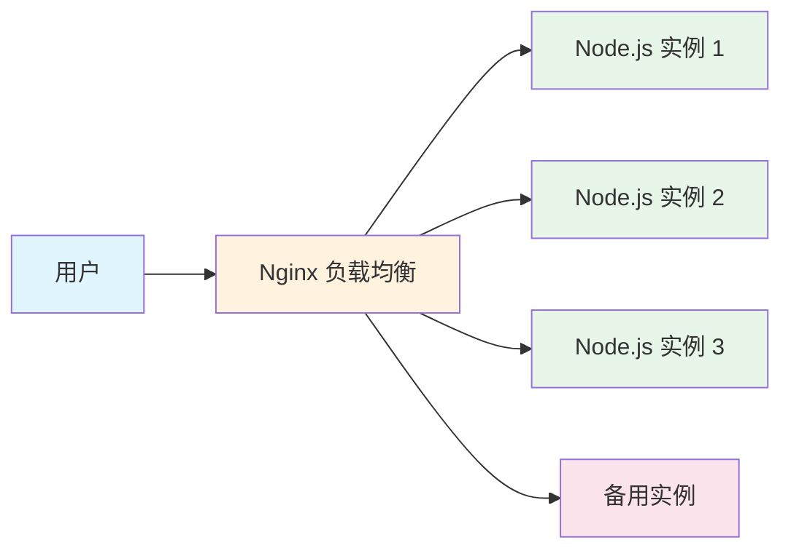

## 一句话概括

Nginx 是一个高性能的 HTTP 和反向代理服务器，以事件驱动的异步架构实现高并发能力（单机 5万+ 并发连接），从前端开发者的视角看，它是你部署静态资源、配置 API 代理、实现负载均衡时最得力的"看门人"。

## 背景与意义

你大概率经历过这样的场景：用 `npm run build` 打包完前端项目，把 `dist` 目录扔到服务器上，但不知道跑在 3000 端口的 `npm serve` 在生产环境能撑多久。当用户量上去以后，你会遇到跨域问题、请求并发瓶颈、域名配置混乱、甚至白屏问题——这时候你需要一个"前门"来统一管理所有流量。

这个"前门"就是 Nginx。

Nginx 由俄罗斯工程师 Igor Sysoev 在 2004 年创建，为了解决 C10K 问题而生。在它之前，Apache 是主流 Web 服务器，但 Apache 是进程/线程模型——每个连接创建一个进程，内存开销巨大。Nginx 采用事件驱动、异步非阻塞模型，用少量的 worker 进程处理海量连接，内存消耗极低。

**对于前端工程师，Nginx 是必学的三个理由：**

1. **静态资源服务**：前端构建产物需要高性能的 HTTP 服务器
2. **反向代理**：解决开发/生产环境的跨域、API 转发
3. **部署与发布**：多环境多域名管理、灰度发布、HTTPS 配置

## 概念与定义

**正向代理 vs 反向代理：**
- 正向代理：客户端知道代理服务器，代理你访问外部资源（VPN、科学上网）
- 反向代理：客户端不知道代理的存在，代理服务器代表后端提供服务（Nginx 的典型用法）

**Nginx 核心组件：**
- **master 进程**：读取配置、管理 worker 进程
- **worker 进程**：处理实际请求，数量通常等于 CPU 核数
- **事件模块**：处理 IO 多路复用（epoll/select/poll）

**基础配置结构：**

```nginx
# nginx.conf — 核心配置文件结构

# 全局块 — 影响 Nginx 整体运行
user nginx;
worker_processes auto;   # 自动匹配 CPU 核心数
error_log /var/log/nginx/error.log warn;
pid /var/run/nginx.pid;

# events 块 — 网络连接配置
events {
    worker_connections 1024;    # 每个 worker 最大连接数
    multi_accept on;            # 一次 accept 多个连接
    use epoll;                  # Linux 上使用 epoll
}

# http 块 — HTTP 相关配置
http {
    include /etc/nginx/mime.types;
    default_type application/octet-stream;
    
    # 基础优化
    sendfile on;
    tcp_nopush on;
    tcp_nodelay on;
    keepalive_timeout 65;
    
    # Gzip 压缩（前端资源传送利器）
    gzip on;
    gzip_min_length 1k;
    gzip_comp_level 6;
    gzip_types text/plain text/css application/javascript image/svg+xml;
    
    # 日志格式
    log_format main '$remote_addr - $remote_user [$time_local] "$request" '
                    '$status $body_bytes_sent "$http_referer" '
                    '"$http_user_agent" "$http_x_forwarded_for"';
    
    # 虚拟主机配置
    include /etc/nginx/conf.d/*.conf;
}
```

## 核心知识点拆解

### 1. 静态资源服务

这是前端开发用到 Nginx 最基础的场景。构建一个 React/Vue 应用的核心配置：

```nginx
# /etc/nginx/conf.d/spa.conf
server {
    listen 80;
    server_name example.com www.example.com;
    root /var/www/my-app/dist;
    index index.html;
    
    # 静态资源缓存策略
    location ~* \.(js|css|png|jpg|jpeg|gif|ico|svg|woff2?)$ {
        expires 30d;
        add_header Cache-Control "public, immutable";
        access_log off;  # 静态资源不记录日志，减少磁盘 IO
    }
    
    # SPA 路由重写（核心！）
    location / {
        try_files $uri $uri/ /index.html;
    }
    
    # 安全头
    add_header X-Frame-Options "SAMEORIGIN" always;
    add_header X-Content-Type-Options "nosniff" always;
    add_header X-XSS-Protection "1; mode=block" always;
}
```

**重点理解 `try_files $uri $uri/ /index.html`：**
- 先尝试请求路径是否对应真实文件（`$uri`）
- 再尝试是否对应目录（`$uri/`）
- 都找不到就返回 `index.html`（SPA 路由兜底）

这是单页应用部署最关键的一行配置，没有它路由跳转刷新就会 404。

### 2. 反向代理

当你的前端需要调用后端 API，但后端跑在不同端口或不同服务器时，反向代理是必备技能。

```nginx
# API 反向代理配置
server {
    listen 443 ssl http2;
    server_name api.example.com;
    
    # SSL 配置
    ssl_certificate /etc/nginx/ssl/example.com.pem;
    ssl_certificate_key /etc/nginx/ssl/example.com.key;
    ssl_protocols TLSv1.2 TLSv1.3;
    
    location /api/ {
        proxy_pass http://127.0.0.1:3000/;  # Node.js 后端
        proxy_set_header Host $host;
        proxy_set_header X-Real-IP $remote_addr;
        proxy_set_header X-Forwarded-For $proxy_add_x_forwarded_for;
        proxy_set_header X-Forwarded-Proto $scheme;
        
        # WebSocket 支持（如果后端用 Socket.IO 或 WebSocket）
        proxy_http_version 1.1;
        proxy_set_header Upgrade $http_upgrade;
        proxy_set_header Connection "upgrade";
        
        # 超时配置
        proxy_connect_timeout 60s;
        proxy_read_timeout 60s;
        proxy_send_timeout 60s;
        
        # 缓冲配置
        proxy_buffering on;
        proxy_buffer_size 4k;
        proxy_buffers 8 4k;
    }
    
    # 文件上传（大 body）
    location /upload/ {
        proxy_pass http://127.0.0.1:3000;
        client_max_body_size 50m;  # 允许上传 50MB 文件
        proxy_request_buffering on;
    }
}
```

**Node.js 中的跨域问题解决（Nginx 方案 vs 代码方案）：**

```javascript
// ❌ 不推荐：Node.js 代码层面解决跨域
app.use(cors({
  origin: 'http://localhost:8080',
  methods: ['GET', 'POST']
}));

// ✅ 推荐：Nginx 层统一处理
```

用 Nginx 做反向代理时，前后端在同域下，天然没有跨域问题。这是最优雅的解决方案。

### 3. 负载均衡

当单台后端服务扛不住时，Nginx 可以自动分发请求到多台服务器。

```nginx
# 上游服务器组
upstream backend_nodes {
    # 负载均衡算法：默认 round-robin
    # least_conn;  # 最少连接
    # ip_hash;     # IP 哈希（保持会话）
    # random;      # 随机
    
    server 192.168.1.10:3000 weight=5 max_fails=3 fail_timeout=30s;
    server 192.168.1.11:3000 weight=3;
    server 192.168.1.12:3000 weight=2 backup;  # 备用节点
    
    keepalive 32;  # 保持与上游的长连接
}

server {
    listen 80;
    server_name app.example.com;
    
    location / {
        proxy_pass http://backend_nodes;
        proxy_http_version 1.1;
        proxy_set_header Connection "";
    }
    
    # 健康检查（需 nginx-plus 或第三方模块）
    # 开源版可以用被动检查：max_fails + fail_timeout
}
```



### 4. 限流与安全

保护后端不被刷爆，Nginx 内置了限流能力。

```nginx
# 限流区域定义
limit_req_zone $binary_remote_addr zone=api_limit:10m rate=10r/s;
limit_conn_zone $binary_remote_addr zone=addr:10m;

server {
    location /api/ {
        limit_req zone=api_limit burst=20 nodelay;  # 每秒10个，突发允许20个
        limit_conn addr 10;                           # 每个IP最多10个并发连接
        
        limit_req_status 429;  # 超限返回状态码
        limit_conn_status 503;
        
        proxy_pass http://backend;
    }
    
    # 防止暴力破解 / 爬虫
    location /admin/ {
        allow 192.168.1.0/24;
        allow 10.0.0.1;
        deny all;  # 除白名单外全部拒绝
    }
}
```

### 5. HTTPS 与 HTTP/2

现代前端项目必须上 HTTPS。

```nginx
server {
    listen 443 ssl http2;
    server_name example.com;
    
    ssl_certificate /etc/letsencrypt/live/example.com/fullchain.pem;
    ssl_certificate_key /etc/letsencrypt/live/example.com/privkey.pem;
    
    # 现代 SSL 配置
    ssl_session_cache shared:SSL:10m;
    ssl_session_timeout 10m;
    ssl_session_tickets off;
    
    ssl_protocols TLSv1.2 TLSv1.3;
    ssl_ciphers ECDHE-ECDSA-AES128-GCM-SHA256:ECDHE-RSA-AES128-GCM-SHA256;
    ssl_prefer_server_ciphers on;
    
    # HSTS — 强制浏览器使用 HTTPS
    add_header Strict-Transport-Security "max-age=63072000" always;
}

# HTTP 自动跳转 HTTPS
server {
    listen 80;
    server_name example.com www.example.com;
    return 301 https://$server_name$request_uri;
}
```

## 实战案例

### 场景：一个完整的前端项目部署配置

假设你有一个 Next.js 应用 + Node.js API 服务 + 静态资源 CDN 回源，我们来构建完整的 Nginx 配置。

```nginx
# /etc/nginx/conf.d/my-app.conf

# API 上游
upstream api_servers {
    least_conn;
    server 127.0.0.1:3001;
    server 127.0.0.1:3002;
    server 127.0.0.1:3003;
}

# 限流
limit_req_zone $binary_remote_addr zone=api:10m rate=30r/s;
limit_req_zone $binary_remote_addr zone=auth:10m rate=5r/s;

server {
    listen 443 ssl http2;
    server_name myapp.com;
    
    # SSL
    ssl_certificate /etc/nginx/ssl/myapp.com.pem;
    ssl_certificate_key /etc/nginx/ssl/myapp.com.key;
    ssl_stapling on;
    ssl_stapling_verify on;
    
    # 日志
    access_log /var/log/nginx/myapp-access.log main buffer=32k flush=5s;
    error_log /var/log/nginx/myapp-error.log warn;
    
    # Next.js 静态资源
    location /_next/static/ {
        alias /var/www/myapp/.next/static/;
        expires 365d;
        add_header Cache-Control "public, immutable";
    }
    
    # 其他静态资源
    location /static/ {
        alias /var/www/myapp/public/;
        expires 30d;
        add_header Cache-Control "public";
    }
    
    # API 代理
    location /api/ {
        limit_req zone=api burst=50 nodelay;
        proxy_pass http://api_servers;
        proxy_http_version 1.1;
        proxy_set_header Host $host;
        proxy_set_header X-Real-IP $remote_addr;
        proxy_set_header X-Forwarded-For $proxy_add_x_forwarded_for;
        proxy_set_header X-Request-ID $request_id;
        
        # 超时
        proxy_connect_timeout 5s;
        proxy_read_timeout 10s;
        proxy_send_timeout 10s;
        
        # 错误重试
        proxy_next_upstream error timeout invalid_header http_500 http_502 http_503;
        proxy_next_upstream_tries 3;
        proxy_next_upstream_timeout 10s;
    }
    
    # 鉴权接口 — 更严格的限流
    location /api/auth/ {
        limit_req zone=auth burst=10 nodelay;
        proxy_pass http://api_servers;
    }
    
    # WebSocket 支持
    location /ws/ {
        proxy_pass http://api_servers;
        proxy_http_version 1.1;
        proxy_set_header Upgrade $http_upgrade;
        proxy_set_header Connection "upgrade";
        proxy_read_timeout 3600s;  # WebSocket 长连接
    }
    
    # Next.js SSR 渲染
    location / {
        proxy_pass http://127.0.0.1:3000;  # Next.js 自身端口
        proxy_http_version 1.1;
        proxy_set_header Upgrade $http_upgrade;
        proxy_set_header Connection 'upgrade';
        proxy_set_header Host $host;
        proxy_cache_bypass $http_upgrade;
        
        # 缓存 SSR 页面
        proxy_cache STATIC;
        proxy_cache_valid 200 1m;
        proxy_cache_use_stale error timeout updating http_500 http_502;
    }
    
    # 安全头
    add_header X-Content-Type-Options nosniff;
    add_header X-Frame-Options DENY;
    add_header X-XSS-Protection "1; mode=block";
    add_header Referrer-Policy "strict-origin-when-cross-origin";
    add_header Permissions-Policy "camera=(), microphone=(), geolocation=()";
    
    # CSP 内容安全策略
    add_header Content-Security-Policy "
        default-src 'self';
        script-src 'self' 'unsafe-inline' 'unsafe-eval' *.myapp.com;
        style-src 'self' 'unsafe-inline';
        img-src 'self' data: blob: *.myapp.com;
        font-src 'self' data:;
        connect-src 'self' *.myapp.com wss://*.myapp.com;
    ";
}

# HTTP 强制跳转 HTTPS
server {
    listen 80;
    server_name myapp.com www.myapp.com;
    return 301 https://$server_name$request_uri;
}
```

**配合 Docker Compose 一键部署：**

```yaml
# docker-compose.yml
version: '3.8'
services:
  nginx:
    image: nginx:alpine
    ports:
      - "80:80"
      - "443:443"
    volumes:
      - ./nginx.conf:/etc/nginx/nginx.conf:ro
      - ./ssl:/etc/nginx/ssl:ro
      - ./web:/var/www/myapp:ro
    depends_on:
      - nextjs
      - api
  
  nextjs:
    build:
      context: ./frontend
      dockerfile: Dockerfile
    expose:
      - "3000"
    environment:
      - NODE_ENV=production
  
  api:
    build:
      context: ./backend
      dockerfile: Dockerfile
    expose:
      - "3001"
    environment:
      - NODE_ENV=production
      - REDIS_URL=redis://redis:6379
    depends_on:
      - redis
```

## 底层原理

### Nginx 为什么这么快？

Nginx 的架构设计可以用"异步 + 事件驱动 + 非阻塞"来概括。

**传统 Apache 模型：**
```
每个请求 → 创建一个进程/线程 → 阻塞等待 IO → 处理 → 销毁
内存开销: 每个连接需要几 MB
```

**Nginx 模型：**
```
master → 管理多个 worker
worker → 单线程事件循环（epoll）
         ├─ 接收新连接（accept mutex 确保不惊群）
         ├─ 读取请求（非阻塞）
         ├─ 处理请求
         ├─ 发送响应（非阻塞写）
         └─ 关闭连接

内存开销: 每个连接只需要几百 KB（含缓冲区）
```

**事件循环核心：**
```
while (1) {
    events = epoll_wait(epfd, events, maxevents, timeout);
    for (i = 0; i < events; i++) {
        if (events[i] 是新连接) {
            accept → 注册到 epoll；
        } else if (events[i] 是可读) {
            recv → 解析 HTTP 请求 → 处理；
        } else if (events[i] 是可写) {
            send → 发送响应；
        }
    }
}
```

这就是为什么一个 4 核机器、4 个 worker 进程的 Nginx 可以扛住 10 万并发连接。

### Location 匹配优先级

Nginx 的 location 指令有复杂的匹配规则，理解它才能写对配置：

```nginx
# 匹配优先级（从高到低）：
# 1. = 精确匹配
location = /api/login { ... }

# 2. ^~ 前缀匹配（停止正则搜索）
location ^~ /static/ { ... }

# 3. ~ / ~* 正则匹配（区分/不区分大小写）
location ~ \.php$ { ... }
location ~* \.(jpg|png)$ { ... }

# 4. 普通前缀匹配
location /api/ { ... }

# 5. 通用匹配
location / { ... }
```

**记忆口诀：等号 > 前缀停止 > 正则顺序 > 普通前缀 > 通用**

## 高频面试题解析

### Q1: Nginx 如何处理一个 HTTP 请求的完整流程？

1. 客户端发起 TCP 连接，三次握手后进入 epoll 队列
2. worker 进程通过 accept mutex 竞争获取新连接
3. 读取 HTTP 请求头到缓冲区，解析请求行、请求头
4. 根据请求 URI 匹配 location（按优先级规则）
5. 如果 location 配置了 `proxy_pass`，进入反向代理流程：连接上游服务器、转发请求、读取响应
6. 如果 location 配置了 `root/alias`，直接读取文件系统
7. 将响应写入输出缓冲区，通过 epoll 异步发送给客户端
8. 记录访问日志

### Q2: Nginx 的 `root` 和 `alias` 有什么区别？

这是前端工程师最容易搞混的两个指令。

```nginx
# root：会将完整 URI 追加到路径后
location /static/ {
    root /var/www/app;
    # 实际路径: /var/www/app/static/css/style.css
}

# alias：会替换掉匹配的 location 路径部分
location /static/ {
    alias /var/www/app/public/;
    # 实际路径: /var/www/app/public/css/style.css
    # 注意: alias 末尾必须有 /
}
```

**记忆：** `root` 是"拼接"，`alias` 是"替换"。

### Q3: 如何配置 Nginx 实现灰度发布/蓝绿部署？

```nginx
# 基于 Cookie 的灰度发布
upstable production {
    server 10.0.1.1:3000;
    server 10.0.1.2:3000;
}

upstream canary {
    server 10.0.1.3:3000;  # 新版本
}

server {
    set $upstream_group production;
    
    if ($http_cookie ~* "canary=true") {
        set $upstream_group canary;
    }
    
    location / {
        proxy_pass http://$upstream_group;
    }
}
```

或者用 `map` 实现更复杂的路由规则（基于 IP、User-Agent 等）。

### Q4: Nginx 的 `worker_connections` 和 `worker_processes` 如何设置？

- `worker_processes auto`：等于 CPU 核心数
- `worker_connections`：取决于 `ulimit -n`（系统最大文件描述符），通常设为 1024-65535

最大并发连接数 ≈ `worker_processes × worker_connections`
注意：反向代理场景下每个连接需要消耗两个 fd（客户端 + 上游），所以实际并发量需要减半。

### Q5: 如何用 Nginx 配置 CORS？

```nginx
location /api/ {
    # 允许所有来源（开发环境）
    add_header Access-Control-Allow-Origin "*" always;
    
    # 带凭证的跨域请求需要指定具体域名
    set $cors_origin "";
    if ($http_origin ~* (https?://.*\.example\.com)) {
        set $cors_origin $http_origin;
    }
    add_header Access-Control-Allow-Origin $cors_origin always;
    add_header Access-Control-Allow-Methods "GET, POST, PUT, DELETE, OPTIONS" always;
    add_header Access-Control-Allow-Headers "DNT, X-CustomHeader, Keep-Alive, User-Agent, X-Requested-With, If-Modified-Since, Cache-Control, Content-Type, Authorization" always;
    add_header Access-Control-Allow-Credentials "true" always;
    
    # 预检请求处理
    if ($request_method = 'OPTIONS') {
        add_header Access-Control-Max-Age 86400;
        add_header Content-Length 0;
        return 204;
    }
    
    proxy_pass http://backend;
}
```

## 总结与扩展

Nginx 的核心价值可以用三个词概括：**高性能、高灵活、高可靠**。从前端开发者的角度看，学好 Nginx 意味着：

1. **部署不在懵逼**：知道静态资源该怎么配、SPA 路由怎么处理
2. **跨域不写代码**：反向代理统一搞定，不用在 Node.js 里写各种 cors 配置
3. **架构有全局观**：负载均衡、限流、灰度发布、SSL 配置信手拈来

**进阶学习路径：**
- Nginx 模块开发（C 语言写高性能模块）
- OpenResty（Nginx + Lua，微服务网关）
- Kong / APISIX（API 网关，基于 OpenResty）
- Envoy / Traefik（服务网格时代的新选择）

推荐从 `nginx -V` 查看编译参数开始，了解你的 Nginx 都开启了哪些模块，然后对照 `nginx.org/en/docs/` 逐一深入。
