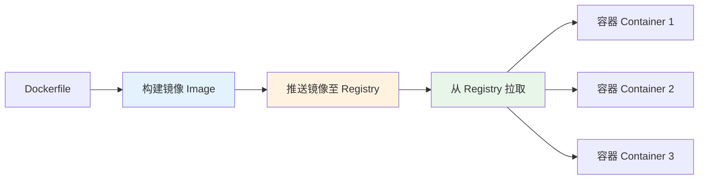

## 一句话概括

Docker 是一个容器化平台，通过将应用及其依赖打包成轻量级镜像，实现了"一次构建，到处运行"的部署一致性，从前端开发者的视角看，它是解决"在我电脑上明明是好的"这一千古难题的最强武器。

## 背景与意义

如果你是前端工程师，大概率有过这样的经历：本地开发环境一切正常，代码 push 到仓库后，运维说"启动不起来"；或者后端同事说"环境配置太麻烦，你帮我搭一下"。更有甚者，新同事入职第一天光配环境就花了大半天。

Docker 的出现就是为了解决这个问题。

Docker 的起源要追溯到 2013 年，dotCloud（后改名 Docker Inc.）的创始人 Solomon Hykes 在 PyCon 上展示了这个项目。它基于 Linux 内核的容器技术（cgroups + namespace），但加上了镜像构建、分发、管理等上层工具链，让容器变得人人可用。

**对于前端工程师，Docker 的三大价值：**

1. **环境一致**：开发、测试、生产环境完全一致，杜绝"环境差异"Bug
2. **简化部署**：一个 `docker-compose up` 启动全部服务（前端 + 后端 + 数据库 + 缓存）
3. **微服务化**：同一台机器跑多个前端项目，互相隔离不冲突

## 概念与定义

**镜像（Image）：** 一个只读的模板，包含运行应用所需的一切——代码、运行时、系统工具、库文件、环境变量。可以理解为"容器的快照"。

**容器（Container）：** 镜像的运行实例。一个镜像可以启动多个容器，每个容器相互隔离。

**Dockerfile：** 构建镜像的"配方文件"，告诉 Docker 如何一步步构建镜像。

**镜像仓库（Registry）：** 存储和分发镜像的地方，如 Docker Hub、阿里云 ACR、GitHub Container Registry。

**Docker Compose：** 定义和运行多容器 Docker 应用的编排工具，用 YAML 文件配置服务关系。



## 核心知识点拆解

### 1. Dockerfile 基础指令

从最精简的静态文件服务器开始，理解 Dockerfile 的核心指令：

```dockerfile
# 1. 基础镜像选择：FROM 是每个 Dockerfile 的第一条指令
FROM nginx:alpine

# 2. 作者信息（现在更推荐用 LABEL）
LABEL maintainer="team@example.com"
LABEL description="前端静态资源服务镜像"

# 3. 拷入文件：构建产物（dist 目录）拷入 Nginx 的 HTML 目录
COPY ./dist /usr/share/nginx/html

# 4. 拷入自定义 Nginx 配置
COPY nginx.conf /etc/nginx/conf.d/default.conf

# 5. 暴露端口（只是声明，实际映射在运行时指定 -p）
EXPOSE 80

# 6. 默认命令
CMD ["nginx", "-g", "daemon off;"]
```

构建与运行：

```bash
# 构建镜像
docker build -t my-vue-app:v1.0.0 .

# 运行容器
docker run -d -p 8080:80 --name my-app my-vue-app:v1.0.0

# 查看运行状态
docker ps

# 访问
curl http://localhost:8080

# 停止并删除
docker stop my-app && docker rm my-app
```

### 2. 多阶段构建（Multi-stage Build）

前端项目构建需要在 Node.js 环境中装依赖、编译代码，但生产环境只需要静态文件。多阶段构建完美解决这个问题：

```dockerfile
# ===== Stage 1: 构建阶段 =====
FROM node:20-alpine AS builder

WORKDIR /app

# 先拷 package.json，利用缓存层加速构建
COPY package.json package-lock.json ./
RUN npm ci --only=production --legacy-peer-deps

# 再拷源码并构建
COPY . .
RUN npm run build

# ===== Stage 2: 运行阶段 =====
FROM nginx:stable-alpine

# 从 builder 阶段拷出构建产物
COPY --from=builder /app/dist /usr/share/nginx/html
COPY nginx.conf /etc/nginx/conf.d/default.conf

# 健康检查
HEALTHCHECK --interval=30s --timeout=3s --retries=3 \
  CMD wget -qO- http://localhost:80 || exit 1

EXPOSE 80

CMD ["nginx", "-g", "daemon off;"]
```

**为什么多阶段构建是必备技能：**

| 对比项 | 单阶段构建 | 多阶段构建 |
|--------|-----------|-----------|
| 最终镜像大小 | 1.2GB+（含 node_modules 和构建工具） | 25MB（仅 alpine Nginx + 静态文件） |
| 安全风险 | 高（包含大量不必要的工具） | 低（仅运行时必要文件） |
| 构建速度 | 慢（每次全量构建） | 快（利用缓存层） |

```bash
# 查看镜像大小
docker images my-app
# REPOSITORY   TAG       IMAGE ID       CREATED          SIZE
# my-app       latest    abc123def456   10 seconds ago   24.8MB
```

### 3. Node.js 后端项目容器化

前端项目变成 SSR 或 BFF 层后，也需要容器化部署：

```dockerfile
# ===== 构建阶段 =====
FROM node:20-alpine AS builder

WORKDIR /app
COPY package.json package-lock.json ./

# 使用 npm ci 确保依赖版本精确
RUN npm ci --only=production

# ===== 运行阶段 =====
FROM node:20-alpine

# 安装 tini — 正确处理 PID 1 的信号问题
RUN apk add --no-cache tini

WORKDIR /app

# 创建非 root 用户，提高安全性
RUN addgroup -g 1001 -S nodejs && \
    adduser -S nodejs -u 1001

# 从 builder 阶段拷入 node_modules 和源码
COPY --from=builder /app/node_modules ./node_modules
COPY . .

# 设置生产环境变量
ENV NODE_ENV=production
ENV PORT=3000

# 使用非 root 用户运行
USER nodejs

EXPOSE 3000

# 使用 tini 作为 init 进程，确保 CTRL+C 能正确退出
ENTRYPOINT ["/sbin/tini", "--"]
CMD ["node", "dist/server.js"]
```

**为什么需要 tini？** 在 Linux 容器中，进程 PID 1 需要特殊处理信号转发。直接运行 `node` 作为 PID 1 时，`docker stop` 发送的 SIGTERM 信号不会被正确传递给子进程，导致容器无法优雅退出。tini 作为轻量级 init 系统解决这个问题。

### 4. Docker Compose 编排

前端项目往往需要同时启动多个服务。Docker Compose 让这件事变得极其简单：

```yaml
# docker-compose.yml
version: '3.8'

services:
  # 前端应用
  frontend:
    build:
      context: ./frontend
      dockerfile: Dockerfile
    ports:
      - "80:80"
    depends_on:
      - api
    networks:
      - app-network
    restart: unless-stopped

  # Node.js API
  api:
    build:
      context: ./backend
      dockerfile: Dockerfile
    expose:
      - "3000"
    environment:
      - NODE_ENV=production
      - REDIS_URL=redis://redis:6379
      - DATABASE_URL=postgresql://user:pass@db:5432/myapp
    depends_on:
      - db
      - redis
    networks:
      - app-network
    restart: unless-stopped

  # PostgreSQL
  db:
    image: postgres:16-alpine
    volumes:
      - pgdata:/var/lib/postgresql/data
    environment:
      - POSTGRES_DB=myapp
      - POSTGRES_USER=user
      - POSTGRES_PASSWORD=pass
    networks:
      - app-network
    restart: unless-stopped

  # Redis
  redis:
    image: redis:7-alpine
    volumes:
      - redisdata:/data
    networks:
      - app-network
    restart: unless-stopped

volumes:
  pgdata:
  redisdata:

networks:
  app-network:
    driver: bridge
```

**启动整个项目只需：**

```bash
# 构建并启动所有服务
docker-compose up -d --build

# 查看日志
docker-compose logs -f

# 停止所有服务
docker-compose down

# 查看运行中的服务
docker-compose ps

# 重启某个服务
docker-compose restart frontend

# 在某个容器中执行命令
docker-compose exec api node scripts/migrate.js
```

### 5. 前端项目优化的 Docker 技巧

```dockerfile
# 1. 利用构建缓存层 — 合理排序指令
# 不常变化的放前面，常变化的放后面
COPY package.json package-lock.json ./
RUN npm ci                     # 只有 package.json 变化时才重新安装
COPY . .                       # 这层缓存容易被打破
RUN npm run build

# 2. 使用 .dockerignore 减少上下文体积
```

```dockerfile
# .dockerignore
node_modules
.git
.gitignore
*.md
dist
.env
.env.local
.env.*.local
test
__tests__
coverage
.vscode
.idea
*.log
.DS_Store
```

```bash
# 3. 合理打标签，不要全用 latest
docker build -t my-app:1.0.0 .
docker tag my-app:1.0.0 registry.example.com/my-app:1.0.0
docker push registry.example.com/my-app:1.0.0

# 4. 清理旧的构建缓存
docker builder prune -af
docker system prune -af --volumes  # 谨慎使用
```

## 实战案例

### 场景：一个完整的 React SPA 项目容器化部署

假设你有一个 React 项目，使用了以下几个配套服务：
- React SPA（前端页面）
- Node.js BFF（API 代理层）
- Nginx（反向代理 + 静态资源服务）
- Redis（Session 管理）

**项目结构：**

```
my-project/
├── frontend/         # React 项目
│   ├── Dockerfile    # 多阶段构建
│   ├── nginx.conf    # 自定义 Nginx 配置
│   └── package.json
├── bff/              # Node.js BFF 层
│   ├── Dockerfile
│   └── package.json
├── docker-compose.yml
└── .env.production
```

**Step 1: 前端 Dockerfile**

```dockerfile
# frontend/Dockerfile
FROM node:20-alpine AS build

WORKDIR /app
COPY package.json package-lock.json ./
RUN npm ci --legacy-peer-deps
COPY . .
ARG VITE_API_BASE_URL
ENV VITE_API_BASE_URL=$VITE_API_BASE_URL
RUN npm run build

FROM nginx:stable-alpine
COPY --from=build /app/dist /usr/share/nginx/html
COPY nginx.conf /etc/nginx/conf.d/default.conf
EXPOSE 80
CMD ["nginx", "-g", "daemon off;"]
```

**Step 2: BFF 层 Dockerfile**

```dockerfile
# bff/Dockerfile
FROM node:20-alpine AS builder
WORKDIR /app
COPY package.json package-lock.json ./
RUN npm ci --only=production

FROM node:20-alpine
RUN apk add --no-cache tini
WORKDIR /app
COPY --from=builder /app/node_modules ./node_modules
COPY . .
ENV NODE_ENV=production
USER node
EXPOSE 3000
ENTRYPOINT ["/sbin/tini", "--"]
CMD ["node", "src/index.js"]
```

**Step 3: BFF 的 Express 服务**

```javascript
// bff/src/index.js
const express = require('express');
const { createProxyMiddleware } = require('http-proxy-middleware');
const session = require('express-session');
const RedisStore = require('connect-redis').default;
const { createClient } = require('redis');

const app = express();
const PORT = process.env.PORT || 3000;

// Redis 客户端
const redisClient = createClient({
  url: process.env.REDIS_URL || 'redis://localhost:6379',
});
redisClient.connect().catch(console.error);

// Session 共享
app.use(session({
  store: new RedisStore({ client: redisClient }),
  secret: process.env.SESSION_SECRET || 'secret',
  resave: false,
  saveUninitialized: false,
  cookie: {
    httpOnly: true,
    secure: process.env.NODE_ENV === 'production',
    sameSite: 'lax',
    maxAge: 24 * 60 * 60 * 1000, // 24 hours
  },
}));

// API 代理
app.use('/api', createProxyMiddleware({
  target: process.env.API_TARGET || 'http://backend:8080',
  changeOrigin: true,
}));

app.listen(PORT, () => {
  console.log(`BFF service running on port ${PORT}`);
});
```

**Step 4: Nginx 配置**

```nginx
# frontend/nginx.conf
server {
    listen 80;
    server_name localhost;
    
    # Gzip
    gzip on;
    gzip_types text/plain text/css application/javascript image/svg+xml;
    gzip_min_length 1024;
    
    # 静态资源
    location /assets/ {
        root /usr/share/nginx/html;
        expires 1y;
        add_header Cache-Control "public, immutable";
        access_log off;
    }
    
    # BFF 代理
    location /api/ {
        proxy_pass http://bff:3000/;
        proxy_http_version 1.1;
        proxy_set_header Host $host;
        proxy_set_header X-Real-IP $remote_addr;
        proxy_set_header X-Forwarded-For $proxy_add_x_forwarded_for;
        proxy_set_header X-Request-ID $request_id;
    }
    
    # SPA 路由
    location / {
        root /usr/share/nginx/html;
        try_files $uri $uri/ /index.html;
    }
}
```

**Step 5: Docker Compose**

```yaml
version: '3.8'

services:
  frontend:
    build:
      context: ./frontend
      args:
        VITE_API_BASE_URL: /api
    ports:
      - "80:80"
    depends_on:
      - bff
    networks:
      - app-net

  bff:
    build: ./bff
    environment:
      - NODE_ENV=production
      - REDIS_URL=redis://redis:6379
      - API_TARGET=http://backend:8080
      - SESSION_SECRET=${SESSION_SECRET}
    depends_on:
      - redis
    networks:
      - app-net
    restart: unless-stopped

  redis:
    image: redis:7-alpine
    volumes:
      - redis_data:/data
    networks:
      - app-net
    restart: unless-stopped

volumes:
  redis_data:

networks:
  app-net:
    driver: bridge
```

**一键部署：**

```bash
# 开发环境
docker-compose up -d --build

# 生产环境（使用 .env 文件）
docker-compose --env-file .env.production up -d --build

# 查看状态
docker-compose ps
docker-compose logs -f frontend

# 热更新开发模式
# docker-compose.yml 中 volumes 映射源码实现热重载
```

## 底层原理

### Docker 的隔离机制：Namespace + Cgroups

Docker 容器之所以"像虚拟机但不是虚拟机"，是因为它利用了两个 Linux 内核特性：

**Namespace（命名空间）—— 让进程看到的资源是隔离的：**

| Namespace | 隔离内容 | 效果 |
|-----------|---------|------|
| PID | 进程编号 | 容器内看到 PID 1，容器外可能是 12345 |
| Network | 网络栈 | 每个容器有独立 IP、端口、路由表 |
| Mount | 文件系统 | 容器只能看到自己挂载的文件系统 |
| UTS | 主机名 | 容器有独立 hostname |
| IPC | 进程间通信 | 容器间 IPC 隔离 |
| User | 用户 | 容器内 root ≠ 宿主机 root |

**Cgroups（控制组）—— 限制资源的配额：**

```bash
# Docker 内部通过 cgroups 设置内存限制
docker run -d --memory="512m" --cpus="0.5" my-app

# 等效于 cgroups v2 配置
# /sys/fs/cgroup/memory.max = 536870912
# /sys/fs/cgroup/cpu.max = 50000 100000
```

### 镜像分层存储

Docker 镜像不是一个大文件，而是由多层文件系统（Layer）叠加而成：

```
镜像: my-vue-app:v1
┌────────────────────┐
│ Layer 5: CMD / 配置  │ ← 最上层（可写容器层）
├────────────────────┤
│ Layer 4: COPY dist  │ ← 应用代码层（经常变化）
├────────────────────┤
│ Layer 3: COPY nginx │ ← Nginx 配置层（偶尔变化）
├────────────────────┤
│ Layer 2: apt/nginx  │ ← 基础工具层（很少变化）
├────────────────────┤
│ Layer 1: Alpine     │ ← 基础镜像（几乎不变）
└────────────────────┘
```

每层只记录该层的变化（增量），构建时可以复用已缓存的层。这就是为什么 Dockerfile 中**不常变的指令放前面、常变化的放后面**——最大化复用缓存层，加速构建。

## 高频面试题解析

### Q1: Docker 容器和虚拟机的区别是什么？

| 对比项 | Docker 容器 | 虚拟机 |
|--------|-------------|--------|
| 启动速度 | 毫秒级 | 分钟级 |
| 系统资源 | 共享宿主机内核，轻量 | 每个 VM 包含完整 OS |
| 镜像大小 | MB 级（alpine） | GB 级 |
| 隔离级别 | 进程级隔离（namespace） | 硬件级隔离 |
| 性能损耗 | 几乎无（直接调用宿主机内核） | 有损耗（虚拟化层） |

一句话总结：**容器是进程级别的隔离，虚拟机是操作系统级别的隔离。**

### Q2: Docker 的 CMD、ENTRYPOINT、RUN 有什么区别？

- **RUN**：构建镜像时执行，用于安装依赖、编译代码
- **CMD**：容器启动时的默认命令，可以被 `docker run` 覆盖
- **ENTRYPOINT**：容器的入口点，不可被 `docker run` 覆盖（除非用 `--entrypoint`）

```dockerfile
# 典型组合用法
ENTRYPOINT ["/sbin/tini", "--"]
CMD ["node", "server.js"]
# 运行效果：/sbin/tini -- node server.js
# docker run my-app -- node other.js → /sbin/tini -- node other.js
```

### Q3: 如何减小 Docker 镜像体积？

1. 选择 Alpine 基础镜像（Node.js 从 1.2GB → 120MB）
2. 多阶段构建（最终镜像只有 20-30MB）
3. `.dockerignore` 排除不必要文件
4. 合并 `RUN` 命令，减少镜像层数
5. 使用 `--no-cache` 和 `--only=production` 减少安装内容

```dockerfile
# 优化前
FROM node:20
RUN apt-get update
RUN apt-get install -y build-essential
RUN npm install
# 镜像大小: 1.2GB

# 优化后
FROM node:20-alpine AS build
RUN apk add --no-cache python3 make g++
RUN npm ci && npm run build

FROM node:20-alpine
COPY --from=build /app/dist ./dist
# 镜像大小: 120MB
```

### Q4: `docker-compose up` 和 `docker-compose start` 有什么区别？

- `docker-compose up`：创建并启动容器（如果镜像不存在会先构建）
- `docker-compose start`：仅启动已存在的停止中的容器
- `docker-compose restart`：重启容器
- `docker-compose down`：停止并删除容器、网络、卷

### Q5: 如何实现 Docker 容器的日志管理？

```yaml
# docker-compose.yml 中的日志配置
services:
  frontend:
    logging:
      driver: "json-file"
      options:
        max-size: "10m"
        max-file: "3"

  api:
    logging:
      driver: "syslog"
      options:
        syslog-address: "tcp://10.0.0.1:514"
```

生产环境建议用 ELK（Elasticsearch + Logstash + Kibana）或 Loki + Grafana 集中管理日志，而不是在 Docker 本地存日志。

## 总结与扩展

Docker 对于前端工程师来说，已经从"加分项"变成了"必备技能"。掌握它意味着：

1. **告别环境问题**：团队中不再出现"我机器上能跑"
2. **一键部署能力**：配合 CI/CD 实现从代码提交到自动部署的完整链路
3. **全栈视野拓展**：理解后端架构、服务编排、基础设施

**进阶学习路径：**
- Docker Swarm / Kubernetes（容器编排进阶）
- Docker Compose Override（多环境配置覆盖）
- BuildKit（下一代镜像构建引擎）
- Docker 安全最佳实践（Rootless 模式、Seccomp）
- 替代方案：Podman（无守护进程容器引擎）、containerd（Docker 底层运行时）

> **最后一句忠告：** Docker 镜像和 node_modules 一样，**不要提交到 Git 仓库**。镜像应该在 CI/CD 流水线中构建并推送到镜像仓库。
