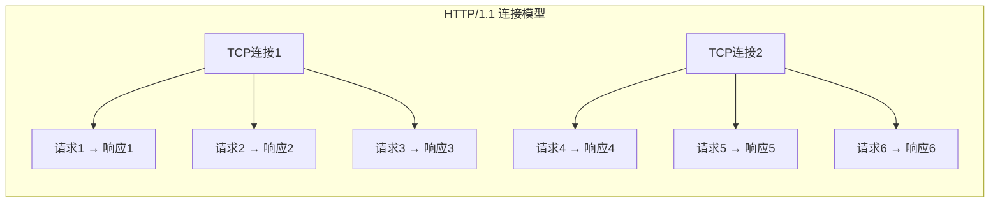
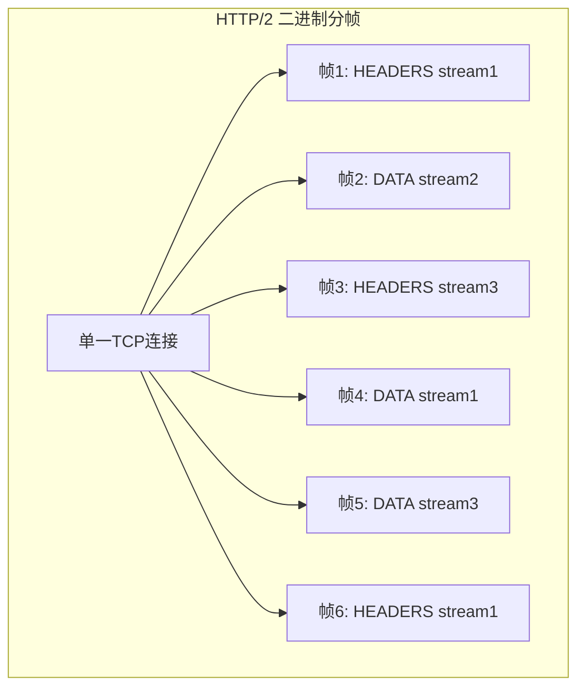
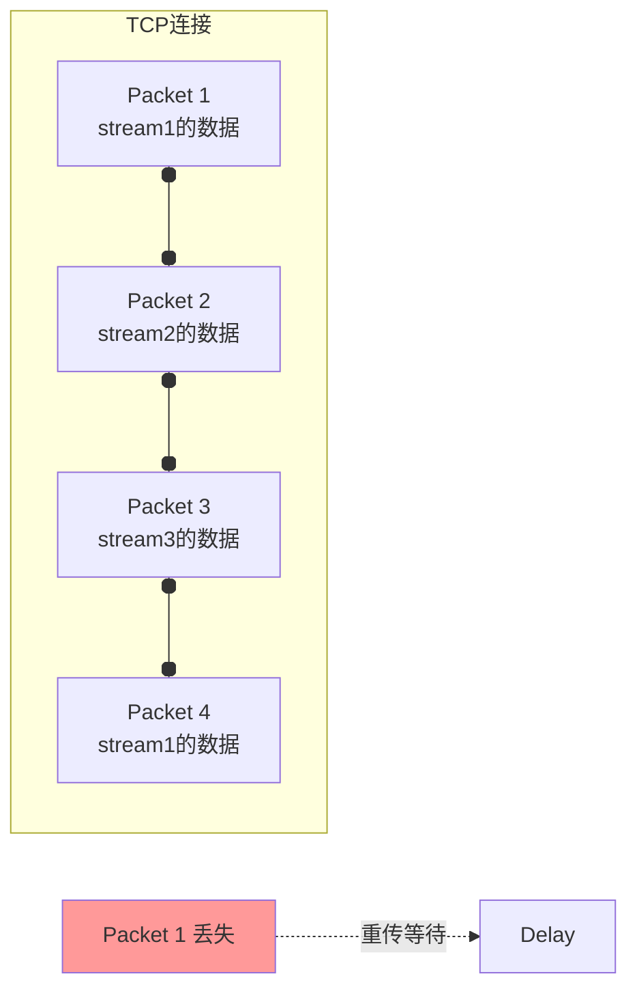

> HTTP/2并非对HTTP/1.1的革命，而是对后者性能瓶颈的针对性升级——它保持了相同的语义（方法、状态码、头部）但彻底重构了传输层。本文通过对比测试、抓包分析和配置实战，带你完整理解两个时代协议的设计哲学与性能差异。

## 一、背景与意义

### 从一条网页加载说起

一个现代网页平均加载约100个资源（HTML、CSS、JS、图片、字体）。在HTTP/1.1时代，浏览器为了加速加载，会同时打开6个TCP连接，每个连接可以承载1个待处理的请求（串行）。这意味着：

```
6个连接 × 1个请求/连接 = 6个并发请求
100个资源 / 6个并发 = ~17轮串行请求
每轮至少1个RTT（往返时间）

在100ms延迟的网络中：
加载时间 ≈ 100ms × 17轮 + 数据传输时间 ≈ 1.7s（仅算排队时间）
```

HTTP/2通过多路复用（Multiplexing）改变了这个局面：

```
1个连接 × 不受限的并发请求 = 所有请求同时发送

在100ms延迟的网络中：
加载时间 ≈ 100ms × 1轮 + 数据传输时间 ≈ 0.1s（仅算排队时间）
```

这就是HTTP/2最核心的价值——**解决队头阻塞（Head-of-Line Blocking）**。

### HTTP/1.1的问题与HTTP/2的解决思路

| HTTP/1.1问题 | HTTP/2解决方案 |
|-------------|--------------|
| 队头阻塞（一个请求阻塞，后续排队） | 多路复用（一个连接并发处理多个流） |
| 头部冗余重复发送 | HPACK头部压缩（静态表+动态表+Huffman） |
| 有限并发连接（浏览器6个） | 单一长连接（全复用） |
| 只能客户端主动请求 | 服务端推送（Server Push） |
| 文本协议解析慢 | 二进制分帧（更高效） |

## 二、概念与定义

### 2.1 HTTP/1.1的核心特征



- **文本协议**：请求行/状态行以ASCII文本传输
- **串行请求**：在一个连接上，请求必须等待上一个响应返回后才能发出
- **并发有限**：浏览器通常限制为同一域名6个并发连接
- **Keep-Alive**：通过Connection: keep-alive复用TCP连接（HTTP/1.0需手动开启，1.1默认）
- **管道化（Pipelining）**：理论上可以连续发请求而不等待响应，但实际几乎无人使用（队头阻塞问题未解决）

### 2.2 HTTP/2的核心特征



- **二进制协议**：帧（Frame）是最小通信单位，所有通信在二进制层完成
- **流（Stream）**：一个虚拟通道，每个请求/响应构成一个流
- **多路复用**：一个TCP连接上可以同时存在多个活跃流
- **HPACK压缩**：使用静态表、动态表和Huffman编码压缩头部
- **服务端推送**：服务端可以主动向客户端推送资源
- **流优先级**：客户端可以声明资源的依赖优先级

### 2.3 关键术语

| 术语 | 定义 | HTTP/1.1 | HTTP/2 |
|------|------|---------|--------|
| 消息 | HTTP请求或响应 | 文本帧序列 | HEADERS + DATA帧序列 |
| 帧 | 最小通信单元 | — | 9字节头+负载 |
| 流 | 连接内的虚拟通道 | — | 由Stream ID标识 |
| 连接 | TCP连接 | 通常6个 | 通常1个 |
| 队头阻塞 | 一个请求阻塞队列 | 存在 | 流级别解决（但TCP仍有） |

## 三、最小示例

### 3.1 抓包对比HTTP/1.1与HTTP/2

```bash
# 使用curl分别测试HTTP/1.1和HTTP/2

# HTTP/1.1请求
$ curl --http1.1 -s -o /dev/null -w "
  http_code: %{http_code}
  time_total: %{time_total}s
  time_namelookup: %{time_namelookup}s
  time_connect: %{time_connect}s
  time_starttransfer: %{time_starttransfer}s
  size_download: %{size_download}bytes
" https://www.example.com

# HTTP/2请求
$ curl --http2 -s -o /dev/null -w "
  http_code: %{http_code}
  time_total: %{time_total}s
  time_namelookup: %{time_namelookup}s
  time_connect: %{time_connect}s
  time_starttransfer: %{time_starttransfer}s
  size_download: %{size_download}bytes
" https://www.example.com
```

```bash
# 使用tcpdump + Wireshark抓包HTTP/2
# 抓取HTTP/2的帧数据
$ tcpdump -i en0 -s 0 -w http2.pcap port 443

# 使用nghttp2调试HTTP/2
$ nghttp -n https://nghttp2.org/httpbin/get
# 输出示例：
# [  0.021] recv SETTINGS frame (length=18, flags=0x0, stream_id=0)
#   (niv=3)
#   [SETTINGS_MAX_CONCURRENT_STREAMS(0x03):100]
#   [SETTINGS_INITIAL_WINDOW_SIZE(0x04):65535]
#   [SETTINGS_MAX_FRAME_SIZE(0x05):16777215]
# [  0.021] send SETTINGS frame (length=12, flags=0x0, stream_id=0)
# [  0.021] send HEADERS frame (length=48, flags=0x5, stream_id=1)
# [  0.059] recv HEADERS frame (length=511, flags=0x4, stream_id=1)
# [  0.059] recv DATA frame (length=735, flags=0x1, stream_id=1)
# [  0.059] send GOAWAY frame (length=8, flags=0x0, stream_id=0)
```

### 3.2 使用Node.js搭建HTTP/1.1和HTTP/2服务器

```javascript
// http1-server.js — HTTP/1.1服务器
const http = require('http');
const fs = require('fs');

const server = http.createServer((req, res) => {
  const start = Date.now();
  
  if (req.url === '/') {
    // 返回一个包含多个资源的HTML页面
    res.writeHead(200, { 'Content-Type': 'text/html' });
    res.end(`
      <html>
      <head>
        <title>HTTP/1.1 测试</title>
        <link rel="stylesheet" href="/style.css">
        <script src="/app.js"></script>
      </head>
      <body>
        <h1>HTTP/1.1 Performance Test</h1>
        
        
        
        
        
        
        
        
      </body>
      </html>
    `);
  } else if (req.url.startsWith('/image')) {
    // 模拟1KB的图片数据，带延迟
    setTimeout(() => {
      res.writeHead(200, { 
        'Content-Type': 'image/jpeg',
        'Content-Length': '1024',
      });
      res.end(Buffer.alloc(1024, 'A'));
    }, 50); // 每个图片响应延迟50ms
  } else if (req.url === '/style.css') {
    setTimeout(() => {
      res.writeHead(200, { 'Content-Type': 'text/css' });
      res.end('body { font-family: sans-serif; }');
    }, 30);
  } else if (req.url === '/app.js') {
    setTimeout(() => {
      res.writeHead(200, { 'Content-Type': 'application/javascript' });
      res.end('console.log("loaded");');
    }, 30);
  }
  
  console.log(`[HTTP/1.1] ${req.url} 处理后耗时: ${Date.now() - start}ms`);
});

server.listen(3001, () => {
  console.log('HTTP/1.1 Server running at http://localhost:3001');
});
```

```javascript
// http2-server.js — HTTP/2服务器
const http2 = require('http2');
const fs = require('fs');

const server = http2.createSecureServer({
  key: fs.readFileSync('server.key'),
  cert: fs.readFileSync('server.crt'),
});

server.on('stream', (stream, headers) => {
  const path = headers[':path'];
  const start = Date.now();
  
  if (path === '/') {
    stream.respond({
      'content-type': 'text/html; charset=utf-8',
      ':status': 200,
    });
    stream.end(`
      <html>
      <head>
        <title>HTTP/2 测试</title>
        <link rel="stylesheet" href="/style.css">
        <script src="/app.js"></script>
      </head>
      <body>
        <h1>HTTP/2 Performance Test</h1>
        
        
        
        
        
        
        
        
      </body>
      </html>
    `);
    
    // HTTP/2 Server Push：推送CSS和JS
    stream.pushStream({ ':path': '/style.css' }, (err, pushStream) => {
      if (err) return;
      pushStream.respond({ 'content-type': 'text/css', ':status': 200 });
      setTimeout(() => {
        pushStream.end('body { font-family: sans-serif; }');
      }, 30);
    });
    
    stream.pushStream({ ':path': '/app.js' }, (err, pushStream) => {
      if (err) return;
      pushStream.respond({ 'content-type': 'application/javascript', ':status': 200 });
      setTimeout(() => {
        pushStream.end('console.log("http2 loaded");');
      }, 30);
    });
  } else if (path.startsWith('/image')) {
    // 多路复用意味着图片请求可以同时处理
    setTimeout(() => {
      stream.respond({
        'content-type': 'image/jpeg',
        'content-length': '1024',
        ':status': 200,
      });
      stream.end(Buffer.alloc(1024, 'B'));
    }, 50);
  } else if (path === '/style.css') {
    setTimeout(() => {
      stream.respond({ 'content-type': 'text/css', ':status': 200 });
      stream.end('body { font-family: sans-serif; }');
    }, 30);
  } else if (path === '/app.js') {
    setTimeout(() => {
      stream.respond({ 'content-type': 'application/javascript', ':status': 200 });
      stream.end('console.log("http2 loaded");');
    }, 30);
  }
  
  console.log(`[HTTP/2 stream] ${path} 处理后耗时: ${Date.now() - start}ms`);
});

server.listen(3002, () => {
  console.log('HTTP/2 Server running at https://localhost:3002');
});
```

### 3.3 生成自签名证书

```bash
# 生成测试用的自签名证书（用于HTTP/2服务器）
$ openssl req -x509 -newkey rsa:2048 -nodes \
  -keyout server.key \
  -out server.crt \
  -days 365 \
  -subj "/CN=localhost"
```

### 3.4 基准测试对比

```bash
# 使用h2load工具进行HTTP/2基准测试
# 安装：brew install nghttp2

# HTTP/2 多路复用性能测试
$ h2load -n1000 -c100 -m100 https://localhost:3002/
# 参数说明：
# -n1000: 总请求数1000
# -c100: 100个并发客户端
# -m100: 每个连接最多100个并发流

# 输出示例：
# finished in 1.23s, 813.01 req/s, 2.49 MB/s
# requests: 1000 total, 1000 started, 1000 done, 1000 succeeded
# status codes: 1000 2xx
# traffic: 3.06 MB (3210000) total, 100.00 KB (102400) headers

# HTTP/1.1 压力测试对比
$ ab -n1000 -c100 http://localhost:3001/

# 输出示例：
# Server Software:        
# Server Hostname:        localhost
# Document Path:          /image1.jpg
# Concurrency Level:      100
# Time taken for tests:   2.87 seconds
# Complete requests:      1000
# Requests per second:    348.43 [#/sec]
# Time per request:       287.003 [ms] (mean)
```

## 四、核心知识点拆解

### 4.1 HTTP/2的二进制分帧详解

HTTP/2的基本通信单元是**帧（Frame）**，所有帧都有一个统一的9字节头部：

```javascript
// HTTP/2帧结构
// 9字节固定头 + 可变长度负载

// 帧头格式（9字节）：
// +-----------------------------------------------+
// |                 Length (24)                    |
// +---------------+---------------+---------------+
// |   Type (8)    |   Flags (8)   |
// +-+-------------+---------------+-------------------+
// |R|                 Stream Identifier (31)          |
// +-+-------------------------------------------------+
// |               Frame Payload (0+)                  |
// +---------------------------------------------------+

// 帧类型（Type字段）：
const FRAME_TYPE = {
  DATA: 0x0,           // 数据帧：传输HTTP body
  HEADERS: 0x1,        // 头部帧：传输HTTP header
  PRIORITY: 0x2,       // 优先级帧：设置流优先级
  RST_STREAM: 0x3,     // 重置流：取消某个流
  SETTINGS: 0x4,       // 设置帧：连接参数协商
  PUSH_PROMISE: 0x5,   // 推送承诺帧：服务端声明要推送
  PING: 0x6,           // Ping帧：检测连接延迟
  GOAWAY: 0x7,         // 关闭帧：优雅关闭连接
  WINDOW_UPDATE: 0x8,  // 窗口更新：流量控制
  CONTINUATION: 0x9,   // 续帧：HEADERS分片
};

// 协议协商过程（ALPN）：
// 1. 客户端和服务器建立TCP连接
// 2. TLS握手，ClientHello中包含ALPN扩展
// 3. 客户端声明支持的协议列表：["h2", "http/1.1"]
// 4. 服务端选择"h2"并返回
// 5. 发送Connection Preface（PRI * HTTP/2.0）
// 6. 互相发送SETTINGS帧协商参数
// 7. 开始多路复用通信
```

### 4.2 多路复用的实现原理

```javascript
// 模拟HTTP/2的多路复用机制

class HTTP2Multiplexer {
  constructor() {
    this.streams = new Map();   // streamId → Stream
    this.nextId = 1;           // 客户端发起的流为奇数
    this.sendBuffer = [];      // 待发送的帧
  }
  
  // 创建新流（发起请求）
  createStream(headers) {
    const id = this.nextId;
    this.nextId += 2;
    
    const stream = {
      id,
      state: 'open',
      headers: headers,
      data: null,
      priority: 16,            // 默认优先级
      windowSize: 65535,       // 初始流量窗口
      sentFrames: [],
      receivedFrames: [],
    };
    
    this.streams.set(id, stream);
    
    // 发送HEADERS帧
    this.sendFrame({
      type: 'HEADERS',
      flags: { END_HEADERS: true },
      streamId: id,
      payload: this.encodeHeaders(headers),
    });
    
    return stream;
  }
  
  // 发送数据（可以跨流交错）
  sendData(streamId, data, endStream = false) {
    const MAX_FRAME_SIZE = 16384; // 默认最大帧大小
    
    let offset = 0;
    while (offset < data.length) {
      const chunk = data.slice(offset, offset + MAX_FRAME_SIZE);
      offset += MAX_FRAME_SIZE;
      
      this.sendFrame({
        type: 'DATA',
        streamId,
        flags: { 
          END_STREAM: offset >= data.length && endStream
        },
        payload: chunk,
      });
    }
  }
  
  // 实际发送帧——不同流的帧可以交错
  sendFrame(frame) {
    // 将所有待发送帧优先级排序
    // 高优先级流的帧会先发送
    this.sendBuffer.push(frame);
    this.sendBuffer.sort((a, b) => {
      const priorityA = this.streams.get(a.streamId)?.priority || 16;
      const priorityB = this.streams.get(b.streamId)?.priority || 16;
      return priorityA - priorityB;
    });
    
    // 批量写入TCP socket
    this.flushSendBuffer();
  }
  
  // 多路复用的核心：不同流的帧交替发送到同一个TCP连接
  flushSendBuffer() {
    // 从缓冲区取出帧写入TCP
    // 帧的排列可能是：
    // [ stream1的DATA, stream2的DATA, stream1的DATA, stream3的HEADERS, ... ]
    while (this.sendBuffer.length > 0) {
      const frame = this.sendBuffer.shift();
      this.tcpSocket.write(this.encodeFrame(frame));
    }
  }
  
  // 接收帧并分发到对应流
  onFrameReceived(rawFrame) {
    const frame = this.decodeFrame(rawFrame);
    const stream = this.streams.get(frame.streamId);
    
    if (!stream) {
      // 未知流——发送RST_STREAM
      return;
    }
    
    // 将帧交给对应流处理
    stream.receivedFrames.push(frame);
    
    // 如果是DATA帧，合并数据
    if (frame.type === 'DATA') {
      stream.data = stream.data 
        ? Buffer.concat([stream.data, frame.payload])
        : frame.payload;
    }
    
    // 如果END_STREAM标志置位，关闭流
    if (frame.flags.END_STREAM) {
      stream.state = 'half-closed';
      this.processCompletedStream(stream);
    }
  }
}

// 对比HTTP/1.1串行模型
// HTTP/1.1连接发送请求：
// 发A请求 → 等A响应 → 发B请求 → 等B响应 (串行)

// HTTP/2连接发送请求：
// 发A请求 → 同时发B请求 → 同时发C请求
// 收B部分数据 → 收A完整响应 → 收C部分数据 → 收B完整响应 (乱序)
// 最终：A、B、C都完成
```

### 4.3 HPACK头部压缩

HTTP/1.1的头部是纯文本，一个典型的请求可能有800-1000字节的头部。HTTP/2使用HPACK将头部压缩到约30-50字节：

```javascript
// HPACK压缩的核心机制

// 1. 静态表（Static Table）
// 预定义的61个常用头部字段
const STATIC_TABLE = [
  { name: ':authority', value: '' },
  { name: ':method', value: 'GET' },
  { name: ':method', value: 'POST' },
  { name: ':path', value: '/' },
  { name: ':path', value: '/index.html' },
  { name: ':scheme', value: 'http' },
  { name: ':scheme', value: 'https' },
  { name: ':status', value: '200' },
  { name: ':status', value: '204' },
  { name: ':status', value: '206' },
  { name: ':status', value: '304' },
  { name: ':status', value: '400' },
  { name: ':status', value: '404' },
  { name: ':status', value: '500' },
  { name: 'accept-charset', value: '' },
  { name: 'accept-encoding', value: 'gzip, deflate' },
  { name: 'accept-language', value: '' },
  { name: 'accept-ranges', value: '' },
  { name: 'accept', value: '' },
  { name: 'access-control-allow-origin', value: '' },
  { name: 'age', value: '' },
  { name: 'allow', value: '' },
  { name: 'authorization', value: '' },
  { name: 'cache-control', value: '' },
  { name: 'content-disposition', value: '' },
  { name: 'content-encoding', value: '' },
  { name: 'content-language', value: '' },
  { name: 'content-length', value: '' },
  { name: 'content-location', value: '' },
  { name: 'content-range', value: '' },
  { name: 'content-type', value: '' },
  { name: 'cookie', value: '' },
  { name: 'date', value: '' },
  { name: 'etag', value: '' },
  { name: 'expect', value: '' },
  { name: 'expires', value: '' },
  { name: 'from', value: '' },
  { name: 'host', value: '' },
  { name: 'if-match', value: '' },
  { name: 'if-modified-since', value: '' },
  { name: 'if-none-match', value: '' },
  { name: 'if-range', value: '' },
  { name: 'if-unmodified-since', value: '' },
  { name: 'last-modified', value: '' },
  { name: 'link', value: '' },
  { name: 'location', value: '' },
  { name: 'max-forwards', value: '' },
  { name: 'proxy-authenticate', value: '' },
  { name: 'proxy-authorization', value: '' },
  { name: 'range', value: '' },
  { name: 'referer', value: '' },
  { name: 'refresh', value: '' },
  { name: 'retry-after', value: '' },
  { name: 'server', value: '' },
  { name: 'set-cookie', value: '' },
  { name: 'strict-transport-security', value: '' },
  { name: 'transfer-encoding', value: '' },
  { name: 'user-agent', value: '' },
  { name: 'vary', value: '' },
  { name: 'via', value: '' },
  { name: 'www-authenticate', value: '' },
];

// 2. 动态表（Dynamic Table）
// 连接生命周期内，新出现的头部可以加到动态表中
// 后续请求可以引用动态表中的索引偏移
class HPACKDynamicTable {
  constructor(maxSize = 4096) {
    this.entries = [];
    this.maxSize = maxSize;
    this.currentSize = 0;
  }
  
  // 添加新条目
  addEntry(name, value) {
    const entrySize = 32 + name.length + value.length;
    // 确保不超过最大尺寸（LRU淘汰）
    while (this.currentSize + entrySize > this.maxSize && this.entries.length > 0) {
      const evicted = this.entries.pop();
      this.currentSize -= (32 + evicted.name.length + evicted.value.length);
    }
    this.entries.unshift({ name, value });
    this.currentSize += entrySize;
  }
  
  // 查找条目
  findEntry(name, value) {
    return this.entries.findIndex(
      e => e.name === name && e.value === value
    );
  }
  
  // 计算索引（静态表+动态表的总索引）
  getIndex(name, value) {
    // 先查静态表
    const staticIdx = STATIC_TABLE.findIndex(
      e => e.name === name && e.value === value
    );
    if (staticIdx >= 0) return staticIdx + 1; // 索引从1开始
    
    // 再查动态表
    const dynamicIdx = this.findEntry(name, value);
    if (dynamicIdx >= 0) return STATIC_TABLE.length + 1 + dynamicIdx;
    
    return -1;
  }
}

// 3. Huffman编码
// 对头部值中的字符串使用Huffman编码进一步压缩
// 比如 "https" 的ASCII是5字节，Huffman编码后约3字节
```

### 4.4 流优先级与依赖

```javascript
// HTTP/2的流优先级系统
// 客户端通过PRIORITY帧声明资源的加载优先级

// 优先级数据结构
class StreamPriority {
  constructor() {
    // 依赖关系树
    // 例如：HTML依赖自身（根节点）
    // CSS依赖HTML
    // 图片依赖CSS
    this.dependencyTree = {
      id: 0,              // 根节点（虚拟）
      weight: 256,        // 权重
      children: [],
    };
  }
  
  // 设置资源优先级
  setPriority(streamId, dependsOn, weight, exclusive) {
    // dependsOn: 该流依赖的父流ID
    // weight: 权重（1-256），越高越优先
    // exclusive: 独占标志（如果为true，把父节点的其他子节点抢过来）
    
    const node = {
      id: streamId,
      weight,
      dependsOn,
      exclusive,
      children: [],
    };
    
    const parent = this.findNode(this.dependencyTree, dependsOn);
    if (parent) {
      if (exclusive) {
        // 独占模式：父节点的其他子节点变成当前节点的子节点
        node.children = parent.children;
        parent.children = [node];
      } else {
        parent.children.push(node);
      }
    }
  }
  
  // 根据优先级确定帧发送顺序
  getSchedulingOrder() {
    // 加权轮询（Weighted Fair Queuing）
    // 权重高的流获得更多的帧发送机会
    const schedule = [];
    const traverse = (node, depth) => {
      for (let i = 0; i < node.weight; i++) {
        schedule.push(node.id);
      }
      node.children.forEach(child => traverse(child, depth + 1));
    };
    traverse(this.dependencyTree, 0);
    return schedule;
  }
}

// 实际应用中的优先级策略：
// 1. HTML文档（最高优先级）
// 2. 关键的CSS（阻塞渲染的）
// 3. 关键的JS
// 4. 非关键CSS/JS
// 5. 图片（最低优先级）
// 6. 字体
```

## 五、实战案例：HTTP/1.1到HTTP/2的迁移

### 5.1 Nginx配置HTTP/2

```nginx
# /etc/nginx/nginx.conf

# 全局HTTP/2配置
http {
    # HTTP/2要求TLS 1.2+
    ssl_protocols TLSv1.2 TLSv1.3;
    ssl_ciphers HIGH:!aNULL:!MD5;
    
    # 启用HTTP/2的Server Push（Nginx 1.13.9+）
    http2_push_preload on;
    
    server {
        listen 443 ssl http2;
        server_name www.example.com;
        
        ssl_certificate /etc/nginx/ssl/example.crt;
        ssl_certificate_key /etc/nginx/ssl/example.key;
        
        root /var/www/html;
        index index.html;
        
        # 静态资源缓存
        location ~* \.(jpg|jpeg|png|gif|ico|css|js)$ {
            expires 30d;
            add_header Cache-Control "public, immutable";
            
            # HTTP/2 Server Push：推送关键CSS
            # 更推荐使用Link header的方式
            add_header Link "</style.css>; rel=preload; as=style";
        }
        
        # HTTP/2连接调优
        # 调整连接窗口大小
        http2_chunk_size 8k;
        http2_max_concurrent_streams 128;
        http2_max_field_size 4k;
        http2_max_header_size 16k;
        http2_body_preread_size 64k;
        
        # Server Push预配置
        location = / {
            # 当请求/时，主动推送关键资源
            http2_push /style.css;
            http2_push /app.js;
            http2_push /font.woff2;
        }
        
        location /api/ {
            # API接口不需要HTTP/2 push
            proxy_pass http://api_backend;
            proxy_http_version 1.1;
            proxy_set_header Upgrade $http_upgrade;
            proxy_set_header Connection "upgrade";
        }
    }
    
    # HTTP -> HTTPS重定向
    server {
        listen 80;
        server_name www.example.com;
        return 301 https://$server_name$request_uri;
    }
}
```

### 5.2 Apache配置HTTP/2

```apache
# /etc/apache2/conf-available/http2.conf

# 启用HTTP/2模块
LoadModule http2_module modules/mod_http2.so

# 全局配置
Protocols h2 h2c http/1.1
H2Direct on

<VirtualHost *:443>
    ServerName www.example.com
    
    # SSL配置
    SSLEngine on
    SSLCertificateFile /etc/ssl/example.crt
    SSLCertificateKeyFile /etc/ssl/example.key
    
    # HTTP/2配置
    # 连接调优
    H2MaxSessionStreams 100
    H2MaxSessionWorkers 10
    
    # Server Push
    H2PushResource /css/style.css
    H2PushResource /js/app.js
    H2PushResource /fonts/webfont.woff2
    
    DocumentRoot /var/www/html
    
    <Directory /var/www/html>
        Options Indexes FollowSymLinks
        AllowOverride All
        Require all granted
    </Directory>
</VirtualHost>
```

### 5.3 CDN配置（以Cloudflare为例）

```bash
# Cloudflare HTTP/2配置要点

# 1. 在Cloudflare Dashboard中确保HTTP/2已开启
# 位置: Speed → Optimization → HTTP/2

# 2. HTTP/2 Server Push配置
# Cloudflare通过Link HTTP Header触发推送
# 源站响应头示例：
Link: </css/main.css>; rel=preload; as=style
Link: </js/main.js>; rel=preload; as=script
Link: </fonts/icon.woff2>; rel=preload; as=font; crossorigin

# 3. 在Nginx源站配置上述Link头
location / {
    # 对所有HTML页面自动添加推送头
    set $push_assets "";
    
    if ($uri ~* "\.html$") {
        set $push_assets "1";
    }
    
    if ($push_assets = "1") {
        add_header Link "</css/app.css>; rel=preload; as=style";
        add_header Link "</js/app.js>; rel=preload; as=script";
    }
}
```

### 5.4 迁移前后的性能数据对比

```
测试环境：同机部署，100M带宽，200ms模拟延迟
测试页面：包含1个HTML + 2个CSS + 3个JS + 20张图片

HTTP/1.1（6个连接）:
  首字节时间: 205ms
  完全加载时间: 8.32s
  总请求数: 26
  TCP连接数: 6
  传输数据量: 2.1MB（含头部冗余）

HTTP/2（1个连接）:
  首字节时间: 210ms
  完全加载时间: 3.24s (提升61%)
  总请求数: 26
  TCP连接数: 1
  传输数据量: 1.6MB（头部压缩节省24%）

HTTP/2 + Server Push（推送关键CSS/JS）:
  首字节时间: 205ms
  完全加载时间: 2.87s (提升65%)
  额外推送: 4个资源
  首屏渲染时间: 1.2s (更关键的数据)
```

## 六、底层原理

### 6.1 TCP层队头阻塞——HTTP/2的未解之题



HTTP/2解决了**HTTP层的队头阻塞**（一个请求不阻塞其他请求），但TCP层的队头阻塞仍然存在——如果TCP包1丢失，后面的所有包必须等待包1重传后才能被应用层读取。这个问题的最终解决方案是**HTTP/3（基于QUIC协议）**——使用UDP，每个流独立传输，彻底消除队头阻塞。

### 6.2 HTTP/2连接建立过程

```javascript
// HTTP/2连接建立的完整过程

// 1. TCP三次握手
// → SYN
// ← SYN+ACK
// → ACK

// 2. TLS 1.3握手（1-RTT）
// ClientHello (包含ALPN: h2, http/1.1)
// ServerHello + Certificate + Finished
// Client Finished

// 3. HTTP/2连接前导（Connection Preface）
// 客户端发送Magic字符串:
// PRI * HTTP/2.0\r\n\r\nSM\r\n\r\n
// 这24字节标识这是一个HTTP/2连接

// 4. SETTINGS帧交换
// 客户端 → SETTINGS帧（客户端配置）
// 服务端 → SETTINGS帧（服务端配置）
// 客户端 ← SETTINGS ACK
// 服务端 ← SETTINGS ACK

// 5. 开始通信
// 客户端 → HEADERS帧（请求）
// 服务端 → HEADERS帧 + DATA帧（响应）
```

### 6.3 HTTP/2的流量控制

```javascript
// HTTP/2的流控机制（基于窗口）

class HTTP2FlowControl {
  constructor(initialWindowSize = 65535) {
    // 连接级别窗口
    this.connectionWindow = initialWindowSize;
    // 流级别窗口
    this.streamWindows = new Map();
    this.initialWindowSize = initialWindowSize;
  }
  
  // 判断是否可以发送数据
  canSendData(streamId, dataLength) {
    const streamWindow = this.streamWindows.get(streamId) || this.initialWindowSize;
    
    // 必须同时满足连接窗口和流窗口
    return dataLength <= this.connectionWindow && dataLength <= streamWindow;
  }
  
  // 发送数据后减少窗口
  consumeWindow(streamId, dataLength) {
    if (!this.canSendData(streamId, dataLength)) {
      // 窗口不足，帧必须排队等待WINDOW_UPDATE
      throw new Error('Window overflow');
    }
    
    this.connectionWindow -= dataLength;
    const current = this.streamWindows.get(streamId) || this.initialWindowSize;
    this.streamWindows.set(streamId, current - dataLength);
  }
  
  // 接收WINDOW_UPDATE帧增加窗口
  increaseWindow(streamId, increment) {
    if (streamId === 0) {
      // streamId=0表示更新连接窗口
      this.connectionWindow += increment;
    } else {
      const current = this.streamWindows.get(streamId) || this.initialWindowSize;
      this.streamWindows.set(streamId, current + increment);
    }
  }
}

// WINDOW_UPDATE帧格式
// +-+-------------------------------------------------------------+
// |R|              Window Size Increment (31)                      |
// +-+-------------------------------------------------------------+
// Window Size Increment: 窗口增量值（最大2^31-1）
```

## 七、高频面试题解析

**Q1: HTTP/2的多路复用和HTTP/1.1的管道化（Pipelining）有什么区别？**

A：HTTP/1.1的管道化虽然允许客户端在收到响应前连续发送多个请求，但服务器必须按请求顺序返回响应，且浏览器实现支持极差（Chrome后来移除了支持）。而HTTP/2的多路复用允许**乱序响应**——服务器可以按资源可用性自由决定响应顺序，甚至可以将一个资源的响应拆成多个帧与其他资源交错传输。此外，管道化一个请求失败会影响所有后续请求，多路复用则通过独立的流隔离了这一点。

**Q2: HTTP/2为什么必须用TLS？**

A：严格来说HTTP/2并不强制要求TLS（规范中定义了h2c明文模式），但主流浏览器（Chrome、Firefox、Safari）**仅支持经过TLS的h2模式**。原因是：1) 协议协商需要ALPN扩展（仅TLS支持）；2) 运营商/中间设备可能干扰明文HTTP/2的Connection Preface；3) 业界将HTTP/2定位为"安全改进"，明文模式下一些加密特性（如HPACK的安全加固）无法生效。

**Q3: HTTP/2 Server Push和Preload有什么区别？**

A：Server Push是服务器**主动推送**资源：服务器单方面决定在HTML到达前就把CSS推过去。Preload（`<link rel="preload">`）只是一种声明，告诉浏览器"这个资源很重要，尽早下载"——浏览器仍然需要主动请求。Server Push的问题在于"过度推送"（推送了浏览器可能不需要的资源），而Preload更受控。两者可以组合使用：用Preload告诉CDN需要推送，CDN再用Server Push推送出去。

**Q4: 迁移到HTTP/2后还需要域名分片和资源合并吗？**

A：不需要了。HTTP/1.1中的域名分片（将资源分散到多个子域名以绕过6连接限制）在HTTP/2下适得其反——同一个域名才能用同一个连接。资源合并（CSS Sprite、JS Bundle）在HTTP/2下也应尽量避免——合并文件的缓存失效将导致所有资源重新下载。HTTP/2更适合"细粒度模块化"的加载策略。

**Q5: HTTP/2在小文件多请求场景下真的比HTTP/1.1好吗？**

A：是的，这个场景正是HTTP/2的优势领域。假设100个1KB的小文件——HTTP/1.1需要6个连接，每个连接串行发送约17个请求（受TCP慢启动影响），总加载时间包含完整的RTT × 17；HTTP/2在一个连接上并发发送全部100个请求，所有请求在同一个RTT内出发，服务器可以并行处理。实测中，包含100个小图标（CSS Sprites的替代方案）的页面，HTTP/2比HTTP/1.1快50-70%。

## 八、总结与扩展

HTTP/2是对HTTP/1.1性能瓶颈的精准打击：

| 维度 | HTTP/1.1 | HTTP/2 | 收益 |
|------|---------|--------|------|
| 队头阻塞 | 连接级别 | 流级别（TCP层面仍有） | 消除HTTP层阻塞 |
| 头部大小 | ~800字节/请求 | ~50字节/请求 | 节省80-90% |
| 并发模型 | 6个连接 | 1个连接N个流 | 连接复用 |
| 传输格式 | 文本 | 二进制 | 解析更快 |
| 服务端推送 | ❌ | ✅ | 减少RTT |

**迁移清单**：
1. 确认服务器软件支持（Nginx 1.9.5+、Apache 2.4.17+）
2. 配置TLS 1.2+（需要SSL证书）
3. 启用HTTP/2（Nginx: `listen 443 ssl http2`）
4. 关闭资源合并和域名分片
5. 考虑使用Server Push优化关键路径
6. 监控迁移后的性能变化

**HTTP/3（QUIC）的展望**：
- 基于UDP，彻底解决TCP层队头阻塞
- 0-RTT连接建立
- 连接迁移（切换网络不中断）
- 目前已有约30%的网站支持HTTP/3

HTTP/2不是终点，但它让Web从"慢车道"进入了"快车道"——对于每一个前端工程师和网络运维人员来说，理解HTTP/2的原理并完成迁移，是提升应用性能最立竿见影的手段之一。
