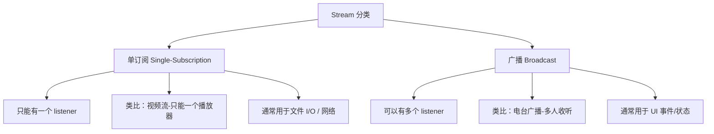

## 一句话概括

Dart 的 Stream 是一个可订阅的异步事件序列抽象，它提供了从单次事件（Future）到持续数据流（Stream）的编程范式跃迁，通过 StreamController、Transformers、Subscription 等组件构成了一套完整的流式数据处理管道。

## 背景与意义

在很多业务场景中，数据不是一次到位而是分批到达的：WebSocket 推送、文件逐行读取、蓝牙设备数据包、用户连续滚动加载、MQTT 消息订阅……这些场景如果用 Future 加回调的方式来处理，代码很快就会陷入嵌套回调地狱和混乱的状态管理。

Stream 正是为解决这类场景而生的。在 Flutter 生态中，Stream 不仅仅是异步编程的基础设施，更是状态管理的底层通道——Bloc 模式的核心就是 Stream，Firebase 实时数据库的每一次数据变更也通过 Stream 推送。可以说，无论你是做 Flutter 业务开发还是写 Dart 底层工具库，Stream 都是无法绕过的核心概念。

## 概念与定义

### Stream<T>

一个异步事件的序列。与 `Future<T>` 的"一次性"不同，`Stream<T>` 可以在生命周期内发射零个、一个或多个事件。

### StreamController

手动创建和管理 Stream 的总控节点。你可以通过它添加事件、监听状态、控制背压。

### StreamSubscription

调用 `stream.listen()` 时返回的对象。用于控制监听的生命周期——暂停、恢复、取消。

### StreamTransformer

对 Stream 进行数据变换的组件，可以复用变换逻辑。

### 同步 vs 异步 Stream

- **异步 Stream**：事件在监听后异步到达（默认行为）
- **同步 Stream**：事件在当前微任务中同步触发，用于特定优化场景

## 最小示例

```dart
import 'dart:async';

void main() {
  // 创建一个 Stream
  final stream = Stream<int>.periodic(
    Duration(seconds: 1),
    (count) => count,
  ).take(5); // 只取5个事件

  // 订阅 Stream
  final subscription = stream.listen(
    (data) => print('收到: $data'),
    onError: (error) => print('错误: $error'),
    onDone: () => print('流已关闭'),
    cancelOnError: false,
  );

  // 5秒后取消订阅
  Future.delayed(Duration(seconds: 3), () {
    subscription.cancel();
    print('已取消订阅');
  });
}
```

输出：

```
收到: 0
收到: 1
收到: 2
已取消订阅  ← 注意：流在取消后不再接收后续事件
```

## 核心知识点拆解

### 1. Stream 的种类



```dart
// 单订阅 Stream
final singleStream = Stream<int>.fromIterable([1, 2, 3]);
singleStream.listen(print);                     // OK
singleStream.listen(print);                     // ❌ 抛出 StateError

// 广播 Stream
final controller = StreamController<int>.broadcast();
controller.stream.listen((v) => print('A: $v'));
controller.stream.listen((v) => print('B: $v'));
controller.add(42);                             // 两个监听器都会收到
controller.close();
```

### 2. StreamController 的完整生命周期

```dart
class StreamControllerWrapper {
  late final StreamController<String> _controller;

  StreamControllerWrapper() {
    _controller = StreamController<String>(
      onListen: () => print('第一个监听器加入'),
      onPause: () => print('监听器暂停'),
      onResume: () => print('监听器恢复'),
      onCancel: () => print('监听器取消'),
    );
  }

  Stream<String> get stream => _controller.stream;

  void addData(String data) => _controller.add(data);
  void addError(Object error) => _controller.addError(error);

  void close() {
    _controller.close();
    print('StreamController 已关闭');
  }
}
```

### 3. 核心操作符

Stream 的转换能力是其强大之处：

```dart
Stream.fromIterable([1, 2, 3, 4, 5])
  .where((n) => n.isEven)               // 过滤：仅偶数 → [2, 4]
  .map((n) => '数字 $n')                 // 映射：转换类型
  .take(1)                               // 只取第一个
  .skip(1)                               // 跳过前 N 个
  .distinct()                            // 去重（连续重复）
  .expand((s) => s.split(''))            // 扁平化
  .asyncMap((s) => Future.value(s))      // 异步映射
  .transform(StreamTransformer(...))      // 自定义变换
```

### 4. async* 生成器与 await for

Dart 提供了语法糖来消费和生成 Stream：

```dart
// 使用 async* 生成 Stream
Stream<int> countDown(int from) async* {
  for (int i = from; i >= 0; i--) {
    yield i;                              // 每次 yield 发射一个事件
    await Future.delayed(Duration(seconds: 1));
  }
}

// 使用 await for 消费 Stream
Future<void> processNumbers() async {
  await for (final number in countDown(5)) {
    print('倒计时: $number');
    if (number == 0) print('🚀 发射！');
  }
}
```

`await for` 本质上是一个无限循环（直到 Stream done 或 break），每次 `await` 挂起直到下一个事件到达。

### 5. Stream 的背压处理

当 Stream 生产数据的速度快于消费速度时，需要进行背压处理：

```dart
// 方式 1：使用 buffer 暂存
stream.buffer(Duration(milliseconds: 100)).listen((batch) {
  print('批量处理: $batch');
});

// 方式 2：使用 concurrency 控制
stream.transform(
  StreamTransformer.fromHandlers(
    handleData: (data, sink) async {
      await processSlow(data);  // 处理完当前数据才继续
      sink.add(data);
    },
  ),
);
```

## 实战案例

### 案例 1：文件实时监听

```dart
import 'dart:io';

class LogTailer {
  final String filePath;
  RandomAccessFile? _file;
  int _position = 0;

  LogTailer({required this.filePath});

  Stream<String> tail() async* {
    _file = await File(filePath).open(mode: FileMode.read);

    while (true) {
      await Future.delayed(Duration(milliseconds: 500));
      await _file!.setPosition(_position);
      final bytes = await _file!.read();
      
      if (bytes.isNotEmpty) {
        _position += bytes.length;
        yield utf8.decode(bytes);
      }
    }
  }

  void dispose() {
    _file?.closeSync();
  }
}

// 使用
void main() async {
  final tailer = LogTailer(filePath: '/tmp/app.log');
  await for (final line in tailer.tail()) {
    if (line.contains('ERROR')) {
      print('⚠️ 发现错误: $line');
    }
  }
}
```

### 案例 2：输入去抖（Debounce）

```dart
Stream<String> debounceSearch(Stream<String> input, Duration delay) async* {
  Timer? timer;
  String? latest;

  await for (final query in input) {
    latest = query;
    timer?.cancel();
    timer = Timer(delay, () {
      // 这个空的 timer 回调不会 yield，用于触发取消
    });
    
    // 等待 delay 时间，期间没有新输入则 yield
    await Future.delayed(delay);
    
    if (query == latest) {
      yield query;
    }
  }
}

// Flutter 中使用
// TextField → onChanged → StreamController → debounce → 网络请求
final controller = StreamController<String>();
final results = debounceSearch(controller.stream, Duration(milliseconds: 300));

results.listen((query) {
  api.search(query);  // 只有停顿 300ms 后才搜索
});
```

### 案例 3：WebSocket 实时通信

```dart
class RealtimeClient {
  WebSocketChannel? _channel;
  final StreamController<ServerEvent> _eventController =
      StreamController<ServerEvent>.broadcast();

  Stream<ServerEvent> get events => _eventController.stream;

  Future<void> connect(String url) async {
    _channel = WebSocketChannel.connect(Uri.parse(url));
    
    _channel!.stream.listen(
      (message) {
        final event = ServerEvent.fromJson(jsonDecode(message));
        _eventController.add(event);
      },
      onError: (error) => _eventController.addError(error),
      onDone: () async {
        print('连接断开，3秒后重连...');
        await Future.delayed(Duration(seconds: 3));
        await connect(url);
      },
    );
  }

  void send(ClientEvent event) {
    _channel?.sink.add(jsonEncode(event.toJson()));
  }

  void dispose() {
    _channel?.sink.close();
    _eventController.close();
  }
}

enum ServerEventType { message, typing, presence }

class ServerEvent {
  final ServerEventType type;
  final Map<String, dynamic> payload;

  ServerEvent({required this.type, required this.payload});

  factory ServerEvent.fromJson(Map<String, dynamic> json) {
    return ServerEvent(
      type: ServerEventType.values.byName(json['type']),
      payload: json['payload'],
    );
  }
}
```

### 案例 4：Bloc 模式中的 Stream 协程

Flutter Bloc 通过 Stream 实现状态管理：

```dart
// Bloc 内部本质上是将 Event Stream → State Stream 的映射
class CounterBloc {
  final _eventController = StreamController<CounterEvent>();
  final _stateController = StreamController<int>.broadcast();

  Stream<int> get state => _stateController.stream;
  Sink<CounterEvent> get eventSink => _eventController.sink;

  CounterBloc() : _state = 0 {
    _eventController.stream.listen(_mapEventToState);
  }

  int _state;

  void _mapEventToState(CounterEvent event) {
    switch (event) {
      case CounterEvent.increment:
        _state++;
      case CounterEvent.decrement:
        _state--;
    }
    _stateController.add(_state);
  }

  void dispose() {
    _eventController.close();
    _stateController.close();
  }
}

enum CounterEvent { increment, decrement }
```

## 底层原理

### Stream 的事件循环调度

Stream 通过 `Zone` 和 `_StreamImpl` 内部类实现调度。当调用 `add(data)` 时：

1. 检测当前是否有 pending 的事件
2. 如果 Stream 是同步的（`sync: true`），在当前调用栈中立即执行 listener
3. 如果 Stream 是异步的，将事件放入微任务队列

```dart
// 同步 Stream 的行为
final syncController = StreamController<String>.broadcast(sync: true);
syncController.stream.listen(print);
syncController.add('立即');  // 在当前栈帧中同步执行 print
print('之后');               // 结论：先打印'立即'，再打印'之后'

// 异步 Stream 的行为
final asyncController = StreamController<String>.broadcast(sync: false);
asyncController.stream.listen(print);
asyncController.add('异步'); // 压入微任务队列
print('快');                 // 结论：先打印'快'，再打印'异步'
```

### StreamIterator 与 await for 的实现

`await for` 在编译层面被展开为：

```dart
// await for (final value in stream) { ... }
// 等价于：
Future<void> _expanded(Stream<int> stream) async {
  final iterator = StreamIterator(stream);
  while (await iterator.moveNext()) {
    final value = iterator.current;
    // 循环体
  }
}
```

`StreamIterator.moveNext()` 内部会在当前事件到达前挂起，通过 Completer 实现跨事件交付的桥梁：

```dart
class StreamIterator<T> {
  final Stream<T> _stream;
  StreamSubscription<T>? _subscription;
  Completer<bool>? _completer;
  T? _current;

  Future<bool> moveNext() async {
    _completer = Completer<bool>();
    _subscription ??= _stream.listen(
      (data) {
        _current = data;
        _completer?.complete(true);
        _subscription?.pause();  // 每次收到事件后暂停，等待调用 moveNext
      },
      onDone: () => _completer?.complete(false),
    );
    _subscription?.resume();
    return _completer!.future;
  }

  T get current => _current!;
}
```

### 与 RxDart 的关系

RxDart 是 Dart 官方的响应式扩展库，在原生 Stream 基础上增加了：

- `BehaviorSubject`：带初始值、订阅后立即获得最新值
- `ReplaySubject`：缓存历史事件
- `combineLatest`、`zip`、`merge` 等组合操作符
- `debounce`、`throttle`、`buffer` 等高级操作符

## 高频面试题解析

### Q1：Stream 和 Future 的根本区别？

| 维度 | Future | Stream |
|------|--------|--------|
| 事件数量 | 0 或 1 个 | 0 到 N 个 |
| 订阅方式 | then/catchError | listen/await for |
| 多次订阅 | 始终可用 | 单订阅 Stream 仅有一次 |
| 取消 | 无法取消 | cancel() 可随时取消 |
| 变换 | 一个值变换 | 管道式变换链 |

### Q2：如何将一个 Stream 转换为 Future？

```dart
Stream<int> numberStream = Stream.fromIterable([1, 2, 3]);

// 转单一 Future（取第一个或最后一个）
Future<int> first = numberStream.first;       // 1
Future<int> last = numberStream.last;         // 3
Future<int> single = numberStream.single;     // 抛出异常（多于1个）

// 收集为 List
Future<List<int>> asList = numberStream.toList();
```

### Q3：Stream 的 pause/resume 机制有什么注意事项？

```dart
final controller = StreamController<int>();
final sub = controller.stream.listen((v) {
  print('收到: $v');
});

controller.add(1);  // 收到
sub.pause();
controller.add(2);  // 暂存但不传递
controller.add(3);  // 暂存但不传递
sub.resume();       // 收到 2 和 3（合并为一次回调）

// ⚠️ pause 后数据会积压在缓冲区，长时间暂停可能导致内存问题
```

### Q4：如何处理 Stream 的背压（Backpressure）？

推荐策略：
1. **Buffer 控制**：`stream.buffer(Duration)` 或 `stream.throttle`
2. **转换器减速**：实现 `StreamTransformer` 在数据流中插入暂停点
3. **监听回调中异步**：`stream.asyncMap(handleAsync)` 确保每次处理完成后才继续
4. **背压信号**：消费端通过 Stream 通道向生产端发送控制信号

## 总结与扩展

### 核心要点

1. Stream 是 Future 在时间维度上的自然延伸——从单一事件到事件序列
2. Dart 原生 Stream 的设计足够完备，大多数场景无需额外库
3. `async*` + `await for` 语法糖让流式代码与同步代码风格一致
4. StreamController 的细粒度控制（onListen/onPause/onCancel）让自定义数据源变得简单
5. Broadcast Stream 是多订阅场景的必备工具

### 扩展阅读

- Dart 官方教程: [Streams](https://dart.dev/tutorials/language/streams)
- RxDart: [ReactiveX for Dart](https://pub.dev/packages/rxdart)
- Flutter Bloc: [Bloc State Management](https://bloclibrary.dev)
- 经典文章: [The Boring Flutter Development Team - Streams](https://dart.dev/articles/libraries/streams)

### 下一步

深入理解 Stream 后，下一篇文章将探讨 Dart 中真正实现并行计算的工具——Isolate 隔离机制，以及它与 Stream 如何配合完成高性能计算任务。
