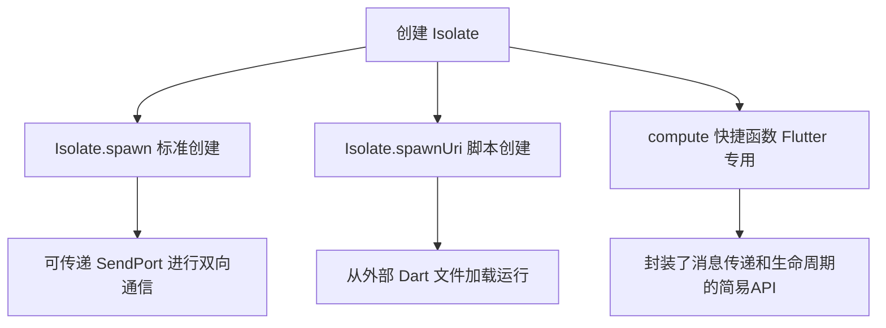
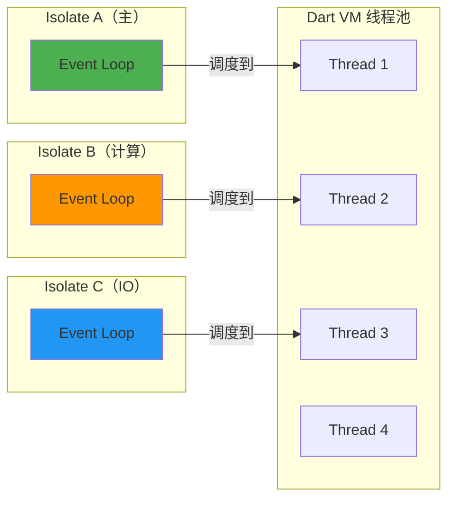

## 一句话概括

Dart 的 Isolate 是基于 Actor 模型的并发单元，每个 Isolate 拥有独立的堆内存和事件循环，通过消息传递（SendPort/ReceivePort）而非共享内存实现通信，从根本上消除了数据竞争和锁问题。

## 背景与意义

在 Flutter 应用中，任何耗时超过 16ms 的同步操作都会导致 UI 丢帧。问题是：一个典型的跨端应用会面临什么样的计算压力？

- 从相册中加载 50 张 4K 图片并生成缩略图
- 对大型 JSON 数据进行解析和反序列化（比如 50MB 的交易记录）
- 实时视频帧的滤镜计算
- 加密/解密大文件
- 机器学习模型的推理计算

这些场景如果用主 Isolate（UI Isolate）直接处理，即使放在异步回调中，也仅仅是"推迟执行"而非"并行执行"——事件循环仍然会被计算任务阻塞。

Dart 给出的答案是：**新开一个 Isolate**。每个 Isolate 有自己独立的事件循环和堆，可以在另一个 CPU 核心上真正并行运行，而且由于内存隔离（不像线程共享内存），开发者永远不用担心死锁或数据竞争。这是 Dart 在并发安全性和开发效率之间做出的独特取舍。

## 概念与定义

### Isolate 是什么？

Isolate 在 Dart 中是一个**独立的、自带事件循环的并行执行单元**。每个 Isolate 拥有：

- **独立的堆内存**：没有任何对象可以在两个 Isolate 间共享
- **独立的事件循环**：有自己的微任务队列和事件队列
- **一个或多个线程**：底层的 Dart VM 线程池可能复用 OS 线程

### Actor 模型

Dart 的 Isolate 遵循 Actor 模型：每个 Actor 有自己的私有状态，Actor 之间只通过异步消息通信，不共享任何状态。这与 Erlang 的进程模型、Akka 的 Actor 异曲同工。

### SendPort 与 ReceivePort

Isolate 间通信的唯一通道：

- **ReceivePort**：接收消息的端口，监听消息到达
- **SendPort**：发送消息的端口，可以传递给其他 Isolate

### Isolate.spawn

创建新 Isolate 的 API，要求传入一个顶级函数或静态方法（不能是闭包，因为闭包可能捕获了主 Isolate 的堆引用）。

## 最小示例

```dart
import 'dart:isolate';
import 'dart:math';

// 计算密集型任务：判断素数
bool isPrime(int number) {
  if (number < 2) return false;
  for (int i = 2; i <= sqrt(number).toInt(); i++) {
    if (number % i == 0) return false;
  }
  return true;
}

// 入口函数：运行在子 Isolate 中
void countPrimesInRange(SendPort sendPort) {
  int count = 0;
  for (int i = 1; i <= 10_000_000; i++) {
    if (isPrime(i)) count++;
  }
  sendPort.send(count);
}

void main() async {
  print('主 Isolate 开始: ${DateTime.now()}');

  final receivePort = ReceivePort();
  await Isolate.spawn(countPrimesInRange, receivePort.sendPort);

  final result = await receivePort.first;
  print('1到1000万之间的素数个数: $result');

  receivePort.close();
  print('主 Isolate 结束: ${DateTime.now()}');
}
```

## 核心知识点拆解

### 1. 创建 Isolate 的三种方式



```dart
// 方式 1：标准 spawn（推荐）
final receivePort = ReceivePort();
await Isolate.spawn(myFunction, receivePort.sendPort);

// 方式 2：从 URL 加载（用于插件或动态加载）
final isolate = await Isolate.spawnUri(
  Uri.parse('package:myapp/workers/processor.dart'),
  ['arg1', 'arg2'],
  receivePort.sendPort,
);

// 方式 3：Flutter compute（最便捷，一次调用）
import 'package:flutter/foundation.dart';

int heavyCompute(int value) {
  var sum = 0;
  for (int i = 0; i < value; i++) sum += i;
  return sum;
}

final result = await compute(heavyCompute, 1000000);
```

### 2. 双向通信：发送多个消息

```dart
import 'dart:isolate';

void imageProcessor(SendPort mainSend) {
  // 创建自己的 ReceivePort 用于接收主 Isolate 的消息
  final workerReceive = ReceivePort();
  mainSend.send(workerReceive.sendPort);  // 先把自己的 SendPort 发回去

  workerReceive.listen((message) async {
    if (message is String && message == 'close') {
      workerReceive.close();
      return;
    }
    
    // 模拟图像处理
    final processed = '处理完成: [${message.hashCode}]';
    mainSend.send(processed);
  });
}

Future<void> main() async {
  final receivePort = ReceivePort();
  await Isolate.spawn(imageProcessor, receivePort.sendPort);

  // 先获取工作 Isolate 的 SendPort
  final workerSendPort = await receivePort.first as SendPort;

  // 发送多个任务
  for (int i = 0; i < 5; i++) {
    workerSendPort.send('图片_$i.jpg');
  }

  // 收集结果
  await for (final result in receivePort.take(5)) {
    print(result);
  }

  // 关闭工作 Isolate
  workerSendPort.send('close');
}
```

### 3. 可传递的消息类型

不是所有对象都能跨 Isolate 传输。消息必须是**可序列化**的，具体包括：

- 原始类型：`int`, `double`, `bool`, `String`, `null`
- `SendPort`, `ReceivePort`
- `List` 或 `Map`（元素也必须是可传递的）
- `TransferableTypedData`
- 自定义类需要在 `@pragma('vm:entry-point')` 标记下实现接口

```dart
// ✅ 可传递
sendPort.send(42);
sendPort.send(['a', 'b', 'c']);
sendPort.send({'key': 'value'});
sendPort.send(mySendPort);  // SendPort 本身也可传递

// ❌ 不可传递
sendPort.send(MyClass());           // 非原始类型会抛出异常
sendPort.send(Future.value(42));    // Future 对象不可传递
sendPort.send(() => 42);            // 闭包不可传递
```

### 4. TransferableTypedData：大数据零拷贝传递

对于大型数据（如图片或文件内容），标准消息传递会复制数据。`TransferableTypedData` 允许**所有权转移**避免复制：

```dart
import 'dart:isolate';
import 'dart:typed_data';

void dataReceiver(SendPort sendPort) {
  final receivePort = ReceivePort();
  sendPort.send(receivePort.sendPort);

  receivePort.listen((message) {
    if (message is TransferableTypedData) {
      final bytes = message.materialize().toUint8List();
      print('收到 ${bytes.length} 字节，无需复制');
    }
  });
}

void main() async {
  final receivePort = ReceivePort();
  await Isolate.spawn(dataReceiver, receivePort.sendPort);
  final workerSendPort = await receivePort.first as SendPort;

  // 原始数据
  final original = Uint8List.fromList(List.generate(1024 * 1024, (i) => i & 0xFF));
  final transferable = TransferableTypedData.fromList([original]);

  workerSendPort.send(transferable);
  // 注意：发送后 original 在当前 Isolate 中变为不可用！
  // 这是"移动语义"，不是"复制"
}
```

## 实战案例

### 案例 1：图片缩略图批处理

```dart
import 'dart:isolate';
import 'dart:io';
import 'dart:typed_data';

class ImageResizeTask {
  final String inputPath;
  final String outputPath;
  final int targetWidth;

  ImageResizeTask({
    required this.inputPath,
    required this.outputPath,
    required this.targetWidth,
  });
}

class ImageResizeResult {
  final String outputPath;
  final bool success;
  final String? error;

  ImageResizeResult({
    required this.outputPath,
    required this.success,
    this.error,
  });
}

void imageWorker(SendPort mainSend) {
  final workerReceive = ReceivePort();
  mainSend.send(workerReceive.sendPort);

  workerReceive.listen((message) async {
    if (message is String && message == 'close') {
      workerReceive.close();
      return;
    }

    if (message is ImageResizeTask) {
      try {
        final file = File(message.inputPath);
        final bytes = await file.readAsBytes();

        // 这里只是模拟图像处理逻辑
        // 实际项目中会调用 image 库或原生 API
        final result = _simulateResize(bytes, message.targetWidth);
        await File(message.outputPath).writeAsBytes(result);

        mainSend.send(ImageResizeResult(
          outputPath: message.outputPath,
          success: true,
        ));
      } catch (e) {
        mainSend.send(ImageResizeResult(
          outputPath: message.outputPath,
          success: false,
          error: e.toString(),
        ));
      }
    }
  });
}

Uint8List _simulateResize(Uint8List input, int targetWidth) {
  // 在实际项目中，这里应该使用图像处理库
  return input; // 占位
}

Future<void> batchResize({
  required List<String> inputPaths,
  required String outputDir,
  required int targetWidth,
}) async {
  final receivePort = ReceivePort();
  final isolateCount = Platform.numberOfProcessors;
  final isolates = <(Isolate, SendPort)>[];

  // 创建工作 Isolate 池
  for (int i = 0; i < isolateCount; i++) {
    final isolateReceivePort = ReceivePort();
    final isolate = await Isolate.spawn(imageWorker, isolateReceivePort.sendPort);
    final sendPort = await isolateReceivePort.first as SendPort;
    isolates.add((isolate, sendPort));
  }

  // 分发任务（round-robin）
  final results = <ImageResizeResult>[];
  int nextIsolate = 0;

  for (final inputPath in inputPaths) {
    final task = ImageResizeTask(
      inputPath: inputPath,
      outputPath: '$outputDir/thumb_${inputPath.split('/').last}',
      targetWidth: targetWidth,
    );
    isolates[nextIsolate].$2.send(task);
    nextIsolate = (nextIsolate + 1) % isolates.length;
  }

  // 收集结果
  var completed = 0;
  receivePort.listen((result) {
    results.add(result as ImageResizeResult);
    completed++;
    if (completed == inputPaths.length) receivePort.close();
  });

  await receivePort.first; // 等待所有任务完成

  // 关闭所有 Isolate
  for (final entry in isolates) {
    entry.$1.kill();
  }

  print('批量处理完成: ${results.where((r) => r.success).length}/${results.length}');
}
```

### 案例 2：Flutter compute 实现 JSON 解析

```dart
import 'dart:convert';
import 'dart:isolate';
import 'package:flutter/foundation.dart';

class Transaction {
  final String id;
  final double amount;
  final String category;
  final DateTime date;

  Transaction({
    required this.id,
    required this.amount,
    required this.category,
    required this.date,
  });

  factory Transaction.fromJson(Map<String, dynamic> json) {
    return Transaction(
      id: json['id'] as String,
      amount: (json['amount'] as num).toDouble(),
      category: json['category'] as String,
      date: DateTime.parse(json['date'] as String),
    );
  }
}

// ⚠️ 这个函数必须是顶级函数或静态方法
List<Transaction> parseTransactions(String jsonString) {
  final List<dynamic> data = jsonDecode(jsonString);
  return data.map((e) => Transaction.fromJson(e as Map<String, dynamic>)).toList();
}

Future<List<Transaction>> loadTransactions(String jsonUrl) async {
  // 1. 主 Isolate 中下载数据
  final response = await http.get(Uri.parse(jsonUrl));
  final jsonString = response.body;

  // 2. 在后台 Isolate 中解析（避免阻塞 UI）
  final transactions = await compute(parseTransactions, jsonString);

  return transactions;
}
```

### 案例 3：WebSocket 数据流与 Isolate 协作

```dart
import 'dart:isolate';
import 'dart:convert';

// 在后台 Isolate 中维护 WebSocket 连接和数据处理
void backgroundSocketWorker(SendPort mainSend) {
  final workerReceive = ReceivePort();
  mainSend.send(workerReceive.sendPort);
  
  // 数据处理管线
  int sequenceNumber = 0;
  Map<String, int> counter = {};

  workerReceive.listen((message) async {
    switch (message) {
      case 'connect':
        _connectAndListen(mainSend);
      case 'disconnect':
        // 清理
        break;
      case 'status':
        mainSend.send({
          'type': 'status',
          'processed': sequenceNumber,
          'categories': Map.of(counter),
        });
    }
  });
}

void _connectAndListen(SendPort mainSend) async {
  // 模拟连接
  await Future.delayed(Duration(seconds: 1));
  mainSend.send({'type': 'connected', 'timestamp': DateTime.now().toIso8601String()});
}
```

## 底层原理

### Dart VM 中的 Isolate 实现

Dart VM 的 Isolate 不是直接的 OS 线程映射。VM 维护一个**线程池**（通常是 CPU 核心数），Isolate 被调度到这些线程上执行。



### Isolate 间通信的底层机制

消息传递的过程不是简单的"跨线程复制"：

1. **序列化（SERIALIZE）**：发送方将消息对象序列化为字节流
2. **跨堆传输**：通过共享的堆外缓冲区将字节流传递给目标 Isolate 的堆
3. **反序列化（DESERIALIZE）**：接收方在本地堆上重建对象

对于 `TransferableTypedData`，步骤 1 和 3 是零拷贝的——只是把内存页的所有权从一个 Isolate 转移到另一个。

### 与 OS 线程/Lock 模型的对比

| 特性 | Dart Isolate | OS 线程（Java/C++） |
|------|-------------|-------------------|
| 内存模型 | 独立堆，无共享 | 共享堆，可读写 |
| 同步机制 | 不需要锁 | mutex/semaphore |
| 死锁风险 | 不存在 | 存在 |
| 创建开销 | 较重（独立堆） | 较轻（共享堆） |
| 通信开销 | 消息序列化/复制 | 直接读共享内存 |
| 适用于 | 计算密集型、I/O 密集型 | 两者均可 |

## 高频面试题解析

### Q1：Isolate 和 Future 的并行区别？

**Future 不产生并行**。Future 只是把任务推迟到事件循环的下一轮执行，但仍然在同一个 Isolate 的同一个线程上。

```dart
// 验证 Future 不并行
void main() async {
  final start = DateTime.now();

  await Future.delayed(Duration(seconds: 3));
  await Future.delayed(Duration(seconds: 3));

  print('耗时: ${DateTime.now().difference(start)}');  // 约 6 秒
}
```

而 Isolate 是真正的并行（需要多核 CPU）：

```dart
Future<void> isolateParallel() async {
  final rp1 = ReceivePort();
  final rp2 = ReceivePort();

  await Isolate.spawn((SendPort sp) {
    sleep(Duration(seconds: 3));  // 真实阻塞，不依赖事件循环
    sp.send('done');
  }, rp1.sendPort);

  await Isolate.spawn((SendPort sp) {
    sleep(Duration(seconds: 3));
    sp.send('done');
  }, rp2.sendPort);

  final results = await Future.wait([rp1.first, rp2.first]);
  print('耗时: ~3 秒（如果 CPU 核心数 ≥ 2）');
}
```

### Q2：Isolate 和 Web Worker 的关系？

Dart 的 Isolate 受 Web Worker 启发，但设计更严格：
- Worker 可以访问 SharedArrayBuffer 实现部分共享
- Isolate 严格禁止任何形式的共享（除了 TransferableTypedData）
- Worker 通过 postMessage 通信（消息可包含引用）
- Isolate 通过 SendPort 通信（消息必须可序列化）

### Q3：为什么在 Flutter 中不推荐创建大量 Isolate？

创建 Isolate 的开销较大：
1. 每个 Isolate 需要分配独立的堆（数 MB）
2. 启动时间约 5-15ms
3. 消息序列化/反序列化消耗 CPU
4. 线程切换有上下文切换开销

**推荐做法**：创建固定数量的 Isolate 池（通常等于 CPU 核心数），复用它们处理任务。

### Q4：如何在 Isolate 中捕获异常？

```dart
ReceivePort receivePort = ReceivePort();
await Isolate.spawn((SendPort sp) {
  try {
    final result = dangerousOperation();
    sp.send({'ok': result});
  } catch (e, stack) {
    sp.send({'error': e.toString(), 'stack': stack.toString()});
  }
}, receivePort.sendPort);

final message = await receivePort.first;
if (message is Map && message.containsKey('error')) {
  print('Isolate 中发生错误: ${message['error']}');
}
```

## 总结与扩展

### 核心要点

1. Isolate 是 Dart 中**唯一**实现真正并行的机制
2. 基于 Actor 模型的隔离内存设计消除了数据竞争
3. `compute()` 是 Flutter 中创建简单 Isolate 任务最便捷的 API
4. 复杂场景需要手动管理 Isolate 池、消息协议和生命周期
5. 定位到真正的计算瓶颈才引入 Isolate——不要过早优化

### 扩展阅读

- Dart 官方 Isolate 教程：[dart.dev/guides/language/concurrency](https://dart.dev/guides/language/concurrency)
- Flutter compute 文档：[api.flutter.dev/flutter/foundation/compute](https://api.flutter.dev/flutter/foundation/compute.html)
- VM Isolate 源码：[sdk/runtime/vm/isolate.cc](https://github.com/dart-lang/sdk/blob/main/runtime/vm/isolate.cc)
- 最佳实践：[Effective Dart: Concurrency](https://dart.dev/guides/language/effective-dart/concurrency)

### 下一步

从 Isolate 回到 Flutter 前端的世界：下一篇文章将以**口述**形式梳理整个 Dart 异步体系——how async/await、Stream、Isolate 三者如何协同构成 Dart 的完整异步故事。
