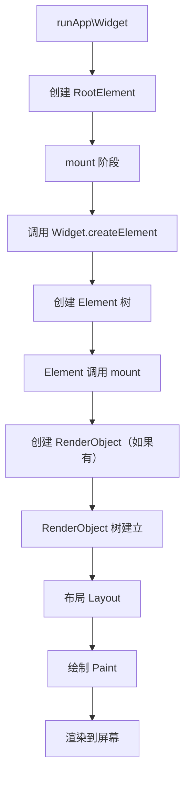
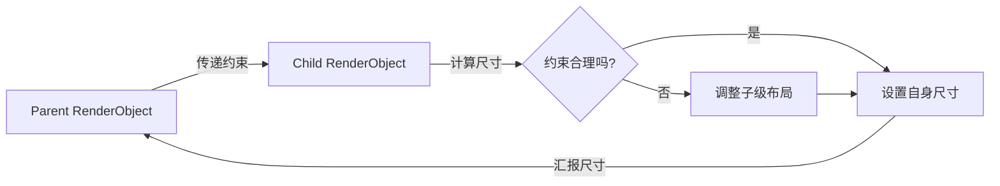

## 一句话概括

Flutter 的渲染体系由 Widget、Element、RenderObject 三棵树构成，Widget 描述配置、Element 管理生命周期、RenderObject 执行布局与绘制，三者通过"配置→实例化→渲染"的分层设计实现了高效声明式 UI 更新。

## 背景与意义

很多 Flutter 新手在写了一段时间 `Container(decoration: ..., child: Text(...))` 之后，会以为 Flutter 的 UI 就是"嵌套 Widget"。确实，这是日常使用方式，但如果你停留在这一层，你就永远不会理解为什么有些 Widget 在 build 中重新创建却不会导致性能问题，为什么 `const SizedBox(width: 100)` 是高效的，为什么有些 Widget 的 key 能影响状态保持。

Flutter 的"三棵树"理论是理解所有这些问题的钥匙。

Flutter 之所以选择三棵树而非传统的"UI 组件树"，核心原因在于其自绘引擎（Skia/Impeller）需要自建一套布局、绘制机制，而无法依赖操作系统原生的组件系统。三棵树的设计让 Flutter 可以：

1. **声明式描述 UI**（Widget 树）与**运行时状态**（Element 树）分离
2. 在布局/绘制层实现**高性能的自绘引擎**（RenderObject 树）
3. 通过 diff Widget 树来增量更新，而不是重建 UI 全部

这是 Flutter 能够在 iOS、Android、Web、Desktop 上获得一致且高性能渲染体验的基石。

## 概念与定义

### Widget —— "图纸"

Widget 是**不可变的 UI 描述**。它只是一个配置对象，包含了它所描述的 UI 片段应该是什么样——宽度、高度、颜色、子组件、回调等。

```dart
// Widget 是不可变的
const Text('Hello', style: TextStyle(fontSize: 16));
```

Widget 在概念上分为两类：

- **StatelessWidget**：纯配置，不包含可变状态
- **StatefulWidget**：创建 State 对象来管理可变状态

### Element —— "施工队"

Element 是 Widget 的**实例化对象**。它负责管理 Widget 在运行时树中的位置、处理父子关系、维护 State 的生命周期。

每个 Element 分为两类：

- **ComponentElement**：聚合其他 Element（如 StatelessElement、StatefulElement）
- **RenderObjectElement**：持有 RenderObject，参与布局/绘制（如 PaddingElement、ColumnElement）

关键点：Element 在 Widget 配置变化时**复用**而不是重建。这是 Flutter 性能优化的核心。

### RenderObject —— "建造结果"

RenderObject 是真正负责**布局、绘制、命中测试**的对象。它基于固定的约束进行尺寸计算，并将自己绘制到屏幕像素上。

## 最小示例

```dart
import 'package:flutter/material.dart';

// 1. 定义 Widget——这是一张"图纸"
class HelloWidget extends StatelessWidget {
  const HelloWidget({super.key});

  @override
  Widget build(BuildContext context) {
    return Container(
      color: Colors.blue,
      width: 100,
      height: 100,
      child: const Center(
        child: Text('Hello'),
      ),
    );
  }
}

// 2. Flutter 框架内部会做这件事：
//    Widget → Element（创建 Element 实例）
//    Element → RenderObject（对于需要渲染的 Widget）

void main() {
  runApp(const MaterialApp(home: Scaffold(body: HelloWidget())));
}
```

当你调用 `runApp` 时，Flutter 的执行流程是：



## 核心知识点拆解

### 1. Widget 的不可变性设计

```dart
// 每次 build 都创建一个新的 Widget 实例
Widget build(BuildContext context) {
  return Container(  // 每次 build 都是新对象
    color: _isActive ? Colors.blue : Colors.grey,
    child: Text(_isActive ? 'ON' : 'OFF'),
  );
}
```

大多数开发者第一次看到这个会疑惑：**每次 build 都创建新 Widget，Flutter 不会卡死吗？**

答案在于：Widget 只是配置的"纸张"，创建 60fps 的 Widget 对象非常廉价（没有内存泄漏，因为是短生命周期对象）。真正昂贵的是创建 RenderObject 和处理布局/绘制。Element 树在这里起到了"缓冲"作用——

- 如果新的 Widget 与旧的 Widget 的 `runtimeType` 和 `key` 相同，Flutter 会**复用 Element**，只更新配置
- 配置更新通常意味着调用 RenderObject 的一些设置方法，这个过程比重建 RenderObject 快得多

### 2. Element 的生命周期

```dart
class MyElement extends StatelessElement {
  MyElement(super.widget);

  @override
  void mount(Element? parent, Object? newSlot) {
    // ① 挂在树上
    super.mount(parent, newSlot);
    debugPrint('Element 挂载');
  }

  @override
  void update(covariant StatelessWidget newWidget) {
    // ② 配置更新
    super.update(newWidget);
    debugPrint('Element 更新');
  }

  @override
  void unmount() {
    // ③ 从树上移除
    super.unmount();
    debugPrint('Element 卸载');
  }
}
```

一个 Element 的生命周期的准确序列：

1. `mount()` — 插入到 Element 树中，创建子 Element 和 RenderObject
2. `update(covariant Widget)` — Widget 配置更新时调用
3. `deactivate()` — 从树中移除（但可能被 ReorderableList 等重新插入）
4. `unmount()` — 最终销毁

注意：`State.initState()` 在 `mount` 中调用，`State.dispose()` 在 `unmount` 前调用。

### 3. RenderObject 的布局流程

```dart
abstract class RenderObject {
  // 父级传下来的约束
  Constraints _constraints;
  
  // 布局后的自身尺寸
  Size _size;
  
  void layout(Constraints constraints, {bool parentUsesSize = false}) {
    // 1. 接收约束
    _constraints = constraints;
    
    // 2. 执行布局（由子类实现）
    performLayout();
    
    // 3. 通知父级（如果需要）
    if (parentUsesSize) {
      markNeedsLayout();
    }
  }
  
  void performLayout();  // 子类实现
}
```



**关键规则**：Flutter 的布局是"单通道"的——父级传递约束，子级在约束范围内决定自身尺寸。这意味着子级永远不能改变父级的尺寸约束。

### 4. Widget/Element/RenderObject 的对应关系

并不是每个 Widget 都有配套的 RenderObject。三棵树的对应关系如下：

```dart
// Widget 层
class Padding extends SingleChildRenderObjectWidget {
  final EdgeInsetsGeometry padding;
  // ...
  
  @override
  RenderPadding createRenderObject(BuildContext context) {
    return RenderPadding(padding: padding);
  }
  
  @override
  void updateRenderObject(BuildContext context, RenderPadding renderObject) {
    renderObject.padding = padding;
  }
}

// Element 层（由 SingleChildRenderObjectElement 自动管理）
// RenderObject 层
class RenderPadding extends RenderShiftedBox {
  EdgeInsetsGeometry? _padding;
  
  @override
  void performLayout() {
    // 计算减去 padding 后的约束 → 传递给子级
  }
  
  @override
  void paint(PaintingContext context, Offset offset) {
    // 应用 padding，绘制子级
  }
}
```

**分类表**：

| Widget 类型 | Element 类型 | 有RenderObject? |
|-------------|-------------|-----------------|
| StatelessWidget | StatelessElement | 无（委托子级） |
| StatefulWidget | StatefulElement | 无（委托子级） |
| LeafRenderObjectWidget | LeafRenderObjectElement | 有 |
| SingleChildRenderObjectWidget | SingleChildRenderObjectElement | 有 |
| MultiChildRenderObjectWidget | MultiChildRenderObjectElement | 有 |

## 实战案例

### 案例 1：利用 Key 控制 State 保持

```dart
class ColorfulList extends StatefulWidget {
  @override
  State<ColorfulList> createState() => _ColorfulListState();
}

class _ColorfulListState extends State<ColorfulList> {
  List<Color> _items = [Colors.red, Colors.green, Colors.blue];

  void _shuffle() {
    setState(() => _items.shuffle());
  }

  @override
  Widget build(BuildContext context) {
    return Column(
      children: [
        ElevatedButton(onPressed: _shuffle, child: Text('打乱')),
        ..._items.map((color) => ColorTile(color: color, key: ValueKey(color))),
        // 如果不用 key，打乱后 State 会错位！
        // 用 key 后，Element 根据 key 重新匹配，State 正确跟随
      ],
    );
  }
}

class ColorTile extends StatefulWidget {
  final Color color;
  const ColorTile({required this.color, super.key});

  @override
  State<ColorTile> createState() => _ColorTileState();
}

class _ColorTileState extends State<ColorTile> {
  int _tapCount = 0;

  @override
  Widget build(BuildContext context) {
    return Container(
      color: widget.color.withOpacity(0.3),
      child: TextButton(
        onPressed: () => setState(() => _tapCount++),
        child: Text('点击 $_tapCount 次'),
      ),
    );
  }
}
```

这里 Element 树的复用机制发挥作用：

- **没有 key**：打乱列表后，Flutter 按 index 匹配子 Widget，Widget 的颜色变了，但对应位置的 Element 的 State 没变，导致点击计数出现在错误的颜色上
- **有 key**：Flutter 按 key（颜色）匹配，Element 跟着颜色走了，点击计数正确跟随

### 案例 2：自定义 RenderObject（绘制一个渐变圆）

```dart
import 'package:flutter/rendering.dart';
import 'package:flutter/material.dart';

// 自定义 RenderObject
class RenderGradientCircle extends RenderBox {
  double _radius;

  RenderGradientCircle({double radius = 50}) : _radius = radius;

  double get radius => _radius;
  set radius(double value) {
    if (_radius != value) {
      _radius = value;
      markNeedsLayout();  // 尺寸变了
      markNeedsPaint();   // 颜色变了
    }
  }

  @override
  void performLayout() {
    // 接受约束并决定尺寸
    final size = constraints.constrain(Size(radius * 2, radius * 2));
    _size = size;
  }

  @override
  void paint(PaintingContext context, Offset offset) {
    final canvas = context.canvas;
    final paint = Paint()
      ..shader = RadialGradient(
        colors: [Colors.blue, Colors.purple],
      ).createShader(Rect.fromCircle(center: offset + Offset(radius, radius), radius: radius))
      ..style = PaintingStyle.fill;

    canvas.drawCircle(offset + Offset(radius, radius), radius, paint);
  }

  @override
  bool hitTest(BoxHitTestResult result, {required Offset position}) {
    // 命中测试：点击在圆内才响应
    final center = Offset(size.width / 2, size.height / 2);
    if ((position - center).distance <= radius) {
      result.add(BoxHitTestEntry(this, position));
      return true;
    }
    return false;
  }
}

// Widget 层封装
class GradientCircle extends SingleChildRenderObjectWidget {
  final double radius;

  const GradientCircle({super.key, super.child, required this.radius});

  @override
  RenderGradientCircle createRenderObject(BuildContext context) {
    return RenderGradientCircle(radius: radius);
  }

  @override
  void updateRenderObject(BuildContext context, RenderGradientCircle renderObject) {
    renderObject.radius = radius;
  }
}
```

### 案例 3：三棵树在 setState 中的行为

```dart
class DemoWidget extends StatefulWidget {
  @override
  State<DemoWidget> createState() => _DemoWidgetState();
}

class _DemoWidgetState extends State<DemoWidget> {
  int _counter = 0;

  @override
  Widget build(BuildContext context) {
    return Column(
      children: [
        Text('计数: $_counter'),           // Widget A
        SizedBox(height: 16),               // Widget B（不会被重建）
        ElevatedButton(
          onPressed: () => setState(() => _counter++),
          child: Text('增加'),
        ),
      ],
    );
  }
}
```

setState 调用后的三棵树变化：

1. **Widget 树**：`_counter` 变化后，第二帧的 Widget 树是全新创建的（`build` 返回新实例）
2. **Element 树**：Flutter 对比新旧 Widget 树，**复用了所有 Element**（runtimeType 和 key 没变）
3. **RenderObject 树**：只更新了 Text 的 RenderParagraph，其他 RenderObject 不变

这就是 Flutter 高效的秘密：**重建 Widget 是廉价的**，Element 树和 RenderObject 树只在需要变化时才更新。

## 底层原理

### Flutter 框架的 Update Pipeline

每当 setState 或 rebuild 触发时，Flutter 执行以下流程：

```
setState()
    ↓
markNeedsBuild()         → 在当前帧标记 Element 为 dirty
    ↓ (下一帧 VSync)
buildScope()              → 遍历 dirty Elements 逐一 rebuild
    ↓
Widget -> Element 更新    → 对比新 Widget，复用/创建/更新 child Elements
    ↓
markNeedsLayout()        → RenderObject 标记为需要布局
    ↓
performLayout()          → 遍历整个 RenderObject 树执行布局
    ↓
markNeedsPaint()         → 标记为需要重绘
    ↓
paint()                  → 生成 PaintingContext，绘制到 PictureLayer
    ↓
Compositing              → Layer 树合成，提交到 GPU
    ↓
Rasterize                → GPU 栅格化，渲染到屏幕
```

### 为什么是三棵树不是两棵？

这是一个很好的问题。Android 的 View 系统只有一棵树（View 自身管理 layout + draw + 事件）。为什么 Flutter 需要三棵？

答案在于**声明式和不可变性的权衡**：

- 如果 Flutter 只有 Widget 和 RenderObject 两棵树，那么每次 Widget 变化（重新 build），都需要对应修改 RenderObject。但因为 Widget 是不可变的，每次 build 都创建新对象，所以需要 Element 作为"中间人"来 diff 对比——只有在确实需要变化时才更新 RenderObject

Element 树起到了 **"虚拟差分"** 的作用：

```
Widget tree (每帧重建) ──diff──> Widget tree (下一帧)
            |                          |
            ↓                          ↓
      Element tree (持有状态和引用) ←── 复用/更新
            |
            ↓
      RenderObject tree (真正干活)
```

## 高频面试题解析

### Q1：const Widget 为什么是高效的？

```dart
const SizedBox(width: 100)  // const 编译期创建
```

const Widget 在编译期就被创建为单例。每次 build 返回同一个实例，Element 的 `update` 方法发现 newWidget 与 oldWidget 引用相等（`identical`），直接跳过 diff 和更新过程。这就是 const Widget 高效的根本原因。

### Q2：Widget 的 runtimeType 和 key 在 diff 中起到什么作用？

Flutter 通过以下条件判断是否可以复用 Element：

```dart
if (widget.runtimeType == newWidget.runtimeType && widget.key == newWidget.key) {
  // 复用 Element
  element.update(newWidget);
} else {
  // 创建新 Element，旧 Element 从树中移除
}
```

`runtimeType` 匹配是基础条件——只有同类型的 Widget 才能复用 Element。`key` 是可选条件，用于同类型 Widget 但不同标识的场景（如列表项的顺序变化）。

### Q3：为什么 `RenderBox` 的 parentUsesSize 参数重要？

```dart
child.layout(constraints, parentUsesSize: true);
// 或者
child.layout(constraints, parentUsesSize: false);
```

`parentUsesSize` 告诉 Flutter：当这个子级的尺寸发生变化时，是否需要通知父级重新布局。

- `true`：子级尺寸变化 → 父级标记为需要布局（连锁反应，影响面大）
- `false`：子级尺寸变化 → 不需要通知父级

在 `Stack` 中，子级默认 `parentUsesSize = false`（Stack 不依赖子级尺寸）。在 `Column` 中，被 `Expanded` 包裹的子级 `parentUsesSize = false`（尺寸由约束决定）。正确设置这个参数可以减少不必要的布局计算。

### Q4：如何判断一个 Widget 是否产生了 RenderObject？

看 Widget 的父类继承链。如果直接或间接继承了 `RenderObjectWidget`（包括 `LeafRenderObjectWidget`、`SingleChildRenderObjectWidget`、`MultiChildRenderObjectWidget`），则该 Widget 有对应的 RenderObject。普通的 `StatelessWidget` 和 `StatefulWidget` 只作为"聚合器"，自身的 Element 是 `ComponentElement`，不直接产生 RenderObject。

## 总结与扩展

### 核心要点

1. **Widget 是轻量级配置**——每秒创建数百个都不贵
2. **Element 是 Widget 的生命周期管家**——通过 diff 和复用避免不必要的渲染
3. **RenderObject 是性能核心**——执行真正的布局和绘制，以约束驱动尺寸
4. **三棵树的分层设计**——声明式 + 差分更新 + 自绘引擎的三重解耦

### 扩展阅读

- Flutter 渲染管线官方文档：[docs.flutter.dev/resources/architectural-overview](https://docs.flutter.dev/resources/architectural-overview)
- E 文原版：《Flutter's Rendering Pipeline》——YouTube FlutterConf
- 源码阅读建议：`package:flutter/src/widgets/framework.dart` 中的 Element 实现
- 工具推荐：Flutter DevTools 的"Widget Tree"和"Render Tree"面板

### 下一步

理解了三棵树的宏观结构，下一篇文章将深入探讨三棵树中的"变"——Widget 和 Element 的绑定机制，以及 Element 是怎么管理子节点从创建到销毁的全过程的。
