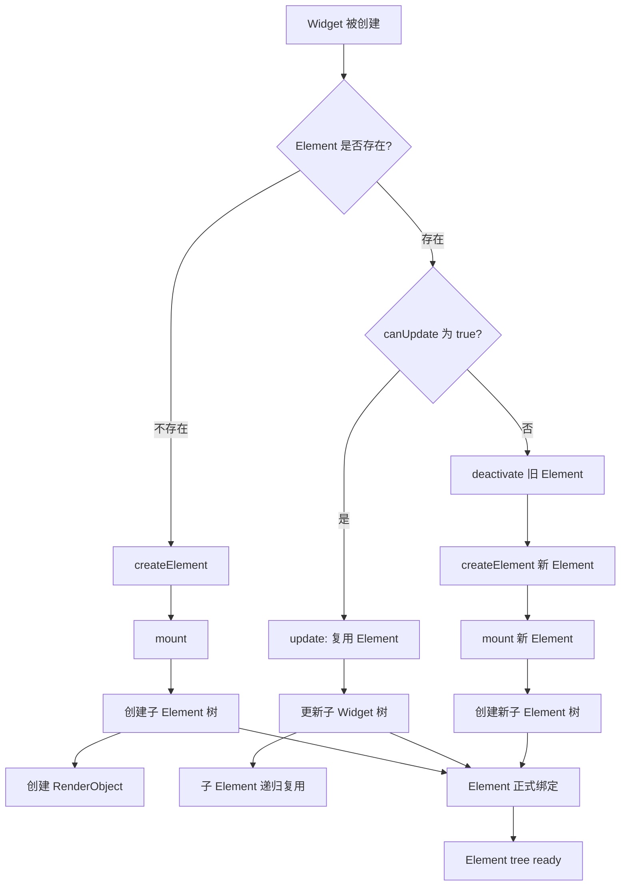

## 一句话概括

Widget 与 Element 的绑定是 Flutter 框架中最精妙的设计之一：Element 根据 Widget 的 runtimeType 和 key 决定是复用还是重建，通过"更新"（update）方法将新的配置参数同步给已有的 Element 实例，从而在保持状态和渲染对象的同时完成 UI 描述变更的高效同步。

## 背景与意义

在上一篇文章中，我们建立了三棵树模型的概念框架。但有一个问题悬而未决：**Widget 树每帧都在重建，Element 树如何确定哪些 Element 需要新建、哪些可以复用、哪些应该移除？**

这个问题的答案直接决定了 Flutter 应用的性能上限。在开发实践中，常见的性能瓶颈往往都与 Widget-Element 绑定机制相关：

- 为什么一个列表项从 100 个变成 101 个时，前 100 个 Element 会被复用而不是重建？
- 为什么在 Column 中交换两个子 Widget 的位置，如果不加 key，它们的 State 会错乱？
- 为什么 `GlobalKey` 能让 Widget 在树的不同位置之间"搬家"？

这些问题都可以从 Widget-Element 的绑定机制中找到答案。这也是 Flutter 面试中最高频的底层题目之一。

## 概念与定义

### createElement()

Widget 的 `createElement()` 方法返回一个新的 Element 实例。不同类型的 Widget 返回不同类型的 Element：

```dart
// Widget 基类中的抽象方法
@override
Element createElement();
```

### mount()

Element 被插入到树中时调用，完成初始化工作：设置父节点、调用 `initState()`（如果是 StatefulElement）、创建子 Element 并将其 mount 等。

### update()

当 Widget 的配置发生变化时调用。传入新的 Widget，Element 更新自己的 `widget` 引用，并执行子树的更新。

### canUpdate()

静态方法，决定 Element 是否可以重用于给定的新 Widget：

```dart
static bool canUpdate(Widget oldWidget, Widget newWidget) {
  return oldWidget.runtimeType == newWidget.runtimeType
      && oldWidget.key == newWidget.key;
}
```

这是绑定机制的核心判断条件。

### Element.visitChildren()

Element 遍历其子 Element 的方法，为 `updateChild` 和 diff 算法提供基础。

## 最小示例

```dart
import 'package:flutter/material.dart';

class MyApp extends StatelessWidget {
  @override
  Widget build(BuildContext context) {
    return MaterialApp(
      home: Scaffold(
        body: Center(
          child: MyCounter(),
        ),
      ),
    );
  }
}

class MyCounter extends StatefulWidget {
  @override
  State<MyCounter> createState() => _MyCounterState();
}

class _MyCounterState extends State<MyCounter> {
  int _count = 0;

  @override
  Widget build(BuildContext context) {
    print('⚡ rebuild: $_count');
    return Column(
      mainAxisSize: MainAxisSize.min,
      children: [
        Text('计数: $_count'),
        SizedBox(height: 8),
        ElevatedButton(
          onPressed: () => setState(() => _count++),
          child: Text('增加'),
        ),
      ],
    );
  }
}
```

每次点击按钮，控制台输出 `⚡ rebuild: 1`、`⚡ rebuild: 2`…… 但请注意：

- `build` 返回的 Column（含 children）每帧都是**新对象**
- 但 `Text`、`SizedBox`、`ElevatedButton` 的 Element 不会被重建
- 只有 `Text` 的 RenderObject 中的文本内容会更新

这就是 Element 复用生效的结果。

## 核心知识点拆解

### 1. 绑定过程全流程



### 2. Element.updateChild——核心递归方法

Flutter 对子节点管理的核心逻辑在 `Element.updateChild` 中：

```dart
// 简化版源码逻辑
Element? updateChild(Element? child, Widget? newWidget, Object? newSlot) {
  if (newWidget == null) {
    // 情况 1：没有新 Widget → 移除子节点
    if (child != null) child.deactivate();
    return null;
  }

  if (child == null) {
    // 情况 2：没有旧子节点 → 创建新 Element
    return inflateWidget(newWidget, newSlot);
  }

  if (canUpdate(child.widget, newWidget)) {
    // 情况 3：可以复用 → 更新已有的 Element
    child.update(newWidget);
    return child;
  }

  // 情况 4：不能复用 → 替换
  child.deactivate();
  return inflateWidget(newWidget, newSlot);
}
```

这四种情况涵盖了 Element 树节点管理的全部变化。理解这个函数，就理解了 Flutter 差分更新的核心。

### 3. 同一层级多个子节点的处理——Static 顺序匹配

当 Element 有多个子节点时（如 Column 的三个 children），Flutter 按**位置顺序**进行匹配：

```dart
// 旧 Widget 树
Column(
  children: [
    Text('A'),    // → Element A (index 0)
    Text('B'),    // → Element B (index 1)
    Text('C'),    // → Element C (index 2)
  ],
)

// 新 Widget 树
Column(
  children: [
    Text('A'),    // → 匹配 Element A (index 0, canUpdate=true)
    Text('D'),    // → 匹配 Element B (index 1, canUpdate=true)
    // 注意！Element B 被 Text('D') 复用，即使 runtimeType 相同
    Text('C'),    // → 匹配 Element C (index 2, canUpdate=true)
  ],
)
```

这时如果 Text('B') 是一个 StatefulWidget，并且有内部状态，问题就出现了：**Text('D') 复用了原本属于 Text('B') 的 Element，导致状态"漂移"到了错误的 Widget 上**。

这就是为什么需要 `key`。

### 4. Key 的作用——打破顺序匹配

```dart
Column(
  children: [
    Text('A', key: ValueKey('A')),
    Text('B', key: ValueKey('B')),
    Text('C', key: ValueKey('C')),
  ],
)

// 新的 children:
Column(
  children: [
    Text('A', key: ValueKey('A')),
    Text('C', key: ValueKey('C')),
    Text('B', key: ValueKey('B')),
  ],
)
```

当使用了 key 之后，Flutter 的匹配逻辑变为：先遍历旧的 Elements，按 key 建立映射表，然后遍历新的 Widgets，从映射表中找匹配的 Element。

这样，即使顺序变了，Element 仍能与正确的 Widget 匹配。**State 跟着 Element 走，而 Element 跟着 key 走**。

### 5. GlobalKey——全局唯一标志

GlobalKey 不仅仅是"跨层级匹配"，它让 Element 可以在树中"搬家"：

```dart
final GlobalKey _myKey = GlobalKey();

// Widget 树中
Container(key: _myKey, child: Text('Hello'))

// ... 在树的另一个位置
Container(key: _myKey, child: Text('World'))
```

GlobalKey 的实现机制：

1. GlobalKey 在全局 `_globalKeyRegistry` 中注册
2. 当 Element 被 unmount 时，如果它的 key 是 GlobalKey，它的引用被保留在注册表中
3. 当另一个Widget使用相同的GlobalKey时，Flutter会从注册表中取出旧的Element，将其移动到新的位置

这就是 `RepaintBoundary`、`Form` 等使用 GlobalKey 的 Widget 可以跨子树保持状态的原理。

## 实战案例

### 案例 1：列表项拖拽排序——Key 是必须的

```dart
import 'package:flutter/material.dart';
import 'package:flutter/rendering.dart';

class ReorderableColorList extends StatefulWidget {
  @override
  State<ReorderableColorList> createState() => _ReorderableColorListState();
}

class _ReorderableColorListState extends State<ReorderableColorList> {
  final List<Color> _colors = [
    Colors.red, Colors.orange, Colors.yellow,
    Colors.green, Colors.blue, Colors.purple,
  ];

  @override
  Widget build(BuildContext context) {
    return ReorderableListView.builder(
      // 这里必须使用 key！Source：ReorderableListView 依赖 key 来跟踪拖拽
      itemCount: _colors.length,
      onReorder: (oldIndex, newIndex) {
        setState(() {
          if (newIndex > oldIndex) newIndex--;
          final item = _colors.removeAt(oldIndex);
          _colors.insert(newIndex, item);
        });
      },
      itemBuilder: (context, index) {
        return ColorItem(
          color: _colors[index],
          // ✅ 正确的做法：用 ValueKey 绑定数据标识
          key: ValueKey(_colors[index]),
        );
      },
    );
  }
}

class ColorItem extends StatefulWidget {
  final Color color;
  const ColorItem({required this.color, super.key});

  @override
  State<ColorItem> createState() => _ColorItemState();
}

class _ColorItemState extends State<ColorItem> {
  late Color _displayColor;

  @override
  void initState() {
    super.initState();
    _displayColor = widget.color;
  }

  @override
  void didUpdateWidget(ColorItem oldWidget) {
    super.didUpdateWidget(oldWidget);
    // ⚠️ 这里没有更新 _displayColor——因为我们用了 key，Element 会跟着颜色走
    // 如果不用 key，就会产生"状态漂移"
  }

  @override
  Widget build(BuildContext context) {
    return Container(
      height: 60,
      color: _displayColor.withOpacity(0.3),
      child: Center(child: Text('#${_displayColor.value.toRadixString(16).padLeft(8, '0')}')),
    );
  }
}
```

### 案例 2：通过 IndexedStack 理解 Element 的保持

```dart
// IndexedStack 保持所有子 Element 即使当前只显示一个
IndexedStack(
  index: _currentPage,
  children: [
    HomePage(),      // Element 一直存在，即使不在前台
    SearchPage(),    // Element 一直存在
    ProfilePage(),   // Element 一直存在
  ],
)
```

IndexedStack 的奥秘在于：它调用所有子 Element 的 `build`，但只把当前 index 的子 Element 的 RenderObject 设置为可见。这保证了未显示页面的 State 被保留——表单输入、滚动位置、动画进度都在。

```dart
// IndexedStack 的内部逻辑简化版
class _RenderIndexedStack extends RenderBox {
  int? _index;
  
  @override
  void paint(PaintingContext context, Offset offset) {
    // 只绘制当前 index 的子级
    if (_index != null && _index! < childCount) {
      context.paintChild(childAt(_index!), offset);
    }
  }
}
```

### 案例 3：自定义 Widget 的 createElement

```dart
// 创建一个自定义 Widget，让它返回自定义的 Element
class LoggingWidget extends StatelessWidget {
  final Widget child;
  const LoggingWidget({super.key, required this.child});

  @override
  Element createElement() => _LoggingElement(this);

  @override
  Widget build(BuildContext context) => child;
}

class _LoggingElement extends StatelessElement {
  _LoggingElement(super.widget);

  @override
  Widget build() {
    final built = super.build();
    debugPrint('👀 Element built at ${DateTime.now()}');
    return built;
  }

  @override
  void update(covariant LoggingWidget newWidget) {
    debugPrint('🔄 Element updated');
    super.update(newWidget);
  }

  @override
  void mount(Element? parent, Object? newSlot) {
    debugPrint('📌 Element mounted');
    super.mount(parent, newSlot);
  }
}
```

这个例子展示了如何注入自定义 Element 行为——相当于在框架层做了 AOP。

### 案例 4：性能调试——查看 Element 复用率

```dart
import 'package:flutter/rendering.dart';

class DebugBuildScope extends SingleChildRenderObjectWidget {
  const DebugBuildScope({super.key, super.child});

  @override
  RenderObject createRenderObject(BuildContext context) {
    return _DebugBuildRenderObject();
  }
}

class _DebugBuildRenderObject extends RenderBox {
  int _buildCount = 0;

  @override
  void performLayout() {
    // 使用普通的 RenderObject 来包装子级
    // 这里的 size 由子级决定
    if (child != null) {
      child!.layout(constraints, parentUsesSize: true);
      size = child!.size;
    } else {
      size = Size.zero;
    }
  }
}

// 使用方式：
// DebugBuildScope(
//   child: MyWidget(),
// )
```

## 底层原理

### Element 的 _InactiveElements

Flutter 维护一个 `_InactiveElements` 集合来缓存被 deactivate 但尚未 unmount 的 Element。这是 GlobalKey 跨树移动的基础：

```dart
class BuildOwner {
  final _InactiveElements _inactiveElements = _InactiveElements();
  
  void deactivateChild(Element element) {
    element._parent = null;
    _inactiveElements._add(element);
    // element 在 inactive 状态下仍然有完整的引用
  }
}
```

当 `GlobalKey` 匹配时，Flutter 会从 `_InactiveElements` 中取出对应的 Element，重新挂载到新的父节点下。这个过程不会丢失 State。

### RepaintBoundary

RepaintBoundary 使用 GlobalKey 来创建独立的绘制层：

```dart
RepaintBoundary(
  child: ExpensiveWidget(),
)
```

当 `ExpensiveWidget` 的内容不变时，RepaintBoundary 会复用上次的绘制结果，不触发重绘——这就是比 `const` 更多一层优化的手段。

### Depth-First Element Tree Traversal

Element 树的构建是深度优先的：

```dart
class MultiChildRenderObjectElement extends RenderObjectElement {
  void mount(Element? parent, Object? newSlot) {
    super.mount(parent, newSlot);
    // 深度优先挂载子 Element
    _children = List<Element>.filled(widget.children.length, _emptyElement);
    for (int i = 0; i < _children.length; i++) {
      _children[i] = updateChild(_children[i], widget.children[i], i);
    }
  }
}
```

这意味着子 Element 的 mount 顺序是从左到右、从上到下的。这个顺序在 diff 算法中至关重要——因为它决定了 `canUpdate` 匹配时的"默认顺序"。

## 高频面试题解析

### Q1：StatefulWidget 的 Element 和 State 是什么关系？

StatefulElement 持有 State 对象的引用。当 Widget 被复用（`canUpdate == true`）时，StatefulElement 的 `update` 方法调用 `State.didUpdateWidget()`，State 对象本身**不会重建**。

```dart
class StatefulElement extends ComponentElement {
  State<StatefulWidget> _state;
  
  @override
  void mount(Element? parent, Object? newSlot) {
    super.mount(parent, newSlot);
    _state = widget.createState();
    _state._element = this;
    _state.initState();
  }
  
  @override
  void update(covariant StatefulWidget newWidget) {
    final oldWidget = _state._widget;
    super.update(newWidget);  // 更新 _widget 引用
    _state.didUpdateWidget(oldWidget);
    rebuild();
  }
}
```

关键点：State 对象在 Element 的整个生命周期内存在，除非 Element 被销毁（unmount）。

### Q2：为什么 const Widget 不会被 rebuild？

```dart
const Text('Hello')  // 编译期单例

// 每次 build 返回同一个实例
```

当 `updateChild` 检查旧 Element 的 widget 和新 Widget 时，如果 `identical(oldWidget, newWidget)` 为 true（const 保证这是同一个对象），Flutter 会跳过整个子树的更新。这就是 const widget 零开销的原因。

### Q3：ValueKey、ObjectKey、UniqueKey 的区别？

```dart
ValueKey(value)  // 用 value 的 == 和 hashCode 判定相等
ObjectKey(obj)   // 用 obj 的 identity（引用）判定相等
UniqueKey()      // 每次都不同——强制重新创建 Element
```

```dart
// ValueKey 适合值类型的数据
ValueKey(user.id)      // 按 id 匹配
ValueKey('item_3')     // 按字符串匹配

// ObjectKey 适合引用类型，对象引用不变则 Element 复用
ObjectKey(someObject)  // 同一对象引用 → 同一 key

// UniqueKey 强制重建 Element
UniqueKey()            // 每次都不同
```

```dart
// 特殊情况：用 UniqueKey 来实现"每次都要刷新"的效果
AnimatedList(
  itemBuilder: (context, index, animation) {
    return MyItem(key: UniqueKey());  // 每次 rebuild 强制重建
  },
)
```

### Q4：Column 嵌套 1000 个 Text，setState 会卡死吗？

不会。Text 都是 LeafRenderObjectWidget，它们的 Element 在初次 mount 后就被"缓存"了。即使父 Widget 的 setState 导致子树 rebuild，Flutter 只会调用每个 Text Element 的 `update` 方法——这只是简单的配置同步，不涉及复杂的子节点 diff。真正的性能瓶颈可能来自 `performLayout`（计算每个 Text 的尺寸）。

## 总结与扩展

### 核心要点

1. **`canUpdate`**：通过 runtimeType 和 key 决定 Element 复用
2. **`updateChild`**：四种情况的递归处理，是差分更新的核心
3. **Key**：打破默认的"顺序匹配"，让 Element 按标识符跟随 Widget
4. **GlobalKey**：实现跨树 Element 迁移，是复杂交互的基石
5. **const Widget**：引用相等性检查让更新直接跳过，零成本复用

### 扩展阅读

- Flutter framework.dart 源码：[github.com/flutter/flutter/blob/master/packages/flutter/lib/src/widgets/framework.dart](https://github.com/flutter/flutter/blob/master/packages/flutter/lib/src/widgets/framework.dart)
- 官方 Key 文档：[docs.flutter.dev/development/ui/widgets-intro#keys](https://docs.flutter.dev/development/ui/widgets-intro#keys)
- GlobalKey 使用指南：[api.flutter.dev/flutter/widgets/GlobalKey-class.html](https://api.flutter.dev/flutter/widgets/GlobalKey-class.html)

### 下一步

理解 Widget-Element 绑定之后，下一篇文章将深入 RenderObject——它是如何接收获的 Layout 约束、完成布局计算、并最终绘制到画布的。
