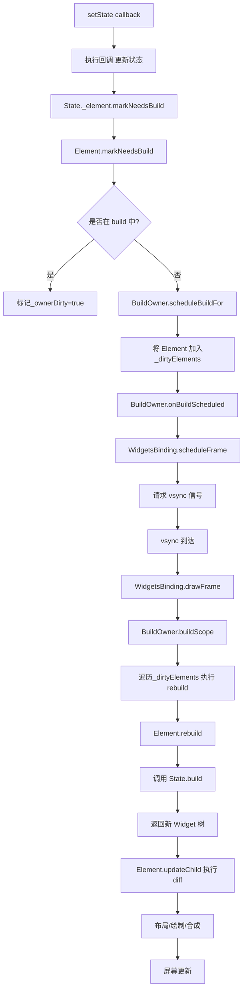
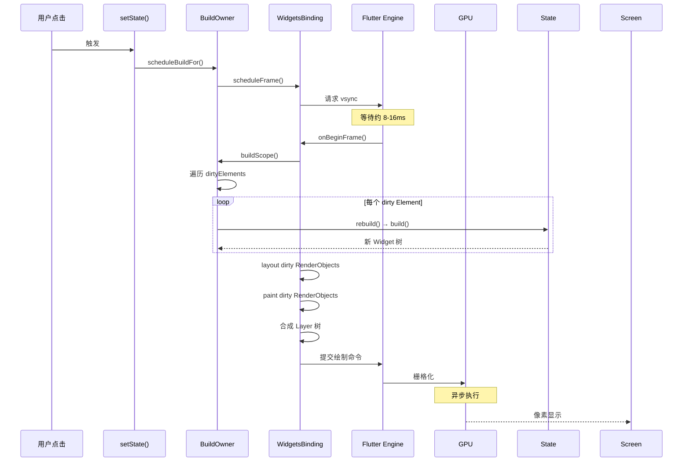

## 一句话概括

setState 并非"立即更新 UI"，而是通过脏标记机制将 StatefulElement 标记为需要重建，请求下一帧 vsync 信号，在帧调度的 build phase 中遍历所有 dirty Element 执行增量重建，最终触发布局、绘制与合成流程将 UI 变更呈现到屏幕。

## 背景与意义

setState 是 Flutter 开发中最常用的 API——几乎每个 StatefulWidget 的交互逻辑都离不开它。但正是因为它太常用、太简单（传一个回调就完事了），很多开发者对它的理解停留在了"调用后界面就变了"的层面。

这种"黑盒"理解会导致什么问题？

- 不理解为什么有些 setState 调用后 UI 没变（因为传了没变化的引用）
- 不明白为什么 setState 在 dispose 之后调用会报错
- 不清楚 setState 和 markNeedsBuild 的区别
- 不知道为什么 setState 在 build 期间调用会触发断言错误

这些问题直接关系到应用的稳定性和性能。理解 setState 的原理，让你从"用 Flutter"变成"懂 Flutter"。

## 概念与定义

### State

StatefulWidget 对应的可变状态对象。与 Widget 不同，State 在 StatefulElement 的整个生命周期内持久存在，可以通过 setState 修改内部状态。

### setState

```dart
@protected
void setState(VoidCallback fn) {
  assert(fn != null);
  assert(
    _element!.lifecycleState == _ElementLifecycle.active,
    'setState() or markNeedsBuild() called during build.',
  );
  final dynamic result = fn() as dynamic;
  assert(() {
    if (result is Future) {
      throw FlutterError('setState 回调中不能返回 Future');
    }
    return true;
  }());
  _element!.markNeedsBuild();
}
```

setState 的核心是两件事：
1. 执行回调（修改状态）
2. 调用 `_element!.markNeedsBuild()`

### _ElementLifecycle

Element 的生命周期状态：

```dart
enum _ElementLifecycle {
  initial,    // 刚创建，还未 mount
  active,     // 正常活跃状态
  inactive,   // 已被 deactivate 但未 unmount
  defunct,    // 已 unmount，不再可用
}
```

### BuildOwner

Flutter 框架中负责管理脏 Element 重建的核心类：

```dart
class BuildOwner {
  // 脏 Element 列表
  final List<Element> _dirtyElements = [];
  
  void scheduleBuildFor(Element element) { ... }
  void buildScope(Element element) { ... }
  void finalizeTree() { ... }
}
```

### rebuild

Element 调用自身和子树的 build 方法，生成新的 Widget 子树。

## 最小示例

```dart
class CounterWidget extends StatefulWidget {
  @override
  State<CounterWidget> createState() => _CounterWidgetState();
}

class _CounterWidgetState extends State<CounterWidget> {
  int _count = 0;

  void _increment() {
    // 1. 修改状态
    setState(() {
      _count++;  // _count: 0 → 1
    });
    // 2. 此时 UI 还没有更新！
    // 3. 只是标记了 Element 为 dirty
    // 4. 下一帧才会 rebuild
  }

  @override
  Widget build(BuildContext context) {
    return Column(
      children: [
        Text('$_count'),           // ← 下帧重建时这里读到新的 _count
        ElevatedButton(
          onPressed: _increment,
          child: Text('+'),
        ),
      ],
    );
  }
}
```

记住：`setState` **不会立即调用 build**。它只干两件事：执行回调更新状态，标记 Element 为 dirty 请求下一帧。

## 核心知识点拆解

### 1. setState 的完整调用链



### 2. BuildOwner.scheduleBuildFor

```dart
class BuildOwner {
  final List<Element> _dirtyElements = [];
  
  void scheduleBuildFor(Element element) {
    if (element._inDirtyList) return;  // 已经在列表中
    
    element._inDirtyList = true;
    _dirtyElements.add(element);
    
    // 触发 scheduleFrame 请求 vsync
    onBuildScheduled!();
  }
  
  void buildScope(Element context) {
    // 按深度排序（先父后子）
    _dirtyElements.sort(Element._sort);
    
    int dirtyCount = _dirtyElements.length;
    int index = 0;
    
    while (index < dirtyCount) {
      final element = _dirtyElements[index];
      if (element._inDirtyList) {
        element.rebuild();
      }
      index++;
      // 注意：rebuild 过程中可能新增 dirty Element
      // 所以 dirtyCount 需要实时更新
      if (dirtyCount < _dirtyElements.length) {
        _dirtyElements.sort(Element._sort);
        dirtyCount = _dirtyElements.length;
      }
    }
    
    _dirtyElements.clear();
  }
}
```

**关键优化**：按深度排序保证了父 Element 先 rebuild，子 Element 后 rebuild。这样如果没有 Key 的变化，子 Element 通常不需要 rebuild（因为在父 Element rebuild 时，子 Element 的 update 已经处理了）。

### 3. Element.markNeedsBuild 的断言保护

```dart
class Element {
  void markNeedsBuild() {
    if (_lifecycleState != _ElementLifecycle.active) {
      // 在 dispose 后调用 setState 会触发这个断言
      throw FlutterError(
        'setState() or markNeedsBuild() called on an element that '
        'has been removed from the tree.'
      );
    }
    
    if (_buildOwner == null) return;  // 从树中移除后

    if (_active) {
      if (dirty) return;  // 已经在 dirty 列表中
      _dirty = true;
      _buildOwner!.scheduleBuildFor(this);
    }
  }
}
```

这就是为什么 `setState` 在 `dispose` 后调用会报错——`_lifecycleState` 不再是 `active`。

### 4. StatefulWidget 的 rebuild 时机

setState 不是触发 `State.build()` 的唯一方式：

```dart
// 触发 State.build 的所有场景：
// 1. setState() 调用
// 2. InheritedWidget 的依赖变更（didChangeDependencies）
// 3. 父 Widget 重建导致子 Element.update 被调用
// 4. reassemble（热重载）
// 5. didUpdateWidget（如果 Widget 配置变化了）
```

尤其是第三点：即使你没有调用 setState，如果父 Widget 重建了，子 StatefulWidget 的 `build` 也会被调用（除非子是 const）。

```dart
class Parent extends StatefulWidget {
  @override
  State<Parent> createState() => _ParentState();
}

class _ParentState extends State<Parent> {
  int _parentCount = 0;

  @override
  Widget build(BuildContext context) {
    return Column(
      children: [
        Text('Parent: $_parentCount'),
        const MyChild(),  // const → 不会随父重建而 rebuild
        MyChild(),        // 非 const → 每次父 rebuild，子也 rebuild
      ],
    );
  }
}

class MyChild extends StatefulWidget {
  const MyChild({super.key});
  
  @override
  State<MyChild> createState() => _MyChildState();
}

class _MyChildState extends State<MyChild> {
  @override
  Widget build(BuildContext context) {
    print('子组件 rebuild');
    return const Text('Child');
  }
}
```

当 `_parentCount` 变化时，父组件 rebuild，`const MyChild()` 不会触发子 rebuild（因为 canUpdate 检查发现 identical(oldWidget, newWidget)），但非 const 的 `MyChild()` 会触发子 rebuild。

## 实战案例

### 案例 1：setState 中的"陷阱"——引用不变

```dart
class TodoListWidget extends StatefulWidget {
  @override
  State<TodoListWidget> createState() => _TodoListWidgetState();
}

class _TodoListWidgetState extends State<TodoListWidget> {
  final List<String> _todos = ['买菜', '做饭'];

  void _addTodo(String item) {
    // ❌ 错误写法
    setState(() {
      _todos.add(item);  // 修改了同一个 List 对象的内部状态
    });
    // 问题：build 中 _todos 的引用没有变化
    // DataCell / 列表监听器不会检测到变化

    // ✅ 正确写法
    setState(() {
      _todos = [..._todos, item];  // 创建新的 List 实例
    });
  }

  // 这是另一种常见场景
  void _toggleItem(int index) {
    // ❌ 错误：直接修改 List 中的对象属性
    // setState(() {
    //   _todos[index].isDone = true;
    // });

    // ✅ 正确：不可变更新
    setState(() {
      // _todos[index] = _todos[index].copyWith(isDone: true);
    });
  }

  @override
  Widget build(BuildContext context) {
    // 这里 _todos 的 .length 会变化，但 List 引用不变时
    // 某些 Widget（如 ListView.builder）不会自动更新
    return ListView.builder(
      itemCount: _todos.length,
      itemBuilder: (context, index) => Text(_todos[index]),
    );
  }
}
```

原则：**setState 中的状态变更应当产生新对象**（不可变更新），特别是对于 List、Map、Set 这类引用类型。

### 案例 2：避免在 dispose 后调用 setState

```dart
class AsyncWidget extends StatefulWidget {
  @override
  State<AsyncWidget> createState() => _AsyncWidgetState();
}

class _AsyncWidgetState extends State<AsyncWidget> {
  StreamSubscription? _subscription;

  @override
  void initState() {
    super.initState();
    _subscription = dataStream.listen((data) {
      // ❌ 可能崩溃：在 dispose 之后调用
      // setState(() => _data = data);
      
      // ✅ 安全写法
      if (mounted) {
        setState(() => _data = data);
      }
    });
  }

  @override
  void dispose() {
    _subscription?.cancel();
    super.dispose();
  }

  @override
  Widget build(BuildContext context) {
    return Text('$_data');
  }
}
```

这里 `mounted` 是 State 内部的一个 getter，它检查 `_element._lifecycleState == _ElementLifecycle.active`。当 Widget 从树中移除时，`mounted` 变为 false。

### 案例 3：批量 setState 与帧合并

```dart
class BatchUpdateWidget extends StatefulWidget {
  @override
  State<BatchUpdateWidget> createState() => _BatchUpdateWidgetState();
}

class _BatchUpdateWidgetState extends State<BatchUpdateWidget> {
  int _counter = 0;
  String _message = '';

  void _batchUpdate() {
    // 多次 setState 调用
    setState(() => _counter++);
    setState(() => _counter++);
    setState(() => _counter++);
    setState(() => _message = '更新完成');
    
    // 结果：_counter 变为 +3，_message 更新
    // 但 UI 只重建一次！因为多个 setState 都设置同一个 dirty 标记，
    // 而且帧请求已经被第一个 setState 发送了
  }

  @override
  Widget build(BuildContext context) {
    print('build 只调用一次');
    return Column(
      children: [
        Text('计数: $_counter'),
        Text(_message),
      ],
    );
  }
}
```

**重要优化**：帧调度器会合并多个 dirty 标记为一次帧请求。在同一个微任务/事件处理中的多个 setState，最终只会导致一次 build。

### 案例 4：setState 在 build 中调用——循环重建

```dart
// ❌ 严重问题：build 中调用 setState
Widget build(BuildContext context) {
  // 这会在每一次 build 时触发 setState
  // setState → markNeedsBuild → scheduleBuild → vsync → build → setState...
  // 无限循环！
  setState(() => _someState = compute());
  
  return Text('$_someState');
}

// ✅ 正确：在生命周期或事件回调中调用
@override
void initState() {
  super.initState();
  // 或者 didChangeDependencies, didUpdateWidget 等
  // 或者用户事件的回调
}

void _onSomething() {
  setState(() => _someState = compute());
}
```

Flutter 框架在 build 期间调用了断言检查：`assert(!_debugBuilding)`。如果你在 build 中调用 setState，这个断言会触发，控制台产生类似于 "setState() or markNeedsBuild() called during build" 的错误。

## 底层原理

### State 与 StatefulElement 的内部关联

```dart
// StatefulElement 与 State 的关系
class StatefulElement extends ComponentElement {
  // StatefulElement 持有一个 State 引用
  State<StatefulWidget> _state;
  
  @override
  void mount(Element? parent, Object? newSlot) {
    super.mount(parent, newSlot);
    
    // 1. 创建 State 实例
    _state = widget.createState();
    _state._element = this;       // State 持有 Element 引用
    
    // 2. 调用 initState
    _state.initState();
    
    // 3. 第一次 build
    _state.dirty = false;
    rebuild();
  }
  
  @override
  void update(covariant StatefulWidget newWidget) {
    final oldWidget = _state._widget as StatefulWidget;
    super.update(newWidget);
    
    // 调用 didUpdateWidget
    _state.didUpdateWidget(oldWidget);
    
    // 触发 rebuild
    rebuild();
  }
  
  @override
  void activate() {
    super.activate();
    _state._element = this;      // 重新激活时恢复引用
    _state.build(this);          // 重新 build
  }
  
  @override
  void unmount() {
    super.unmount();
    _state.dispose();            // State.dispose 被调用
    _state._element = null;      // 清除 Element 引用
  }
}
```

关键关系链：`State` → `_element` → `StatefulElement` → `markNeedsBuild()` → `BuildOwner._dirtyElements`。

### 帧调度的完整时序



### setState 中的闭包与状态隔离

```dart
void _increment() {
  setState(() {
    // 这个闭包在 setState 内部被同步执行
    // 注意：闭包可以访问 State 的私有字段
    _count++; 
    
    // 但是不能在闭包中调用 setState 自身
    // setState(() => print('nested'));  // 嵌套 setState 不会报错，但奇怪
  });
  
  // 闭包外的代码——此时状态已经更新了
  // 但 UI 还没 rebuild
  print('计数已更新: $_count');  // 输出新值
}
```

setState 的回调是**同步执行**的，而不是异步的。你可以确认在 setState 返回后，State 的字段已经被更新了。但是 UI 的重建在下一帧。

## 高频面试题解析

### Q1：setState 是同步还是异步的？

**setState 的回调是同步执行的**——闭包中的代码立即执行。但 UI 更新是异步的——在下一帧才触发 build。

```dart
void test() {
  print('1');
  setState(() {
    print('2');  // 立即输出
    _count = 42;
  });
  print('3: $_count');  // 立即输出 "3: 42"
}

// 输出顺序：1 → 2 → 3: 42
// 然后（下一帧）：build() 被调用
```

### Q2：为什么 setState 的闭包参数要写成回调而不是直接传新值？

设计原因：

```dart
// 如果 setState 是 setState(newState ValueNotifier)
// 问题：无法确保状态更新的原子性

// 实际设计：回调形式
setState(() {
  _counter++;  // 回调中可以执行多个更新
});
```

回调形式保证了状态更新在同一个作用域和同一个微任务中完成，避免了多步更新中间状态被其他异步操作读取的问题。

### Q3：setState 的闭包中能调用异步方法吗？

```dart
setState(() async {
  final data = await fetchData();  // 这是 Future
  _data = data;
});

// 上面这行代码会触发断言错误：
// "setState callback returns a Future"
```

setState 的回调**不应该**返回 Future。因为框架期望回调结束时状态已经被更新。如果回调是 async 的，`await` 会让回调"提前完成"，实际的状态更新发生在 await 之后——此时帧调度已经完成。

```dart
// ✅ 正确做法
void _loadData() async {
  final data = await fetchData();
  setState(() => _data = data);  // 数据到达后再 setState
}
```

### Q4：为什么 State 中有 mounted 属性？

mounted 是 State 内部的一个 getter：

```dart
bool get mounted => _element?._lifecycleState == _ElementLifecycle.active;
```

当 Element 从树中被移除（比如导航到其他页面），`_lifecycleState` 变为非 active 状态。此时如果异步回调中还调用了 setState，框架会抛出异常。`mounted` 可以在这个检查之前做预判。

```dart
// 确保 mounted 再 setState 是标准做法
if (mounted) {
  setState(() => _data = data);
}
```

### Q5：WidgetsBinding.instance.addPostFrameCallback 与 setState 的关系？

```dart
@override
void initState() {
  super.initState();
  WidgetsBinding.instance.addPostFrameCallback((_) {
    // 这一帧 build/layout/paint 完成后执行
    // 此时可以安全地 setState
    setState(() => _initialized = true);
    // 但这个 setState 会触发下一帧的 rebuild
  });
}
```

`addPostFrameCallback` 的时机：在当前帧的 build/layout/paint 全部完成后执行。如果你在这里调用 setState，不会触发当前帧的更新，而是请求下一帧。

## 总结与扩展

### 核心要点

1. **setState 不是直接更新 UI**，而是通过脏标记机制标记 Element 为 dirty，请求下一帧 vsync
2. **setState 的回调是同步的**，但 UI 更新是异步的
3. **多重 setState 合并**为一次帧请求，不会重复 build
4. **mounted 检查**是防止 dispose 后 setState 崩溃的标准做法
5. **不可变更新**：setState 中的状态变更应产生新对象而不是修改原引用
6. **不要在 build 中调用 setState**——会导致无限循环

### 扩展阅读

- StatefulWidget 官方文档：[api.flutter.dev/flutter/widgets/StatefulWidget-class.html](https://api.flutter.dev/flutter/widgets/StatefulWidget-class.html)
- WidgetsBinding/帧调度源码：[github.com/flutter/flutter/blob/main/packages/flutter/lib/src/widgets/binding.dart](https://github.com/flutter/flutter/blob/main/packages/flutter/lib/src/widgets/binding.dart)
- Flutter 性能最佳实践：[docs.flutter.dev/perf/best-practices](https://docs.flutter.dev/perf/best-practices)
- Flutter 官方调试指南：[docs.flutter.dev/testing/debugging](https://docs.flutter.dev/testing/debugging)
- 推荐阅读：《Flutter in Action》第 7 章——State Management

### 进阶思考

setState 是 Flutter 中最基础的状态管理 API。了解它的工作原理后，你就更容易理解为什么更高级的状态管理方案（Provider、Riverpod、Bloc）会在其基础上做封装——它们本质上也是某种 `markNeedsBuild` 的调度者，只是把状态管理的范围从单一 Widget 扩展到了整个组件树。
