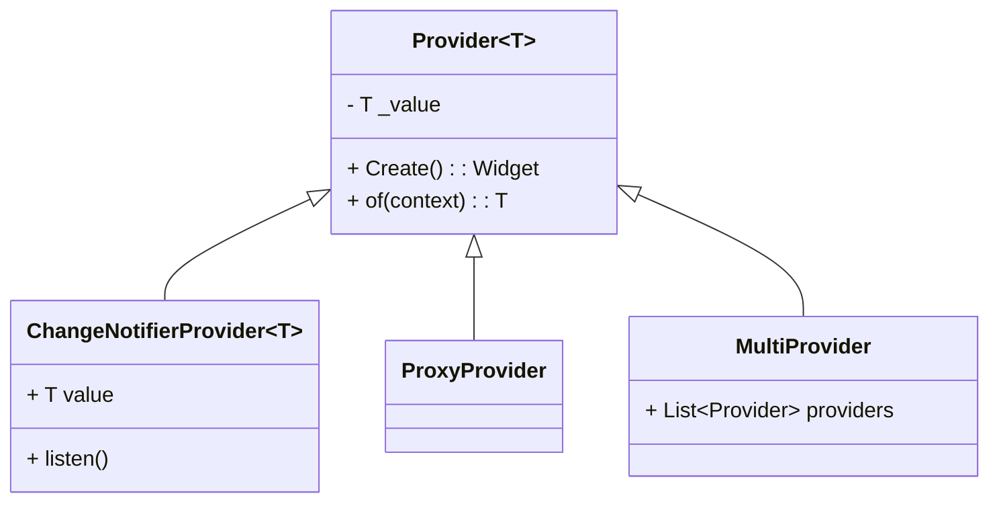

> **一句话概括：** Provider 是 Flutter 官方推荐的状态管理方案，它基于 InheritedWidget 封装，通过依赖注入机制实现高效的跨组件状态共享，是理解 Flutter 响应式 UI 架构的基石。

## 1. 背景与意义

在移动端开发中，状态管理始终是一个绕不开的核心议题。传统的 Android 开发通过 Activity/Fragment 的 `onSaveInstanceState` 来维持简单状态，iOS 则依赖 Delegate 和 Notification 模式。但当应用复杂到一定程度后——比如用户购物车数据需要在商品列表页、详情页、结算页之间同步——传统的状态传递方式就开始暴露出严重的维护性问题。

Flutter 作为一个声明式 UI 框架，其核心哲学是 **UI = f(state)**。这意味着整个 Widget 树只是当前应用状态的投影。当状态发生变化时，框架会重新构建受影响的 Widget。这种模式天然要求状态能够被高效地、可预测地在组件树中传递。

Flutter 内置了 `InheritedWidget` 来实现状态的向下传递，但直接使用 InheritedWidget 需要编写大量模板代码：你需要定义 `of(context)` 静态方法、处理 Widget 重建、管理对象的生命周期。`Provider` 正是在这个痛点下诞生的——它将这些重复劳动抽象成一套简洁、可组合的 API。

截至 Flutter 3.x，Provider 已成为 Flutter 官方生态中最成熟的状态管理方案之一，被 Google 推荐用于大多数中小型项目。它与其他方案（BLoC、Riverpod、GetX）的核心区别在于：Provider 没有引入新的响应式原语，而是直接建立在 Flutter 已有的 InheritedWidget 机制之上。这意味着它学习曲线更低、与 Flutter 的生命周期结合更自然。

## 2. 概念与定义

### 2.1 Provider 的核心概念

**Provider** 本质上是一个泛型容器，它包装了一个值（value）并暴露给 Widget 树。任何子 Widget 都可以通过 `Provider.of<T>(context)` 或 `context.watch<T>()` 来获取这个值。

核心类型关系如下：



主要角色：

- **Provider\<T\>**：最基本的 Provider，提供一个不可变的值
- **ChangeNotifierProvider\<T\>**：配合 `ChangeNotifier` 使用，当值变化时通知监听者重建 UI
- **MultiProvider**：组合多个 Provider，避免嵌套过深
- **ProxyProvider**：依赖其他 Provider 的值进行计算
- **Consumer\<T\>**：限定组件重建的范围，避免不必要的重建

### 2.2 关键机制

Provider 的工作流程可以概括为三步：

1. **注入**：在 Widget 树的顶层通过 Provider 包装一个值
2. **获取**：子 Widget 通过 `context.watch()`（监听变化）或 `context.read()`（仅获取不监听）来获取值
3. **通知**：当值变化时（通过 ChangeNotifier 的 `notifyListeners()`），自动通知所有监听者重建 UI

## 3. 最小示例：计数器

通过一个最简的计数器应用，我们可以直观感受 Provider 的工作方式：

```dart
// 第一步：定义状态
import 'package:flutter/material.dart';
import 'package:provider/provider.dart';

// 继承 ChangeNotifier，让 Provider 可以监听变化
class Counter extends ChangeNotifier {
  int _count = 0;
  int get count => _count;

  void increment() {
    _count++;
    notifyListeners(); // 通知所有监听者
  }
}

// 第二步：注入 Provider
void main() {
  runApp(
    ChangeNotifierProvider(
      create: (_) => Counter(),
      child: const MyApp(),
    ),
  );
}

// 第三步：在 Widget 中使用
class MyApp extends StatelessWidget {
  const MyApp({super.key});

  @override
  Widget build(BuildContext context) {
    return MaterialApp(
      home: Scaffold(
        appBar: AppBar(title: const Text('Provider 计数器')),
        body: const Center(child: CounterDisplay()),
        floatingActionButton: const IncrementButton(),
      ),
    );
  }
}

// 方式一：通过 context.watch() 获取
class CounterDisplay extends StatelessWidget {
  const CounterDisplay({super.key});

  @override
  Widget build(BuildContext context) {
    // watch 会注册监听，当 Counter 变化时重建该 Widget
    final counter = context.watch<Counter>();
    return Text('计数: ${counter.count}', style: const TextStyle(fontSize: 24));
  }
}

// 方式二：通过 context.read() 获取（不监听变化）
class IncrementButton extends StatelessWidget {
  const IncrementButton({super.key});

  @override
  Widget build(BuildContext context) {
    return FloatingActionButton(
      // read 不注册监听，仅获取引用
      onPressed: () => context.read<Counter>().increment(),
      child: const Icon(Icons.add),
    );
  }
}
```

这段代码虽然简单，但已经完整展示了 Provider 的三个核心步骤。注意 `context.watch()` 和 `context.read()` 的区别：前者搭配视觉 Widget 使用，会监听变化并触发重建；后者搭配事件处理函数使用，只获取引用不触发重建。如果在事件处理中使用 `watch`，虽然功能仍然正确，但会造成 Widget 在非必要的情况下重建，降低性能。

## 4. 核心知识点拆解

### 4.1 Provider 的类型层级

Provider 家族包含多种变体，每种解决不同的场景：

| Provider 类型 | 适用场景 | 特点 |
|---|---|---|
| `Provider` | 不可变配置对象 | 不监听变化，仅注入 |
| `ChangeNotifierProvider` | 可变状态 | 自动监听 ChangeNotifier |
| `StreamProvider` | 流式数据 | 包装 Stream |
| `FutureProvider` | 异步初始化 | 包装 Future |
| `ValueListenableProvider` | ValueNotifier 包装 | 桥接 ValueNotifier |
| `ProxyProvider` | 依赖组合 | 从其他 Provider 派生 |
| `MultiProvider` | 多依赖注入 | 减少嵌套 |

### 4.2 Consumer 的精妙设计

Provider 面临一个经典问题：当状态更新时，如果只是在 `build` 方法顶部通过 `watch` 获取状态，整个 Widget 会完全重建。考虑一个复杂的页面，只有一个小角落依赖某个状态变化，全量重建会造成浪费。

Consumer 组件的设计就是为了解决这个问题：

```dart
// 不使用 Consumer：整个 Column 会重建
class BadExample extends StatelessWidget {
  @override
  Widget build(BuildContext context) {
    final user = context.watch<UserModel>();
    return Column(
      children: [
        // 这个 Header 不依赖 user，但也会重建
        const Header(),
        // 只有这个部分依赖 user
        Text('Hello, ${user.name}!'),
        // 这个 Footer 也不依赖 user
        const Footer(),
      ],
    );
  }
}

// 使用 Consumer：只重建 Text 组件本身
class GoodExample extends StatelessWidget {
  @override
  Widget build(BuildContext context) {
    return Column(
      children: [
        const Header(), // 永不重建
        Consumer<UserModel>(
          builder: (context, user, child) {
            return Text('Hello, ${user.name}!');
          },
        ),
        const Footer(), // 永不重建
      ],
    );
  }
}
```

Consumer 的 builder 回调只在 Provider 值变化时被调用，而其 parent Widget 不会重建。这类似于 BLoC 中的 BlocBuilder，或是 React 中 `useSelector` 的浅比较优化。

### 4.3 Selector：精确监听

Selector 是 Consumer 的进阶版本，它允许你只监听状态的某个字段。当字段没有变化时，即使父状态变化了，也不会触发重建：

```dart
class ShoppingCart with ChangeNotifier {
  List<Item> _items = [];
  double _taxRate = 0.13;

  List<Item> get items => _items;
  double get taxRate => _taxRate;

  // 假设这个方法频繁调用，但我们只想在 items 变化时更新 UI
  void addItem(Item item) {
    _items.add(item);
    notifyListeners();
  }
}

// 只监听 items 字段，忽略 taxRate 的变化
Selector<ShoppingCart, List<Item>>(
  selector: (context, cart) => cart.items,
  builder: (context, items, child) {
    return ListView.builder(
      itemCount: items.length,
      itemBuilder: (context, index) => Text(items[index].name),
    );
  },
);
```

`selector` 函数的返回值会与上一次的返回结果进行 `==` 比较。只有当比较结果为 `false` 时，`builder` 才会执行。这个机制对于大数据渲染场景非常实用。

## 5. 实战案例：购物车应用

让我们构建一个更完整的实战案例——一个包含商品列表、购物车和结算功能的模拟应用。

```dart
// === 1. 数据模型 ===
class Product {
  final String id;
  final String name;
  final double price;
  Product({required this.id, required this.name, required this.price});
}

class CartItem {
  final Product product;
  int quantity;
  CartItem({required this.product, this.quantity = 1});
}

// === 2. 购物车状态 ===
class CartModel extends ChangeNotifier {
  final Map<String, CartItem> _items = {};

  Map<String, CartItem> get items => Map.unmodifiable(_items);
  int get itemCount => _items.values.fold(0, (sum, item) => sum + item.quantity);
  double get totalPrice =>
      _items.values.fold(0.0, (sum, item) => sum + item.product.price * item.quantity);

  void addProduct(Product product) {
    if (_items.containsKey(product.id)) {
      _items[product.id]!.quantity++;
    } else {
      _items[product.id] = CartItem(product: product);
    }
    notifyListeners();
  }

  void removeProduct(String productId) {
    _items.remove(productId);
    notifyListeners();
  }

  void clear() {
    _items.clear();
    notifyListeners();
  }
}

// === 3. 商品列表状态 ===
class ProductListModel extends ChangeNotifier {
  final List<Product> _products = [
    Product(id: '1', name: 'Flutter 实战', price: 79.0),
    Product(id: '2', name: 'Dart 语言之旅', price: 59.0),
    Product(id: '3', name: 'UI 设计原则', price: 49.0),
    Product(id: '4', name: '算法导论', price: 99.0),
  ];

  List<Product> get products => List.unmodifiable(_products);
}

// === 4. 注入多个 Provider ===
void main() {
  runApp(
    MultiProvider(
      providers: [
        ChangeNotifierProvider(create: (_) => ProductListModel()),
        ChangeNotifierProvider(create: (_) => CartModel()),
      ],
      child: const ShopApp(),
    ),
  );
}

// === 5. UI 部分 ===
class ShopApp extends StatelessWidget {
  const ShopApp({super.key});

  @override
  Widget build(BuildContext context) {
    return MaterialApp(
      title: 'Provider 购物车',
      home: DefaultTabController(
        length: 2,
        child: Scaffold(
          appBar: AppBar(
            title: const Text('书店'),
            bottom: const TabBar(
              tabs: [
                Tab(text: '商品'),
                Tab(text: '购物车'),
              ],
            ),
            actions: [
              // 购物车图标 + 数量角标
              Consumer<CartModel>(
                builder: (context, cart, child) {
                  return Stack(
                    children: [
                      IconButton(
                        icon: const Icon(Icons.shopping_cart),
                        onPressed: () {},
                      ),
                      if (cart.itemCount > 0)
                        Positioned(
                          right: 6,
                          top: 6,
                          child: Container(
                            padding: const EdgeInsets.all(4),
                            decoration: const BoxDecoration(
                              color: Colors.red,
                              shape: BoxShape.circle,
                            ),
                            child: Text(
                              '${cart.itemCount}',
                              style: const TextStyle(
                                color: Colors.white,
                                fontSize: 10,
                              ),
                            ),
                          ),
                        ),
                    ],
                  );
                },
              ),
            ],
          ),
          body: TabBarView(
            children: [
              // Tab 1: 商品列表
              Consumer<ProductListModel>(
                builder: (context, productList, child) {
                  return ListView.builder(
                    itemCount: productList.products.length,
                    itemBuilder: (context, index) {
                      final product = productList.products[index];
                      return ListTile(
                        title: Text(product.name),
                        subtitle: Text('¥${product.price.toStringAsFixed(2)}'),
                        trailing: ElevatedButton(
                          onPressed: () => context.read<CartModel>().addProduct(product),
                          child: const Text('加入购物车'),
                        ),
                      );
                    },
                  );
                },
              ),
              // Tab 2: 购物车列表
              Consumer<CartModel>(
                builder: (context, cart, child) {
                  if (cart.items.isEmpty) {
                    return const Center(child: Text('购物车是空的'));
                  }
                  return Column(
                    children: [
                      Expanded(
                        child: ListView.builder(
                          itemCount: cart.items.length,
                          itemBuilder: (context, index) {
                            final item = cart.items.values.elementAt(index);
                            return ListTile(
                              title: Text(item.product.name),
                              subtitle: Text('x${item.quantity}'),
                              trailing: Text(
                                '¥${(item.product.price * item.quantity).toStringAsFixed(2)}',
                              ),
                            );
                          },
                        ),
                      ),
                      const Divider(),
                      Padding(
                        padding: const EdgeInsets.all(16),
                        child: Row(
                          mainAxisAlignment: MainAxisAlignment.spaceBetween,
                          children: [
                            const Text('总计:', style: TextStyle(fontSize: 18, fontWeight: FontWeight.bold)),
                            Text(
                              '¥${cart.totalPrice.toStringAsFixed(2)}',
                              style: const TextStyle(fontSize: 18, fontWeight: FontWeight.bold, color: Colors.green),
                            ),
                          ],
                        ),
                      ),
                    ],
                  );
                },
              ),
            ],
          ),
        ),
      ),
    );
  }
}
```

这个案例展示了多 Provider 协作的典型模式：`ProductListModel` 管理商品数据，`CartModel` 管理购物车状态，两者通过 `MultiProvider` 注入，在 UI 层通过 `Consumer` 和 `context.read()` 按需获取。

## 6. 底层原理

Provider 的核心实现并不神秘——它本质上是对 `InheritedWidget` 的封装。理解这一点对于深入掌握 Provider 至关重要。

### 6.1 InheritedWidget 的工作原理

InheritedWidget 是 Flutter 框架内置的一个特殊 Widget。当父 Widget 在 build 方法中引用某个 InheritedWidget 时，Flutter 会在内部维护一个从 Widget 到 InheritedWidget 的映射关系。当 InheritedWidget 发生变化时，所有依赖它的子 Widget 会被标记为"需要重建"。

```dart
// 原生 InheritedWidget 的使用方式
class MyInheritedWidget extends InheritedWidget {
  final int data;

  const MyInheritedWidget({
    super.key,
    required this.data,
    required super.child,
  });

  // 静态方法用于子 Widget 获取数据
  static MyInheritedWidget of(BuildContext context) {
    // dependOnInheritedWidgetOfExactType 会注册依赖关系
    final result = context.dependOnInheritedWidgetOfExactType<MyInheritedWidget>();
    assert(result != null, 'No MyInheritedWidget found in context');
    return result!;
  }

  // 决定是否需要通知依赖者重建
  @override
  bool updateShouldNotify(MyInheritedWidget oldWidget) {
    return oldWidget.data != data;
  }
}
```

`dependOnInheritedWidgetOfExactType` 是关键方法。它做了两件事：
1. 返回最近的指定类型的 InheritedWidget
2. 将该 InheritedWidget 注册到当前 `Element` 的依赖列表中

当 InheritedWidget 重建时，Flutter 会遍历所有注册了依赖的 Element，将它们标记为 `dirty`，从而触发重建。

### 6.2 Provider 的封装

Provider 正是在 InheritedWidget 之上做了三层抽象：

**第一层：InheritedProvider**

Provider 内部定义了一个 `InheritedProvider`，它继承自 `InheritedWidget`，负责存储值和通知依赖：

```dart
// 伪代码展示 Provider 内部结构
class InheritedProvider<T> extends InheritedWidget {
  final T value;
  final UpdateShouldNotify<T>? updateShouldNotify;

  @override
  bool updateShouldNotify(InheritedProvider<T> oldWidget) {
    return updateShouldNotify?.call(oldWidget.value, value) ?? true;
  }

  // 这是 context.watch<T>() 最终调用的方法
  static T of<T>(BuildContext context, {bool listen = true}) {
    final widget = listen
        ? context.dependOnInheritedWidgetOfExactType<InheritedProvider<T>>()
        : context.getInheritedWidgetOfExactType<InheritedProvider<T>>();
    return widget!.value;
  }
}
```

注意 `listen` 参数——这是 `watch` 和 `read` 的根本区别。`listen=true` 会调 `dependOnInheritedWidgetOfExactType` 注册依赖；`listen=false` 使用 `getInheritedWidgetOfExactType` 只获取不注册。

**第二层：ChangeNotifierProvider 的监听机制**

`ChangeNotifierProvider` 在普通 Provider 的基础上增加了对 `ChangeNotifier` 的监听。它内部会：

1. 创建 `ChangeNotifier` 实例
2. 监听其变化，当 `notifyListeners()` 被调用时
3. 调用 `setState()` 触发自身（InheritedProvider）重建
4. InheritedProvider 的重建触发所有依赖 Widget 重建

```dart
// 伪代码：ChangeNotifierProvider 的核心逻辑
class ChangeNotifierProvider<T extends ChangeNotifier> extends StatefulWidget {
  // ...
}

class _ChangeNotifierProviderState<T extends ChangeNotifier>
    extends State<ChangeNotifierProvider<T>> {
  late T _value;

  @override
  void initState() {
    super.initState();
    _value = widget.create(this);
    // 注册监听器
    _value.addListener(_onValueChanged);
  }

  void _onValueChanged() {
    // 关键：notifyListeners 触发 setState
    // setState 导致 build 重建 InheritedProvider
    // InheritedProvider 重建触发所有依赖 Widget 重建
    setState(() {});
  }

  @override
  Widget build(BuildContext context) {
    return InheritedProvider<T>(
      value: _value,
      child: widget.child,
    );
  }
}
```

**第三层：Consumer**

Consumer 通过 `Builder` 模式实现局部重建。它的本质是一个 `StatelessWidget`，在 `build` 方法中调用 `Provider.of<T>(context)` 获取值，然后通过 `builder` 回调传递给子组件：

```dart
class Consumer<T> extends StatelessWidget {
  final Widget Function(BuildContext context, T value, Widget? child) builder;
  final Widget? child;

  @override
  Widget build(BuildContext context) {
    return builder(context, Provider.of<T>(context), child);
  }
}
```

### 6.3 Provider 的获取性能

由于 InheritedWidget 的查找是通过 Element 树进行的（而非 Widget 树），其时间复杂度为 O(n) 但在实践中由于 Element 树的高度通常很浅（几十层），实际性能表现非常优秀。Flutter 团队也对此进行了大量优化，包括缓存查找结果等。

## 7. 高频面试题解析

### Q1: `context.watch<T>()` 和 `context.read<T>()` 的区别是什么？

**答：** `watch` 会调用 `dependOnInheritedWidgetOfExactType`，注册当前 Widget 为 Provider 的依赖，当 Provider 的值发生变化时会触发当前 Widget 重建。`read` 调用 `getInheritedWidgetOfExactType`，仅获取值而不注册依赖。使用原则：build 方法中用 `watch`，事件回调中用 `read`。

如果显式在 build 中使用 `read`，则 Widget 不会随状态变化而更新，这与声明式 UI 的理念相悖。

### Q2: ChangeNotifierProvider 中多次调用 notifyListeners() 会多次重建 UI 吗？

**答：** 不会。`notifyListeners()` 最终通过 `setState()` 触发 Widget 重建。Flutter 会将同一帧内的多次 `setState` 合并为一次重建。但如果多次 `notifyListeners` 跨越了多帧（比如通过 Animation 驱动），则每帧都会触发重建。

### Q3: Provider.of<T>(context) 查找 Provider 时的查找范围？

**答：** 查找沿着 Element 树向上，只查找最近的 `InheritedProvider<T>`。这意味着如果同一类型有多个 Provider，子 Widget 只能访问到最近的父级 Provider。这也是为什么 MultiProvider 按左到右、从外到内的顺序排列 Provider 的原因。

### Q4: Provider 和 BLoC 的主要差异是什么？

**答：** BLoC 基于事件驱动（Event → Bloc → State），强调单向数据流和可测试性；Provider 基于观察者模式（ChangeNotifier + InheritedWidget），更轻量。BLoC 适合状态流转复杂、需要事件回溯的场景；Provider 更适合同步、确定性的状态获取和更新。在大型项目中，两者也可以混合使用。

### Q5: 如何在多个页面间共享 Provider 的状态？

**答：** 关键是将 Provider 放在页面切换的上层。例如，`MaterialApp` 或 `Navigator` 之上。如果使用命名路由，可以通过 `onGenerateRoute` 获取上下文来读取 Provider。如果使用 `GoRouter`，可以确保子路由在同一个 Provider 子树下。也可以考虑使用 `ChangeNotifierProvider.value` 来传递已创建的实例。

## 8. 总结与扩展

Provider 是 Flutter 状态管理的良好起点。它不引入复杂的响应式原语，而是充分利用 Flutter 内置的 InheritedWidget 机制，让开发者可以用声明式的方式管理应用状态。

但 Provider 也有其局限性：
- **不可控的重建范围**：ChangeNotifier 一旦 `notifyListeners()`，所有依赖它的 Consumer 都会重建，即使变化的是不关心的字段
- **测试效率**：需要侵入 Widget 树才能测试
- **复杂依赖图**：ProxyProvider 链式嵌套在复杂场景下可读性降低

这些局限性催生了更强大的方案——**Riverpod**。Riverpod 由 Provider 的同一作者（Remi Rousselet）开发，解决了 Provider 的全部痛点：
- 不依赖 BuildContext，可独立于 Widget 树测试
- 编译时安全（不会抛出 `ProviderNotFoundException`）
- 支持自动释放、异步数据流

如果你的项目正在考虑从 Provider 迁移，推荐逐步将复杂的 ChangeNotifier 替换为 Riverpod 的 `StateNotifierProvider` 或 `AsyncNotifierProvider`，保持现有 Provider 和新 Rivierpod 在同一项目中共存。

---

*下一篇预告：BLoC 模式——事件驱动的状态流设计，看 Stream 如何赋能 Flutter 状态管理。*
