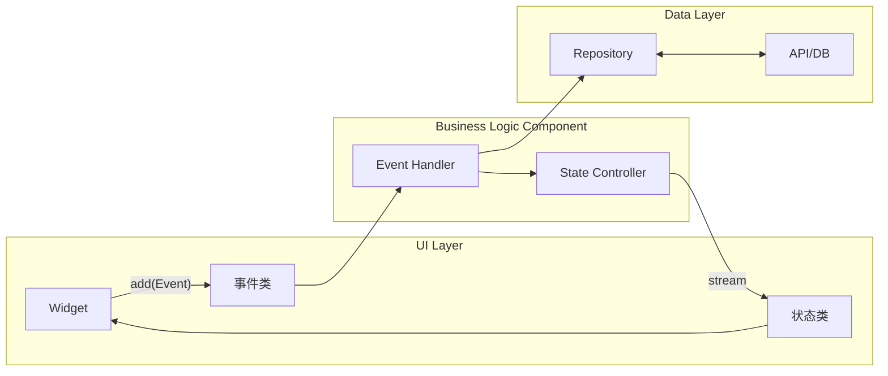

> **一句话概括：** BLoC 模式通过将业务逻辑抽象为独立的事件流与状态流，强制践行单向数据流原则，是 Flutter 中可测试性最强、事件可回溯的状态管理方案。

## 1. 背景与意义

BLoC（Business Logic Component）模式诞生于 2018 年 Google I/O，由 Paolo Soares 和 Cong Hui 提出。它的灵感来源于前端领域已经验证有效的响应式架构——React 的 Flux 模式和 Angular 的 Redux。但在 Flutter 的场景下，BLoC 做出了一个独特的选择：完全依赖 Dart 原生的 `Stream` API，不引入额外的第三方依赖。

在 BLoC 出现之前，Flutter 开发者通常直接在 StatefulWidget 的 `setState` 中混杂 UI 和业务逻辑。这种做法在页面简单时尚可接受，但当业务逻辑变得复杂——比如一个登录页面需要处理表单验证、网络请求、Token 存储、错误处理——StatefulWidget 的 build 方法会迅速膨胀到难以维护的程度。

BLoC 的核心贡献在于：
1. **关注点分离**：将业务逻辑从 UI 层彻底剥离
2. **可测试性**：BLoC 是纯 Dart 类，不依赖 Widget 树，可独立进行单元测试
3. **事件回溯**：所有状态变化都有对应的事件来源，可以记录、重放

区别于 Provider 的观察者模式，BLoC 采用事件驱动架构——每一次状态变化都始于一个事件（Event），经过 BLoC 处理器的变换，输出新的状态（State）。这种设计天然防止了"谁修改了状态"的追溯难题。

## 2. 概念与定义

### 2.1 BLoC 核心架构

BLoC 的架构可以用一句话概括：**Events In, States Out**。



三个核心角色：

- **Event**：描述"发生了什么"的不可变对象。例如 `LoginButtonPressed(username, password)`
- **Bloc**：业务逻辑核心，接收 Event，输出 State。包含一个或多个 Event Handler
- **State**：描述"应用当前处于什么状态"的不可变对象。例如 `LoginInitial`, `LoginLoading`, `LoginSuccess`, `LoginFailure`

### 2.2 flutter_bloc 库的关键组件

| 组件 | 职责 |
|---|---|
| `BlocProvider` | 注入 BLoC 实例到 Widget 树（类似于 Provider） |
| `BlocBuilder` | 根据状态变化重建 Widget |
| `BlocListener` | 监听状态变化执行一次性副作用（导航、弹窗） |
| `BlocConsumer` | BlocBuilder + BlocListener 的组合 |
| `RepositoryProvider` | 注入数据仓库层（无状态变更） |
| `context.read<T>()` | 获取 BLoC 实例（不监听） |
| `context.watch<T>()` | 获取 BLoC 实例并监听重建 |

## 3. 最小示例：计数器

```dart
import 'package:flutter/material.dart';
import 'package:flutter_bloc/flutter_bloc.dart';

// === 1. 定义事件 ===
// 事件是不可变类，描述"发生了什么"
abstract class CounterEvent {}

class CounterIncrementPressed extends CounterEvent {}

class CounterDecrementPressed extends CounterEvent {}

// === 2. 定义状态 ===
// 状态是不可变类，描述"当前应用处于什么状态"
class CounterState {
  final int count;
  const CounterState(this.count);
}

// === 3. 实现 BLoC ===
class CounterBloc extends Bloc<CounterEvent, CounterState> {
  CounterBloc() : super(const CounterState(0)) {
    // 注册事件处理器
    on<CounterIncrementPressed>((event, emit) {
      emit(CounterState(state.count + 1));
    });

    on<CounterDecrementPressed>((event, emit) {
      emit(CounterState(state.count - 1));
    });
  }
}

// === 4. 注入 BLoC 并构建 UI ===
void main() {
  runApp(
    BlocProvider(
      create: (_) => CounterBloc(),
      child: const MyApp(),
    ),
  );
}

class MyApp extends StatelessWidget {
  const MyApp({super.key});

  @override
  Widget build(BuildContext context) {
    return MaterialApp(
      home: Scaffold(
        appBar: AppBar(title: const Text('BLoC 计数器')),
        body: const Center(child: CounterView()),
        floatingActionButton: Column(
          mainAxisSize: MainAxisSize.min,
          children: [
            FloatingActionButton(
              onPressed: () => context.read<CounterBloc>().add(CounterIncrementPressed()),
              child: const Icon(Icons.add),
            ),
            const SizedBox(height: 8),
            FloatingActionButton(
              onPressed: () => context.read<CounterBloc>().add(CounterDecrementPressed()),
              child: const Icon(Icons.remove),
            ),
          ],
        ),
      ),
    );
  }
}

class CounterView extends StatelessWidget {
  const CounterView({super.key});

  @override
  Widget build(BuildContext context) {
    return BlocBuilder<CounterBloc, CounterState>(
      builder: (context, state) {
        return Text('计数: ${state.count}', style: const TextStyle(fontSize: 24));
      },
    );
  }
}
```

这个示例虽然简单，但已经展示了 BLoC 的完整工作流：
1. 用户点击按钮 → `add(CounterIncrementPressed)` 触发事件
2. BLoC 的 `on<CounterIncrementPressed>` 处理器接收事件
3. 处理器调用 `emit(CounterState(...))` 输出新状态
4. `BlocBuilder` 感知状态变化，重建 UI

## 4. 核心知识点拆解

### 4.1 事件与状态的不可变性

BLoC 强制要求 Event 和 State 都是不可变对象。这是有充分理由的：

```dart
// ❌ 错误：可变状态
class BadLoginState {
  bool isLoading = false;
  String? errorMessage;
  String? token;
}

// ✅ 正确：不可变状态
abstract class LoginState {}

class LoginInitial extends LoginState {}

class LoginLoading extends LoginState {}

class LoginSuccess extends LoginState {
  final String token;
  const LoginSuccess(this.token);
}

class LoginFailure extends LoginState {
  final String error;
  const LoginFailure(this.error);
}
```

不可变性的好处：
- **可预测性**：状态不会"在你背后"被修改
- **可回溯性**：可以通过记录状态流来重现 Bug
- **比较效率**：只需要比较引用地址就知道状态是否变化
- **并发安全**：不会出现竞态条件

### 4.2 BlocBuilder vs BlocListener vs BlocConsumer

这三个组件的选择是 BLoC 使用中容易混淆的地方：

```dart
// BlocBuilder：根据状态重建UI
// 适用：直接展示状态数据的 Widget
BlocBuilder<LoginBloc, LoginState>(
  builder: (context, state) {
    if (state is LoginLoading) {
      return const CircularProgressIndicator();
    }
    if (state is LoginSuccess) {
      return Text('欢迎回来，${state.username}');
    }
    return LoginForm();
  },
);

// BlocListener：执行一次性副作用（不重建 UI）
// 适用：导航、SnackBar、Dialog
BlocListener<LoginBloc, LoginState>(
  listener: (context, state) {
    if (state is LoginSuccess) {
      // 导航到主页（一次性副作用）
      Navigator.pushReplacementNamed(context, '/home');
    }
    if (state is LoginFailure) {
      // 显示错误提示（一次性副作用）
      ScaffoldMessenger.of(context).showSnackBar(
        SnackBar(content: Text(state.error)),
      );
    }
  },
  child: LoginForm(),
);

// BlocConsumer：需要同时做两件事时
BlocConsumer<LoginBloc, LoginState>(
  listener: (context, state) {
    // 副作用逻辑
    if (state is LoginSuccess) {
      Navigator.pushReplacementNamed(context, '/home');
    }
  },
  builder: (context, state) {
    // 重建 UI 逻辑
    if (state is LoginLoading) {
      return const CircularProgressIndicator();
    }
    return LoginForm();
  },
);
```

### 4.3 事件转换器（Event Transformer）

BLoC 提供了事件转换器来控制事件的处理方式。默认情况下，事件按 FIFO 顺序处理，但在某些场景下我们需要不同的策略：

```dart
class SearchBloc extends Bloc<SearchEvent, SearchState> {
  SearchBloc() : super(const SearchState()) {
    // 默认：按序处理
    on<FetchResults>(_onFetchResults);
  }

  // 默认的 transform 行为：来自 dart:async
  @override
  Stream<Transition<SearchEvent, SearchState>> transformEvents(
    Stream<SearchEvent> events,
    Stream<Transition<SearchEvent, SearchState>> Function(SearchEvent event) transitionFn,
  ) {
    // 自定义：使用 debounce，用户停止输入 300ms 后才触发搜索
    return events
        .debounceTime(const Duration(milliseconds: 300))
        .switchMap(transitionFn); // switchMap：只取最新事件
  }

  Future<void> _onFetchResults(FetchResults event, Emitter<SearchState> emit) async {
    emit(SearchState(isLoading: true));
    final results = await searchAPI(event.query);
    emit(SearchState(results: results));
  }
}
```

`switchMap` 配合 `debounceTime` 是搜索场景的黄金组合：用户连续输入时只会执行最后一次查询，避免浪费带宽。

### 4.4 测试：BLoC 最闪耀的优势

BLoC 的设计使其天然可测试，无需 Widget 树、无需 `pumpAndSettle`：

```dart
// 使用 bloc_test 库
blocTest<LoginBloc, LoginState>(
  '当登录成功时，状态变化应为 Initial → Loading → Success',
  build: () => LoginBloc(
    authRepository: MockAuthRepository()..mockLogin(returns: Token('abc')),
  ),
  act: (bloc) => bloc.add(LoginButtonPressed(
    username: 'test@example.com',
    password: 'password123',
  )),
  expect: () => [
    LoginLoading(),
    LoginSuccess(token: 'abc'),
  ],
);

blocTest<LoginBloc, LoginState>(
  '当登录失败时，状态变化应为 Initial → Loading → Failure',
  build: () => LoginBloc(
    authRepository: MockAuthRepository()..mockLogin(throws: AuthException('Invalid credentials')),
  ),
  act: (bloc) => bloc.add(LoginButtonPressed(
    username: 'wrong@example.com',
    password: 'wrong',
  )),
  expect: () => [
    LoginLoading(),
    LoginFailure(error: 'Invalid credentials'),
  ],
);
```

bloc_test 库内部会自动订阅 BLoC 的 stream，收集所有状态变更并断言是否匹配 `expect` 列表。

## 5. 实战案例：带缓存的 Github 用户搜索

```dart
// === 数据类型 ===
@immutable
class GithubUser {
  final String login;
  final String avatarUrl;
  final int repoCount;

  const GithubUser({
    required this.login,
    required this.avatarUrl,
    required this.repoCount,
  });

  factory GithubUser.fromJson(Map<String, dynamic> json) {
    return GithubUser(
      login: json['login'] as String,
      avatarUrl: json['avatar_url'] as String,
      repoCount: json['public_repos'] as int? ?? 0,
    );
  }
}

// === 数据仓库 ===
class UserRepository {
  final _cache = <String, GithubUser>{};

  Future<GithubUser> fetchUser(String username) async {
    // 缓存命中直接返回
    if (_cache.containsKey(username)) {
      return _cache[username]!;
    }

    final response = await http.get(
      Uri.parse('https://api.github.com/users/$username'),
    );

    if (response.statusCode != 200) {
      throw Exception('用户不存在');
    }

    final user = GithubUser.fromJson(json.decode(response.body));
    _cache[username] = user; // 写入缓存
    return user;
  }
}

// === 事件 ===
abstract class UserEvent {}

class FetchUser extends UserEvent {
  final String username;
  FetchUser(this.username);
}

// === 状态 ===
abstract class UserState {}

class UserInitial extends UserState {}

class UserLoading extends UserState {}

class UserLoaded extends UserState {
  final GithubUser user;
  UserLoaded(this.user);
}

class UserError extends UserState {
  final String message;
  UserError(this.message);
}

// === BLoC ===
class UserBloc extends Bloc<UserEvent, UserState> {
  final UserRepository repository;

  UserBloc({required this.repository}) : super(UserInitial()) {
    on<FetchUser>(_onFetchUser);
  }

  Future<void> _onFetchUser(FetchUser event, Emitter<UserState> emit) async {
    emit(UserLoading());

    try {
      final user = await repository.fetchUser(event.username);
      emit(UserLoaded(user));
    } catch (e) {
      emit(UserError(e.toString()));
    }
  }
}

// === UI ===
class UserSearchPage extends StatelessWidget {
  const UserSearchPage({super.key});

  @override
  Widget build(BuildContext context) {
    return BlocProvider(
      create: (_) => UserBloc(repository: UserRepository()),
      child: const _UserSearchView(),
    );
  }
}

class _UserSearchView extends StatelessWidget {
  const _UserSearchView();

  @override
  Widget build(BuildContext context) {
    return Scaffold(
      appBar: AppBar(title: const Text('GitHub 用户搜索')),
      body: Padding(
        padding: const EdgeInsets.all(16),
        child: Column(
          children: [
            TextField(
              decoration: const InputDecoration(
                hintText: '输入 GitHub 用户名',
                border: OutlineInputBorder(),
              ),
              onSubmitted: (value) {
                if (value.isNotEmpty) {
                  context.read<UserBloc>().add(FetchUser(value));
                }
              },
            ),
            const SizedBox(height: 20),
            Expanded(
              child: BlocConsumer<UserBloc, UserState>(
                listener: (context, state) {
                  if (state is UserError) {
                    ScaffoldMessenger.of(context).showSnackBar(
                      SnackBar(content: Text(state.message)),
                    );
                  }
                },
                builder: (context, state) {
                  if (state is UserInitial) {
                    return const Center(child: Text('输入用户名开始搜索'));
                  }
                  if (state is UserLoading) {
                    return const Center(child: CircularProgressIndicator());
                  }
                  if (state is UserLoaded) {
                    final user = state.user;
                    return Card(
                      child: Padding(
                        padding: const EdgeInsets.all(16),
                        child: Row(
                          children: [
                            CircleAvatar(
                              radius: 40,
                              backgroundImage: NetworkImage(user.avatarUrl),
                            ),
                            const SizedBox(width: 16),
                            Column(
                              crossAxisAlignment: CrossAxisAlignment.start,
                              mainAxisSize: MainAxisSize.min,
                              children: [
                                Text(user.login,
                                    style: const TextStyle(fontSize: 20, fontWeight: FontWeight.bold)),
                                Text('公开仓库: ${user.repoCount}'),
                              ],
                            ),
                          ],
                        ),
                      ),
                    );
                  }
                  if (state is UserError) {
                    return Center(child: Text('错误: ${state.message}'));
                  }
                  return const SizedBox.shrink();
                },
              ),
            ),
          ],
        ),
      ),
    );
  }
}
```

这个案例展示了 BLoC 处理异步操作的标准模式：Loading → Success/Error 三态切换，以及通过 `BlocConsumer` 同时处理 UI 重建和副作用。

## 6. 底层原理

### 6.1 从 Stream 出发

BLoC 的核心是 Dart 的 `Stream` API。理解 Stream 是理解 BLoC 的关键。

Dart 中有两种处理异步事件序列的方式：

- **Future**：表示一个最终会完成的值
- **Stream**：表示一系列随时间到达的值

BLoC 本质上将一个事件的输入 Stream 转换为状态的输出 Stream：

```dart
// BLoC 的核心理念表达为纯 Streams
Stream<State> transformEvents(Stream<Event> input) {
  return input.map((event) => mapEventToState(event));
}
```

实质上 Flutter 的 `Bloc` 类内部维护了两个 `StreamController`：

```dart
// 伪代码：Bloc 基类的核心实现
abstract class Bloc<Event, State> {
  final _eventController = StreamController<Event>.broadcast();
  final _stateController = StreamController<State>.broadcast();

  State get initialState;

  Bloc() {
    _eventController.stream
        .transform(transformEvents) // 事件转换器
        .listen((event) {
          // 调用 on<Event> 注册的处理器
          // 处理器通过 emit 输出新状态
        });
  }

  void add(Event event) {
    _eventController.add(event);
  }

  // emit 方法向外部暴露状态流
  void emit(State state) {
    _stateController.add(state);
  }

  // 外部订阅状态流
  Stream<State> get stream => _stateController.stream;
}
```

### 6.2 闭包与 emit 的安全性

BLoC v8 引入了 `Emitter` 函数式 API，替代了早期的 `yield` 和 `mapEventToState`：

```dart
// v7 及之前：通过 yield 返回状态
@override
Stream<CounterState> mapEventToState(CounterEvent event) async* {
  if (event is CounterIncrementPressed) {
    yield CounterState(state.count + 1);
  }
}

// v8+：通过 emit 函数输出状态
on<CounterIncrementPressed>((event, emit) {
  emit(CounterState(state.count + 1));
});
```

新 API 的一个重要安全特性是：**当 BLoC 被关闭时，不能继续调用 emit**。如果在异步操作完成后尝试 emit，而此时 BLoC 已被销毁（比如用户已经离开页面），就会出错。bloc 库通过一个内部 `_emitted` 标志和 `isClosed` 检查来防止这种情况：

```dart
// Emitter 内部实现示意
class Emitter<State> {
  final Bloc _bloc;

  void call(State state) {
    assert(!_bloc.isClosed, '不能在 BLoC 已关闭后 emit');
    _bloc._emitState(state);
  }
}
```

### 6.3 BlocProvider 与 InheritedWidget

`BlocProvider` 和 `Provider` 一样，底层也是基于 `InheritedWidget` 实现的：

```dart
class BlocProvider<T extends Bloc<dynamic, dynamic>> extends StatefulWidget {
  // ...
}

class _BlocProviderState<T> extends State<BlocProvider<T>> {
  T _bloc = widget.create(this);

  @override
  void dispose() {
    _bloc.close(); // 自动关闭 BLoC，释放 Stream
    super.dispose();
  }

  @override
  Widget build(BuildContext context) {
    return _BlocProviderInherited(
      bloc: _bloc,
      child: widget.child,
    );
  }
}
```

关键点：当 `BlocProvider` 从 Widget 树移除时，它会自动调用 `bloc.close()`，释放所有 Stream 资源。这也是为什么 BLoC 不需要手动管理生命周期的原因。

## 7. 高频面试题解析

### Q1: BLoC 中如何处理多个事件的线性依赖？

**答：** 使用 `sequential` 策略。默认情况下，BLoC 按 FIFO 顺序处理事件，即前一个事件处理完成后才处理下一个。如果需要并行处理，可以自定义 `transformEvents`。对于需要顺序等待的场景（比如"用户先登录，再获取个人资料"），可以在同一个事件处理器中用 await 顺序执行。

### Q2: BLoC 和 Redux 有什么本质区别？

**答：** BLoC 基于 Stream，是事件驱动的；Redux 基于 Store，是动作派发的。两者都遵循单向数据流，但 BLoC 更灵活——每个 BLoC 管理自己的状态域，而 Redux 使用单一的全局 Store。BLoC 的事件处理器是异步的（返回 void，通过 emit 输出），Redux 的 reducer 是纯同步函数（返回新 State）。BLoC 更适合模块化、可复用的状态逻辑。

### Q3: 什么时候使用 BlocBuilder，什么时候使用 BlocListener？

**答：** 如果新的状态直接影响 UI 展示（加载动画、列表数据、错误占位符），使用 BlocBuilder。如果新状态触发的是需要执行一次的动作（导航到新页面、弹出 SnackBar、启动 B 动画），使用 BlocListener。两者的区别视觉化了"数据响应"和"副作用响应"的鸿沟。

### Q4: BlocProvider 的 lazy 参数有什么作用？

**答：** `BlocProvider` 默认是懒加载的——BLoC 实例在首次被访问时才会创建。这对于不一定会被使用的状态很有意义（比如管理后台的某个不常用功能）。将 `lazy: false` 设为 false 后，BLoC 会立即创建，适用于需要立即开始监听事件的场景（比如从 API 实时拉取价格数据）。

### Q5: BLoC 测试中 expect 列表必须完整吗？

**答：** 是的。`blocTest` 的 `expect` 参数期望匹配从 act 执行到 BLoC 关闭或测试完成期间的所有状态变化。如果实际状态变化序列与 expect 列表不完全匹配，测试会失败。但可以使用 `skip` 参数跳过初始状态的验证，或者使用 `exceptions` 参数验证异常场景。

## 8. 总结与扩展

BLoC 模式通过严格的事件-状态二分法，为 Flutter 应用提供了高度结构化的状态管理方案。它的最大优势在于可测试性——纯 Dart 的 BLoC 类可以在毫秒级运行完整的业务逻辑测试，这是 Provider 和 GetX 难以企及的。

BLoC 的适用场景：
- **复杂的状态转换逻辑**：比如登录流程、下单流程
- **需要事件回溯和日志记录**：金融、合规类应用
- **团队协作**：业务逻辑与 UI 由不同人员开发
- **需要独立测试的场景**：核心业务流程

不适用场景：
- **简单的页面级状态**：Bloc 的样板代码对于计数器级别的场景过于冗余
- **高频状态更新**：大量事件的创建和 Stream 的调度有一定开销

推荐的架构分层：
1. **UI Layer**：Flutter Widget + BlocBuilder/BlocListener
2. **BLoC Layer**：事件处理和状态转换
3. **Repository Layer**：数据源抽象（API、缓存、本地存储）
4. **Data Layer**：网络请求、数据库操作

---

*下一篇预告：GetX 框架对比——论路由管理、依赖注入与响应式变量的取舍之道。*
