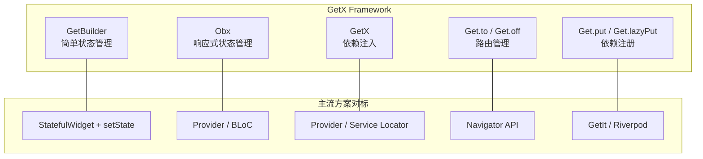

> **一句话概括：** GetX 是 Flutter 生态中功能最集成、代码量最精简的状态管理框架，以零依赖、高效率和响应式编程模型著称，但"大而全"的特性也使其在社区中存在争议。

## 1. 背景与意义

回顾 Flutter 状态管理的发展史，Google 官方推荐经历了 `setState → Provider → BLoC → Riverpod` 的演进。在这个过程中，各方案逐渐形成共识：状态管理应当轻量、可预测、易于测试。但社区中一直有一股"做减法"的呼声——开发者厌倦了复杂的模板代码、繁琐的 BlocProvider 嵌套和冗长的类型声明。

GetX 正是在这种背景下诞生的。它的作者 Jonny Borges 提出一个鲜明的观点：**状态管理应该和写一个普通的类一样简单**。GetX 不依赖 `Stream`、`InheritedWidget`或 `ChangeNotifier`，它的底层实现全部基于纯 Dart 代码，整个 GetX 库的体积仅约 200KB。

但 GetX 远不止是一个状态管理库。它包含三大核心模块：

1. **状态管理**：响应式变量与简单状态管理
2. **路由管理**：命名路由、参数传递、中间件、嵌套导航
3. **依赖注入**：实例管理、懒加载、自动释放

这种"三合一"的设计思路有深刻的价值：在一个典型的 Flutter 应用中，路由需要访问状态管理器中的实例，状态管理器需要依赖注入的实例。当这些模块属于同一个框架时，自然解决了跨模块的兼容性问题。代价是——如果只用到路由功能，你也被迫引入了状态管理和依赖注入的代码。

## 2. 概念与定义

### 2.1 GetX 的三驾马车



### 2.2 核心组件

| 组件 | 功能分类 | 特点 |
|---|---|---|
| **Obx** | 响应式状态 | 监听 `Rx` 变量，自动重建 |
| **GetBuilder** | 简单状态 | 手动调用 `update()` 重建 |
| **GetX<Controller>** | 状态注入+重建 | 类似 BlocBuilder+BlocProvider |
| **GetMaterialApp** | 根组件 | 替代 MaterialApp，启用的路由/SnackBar |
| **Get.put / lazyPut** | 依赖注入 | 注册实例 |
| **Get.find** | 依赖查找 | 获取已注册的实例 |
| **Get.to / Get.off / Get.offAll** | 路由导航 | 简化 Navigator |
| **Get.snackbar / Get.dialog** | 工具方法 | 全局 UI 组件 |

### 2.3 Rx 变量家族

GetX 定义了一系列以 `Rx` 前缀的响应式变量类型：

| 类型 | 对应原生类型 | 使用示例 |
|---|---|---|
| `RxInt` | `int` | `final count = 0.obs` |
| `RxString` | `String` | `final name = ''.obs` |
| `RxDouble` | `double` | `final price = 0.0.obs` |
| `RxList<T>` | `List<T>` | `final items = [].obs` |
| `RxBool` | `bool` | `final isChecked = false.obs` |
| `Rx<T>` | 任意类型 | `final user = User().obs` |

`.obs` 是 GetX 提供的一个扩展方法，它将普通值包装为响应式变量。这个设计让开发者可以用最少的代码将现有模型转化为响应式数据。

## 3. 最小示例：计数器

### 3.1 使用 Obx（响应式方式）

```dart
import 'package:flutter/material.dart';
import 'package:get/get.dart';

// 控制器
class CounterController extends GetxController {
  final count = 0.obs; // 响应式变量

  void increment() => count.value++;
  void decrement() => count.value--;
  void reset() => count.value = 0;
}

void main() {
  runApp(
    GetMaterialApp( // 替代 MaterialApp
      home: Scaffold(
        appBar: AppBar(title: const Text('GetX 计数器')),
        body: const Center(child: CounterView()),
        floatingActionButton: FloatingActionButton(
          onPressed: () => Get.find<CounterController>().increment(),
          child: const Icon(Icons.add),
        ),
      ),
    ),
  );
}

class CounterView extends StatelessWidget {
  const CounterView({super.key});

  @override
  Widget build(BuildContext context) {
    // 注入并获取控制器
    final controller = Get.put(CounterController());

    return Column(
      mainAxisSize: MainAxisSize.min,
      children: [
        // Obx 自动监听 count 的变化
        Obx(() => Text(
          '计数: ${controller.count.value}',
          style: const TextStyle(fontSize: 24),
        )),
        const SizedBox(height: 16),
        Row(
          mainAxisAlignment: MainAxisAlignment.center,
          children: [
            IconButton(
              icon: const Icon(Icons.remove),
              onPressed: controller.decrement,
            ),
            IconButton(
              icon: const Icon(Icons.refresh),
              onPressed: controller.reset,
            ),
          ],
        ),
      ],
    );
  }
}
```

注意这里的关键区别：
- 使用 `GetMaterialApp` 而不是 `MaterialApp`
- 控制器通过 `Get.put()` 注入，通过 `Get.find()` 获取
- 响应式变量用 `.obs` 后缀创建，用 `.value` 读写
- `Obx` 包裹的 Widget 自动监听内部所有 `Rx` 变量的变化

### 3.2 使用 GetBuilder（简单状态方式）

```dart
class CounterController extends GetxController {
  int count = 0;

  void increment() {
    count++;
    update(); // 手动通知重建
  }
}

class CounterView extends StatelessWidget {
  @override
  Widget build(BuildContext context) {
    final controller = Get.put(CounterController());

    return GetBuilder<CounterController>(
      builder: (ctrl) {
        return Text('计数: ${ctrl.count}', style: const TextStyle(fontSize: 24));
      },
    );
  }
}
```

**Obx vs GetBuilder 的选择原则：**
- **Obx**：状态变化频繁（如动画、实时数据），自动监听
- **GetBuilder**：状态变化不频繁（如偶尔的 UI 更新），手动控制，更轻量

## 4. 核心知识点拆解

### 4.1 响应式变量的精密监听

`Obx` 内部使用 Dart 的 `Proxy` 模式。当你访问一个 `Rx` 变量的值时，GetX 会在内部记录当前的上下文依赖。当该变量被修改时，GetX 会找到所有依赖它的 Obx 并触发重建。

```dart
class ShoppingController extends GetxController {
  final cartItems = <CartItem>[].obs;
  final discount = 0.0.obs;

  double get totalPrice {
    // Obx 只会监听 cartItems 的变化
    // 不会监听 discount（因为 discount 没有在 Obx 的 builder 中被读取）
    return cartItems.fold(0.0, (sum, item) => sum + item.price * item.quantity);
  }

  double get finalPrice {
    return totalPrice; // 如果 finalPrice 在 Obx 中被调用
    // 需要手动读取 discount.value 才能监听
  }
}
```

这里有一个常见陷阱：如果你在 Obx 的 builder 中没有显式访问某个 Rx 变量，那么该变量的变化就不会触发重建。这意味着你需要确保在 builder 中实际读取了所有关心的变量。

### 4.2 依赖注入的生命周期管理

GetX 的依赖注入包含多种注册方式，每种控制不同的生命周期：

```dart
class UserController extends GetxController {
  @override
  void onInit() {
    super.onInit();
    // 初始化逻辑
  }

  @override
  void onClose() {
    // 清理逻辑
    super.onClose();
  }
}

// 永久实例（不自动释放）：在应用生命周期中存在
Get.put(UserController());

// 懒加载实例（首次访问时创建）：
Get.lazyPut<UserController>(() => UserController());

// 延迟实例（等待分配时创建）：
Get.putAsync<UserController>(() async => UserController());

// 临时实例（离开页面时自动释放）：
Get.create<UserController>(() => UserController());
```

临时实例通过 `Get.create` 注册，每次 `Get.find()` 都会创建一个新实例，当触发它的 Widget 被销毁时，实例也会被销毁。这对于那些只在某个页面存在的状态非常有用。

### 4.3 路由管理的全面能力

GetX 的路由管理是 Navigator 2.0 的精简替代：

```dart
// 基本导航
Get.to(SecondPage());           // push
Get.off(SecondPage());          // pushReplacement
Get.offAll(HomePage());         // popUntil + push

// 命名路由（需要在 GetMaterialApp 中注册）
Get.toNamed('/profile/42');
Get.offNamed('/login');
Get.offAllNamed('/home');

// 传递参数
Get.to(DetailPage(), arguments: {'id': 42, 'title': '商品标题'});
// 接收方：final args = Get.arguments;

// 路由中间件
class AuthMiddleware extends GetMiddleware {
  @override
  RouteSettings? redirect(String? route) {
    // 检查是否登录
    final auth = Get.find<AuthController>();
    if (!auth.isLoggedIn) {
      return const RouteSettings(name: '/login');
    }
    return null;
  }
}

// 嵌套导航
Get.toNamed('/home/products/123');
```

路由中间件是 GetX 路由的特色。你可以在跳转前检查权限、记录日志、重定向或取消导航，所有逻辑都封装在 `GetMiddleware` 子类中，比 Flutter 原生的 `RouteAware` 更清晰。

### 4.4 全局工具：SnackBar、Dialog、BottomSheet

GetX 将这些常用的 UI 组件封装为静态方法，省去了 `ScaffoldMessenger` 和 `showDialog` 的样板：

```dart
// SnackBar - 不管页面层级多深，始终显示在最顶层
Get.snackbar(
  '提示', '操作成功',
  snackPosition: SnackPosition.TOP,
  backgroundColor: Colors.green,
  colorText: Colors.white,
  duration: const Duration(seconds: 3),
);

// Dialog
Get.defaultDialog(
  title: '确认删除',
  middleText: '此操作不可恢复',
  textConfirm: '删除',
  textCancel: '取消',
  onConfirm: () => Get.back(),
);

// BottomSheet
Get.bottomSheet(
  Container(
    padding: const EdgeInsets.all(16),
    child: Column(
      mainAxisSize: MainAxisSize.min,
      children: [
        ListTile(title: const Text('拍照'), onTap: () => Get.back()),
        ListTile(title: const Text('从相册选择'), onTap: () => Get.back()),
      ],
    ),
  ),
);
```

这些小功能虽然简单，但显著减少了代码量。对比原生实现，GetX 版 SnackBar 少写了约 15 行代码。

## 5. 实战案例：Todo 应用

构建一个完整的 Todo 应用，同时展示状态管理、依赖注入和路由：

```dart
// === 1. 数据模型 ===
class Todo {
  final String id;
  String title;
  bool completed;

  Todo({
    required this.id,
    required this.title,
    this.completed = false,
  });
}

// === 2. 持久化服务 ===
class StorageService extends GetxService {
  Future<void> saveTodos(List<Todo> todos) async {
    final prefs = await SharedPreferences.getInstance();
    final data = json.encode(todos.map((t) => {
      'id': t.id, 'title': t.title, 'completed': t.completed,
    }).toList());
    await prefs.setString('todos', data);
  }

  Future<List<Todo>> loadTodos() async {
    final prefs = await SharedPreferences.getInstance();
    final data = prefs.getString('todos');
    if (data == null) return [];
    final list = json.decode(data) as List;
    return list.map((e) => Todo(
      id: e['id'],
      title: e['title'],
      completed: e['completed'],
    )).toList();
  }
}

// === 3. 主控制器 ===
class TodoController extends GetxController {
  final todos = <Todo>[].obs;
  final isLoading = true.obs;
  final filter = 'all'.obs; // 'all', 'active', 'completed'

  int get pendingCount => todos.where((t) => !t.completed).length;
  int get completedCount => todos.where((t) => t.completed).length;

  List<Todo> get filteredTodos {
    switch (filter.value) {
      case 'active':
        return todos.where((t) => !t.completed).toList();
      case 'completed':
        return todos.where((t) => t.completed).toList();
      default:
        return todos;
    }
  }

  @override
  void onInit() {
    super.onInit();
    loadTodos();
  }

  Future<void> loadTodos() async {
    isLoading.value = true;
    final storage = Get.find<StorageService>();
    todos.value = await storage.loadTodos();
    isLoading.value = false;
  }

  void addTodo(String title) {
    todos.add(Todo(
      id: DateTime.now().millisecondsSinceEpoch.toString(),
      title: title,
    ));
    _save();
  }

  void toggleTodo(String id) {
    final index = todos.indexWhere((t) => t.id == id);
    if (index != -1) {
      todos[index].completed = !todos[index].completed;
      todos.refresh(); // 通知 List 变化
    }
    _save();
  }

  void deleteTodo(String id) {
    todos.removeWhere((t) => t.id == id);
    _save();
  }

  void setFilter(String f) {
    filter.value = f;
  }

  void _save() {
    Get.find<StorageService>().saveTodos(todos);
  }
}

// === 4. 根组件 ===
void main() async {
  WidgetsFlutterBinding.ensureInitialized();
  runApp(
    GetMaterialApp(
      initialBinding: BindingsBuilder(() {
        Get.put(StorageService());
        Get.put(TodoController());
      }),
      getPages: [
        GetPage(name: '/', page: () => const HomePage()),
        GetPage(name: '/add', page: () => const AddTodoPage()),
      ],
      home: const HomePage(),
    ),
  );
}

// === 5. 主页 ===
class HomePage extends StatelessWidget {
  const HomePage({super.key});

  @override
  Widget build(BuildContext context) {
    return Scaffold(
      appBar: AppBar(
        title: const Text('GetX Todo'),
        actions: [
          Obx(() {
            final ctrl = Get.find<TodoController>();
            return TextButton(
              onPressed: () => Get.toNamed('/add'),
              child: const Text('+ 添加'),
            );
          }),
        ],
      ),
      body: Column(
        children: [
          // 过滤器按钮
          Obx(() {
            final ctrl = Get.find<TodoController>();
            return Row(
              mainAxisAlignment: MainAxisAlignment.spaceEvenly,
              children: ['all', 'active', 'completed'].map((f) {
                return ChoiceChip(
                  label: Text(f == 'all' ? '全部' : f == 'active' ? '进行中' : '已完成'),
                  selected: ctrl.filter.value == f,
                  onSelected: (_) => ctrl.setFilter(f),
                );
              }).toList(),
            );
          }),
          // 列表
          Expanded(
            child: Obx(() {
              final ctrl = Get.find<TodoController>();
              if (ctrl.isLoading.value) {
                return const Center(child: CircularProgressIndicator());
              }
              if (ctrl.filteredTodos.isEmpty) {
                return const Center(child: Text('暂无待办事项'));
              }
              return ListView.builder(
                itemCount: ctrl.filteredTodos.length,
                itemBuilder: (context, index) {
                  final todo = ctrl.filteredTodos[index];
                  return ListTile(
                    leading: Checkbox(
                      value: todo.completed,
                      onChanged: (_) => ctrl.toggleTodo(todo.id),
                    ),
                    title: Text(
                      todo.title,
                      style: TextStyle(
                        decoration: todo.completed ? TextDecoration.lineThrough : null,
                      ),
                    ),
                    trailing: IconButton(
                      icon: const Icon(Icons.delete, color: Colors.red),
                      onPressed: () => ctrl.deleteTodo(todo.id),
                    ),
                  );
                },
              );
            }),
          ),
          // 底部统计
          Obx(() {
            final ctrl = Get.find<TodoController>();
            return Padding(
              padding: const EdgeInsets.all(16),
              child: Text(
                '共 ${ctrl.todos.length} 项，${ctrl.pendingCount} 项待完成',
                style: const TextStyle(color: Colors.grey),
              ),
            );
          }),
        ],
      ),
    );
  }
}

// === 6. 添加页面 ===
class AddTodoPage extends StatelessWidget {
  const AddTodoPage({super.key});
  final titleController = TextEditingController();

  @override
  Widget build(BuildContext context) {
    return Scaffold(
      appBar: AppBar(title: const Text('添加待办')),
      body: Padding(
        padding: const EdgeInsets.all(16),
        child: Column(
          children: [
            TextField(
              controller: titleController,
              decoration: const InputDecoration(
                hintText: '输入待办事项',
                border: OutlineInputBorder(),
              ),
              autofocus: true,
            ),
            const SizedBox(height: 20),
            SizedBox(
              width: double.infinity,
              child: ElevatedButton(
                onPressed: () {
                  if (titleController.text.isNotEmpty) {
                    Get.find<TodoController>().addTodo(titleController.text);
                    Get.back(); // 返回上一页
                  }
                },
                child: const Text('添加'),
              ),
            ),
          ],
        ),
      ),
    );
  }
}
```

这个 Todo 应用展示了 GetX 的核心能力：`Obx` 自动监听多个 Rx 变量的变化（todos、filter、isLoading）；`GetMaterialApp` 管理页面路由；`BindingsBuilder` 实现依赖注入初始化；`Get.find()` 在任意层级获取控制器。

## 6. 底层原理

### 6.1 Rx 变量的实现

GetX 的响应式变量核心是其内部维护的 `_subscriptions` 和 `_observers` 列表。当一个 `Obx` 的 builder 函数被调用时，GetX 会创建一个 `_ObsWidget` 观察者，记录当前 builder 中访问了哪些 Rx 变量。

```dart
// 伪代码：Rx 变量的核心实现
class Rx<T> {
  T _value;
  final _observers = <RxObserver>{};

  T get value {
    // 在 builder 执行期间，将当前观察者注册为依赖
    _currentObserver?.addRx(this);
    return _value;
  }

  set value(T newValue) {
    if (_value != newValue) {
      _value = newValue;
      // 通知所有观察者重建
      for (final observer in _observers) {
        observer.rebuild();
      }
    }
  }
}
```

这里的关键在于**全局变量** `_currentObserver`。当 `Obx` 开始构建时，它会将自己设置为 `_currentObserver`，读取所有它访问的 Rx 变量，这些变量自动将其加入观察者列表。构建完成后恢复 `_currentObserver` 为 null。这就是"自动跟踪依赖"的实现原理。

### 6.2 Obx 的工作机制

`Obx` 本身是一个 `StatelessWidget`：

```dart
class Obx extends StatelessWidget {
  final Widget Function() builder;

  const Obx(this.builder);

  @override
  Widget build(BuildContext context) {
    return _ObxState(
      builder: builder,
    );
  }
}

class _ObxState extends State<Obx> {
  @override
  Widget build(BuildContext context) {
    // 触发 builder 重建
    return widget.builder();
  }

  // 当 Rx 变量变化时，通过某种方式触发 setState
  void onRxChanged() {
    setState(() {});
  }
}
```

`_ObxState` 与 Rx 变量之间的绑定是在第一次 build 时完成的。之后每当 Rx 变量的值变化，它就会调 `onRxChanged` 触发 `setState` 重建 Widget。由于 `setState` 只会重建 `_ObxState` 本身（及其子 Widget），不会影响父 Widget，自然实现了最小重建范围。

### 6.3 Get.put 与 Get.find 的实例管理

GetX 内部维护一个全局的 `Map<Type, InstanceFactory>` 作为实例注册表：

```dart
// 伪代码：依赖注入的核心
class GetInstance {
  static final _map = <Type, _InstanceFactory>{};

  static void put<T>(T dependency) {
    _map[T] = _InstanceFactory._(dependency);
  }

  static T find<T>() {
    final factory = _map[T];
    if (factory == null) {
      throw '未找到类型 $T 的实例';
    }
    return factory.instance as T;
  }
}
```

`Get.create` 使用 `_InstanceFactory`，每次 `find` 时都调用创建函数产生新实例。而 `Get.put` 只创建一次并缓存。`Get.lazyPut` 则在首次 `find` 时才执行创建函数。

当使用了 `GetMaterialApp`，并且在 page 的 `binding` 中注册了控制器，这些控制器会在页面从路由栈移除时自动调用 `onClose()`。

## 7. 高频面试题解析

### Q1: GetX 和 Provider 的核心区别在哪里？

**答：** Provider 基于 Flutter 的 InheritedWidget，需要 BuildContext 来获取状态；GetX 基于纯 Dart 的全局实例管理，不需要 BuildContext。这意味着 GetX 可以在任何 Dart 代码中获取状态（包括 Service、Repository 等非 Widget 代码），这是 Provider 做不到的。代价是 GetX 的全局状态不适合多实例场景。

### Q2: Obx 和 GetBuilder 有什么区别？如何选择？

**答：** Obx 自动跟踪 Rx 变量的依赖，变量变化时自动重建；GetBuilder 需要手动调用 `update()`。Obx 适合状态频繁变化（表单输入、计时器、滚动位置），其自动追踪减少了开发者维护依赖列表的心智负担。GetBuilder 适合偶尔变化或计算开销大的状态（比如列表重新排序），手动控制有助于精确优化。两种可以在同一个控制器中混合使用。

### Q3: GetX 为什么在大型项目中不被广泛推荐？

**答：** 原因有三：第一，GetX 使用全局单例管理所有实例，在大项目中容易导致难以追踪的单例依赖链；第二，GetX 的紧耦合设计使得替换其中某个模块变得困难；第三，GetX 在社区中的争议较大，很多团队担心其维护风险和人才获取难度。Riverpod 和 BLoC 通常被视为大型项目的更优选。

### Q4: GetMaterialApp 和 MaterialApp 的区别？

**答：** GetMaterialApp 是 MaterialApp 的子类，额外添加了对 GetX 全局功能的支持：路由管理（`Get.toNamed`）、全局 SnackBar/Dialog、路由中间件、Binding 自动赋值。如果没有 GetMaterialApp，Get.to 等路由方法将无法正常工作。但 GetMaterialApp 不会影响 MaterialApp 原有的任何功能。

### Q5: GetX 的响应式变量如何做到内存高效？

**答：** GetX 的 Rx 变量只在有观察者时才维护依赖列表。如果没有任何 Obx 或 GetX<Controller> 监听某个 Rx 变量，它的 setter 不会触发任何重建动作。此外，RxList 和 RxMap 提供了 `refresh()` 方法，适合在修改了列表元素内部属性后通知观察者，无需重新创建整个列表的引用。

## 8. 总结与扩展

GetX 提供了 Flutter 生态中最极致的"少写代码"体验。它的响应式变量系统让状态管理变得直观、路由管理比原生 Navigator 简洁、依赖注入全局可用。对于中小型项目、快速原型开发、个人项目，GetX 是效率最高的选择。

但"全能"也意味着更高的耦合度。如果你正在构建一个需要长期维护的大型应用，应当评估 GetX 的紧耦合是否与你的团队工程实践相契合。很多团队会选择 GetX 的灵感替代品——**Riverpod**，它保留了声明式的特点，但解除了与 Widget 树的绑定，同时避免了全局单例的问题。

**GetX 与其他方案的对比总结：**

| 维度 | GetX | Provider | BLoC | Riverpod |
|---|---|---|---|---|
| 学习曲线 | 低 | 中 | 高 | 中 |
| 代码量 | 极少 | 少 | 中 | 少 |
| 依赖 BuildContext | 否 | 是 | 是 | 否 |
| 可测试性 | 中 | 中 | 高 | 高 |
| 大项目友好度 | 低 | 中 | 高 | 高 |
| 功能范围 | 全栈 | 状态管理 | 状态管理 | 状态管理 |

---

*下一篇预告：口述 Flutter 状态管理方案对比——没有完美的方案，只有最适合的方案。*
