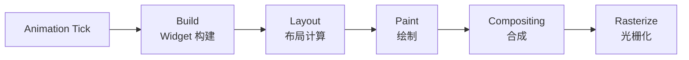
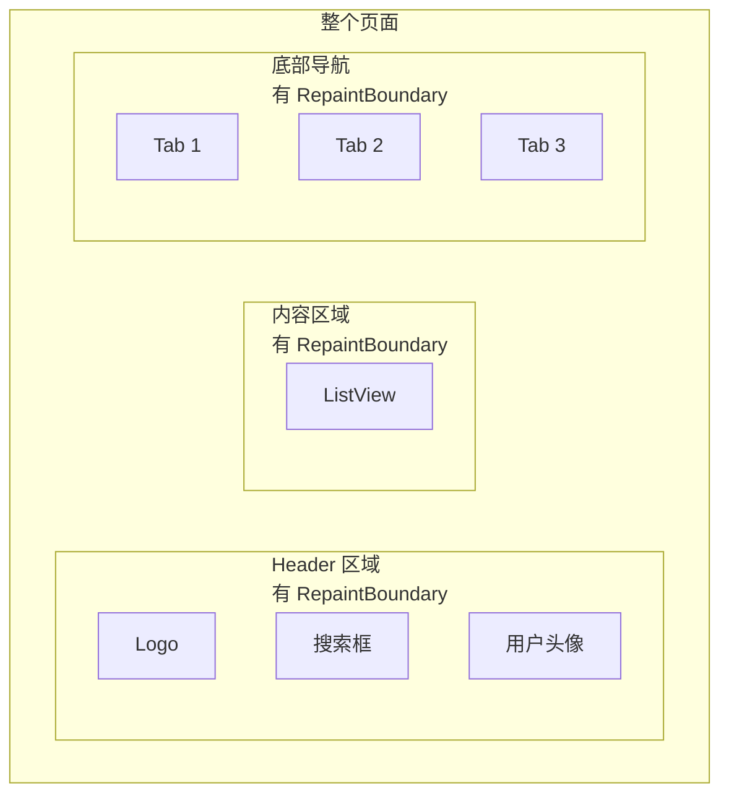

> **一句话概括：** Flutter 的渲染性能优化核心在于理解其三层架构（Widget → Element → RenderObject）的更新机制，通过 RepaintBoundary、const Widget、避免布局抖动等手段，最小化每一帧的绘制工作量。

## 1. 背景与意义

Flutter 最引以为傲的技术能力就是其自研的渲染引擎——Skia（Flutter 3.x 起默认为 Impeller）。与 React Native 桥接到原生控件不同，Flutter 自己绘制每一个像素，不依赖平台的原生 UI 组件。这种"自己画"的模式带来了跨平台一致性，但也让渲染性能的责任完全落在了开发者肩上。

在 iOS 上，Flutter 通常以 60fps 为目标；在支持 ProMotion 的设备上，可以做到 120fps。留给每一帧的时间分别约为 16ms 和 8ms。在这段时间内，Flutter 需要完成：动画触发 → Widget 构建 → Element 更新 → RenderObject 布局 → RenderObject 绘制 → 合成 → 渲染到屏幕。任何一个环节超时，都会导致掉帧（jank）。

优化前的典型症状：
- 列表滚动时明显卡顿
- 页面切换动画不流畅
- 复杂布局下触摸响应延迟
- 频繁全帧重绘（尤其是动画运行时周围的静态内容也跟着闪烁）

理解渲染性能优化，本质上是要理解 Flutter 在"什么情况下会重绘什么"、"什么时候会触发全量重建"、"如何高精度地控制更新范围"。

## 2. 概念与定义

### 2.1 Flutter 渲染流水线



每一帧，Flutter 依次执行以下步骤：

1. **Build**：调用 Widget 的 `build` 方法生成新的 Widget 树
2. **Layout**：计算 RenderObject 的尺寸和位置
3. **Paint**：将 RenderObject 绘制到图层（Layer）
4. **Compositing**：将多个 Layer 合成到最终画面
5. **Rasterize**：将合成的画面交给 GPU 渲染

### 2.2 RepaintBoundary 的核心角色

`RepaintBoundary` 是性能优化的核心武器。它的作用是在 Widget 树中插入一个"绘制边界"——边界内部的 Widget 被重绘时，不会影响到边界外部的 Widget。



当 `ListView` 滚动时，只有 `Body` 区域内的 RepaintBoundary 需要重绘，`Head` 和 `Foot` 区域的绘制结果被缓存起来，不参与重绘。

## 3. 最小示例：有边界 vs 无边界

```dart
// === 无 RepaintBoundary：修改任何一个部分都会触发全页面重绘 ===
class NoBoundaryExample extends StatefulWidget {
  @override
  State<NoBoundaryExample> createState() => _NoBoundaryExampleState();
}

class _NoBoundaryExampleState extends State<NoBoundaryExample> {
  Color _boxColor = Colors.blue;
  int _counter = 0;

  @override
  Widget build(BuildContext context) {
    // 每次 setState 都会运行这个 build 方法
    // 生成的整个 Column 都被标记为需要重绘
    print('全页面重建！');
    return Scaffold(
      appBar: AppBar(title: const Text('无边界')),
      body: Column(
        children: [
          // 即使动画部分不依赖 _counter，也会随 _counter 重建
          AnimatedContainer(
            duration: const Duration(seconds: 1),
            width: 100, height: 100,
            color: _boxColor,
          ),
          const SizedBox(height: 20),
          Text('计数器: $_counter', style: const TextStyle(fontSize: 24)),
          ElevatedButton(
            onPressed: () => setState(() => _counter++),
            child: const Text('增加计数'),
          ),
          ElevatedButton(
            onPressed: () => setState(() {
              _boxColor = _boxColor == Colors.blue ? Colors.red : Colors.blue;
            }),
            child: const Text('切换颜色'),
          ),
        ],
      ),
    );
  }
}

// === 有 RepaintBoundary：各部分独立重绘 ===
class WithBoundaryExample extends StatefulWidget {
  @override
  State<WithBoundaryExample> createState() => _WithBoundaryExampleState();
}

class _WithBoundaryExampleState extends State<WithBoundaryExample> {
  Color _boxColor = Colors.blue;
  int _counter = 0;

  @override
  Widget build(BuildContext context) {
    print('外层重建：仅设置按钮和条件变化时触发');
    return Scaffold(
      appBar: AppBar(title: const Text('有边界')),
      body: Column(
        children: [
          // 动画区域独立绘制
          RepaintBoundary(
            child: AnimatedContainer(
              duration: const Duration(seconds: 1),
              width: 100, height: 100,
              color: _boxColor,
            ),
          ),
          const SizedBox(height: 20),
          // 文本区域独立绘制
          RepaintBoundary(
            child: Text('计数器: $_counter', style: const TextStyle(fontSize: 24)),
          ),
          const SizedBox(height: 10),
          Row(
            mainAxisAlignment: MainAxisAlignment.spaceEvenly,
            children: [
              ElevatedButton(
                onPressed: () => setState(() => _counter++),
                child: const Text('增加计数'),
              ),
              ElevatedButton(
                onPressed: () => setState(() {
                  _boxColor = _boxColor == Colors.blue ? Colors.red : Colors.blue;
                }),
                child: const Text('切换颜色'),
              ),
            ],
          ),
        ],
      ),
    );
  }
}
```

通过 Flutter DevTools 的"Repaint Rainbow"功能可以直观看到区别：有 RepaintBoundary 时，只有变化的区域闪烁绿色（表示被重绘），其他区域保持稳定。

## 4. 核心知识点拆解

### 4.1 const Widget：编译时确定，运行时零开销

Flutter 中最容易被忽视的性能优化是 `const` 构造函数：

```dart
// ❌ 非 const：每次 build 都创建新实例
class BadIcon extends StatelessWidget {
  @override
  Widget build(BuildContext context) {
    return Padding(
      padding: EdgeInsets.all(8.0), // 每次创建新 EdgeInsets
      child: Icon(
        Icons.star,
        color: Colors.amber, // 每次创建新 Color 对象
      ),
    );
  }
}

// ✅ const：编译时确定，每次复用同一个实例
class GoodIcon extends StatelessWidget {
  const GoodIcon({super.key}); // const 构造函数

  @override
  Widget build(BuildContext context) {
    return const Padding(
      padding: EdgeInsets.all(8.0), // const EdgeInsets
      child: Icon(
        Icons.star,
        color: Colors.amber, // const Color
      ),
    );
  }
}
```

`const` 的好处不仅在于减少了对象创建的开销（GC 压力），更重要的是：Flutter 的 Element 在对比新旧 Widget 时，如果发现新旧 Widget 是同一个 const 实例（引用相等），会完全跳过该子树的构建和布局过程。

所以 `const` 的实际影响是：**减少了整个子树的 build 调用**。

### 4.2 shouldRepaint 与 shouldRebuild

自定义 RenderObject 或 CustomPainter 时，需要实现 `shouldRepaint` 方法。这个方法决定了当新数据传入时是否需要重新绘制：

```dart
class LineChartPainter extends CustomPainter {
  final List<double> dataPoints;
  final Color lineColor;

  LineChartPainter({required this.dataPoints, required this.lineColor});

  @override
  void paint(Canvas canvas, Size size) {
    final paint = Paint()
      ..color = lineColor
      ..strokeWidth = 2.0
      ..style = PaintingStyle.stroke;

    final path = Path();
    for (int i = 0; i < dataPoints.length; i++) {
      final x = size.width * i / (dataPoints.length - 1);
      final y = size.height - (dataPoints[i] / 100) * size.height;
      if (i == 0) {
        path.moveTo(x, y);
      } else {
        path.lineTo(x, y);
      }
    }
    canvas.drawPath(path, paint);
  }

  @override
  bool shouldRepaint(covariant LineChartPainter oldDelegate) {
    // 只有数据点或颜色变化时才需要重绘
    return oldDelegate.lineColor != lineColor ||
           !listEquals(oldDelegate.dataPoints, dataPoints);
  }

  @override
  bool? hitTest(Offset position) {
    return false; // 不参与命中测试，提高性能
  }
}
```

### 4.3 Did you know: Opacity 的性能陷阱

`Opacity` widget 的代价远远超出很多人的认知。创建一个 `Opacity` 会创建一个单独的绘制图层，该图层需要先独立渲染，然后再与背景合成。这在动画场景中尤为昂贵：

```dart
// ❌ 昂贵的淡入效果（创建新图层）
Opacity(
  opacity: animation.value,
  child: expensiveWidget,
)

// ✅ 推荐的淡入方式（不创建新图层，由 GPU 处理）
FadeTransition(
  opacity: animation,
  child: expensiveWidget,
)

// ❌ 裁剪性能对比
ClipRRect( // 创建裁剪图层
  borderRadius: BorderRadius.circular(12),
  child: myWidget,
)

// ✅ 如果只是圆角，用 Container 的装饰属性
Container(
  decoration: BoxDecoration(
    borderRadius: BorderRadius.circular(12),
  ),
  child: myWidget,
)
```

`FadeTransition` 工作在合成器（compositor）层面，通过调整图层的透明度而不实际重新绘制其内容来实现淡入淡出。相比之下，`Opacity` 需要在 GPU 端为子 Widget 创建一个离屏缓冲区。

### 4.4 Keys：复用 Element 的关键

在动态列表中，Keys 决定了 Flutter 是复用现有的 Element 还是销毁重建：

```dart
// 没有 Key：Flutter 按位置匹配 Widget
// 当列表顺序变化时，所有 Element 都会重新创建
ListView.builder(
  itemCount: items.length,
  itemBuilder: (context, index) {
    return _ListItem(item: items[index]);
  },
);

// 有 ValueKey：Flutter 按 id 匹配 Element
// 列表排序变化时，Element 会跟随对应的 Widget 移动
ListView.builder(
  itemCount: items.length,
  itemBuilder: (context, index) {
    return _ListItem(
      key: ValueKey(items[index].id), // 唯一标识
      item: items[index],
    );
  },
);
```

没有 Key 时，如果列表顺序变化——比如添加了一个元素到顶部——所有后续项都会被从零重建。有了 Key，Flutter 会把我现有 Element 移动到新的位置，保留它们的内部状态（比如滚动位置、输入框内容、动画进度）。

## 5. 实战案例：复杂仪表盘页面

这是一个同时包含实时数据、动画、静态布局的复杂页面：

```dart
class DashboardPage extends StatefulWidget {
  @override
  State<DashboardPage> createState() => _DashboardPageState();
}

class _DashboardPageState extends State<DashboardPage>
    with SingleTickerProviderStateMixin {
  late AnimationController _animController;
  late Animation<double> _pulseAnimation;
  int _unreadCount = 0;

  @override
  void initState() {
    super.initState();
    _animController = AnimationController(
      vsync: this,
      duration: const Duration(seconds: 2),
    )..repeat(reverse: true);

    _pulseAnimation = Tween<double>(begin: 1.0, end: 1.2).animate(
      CurvedAnimation(parent: _animController, curve: Curves.easeInOut),
    );
  }

  @override
  Widget build(BuildContext context) {
    return Scaffold(
      appBar: AppBar(
        title: const Text('性能仪表盘'),
        actions: [
          // 未读消息数量在变化时不会影响其他部分
          RepaintBoundary(
            child: _UnreadBadge(count: _unreadCount),
          ),
        ],
      ),
      body: Column(
        children: [
          // 实时数据区域——有动画，独立绘制
          RepaintBoundary(
            child: _RealtimeChart(
              pulseAnimation: _pulseAnimation,
              animController: _animController,
            ),
          ),
          const SizedBox(height: 12),
          // 静态指标面板——永不变化的 const Widget
          const _MetricsPanel(),
          const SizedBox(height: 12),
          // 用户列表区域，点击新增按钮时才变化
          Expanded(
            child: RepaintBoundary(
              child: _UserList(
                onRefresh: () {
                  setState(() => _unreadCount++);
                },
              ),
            ),
          ),
        ],
      ),
      floatingActionButton: RepaintBoundary(
        child: ScaleTransition(
          scale: _pulseAnimation,
          child: FloatingActionButton(
            onPressed: () => setState(() => _unreadCount++),
            child: const Icon(Icons.add),
          ),
        ),
      ),
    );
  }

  @override
  void dispose() {
    _animController.dispose();
    super.dispose();
  }
}

// 静态面板——用 const 保证不被重建
class _MetricsPanel extends StatelessWidget {
  const _MetricsPanel();

  @override
  Widget build(BuildContext context) {
    return Card(
      margin: const EdgeInsets.symmetric(horizontal: 16),
      child: Padding(
        padding: const EdgeInsets.all(16),
        child: Row(
          mainAxisAlignment: MainAxisAlignment.spaceAround,
          children: const [
            _MetricItem(label: '用户量', value: '12,345'),
            _MetricItem(label: '在线率', value: '98.7%'),
            _MetricItem(label: '响应时间', value: '42ms'),
          ],
        ),
      ),
    );
  }
}

// const 子组件
class _MetricItem extends StatelessWidget {
  final String label;
  final String value;

  const _MetricItem({required this.label, required this.value});

  @override
  Widget build(BuildContext context) {
    return Column(
      children: [
        Text(value, style: const TextStyle(fontSize: 20, fontWeight: FontWeight.bold)),
        Text(label, style: const TextStyle(color: Colors.grey)),
      ],
    );
  }
}
```

这个页面中的关键优化点：
1. `_RealtimeChart` 和 `_UnreadBadge` 都有独立的 `RepaintBoundary`，即使动画每帧触发重建，也不会影响其他区域
2. `_MetricsPanel` 使用 `const` 构造函数，整个子树标志为编译时常量，绝不参与重建
3. `ScaleTransition`（而非 Transform + Animation）让 FAB 动画运行在合成层
4. `RepaintBoundary` 包裹动画 `FloatingActionButton`，脉冲动画仅影响该按钮的绘制

## 6. 底层原理

### 6.1 Flutter 的三棵树

要理解性能优化，必须先理解 Flutter 的"三棵树"：

1. **Widget 树**：配置的描述，轻量、不可变、可被丢弃重建
2. **Element 树**：Widget 的实例化，持有关键引用、负责管理生命周期
3. **RenderObject 树**：真正的布局和绘制实体

```dart
// Widget 只是配置类
class MyWidget extends StatelessWidget {
  @override
  Widget build(BuildContext context) {
    return Container(
      padding: EdgeInsets.all(16),
      child: Text('Hello'),
    );
  }
}

// Element 树的更新策略
// 当 Widget 树变化时，Flutter 会：
// 1. 对比新旧 Widget 树（通过 canUpdate 判断类型和 Key）
// 2. 如果可以复用 Element，更新其配置
// 3. 如果 Element 的 Widget 被标记为需要重建，标记其为 dirty
```

关键点：**Widget 的不可变性**意味着每次 build 都会创建新的 Widget 对象。但 Element 和 RenderObject 会尽可能复用。`const` 的魔力在于：如果新旧 Widget 是同一个 const 实例，Element 的 `updateChild` 会直接返回，跳过所有后续处理。

### 6.2 脏区标记与布局

Flutter 采用一种称为"脏区标记"（dirty-region marking）的增量更新策略。当你调用 `setState` 时：

1. 当前 State 的 Element 被标记为 dirty（需要重新 build）
2. build 后产生新的 Widget 树
3. 新 Widget 树与旧 Element 树比较差异
4. 只有实际发生变化的 RenderObject 被标记为"需要布局"或"需要绘制"
5. 布局从 dirty 节点开始，向子节点传播
6. 绘制从 dirty 节点开始，向上找到第一个 `RepaintBoundary`

### 6.3 RepaintBoundary 的实现

`RepaintBoundary` 本质上是一个特殊的 RenderObject。它在绘制树中创建了一个新的 `OffsetLayer`：

```dart
// 伪代码：RepaintBoundary 的 RenderObject
class RenderRepaintBoundary extends RenderProxyBox {
  @override
  void paint(PaintingContext context, Offset offset) {
    // 关键：创建一个新的 Layer，作为绘制缓存容器
    context.pushLayer(
      OffsetLayer(),
      super.paint,
      offset,
    );
  }

  @override
  bool get isRepaintBoundary => true;
}
```

当 `isRepaintBoundary` 为 `true` 时，`PaintingContext` 不会将绘制命令发送到父 Layer，而是创建一个新的子 Layer。这个子 Layer 的内容被缓存到一张离屏位图中。后续如果 RepaintBoundary 内部的某个 RenderObject 标记为需要重绘，只有这个子 Layer 会更新，父 Layer 直接使用缓存的位图结果。

这就是为什么 RepaintBoundary 能隔离重绘——它本质上是一个位图缓存层。

### 6.4 Impeller 渲染引擎的优化

Flutter 3.x 引入的 Impeller 引擎彻底改变了光栅化阶段的性能特征。与 Skia 不同，Impeller 预编译了所有着色器，消除了所谓的"着色器编译卡顿"（shader compilation jank）。这对性能优化有直接影响：以前需要避免的某些绘制操作（比如复杂的 BlendMode、自定义 Shader）在 Impeller 下不再昂贵。

## 7. 高频面试题解析

### Q1: RepaintBoundary 的工作原理是什么？什么场景下一定要用？

**答：** RepaintBoundary 通过创建独立的绘制 Layer 来缓存子树的绘制结果。当子树的绘制状态变化时，只重绘该 Layer 的内容，不影响父层级的缓存。**必须使用**的场景：列表滚动中的复杂 Item、独立的动画组件、需要频繁更新但范围明确的区域。但不应该滥用——每个 RepaintBoundary 都意味着额外的离屏渲染和内存占用。

### Q2: const Widget 为什么能提升性能？

**答：** const Widget 有两个层面的优化。第一，减少对象创建，减轻 GC 压力。第二，在 Element 树的 diff 过程中，如果新旧 Widget 是同一个实例（引用相同），Element 的 `updateChild` 会直接返回，跳过整个子树的 build、layout、paint 流程。在大型列表的静态项中，这个优化非常显著。

### Q3: Opacity 和 FadeTransition 有什么区别？

**答：** Opacity 创建了一个新的绘制 Layer，子 Widget 先在离屏缓冲区渲染，再以指定透明度合成到父层级。FadeTransition 直接在合成阶段调整图层的透明度。两者的效果相同，但 FadeTransition 避免了一次离屏渲染。类似的还有 ClipRect vs ClipRRect：前者不创建新 Layer，后者会。

### Q4: 什么是"布局抖动"（layout jank）？如何避免？

**答：** 布局抖动发生在 widget 的尺寸频繁变化导致其父节点不断重新布局的情况。常见于：未指定尺寸的网络图片加载、延迟加载的内容撑开布局、动画改变尺寸。避免方法：指定占位尺寸（`placeholder`）、使用 `AnimatedContainer` 而不是直接修改大小、预加载图片尺寸。

### Q5: Flutter DevTools 中如何定位渲染性能问题？

**答：** 用 Flutter DevTools 的 Performance 页面。开启"Repaint Rainbow"可以直观看到哪些区域正在重绘——闪烁绿色越频繁，越需要优化。使用"Track Builds"和"Track Layouts"标记后，可以精确看到每个 Widget 的构建和布局耗时。开启"Enable Shader Compilation"追踪可以帮助定位 Impeller 或 Skia 的着色器编译卡顿。

## 8. 总结与扩展

Flutter 的渲染性能优化不是靠一个银弹解决的。你需要一套"工具箱"：

- **RepaintBoundary** 负责隔离绘制区域
- **const Widget** 负责避免无谓重建
- **Keys** 负责复用 Element 状态
- **Opacity 替代品**（FadeTransition、AnimatedOpacity）避免离屏渲染
- **LayoutBuilder** 替代 MediaQuery 避免不必要的重建

最有效的优化策略永远是**测量→优化→测量**的循环。不要凭感觉猜测哪里慢，先用 DevTools 的 Performance 面板定位真正的问题，再有针对性地优化。

在 Flutter 3.x + Impeller 的架构下，很多过去的性能规则需要改写。Impeller 消除了着色器编译卡顿、改进了文本渲染管线、更好的 GPU 利用率。但基础的"三棵树"模型和 RepaintBoundary 层策略仍然是永恒不变的优化原则。

---

*下一篇预告：列表性能优化——从 ListView.builder 到可视区域外回收，全面解剖长列表性能密码。*
