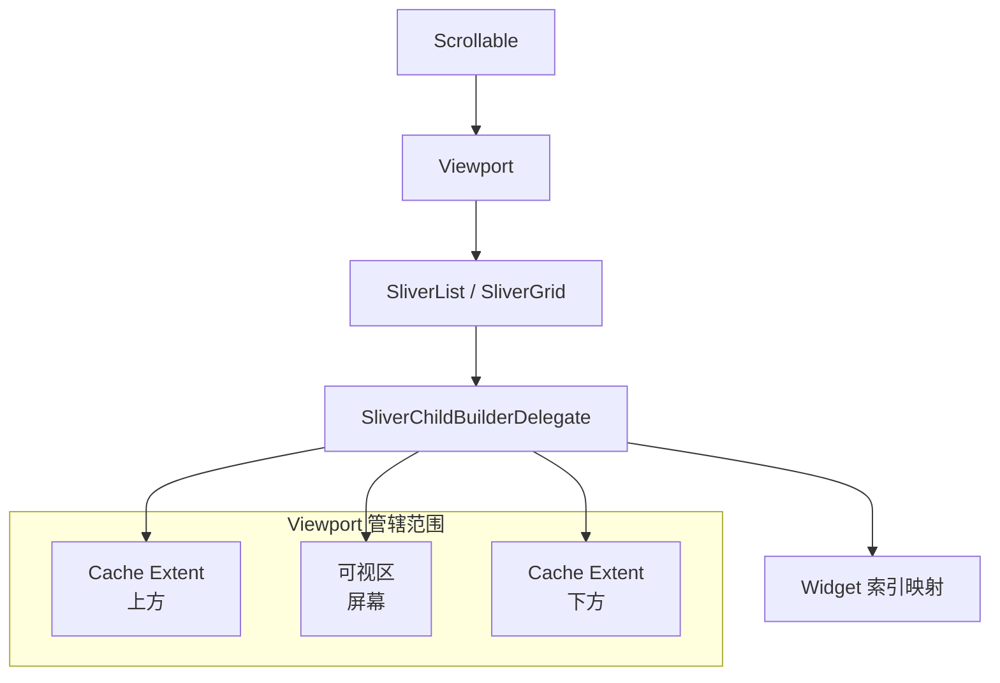

> **一句话概括：** Flutter 列表性能优化的核心在于理解其"可视区回收"机制——只构建和渲染当前屏幕可见的 Item，配合 Item 缓存池和惰性化复用策略，在十亿行数据面前也能保持流畅滚动。

## 1. 背景与意义

在移动应用开发中，列表是最常见也是最具挑战性的 UI 模式。一个社交 App 的时间线、一个电商 App 的商品瀑布流、一个聊天 App 的消息记录——这些场景都需要在有限的内存和帧时间预算内展示大量数据。

开发者对列表性能的传统认知往往停留在"不要加载太多项"这个层面。但 Flutter 的列表机制远比这复杂：

- 与原生平台不同，Flutter 的每一个列表项都是一个 Widget，需要经过 build → layout → paint 全流程
- 一个复杂的列表项可能包含：图片、文本、按钮、动画、网络请求
- 列表项的复用不是"干掉再重建"，而是 Element 的重新配置

Flutter 提供了三种主要的列表组件：
- **ListView**：垂直或水平方向的线性列表
- **GridView**：二维网格布局
- **CustomScrollView**：可自定义滚动效果的 Sliver 容器

它们共享同一个核心机制：**可视区回收**。

## 2. 概念与定义

### 2.1 核心术语

| 术语 | 解释 |
|---|---|
| **可视区** | 当前屏幕上用户能看到的区域 |
| **Viewport** | Scrollable 的可视区域，决定了哪些 Item 需要被构建 |
| **Cache Extent** | 可视区上下方各缓存多少距离的 Item |
| **Sliver** | 可滚动区域中的一块"碎片"，每个 Sliver 独立管理其子项 |
| **Item Extent** | 固定/预估的 Item 高度，影响滚动条计算 |
| **Keep Alive** | 强制 Item 不在可视区范围内时也被保留（而非回收） |

### 2.2 列表架构



当用户滚动列表时，`Viewport` 会计算哪些索引属于可见范围（含缓存区域），然后调用 `SliverChildBuilderDelegate` 的 `builder` 方法来构建这些索引对应的 Widget。滚出范围的 Widget 会被从 Element 树中移除（通过 `deactivateChild`）。

## 3. 最小示例：十亿行列表

```dart
import 'package:flutter/material.dart';

void main() => runApp(const MyApp());

class MyApp extends StatelessWidget {
  const MyApp({super.key});

  @override
  Widget build(BuildContext context) {
    return MaterialApp(
      home: Scaffold(
        appBar: AppBar(title: const Text('十亿行列表')),
        body: const _InfiniteList(),
      ),
    );
  }
}

class _InfiniteList extends StatelessWidget {
  const _InfiniteList();

  @override
  Widget build(BuildContext context) {
    return ListView.builder(
      itemCount: 1000000000, // 十亿项！
      // 关键参数：缓存区距离
      cacheExtent: 100, // 上下各缓存 100 逻辑像素
      itemBuilder: (context, index) {
        // 这个 builder 只会为可视区和缓存区内的索引被调用
        return ListTile(
          leading: CircleAvatar(
            child: Text('${index + 1}'),
          ),
          title: Text('项目 #${index + 1}'),
          subtitle: Text('这是第 ${index + 1} 个项目的内容'),
          trailing: const Icon(Icons.arrow_forward_ios),
        );
      },
    );
  }
}
```

这个示例展示了一个关键事实：即使 `itemCount` 设置为十亿，List.builder 也不会一次性构建所有 Item。它只会在内存中保留当前屏幕上可见的约 4-5 个 Item，加上上下缓存区内的几个。这就是"亿级数据零内存压力"的实现基础。

### 3.1 ListView 的三种构造方式

```dart
// 方式一：ListView(children: [...]) - 全量构建
// ❌ 所有子 Widget 在创建时就被构建，不可回收
// 适用于：少量（< 20）固定条目
ListView(
  children: [
    for (int i = 0; i < 100; i++)
      ListTile(title: Text('Item $i')),
  ],
);

// 方式二：ListView.builder - 按需构建
// ✅ 只有可见区域内的 Item 被构建，不可见区域被回收
// 适用于：大量数据的同构列表
ListView.builder(
  itemCount: 10000,
  itemBuilder: (context, index) => ListTile(title: Text('Item $index')),
);

// 方式三：ListView.separated - 带分割线的按需构建
// ✅ 同 builder，但额外指定分割线
ListView.separated(
  itemCount: 10000,
  itemBuilder: (context, index) => ListTile(title: Text('Item $index')),
  separatorBuilder: (context, index) => const Divider(),
);
```

三种方式的内存占用差异巨大。第一种方式即使只创建了 Widget 对象（还没渲染到屏幕），其 Element 和 RenderObject 依然存在。对于 10000 项的列表，第一种方式直接耗尽内存。后两种只有在滚动到对应位置时才会构建对应的 Widget。

## 4. 核心知识点拆解

### 4.1 itemExtent：固定高度优化

如果列表项的高度是固定的，设置 `itemExtent` 可以显著提升性能：

```dart
ListView.builder(
  itemCount: 100000,
  // 每个 Item 固定高度 72px
  itemExtent: 72,
  itemBuilder: (context, index) {
    return Container(
      height: 72, // 不再需要测量
      color: index.isEven ? Colors.white : Colors.grey[50],
      child: ListTile(title: Text('Item $index')),
    );
  },
);
```

设置 `itemExtent` 后，Flutter 可以：
1. 精确计算滚动总长度（无需测量每个 Item）
2. 通过简单的除法预算可见索引范围（无需遍历测量）
3. 滚动条大小不受 Item 内容影响，更加稳定

对比未设置 `itemExtent` 的 `prototypeItem` 模式——它通过预先构建一个原型 Item 来估算其余 Item 的高度，适用于 Item 高度相近但不完全固定的场景。

### 4.2 CacheExtent 与回收策略

`cacheExtent` 决定了在可视区之外提前渲染多少个像素的 Item：

```dart
ListView.builder(
  itemCount: 100000,
  // 默认 cacheExtent 是 250.0（逻辑像素）
  cacheExtent: 500, // 设置较大的缓存，提前渲染更多 Item
  itemBuilder: (context, index) {
    // 当 index 处于可视区上下各 500px 范围内时，builder 被调用
    return _ListItem(index: index);
  },
);
```

`addAutomaticKeepAlives` 和 `addRepaintBoundaries` 是构建委托的默认配置：

```dart
// ListView.builder 默认使用的委托
SliverChildBuilderDelegate(
  (context, index) => _ListItem(index: index),
  childCount: 100000,
  // 默认为 true：自动为每个 Item 添加 RepaintBoundary
  addRepaintBoundaries: true,
  // 默认为 true：自动添加 KeepAlive 通知
  addAutomaticKeepAlives: true,
  // 默认为 true：为每个 Item 添加自动重铺
  addRepaintBirdings: true,
);
```

`addRepaintBoundaries: true` 意味着每个列表项都自带一个 RepaintBoundary——当一个 Item 重绘时，不会影响其他 Item。这在大列表中是必需的配置。

### 4.3 图片加载优化

图片是列表性能的常见杀手。一张全屏图片的解码可能需要 5-10ms，而在快速滚动时，你会同时触发多张图片的解码：

```dart
// 配置图片缓存
class MyApp extends StatelessWidget {
  const MyApp({super.key});

  @override
  Widget build(BuildContext context) {
    return MaterialApp(
      builder: (context, child) {
        // 在应用启动时配置图片缓存
        PaintingBinding.instance.imageCache.maximumSize = 500; // 最大缓存 500 张
        PaintingBinding.instance.imageCache.maximumSizeBytes = 100 << 20; // 最大 100MB
        return child!;
      },
      home: const MyHomePage(),
    );
  }
}

// 列表中的图片使用优化
class _ImageListItem extends StatelessWidget {
  final String imageUrl;
  final int index;

  const _ImageListItem({required this.imageUrl, required this.index});

  @override
  Widget build(BuildContext context) {
    return SizedBox(
      height: 200,
      child: Column(
        children: [
          // 使用宽高固定的 Image 避免布局抖动
          Image.network(
            imageUrl,
            width: double.infinity,
            height: 160,
            fit: BoxFit.cover,
            // 占位符——图片加载前显示
            loadingBuilder: (context, child, loadingProgress) {
              if (loadingProgress == null) return child;
              return Center(
                child: CircularProgressIndicator(
                  value: loadingProgress.expectedTotalBytes != null
                      ? loadingProgress.cumulativeBytesLoaded /
                          loadingProgress.expectedTotalBytes!
                      : null,
                ),
              );
            },
            // 错误处理——加载失败不撑大布局
            errorBuilder: (context, error, stackTrace) {
              return Container(
                color: Colors.grey[200],
                child: const Icon(Icons.broken_image, size: 48),
              );
            },
          ),
          Text('图片 #$index'),
        ],
      ),
    );
  }
}
```

`loadingBuilder` 和 `errorBuilder` 不仅仅是用户体验的改进——它们在布局上确保了 Item 的尺寸不会因图片加载状态而突变，从而防止列表抖动的发生。

### 4.4 无限滚动（分页加载）

真正的生产级列表不可能一次性加载所有数据。分页加载（无限滚动）是标准实践：

```dart
class PagedListWidget extends StatefulWidget {
  @override
  State<PagedListWidget> createState() => _PagedListWidgetState();
}

class _PagedListWidgetState extends State<PagedListWidget> {
  final _items = <String>[];
  final _scrollController = ScrollController();
  bool _isLoading = false;
  bool _hasMore = true;
  static const _pageSize = 20;

  @override
  void initState() {
    super.initState();
    _loadMore();
    // 监听滚动位置，距离底部一定距离时触发加载
    _scrollController.addListener(_onScroll);
  }

  void _onScroll() {
    if (_scrollController.position.pixels >=
        _scrollController.position.maxScrollExtent - 200) {
      _loadMore();
    }
  }

  Future<void> _loadMore() async {
    if (_isLoading || !_hasMore) return;
    setState(() => _isLoading = true);

    // 模拟网络请求
    await Future.delayed(const Duration(milliseconds: 800));
    final newItems = List.generate(
      _pageSize,
      (i) => '项目 #${_items.length + i + 1}',
    );

    setState(() {
      _items.addAll(newItems);
      _isLoading = false;
      _hasMore = _items.length < 500; // 最多 500 项
    });
  }

  @override
  Widget build(BuildContext context) {
    return ListView.builder(
      controller: _scrollController,
      itemCount: _items.length + (_hasMore ? 1 : 0),
      itemBuilder: (context, index) {
        if (index >= _items.length) {
          // 最后一个 Item 显示加载指示器
          return const Padding(
            padding: EdgeInsets.all(16),
            child: Center(child: CircularProgressIndicator()),
          );
        }
        return ListTile(title: Text(_items[index]));
      },
    );
  }

  @override
  void dispose() {
    _scrollController.dispose();
    super.dispose();
  }
}
```

`ScrollController` 配合 `maxScrollExtent` 监听是实现无限滚动的标准方式。当用户滚动到距离底部 200px 以内时触发加载，加载后更新列表，列表高度增加，`maxScrollExtent` 随之变化。

## 5. 实战案例：聊天消息列表

聊天列表是列表性能优化中最极端的场景之一：消息数量巨大、消息内容包含各种富媒体、需要保持已读位置、支持跳转到特定消息。

```dart
class ChatMessage {
  final String id;
  final String text;
  final DateTime timestamp;
  final bool isMine;
  final String? imageUrl;

  const ChatMessage({
    required this.id,
    required this.text,
    required this.timestamp,
    required this.isMine,
    this.imageUrl,
  });
}

// 使用 AutomaticKeepAliveClientMixin 来保持某些 Item 存活
class ChatMessageItem extends StatefulWidget {
  final ChatMessage message;
  final bool isFirstUnread;

  const ChatMessageItem({
    super.key,
    required this.message,
    this.isFirstUnread = false,
  });

  @override
  State<ChatMessageItem> createState() => _ChatMessageItemState();
}

class _ChatMessageItemState extends State<ChatMessageItem>
    with AutomaticKeepAliveClientMixin {
  // 保持该 Item 存活——即使它滚出可视区也不回收
  // 适用于：需要保留滚动位置或正在播放媒体的 Item
  @override
  bool get wantKeepAlive => widget.isFirstUnread;

  @override
  Widget build(BuildContext context) {
    super.build(context); // 必须调用 super.build
    final msg = widget.message;

    return Padding(
      padding: const EdgeInsets.symmetric(horizontal: 12, vertical: 4),
      child: Align(
        alignment: msg.isMine ? Alignment.centerRight : Alignment.centerLeft,
        child: Container(
          constraints: BoxConstraints(
            maxWidth: MediaQuery.of(context).size.width * 0.75,
          ),
          padding: const EdgeInsets.all(12),
          decoration: BoxDecoration(
            color: msg.isMine ? Colors.blue[100] : Colors.grey[100],
            borderRadius: BorderRadius.circular(12),
          ),
          child: Column(
            crossAxisAlignment: CrossAxisAlignment.start,
            children: [
              if (msg.imageUrl != null)
                ClipRRect(
                  borderRadius: BorderRadius.circular(8),
                  child: Image.network(
                    msg.imageUrl!,
                    width: double.infinity,
                    height: 150,
                    fit: BoxFit.cover,
                    loadingBuilder: (context, child, progress) {
                      if (progress == null) return child;
                      return const SizedBox(
                        height: 150,
                        child: Center(child: CircularProgressIndicator(strokeWidth: 2)),
                      );
                    },
                    errorBuilder: (context, error, stack) {
                      return const SizedBox(
                        height: 150,
                        child: Center(child: Icon(Icons.broken_image)),
                      );
                    },
                  ),
                ),
              if (msg.imageUrl != null) const SizedBox(height: 8),
              Text(msg.text, style: const TextStyle(fontSize: 16)),
              const SizedBox(height: 4),
              Text(
                _formatTime(msg.timestamp),
                style: TextStyle(fontSize: 12, color: Colors.grey[500]),
              ),
            ],
          ),
        ),
      ),
    );
  }

  String _formatTime(DateTime dt) {
    return '${dt.hour.toString().padLeft(2, '0')}:${dt.minute.toString().padLeft(2, '0')}';
  }
}

// 聊天列表组件
class ChatListWidget extends StatelessWidget {
  final List<ChatMessage> messages;
  final ScrollController scrollController;

  const ChatListWidget({
    super.key,
    required this.messages,
    required this.scrollController,
  });

  @override
  Widget build(BuildContext context) {
    return ListView.builder(
      controller: scrollController,
      // 反向列表——最新的消息在底部
      reverse: true,
      itemCount: messages.length,
      // 固定每个消息的高度估算，提高滚动条精度
      itemExtent: null, // Chat 消息高度不固定
      itemBuilder: (context, index) {
        final message = messages[index];
        return ChatMessageItem(
          key: ValueKey(message.id), // 使用消息 ID 作为 Key！
          message: message,
          isFirstUnread: index == 0, // 第一条是最近消息
        );
      },
    );
  }
}
```

这个聊天列表的关键优化点：
1. **ValueKey**：使用消息 ID 作为 Key，确保新插入消息时列表稳定，不会影响现有消息的状态
2. **反向列表**（`reverse: true`）：最新的消息在底部，Flutter 自动将初始滚动位置置底
3. **缓存感知（KeepAlive）**：第一条未读消息需要 keepAlive，因为它可能是用户滑到顶部的参照点
4. **图片优化**：固定尺寸、加载过渡、错误处理，确保布局稳定性

## 6. 底层原理

### 6.1 Sliver 架构

Flutter 的滚动系统基于 Sliver 架构。Sliver 是一块"可滚动区域中的自适应碎片"：

```dart
// CustomScrollView 允许你组合多个不同类型的 Sliver
CustomScrollView(
  slivers: [
    // 固定头部，不随内容滚动
    const SliverAppBar(
      title: Text('定制滚动'),
      pinned: true,
    ),
    // 网格区域
    SliverGrid(
      gridDelegate: const SliverGridDelegateWithFixedCrossAxisCount(
        crossAxisCount: 2,
      ),
      delegate: SliverChildBuilderDelegate(
        (context, index) => Container(color: Colors.primaries[index % Colors.primaries.length]),
        childCount: 20,
      ),
    ),
    // 列表区域
    SliverList(
      delegate: SliverChildBuilderDelegate(
        (context, index) => ListTile(title: Text('Item $index')),
        childCount: 100,
      ),
    ),
  ],
)
```

每个 Sliver 都实现了一个核心协议：
- `estimateScrollOffset`：估算该 Sliver 占用的滚动距离
- `computeMetrics`：精确计算滚动度量
- `layout`：在给定的滚动偏移量下布局子项

当一个 Sliver 被布局时，它会向 `SliverConstraints` 询问 Available（可用区域）和 Remaining（剩余区域），然后决定构建哪些子项。

### 6.2 Viewport 的偏移量计算

Viewport 是 Scrollable 的核心。它接收来自 Scrollable 的滚动偏移量，然后将其转换为 Sliver 的约束：

```dart
// Viewport 的核心逻辑简化
class RenderViewport extends RenderBox {
  double _offset;

  void _updateSlivers() {
    // 对于每个 Sliver，计算它应该显示的滚动位置
    double leadingScrollOffset = _offset;
    double trailingScrollOffset = _offset + constraints.viewportMainAxisExtent;

    // 遍历 Sliver 列表，让每个 Sliver 在对应的偏移下布局
    for (final sliver in slivers) {
      final sliverConstraints = SliverConstraints(
        scrollOffset: leadingScrollOffset,
        // ... 其他约束
      );
      sliver.layout(sliverConstraints);
      leadingScrollOffset += sliver.geometry.scrollExtent;
    }
  }
}
```

当 `_offset` 变化时（用户滑动），整个布局流程重新触发——这就是为什么滚动的每一帧都会经过 layout → paint 全流程。

### 6.3 子 Item 的回收与复用

当一个 Item 滚出可视区+cacheExtent 的范围时，它会经过这三个步骤：

1. **deactivate**：从 Element 树中移除
2. **GlobalKey 检查**：如果有 GlobalKey，保留 Element 用于后续重用
3. **unmount**：彻底销毁 Element（如果没有 GlobalKey 且没有 KeepAlive）

`addAutomaticKeepAlives` 会为每个 Item 插入一个 `AutomaticKeepAlive` Widget。当 Item 被 Sliver 标记为不需要时，如果它有 `KeepAlive` 标记，Sliver 会保留其 Element 而不是销毁。

这就是为什么 `AutomaticKeepAliveClientMixin.wantKeepAlive` 可以控制 Item 的生命周期。

## 7. 高频面试题解析

### Q1: ListView 和 ListView.builder 哪个更高效？

**答：** ListView.builder 远更高效。ListView(children: [...]) 在创建时就会构建所有子 Widget 及其对应的 Element 和 RenderObject，即使它们不在可视区内。而 ListView.builder 只在 Item 即将进入可视区时才构建。对于超过 20 项以上的列表，始终使用 ListView.builder。

### Q2: 什么是 Sliver 架构？为什么 Flutter 要用 Sliver？

**答：** Sliver 是 Flutter 可滚动区域中的基本单元。它将复杂的滚动需求分解为可组合的碎片。比如一个页面同时包含头部、网格、列表，每个部分是一个独立的 Sliver，各自管理自己的子项回收和布局。Sliver 架构比传统的"一个列表只能有一种布局"（如 iOS 的 UITableView）更加灵活。CustomScrollView 允许任意组合 Sliver，创造出复杂而高性能的自定义滚动效果。

### Q3: 如何优化包含图片的列表滚动流畅度？

**答：** 多层策略：第一，使用 `cacheExtent` 扩大预加载范围，让图片有更多时间解码。第二，使用 `loadingBuilder` 在图片加载期间显示占位符，防止布局抖动。第三，增大 `PaintingBinding.instance.imageCache` 的缓存容量。第四，对于用户快速滚动场景，通过 `ScrollController` 监听滚动速度，滚动期间暂停图片解码，停止滚动后恢复。

### Q4: Key 在列表中的具体作用？不加 Key 会怎样？

**答：** Key 决定了当 Item 的位置变化时，Flutter 是复用已有的 Element 还是重建新的。没有 Key 时，Flutter 按位置匹配老 Item 和新 Item。当列表插入或删除元素时，后续 Item 的索引发生变化，导致错误地将老 Item 的 Widget 类型匹配给新 Item 的不同位置——这会造成状态丢失（如输入框内容、展开状态、动画进度）。加了 ValueKey 后，Flutter 会按 ID 匹配 Element，保证了 Item 状态的正确转移。

### Q5: 如何在大量数据列表中实现跳转到指定位置？

**答：** 使用 `ScrollController.animateTo` 或 `ScrollController.jumpTo`。对于精确跳转，需要计算目标 Item 的滚动偏移量。设置 `itemExtent` 时可以通过简单计算得到偏移（index * itemExtent）。未设置固定高度时，可以使用 `Scrollable.ensureVisible(context)` 通过 GlobalKey 定位 Widget。对于涉及大量的预加载数据（比如跳转到第 50000 条记录），建议使用 `ListView.builder` 的 `initialScrollIndex` 参数。

## 8. 总结与扩展

列表性能优化不是靠单一技巧实现的，而是一套组合拳：

1. **始终使用 `ListView.builder`**——全量构造的 ListView 不适用于任何超过 20 项的列表
2. **固定的 `itemExtent`**——让滚动布局计算从 O(n) 降到 O(1)
3. **ValueKey** ——确保 Item 在增删操作中的状态一致性
4. **图片预加载和缓存**——`ImageCache` 配置、`loadingBuilder`、`precacheImage`
5. **分页加载**——`ScrollController` 监听 + 加载指示器
6. **Sliver 组合**——`CustomScrollView` 满足复杂滚动布局需求
7. **RepaintBoundary 自动隔离**——`addRepaintBoundaries: true` 确保列表项间绘制不干扰

在未来的 Flutter 版本中，列表性能有更多值得期待的改进。比如 `SliverMainAxisGroup` 可以让复杂的交错布局不需要额外的测量 pass；Impeller 引擎的光栅化优化让复杂的列表项绘制更快。

---

*下一篇预告：动画性能优化——探索 Flutter 动画系统的性能边界，掌握动画优化背后的根本原理。*
