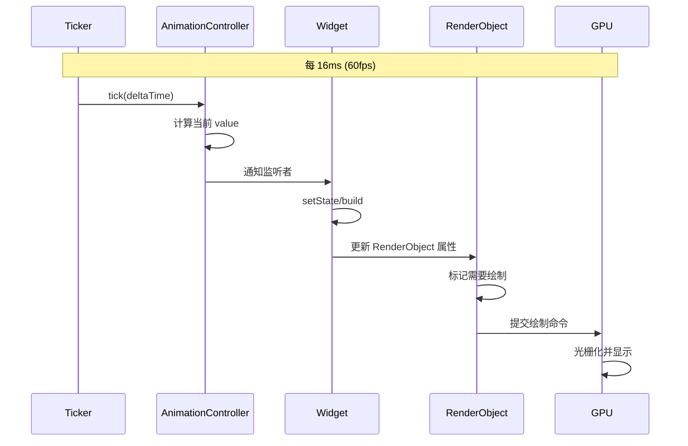

> **一句话概括：** Flutter 动画性能优化的根本在于"在正确的层级驱动变化"——合成层属性（透明度、平移、旋转、缩放）零成本，而触发 rebuild 的动画则需要用 RepaintBoundary 隔离，并充分利用 Ticker 的回调时间预算。

## 1. 背景与意义

动画是移动应用用户体验的灵魂。一个平滑流畅的 60fps 过渡动效和卡顿的 20fps 动画，给用户的感受差异如同阅读一本印刷精美的书籍和一份排版混乱的传单。在 Flutter 中，动画系统基于 `Ticker`（节拍器）驱动——每一帧屏幕刷新时触发回调，让开发者有机会更新属性值并重新渲染。

然而，动画也是最容易触发性能问题的场景。原因在于：动画的一个特点就是"变化"。每一帧都在变，意味着每一帧都可能触发 build、layout、paint 三棵树上的工作。如果你的动画触发了 Layout 层面的变化（比如修改了 Container 的 padding），那每一帧都得跑完整的三棵树，留给其他任务的时间几乎为零。

Flutter 的动画系统实际上提供了多层次的优化空间：从 `AnimationController` 的控制精度，到 `Tween` 的插值效率，再到 `AnimatedWidget` 和 `AnimatedBuilder` 的使用选择，以及最重要的——**合成层属性与绘制层属性的区分**。

在 Flutter 3.x + Impeller 渲染引擎的背景下，动画性能优化的策略发生了一些变化：Impeller 消除了着色器编译卡顿，让 GPU 动画更加可靠；但同时，Impeller 对某些 BlendMode 和复杂 Path 动画的性能降级也需要被纳入考量。

## 2. 概念与定义

### 2.1 动画流水线



整个流程必须在 16ms（60fps）或 8ms（120fps）内完成。任何一个环节超时都会导致下一帧推迟。

### 2.2 核心组件

| 组件 | 职责 | 优化注意点 |
|---|---|---|
| AnimationController | 驱动动画的"时钟" | `vsync` 必须绑定 TickerProvider |
| Tween | 插值计算器 | 尽量使用原始类型，避免对象装箱 |
| CurvedAnimation | 缓动曲线 | 预计算曲线映射，减少运行时计算 |
| AnimatedBuilder | 监听动画并 rebuild | 配合 RepaintBoundary 使用 |
| AnimatedWidget | 继承式监听动画 | 适合有固定动画逻辑的 Widget |
| TweenAnimationBuilder | 一次性补间动画 | 自管理 Tween，无需外部 Controller |

### 2.3 合成层属性 vs 绘制层属性

这是动画优化最核心的概念：

**合成层属性（Compositing-layer properties）：**
- `Transform` 的 translation/rotation/scale
- `Opacity`（通过 `FadeTransition` / `AnimatedOpacity`）
- `ClipRect` / `ClipRRect`（需有对应的 saveLayer）
- 这些属性变化在合成阶段处理，不需要重新绘制子 Widget

**绘制层属性（Painting-layer properties）：**
- 颜色（`Color`、`decoration`）
- 边框宽度（`borderWidth`）
- 圆角半径（`borderRadius`）
- 文字大小和字体
- Padding / Margin 变化
- 这些属性变化可能需要重新绘制或重新布局

```dart
// 合成层动画：高性能
Transform.translate(
  offset: Offset(dx, 0), // 只触发合成，GPU 负责移动
  child: expensiveWidget,
);

// 绘制层动画：低性能
Padding(
  padding: EdgeInsets.only(left: dx), // 触发布局+绘制
  child: expensiveWidget,
);
```

前者的子 Widget 的绘制结果被缓存为纹理，`Transform.translate` 只是在合成阶段移动这个纹理；后者每次 `dx` 变化都会触发 padding 的重新计算和子 Widget 的重新绘制。

## 3. 最小示例：运动的方块

```dart
import 'package:flutter/material.dart';

void main() => runApp(const MyApp());

class MyApp extends StatelessWidget {
  const MyApp({super.key});

  @override
  Widget build(BuildContext context) {
    return MaterialApp(
      home: Scaffold(
        appBar: AppBar(title: const Text('动画性能对比')),
        body: const AnimationComparison(),
      ),
    );
  }
}

class AnimationComparison extends StatefulWidget {
  const AnimationComparison({super.key});

  @override
  State<AnimationComparison> createState() => _AnimationComparisonState();
}

class _AnimationComparisonState extends State<AnimationComparison>
    with SingleTickerProviderStateMixin {
  late AnimationController _controller;
  // 缓动曲线：开始慢、中间快、结束慢
  late Animation<double> _animation;

  @override
  void initState() {
    super.initState();
    _controller = AnimationController(
      vsync: this,
      duration: const Duration(seconds: 3),
    )..repeat(reverse: true);

    _animation = CurvedAnimation(
      parent: _controller,
      curve: Curves.easeInOut,
    );
  }

  @override
  Widget build(BuildContext context) {
    return Column(
      children: [
        // ---- 方案 A：低性能 ----
        // 使用 Padding 推动方块移动——每帧触发布局+绘制
        const Text('方案 A：Padding（触发布局）',
            style: TextStyle(fontWeight: FontWeight.bold)),
        Expanded(
          child: AnimatedBuilder(
            animation: _animation,
            builder: (context, child) {
              return Padding(
                padding: EdgeInsets.only(
                  left: _animation.value * 300,
                ),
                child: child,
              );
            },
            child: _buildBox(Colors.red),
          ),
        ),

        const Divider(),

        // ---- 方案 B：高性能 ----
        // 使用 Transform 移动方块——只在合成阶段移动
        const Text('方案 B：Transform（合成层移动）',
            style: TextStyle(fontWeight: FontWeight.bold)),
        Expanded(
          child: AnimatedBuilder(
            animation: _animation,
            builder: (context, child) {
              return Transform.translate(
                offset: Offset(_animation.value * 300, 0),
                child: child,
              );
            },
            child: _buildBox(Colors.green),
          ),
        ),
      ],
    );
  }

  Widget _buildBox(Color color) {
    return RepaintBoundary(
      child: Container(
        width: 50,
        height: 50,
        color: color,
      ),
    );
  }

  @override
  void dispose() {
    _controller.dispose();
    super.dispose();
  }
}
```

从 Flutter DevTool 的"跟踪绘制"（Track Repaints）中可以清楚看到：方案 A 的红色方块每帧都会触发其父容器和兄弟 Widget 的重绘；而方案 B 的绿色方块只在开始时被绘制一次，之后只更新其 Layer 的 `transform` 属性。

## 4. 核心知识点拆解

### 4.1 TickerProvider 的正确绑定

`AnimationController` 的 `vsync` 参数必须绑定 `TickerProvider`。Flutter 提供了两种默认实现：

```dart
// 场景一：只驱动一个动画
// 使用 SingleTickerProviderStateMixin
class SingleAnimationWidget extends StatefulWidget {
  @override
  State<SingleAnimationWidget> createState() => _SingleAnimationWidgetState();
}

class _SingleAnimationWidgetState extends State<SingleAnimationWidget>
    with SingleTickerProviderStateMixin {
  late AnimationController _controller;

  @override
  void initState() {
    super.initState();
    _controller = AnimationController(
      vsync: this, // 使用 mixin 提供的 Ticker
      duration: const Duration(seconds: 2),
    );
  }
}

// 场景二：同时驱动多个动画
// 使用 TickerProviderStateMixin
class MultiAnimationWidget extends StatefulWidget {
  @override
  State<MultiAnimationWidget> createState() => _MultiAnimationWidgetState();
}

class _MultiAnimationWidgetState extends State<MultiAnimationWidget>
    with TickerProviderStateMixin {
  late AnimationController _controller1;
  late AnimationController _controller2;

  @override
  void initState() {
    super.initState();
    _controller1 = AnimationController(
      vsync: this,
      duration: const Duration(seconds: 1),
    );
    _controller2 = AnimationController(
      vsync: this,
      duration: const Duration(seconds: 2),
    );
  }
}
```

错误绑定 `vsync` 会导致两个问题：
- 绑定到 `null`：AnimationController 不会产生 Ticker，动画无法启动
- 绑定到已经被 dispose 的 State：产生"Ticker 被已销毁的 Ancestor 引用"的警告或崩溃

### 4.2 动画的性能分层

Flutter 动画可以在三个层次上进行，性能差异巨大：

**第一层：布局动画（最昂贵）**
```dart
// 每帧触发 layout 变化
AnimatedBuilder(
  animation: animation,
  builder: (context, child) {
    return Padding(
      padding: EdgeInsets.all(animation.value * 20),
      child: child,
    );
  },
  child: myWidget,
);
```

**第二层：绘制动画（中等昂贵）**
```dart
// 每帧触发 paint 变化，但不影响布局
AnimatedBuilder(
  animation: animation,
  builder: (context, child) {
    return DecoratedBox(
      decoration: BoxDecoration(
        color: Color.lerp(Colors.blue, Colors.red, animation.value),
      ),
      child: child,
    );
  },
  child: myWidget,
);
```

**第三层：合成层动画（几乎零成本）**
```dart
// 只更新合成属性，子 Widget 的绘制结果被缓存
AnimatedBuilder(
  animation: animation,
  builder: (context, child) {
    return Transform.rotate(
      angle: animation.value * 2 * pi,
      child: child,
    );
  },
  child: myWidget,
);
```

原则：**尽量让动画运行在合成层**。如果必须在绘制层做动画，确保子 Widget 被 RepaintBoundary 包裹。

### 4.3 TweenAnimationBuilder：零 Controller 动画

如果动画是一次性的"从 A 到 B"，`TweenAnimationBuilder` 是最优选择——它自动管理 Tween，不需要手动创建 Controller：

```dart
// ❌ 手动管理 Controller 的一次性动画
class ManualFadeIn extends StatefulWidget {
  @override
  State<ManualFadeIn> createState() => _ManualFadeInState();
}

class _ManualFadeInState extends State<ManualFadeIn>
    with SingleTickerProviderStateMixin {
  late AnimationController _controller;

  @override
  void initState() {
    super.initState();
    _controller = AnimationController(
      vsync: this,
      duration: const Duration(milliseconds: 500),
    )..forward();
  }

  @override
  Widget build(BuildContext context) {
    return FadeTransition(
      opacity: _controller,
      child: const Text('淡入效果'),
    );
  }

  @override
  void dispose() {
    _controller.dispose();
    super.dispose();
  }
}

// ✅ TweenAnimationBuilder：自动管理
class SimpleFadeIn extends StatelessWidget {
  const SimpleFadeIn({super.key});

  @override
  Widget build(BuildContext context) {
    return TweenAnimationBuilder<double>(
      tween: Tween(begin: 0.0, end: 1.0),
      duration: const Duration(milliseconds: 500),
      curve: Curves.easeIn,
      builder: (context, value, child) {
        return Opacity(
          opacity: value,
          child: child,
        );
      },
      child: const Text('淡入效果'),
    );
  }
}
```

`TweenAnimationBuilder` 的优势在于：
1. 自动管理 Ticker 生命周期——Widget 挂载时启动，卸载时停止
2. `StatelessWidget` 可用——不需要 StatefulWidget + 手动 dispose
3. 参数驱动——修改 `tween` 或 `duration` 属性自动重启动画

### 4.4 缓动曲线的性能选择

`Curves` 的不同实现计算复杂度不同。虽然现代 CPU 上差异不大，但在 120fps 下，每条曲线每帧的开销会累加：

```dart
// 计算简单的曲线
Curves.linear       // O(1)：return t
Curves.easeIn       // O(1)：简单多项式
Curves.easeInOut    // O(1)：三次贝塞尔

// 计算相对复杂的曲线
Curves.elasticInOut // O(n)：需要考虑过冲和振荡
Curves.bounceInOut  // O(n)：模拟物理弹跳

// 自定义曲线
class MyCustomCurve extends Curve {
  @override
  double transformInternal(double t) {
    // 复杂的数学计算
    return pow(t, 3) * sin(t * pi * 4); // O(1) 但涉及三角函数
  }
}
```

如果动画不需要特别的弹性效果，优先使用 `Curves.easeInOut`、`Curves.fastOutSlowIn` 或 `Curves.decelerate`，它们计算简单，效果自然。

## 5. 实战案例：卡片堆叠动画

实现一组卡片堆叠展开和收起的动画，同时展示多个优化技巧的组合使用：

```dart
class CardStackDemo extends StatefulWidget {
  @override
  State<CardStackDemo> createState() => _CardStackDemoState();
}

class _CardStackDemoState extends State<CardStackDemo>
    with SingleTickerProviderStateMixin {
  late AnimationController _controller;
  late Animation<double> _expansion;
  bool _isExpanded = false;

  static const int _cardCount = 5;
  final _cardColors = [
    Colors.red[400]!,
    Colors.orange[400]!,
    Colors.amber[400]!,
    Colors.green[400]!,
    Colors.blue[400]!,
  ];

  @override
  void initState() {
    super.initState();
    _controller = AnimationController(
      vsync: this,
      duration: const Duration(milliseconds: 400),
    );

    // Y 轴偏移动画——从堆叠到展开
    _expansion = CurvedAnimation(
      parent: _controller,
      curve: Curves.easeInOutBack, // 稍微过冲，有弹性感
    );
  }

  void _toggle() {
    if (_isExpanded) {
      _controller.reverse();
    } else {
      _controller.forward();
    }
    _isExpanded = !_isExpanded;
  }

  @override
  Widget build(BuildContext context) {
    return Scaffold(
      appBar: AppBar(title: const Text('卡片堆叠动画')),
      body: Center(
        child: AnimatedBuilder(
          animation: _expansion,
          builder: (context, child) {
            return Stack(
              clipBehavior: Clip.none,
              children: List.generate(_cardCount, (index) {
                // 每张卡片的展开偏移
                final offset = _expansion.value * (index * 60.0);
                // 渐隐——只有堆叠状态下显示层级效果
                final opacity = 1.0 - (_expansion.value * 0.3 * index / _cardCount);
                // 缩放——展开时略微放大
                final scale = 1.0 + (_expansion.value * 0.05 * index);

                return Positioned(
                  top: 100 + offset,
                  left: 40 - offset * 0.3,
                  right: 40 - offset * 0.3,
                  child: Opacity(
                    opacity: opacity,
                    // 使用 Transform 而非改变位置——合成层动画
                    child: Transform.scale(
                      scale: scale,
                      child: RepaintBoundary(
                        child: _CardWidget(
                          color: _cardColors[index],
                          index: index,
                          isTop: index == _cardCount - 1,
                        ),
                      ),
                    ),
                  ),
                );
              }),
            );
          },
        ),
      ),
      floatingActionButton: FloatingActionButton(
        onPressed: _toggle,
        child: AnimatedCrossFade(
          // 展开/收起图标的切换动画
          firstChild: const Icon(Icons.unfold_more),
          secondChild: const Icon(Icons.unfold_less),
          crossFadeState: _isExpanded
              ? CrossFadeState.showSecond
              : CrossFadeState.showFirst,
          duration: const Duration(milliseconds: 200),
        ),
      ),
    );
  }

  @override
  void dispose() {
    _controller.dispose();
    super.dispose();
  }
}

// 单张卡片——const constructor 优化
class _CardWidget extends StatelessWidget {
  final Color color;
  final int index;
  final bool isTop;

  const _CardWidget({
    required this.color,
    required this.index,
    required this.isTop,
  });

  @override
  Widget build(BuildContext context) {
    return Container(
      height: 120,
      decoration: BoxDecoration(
        color: color,
        borderRadius: BorderRadius.circular(16),
        boxShadow: [
          BoxShadow(
            color: Colors.black.withOpacity(0.2),
            blurRadius: 8,
            offset: const Offset(0, 4),
          ),
        ],
      ),
      child: Center(
        child: Text(
          '卡片 ${index + 1}',
          style: const TextStyle(
            color: Colors.white,
            fontSize: 24,
            fontWeight: FontWeight.bold,
          ),
        ),
      ),
    );
  }
}
```

这个案例中的优化点：
1. **合成层动画**：卡片位置变化通过 `Transform.scale` 和 `Positioned` 的 `top` 偏移实现——都没有触发布局抖动
2. **RepaintBoundary**：每张卡片被 `RepaintBoundary` 包裹，卡片之间不会相互影响绘制
3. **Opaciy 在卡片层**：`FadeTransition` 不适合此场景，使用 `Opaciy` 配合 `RepaintBoundary` 的组合
4. **const _CardWidget**：卡片 Widget 使用 const 构造函数，builder 中的 index/color 是运行时传入，但内部的固定布局是 const
5. **CurvedAnimation**：`Curves.easeInOutBack` 的轻微过冲效果比物理模拟更轻量

## 6. 底层原理

### 6.1 Ticker 与帧调度

`Ticker` 是 Flutter 动画的底层驱动。它本质上是一个回调注册器，当 `SchedulerBinding` 开始新一帧的绘制时，会依次调用所有注册的 Ticker 回调：

```dart
// 伪代码：SchedulerBinding 的帧调度
class SchedulerBinding {
  final _transientCallbacks = <int, FrameCallback>{};

  void handleBeginFrame(Duration rawTimeStamp) {
    // 1. 处理微任务
    // 2. 调用所有 transient callbacks（即 Ticker 回调）
    for (final callback in _transientCallbacks.values) {
      callback(rawTimeStamp);
    }
    // 3. 执行 build/build 阶段
    // 4. 执行布局阶段
    // 5. 执行绘制阶段
  }
}
```

`AnimationController` 在 Ticker 回调中更新其 value，并通过它的 `_listeners` 通知所有监听者。这些监听者包括 `AnimatedBuilder` 和 `AnimatedWidget`。

关键点：如果 Ticker 的回调时间超过了 16ms，下一帧的 `handleBeginFrame` 会被推迟，在 Flutter DevTools 的 Frame 分析图中就会出现"长帧"标记。

### 6.2 合成层与 saveLayer

当 Flutter 进行绘制时，`PaintingContext` 会生成一系列 `Canvas` 绘制命令。这些命令会被组织成 `PictureLayer`。当多个 `PictureLayer` 需要合成时，Flutter 不会直接合成它们，而是将它们放入一个 `SceneBuilder`：

```dart
// 伪代码：Layer 的合成
class TransformLayer extends ContainerLayer {
  Matrix4 transform;

  @override
  void addToScene(SceneBuilder builder) {
    // 告诉 SceneBuilder：从这里开始的所有绘制应用这个变换
    builder.pushTransform(transform.storage);
    addChildrenToScene(builder);
    builder.pop();
  }
}
```

当一个 Widget 被 `Transform` 包裹时，Flutter 只更新 `TransformLayer` 的 `transform` 属性，而不是重新构建子 Widget 的 `PictureLayer`。这就是为什么合成层动画效率高——`PictureLayer` 被缓存，GPU 负责处理变换。

### 6.3 Impeller 对动画的影响

Flutter 3.x 默认使用的 Impeller 渲染引擎对动画性能有显著影响：

1. **无着色器编译卡顿**：Skia 时代，首次运行某些绘制命令时会触发着色器编译（shader compilation），导致几十毫秒的卡顿。Impeller 预编译了所有着色器，动画中的中间帧不再受此影响。

2. **纹理层面操作**：Impeller 的合成直接在 GPU 纹理上进行，`Transform` / `Opacity` 变化比 Skia 更加轻量。

3. **降低 saveLayer 惩罚**：在 Skia 中，`saveLayer` 会创建离屏帧缓冲，在 Impeller 中这一操作的代价更低。但 `saveLayer` 仍然不便宜——它需要额外的显存和一次额外的 pass。

## 7. 高频面试题解析

### Q1: AnimatedBuilder 和 AnimatedWidget 的区别和选择？

**答：** AnimatedBuilder 是一个通用工具，接收一个 `animation` 参数和一个 `builder` 回调，适合"将动画值映射到某个 Widget 属性"的场景。AnimatedWidget 是类继承的方式，子类需要实现 `build` 方法并通过构造函数传入 animation。选择标准：如果你的动画逻辑是固定且可复用的（如 FadeTransition、ScaleTransition），继承 AnimatedWidget 更好；如果是临时的（如 "把动画值映射为 Transform translation"），用 AnimatedBuilder 更灵活。

### Q2: 如何在动画中避免 setState 触发全局重建？

**答：** 方法是使用 AnimatedBuilder 并配合 RepaintBoundary。AnimatedBuilder 只会触发它 builder 回调内部的 Widget 重建。如果 builder 回调的内容被 RepaintBoundary 包裹，重建不会传播到父级。另外，使用合成层属性（Transform、Opacity、ClipRect）可以完全避免绘制层面的重建——只更新合成参数。

### Q3: AnimationController 的 vsync 参数为什么重要？

**答：** vsync 参数绑定了状态的生命周期。当 State 被销毁时（用户离开页面），Ticker 会停止触发。如果没有vsync 绑定，离屏的动画会继续消耗 CPU/GPU 资源。第二个作用是避免"离屏动画"——Widget 不在屏幕上显示时，Ticker 被暂停，不会浪费资源。

### Q4: 什么是"隐式动画"？为什么它们性能更好？

**答：** 隐式动画（`AnimatedContainer`、`AnimatedOpacity`、`AnimatedPadding` 等）内部自动管理 AnimationController 的生命周期。从性能角度，它们的关键优势是：隐式动画只在目标值变化时创建一个新的 Tween 并驱动 Controller 到目标值。动画完成后，Controller 自动停止。相比之下，显式动画（通过 AnimationController + AnimatedBuilder）可能因为开发者忘记停止 Controller 而导致不必要的帧消费。

### Q5: 为什么说 curve 动画复杂度不重要？什么情况下重要？

**答：** 对简单的三次贝塞尔曲线（easeInOut、fastOutSlowIn），计算复杂度不是问题——它们只有 2 个控制点，计算是 O(1) 且涉及简单的幂运算。但当使用物理模拟曲线（`SpringDescription` + `SpringSimulation`）时，每帧需要计算阻尼系数和振荡方程，复杂度显著增加。在 120fps 下同时运行 10 个以上的物理动画，累积的计算时间可能成为瓶颈。

## 8. 总结与扩展

动画性能优化的核心原则可以归结为三条：

**第一条：让动画运行在正确的层级**
- 尽量使用合成层属性（Transform、FadeTransition、ClipRect+animate）
- 避免布局层动画（Padding 变化、尺寸变化）
- 如果必须做绘制层动画，请用 RepaintBoundary 隔离

**第二条：管理好动画的生命周期**
- 始终绑定 `vsync` 到 TickerProvider
- 使用 `TweenAnimationBuilder` 替代手动 Controller（特殊场景）
- 动画结束后及时 `dispose`

**第三条：善用 Flutter 提供的优化工具**
- RepaintBoundary 隔离动画区域
- const Widget 减少对象创建
- CurvedAnimation 的 overshoot 替代纯物理模拟

对于更复杂的动画需求——粒子系统、精密的物理模拟、3D 动画，你可能需要跳出 Flutter 内置的动画系统，使用 `CustomPainter` 配合 `Canvas` API 直接绘制，或者集成 `Lottie` / `Rive` 等动画格式引擎。

---

*下一篇预告：Flutter DevTools——调试工具全景指南，从 Widget 树到性能面板的全方位诊断。*
