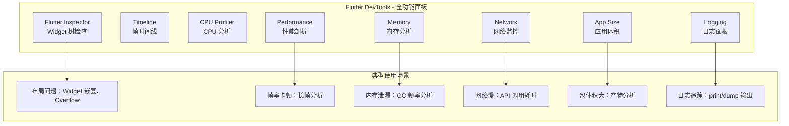

> **一句话概括：** Flutter DevTools 是一套完整的浏览器端调试套件，覆盖 Widget 树检查、性能剖析、内存分析、网络监控、应用日志等全方位维度，掌握它是成为 Flutter 高手的关键一步。

## 1. 背景与意义

在传统的原生开发中，Xcode 的 Instruments 和 Android Studio 的 Profiler 一直是性能优化的标配工具。Flutter 作为跨平台框架，有其独特的运行时模型——三棵树（Widget / Element / RenderObject）、自己的渲染引擎、声明式 UI 的构建模式——这意味着传统的原生调试工具无法直接应用于 Flutter。

Flutter DevTools 正是在这个背景下诞生的。它不是集成在 IDE 中的插件，而是一个独立的 Web 应用，通过 HTTP 连接到正在运行的 Flutter 应用实例。这意味着：

1. 可以在 Chrome、Safari 或任何浏览器中打开
2. 可以远程调试设备上的应用（通过端口转发）
3. 同时支持 Android、iOS、Web、Desktop、Pad 等所有 Flutter 目标平台
4. 可以脱离 IDE 独立使用

实际开发中遇到的大部分性能问题——"这个 Widget 为什么每帧都在重建？""那个卡顿是动画超时还是图片解码？""内存为什么会持续增长？"——都可以在 DevTools 的某个面板中找到答案。

但 DevTools 的能力也容易被低估。许多开发者只会用 Flutter Inspector 看 Widget 树，而忽略了 Performance 面板的帧分析图、Memory 面板的泄漏检测、Network 面板的请求时序——这些才是解决复杂问题的利器。

## 2. 概念与定义

### 2.1 DevTools 的核心面板



| 面板 | 主要用途 | 建议频率 |
|---|---|---|
| Flutter Inspector | 检查 Widget 树、布局边界、选中 Widget | 日常开发 |
| Performance | 帧时间分析、Build/Layout/Paint 耗时 | 性能优化 |
| CPU Profiler | 方法级采样分析 | 定位 CPU 热点 |
| Memory | 内存分配追踪、GC 频率、泄漏检测 | 内存问题排查 |
| Network | HTTP 请求时序和响应查看 | 网络调试 |
| App Size | 构建产物分析 | 体积优化 |
| Logging | 应用日志输出 | 日常调试 |

### 2.2 连接方式

DevTools 通过 Dart VM Service Protocol 连接到应用，最常见的启动方式：

```bash
# 方式一：从命令行启动
flutter pub global activate devtools
flutter devtools

# 方式二：在 IDE 中启动
# VS Code：Ctrl+Shift+P → Flutter: Open DevTools
# Android Studio：View → Tool Windows → Flutter DevTools

# 方式三：从调试会话启动
# 在应用运行后，终端会输出类似：
# Debug service listening on ws://127.0.0.1:57848/ws
# 复制该 URL，DevTools 会"连接到此服务"
```

启动后，DevTools 会在浏览器中打开 `http://127.0.0.1:9100`，并自动选择正在运行的应用实例。

## 3. 最小示例：发现性能问题

创建一个有明确性能问题的最小应用，然后用 DevTools 诊断：

```dart
// 这是一个存在性能问题的计数器页面
// 问题：每次 setState 都触发了整个页面所有 Widget 的不必要重建
class ProblematicPage extends StatefulWidget {
  @override
  State<ProblematicPage> createState() => _ProblematicPageState();
}

class _ProblematicPageState extends State<ProblematicPage> {
  int _counter = 0;

  // ❌ 问题：没有 const 构造函数
  @override
  Widget build(BuildContext context) {
    return Scaffold(
      appBar: AppBar(title: Text('计数: $_counter')), // ❌ 每次重建
      body: Column(
        children: [
          // ❌ 每次 rebuild 都创建新的 ListTile 实例
          const ListTile(title: Text('第一项')), // ❌ 不是 const
          const ListTile(title: Text('第二项')),
          const ListTile(title: Text('第三项')),
          // ❌ 每帧都重建的复杂组件
          _buildExpensiveWidget(),
          Text('计数: $_counter'),
          ElevatedButton(
            onPressed: () => setState(() => _counter++),
            child: const Text('增加'),
          ),
        ],
      ),
    );
  }

  Widget _buildExpensiveWidget() {
    return Container(
      padding: EdgeInsets.all(16),
      decoration: BoxDecoration(
        color: Colors.blue[50],
        borderRadius: BorderRadius.circular(8),
      ),
      child: const Text('这是一个昂贵组件'),
    );
  }
}
```

在 DevTools 中：
1. 打开 `Flutter Inspector` → 点击 `Enable Track Repaints`（启用重绘追踪）
2. 点击按钮 → 观察整个页面闪烁绿色（表示全部重绘）
3. 打开 `Performance` 面板 → 点击 `Record` → 点击按钮 → `Stop`
4. 在 Timeline 中，你会看到 Build 阶段从几微秒跳到几毫秒

修复后的版本：

```dart
// ✅ 优化版：使用 const + Consumer + RepaintBoundary
class OptimizedPage extends StatefulWidget {
  @override
  State<OptimizedPage> createState() => _OptimizedPageState();
}

class _OptimizedPageState extends State<OptimizedPage> {
  int _counter = 0;

  @override
  Widget build(BuildContext context) {
    return Scaffold(
      // ✅ AppBar 标题不依赖 _counter 变化
      appBar: const AppBar(title: Text('计数器')),
      body: Column(
        children: const [
          // ✅ const ListTile——不会被重建
          ListTile(title: Text('第一项')),
          ListTile(title: Text('第二项')),
          ListTile(title: Text('第三项')),
          // ✅ const Widget——不会被重建
          _ExpensiveWidget(),
        ],
      ),
    );
  }
}

// ✅ 将昂贵组件提取为 const Widget
class _ExpensiveWidget extends StatelessWidget {
  const _ExpensiveWidget();

  @override
  Widget build(BuildContext context) {
    return Container(
      padding: const EdgeInsets.all(16),
      decoration: BoxDecoration(
        color: Colors.blue[50],
        borderRadius: BorderRadius.circular(8),
      ),
      child: const Text('这是一个昂贵组件'),
    );
  }
}
```

再次使用 DevTools 的 `Track Repaints` 检查——点击按钮时，只有 `_counter` 相关的 Widget 闪烁，静态区域保持稳定。

## 4. 核心知识点拆解

### 4.1 Flutter Inspector：Widget 树的 X 光机

Inspector 面板是日常开发中使用最频繁的。它提供了从 Widget 树角度查看应用的能力：

```dart
// 创建一个用于 Inspector 演练的组件
class InspectorDemo extends StatelessWidget {
  const InspectorDemo({super.key});

  @override
  Widget build(BuildContext context) {
    return Scaffold(
      appBar: AppBar(
        title: const Text('Inspector 演练'),
        actions: [
          // 给 IconButton 添加 key 便于在 Inspector 中定位
          IconButton(
            key: const ValueKey('settings_icon'),
            icon: const Icon(Icons.settings),
            onPressed: () {},
          ),
        ],
      ),
      body: const Center(
        child: Column(
          mainAxisAlignment: MainAxisAlignment.center,
          children: [
            Text('Hello, DevTools!', style: TextStyle(fontSize: 24)),
            SizedBox(height: 20),
            FlutterLogo(size: 100),
          ],
        ),
      ),
    );
  }
}
```

在 DevTools 的 Inspector 面板中：

**Select Widget Mode（选择 Widget 模式）**
- 点击后，在模拟器/真机上点击任意元素
- Inspector 自动定位到对应 Widget 在树中的位置
- 显示 Widget 的属性（padding、margin、color、text 等）

**Debug Paint（调试绘制）**
- 每个 RenderBox 显示其边界框
- 边框颜色表示对齐和约束信息
- 溢出的内容以黄色/红色条纹显示

**Show Repaint Rainbow（显示重绘彩虹）**
- 开启后，每次重绘的区域会闪烁不同颜色
- 频繁闪烁 = 优化机会

**Show Baselines（显示基线）**
- 文字基线以蓝线显示，帮助检查文字对齐

### 4.2 Performance 面板：帧率诊断的终极武器

Performance 面板是排查卡顿的核心工具。它展示每一帧的时间线：

```dart
// 制造一个卡顿场景
class JankDemo extends StatefulWidget {
  @override
  State<JankDemo> createState() => _JankDemoState();
}

class _JankDemoState extends State<JankDemo> {
  final _items = List<int>.generate(10000, (i) => i);
  final _scrollController = ScrollController();

  @override
  Widget build(BuildContext context) {
    return Scaffold(
      appBar: AppBar(title: const Text('卡顿 Demo')),
      body: ListView.builder(
        controller: _scrollController,
        itemCount: _items.length,
        itemBuilder: (context, index) {
          // ❌ 故意制造的卡顿：Float64List 的创建
          final heavyOperation = List<double>.generate(1000, (i) => i * 1.0);
          final sum = heavyOperation.reduce((a, b) => a + b);

          return ListTile(
            title: Text('Item $index'),
            subtitle: Text('计算值: ${sum.toStringAsFixed(0)}'),
          );
        },
      ),
    );
  }
}
```

在 Performance 面板中操作步骤：

1. 点击 **Record** 开始录制
2. 在设备上快速滚动列表
3. 点击 **Stop** 停止录制
4. 在 Timeline 中观察：

- **绿色帧**：16ms 以内，流畅
- **红色帧**：超过 16ms，出现卡顿
- **蓝色条**：Build 阶段——如果某个 Item 的 Build 耗时过长
- **黄色条**：Layout 阶段——如果布局计算复杂
- **紫色条**：Paint 阶段——如果绘制命令多

点击红色帧可以放大查看是哪个阶段的哪一步超时。Frame Analysis 面板会显示该帧内每个阶段的精确耗时。

**注意**：DevTools 的 Performance 面板记录的是 UI 线程和 Raster 线程的同步 Timeline。如果卡顿出现在 Raster 线程（GPU 端超时），在 Frame 分析图中会以红色标记 Raster 阶段。

### 4.3 Memory 面板：泄漏检测

```dart
// 创建一个典型的内存泄漏场景
class MemoryLeakDemo extends StatefulWidget {
  @override
  State<MemoryLeakDemo> createState() => _MemoryLeakDemoState();
}

class _MemoryLeakDemoState extends State<MemoryLeakDemo> {
  // ❌ 泄露源：创建大对象但没有清除引用
  List<Uint8List> _data = [];

  void _addData() {
    // 每次调用创建 10MB 数据
    _data.add(Uint8List(10 * 1024 * 1024));
    setState(() {});
  }

  @override
  Widget build(BuildContext context) {
    return Scaffold(
      appBar: AppBar(title: const Text('内存测试')),
      body: Center(
        child: Text('已分配: ${_data.length * 10} MB'),
      ),
      floatingActionButton: FloatingActionButton(
        onPressed: _addData,
        child: const Icon(Icons.add),
      ),
    );
  }
}
```

在 Memory 面板中操作：

1. 点击 **Record** 开始记录
2. 多次点击 FAB 增加数据
3. 观察内存使用曲线——每次点击后阶梯式上涨
4. 点击 **GC**（触发垃圾回收）——看是否释放了可回收内存
5. 堆终览图会显示：**Dart/External** 表示 Dart 堆上对象，**Image/Large Objects** 等分类

内存分析的几个关键指标：
- **Used**：当前使用的内存量
- **RSS**（Resident Set Size）：进程实际占用的物理内存
- **GC 频率**：频繁的 GC（每秒多次）意味着内存效率低下
- **Allocation Rate**：每秒分配的对象字节数

### 4.4 Network 面板：HTTP 请求的 X 光

```dart
// 创建一个网络请求场景
class NetworkDemo extends StatelessWidget {
  const NetworkDemo({super.key});

  Future<String> fetchUserData() async {
    final response = await http.get(
      Uri.parse('https://jsonplaceholder.typicode.com/users/1'),
    );
    return response.body;
  }

  Future<String> fetchPosts() async {
    final response = await http.get(
      Uri.parse('https://jsonplaceholder.typicode.com/posts'),
    );
    return response.body;
  }

  @override
  Widget build(BuildContext context) {
    return Scaffold(
      appBar: AppBar(title: const Text('网络 Demo')),
      body: Center(
        child: FutureBuilder<String>(
          future: Future.wait([
            fetchUserData(),
            fetchPosts(),
          ]).then((results) => results.join('\n\n')),
          builder: (context, snapshot) {
            if (snapshot.connectionState == ConnectionState.waiting) {
              return const CircularProgressIndicator();
            }
            if (snapshot.hasError) {
              return Text('错误: ${snapshot.error}');
            }
            return SingleChildScrollView(
              padding: const EdgeInsets.all(16),
              child: Text(snapshot.data ?? ''),
            );
          },
        ),
      ),
    );
  }
}
```

Network 面板会显示：
- 请求的 URL、方法、状态码
- 请求耗时（DNS 解析、TCP 连接、TLS 握手、请求发送、等待响应、接收数据）
- 请求头和响应头
- 请求体和响应体（可查看 JSON）

典型使用场景：找出某个 API 调用为什么不返回数据、确定网络请求是否是页面渲染的瓶颈。

## 5. 实战案例：综合诊断流程

让我们模拟一个完整的诊断场景——一个"图片列表页面"在滚动时卡顿。以下是使用 DevTools 的完整诊断过程：

```dart
class ImageListPage extends StatefulWidget {
  @override
  State<ImageListPage> createState() => _ImageListPageState();
}

class _ImageListPageState extends State<ImageListPage> {
  final _imageUrls = List.generate(
    50,
    (i) => 'https://picsum.photos/seed/${i + 1}/400/300',
  );

  @override
  Widget build(BuildContext context) {
    return Scaffold(
      appBar: AppBar(title: const Text('图片列表')),
      body: ListView.builder(
        itemCount: _imageUrls.length,
        itemBuilder: (context, index) {
          return Card(
            margin: const EdgeInsets.all(8),
            child: Column(
              children: [
                Image.network(
                  _imageUrls[index],
                  width: double.infinity,
                  height: 200,
                  fit: BoxFit.cover,
                ),
                Padding(
                  padding: const EdgeInsets.all(8),
                  child: Text('图片 #${index + 1}'),
                ),
              ],
            ),
          );
        },
      ),
    );
  }
}
```

**步骤 1：Repaint Rainbow 检查**

打开 DevTools → Flutter Inspector → 勾选 "Show Repaint Rainbow"。快速滚动列表，观察闪烁区域——如果整个卡片区域都在闪烁，说明没有绘制隔离。

**步骤 2：Performance 录制**

点击 Performance 面板的 Record，在设备上快速滚 3-5 秒，点击 Stop。观察 Timeline：
- 找到最长的几个红色帧
- 展开 Frame 分析图
- 查看 Build 阶段耗时：如果发现 Builder 耗时 30ms+，说明 Item 构建成本高
- 查看 Raster 阶段耗时：如果 Raster 耗时 20ms+，说明图片解码或绘制耗时

**步骤 3：Memory 堆快照**

点击 Memory 面板的 "Heap Snapshot" 按钮。分析对象分布：
- 搜索 `ImageStream`：如果存在大量未释放的 ImageStream，说明图片缓存管理有问题
- 搜索 `Codec`：如果存在多个 Codec 实例，说明图片同时解码
- 查看 `RawImage` 的数量：检查离屏图片数量

**步骤 4：Network 请求分析**

查看 Network 面板是否有大量并发图片请求，是否由于服务器响应慢导致列表等待。

**综合优化方案：**

```dart
class OptimizedImageList extends StatefulWidget {
  @override
  State<OptimizedImageList> createState() => _OptimizedImageListState();
}

class _OptimizedImageListState extends State<OptimizedImageList> {
  final _imageUrls = List.generate(
    50,
    (i) => 'https://picsum.photos/seed/${i + 1}/400/300',
  );

  // 预加载图片缓存
  @override
  void initState() {
    super.initState();
    _preloadImages();
  }

  void _preloadImages() {
    // 预加载前三张图片
    for (int i = 0; i < 3 && i < _imageUrls.length; i++) {
      NetworkImage(_imageUrls[i]).resolve(ImageConfiguration.empty);
    }
  }

  @override
  Widget build(BuildContext context) {
    return Scaffold(
      appBar: AppBar(title: const Text('优化后图片列表')),
      body: ListView.builder(
        itemCount: _imageUrls.length,
        // 固定 itemExtent 优化滚动
        // 每个 Card 大约 260px 高
        itemExtent: 260,
        // 增大缓存范围，提前加载更多图片
        cacheExtent: 500,
        itemBuilder: (context, index) {
          return RepaintBoundary(
            child: _OptimizedImageCard(
              imageUrl: _imageUrls[index],
              index: index,
            ),
          );
        },
      ),
    );
  }
}

class _OptimizedImageCard extends StatelessWidget {
  final String imageUrl;
  final int index;

  const _OptimizedImageCard({
    required this.imageUrl,
    required this.index,
  });

  @override
  Widget build(BuildContext context) {
    return Card(
      margin: const EdgeInsets.all(8),
      clipBehavior: Clip.antiAlias,
      child: Column(
        children: [
          // 使用宽高固定的 Image 避免布局抖动
          Image.network(
            imageUrl,
            width: double.infinity,
            height: 200,
            fit: BoxFit.cover,
            // 使用预缓存优化加载
            cacheWidth: 800, // 解码时缩小图片
            loadingBuilder: (context, child, progress) {
              if (progress == null) return child;
              return Container(
                height: 200,
                color: Colors.grey[200],
                child: const Center(
                  child: CircularProgressIndicator(strokeWidth: 2),
                ),
              );
            },
            errorBuilder: (context, error, stack) {
              return Container(
                height: 200,
                color: Colors.grey[200],
                child: const Icon(Icons.broken_image, size: 48),
              );
            },
          ),
          Padding(
            padding: const EdgeInsets.all(8),
            child: Text('图片 #${index + 1}'),
          ),
        ],
      ),
    );
  }
}
```

优化后的关键变化：
1. **RepaintBoundary** 隔离每张卡片的绘制
2. **cacheWidth** 限制了图片的解码大小
3. **fixed itemExtent** 消除了滚动的布局计算
4. **预加载**前三张图片加速首屏
5. **loadingBuilder** 保持布局稳定

## 6. 底层原理

### 6.1 Dart VM Service Protocol

DevTools 和后端通信使用的是 **Dart VM Service Protocol**，这是一个基于 JSON-RPC 的 WebSocket 协议：

```dart
// VM Service Protocol 的消息示例（简写）
{
  "jsonrpc": "2.0",
  "id": "42",
  "method": "_flutter.getRenderTree",
  "params": {}
}
```

分析一个 DevTools 请求的完整链路：
1. DevTools 浏览器发送 `getRenderTree` 请求到 Dart VM
2. Dart VM 序列化当前的 RenderObject 树为 JSON
3. JSON 通过 WebSocket 返回给 DevTools
4. DevTools 解析 JSON 并渲染为 Inspector 的树视图

性能面板的 Timeline 数据来自于 Dart VM 内置的 **Trace Event** 系统。Flutter 框架在关键阶段（build、layout、paint）会插入时间戳标记，VM Service 将这些标记导出为 Chrome 兼容的 Trace Event 格式。

### 6.2 性能面板的帧分析

Flutter 的每一帧经历三个主要的 VM 事件：

1. **`PipelineItem`**（由 `_WidgetsFlutterBinding` 发出）——表示完整的帧
2. **`Build`**（由 `BuildOwner` 发出）——Widget 构建阶段
3. **`Layout`**（由 `RenderObject` 发出）——布局计算阶段
4. **`Paint`**（由 `PaintingContext` 发出）——绘制命令生成阶段

DevTools 将这些事件绘制为时间线，颜色编码表示不同阶段：
- Blue = Build
- Yellow = Layout  
- Purple = Paint
- Red = Jank（帧超时）

### 6.3 Memory 面板的堆分析

Memory 面板通过调用 Dart VM 的 `_getAllocationProfile` 方法来获取内存分配数据。这包括了：

- 每个类的实例数量
- 总分配字节数
- 新生代/老生代的分配比例
- GC 频率和持续时间

堆快照则是通过暂停 Dart VM 的所有 Isolate，序列化整个堆中所有对象的状态。这是内存泄漏诊断的最可靠方法——你可以确切看到哪些对象仍然存活、这些对象被哪些引用持有而无法被 GC。

## 7. 高频面试题解析

### Q1: 如何用 DevTools 定位页面启动卡顿？

**答：** 打开 Performance 面板，点击 Record，然后重新启动应用（非 hot reload）。停止录制后，查看 Timeline 中从第一条事件到第一条 UI 帧的时间段。展开这部分，看 Build 阶段是否有长长的蓝色条——如果 build 方法执行时间过长，说明 Widget 树的构建是瓶颈。同时查看 Raster 阶段的第一个峰值——这通常是首帧渲染，如果峰值过高，考虑延迟加载非关键 Widget（通过 `FutureBuilder` 或状态控制）。

### Q2: DevTools 中 Memory 面板的 "GC" 按钮有什么作用？

**答：** `GC` 按钮手动触发 Dart 虚拟机的垃圾回收。点击后观察"Used"数值的变化：如果大量内存被释放，说明之前存在可以回收但没有被回收的"可回收垃圾"；如果数值没有明显下降，说明当前存活的对象确实是应用需要的。GC 按钮也用于验证：在怀疑某个操作导致内存泄漏后，触发 GC 看看目标对象是否被正确回收。

### Q3: Flutter Inspector 中 "Select Widget Mode" 和 "Highlight Repaints" 有什么区别？

**答：** Select Widget Mode 用于定位 Widget——在设备上点击某个 UI 元素，Inspector 自动在树中找到对应的 Widget，并显示其属性和布局约束。Highlight Repaints 用于可视化绘制——每次重绘的区域会闪烁不同的颜色。前者是"定位"，后者是"诊断"。前者帮你在 Widget 树中找到想修改的 Widget，后者帮你看那些 Widget 是否被不必要地重绘。

### Q4: Performance 面板的 Timeline 中出现大面积的空隙（Gap）是什么原因？

**答：** 大面积的空白表示 UI 线程无事可做——在等待 Raster 线程完成工作，或者在等待下一帧的 vsync 信号。如果空白伴随帧超时发生，通常意味着 Raster 线程（GPU）比 UI 线程慢。这种情况下，问题不在 Widget 构建或布局，而在绘制命令的光栅化阶段。常见原因：图片解码过大、复杂的 Paint 渐变、过多的 saveLayer 调用。

### Q5: 如何查看某个特定方法在性能中的耗时？

**答：** 使用 DevTools 的 CPU Profiler 面板。点击 Record 录制一段操作，停止后你可以看到火焰图和调用树。在火焰图中，越宽的条表示耗时越长的函数。可以通过搜索功能找到某个方法（如 `build` 或 `paint`）的调用。也可以使用 Dart 的 `@pragma('vm:notify-debugger-on-exception')` 注解或手动插入 `Timeline.startSync` / `Timeline.finishSync` 来标记代码块：

```dart
import 'package:flutter/foundation.dart';

void expensiveFunction() {
  Timeline.startSync('expensiveFunction');
  // ... 业务代码
  Timeline.finishSync();
}
```

这些自定义标记会出现在 DevTools 的 Timeline 中。

## 8. 总结与扩展

Flutter DevTools 是每一个 Flutter 开发者必须掌握的工具。它不是一个可有可无的辅助工具，而是性能优化的"眼睛"——没有它，你只能凭感觉猜测慢在哪、内存泄漏在哪。

**学习路径建议：**

1. **入门**：Flutter Inspector 的 Select Widget 和 Debug Paint
2. **进阶**：Performance 面板的帧分析、Memory 面板的 GC 和快照
3. **精通**：CPU Profiler 的火焰图、自定义 Timeline 标记、自动化性能测试

DevTools 也在持续进化。Flutter 3.x 版本中，DevTools v2.x 引入了更直观的性能分析界面、增强的 Network 面板、App Size 面板的 Dart 代码分析功能。未来的版本会进一步整合 AI 辅助的分析建议——DevTools 会直接告诉你哪里需要优化。

---

*下一篇预告：口述 Flutter 性能优化体系——从渲染到内存再到启动时间，构建完整的性能优化心智模型。*
