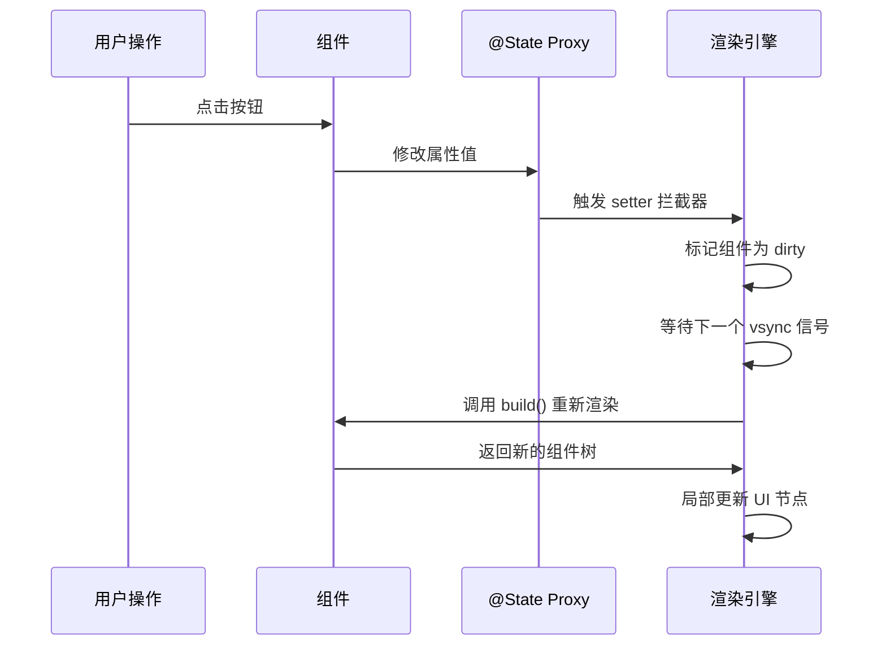
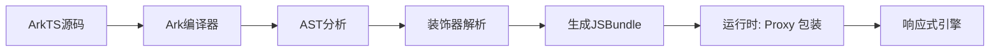

> **一句话概括**：ArkTS 的状态管理装饰器体系通过 @State、@Prop、@Link、@Provide 和 @Consume 五个核心装饰器，构建了一套从组件内私有到跨组件层级的数据驱动 UI 响应机制，是鸿蒙应用开发中管理组件状态的基石。

## 一、背景与意义

在移动端应用开发中，状态管理始终是决定应用架构质量的核心议题。传统的命令式 UI 编程需要开发者手动操作 DOM 或视图树来更新界面，随着应用复杂度提升，这种做法极易导致状态与视图的错位。

鸿蒙操作系统的 ArkTS 框架选择了声明式 UI 范式——开发者只需描述 "UI 应该是什么状态"，框架自动处理状态变更到视图更新的映射。这种范式的核心挑战在于：**如何优雅地定义状态的来源、流向和生命周期**。

ArkTS 给出的答案是装饰器体系。与 React 的 `useState`、Vue 的 `ref`/`reactive` 或 Flutter 的 `setState` 不同，ArkTS 提供了更细粒度的装饰器分工：

| 装饰器 | 可见性 | 数据流方向 | 典型场景 |
|--------|--------|------------|----------|
| @State | 组件内私有 | 单向（本地） | 表单输入、开关状态 |
| @Prop | 父→子单向 | 单向（继承） | 展示性子组件接收父数据 |
| @Link | 父↔子双向 | 双向 | 需要回写数据的子组件 |
| @Provide | 向下提供 | 广播（向下） | 跨多层传递主题、用户信息 |
| @Consume | 接收提供 | 订阅（向下） | 深层子组件获取上层数据 |

理解这套体系的本质，是写出高性能、可维护的鸿蒙应用的前提。

## 二、概念与定义

### 2.1 @State：组件内状态的基石

`@State` 是最基础的装饰器，用于声明组件的**内部可变状态**。被 `@State` 装饰的变量发生变化时，框架会自动重新渲染依赖该变量的组件。

```typescript
@Component
struct Counter {
  @State count: number = 0;

  build() {
    Column() {
      Text(`计数: ${this.count}`)
        .fontSize(24)
      Button('增加')
        .onClick(() => {
          this.count++;
        })
    }
    .padding(20)
  }
}
```

**关键特性：**
- 只能用简单类型或 `@Observed` 装饰的类类型
- 状态变更触发组件及其子组件重新渲染
- 访问始终通过 `this.xxx`，无需特殊 API

### 2.2 @Prop：单向数据流接收器

`@Prop` 允许父组件向子组件**单向传递**数据。子组件可以读取但不能直接修改。

```typescript
@Component
struct DisplayItem {
  @Prop label: string;
  @Prop isActive: boolean;

  build() {
    Row() {
      Text(this.label)
        .fontColor(this.isActive ? Color.Green : Color.Gray)
    }
  }
}
```

### 2.3 @Link：父子双向绑定

`@Link` 建立父子组件之间的**双向数据通道**，子组件对 `@Link` 变量的修改会同步回父组件。

```typescript
@Component
struct EditableField {
  @Link @Watch('onValueChange') value: string;

  onValueChange() {
    console.info(`值已更新: ${this.value}`);
  }

  build() {
    TextInput({ text: this.value })
      .onChange((val: string) => {
        this.value = val;
      })
  }
}
```

### 2.4 @Provide/@Consume：跨层级数据通道

这对装饰器解决了多层嵌套场景下的"逐层传递"痛点。

```typescript
@Component
struct ThemeProvider {
  @Provide theme: string = 'light';

  build() {
    Column() {
      ChildComponent()
      Button('切换主题')
        .onClick(() => {
          this.theme = this.theme === 'light' ? 'dark' : 'light';
        })
    }
  }
}

@Component
struct ChildComponent {
  @Consume theme: string;

  build() {
    Text(`当前主题: ${this.theme}`)
      .fontSize(16)
  }
}
```

## 三、最小示例：一个可编辑用户卡片

```typescript
@Observed
class User {
  name: string;
  age: number;
  constructor(name: string, age: number) {
    this.name = name;
    this.age = age;
  }
}

@Component
struct UserCard {
  @State user: User = new User('张三', 28);
  @State isEditing: boolean = false;

  build() {
    Column({ space: 12 }) {
      // 用户展示区域
      if (!this.isEditing) {
        Text(`姓名: ${this.user.name}`).fontSize(18)
        Text(`年龄: ${this.user.age}`).fontSize(18)
        Button('编辑').onClick(() => {
          this.isEditing = true;
        })
      } else {
        // 编辑模式使用双向绑定子组件
        EditForm({ user: this.user, onDone: () => {
          this.isEditing = false;
        }})
      }
    }
    .padding(24)
    .backgroundColor('#F5F5F5')
    .borderRadius(12)
  }
}

@Component
struct EditForm {
  @Link user: User;
  private onDone: () => void;

  build() {
    Column({ space: 8 }) {
      TextInput({ placeholder: '姓名', text: this.user.name })
        .onChange((val: string) => { this.user.name = val; })
      TextInput({ placeholder: '年龄', text: this.user.age.toString() })
        .onChange((val: string) => {
          const num = parseInt(val);
          if (!isNaN(num)) this.user.age = num;
        })
      Row({ space: 12 }) {
        Button('保存').onClick(() => this.onDone())
        Button('取消').type(ButtonType.Normal).onClick(() => this.onDone())
      }
    }
    .padding(16)
    .backgroundColor('#FFFFFF')
    .borderRadius(8)
  }
}
```

这个例子涵盖了 `@State`、`@Link` 和 `@Observed` 的协作模式。

## 四、核心知识点拆解

### 4.1 状态变量的四维属性

每个装饰器变量都可以从四个维度理解：

```mermaid
flowchart TD
    A[状态变量] --> B[所有权]
    A --> C[可变性]
    A --> D[可见范围]
    A --> E[同步方式]
    
    B -->|@State| B1[组件自身]
    B -->|@Prop| B2[父组件]
    B -->|@Link| B3[父组件共享]
    
    C -->|@State| C1[可修改]
    C -->|@Prop| C2[局部修改不反向]
    C -->|@Link| C3[修改即时反向同步]
    
    D -->|@State| D1[仅本组件]
    D -->|@Provide| D2[向下所有后代]
    D -->|@Consume| D3[接收上层Provide]
```

### 4.2 @Watch：状态变化的观察者

`@Watch` 是一个辅助装饰器，可以在状态变化时执行回调。

```typescript
@Component
struct SearchBar {
  @State @Watch('onQueryChange') query: string = '';
  @State debounceTimer: number | null = null;

  onQueryChange() {
    // 防抖处理
    if (this.debounceTimer) {
      clearTimeout(this.debounceTimer);
    }
    this.debounceTimer = setTimeout(() => {
      console.info(`执行搜索: ${this.query}`);
    }, 300);
  }

  build() {
    TextInput({ text: this.query })
      .onChange((val: string) => {
        this.query = val;
      })
  }
}
```

### 4.3 @Observed 与 @ObjectLink：深层次对象的响应式

当状态变量是对象或数组时，需要使用 `@Observed` 装饰类，配合 `@ObjectLink` 实现深层监听。

```typescript
@Observed
class TodoItem {
  title: string;
  completed: boolean;
  
  constructor(title: string) {
    this.title = title;
    this.completed = false;
  }
}

@Component
struct TodoList {
  @State items: TodoItem[] = [];

  build() {
    Column() {
      ForEach(this.items, (item: TodoItem, index: number) => {
        TodoRow({ item: item })
      }, (item: TodoItem, index: number) => item.title + index)
    }
  }
}

@Component
struct TodoRow {
  @ObjectLink item: TodoItem;

  build() {
    Row() {
      Checkbox({ isSelected: this.item.completed })
        .onChange((val: boolean) => {
          this.item.completed = val;
        })
      Text(this.item.title)
        .decoration({ type: this.item.completed ? TextDecorationType.LineThrough : TextDecorationType.None })
    }
  }
}
```

### 4.4 状态的初始化时机

不同装饰器的初始化方式有所区别：

| 装饰器 | 初始化位置 | 是否可外部赋值 |
|--------|-----------|---------------|
| @State | 声明处或构造函数 | 否，组件内私有 |
| @Prop | 父组件传参 | 是，由父组件决定 |
| @Link | 父组件传参（需用 `$` 或变量引用） | 是，但必须传参 |
| @Provide | 声明处 | 否，由提供者管理 |
| @Consume | 声明处（省略类型则自动推断） | 否，由提供者管理 |

## 五、实战案例：多层级设置页面

让我们构建一个典型的多层级设置页面，展示所有装饰器的协同工作。

```typescript
// 定义数据模型
@Observed
class AppSettings {
  userName: string = '用户';
  enableNotification: boolean = true;
  theme: 'light' | 'dark' = 'light';
  fontSize: number = 16;
}

// 顶层组件
@Entry
@Component
struct SettingsPage {
  @State settings: AppSettings = new AppSettings();

  build() {
    Column() {
      // Provide 向下提供主题和设置
      SettingsContainer({ settings: this.settings })
    }
    .width('100%')
    .height('100%')
    .backgroundColor('#F0F0F0')
  }
}

@Component
struct SettingsContainer {
  @Link settings: AppSettings;
  @Provide currentTheme: string = this.settings.theme;

  build() {
    Column({ space: 16 }) {
      Text('应用设置')
        .fontSize(24)
        .fontWeight(FontWeight.Bold)

      // 基本信息区域
      ProfileSection({ userName: this.settings.userName,
        onNameChange: (name: string) => {
          this.settings.userName = name;
        }
      })

      // 通知设置
      NotificationSection({ enabled: this.settings.enableNotification,
        onToggle: (val: boolean) => {
          this.settings.enableNotification = val;
        }
      })

      // 外观设置（深色使用 @Consume）
      AppearanceSection({ fontSize: this.settings.fontSize,
        onFontSizeChange: (size: number) => {
          this.settings.fontSize = size;
        }
      })

      Button('保存设置')
        .width('100%')
        .onClick(() => {
          console.info('设置已保存', JSON.stringify(this.settings));
        })
    }
    .padding(24)
    .width('100%')
  }
}

@Component
struct ProfileSection {
  @Prop userName: string;
  private onNameChange: (name: string) => void;

  build() {
    Column() {
      Text('个人信息').fontSize(18).fontWeight(FontWeight.Medium)
      Row() {
        Text('用户名:')
        TextInput({ text: this.userName, placeholder: '请输入用户名' })
          .onChange((val: string) => {
            this.onNameChange(val);
          })
      }
    }
    .padding(16)
    .backgroundColor(Color.White)
    .borderRadius(12)
  }
}

@Component
struct NotificationSection {
  @Prop enabled: boolean;
  private onToggle: (val: boolean) => void;

  build() {
    Column() {
      Row() {
        Text('推送通知').fontSize(18).fontWeight(FontWeight.Medium)
        Toggle({ isOn: this.enabled })
          .onChange((val: boolean) => {
            this.onToggle(val);
          })
      }
      Text('开启后接收订单状态更新推送')
        .fontSize(14)
        .fontColor(Color.Gray)
    }
    .padding(16)
    .backgroundColor(Color.White)
    .borderRadius(12)
  }
}

@Component
struct AppearanceSection {
  @Prop fontSize: number;
  private onFontSizeChange: (size: number) => void;
  @Consume currentTheme: string;

  build() {
    Column() {
      Text('外观设置').fontSize(18).fontWeight(FontWeight.Medium)
      Text(`当前主题: ${this.currentTheme}`)
      Row() {
        Text('字体大小:')
        Slider({
          value: this.fontSize,
          min: 12,
          max: 24,
          step: 2
        }).onChange((val: number) => {
          this.onFontSizeChange(val);
        })
        Text(`${this.fontSize}px`)
      }
    }
    .padding(16)
    .backgroundColor(Color.White)
    .borderRadius(12)
  }
}
```

## 六、底层原理

### 6.1 响应式追踪机制

ArkTS 的状态管理底层基于 **Proxy 代理 + 脏标记（Dirty Flag）** 机制：

```
用户交互 → 状态变更 → Proxy 劫持 setter → 
标记受影响组件为 "脏" → 下一帧收集脏组件 → 
对比 Virtual DOM → 最小化更新真实 UI
```

与 React 的 Fiber 架构不同，ArkTS 选择在**组件级别**进行脏检查，而非 virtual DOM diff：



### 6.2 装饰器的编译期处理

`@State` 等装饰器实际上是在**编译阶段**被 Ark 编译器处理的：



编译器会为每个装饰器变量生成额外的 getter/setter 代码，在运行时通过 Proxy 或 Object.defineProperty 拦截访问。

### 6.3 与 React/Vue 的对比

| 特性 | ArkTS @State | React useState | Vue ref |
|------|-------------|----------------|---------|
| 触发方式 | 属性赋值 `this.x = v` | setter `setX(v)` | `.value = v` |
| 深层监听 | 需 @Observed | 引用类型需不可变更新 | 自动深层响应 |
| 组件粒度 | 组件级脏标记 | Fiber 节点级 | 组件级 |
| 批处理 | 自动 vsync 批处理 | 自动批处理 | 自动微任务批处理 |
| 监听变化 | @Watch | useEffect | watch/watchEffect |

## 七、高频面试题解析

### Q1：@State 和 @Prop 的本质区别是什么？

**答：** 核心区别在于**数据所有权**。@State 变量归当前组件所有，组件自身拥有读写权；@Prop 变量所有权在父组件，子组件只有读取权和"临时"写入权（写入不反向传播）。如果子组件需要对父组件数据进行修改反馈，应使用 @Link。

### Q2：为什么 @Link 不能修饰基础类型的变量？

**答：** 严格来说，@Link 可以修饰基础类型，但基础类型在 JavaScript/ArkTS 中按值传递，无法建立引用关系。因此 @Link 在编译层面要求被装饰变量必须是引用类型（对象、数组、Map、Set 等），或者使用 `$` 语法让编译器自动建立双向绑定容器。

### Q3：@Provide 和 @Consume 如何解决"属性传递地狱"？

**答：** 类似 React Context 或 Vue provide/inject，@Provide 在当前组件上注册一个"状态提供点"，所有后代组件通过 @Consume 按名称匹配接收。无需逐层传递。但需要注意命名冲突和类型安全问题——建议用唯一标识符或枚举值作为 key。

```mermaid
graph TD
    subgraph "没有 @Provide/@Consume"
    A[根组件] -->|theme| B[子组件]
    B -->|theme| C[孙组件]
    C -->|theme| D[曾孙组件]
    end
    
    subgraph "使用 @Provide/@Consume"
    E[根组件] -.->|@Provide theme| F[任意层级]
    E -.->|@Provide theme| G[任意层级]
    F -.->|@Consume theme| H[深叶子节点]
    end
```

### Q4：@ObjectLink 和 @Link 有什么区别？

**答：** @ObjectLink 专用于 `@Observed` 装饰类的属性，允许在无需父组件显式传递的情况下，建立对深层对象属性的响应式监听。@Link 需要父组件显式传参建立绑定关系。推荐在 `ForEach` 循环渲染列表 Item 时使用 @ObjectLink。

### Q5：为什么说 "@State 变量变化不会立刻触发渲染"？

**答：** ArkTS 的视图更新与屏幕刷新同步（vsync 机制）。所有 @State 变更会被收集到更新队列中，在**下一帧开始前**统一计算需要重新渲染的组件。这是一种批处理优化——同帧内的多个状态变更只会触发一次重渲染。这也是为什么在同一个事件处理函数中连续修改三个 @State 变量，UI 只刷新一次。

## 八、总结与扩展

ArkTS 的状态管理装饰器体系提供了一条从简单到复杂的渐进式路径：

1. **最小成本方案**：单组件用 `@State`，父子直接用 `@Prop` + 回调，覆盖 80% 的场景
2. **中度复杂度**：引入 `@Link` 减少回调传递，`@Watch` 实现状态变更监听
3. **深度层级**：`@Provide`/`@Consume` 消除 prop drilling
4. **复杂对象**：`@Observed` + `@ObjectLink` 实现深层响应式

值得注意的是，装饰器不是万能药。在大型应用中（数百个组件），过度使用 `@Link` 可能导致数据流难以追踪。此时可以考虑引入**全局状态管理方案**（如 `AppStorage` 或 `LocalStorage`）来配合装饰器体系。

未来鸿蒙生态持续演进，ArkTS 的状态管理可能会引入更多类似 SolidJS 的细粒度响应式信号（Signal）机制。掌握当前五个核心装饰器，是理解后续演进的基础。

---

**扩展阅读：**
- [HarmonyOS 官方文档：状态管理](https://developer.harmonyos.com/cn/docs/documentation/doc-guides/arkts-state-management-0000001820811445)
- [ArkTS 装饰器使用规范](https://developer.harmonyos.com/cn/docs/documentation/doc-guides/arkts-create-custom-components-0000001820881449)
- @Watch 与 @State 配合的最佳实践
- AppStorage/LocalStorage 全局状态管理
