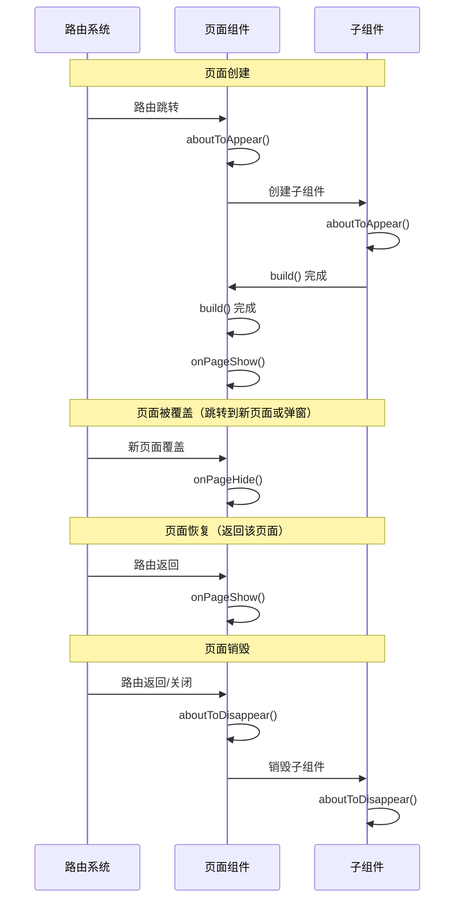

> **一句话概括**：ArkTS 生命周期覆盖了从应用启动、页面路由、组件创建渲染、到后台挂起和前/后台切换的全过程，理解组件的 `aboutToAppear → build → aboutToDisappear` 三阶段以及页面级 `onPageShow/onPageHide` 等回调，是写出无资源泄漏、无状态错乱的鸿蒙应用的前提。

## 一、背景与意义

生命周期管理是框架开发者的"入场券"。无论是 Android 的 `Activity` 生命周期、iOS 的 `ViewController` 生命周期、还是 Flutter 的 `Widget` 生命周期，所有现代 UI 框架都对生命周期有精确定义。

ArkTS 的生命周期设计融合了**页面级**和**组件级**两套体系：

- **页面级生命周期**：对应 `@Entry` 装饰的组件，管理整个页面的创建、显示、隐藏、销毁
- **组件级生命周期**：对应所有 `@Component` 装饰的自定义组件，管理组件的创建和销毁

两者的交叉控制是编写可靠组件的关键。一个典型的场景是：一个页面中有列表组件、弹窗组件、表单组件，每个组件都有自己的生命周期，而页面的生命周期则负责协调全局资源。

## 二、页面级生命周期详解

### 2.1 页面生命周期的完整阶段

```typescript
@Entry
@Component
struct DetailPage {
  @State pageData: string = '';

  // 阶段1：页面即将出现——初始化资源
  aboutToAppear() {
    console.info('DetailPage aboutToAppear');
    // 在这里初始化数据、注册事件监听
    this.loadPageData();
    this.registerObservers();
  }

  // 阶段2：构建UI——这个方法可能被多次调用
  build() {
    Column() {
      Text(`页面数据: ${this.pageData}`)
        .fontSize(18)
      // 子组件
      ChildComponent()
    }
  }

  // 阶段3：页面显示（每次页面可见都触发）
  onPageShow() {
    console.info('DetailPage onPageShow');
    // 恢复页面数据刷新、开启动画
    this.refreshData();
  }

  // 阶段4：页面隐藏（页面被覆盖时触发）
  onPageHide() {
    console.info('DetailPage onPageHide');
    // 暂停动画、释放临时资源
    this.pauseAnimations();
  }

  // 阶段5：页面即将销毁
  aboutToDisappear() {
    console.info('DetailPage aboutToDisappear');
    // 释放所有资源、取消订阅
    this.unregisterObservers();
    this.releaseResources();
  }

  private loadPageData() {
    // 模拟异步加载
    setTimeout(() => {
      this.pageData = '页面数据加载完成';
    }, 100);
  }

  private registerObservers() {
    // 注册事件监听
  }

  private unregisterObservers() {
    // 取消事件监听
  }

  private refreshData() {
    // 刷新数据
  }

  private pauseAnimations() {
    // 暂停动画
  }

  private releaseResources() {
    // 释放资源
  }
}
```

### 2.2 页面生命周期调用时序图



### 2.3 页面生命周期各阶段的典型用途

| 生命周期回调 | 触发时机 | 典型用途 | 注意事项 |
|-------------|---------|---------|---------|
| aboutToAppear | 页面创建时，build 之前 | 数据初始化、订阅事件 | 不能执行耗时操作（会阻塞 UI） |
| onPageShow | 每次页面变为可见 | 刷新数据、恢复播放器/动画 | 注意频率：每次返回都会触发 |
| onPageHide | 页面被覆盖/隐藏 | 暂停动画、保存草稿 | 不要在这里做复杂的清理 |
| aboutToDisappear | 页面即将销毁 | 释放资源、取消订阅 | 必须确保所有订阅被取消！ |

## 三、组件级生命周期详解

### 3.1 自定义组件的生命周期

每个 `@Component` 都有两个基础生命周期回调：

```typescript
@Component
struct AnalyticsCard {
  @Prop title: string;
  @State value: number = 0;
  private timerId: number = -1;

  // 组件即将挂载——初始化非状态变量、注册外部监听
  aboutToAppear() {
    console.info(`${this.title} aboutToAppear`);
    this.startTimer();
  }

  build() {
    Column() {
      Text(this.title).fontSize(16).fontWeight(FontWeight.Bold)
      Text(this.value.toString())
        .fontSize(36)
        .fontWeight(FontWeight.Bold)
        .fontColor('#007AFF')
    }
    .padding(20)
    .backgroundColor(Color.White)
    .borderRadius(12)
  }

  // 组件即将卸载——清理定时器、取消网络请求
  aboutToDisappear() {
    console.info(`${this.title} aboutToDisappear`);
    clearInterval(this.timerId);
  }

  private startTimer() {
    this.timerId = setInterval(() => {
      // 模拟实时数据更新
      this.value = Math.floor(Math.random() * 100);
    }, 2000);
  }
}
```

### 3.2 @Watch：状态变化监听器

虽然不是严格的生命周期回调，但 `@Watch` 可以让你在状态变化时执行逻辑，是"准生命周期"的存在：

```typescript
@Component
struct FormValidator {
  @State @Watch('onEmailChange') email: string = '';
  @State @Watch('onPasswordChange') password: string = '';
  @State emailError: string = '';
  @State passwordError: string = '';
  @State isFormValid: boolean = false;

  onEmailChange() {
    if (this.email.length > 0 && !this.email.includes('@')) {
      this.emailError = '请输入有效的邮箱地址';
    } else {
      this.emailError = '';
    }
    this.validateForm();
  }

  onPasswordChange() {
    if (this.password.length > 0 && this.password.length < 6) {
      this.passwordError = '密码长度不能少于6位';
    } else {
      this.passwordError = '';
    }
    this.validateForm();
  }

  private validateForm() {
    this.isFormValid =
      this.email.includes('@') &&
      this.password.length >= 6;
  }

  build() {
    Column({ space: 8 }) {
      TextInput({ text: this.email, placeholder: '邮箱' })
        .onChange((val: string) => { this.email = val; })
      if (this.emailError !== '') {
        Text(this.emailError).fontColor(Color.Red).fontSize(12)
      }

      TextInput({ text: this.password, placeholder: '密码' })
        .type(InputType.Password)
        .onChange((val: string) => { this.password = val; })
      if (this.passwordError !== '') {
        Text(this.passwordError).fontColor(Color.Red).fontSize(12)
      }

      Button('提交')
        .enabled(this.isFormValid)
        .width('100%')
        .onClick(() => {
          console.info('表单提交');
        })
    }
    .padding(24)
  }
}
```

### 3.3 条件渲染中的生命周期

当使用 `if/else` 条件渲染时，组件的生命周期与可见性直接绑定：

```typescript
@Entry
@Component
struct ConditionalLifecycle {
  @State showPanel: boolean = false;
  @State count: number = 0;

  build() {
    Column({ space: 16 }) {
      Text(`计数: ${this.count}`).fontSize(18)

      Button(this.showPanel ? '隐藏面板' : '显示面板')
        .onClick(() => {
          this.showPanel = !this.showPanel;
        })

      // 条件渲染——面板的 aboutToAppear/disappear 依赖 showPanel
      if (this.showPanel) {
        StatefulPanel({ count: $count })
      }

      Text('注意观察面板的 aboutToAppear/disappear 日志')
        .fontSize(12)
        .fontColor(Color.Gray)
    }
    .padding(24)
  }
}

@Component
struct StatefulPanel {
  @Link count: number;
  private loadTime: number = 0;

  aboutToAppear() {
    this.loadTime = Date.now();
    console.info('StatefulPanel 创建，加载耗时开始计时');
  }

  aboutToDisappear() {
    const elapsed = Date.now() - this.loadTime;
    console.info(`StatefulPanel 销毁，存活 ${elapsed}ms`);
  }

  build() {
    Column({ space: 12 }) {
      Text('这个面板有完整的生命周期')
        .fontSize(16)
      Button('增加计数')
        .onClick(() => {
          this.count++;
        })
      Button('减少计数')
        .onClick(() => {
          this.count--;
        })
    }
    .padding(20)
    .backgroundColor('#F0F8FF')
    .borderRadius(12)
  }
}
```

当 `showPanel` 变为 `false` 时，`StatefulPanel` 的 `aboutToDisappear` 被调用，组件及其所有子组件的 DOM 节点被移除。这就是为什么`if`条件渲染会让组件"重生"——每次显隐切换都是完整的创建和销毁。

### 3.4 ForEach 列表中的生命周期

`ForEach` 是动态列表，每个 Item 组件同样有完整的生命周期：

```typescript
@Entry
@Component
struct DynamicList {
  @State items: string[] = ['A', 'B', 'C', 'D', 'E'];

  build() {
    Column({ space: 8 }) {
      Button('移除第一项')
        .onClick(() => {
          if (this.items.length > 0) {
            this.items.shift();
            this.items = [...this.items]; // 触发响应式更新
          }
        })

      Button('在末尾添加一项')
        .onClick(() => {
          const nextLabel = String.fromCharCode(65 + this.items.length);
          this.items.push(nextLabel);
          this.items = [...this.items];
        })

      ForEach(this.items, (item: string) => {
        ListItem(item)
      }, (item: string) => item)
    }
    .padding(24)
  }
}

@Component
struct ListItem {
  @Prop label: string;

  aboutToAppear() {
    console.info(`ListItem ${this.label} 创建`);
  }

  aboutToDisappear() {
    console.info(`ListItem ${this.label} 销毁`);
  }

  build() {
    Row() {
      Text(this.label)
        .fontSize(18)
        .fontWeight(FontWeight.Bold)
    }
    .padding(16)
    .backgroundColor(Color.White)
    .borderRadius(8)
    .shadow({ radius: 2, color: '#20000000' })
    .width('100%')
  }
}
```

需要注意的是，`ForEach` 的第三个参数——`keyGenerator` 函数——直接影响 Item 组件的生命周期。如果 key 不变，ArkTS 会复用组件实例，不会触发 `aboutToDisappear` 和 `aboutToAppear`。因此，key 的选择直接决定了组件的"存活性"。

## 四、页面路由中的生命周期联动

### 4.1 路由跳转完整示例

```typescript
// PageA.ets
@Entry
@Component
struct PageA {
  aboutToAppear() {
    console.info('PageA aboutToAppear');
  }

  onPageShow() {
    console.info('PageA onPageShow');
  }

  onPageHide() {
    console.info('PageA onPageHide');
  }

  aboutToDisappear() {
    console.info('PageA aboutToDisappear');
  }

  build() {
    Column({ space: 16 }) {
      Text('页面 A').fontSize(24)
      Button('跳转到页面 B')
        .onClick(() => {
          router.pushUrl({
            url: 'pages/PageB'
          });
        })
    }
    .padding(24)
  }
}

// PageB.ets
@Entry
@Component
struct PageB {
  aboutToAppear() {
    console.info('PageB aboutToAppear');
  }

  onPageShow() {
    console.info('PageB onPageShow');
  }

  onPageHide() {
    console.info('PageB onPageHide');
  }

  aboutToDisappear() {
    console.info('PageB aboutToDisappear');
  }

  build() {
    Column({ space: 16 }) {
      Text('页面 B').fontSize(24)
      Button('返回页面 A')
        .onClick(() => {
          router.back();
        })

      Button('替换为页面 C')
        .onClick(() => {
          router.replaceUrl({
            url: 'pages/PageC'
          });
        })
    }
    .padding(24)
  }
}
```

操作过程日志输出：

```
# 从 PageA 跳转到 PageB
PageA aboutToAppear → PageA onPageShow → 
Button clicked → PageB aboutToAppear → PageB onPageShow → PageA onPageHide

# 从 PageB 返回 PageA
PageB aboutToDisappear → PageA onPageShow → PageB onPageHide [已销毁]

# 注意：replaceUrl 时
PageB aboutToAppear → PageB onPageShow →
replaceUrl → PageC aboutToAppear → PageB aboutToDisappear → PageC onPageShow
```

## 五、实战案例：音视频播放器页面

```typescript
@Entry
@Component
struct PlayerPage {
  @State isPlaying: boolean = false;
  @State currentTime: number = 0;
  @State duration: number = 240; // 假设 4 分钟
  @State isSliderDragging: boolean = false;
  private mediaPlayer: MediaPlayer = new MediaPlayer();
  private progressTimer: number = -1;

  aboutToAppear() {
    console.info('PlayerPage: 初始化播放器');
    // 初始化播放器
    this.mediaPlayer.init();
    // 加载歌曲信息
    this.loadSongInfo();
    // 注册系统事件
    this.registerSystemEvents();
  }

  onPageShow() {
    console.info('PlayerPage: 页面变为可见');
    // 恢复播放进度更新
    this.startProgressUpdate();
    // 如果之前正在播放，恢复播放
    if (this.isPlaying) {
      this.mediaPlayer.resume();
    }
  }

  onPageHide() {
    console.info('PlayerPage: 页面被隐藏');
    // 暂停进度更新（减少不必要的渲染）
    this.stopProgressUpdate();
    // 暂停播放——注意：不要释放资源
    if (this.isPlaying) {
      this.mediaPlayer.pause();
    }
    // 保存播放位置
      this.savePlaybackPosition();
    }

  aboutToDisappear() {
    console.info('PlayerPage: 页面销毁');
    // 停止播放
    this.mediaPlayer.stop();
    // 释放播放器资源
    this.mediaPlayer.release();
    // 取消所有定时器
    this.stopProgressUpdate();
    // 取消事件监听
    this.unregisterSystemEvents();
    // 保存最终播放进度到本地
    this.savePlaybackPosition();
  }

  private loadSongInfo() {
    // 加载歌曲元数据
  }

  private startProgressUpdate() {
    if (this.progressTimer === -1) {
      this.progressTimer = setInterval(() => {
        if (!this.isSliderDragging && this.isPlaying) {
          this.currentTime = Math.min(
            this.currentTime + 1,
            this.duration
          );
          if (this.currentTime >= this.duration) {
            this.isPlaying = false;
            this.currentTime = 0;
          }
        }
      }, 1000);
    }
  }

  private stopProgressUpdate() {
    if (this.progressTimer !== -1) {
      clearInterval(this.progressTimer);
      this.progressTimer = -1;
    }
  }

  private registerSystemEvents() {
    // 注册耳机插拔、电话来电等系统事件
  }

  private unregisterSystemEvents() {
    // 取消所有系统事件监听
  }

  private savePlaybackPosition() {
    // 保存播放进度到本地存储
  }

  build() {
    Column() {
      // 专辑封面
      Image($r('app.media.album_cover'))
        .width(240)
        .height(240)
        .borderRadius(16)
        .margin({ top: 40 })

      Text('歌曲标题')
        .fontSize(22)
        .fontWeight(FontWeight.Bold)
        .margin({ top: 24 })

      Text('艺术家名称')
        .fontSize(14)
        .fontColor(Color.Gray)

      // 进度条
      Row({ space: 8 }) {
        Text(this.formatTime(this.currentTime))
          .fontSize(12)
        Slider({
          value: this.currentTime,
          min: 0,
          max: this.duration
        })
        .onChange((val: number) => {
          this.currentTime = val;
          this.isSliderDragging = true;
        })
        .onChangeEnd(() => {
          this.mediaPlayer.seek(this.currentTime);
          this.isSliderDragging = false;
        })
        .layoutWeight(1)
        Text(this.formatTime(this.duration))
          .fontSize(12)
      }
      .padding({ left: 24, right: 24 })
      .width('100%')

      // 控制按钮
      Row({ space: 32 }) {
        Button('⏮')
          .fontSize(20)
          .type(ButtonType.Circle)
        Button(this.isPlaying ? '⏸' : '▶')
          .fontSize(28)
          .type(ButtonType.Circle)
          .width(56).height(56)
          .onClick(() => {
            this.isPlaying = !this.isPlaying;
            if (this.isPlaying) {
              this.mediaPlayer.play();
              this.startProgressUpdate();
            } else {
              this.mediaPlayer.pause();
              this.stopProgressUpdate();
            }
          })
        Button('⏭')
          .fontSize(20)
          .type(ButtonType.Circle)
      }
      .margin({ top: 32 })
    }
    .width('100%')
    .height('100%')
  }

  private formatTime(seconds: number): string {
    const min = Math.floor(seconds / 60);
    const sec = Math.floor(seconds % 60);
    return `${min.toString().padStart(2, '0')}:${sec.toString().padStart(2, '0')}`;
  }
}
```

## 六、高频面试题解析

### Q1：aboutToAppear 中做异步操作会有什么问题？

**答：** `aboutToAppear` 在 `build()` 之前同步执行。如果在这里启动一个 3 秒的网络请求，请求回调回来时 UI 已经构建完成，组件状态已经初始化，所以不会阻塞 UI。但需要注意：如果在 `aboutToAppear` 中调用 `setTimeout` 或网络请求，回调中的 `this` 指向始终正确，但要注意回调执行时组件可能已经被销毁（比如用户快速返回上一页）。**建议在异步回调中检查组件状态的有效性。**

### Q2：onPageShow 和 aboutToAppear 的执行顺序是什么？如果页面有弹窗覆盖又关闭，哪个会触发？

**答：** 首次创建：`aboutToAppear → build → onPageShow`。如果弹窗覆盖又关闭，弹窗本身不会触发页面的生命周期。只有**页面级**的路由切换（`router.pushUrl` / `router.back`）才会触发 `onPageHide` 和 `onPageShow`。弹窗（Dialog）属于组件级覆盖，不影响页面生命周期。

### Q3：ForEach 列表滚动时，Item 组件会频繁触发 aboutToAppear/disappear 吗？

**答：** **不会**。ForEach 创建的组件实例会一直存在——只要 key 不变。只有在 key 变化（数据增删改导致 key 变化）时，组件才会销毁重建。滚动过程中，Item 可能是复用的（列表组件内部的节点复用机制），但不会触发生命周期回调。这是一种性能优化。

### Q4：在 aboutToDisappear 中能否安全地修改 @State？

**答：** 技术上可以，但没有意义。因为组件即将销毁，UI 不会再渲染。而且修改 @State 可能触发不必要的计算（如 @Watch 回调）。最佳实践是：在 `aboutToDisappear` 中只做清理工作，不要修改状态。

### Q5：页面被系统回收后如何恢复状态？

**答：** 鸿蒙应用支持"状态保存与恢复"。当应用被系统回收时，框架会自动保存当前页面的状态字段（以 JSON 形式）。当用户重新打开应用时，页面会执行 `aboutToAppear`，但不会执行 `onPageShow`——因为是从冷启动恢复。**主要状态恢复路径**是：应用启动 → 读取持久化存储 → 在 `aboutToAppear` 中恢复关键状态。

## 七、底层原理：生命周期是如何实现的？

ArkTS 的生命周期机制基于**框架层调度**实现：

```
1. 编译阶段：Ark 编译器解析 @Entry 和 @Component 装饰器
2. 生成附加代码：在每个生命周期回调点插入钩子函数
3. 运行时调度：
   - 页面管理器维护页面栈
   - 组件树管理器维护组件实例树
   - 路由变化时触发页面级回调
   - 组件增删时触发组件级回调
```

关键设计决策：
- **生命周期不是 XML 配置**——硬编码在框架源码中，保证性能
- **build() 可能被多次调用**——不是生命周期方法，而是渲染方法
- **子组件生命周期嵌套**在父组件中——保证了资源的层级释放顺序

## 八、总结与扩展

ArkTS 的生命周期看似简单（创建→显示→隐藏→销毁），但在实际开发中需要考虑诸多细节：

1. **资源对称性**：`aboutToAppear` 中做的事情，要在 `aboutToDisappear` 中成对撤销
2. **分层管理**：页面级生命周期负责全局资源，组件级生命周期负责局部资源
3. **容错设计**：异步回调中需判断组件是否仍存活
4. **状态保存**：利用持久化存储应对系统回收

当我们把生命周期理解为一组"资源获取与释放的对称操作"时，很多设计决策就变得清晰了。**生命周期的本质不是"事件通知"，而是"资源管理契约"**——框架承诺在一定的时间点调用你的方法，你承诺在这些方法中正确地获取和释放资源。

---

**扩展阅读：**
- HarmonyOS 页面路由生命周期完整指南
- 组件状态保存与恢复原理
- WindowStage 生命周期与多窗口适配
- 应用级生命周期（onForeground/onBackground）
