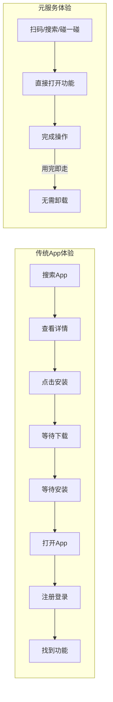
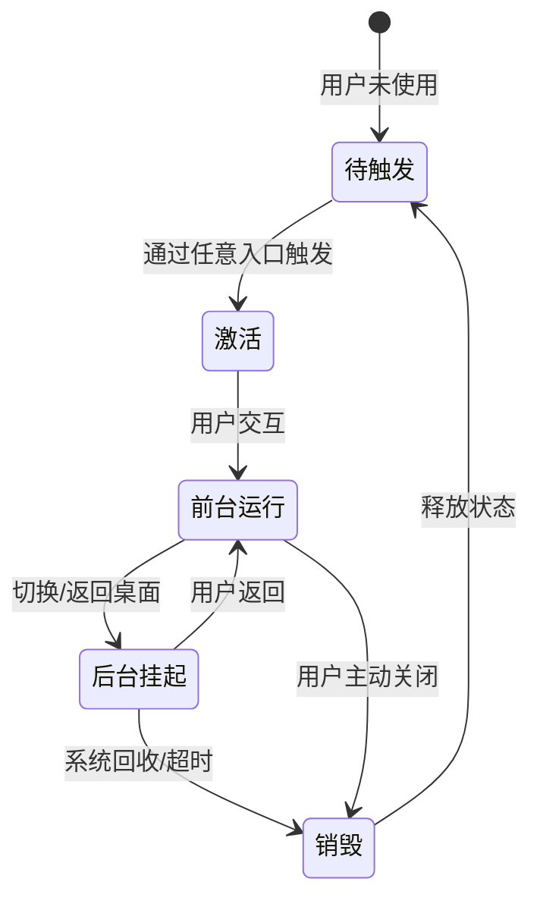
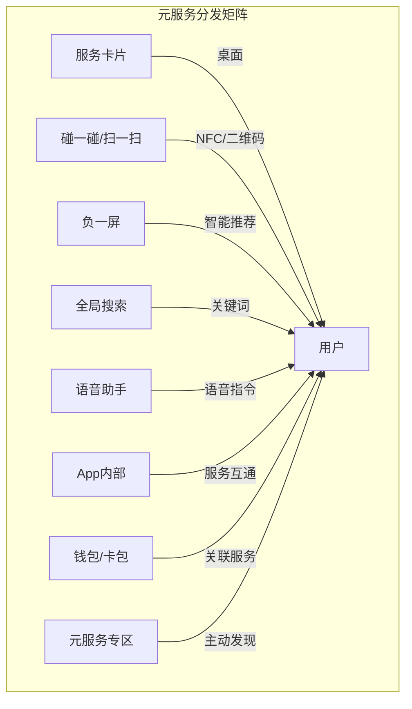
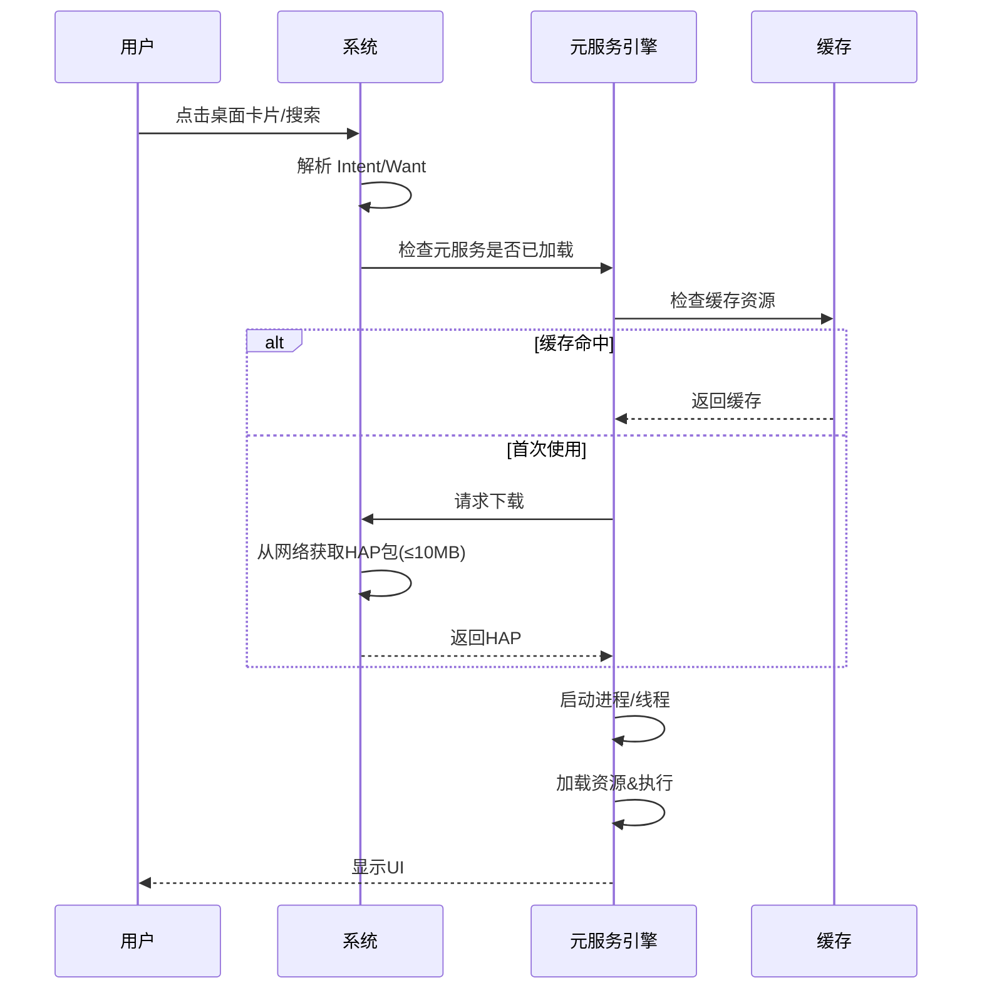

> **一句话概括**：鸿蒙元服务是一种"免安装、即用即走、轻量级"的原子化应用形态，通过卡片、快捷方式和 API 等多种入口触达用户，其核心设计理念是"服务找人"而非"人找服务"，与传统 App 形成互补而非替代关系。

## 一、背景与意义

### 1.1 为什么需要元服务？

传统移动应用（App）面临两个核心困境：

**安装成本高**：用户需要打开应用商店、搜索、下载、安装、注册——平均需要7-10步操作才能接触到核心功能。根据华为统计，应用详情页到实际激活的转化率不足30%，超过40%的用户在安装步骤中流失。

**服务触达难**：App 像"围墙花园"，核心功能深埋在多层导航之下。用户完成一次外卖支付可能需要打开App→首页→点击外卖→选择商家→加入购物车→结算→支付，7步操作只完成了一个简单的支付行为。

鸿蒙元服务（Atomic Service）旨在解决这两个问题——**让用户在最短路径上完成核心服务消费**。

### 1.2 元服务 vs. 传统 App



| 对比维度 | 传统App | 元服务 |
|---------|--------|--------|
| 安装方式 | 需下载安装包 | 免安装，即点即用 |
| 体积 | 数十MB~数GB | ≤10MB |
| 生命周期 | 安装→常驻→手动卸载 | 触发→使用→自动销毁 |
| 入口方式 | 桌面图标 | 扫码/搜索/碰一碰/卡片/App内跳转 |
| 数据存储 | 本地+云端 | 云端优先，本地缓存 |
| 开发语言 | 多种 | ArkTS（推荐） |
| 上架渠道 | 应用商店 | 元服务专区+多种分发渠道 |

## 二、概念与定义

### 2.1 元服务的形态

元服务以四种核心形态存在：

**1. 服务卡片（Service Widget）**
桌面上的"信息快照"，用户可以快速查看信息或执行简单操作。

```typescript
// 服务卡片的 ArkTS 实现示例
@Entry
@Component
struct WeatherWidget {
  @State temperature: number = 24;
  @State weatherIcon: Resource = $r('app.media.sunny');
  @State city: string = '深圳';

  build() {
    Column() {
      Text(this.city)
        .fontSize(12)
        .fontColor('#FFFFFF')

      Image(this.weatherIcon)
        .width(32)
        .height(32)

      Text(`${this.temperature}°C`)
        .fontSize(28)
        .fontColor('#FFFFFF')
        .fontWeight(FontWeight.Bold)

      Text('点击查看详情')
        .fontSize(10)
        .fontColor('#80FFFFFF')
    }
    .width('100%')
    .height('100%')
    .backgroundColor('#007AFF')
    .borderRadius(16)
    .padding(12)
    .onClick(() => {
      // 打开元服务详情页
      this.openDetailAbility();
    })
  }

  private openDetailAbility() {
    // 使用 want 启动元服务的详情页面
    const want = {
      bundleName: 'com.example.weather',
      abilityName: 'DetailAbility'
    };
    this.context.startAbility(want);
  }
}
```

**2. 快捷方式（Shortcut）**
直接指向元服务特定功能的桌面图标，跳过首页直达功能页。

**3. API 服务**
提供供其他 App 或元服务调用的能力开放接口。

**4. 应用内跳转**
用户在使用 App 时，通过系统智能推荐跳转到相关元服务。

### 2.2 元服务与 App 的关系

```
+------------------------+      +------------------------+
|       App (完整)        |      |   元服务 (原子化)       |
|                        |      |                        |
|  - 完整功能集          |      |  - 单一核心功能         |
|  - 独立用户体系        |      |  - 华为账号打通         |
|  - 本地数据持久化      |      |  - 云端数据为主          |
|  - 复杂界面层级        |      |  - 轻量级界面           |
|  - 需主动下载          |      |  - 免安装即用           |
+------------------------+      +------------------------+
           \                           /
            \     互补协作架构         /
             \    +------------+      /
              +--| App + 元服务 |----+
                  +------------+
```

**最佳实践：** 大多数开发者在开发 App 的同时，提取其中高频使用的1-3个核心功能做成元服务。例如：电商 App 的"物流查询"和"扫码支付"功能可以独立为元服务。

## 三、最小示例：一个快递查询元服务

```typescript
// 元服务配置文件（module.json5 核心片段）
// {
//   "module": {
//     "name": "express_query",
//     "type": "atomic_service",
//     "abilities": [
//       {
//         "name": "MainAbility",
//         "srcEntrance": "./ets/MainAbility/MainAbility.ets",
//         "visible": true,
//         "skills": [
//           {
//             "entities": ["entity.system.home"],
//             "actions": ["action.system.home"]
//           }
//         ],
//         "formsEnabled": true,
//         "forms": [
//           {
//             "name": "ExpressWidget",
//             "src": "./ets/Widget/ExpressWidget.ets",
//             "window": {
//               "designWidth": 360,
//               "autoDesignWidth": true
//             }
//           }
//         ]
//       }
//     ]
//   }
// }

// 元服务入口页面
@Entry
@Component
struct ExpressQueryService {
  @State packageId: string = '';
  @State result: string = '';
  @State isLoading: boolean = false;

  build() {
    Column({ space: 16 }) {
      // 顶部区域
      Text('快递查询')
        .fontSize(24)
        .fontWeight(FontWeight.Bold)

      Text('输入快递单号，快速查询物流状态')
        .fontSize(14)
        .fontColor(Color.Gray)

      // 搜索输入框
      TextInput({ text: this.packageId, placeholder: '请输入快递单号' })
        .onChange((val: string) => {
          this.packageId = val;
        })
        .height(48)
        .backgroundColor(Color.White)
        .borderRadius(24)
        .padding({ left: 16 })

      // 查询按钮
      Button('查询')
        .width('100%')
        .height(48)
        .enabled(this.packageId.length > 0)
        .onClick(() => {
          this.queryExpress();
        })

      // 加载状态
      if (this.isLoading) {
        LoadingProgress()
          .width(32)
          .height(32)
      }

      // 查询结果
      if (this.result.length > 0) {
        Column() {
          Text('查询结果')
            .fontSize(18)
            .fontWeight(FontWeight.Medium)
          Text(this.result)
            .fontSize(14)
            .fontColor('#666666')
        }
        .padding(16)
        .backgroundColor(Color.White)
        .borderRadius(12)
        .width('100%')
      }

      // 推荐功能——引导安装完整App
      Button('获取完整版App（含更多功能）')
        .type(ButtonType.Normal)
        .fontSize(12)
        .onClick(() => {
          // 引导下载完整App
        })
    }
    .padding(24)
    .width('100%')
    .height('100%')
    .backgroundColor('#F5F5F5')
  }

  private async queryExpress() {
    this.isLoading = true;
    try {
      // 模拟网络查询
      await new Promise<void>((resolve) => {
        setTimeout(() => {
          this.result = `物流状态：运输中\n最新动态：已到达深圳分拨中心\n预计送达：明天 18:00`;
          resolve();
        }, 1500);
      });
    } finally {
      this.isLoading = false;
    }
  }
}
```

## 四、核心知识点拆解

### 4.1 元服务的生命周期

元服务的设计哲学是"即用即走"，其生命周期与传统 App 有显著差异：



**关键差异：**
- 元服务没有"常驻后台"概念——挂起后随时可能被回收
- 元服务资源在销毁时全部释放
- 元服务的状态应优先存储在云端而非本地

### 4.2 元服务的分发渠道

元服务的入口远多于传统 App：



每种渠道对应不同的触发场景。开发者需要为每种入口准备对应的入口参数（want 参数）。

### 4.3 元服务的数据模型

元服务推荐"云端优先"的数据模型：

```typescript
// 元服务的数据访问模式
class AtomicDataService {
  // 1. 从云端获取数据
  async fetchFromCloud(key: string): Promise<string> {
    // 调用华为云服务 API
    return '';
  }

  // 2. 检查本地缓存（可选）
  getFromCache(key: string): string | null {
    // 元服务可以使用有限的本地存储
    return null;
  }

  // 3. 数据同步策略
  // - 首次打开：网络优先，缓存兜底
  // - 后续使用：缓存优先，后台刷新
  // - 离线模式：仅使用缓存数据
}
```

## 五、实战案例：天气元服务

一个完整的天气元服务，包含服务卡片和页面两种形态：

```typescript
// 1. 服务卡片组件
@Entry
@Component
struct WeatherServiceWidget {
  @StorageLink('weather_temperature') temperature: number = 0;
  @StorageLink('weather_condition') condition: string = '晴';
  @StorageLink('weather_city') city: string = '';
  private widgetSize: number = 2;  // 2×1 或 2×2 卡片

  aboutToAppear() {
    this.updateWeatherData();
  }

  private updateWeatherData() {
    // 获取天气数据
    const data = WeatherService.getCurrentWeather();
    this.temperature = data.temperature;
    this.condition = data.condition;
    this.city = data.city;
  }

  build() {
    Column() {
      Row() {
        Text(this.city)
          .fontSize(14)
        Text(`${this.temperature}°`)
          .fontSize(36)
          .fontWeight(FontWeight.Bold)
        Text(this.condition)
          .fontSize(14)
          .margin({ left: 8 })
      }
    }
    .width('100%')
    .height('100%')
    .padding(12)
    .backgroundColor('#E3F2FD')
    .onClick(() => {
      const want = {
        bundleName: 'com.example.weather',
        abilityName: 'DetailAbility',
        parameters: {
          'from': 'widget'
        }
      };
      this.context.startAbility(want);
    })
  }
}

// 2. 天气详情页面
@Entry
@Component
struct WeatherDetailPage {
  @State forecast: WeatherForecast[] = [];
  @State currentWeather: CurrentWeather = { temp: 0, condition: '', humidity: 0, windSpeed: 0 };

  aboutToAppear() {
    this.loadWeatherData();
  }

  private async loadWeatherData() {
    // 从云端获取数据
    const data = await WeatherService.getDetailedWeather();
    this.currentWeather = data.current;
    this.forecast = data.forecast;
  }

  build() {
    Scroll() {
      Column({ space: 16 }) {
        // 当前天气
        CurrentWeatherCard({ weather: this.currentWeather })

        // 逐时预报
        Text('逐时预报').fontSize(18).fontWeight(FontWeight.Bold)
        Scroll() {
          Row({ space: 12 }) {
            ForEach(this.forecast.slice(0, 8), (item: WeatherForecast) => {
              Column() {
                Text(item.hour).fontSize(12)
                Image(item.icon).width(24).height(24)
                Text(`${item.temp}°`).fontSize(16)
              }
            }, (item: WeatherForecast) => item.hour)
          }
        }
        .scrollable(ScrollDirection.Horizontal)

        // 7天预报
        Text('7天预报').fontSize(18).fontWeight(FontWeight.Bold)
        ForEach(this.forecast, (item: WeatherForecast) => {
          Row() {
            Text(item.day).width(60)
            Image(item.icon).width(24).height(24)
            Text(`${item.lowTemp}°/${item.highTemp}°`)
            Text(item.condition)
          }
          .padding(8)
          .width('100%')
        }, (item: WeatherForecast) => item.day)

        // 引导安装App
        Button('获取完整天气App')
          .type(ButtonType.Normal)
          .fontSize(12)
          .width('100%')
      }
      .padding(24)
    }
  }
}
```

## 六、底层原理：元服务的运行时模型

### 6.1 元服务的启动过程



### 6.2 资源粒度控制

元服务使用 HAP（Harmony Ability Package）包格式，通常 ≤10MB。为了控制体积，推荐：

1. **按需加载**：使用动态 import 只加载需要的模块
2. **资源压缩**：图片使用 WebP 格式，图标使用 SVG
3. **云端资源**：将大资源（字体、大图）放在云端，第一次使用时下载
4. **代码分割**：将不常使用的功能延迟加载

### 6.3 与PWA的对比

| 维度 | 鸿蒙元服务 | PWA |
|------|-----------|-----|
| 平台 | 仅鸿蒙 | 所有现代浏览器 |
| 安装 | 免安装，系统级 | 可添加到桌面 |
| 权限 | 支持更多系统能力 | 受限于 Web API |
| 性能 | 原生渲染 | 浏览器渲染 |
| 更新 | 自动更新 | 每次打开请求最新 |
| 分发 | 华为体系 | 网址分发 |

## 七、高频面试题解析

### Q1：元服务能完全替代 App 吗？

**答：** 不能。元服务的定位是"补充"而非"替代"。元服务适合高频、轻量、单一功能场景（查询天气、扫码支付、查看快递等），但在复杂场景（视频编辑、大型游戏、多步骤表单）中，完整 App 的体验远优于元服务。**最佳策略是 App + 元服务互补**——App 提供完整能力，元服务覆盖高频入口场景。

### Q2：元服务如何做用户登录？

**答：** 元服务不需要单独的登录系统。它利用华为账号体系，通过 `@ohos.account.appAccount` 接口可以直接获取当前登录用户的身份信息。用户首次使用元服务时，系统自动唤起授权对话框，用户同意后即可获取基本用户信息（昵称、头像）。元服务不应该要求用户注册独立的账号。

### Q3：元服务可以推送通知吗？

**答：** 可以。元服务支持通过推送服务发送通知，但限制比 App 更严格：只有用户最近使用过的元服务才能发送通知，推送频率也受系统管控。建议元服务仅发送高价值通知（如物流状态变更、航班变动），避免滥用。

### Q4：元服务的数据持久化怎么做？

**答：** 元服务的持久化策略分层：1）关键数据使用云端存储（华为云数据库），保证跨设备同步；2）非敏感数据使用 AppStorage（应用级持久化）；3）缓存数据使用 Preferences（轻量 KV 存储）。**注意**：元服务可能随时被销毁，不能依赖本地持久化作为唯一数据来源。

### Q5：元服务的性能如何保障？

**答：** 元服务的性能优化集中在包体控制和首屏渲染：1）HAP 包 ≤10MB 保证快速下载；2）首屏数据优先从缓存读取，减少白屏时间；3）使用 LazyForEach 处理长列表；4）关键资源预加载。元服务引擎会对元服务分配独立的轻量进程，资源隔离性好。

## 八、总结与扩展

鸿蒙元服务的核心理念可以概括为：**"服务即碎片（Service as Fragment）"**——将完整应用的能力拆解为可独立运行、独立分发、独立更新的功能碎片。

**开发者需要转变的思维方式：**
1. 从 "做一个 App" 转向 "拆一组服务"
2. 从 "用户主动来找" 转向 "智能推送给用户"
3. 从 "本地优先" 转向 "云端优先"
4. 从 "完整功能" 转向 "最小可用功能"

**元服务的适用场景清单：**
- ✅ 查询类（物流、天气、余额、交通）
- ✅ 轻操作类（扫码支付、签到打卡、预约）
- ✅ 信息展示类（股票行情、新闻头条、日程）
- ✅ 一键服务类（打车呼叫、点单、开门禁）
- ❌ 复杂编辑类（视频剪辑、文档编辑）
- ❌ 沉浸体验类（游戏、直播、VR）

理解元服务的定位和限制，可以帮助我们在鸿蒙生态中做出正确的架构决策——什么时候拆成元服务，什么时候保留为完整 App。

---

**扩展阅读：**
- HarmonyOS 元服务开发指南
- HAP 包规范与打包配置
- 服务卡片生态接入规范
- 元服务与 App 分发生态体系
