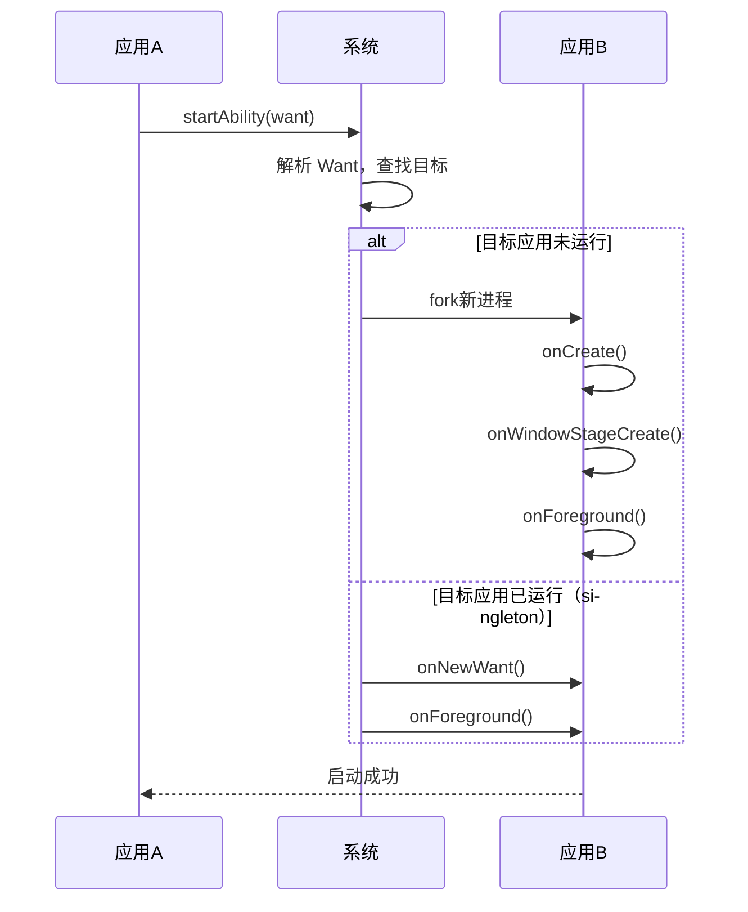
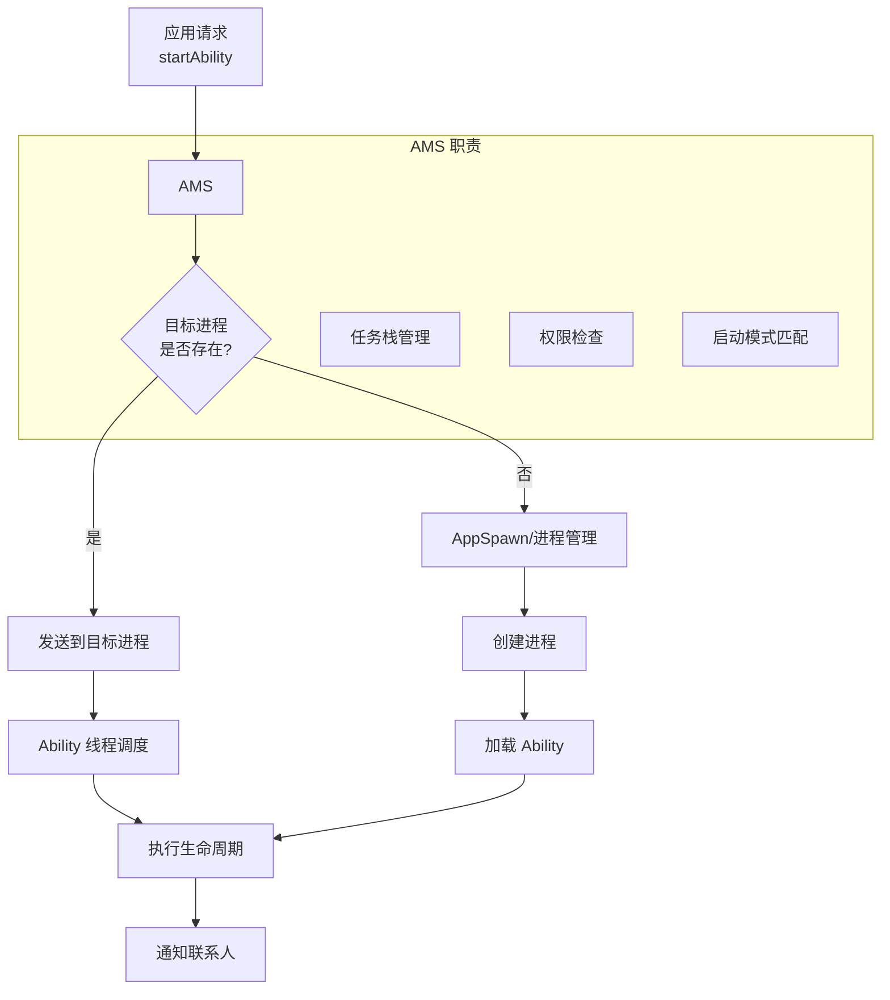

> **一句话概括**：Ability 是鸿蒙应用的基本组成单元，从早期 FA（Feature Ability）模型演进到当前推荐的 Stage 模型，Ability 体系经历了从"页面即 Ability"到"Ability 作为功能容器"的架构升级，理解这一演进是掌握鸿蒙应用架构设计的关键。

## 一、背景与意义

### 1.1 从 FA 到 Stage：为什么需要演进？

鸿蒙系统在 HarmonyOS 2.0 ~ 3.0 时期使用 **FA 模型**（Feature Ability 模型），其核心思路是"一个页面一个 Ability"。这种设计简单直接，但随着应用复杂度提升，暴露出几个问题：

```mermaid
flowchart LR
    subgraph "FA模型 (HarmonyOS 2-3)"
        A1[PageA\Ability] --> A2[PageB\Ability]
        A2 --> A3[PageC\Ability]
        A1 --> A4[Service\Ability]
        A4 --> A5[Data\Ability]
    end
    
    subgraph "Stage模型 (HarmonyOS 4+)"
        B1[UIAbility\n(应用进程)] --> B2[Page1]
        B1 --> B3[Page2]
        B1 --> B4[Page3]
        B5[ServiceExtension] --> B6[后台任务]
        B7[FormExtension] --> B8[桌面卡片]
    end
```

**FA 模型的问题**：
- 每个页面独立 Ability → 冷启动成本高
- 页面间通信复杂（需跨 Ability 的 Want 机制）
- 生命周期管理粒度与页面不匹配

**Stage 模型的优势**：
- 同一个 UIAbility 管理多个页面 → 页面跳转是进程内操作
- 组件化能力分离（ExtensionAbility 承载后台/卡片/服务）
- 生命周期与窗口和焦点绑定，更接近 Android Activity 的成熟模式

### 1.2 Stage 模型的核心思想

Stage 模型的核心设计原则：**"一个 Ability 容纳一组 UI 页面，一个 Extension 承载一项后台能力"**。

```typescript
// Stage 模型下的 Ability 配置
// module.json5 关键配置
{
  "module": {
    "name": "entry",
    "type": "entry",
    "srcEntrance": "./ets/Application/MyAbilityStage.ets",
    "abilities": [
      {
        "name": "MainAbility",
        "srcEntrance": "./ets/MainAbility/MainAbility.ets",
        "launchType": "singleton",
        "description": "$string:mainability_description",
        "visible": true
      }
    ],
    "extensionAbilities": [
      {
        "name": "ServiceExtension",
        "srcEntrance": "./ets/ServiceExtAbility/ServiceExtAbility.ets",
        "type": "service"
      },
      {
        "name": "FormAbility",
        "srcEntrance": "./ets/FormAbility/FormAbility.ets",
        "type": "form"
      }
    ]
  }
}
```

## 二、Ability 类型详解

### 2.1 UIAbility——界面承载者

UIAbility 是 Stage 模型中最核心的类型，负责用户界面的展示和交互。

```typescript
import UIAbility from '@ohos.app.ability.UIAbility';
import Window from '@ohos.window';

export default class MainAbility extends UIAbility {
  // UIAbility 生命周期
  onCreate(want: Want, launchParam: AbilityConstant.LaunchParam) {
    console.info('MainAbility onCreate');
    // 初始化全局资源：数据库连接、全局配置
    AppStorage.setOrCreate('app_initialized', true);
  }

  onDestroy() {
    console.info('MainAbility onDestroy');
    // 清理全局资源
    AppStorage.setOrCreate('app_initialized', false);
  }

  onWindowStageCreate(windowStage: Window.WindowStage) {
    console.info('MainAbility onWindowStageCreate');
    // 加载页面内容
    windowStage.loadContent('pages/Index', (err, data) => {
      if (err) {
        console.error('加载页面失败:', JSON.stringify(err));
        return;
      }
      console.info('页面加载成功');
    });
  }

  onWindowStageDestroy() {
    console.info('MainAbility onWindowStageDestroy');
    // WindowStage 销毁时的清理
  }

  onForeground() {
    console.info('MainAbility onForeground');
    // 应用切换回前台
  }

  onBackground() {
    console.info('MainAbility onBackground');
    // 应用切换到后台——保存关键状态
  }

  // 处理新的 Want 请求（针对 singleton 启动模式）
  onNewWant(want: Want, launchParam: AbilityConstant.LaunchParam) {
    console.info('MainAbility onNewWant');
    // 处理外部启动参数
    const action = want.parameters?.action;
    if (action === 'open_detail') {
      // 跳转到详情页
    }
  }
}
```

### 2.2 UIAbility 的启动模式

UIAbility 支持三种启动模式，通过 `launchType` 配置：

```typescript
// module.json5 中配置
"abilities": [
  {
    "name": "EditAbility",
    "launchType": "singleton"   // 单实例
  },
  {
    "name": "NoteAbility",
    "launchType": "standard"    // 多实例
  },
  {
    "name": "PlayerAbility",
    "launchType": "singleton"   // 音乐播放器保持单例
  }
]

// 代码中启动其他 Ability
function openDocumentEditor() {
  const want: Want = {
    deviceId: '',      // 空表示本设备
    bundleName: 'com.example.docs',
    abilityName: 'EditAbility',
    parameters: {
      documentId: 'doc_12345',
      openMode: 'edit'
    }
  };
  this.context.startAbility(want);
}

function openNote() {
  const want: Want = {
    bundleName: 'com.example.notes',
    abilityName: 'NoteAbility',
    parameters: {
      noteId: 'note_678'
    }
  };
  // standard 模式会创建新的实例
  this.context.startAbility(want);
}
```

| 启动模式 | 行为 | 适用场景 |
|---------|------|---------|
| singleton | 单实例复用，新请求走 onNewWant | 主页、播放器、编辑器主窗口 |
| standard | 每次创建新实例 | 多文档编辑、多窗口笔记 |
| multiton | 任务栈内单实例 | 暂不常用 |

### 2.3 ExtensionAbility——后台能力容器

ExtensionAbility 是 Stage 模型引入的**轻量级后台组件**，用于承载非 UI 的功能：

```typescript
// ServiceExtensionAbility：后台服务
import ServiceExtensionAbility from '@ohos.app.ability.ServiceExtensionAbility';
import rpc from '@ohos.rpc';

class DownloadStub extends rpc.RemoteObject {
  constructor(des: string) {
    super(des);
  }

  onRemoteRequest(code: number, data: rpc.MessageParcel,
    reply: rpc.MessageParcel, options: rpc.MessageOption): boolean {
    if (code === 1) {
      const url = data.readString();
      // 执行下载逻辑
      reply.writeString('download_started');
      return true;
    }
    return false;
  }
}

export default class DownloadService extends ServiceExtensionAbility {
  onCreate(want: Want) {
    console.info('下载服务创建');
  }

  onRequest(want: Want, startId: number) {
    console.info('下载服务收到请求');
    // 处理下载请求
    const url = want.parameters?.url as string;
    if (url) {
      this.startDownload(url);
    }
  }

  onConnect(want: Want): rpc.RemoteObject {
    // 返回远程对象，供其他组件 IPC 通信
    return new DownloadStub('DownloadService');
  }

  onDisconnect(want: Want) {
    console.info('下载服务断开连接');
  }

  onDestroy() {
    console.info('下载服务销毁');
  }

  private startDownload(url: string) {
    // 执行长时间下载任务
  }
}

// FormExtensionAbility：桌面卡片
import FormExtensionAbility from '@ohos.app.ability.FormExtensionAbility';
import formBindingData from '@ohos.app.form.formBindingData';

export default class WeatherForm extends FormExtensionAbility {
  onCreate(want: Want): formBindingData.FormBindingData {
    // 创建卡片数据
    const data = {
      temperature: '24°C',
      condition: '晴',
      city: '深圳'
    };
    return formBindingData.createFormBindingData(data);
  }

  onCastToNormal(formId: string) {
    console.info(`卡片转换为正常: ${formId}`);
  }

  onUpdate(formId: string) {
    // 卡片定期更新
    const newData = {
      temperature: '26°C',
      condition: '多云'
    };
    this.formProvider.updateForm(
      formId,
      formBindingData.createFormBindingData(newData)
    );
  }

  onDestroy(formId: string) {
    console.info(`卡片销毁: ${formId}`);
  }
}
```

## 三、Ability 间通信

### 3.1 Want——通用通信协议

Want 是 Ability 通信的核心协议，类似于 Android 的 Intent：

```typescript
// 构建详细的 Want 参数
function buildWant(): Want {
  return {
    // 目标设备（空表示当前设备）
    deviceId: '',
    // 目标应用
    bundleName: 'com.example.target',
    // 目标 Ability
    abilityName: 'TargetAbility',
    // URI 方式（可选）
    uri: 'https://example.com/data/item/123',
    // 额外参数
    parameters: {
      action: 'view',
      category: 'document',
      entity: 'detail',
      dataId: 'item_123',
      // 复杂类型参数
      nestedParams: JSON.stringify({
        page: 1,
        filters: ['recent', 'favorites']
      })
    }
  };
}

// 启动方式
// 1. 常规启动
this.context.startAbility(buildWant());

// 2. 带回调启动（启动并等待结果）
function startForResult() {
  this.context.startAbilityForResult(
    buildWant(),
    (err, result) => {
      if (err) {
        console.error('启动失败:', err);
        return;
      }
      console.info('返回结果:', JSON.stringify(result));
    }
  );
}

// 3. 与 Call 通信（双向 IPC）
// 调用端
function callAbility() {
  const caller = await this.context.startAbilityByCall({
    bundleName: 'com.example.service',
    abilityName: 'CalcService'
  });
  // 发送数据
  caller.call('add', [1, 2]);
  // 监听从 Ability 返回的数据
  caller.on('result', (data) => {
    console.info('计算结果:', data);
  });
}
```

### 3.2 Ability 间的数据共享

```typescript
// 方式一：通过启动参数传递（限小型数据）
function shareViaWant() {
  const want: Want = {
    bundleName: 'com.example.receiver',
    abilityName: 'MainAbility',
    parameters: {
      data: JSON.stringify({
        id: 123,
        type: 'share',
        content: 'Hello from sender'
      })
    }
  };
  this.context.startAbility(want);
}

// 方式二：通过公共文件
function shareViaFile() {
  const filePath = this.context.cacheDir + '/shared_data.json';
  // 写入共享数据
  // 目标 Ability 读取同一路径
}

// 方式三：通过 AppStorage（同一进程内）
AppStorage.setOrCreate('shared_key', 'shared_value');

// 方式四：跨进程通信（Call 机制）
```

### 3.3 Ability 生命周期联动

当启动一个 Ability 时，系统会按如下顺序联动：



## 四、实战案例：任务管理器应用

```typescript
// StageAbility.ets —— 主 Ability
import UIAbility from '@ohos.app.ability.UIAbility';
import Window from '@ohos.window';
import rpc from '@ohos.rpc';

export default class TaskManagerAbility extends UIAbility {
  // 任务数据
  private tasks: Task[] = [];

  onCreate(want: Want, launchParam: AbilityConstant.LaunchParam) {
    console.info('任务管理器创建');
    this.loadTasks();
  }

  onWindowStageCreate(windowStage: Window.WindowStage) {
    // 加载主页面
    windowStage.loadContent('pages/TaskList', (err) => {
      if (err) return;
      // 加载成功后的后置操作
    });
  }

  onForeground() {
    // 回到前台时刷新数据
    this.refreshTasks();
  }

  onBackground() {
    // 保存未同步的任务
    this.saveTasks();
  }

  onDestroy() {
    this.saveTasks();
  }

  onNewWant(want: Want, launchParam: AbilityConstant.LaunchParam) {
    // 处理从其他应用传来的任务
    const fromApp = want.parameters?.source;
    const taskData = want.parameters?.taskData;
    if (fromApp && taskData) {
      this.importTask(taskData as string);
    }
  }

  private loadTasks() { /* 从存储加载 */ }
  private refreshTasks() { /* 刷新任务列表 */ }
  private saveTasks() { /* 保存到持久化存储 */ }
  private importTask(data: string) {
    const task = JSON.parse(data) as Task;
    this.tasks.push(task);
  }
}

// ServiceExtensionAbility —— 后台同步服务
export default class SyncService extends ServiceExtensionAbility {
  private syncTimer: number = -1;

  onCreate(want: Want) {
    // 启动定时同步
    this.syncTimer = setInterval(() => {
      this.syncTasks();
    }, 5 * 60 * 1000); // 每5分钟同步
  }

  onDestroy() {
    if (this.syncTimer !== -1) {
      clearInterval(this.syncTimer);
    }
  }

  private async syncTasks() {
    // 与云端同步任务数据
  }
}

// FormExtensionAbility —— 桌面小部件
export default class TaskWidget extends FormExtensionAbility {
  onCreate(want: Want) {
    // 显示最近3个待办任务
    return formBindingData.createFormBindingData({
      taskCount: '3',
      pendingTasks: '买早餐, 开会, 写周报'
    });
  }
}
```

## 五、高频面试题解析

### Q1：Stage 模型和 FA 模型最大的区别是什么？

**答：** 最大区别是**页面与 Ability 的解耦**。FA 模型下，一个 Page Ability 等于一个页面，页面跳转等于跨 Ability 启动。Stage 模型下，一个 UIAbility 可以包含多个页面，页面跳转是进程内的路由操作。这带来了几个关键改进：页面跳转性能提升（无需冷启动新 Ability）、生命周期更清晰（页面级 vs Ability 级）、内存占用更低。

### Q2：如何选择 UIAbility 的启动模式？

**答：** 三个原则：1）默认用 `singleton`——大多数应用只有一个主界面入口；2）需要"打开多个独立实例"时用 `standard`——如笔记应用允许打开多个独立笔记窗口；3）`multiton` 使用较少，仅在需要任务栈隔离时考虑。**经验法则**：80% 的场景用 singleton，15% 用 standard，5% 用 multiton。

### Q3：ExtensionAbility 和普通 Service Ability 有什么不同？

**答：** ExtensionAbility 是 Stage 模型**专门拆分出的能力容器**。关键差异：
- ExtensionAbility 没有 UI，设计目的更纯粹（后台任务、卡片更新、输入法、壁纸）
- ExtensionAbility 生命周期由系统精细管理，支持"后台冻结"和"按需启动"
- ExtensionAbility 的进程策略独立于 UIAbility，可以实现"服务死后台不卡 UI"

### Q4：Want 传递数据的限制有哪些？

**答：** Want 的数据传递依赖序列化，主要限制：1）数据量限制——建议 ≤ 1MB，大数据用文件共享代替；2）只能传基础类型 + 对象类型（需可序列化）；3）传递自定义类时需使用 JSON 序列化；4）Want 不能传递函数或回调。

### Q5：UIAbility 和 Page 的生命周期关系是什么？

**答：** UIAbility 的生命周期高于页面。当 UIAbility 的 `onWindowStageCreate` 调用时，页面的 `aboutToAppear` 尚未触发——只有 `loadContent` 成功后页面才开始初始化。当 UIAbility 进入 `onBackground` 时，当前显示的页面的 `onPageHide` 被触发。**UIAbility 销毁时，其管理的所有页面都会被销毁。**

## 六、底层原理：Ability 调度机制

Ability 的启动和管理由**Ability Manager Service（AMS）** 统一调度：



AMS 维护了一个**全局的任务栈**，每个 UIAbility 实例在栈中有一个记录。当用户按返回键时，AMS 负责栈顶弹出和页面恢复。`singleton` 模式就是 AMS 在任务栈中查找已有实例并复用的过程。

## 七、总结与扩展

Ability 组件模型是鸿蒙应用架构的基石。从 FA 到 Stage 的演进代表了鸿蒙对现代应用开发痛点的回应：

1. **UI 和能力的分离**：UIAbility 管界面，ExtensionAbility 管能力
2. **进程级优化**：页面不依赖独立 Ability，减少进程开销
3. **组件标准化**：每种 Ability 类型有标准生命周期和通信协议
4. **启动模式灵活**：三种模式覆盖常见的启动需求

**与 Android 组件的对比**：

| 鸿蒙 Stage 模型 | Android 类似概念 |
|----------------|-----------------|
| UIAbility | Activity |
| ExtensionAbility | Service / BroadcastReceiver / ContentProvider |
| Want | Intent |
| UIAbilityContext | Context |
| AbilityStage | Application |
| Call 通信 | Binder IPC |

这种对照有助于跨平台开发者快速理解鸿蒙的组件体系。

---

**扩展阅读：**
- HarmonyOS Stage 模型完整开发指南
- ExtensionAbility 类型大全（Service/Form/InputMethod/Wallpaper）
- Want 传参的序列化与反序列化
- Ability 跨设备迁移（分布式能力）
