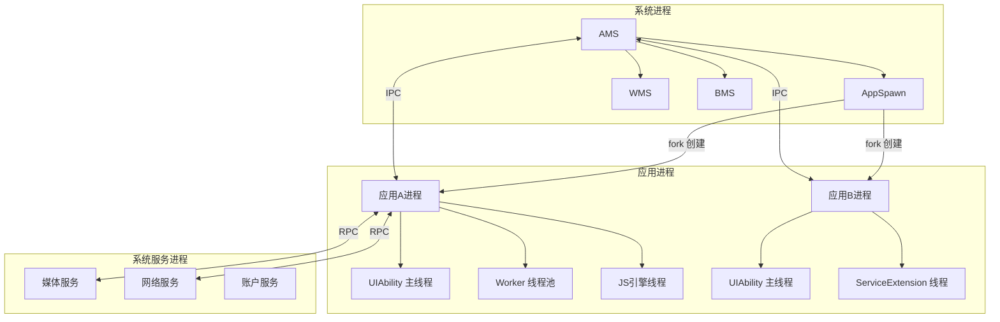
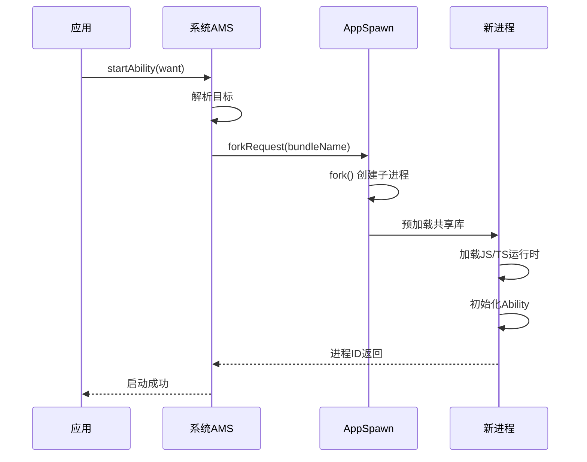
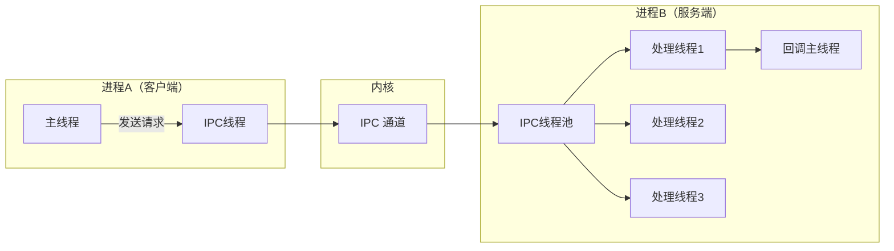
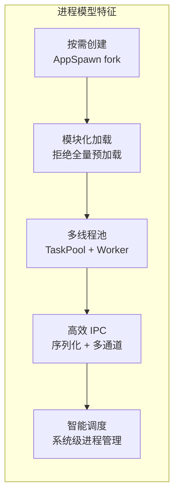

> **一句话概括**：鸿蒙进程模型采用"进程按需创建、线程池复用、IPC 多通道并行"的架构，通过 AppSpawn 管理应用进程生命周期，AMS 调度 Ability 分配，在微内核架构下实现高效进程间通信。

## 一、背景与意义

### 1.1 为什么进程模型重要？

在移动操作系统中，进程模型直接决定了三个关键指标：

1. **应用启动速度**——进程创建路径越短，启动越快
2. **系统资源利用率**——进程数量与内存开销成正比
3. **用户体验一致性**——后台进程的管理策略影响多任务切换

鸿蒙作为面向全场景（手机、平板、车机、电视、IoT）的操作系统，其进程模型需要满足：

- **极致轻量**：IoT 设备内存仅 128MB
- **多设备协同**：跨设备进程通信
- **安全隔离**：应用进程间严格隔离

相比于 Linux 的传统 fork 模型或 Android 的 Zygote 模型，鸿蒙采用了 **AppSpawn + 模块化进程设计**。

## 二、鸿蒙进程模型总览



### 2.1 关键概念

| 概念 | 说明 | 类比 Android |
|------|------|-------------|
| AppSpawn | 应用孵化器进程 | Zygote |
| Ability 进程 | 运行 Ability 的进程 | App Process |
| Extension 进程 | 运行 ExtensionAbility 的独立进程 | Service Process |
| IPC（进程间通信） | 鸿蒙内建 IPC 框架 | Binder |
| RPC（远程过程调用） | 跨设备通信机制 | AIDL |
| Musl | 轻量级 C 标准库 | Bionic |

## 三、进程创建与管理

### 3.1 AppSpawn：鸿蒙的"孵化器"

AppSpawn 是鸿蒙系统的**应用进程孵化器**，预加载了共享库和运行时环境。当 AMS 收到启动请求时，AppSpawn 通过 fork 创建新进程：



**与 Zygote 的对比**：

| 维度 | AppSpawn | Android Zygote |
|------|---------|---------------|
| 预加载 | 共享库 + 运行时 | Java 框架类 + 资源 |
| 进程创建 | fork | fork + 特殊处理 |
| 多进程复用 | 单 AppSpawn 多 fork | 单 Zygote 多 fork |
| 启动优化 | 模块化按需加载 | 全量预加载 |

### 3.2 进程类型

鸿蒙中的应用进程按功能分为几种类型：

```typescript
// module.json5 配置示例——进程类型影响
{
  "module": {
    "process": "com.example.main",    // 主进程
    "abilities": [...],
    "extensionAbilities": [
      {
        "name": "DownloadService",
        "process": "com.example.service", // 独立进程
        "type": "service"
      }
    ]
  }
}
```

| 进程类型 | 说明 | 内存预算 | 生命周期 |
|---------|------|---------|---------|
| 主进程 | UIAbility 运行进程 | 根据设备 | 随 Ability 创建/销毁 |
| Service 进程 | ExtensionAbility 进程 | 约 20MB | 后台存活 |
| Render 进程 | WebView 渲染专用 | 约 30MB | 按需创建 |
| 子进程 | Worker/Background 任务 | 约 10MB | 任务结束即销毁 |

## 四、进程间通信（IPC）

### 4.1 IPC 框架架构

鸿蒙的 IPC 框架基于 **序列化（Serialization）+ 消息通道** 实现：

```typescript
// IPC 客户端
import rpc from '@ohos.rpc';

class IpcClient {
  private proxy: rpc.IRemoteObject | null = null;

  async connectToService() {
    const want: Want = {
      bundleName: 'com.example.service',
      abilityName: 'DataService'
    };
    // 连接到远程服务
    const connection = this.context.connectServiceExtensionAbility(
      want,
      {
        onConnect: (elementName, remote) => {
          this.proxy = remote;
          console.info('IPC 连接成功');
        },
        onDisconnect: () => {
          this.proxy = null;
          console.info('IPC 连接断开');
        },
        onFailed: (code) => {
          console.error(`IPC 连接失败: ${code}`);
        }
      }
    );
  }

  async sendRequest(data: string): Promise<string> {
    if (!this.proxy) {
      throw new Error('未连接到服务');
    }

    // 构建请求数据
    const dataObj = rpc.MessageParcel.create();
    const reply = rpc.MessageParcel.create();
    const option = new rpc.MessageOption();

    dataObj.writeString(data);
    dataObj.writeInt(42);
    dataObj.writeBoolean(true);

    // 发送请求（code=1 表示查询操作）
    await this.proxy.sendMessageRequest(1, dataObj, reply, option);

    const result = reply.readString();
    dataObj.reclaim();
    reply.reclaim();

    return result;
  }
}

// IPC 服务端
class DataServiceStub extends rpc.RemoteObject {
  constructor(des: string) {
    super(des);
  }

  onRemoteRequest(code: number, data: rpc.MessageParcel,
    reply: rpc.MessageParcel, option: rpc.MessageOption): boolean {

    switch (code) {
      case 1: // 查询
        const query = data.readString();
        const num = data.readInt();
        const flag = data.readBoolean();
        // 处理请求
        reply.writeString(`处理结果: ${query}`);
        return true;

      case 2: // 写入
        const payload = data.readString();
        // 处理写入
        reply.writeString('写入成功');
        return true;

      default:
        reply.writeString('未知操作');
        return false;
    }
  }
}
```

### 4.2 IPC 的线程模型

鸿蒙 IPC 使用**独立的线程池**处理请求：



### 4.3 IPC 的数据序列化

IPC 传输的数据需要序列化为字节流：

```typescript
// 复杂对象的序列化
class UserProfile {
  name: string;
  age: number;
  tags: string[];
  metadata: Record<string, string>;

  marshalling(parcel: rpc.MessageParcel): boolean {
    parcel.writeString(this.name);
    parcel.writeInt(this.age);
    parcel.writeStringArray(this.tags);

    // 写入 Map 类型
    const keys = Object.keys(this.metadata);
    parcel.writeInt(keys.length);
    keys.forEach(key => {
      parcel.writeString(key);
      parcel.writeString(this.metadata[key]);
    });

    return true;
  }

  unmarshalling(parcel: rpc.MessageParcel): boolean {
    this.name = parcel.readString();
    this.age = parcel.readInt();
    this.tags = parcel.readStringArray();

    // 读取 Map
    const size = parcel.readInt();
    this.metadata = {};
    for (let i = 0; i < size; i++) {
      const key = parcel.readString();
      const value = parcel.readString();
      this.metadata[key] = value;
    }

    return true;
  }
}
```

## 五、线程模型与调度

### 5.1 应用进程内的线程架构

```typescript
// 主线程示例
@Entry
@Component
struct ThreadDemo {
  @State data: string = '';

  aboutToAppear() {
    // 主线程：执行 UI 更新和轻量计算
    this.data = '主线程数据';

    // 方式一：使用 Worker 创建独立线程
    this.startWorkerTask();
  }

  private startWorkerTask() {
    // 创建 Worker
    const worker = new Worker('entry/ets/workers/DataProcessor.ts');
    // 接收 Worker 返回的结果
    worker.onmessage = (event: MessageEvent) => {
      this.data = event.data as string;
    };
    // 发送数据给 Worker
    worker.postMessage({ data: '处理请求', type: 'transform' });
  }

  build() {
    Column() {
      Text(this.data).fontSize(18)
      Button('耗时操作')
        .onClick(() => {
          // 错误做法：在主线程执行耗时任务
          // const result = this.heavyComputation();
          // this.data = result;

          // 正确做法：交由 Worker 处理
          const worker = new Worker('entry/ets/workers/HeavyWorker.ts');
          worker.postMessage({ task: 'computation', params: { n: 1000000 } });
          worker.onmessage = (e) => {
            this.data = `计算结果: ${e.data}`;
            worker.terminate();
          };
        })
    }
  }
}
```

### 5.2 鸿蒙线程池模型

鸿蒙在每个应用进程中维护了多个线程池，各自管理不同职责：

```mermaid
flowchart TD
    subgraph "应用进程线程架构"
        A[主线程\nUI渲染+事件分发] --> B[任务池\n定时器/网络请求]
        A --> C[IPC线程池\n进程间通信]
        A --> D[Worker线程\n独立JS运行环境]
        A --> E[渲染线程\n(WebView)\n独立GPU上下文]
    end
```

| 线程类型 | 数量 | 职责 | 能否操作 UI |
|---------|------|------|-----------|
| 主线程 | 1 | UI 渲染、事件分发、布局 | ✅ 可以 |
| TaskPool | 动态（默认 3~5） | 网络请求、计算、I/O | ❌ 不可以 |
| Worker | 按需创建 | 独立 JS 运行时 | ❌ 不可以 |
| IPC 线程 | 2~4 | 进程间消息收发 | ❌ 不可以 |
| Render 线程 | 1~2 | WebView 渲染 | ❌ 不可以 |

### 5.3 TaskPool vs Worker

鸿蒙提供了两种多线程方案，它们的区别如下：

**TaskPool（轻量智能）**：

```typescript
import taskpool from '@ohos.taskpool';

// 定义任务函数
@Concurrent
function heavyCalculate(n: number): number {
  let result = 0;
  for (let i = 0; i < n; i++) {
    result += Math.sqrt(i);
  }
  return result;
}

async function runTaskPool() {
  // 自动分配到线程池
  const task = new taskpool.Task(heavyCalculate, 10000000);
  const result = await taskpool.execute(task);
  console.info(`TaskPool 结果: ${result}`);
}
```

**Worker（独立隔离）**：

```typescript
// Worker 文件: Worker.ts
workerPort.onmessage = (event: MessageEvent) => {
  const data = event.data;
  // 执行耗时操作
  const result = processData(data);
  workerPort.postMessage(result);
};

// 主线程使用
const worker = new Worker('entry/ets/workers/Worker.ts');
worker.postMessage({ /* ... */ });
worker.onmessage = (e) => {
  // 处理结果
  worker.terminate(); // 用完后释放
};
```

| 对比项 | TaskPool | Worker |
|-------|---------|--------|
| 创建开销 | 低（复用线程池） | 中（创建新线程） |
| 独立上下文 | 共享进程上下文 | 独立 JS 引擎实例 |
| 数据传递 | 结构化克隆 | 结构化克隆 |
| 生命周期 | 自动管理 | 手动管理 |
| 适用场景 | 频繁调用的小任务 | 长时间运行的独立任务 |

## 六、实战案例：图片批量处理应用

```typescript
// 主 UI
@Entry
@Component
struct ImageProcessor {
  @State images: string[] = [];
  @State processingStatus: string = '就绪';
  @State progress: number = 0;

  build() {
    Column({ space: 16 }) {
      Text('图片批量处理').fontSize(22).fontWeight(FontWeight.Bold)
      Text(this.processingStatus)
      Progress({ value: this.progress, total: 100 })
        .width('100%')

      Button('选择并处理图片')
        .onClick(() => {
          this.processImages();
        })

      // 显示处理结果
      ForEach(this.images, (img: string) => {
        Image(img).width(80).height(80)
      }, (img: string) => img)
    }
  }

  private async processImages() {
    this.processingStatus = '正在处理...';

    // 使用 TaskPool 进行批量处理
    const tasks: taskpool.Task[] = [];
    const filePaths = ['/data/img1.jpg', '/data/img2.jpg', '/data/img3.jpg'];

    for (const path of filePaths) {
      const task = new taskpool.Task(compressImage, path);
      tasks.push(task);
    }

    // 并行执行所有任务
    const results: string[] = await Promise.all(
      tasks.map(t => taskpool.execute(t))
    );

    this.images = results;
    this.progress = 100;
    this.processingStatus = '处理完成';
  }
}

// 在 TaskPool 中执行的任务
@Concurrent
function compressImage(path: string): string {
  // 模拟图片压缩
  const compressedPath = '/cache/compressed_' + path.split('/').pop();
  // ... 压缩逻辑
  return compressedPath;
}

// 使用 ServiceExtension 在后台处理大任务
export default class BatchProcessService extends ServiceExtensionAbility {
  async onRequest(want: Want, startId: number) {
    const taskType = want.parameters?.taskType as string;

    if (taskType === 'batch_compress') {
      const files = want.parameters?.files as string[];
      const results = await this.compressAll(files);

      // 通过 EventHub 通知 UI 结果
      AppStorage.set('compressResults', JSON.stringify(results));
    }
  }

  private async compressAll(files: string[]): Promise<string[]> {
    // 使用 TaskPool 并行压缩
    const tasks = files.map(f =>
      new taskpool.Task(compressImage, f)
    );
    return await Promise.all(
      tasks.map(t => taskpool.execute(t))
    );
  }
}
```

## 七、高频面试题解析

### Q1：鸿蒙应用进程如何被创建？和 Android 的 Zygote 有何不同？

**答：** 鸿蒙使用 AppSpawn 创建进程。当 AMS 收到启动请求时，AppSpawn fork 出子进程，预加载共享库和 JS 运行时。与 Android 的 Zygote 相比，主要区别：1）预加载内容不同——Zygote 预加载 Java 框架，AppSpawn 预加载 Ark 引擎和共享库；2）启动路径更短——鸿蒙的模块化设计减少了 fork 后需要加载的内容；3）支持多设备——AppSpawn 的设计考虑了 IoT 等低内存设备。

### Q2：为什么不能在 Worker 中操作 UI？

**答：** 这是所有现代 UI 框架的共同设计。HarmonyOS/ArkTS 的 UI 渲染是单线程的——所有布局、渲染、事件处理都在主线程中顺序执行。如果在 Worker 线程中修改 UI 状态，会导致渲染状态不一致。Worker 中的操作通过 `postMessage` 通知主线程更新状态，由主线程触发 UI 刷新。

### Q3：TaskPool 和 Worker 应该怎么选？

**答：** 简单的指导原则：如果任务是**轻量频繁**（如数据处理、网络请求的中间处理），用 TaskPool——它复用线程池，创建开销低；如果任务是**重量级独立**（如独立的业务模块、独立的状态机），用 Worker——它有独立的 JS 引擎上下文，不会受到主线程 GC 等影响。另外，Worker 需要手动管理生命周期（terminate），而 TaskPool 自动管理。

### Q4：IPC 通信的性能瓶颈在哪里？

**答：** IPC 的性能瓶颈通常有三个：1）**序列化/反序列化**——每次传递都需要把对象转为字节流，复杂对象转换耗时；2）**拷贝成本**——跨进程传递涉及内核空间的拷贝操作；3）**线程切换**——IPC 请求涉及发送线程、内核线程、接收线程的上下文切换。优化原则：减少 IPC 调用次数，批量传递数据，复杂数据结构用文件共享代替 IPC。

### Q5：鸿蒙的进程保活机制是怎样的？

**答：** 鸿蒙的进程管理遵循"资源分配+行为管控"模式。后台进程存活受系统策略控制：1）前台进程优先保障资源；2）ServiceExtension 可以后台存活，但受 CPU 时间片限制；3）不允许第三方应用使用传统保活手段（开机启动、定时唤醒等）；4）系统会回收内存压力下的后台进程，回收顺序：无服务的后台进程 > 有服务的后台进程 > 前台进程。**保活的最佳策略是：用正当的后台能力（ServiceExtension）完成必要任务，不浪费用户电量和内存。**

## 八、总结与扩展

鸿蒙的进程模型吸收了 Linux 传统和移动操作系统的经验，形成了适合全场景的设计：



**核心设计哲学**：
- 不浪费：AppSpawn 按需 fork，IoT 设备不加载冗余模块
- 不卡顿：主线程只干 UI 的事，其余交给线程池
- 不打扰：后台进程严格管理，用户感知不到后台占用

与 Android 相比，鸿蒙的进程模型更轻量化、更模块化。对于开发者而言，理解并善用 TaskPool、Worker 和 IPC 机制，就能在鸿蒙平台上写出高性能的后台能力。

---

**扩展阅读：**
- HarmonyOS 多线程开发指南
- TaskPool 与 Worker 开发详解
- IPC 序列化性能优化
- 分布式场景下的跨设备 RPC
