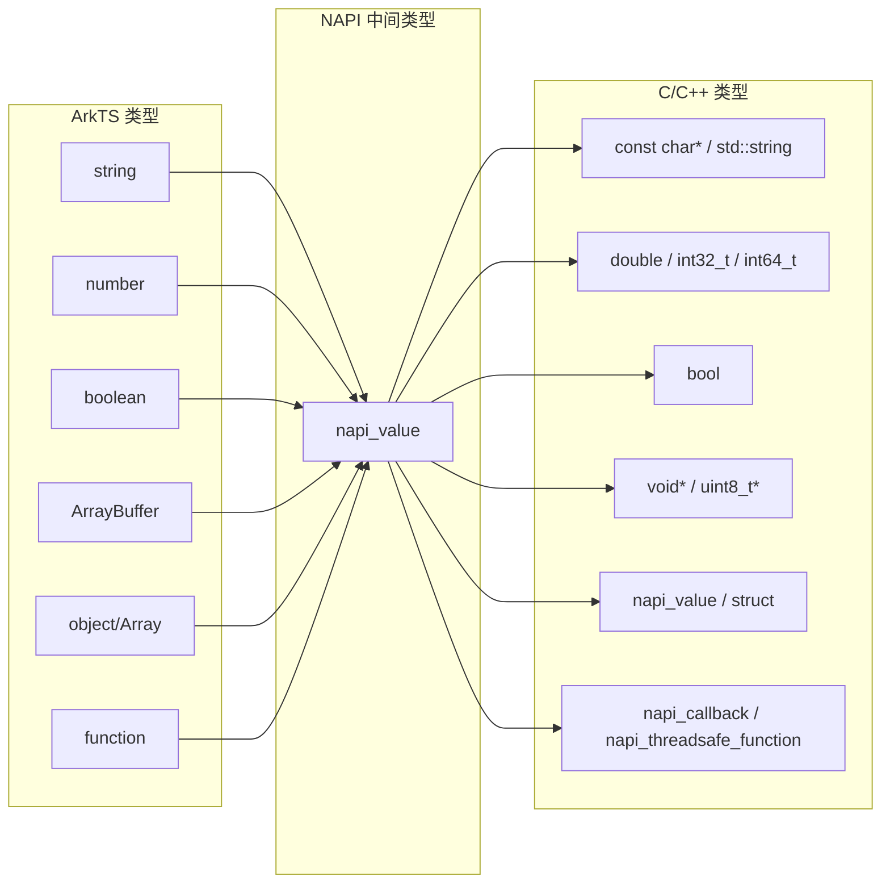
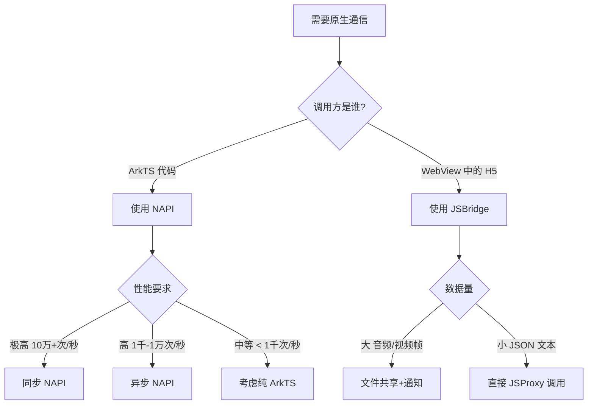

> **一句话概括**：鸿蒙 ArkTS 通过 NAPI（Native API）实现与 C/C++ 原生代码的高性能通信，通过 JSBridge 实现与 Web 内容的互通，两条路径分别为计算密集场景和混合开发场景提供了桥梁。

## 一、背景与意义

### 1.1 为什么需要原生通信？

ArkTS 基于 TypeScript 运行在 Ark 引擎上，性能已经相当不错——但对于某些场景，纯 JS/TS 无法满足需求：

| 场景 | 纯 ArkTS 的瓶颈 | 原生方案 |
|------|---------------|---------|
| 视频编解码 | JS 处理像素帧太慢 | 调用 C++ FFmpeg 库 |
| 图像处理 | 逐像素操作性能不足 | 用 C/C++ OpenCV 处理 |
| 蓝牙通信 | JS 事件循环不适合高频 I/O | C++ 原生 Socket |
| 3D 渲染 | JS 引擎无法直通 GPU | C++ OpenGL/Vulkan |
| 加密算法 | JS 大数运算性能低 | OpenSSL 原生库 |
| AI 推理 | JS 处理张量效率低 | C++ ONNX/TensorFlow Lite |

鸿蒙为此提供了两条原生通信路径：

1. **NAPI（Native API）**：ArkTS ↔ C/C++，高性能的底层桥接
2. **JSBridge**：ArkTS ↔ Web（H5），用于 WebView 混合开发

## 二、NAPI：高性能原生桥接

### 2.1 NAPI 架构概览

```mermaid
flowchart TD
    subgraph "ArkTS 层"
        A[ArkTS 代码] -->|import nativeModule| B[@ohos.napi 桥接]
    end
    
    subgraph "NAPI 层"
        B --> C[NAPI 框架]
        C --> D[类型转换\nnapi_value ↔ C类型]
    end
    
    subgraph "原生层"
        D --> E[C/C++ 原生函数]
        E --> F[系统库/第三方库]
        F --> G[OpenGL/FFmpeg/OpenSSL…]
    end
```

### 2.2 NAPI 节点绑定实现

创建一个 NAPI 模块分为两步：编写 C/C++ 代码和编译为 `.so` 库。

**步骤 1：C++ 原生代码**

```cpp
// native/hello.cpp
#include "napi/native_api.h"

// 需要暴露给 ArkTS 的原生函数
static napi_value HelloWorld(napi_env env, napi_callback_info info) {
    napi_value result;
    // 创建字符串返回值 "Hello from Native!"
    napi_create_string_utf8(env, "Hello from Native!", NAPI_AUTO_LENGTH, &result);
    return result;
}

// 加法函数——接收两个参数
static napi_value Add(napi_env env, napi_callback_info info) {
    size_t argc = 2;
    napi_value args[2];
    napi_get_cb_info(env, info, &argc, args, nullptr, nullptr);

    // 解析参数
    double value1, value2;
    napi_get_value_double(env, args[0], &value1);
    napi_get_value_double(env, args[1], &value2);

    // 计算结果
    napi_value sum;
    napi_create_double(env, value1 + value2, &sum);
    return sum;
}

// 图像处理函数——接收缓冲区
static napi_value ProcessImage(napi_env env, napi_callback_info info) {
    size_t argc = 2;
    napi_value args[2];
    napi_get_cb_info(env, info, &argc, args, nullptr, nullptr);

    // 获取 ArrayBuffer（图像数据）
    void* bufferData;
    size_t bufferSize;
    napi_get_arraybuffer_info(env, args[0], &bufferData, &bufferSize);

    // 获取参数（处理参数）
    int32_t quality;
    napi_get_value_int32(env, args[1], &quality);

    // 调用 C++ 图像处理库
    // processImageBuffer(bufferData, bufferSize, quality);

    napi_value result;
    napi_create_int32(env, bufferSize, &result);
    return result;
}

// 模块初始化——注册所有导出函数
EXTERN_C_START
static napi_value Init(napi_env env, napi_value exports) {
    napi_property_descriptor desc[] = {
        { "helloWorld", nullptr, HelloWorld, nullptr, nullptr, nullptr, napi_default, nullptr },
        { "add", nullptr, Add, nullptr, nullptr, nullptr, napi_default, nullptr },
        { "processImage", nullptr, ProcessImage, nullptr, nullptr, nullptr, napi_default, nullptr },
    };
    napi_define_properties(env, exports, sizeof(desc) / sizeof(desc[0]), desc);
    return exports;
}
EXTERN_C_END

// 模块注册宏
NAPI_MODULE(hello_native, Init)
```

**步骤 2：CMakeLists 编译配置**

```cmake
# native/CMakeLists.txt
cmake_minimum_required(VERSION 3.4.1)
project(hello_native)

set(NATIVERENDER_ROOT_PATH ${CMAKE_CURRENT_SOURCE_DIR})

add_library(hello_native SHARED hello.cpp)
target_include_directories(hello_native PRIVATE
    ${NATIVERENDER_ROOT_PATH}
    ${NATIVERENDER_ROOT_PATH}/include
)
target_link_libraries(hello_native PUBLIC
    ace_napi.z
)
```

**步骤 3：ArkTS 调用原生模块**

```typescript
// ets/pages/NativeDemo.ets
import helloNative from 'libhello_native.so';

@Entry
@Component
struct NativeDemo {
  @State message: string = '';
  @State calcResult: number = 0;
  @State processResult: string = '';

  build() {
    Column({ space: 16 }) {
      Text('NAPI 原生通信演示').fontSize(22).fontWeight(FontWeight.Bold)

      Button('调用原生 HelloWorld')
        .onClick(() => {
          this.message = helloNative.helloWorld() as string;
        })
      Text(this.message)

      Button('调用原生加法 3.14 + 2.86')
        .onClick(() => {
          this.calcResult = helloNative.add(3.14, 2.86) as number;
        })
      Text(`结果: ${this.calcResult}`)

      Button('图像处理（模拟）')
        .onClick(() => {
          // 创建图像缓冲区
          const buffer = new ArrayBuffer(1024 * 1024); // 1MB 模拟图像
          const result = helloNative.processImage(buffer, 80);
          this.processResult = `处理了 ${result} 字节`;
        })
      Text(this.processResult)

      Divider()
      Text('性能对比').fontSize(18).fontWeight(FontWeight.Bold)
      Button('JS 计算 100万次平方根')
        .onClick(() => this.benchmarkJS())
      Button('原生计算 100万次平方根')
        .onClick(() => this.benchmarkNative())
    }
    .padding(24)
    .width('100%')
  }

  private benchmarkJS() {
    const start = Date.now();
    for (let i = 0; i < 1000000; i++) {
      Math.sqrt(i);
    }
    const elapsed = Date.now() - start;
    this.processResult = `JS 耗时: ${elapsed}ms`;
  }

  private benchmarkNative() {
    // 调用原生平方根计算
    const start = Date.now();
    helloNative.batchSqrt(1000000);
    const elapsed = Date.now() - start;
    this.processResult = `原生耗时: ${elapsed}ms`;
  }
}
```

### 2.3 NAPI 数据类型映射



### 2.4 异步 NAPI——不阻塞主线程

同步 NAPI 调用会阻塞 ArkTS 主线程，对于耗时操作必须使用异步模式：

```cpp
// 异步 NAPI 模式
struct AsyncData {
    napi_async_work work;
    napi_deferred deferred;
    int input;
    int result;
};

static napi_value AsyncCompute(napi_env env, napi_callback_info info) {
    size_t argc = 1;
    napi_value args[1];
    napi_get_cb_info(env, info, &argc, args, nullptr, nullptr);

    // 解析输入参数
    int input;
    napi_get_value_int32(env, args[0], &input);

    // 创建 Promise（async 支持）
    napi_value promise;
    auto* data = new AsyncData();
    napi_create_promise(env, &data->deferred, &promise);
    data->input = input;

    // 创建异步工作项
    napi_create_async_work(env, nullptr, nullptr,
        // 执行函数（在线程池中运行）
        [](napi_env env, void* data) {
            auto* asyncData = static_cast<AsyncData*>(data);
            // 耗时计算
            asyncData->result = 0;
            for (int i = 0; i < asyncData->input; i++) {
                asyncData->result += i;
            }
        },
        // 完成回调（在主线程中运行）
        [](napi_env env, napi_status status, void* data) {
            auto* asyncData = static_cast<AsyncData*>(data);
            napi_value result;
            napi_create_int32(env, asyncData->result, &result);
            napi_resolve_deferred(env, asyncData->deferred, result);
            napi_delete_async_work(env, asyncData->work);
            delete asyncData;
        },
        data, &data->work
    );

    // 将异步工作加入队列
    napi_queue_async_work(env, data->work);

    // 返回 Promise
    return promise;
}
```

ArkTS 端调用：

```typescript
async function runAsyncCompute() {
  try {
    const result = await helloNative.asyncCompute(10000000);
    console.info(`异步计算结果: ${result}`);
  } catch (err) {
    console.error(`计算失败: ${err}`);
  }
}
```

## 三、JSBridge：Web 与原生通信

### 3.1 JSBridge 架构

JSBridge 用于 WebView 中 H5 页面与鸿蒙原生代码之间的通信：

```typescript
@Entry
@Component
struct HybridPage {
  private controller: WebviewController = new WebviewController();

  aboutToAppear() {
    // 注册 JSBridge 处理器
    this.controller.registerJavaScriptProxy({
      // 原生对象方法——可由 H5 JS 调用
      getDeviceInfo: () => {
        return JSON.stringify({
          platform: 'HarmonyOS',
          version: '5.0',
          language: 'zh-CN'
        });
      },
      takePhoto: () => {
        // 调用原生摄像头
        this.openCamera();
      },
      shareToSocial: (content: string) => {
        // 调用原生分享功能
        this.shareContent(content);
      },
      getLocation: (callbackId: string) => {
        // 异步回调模式
        this.getCurrentLocation((lat, lng) => {
          // 通过 evaluateJavaScript 将结果回传
          this.controller.evaluateJavaScript(
            `window.onLocationResult('${callbackId}', ${lat}, ${lng})`
          );
        });
      }
    }, 'nativeBridge', ['getDeviceInfo', 'takePhoto', 'shareToSocial', 'getLocation']);
  }

  build() {
    Column() {
      Web({ src: $rawfile('index.html'), controller: this.controller })
        .width('100%')
        .layoutWeight(1)
        .javaScriptAccess(true)
        .onPageEnd(() => {
          console.info('H5 页面加载完成');
        })

      // 原生控制栏
      Row({ space: 8 }) {
        Button('←')
          .onClick(() => {
            if (this.controller.accessStep()) {
              this.controller.backward();
            }
          })
        Button('刷新')
          .onClick(() => { this.controller.refresh(); })
      }
      .padding(8)
      .backgroundColor('#F5F5F5')
    }
  }

  private openCamera() { /* 调用原生相机 */ }
  private shareContent(text: string) { /* 调用系统分享 */ }
  private getCurrentLocation(callback: (lat: number, lng: number) => void) {
    // 获取位置后返回
    callback(22.5431, 114.0579);
  }
}
```

### 3.2 H5 端调用原生

```html
<!-- web/index.html -->
<!DOCTYPE html>
<html>
<head>
  <meta charset="utf-8">
  <title>混合页面</title>
</head>
<body>
  <div id="app">
    <h1>鸿蒙 JSBridge 演示</h1>
    
    <button onclick="getInfo()">获取设备信息</button>
    <pre id="infoOutput"></pre>
    
    <button onclick="openCamera()">打开相机</button>
    
    <button onclick="share()">分享当前页面</button>
    
    <button onclick="requestLocation()">获取位置</button>
    <p id="locationOutput"></p>
  </div>
  
  <script>
    // 调用原生方法
    function getInfo() {
      // H5 端调用 nativeBridge 对象
      const info = JSON.parse(nativeBridge.getDeviceInfo());
      document.getElementById('infoOutput').textContent = 
        `平台: ${info.platform}, 版本: ${info.version}, 语言: ${info.language}`;
    }
    
    function openCamera() {
      nativeBridge.takePhoto();
    }
    
    function share() {
      nativeBridge.shareToSocial(document.title);
    }
    
    function requestLocation() {
      // 生成回调ID
      const callbackId = 'loc_' + Date.now();
      // 注册回调
      window.onLocationResult = function(id, lat, lng) {
        if (id === callbackId) {
          document.getElementById('locationOutput').textContent = 
            `纬度: ${lat}, 经度: ${lng}`;
        }
      };
      // 调用原生方法
      nativeBridge.getLocation(callbackId);
    }

    // 页面卸载时清理
    window.addEventListener('beforeunload', function() {
      delete window.onLocationResult;
    });
  </script>
</body>
</html>
```

### 3.3 JSBridge vs NAPI 的选择



## 四、实战案例：高性能图像滤镜应用

### 4.1 原生滤镜库

```cpp
// native/filter.cpp
#include <cmath>
#include <algorithm>
#include "napi/native_api.h"

struct Color {
    uint8_t r, g, b, a;
};

// 灰度滤镜
void applyGrayscale(Color* pixels, size_t count) {
    for (size_t i = 0; i < count; i++) {
        uint8_t gray = static_cast<uint8_t>(
            0.299f * pixels[i].r + 0.587f * pixels[i].g + 0.114f * pixels[i].b
        );
        pixels[i].r = gray;
        pixels[i].g = gray;
        pixels[i].b = gray;
    }
}

// 怀旧滤镜（sepia）
void applySepia(Color* pixels, size_t count) {
    for (size_t i = 0; i < count; i++) {
        uint8_t r = pixels[i].r;
        uint8_t g = pixels[i].g;
        uint8_t b = pixels[i].b;
        pixels[i].r = std::min(255, static_cast<int>(0.393f * r + 0.769f * g + 0.189f * b));
        pixels[i].g = std::min(255, static_cast<int>(0.349f * r + 0.686f * g + 0.168f * b));
        pixels[i].b = std::min(255, static_cast<int>(0.272f * r + 0.534f * g + 0.131f * b));
    }
}

// 模糊（简单均值）
void applyBlur(Color* pixels, int width, int height) {
    std::vector<Color> output(pixels, pixels + width * height);
    for (int y = 1; y < height - 1; y++) {
        for (int x = 1; x < width - 1; x++) {
            int idx = y * width + x;
            int r = 0, g = 0, b = 0;
            for (int dy = -1; dy <= 1; dy++) {
                for (int dx = -1; dx <= 1; dx++) {
                    int nidx = (y + dy) * width + (x + dx);
                    r += output[nidx].r;
                    g += output[nidx].g;
                    b += output[nidx].b;
                }
            }
            pixels[idx].r = r / 9;
            pixels[idx].g = g / 9;
            pixels[idx].b = b / 9;
        }
    }
}

// NAPI 导出
static napi_value ApplyFilter(napi_env env, napi_callback_info info) {
    size_t argc = 3;
    napi_value args[3];
    napi_get_cb_info(env, info, &argc, args, nullptr, nullptr);

    // 参数1：ArrayBuffer（像素数据）
    void* bufferData;
    size_t bufferSize;
    napi_get_arraybuffer_info(env, args[0], &bufferData, &bufferSize);

    // 参数2：滤镜类型
    int32_t filterType;
    napi_get_value_int32(env, args[1], &filterType);

    // 参数3：尺寸信息（对象）
    napi_value sizeObj = args[2];
    int32_t width, height;
    napi_get_named_property(env, sizeObj, "width", &args[0]);
    napi_get_value_int32(env, args[0], &width);
    napi_get_named_property(env, sizeObj, "height", &args[0]);
    napi_get_value_int32(env, args[0], &height);

    auto* pixels = static_cast<Color*>(bufferData);
    size_t pixelCount = bufferSize / sizeof(Color);

    switch (filterType) {
        case 0: applyGrayscale(pixels, pixelCount); break;
        case 1: applySepia(pixels, pixelCount); break;
        case 2: applyBlur(pixels, width, height); break;
    }

    napi_value result;
    napi_get_boolean(env, true, &result);
    return result;
}
```

### 4.2 ArkTS 调用滤镜

```typescript
import filterNative from 'libfilter_native.so';

@Entry
@Component
struct FilterApp {
  @State sourceImage: PixelMap | null = null;
  @State filteredImage: PixelMap | null = null;
  @State currentFilter: string = '原图';
  @State processing: boolean = false;

  build() {
    Column() {
      Text('原生图像滤镜').fontSize(22).fontWeight(FontWeight.Bold)

      Image(this.sourceImage)
        .width(300)
        .height(300)
        .margin(16)

      Row({ space: 8 }) {
        Button('灰度').onClick(() => this.applyFilter(0))
        Button('怀旧').onClick(() => this.applyFilter(1))
        Button('模糊').onClick(() => this.applyFilter(2))
        Button('重置').onClick(() => this.resetFilter())
      }

      Text(this.currentFilter)
        .fontSize(14)
        .fontColor(Color.Gray)

      if (this.processing) {
        LoadingProgress()
      }
    }
    .padding(20)
    .width('100%')
  }

  private async applyFilter(type: number) {
    this.processing = true;
    try {
      // 从 PixelMap 获取像素缓冲
      const buffer = await this.sourceImage!.readPixelsToBuffer(
        new ArrayBuffer(this.sourceImage!.width *
          this.sourceImage!.height * 4)
      );

      // 调用原生滤镜
      filterNative.applyFilter(
        buffer,
        type,
        { width: this.sourceImage!.width,
          height: this.sourceImage!.height }
      );

      // 创建新的 PixelMap
      const opts = new image.PixelMapOpts();
      opts.width = this.sourceImage!.width;
      opts.height = this.sourceImage!.height;
      this.filteredImage = await image.createPixelMapFromBuffer(
        buffer as ArrayBuffer, opts
      );
    } finally {
      this.processing = false;
    }
  }
}
```

## 五、高频面试题解析

### Q1：NAPI 和 JSBridge 的本质区别是什么？

**答：** NAPI 是**同进程内的函数调用**——ArkTS 和 C/C++ 运行在同一进程中，通过函数指针直接调用。JSBridge 是**跨运行时环境的消息传递**——ArkTS 主线程和 WebView 中的 JavaScript 引擎是两个独立的运行时，通过序列化的消息通信。因此 NAPI 的延迟是纳秒级的，JSBridge 是毫秒级的。

### Q2：什么时候应该使用 NAPI？

**答：** 三个指标：1）**计算密集型**——CPU 密集型操作（编解码、加密、滤波）；2）**延迟敏感**——需要在几毫秒内完成的操作（音频处理、实时渲染）；3）**复用现有库**——已有成熟 C/C++ 库不想用 ArkTS 重写。对于简单逻辑（如字符串拼接），NAPI 带来的跨语言调用开销可能得不偿失。

### Q3：NAPI 能否直接调用系统 API？

**答：** 可以。NAPI 运行在 native 层面，可以直接调用 POSIX API、OpenGL ES、Vulkan 等系统级接口。但需要注意：直接调用系统 API 会绕过鸿蒙的安全框架，如果涉及敏感权限（如文件系统、网络），建议通过 ArkTS 框架的 API 调用，而不是在 Native 层直接操作。

### Q4：大量数据如何在 ArkTS 和 Native 间高效传递？

**答：** 有两种策略：1）**ArrayBuffer 不拷贝**——传递 ArrayBuffer 时，NAPI 不拷贝数据，直接传递内存指针，这是最高效的方式；2）**共享内存**——使用 `napi_create_external_arraybuffer` 创建由 Native 管理内存的 ArrayBuffer，ArkTS 端直接读写。对于超大文件（视频、大图），建议用文件路径代替内存传递。

### Q5：JSBridge 的安全性如何保障？

**答：** JSBridge 的安全需要多层保障：1）`registerJavaScriptProxy` 只暴露必要的方法，不暴露整个原生对象；2）对 H5 传入的参数进行严格类型校验和边界检查；3）敏感操作（拍照、支付）必须走原生 UI 确认；4）不信任 H5 端的任何回调数据。**核心原则：H5 是"不可信来源"，所有传给原生层的参数都要校验。**

## 六、总结与扩展

鸿蒙的原生通信体系可以用一句话概括：**"NAPI 贴身、JSBridge 搭桥"**。

- **NAPI** 是 ArkTS 和 C/C++ 之间的高速通道，适合计算密集场景
- **JSBridge** 是 ArkTS 和 Web 之间的消息通道，适合混合开发场景

两个通道都充分考虑了异步模式——NAPI 的 `napi_create_async_work` 和 JSBridge 的 `evaluateJavaScript` 都保证了主线程的流畅运行。

在实际开发中，选择路径的决策顺序为：
1. 能否纯 ArkTS 实现？→ 能，不动原生
2. 需要复用已有 C/C++ 库？→ NAPI
3. 需要 H5 与原生互调？→ JSBridge
4. 以上都不满足？→ 考虑重构架构

---

**扩展阅读：**
- HarmonyOS NAPI 开发完整指南
- napi-glm 与高性能图形运算
- WebView 与 JSBridge 安全规范
- 鸿蒙 Native 开发入门：CMake + C/C++
